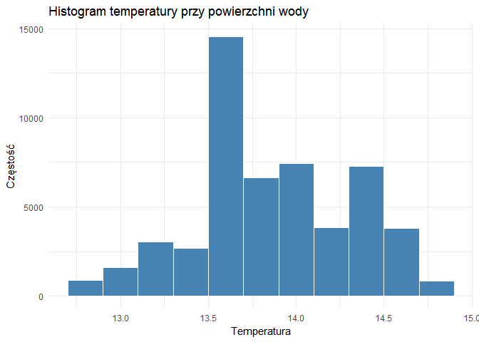
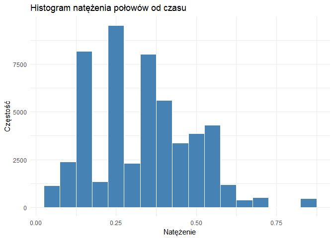
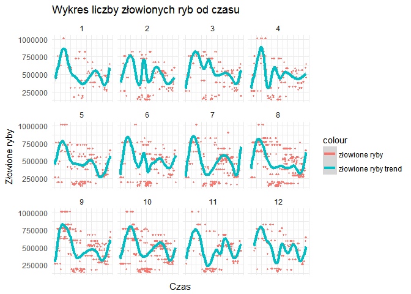
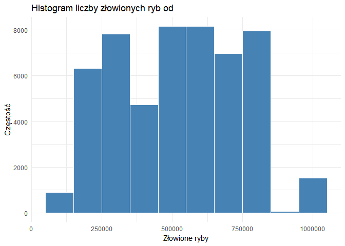
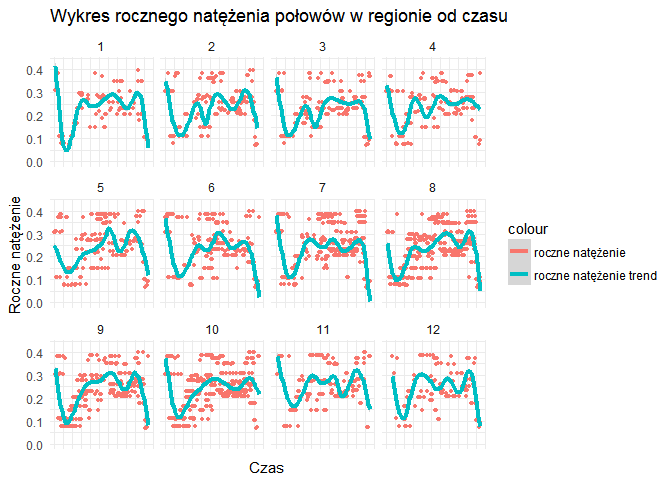
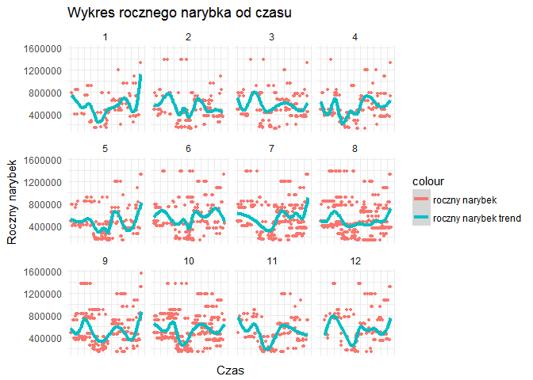
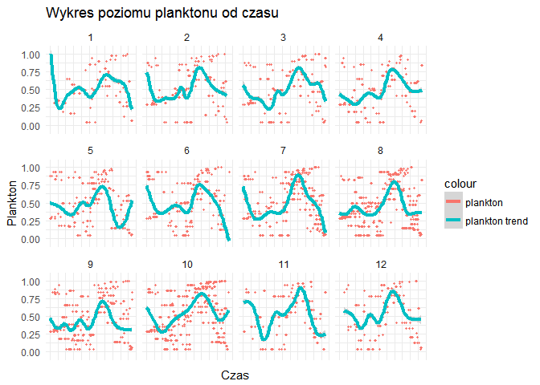
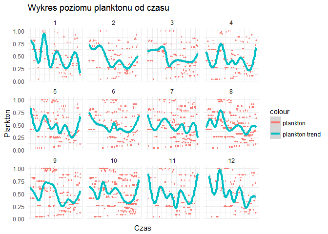
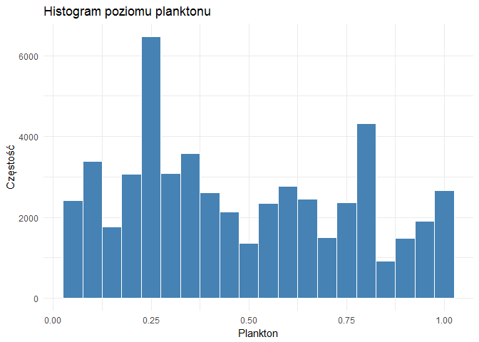
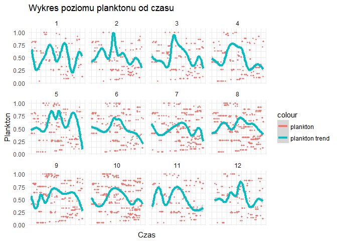

# Raport śledzi
Adam Chojan  
`r format(Sys.time(), '%d %B, %Y')`  


#Wprowadzenie
Tu będzie krótki opis

#Biblioteki

```r
library(knitr)
library(dplyr)
library(ggplot2)
library(hexbin)
library(plotly)
library(reshape2)
library(mice)
library(tidyr)
```


##Wczytanie danych
Dane zostały wczytane z pliku csv znajdującego się lokalnie na dysku do typu data frame. Przy wczytaniu ustawiono tyo dla wszystkich kolumn na numerci poza kolumnami X oraz xmonth - dla nich ustawiono typ integer. Dokonano również zmiany znaków symbolizujących brakujące dane w zestawie - ? na symbol NA w celu ułatwienia późniejszych operacji podczas analizy wartości brakujących. Ostatecznie dokonano konwersji na typ df_tbl pakietu dplyr.

Dane zostały pobrane ze strony: (http://www.cs.put.poznan.pl/dbrzezinski/teaching/zed/sledzie.csv)

```r
mydata = read.csv("sledzie.csv",  colClasses = c("integer","numeric","numeric","numeric","numeric","numeric","numeric","numeric","numeric","numeric","numeric","numeric","numeric","numeric","integer","numeric"),na.strings = c("NA","?"))
df <- data.frame(mydata)
my_df <- tbl_df(df)
```

#Wstępne rozpoznanie
##Ogólne statystyki dla danych
Dane na, których oparto analizy dotyczą połowu śledzi oceanicznych wyławianych w Europie na przestrzeni 60 lat. Dane zostały zebrane podczas połowów komercyjnych. Do badań brano losowo od 50 do 100 sztuk trzyletnich śledzi.

Table: Tabela podsumująca zbiór danych

           X             length         cfin1             cfin2             chel1            chel2            lcop1              lcop2             fbar             recr              cumf             totaln             sst             sal            xmonth            nao         
---  --------------  -------------  ----------------  ----------------  ---------------  ---------------  -----------------  ---------------  ---------------  ----------------  ----------------  ----------------  --------------  --------------  ---------------  -----------------
     Min.   :    0   Min.   :19.0   Min.   : 0.0000   Min.   : 0.0000   Min.   : 0.000   Min.   : 5.238   Min.   :  0.3074   Min.   : 7.849   Min.   :0.0680   Min.   : 140515   Min.   :0.06833   Min.   : 144137   Min.   :12.77   Min.   :35.40   Min.   : 1.000   Min.   :-4.89000 
     1st Qu.:13145   1st Qu.:24.0   1st Qu.: 0.0000   1st Qu.: 0.2778   1st Qu.: 2.469   1st Qu.:13.427   1st Qu.:  2.5479   1st Qu.:17.808   1st Qu.:0.2270   1st Qu.: 360061   1st Qu.:0.14809   1st Qu.: 306068   1st Qu.:13.60   1st Qu.:35.51   1st Qu.: 5.000   1st Qu.:-1.89000 
     Median :26291   Median :25.5   Median : 0.1111   Median : 0.7012   Median : 5.750   Median :21.673   Median :  7.0000   Median :24.859   Median :0.3320   Median : 421391   Median :0.23191   Median : 539558   Median :13.86   Median :35.51   Median : 8.000   Median : 0.20000 
     Mean   :26291   Mean   :25.3   Mean   : 0.4458   Mean   : 2.0248   Mean   :10.006   Mean   :21.221   Mean   : 12.8108   Mean   :28.419   Mean   :0.3304   Mean   : 520367   Mean   :0.22981   Mean   : 514973   Mean   :13.87   Mean   :35.51   Mean   : 7.258   Mean   :-0.09236 
     3rd Qu.:39436   3rd Qu.:26.5   3rd Qu.: 0.3333   3rd Qu.: 1.7936   3rd Qu.:11.500   3rd Qu.:27.193   3rd Qu.: 21.2315   3rd Qu.:37.232   3rd Qu.:0.4560   3rd Qu.: 724151   3rd Qu.:0.29803   3rd Qu.: 730351   3rd Qu.:14.16   3rd Qu.:35.52   3rd Qu.: 9.000   3rd Qu.: 1.63000 
     Max.   :52581   Max.   :32.5   Max.   :37.6667   Max.   :19.3958   Max.   :75.000   Max.   :57.706   Max.   :115.5833   Max.   :68.736   Max.   :0.8490   Max.   :1565890   Max.   :0.39801   Max.   :1015595   Max.   :14.73   Max.   :35.61   Max.   :12.000   Max.   : 5.08000 
     NA              NA             NA's   :1581      NA's   :1536      NA's   :1555     NA's   :1556     NA's   :1653       NA's   :1591     NA               NA                NA                NA                NA's   :1584    NA              NA               NA               


Table: Tabela zawierająca początkowe wiersze

  X   length     cfin1     cfin2     chel1      chel2     lcop1      lcop2    fbar     recr        cumf     totaln        sst        sal   xmonth   nao
---  -------  --------  --------  --------  ---------  --------  ---------  ------  -------  ----------  ---------  ---------  ---------  -------  ----
  0     23.0   0.02778   0.27785   2.46875         NA   2.54787   26.35881   0.356   482831   0.3059879   267380.8   14.30693   35.51234        7   2.8
  1     22.5   0.02778   0.27785   2.46875   21.43548   2.54787   26.35881   0.356   482831   0.3059879   267380.8   14.30693   35.51234        7   2.8
  2     25.0   0.02778   0.27785   2.46875   21.43548   2.54787   26.35881   0.356   482831   0.3059879   267380.8   14.30693   35.51234        7   2.8
  3     25.5   0.02778   0.27785   2.46875   21.43548   2.54787   26.35881   0.356   482831   0.3059879   267380.8   14.30693   35.51234        7   2.8
  4     24.0   0.02778   0.27785   2.46875   21.43548   2.54787   26.35881   0.356   482831   0.3059879   267380.8   14.30693   35.51234        7   2.8
  5     22.0   0.02778   0.27785   2.46875   21.43548   2.54787         NA   0.356   482831   0.3059879   267380.8   14.30693   35.51234        7   2.8


Table: Tabela unikalnych wartości

     X   length   cfin1   cfin2   chel1   chel2   lcop1   lcop2   fbar   recr   cumf   totaln   sst   sal   xmonth   nao
------  -------  ------  ------  ------  ------  ------  ------  -----  -----  -----  -------  ----  ----  -------  ----
 52582       59      39      48      48      51      48      51     51     52     52       53    51    51       12    45

##Wartości brakujące
Z ogólnych statystyk dla danych dotyczących śledzi można odczytać 7 kolumn, które zawierają wartości brakujące. Ten rozdział raportu będzie poświęcony analizie tych wartości na podstawie, której zostanie podjęta decyzja w jaki sposób zostanie rozwiązany problem - zostawić brakujące wartości, usunąć wiersze z brakującymi wartościami lub wypełnić luki w danych.

###Analiza wartości brakujących
Pierwszym krokiem jest sprawdzenie jaka jest liczba unikalnych wartości dla poszczególnych atrybutów. W poniższej tabeli możemy zaobserwoać niewielką liczbę wartości różnych wartości dla zmiennych posiadających wartości brakujące. Zestaw danych posiada ponad 52 tysiące wiersze, dlatego zmienność danych jest w tych kolumnach nie wielka.


Table: Tabela unikalnych wartości

 cfin1   cfin2   chel1   chel2   lcop1   lcop2   sst
------  ------  ------  ------  ------  ------  ----
    39      48      48      51      48      51    51

Następnie dokonano próby poszukania wzorcóW na podstawie ktorych można, by zdefiniwać zależności między brakami wartości, a atrybutami. Uzyskany jednak poniższy wykres ukazuję dużę liczbę kombinacji brakujących wartości (53). Są to pojedyncze, podWójne i potrójne braki w wierszu.  
<!-- -->


Wykonano również wykres przedstawiający liczbę brakujących wartości dla każdego atrybutu. Są one jednak bardzo zbliżonę i w tym wypadku nie można wskazać atrybutu wyróżniającego się.
<!-- -->

Ostatnim podejściem było obejrzenie danych źródłowych. Kolejne wiersze są zgrupowane  do pojedynczego połowu w pojedyncze połowy, w których jedyną różnicą są długości śledzi. Braki te występują bardzo często w środku takich bloków.

###Wypełnienie brakujących wartości
Na podstawie analizy trudno uzyskać jednoznaczny wzorzec brakujących wartości. Dane brakująće dotyczą poziomu planktonu oraz temperatury przy powierzchni wody. Nie są to atrybuuty o dużej zmienności. Próba wstawienia średniej, mediany lub innej wartości statystycznej może spowowdować duże zniekształcenie danych. Występowanie blokóW takich samych danych w zestawie jak i nie wielka liczba brakujących danych w stosunku do całości zbioru skłoniła do pobierania najbliższej wartości nie brakującej w kierunku do góry i wstawienie jej w puste miejsce. Dodatkowo w pierwszym wierszu występuje również pusta wartość, dlatego powtórzono operacje wstawiania w kierunku dolnym. Poniżej znajduję się kod wypelniający brakujące wartości.


```r
new_my_df<-my_df %>% fill(cfin1:lcop2,sst,.direction = "up") %>% fill(cfin1:lcop2,sst,.direction = "down")
```

Przyjęta metoda nie zaburzyła w widoczny sposób podstawowych statystyk widocznych w poniższej tabli w stosunku do tabeli znajdującej się w sekcji 3.1.


           X             length         cfin1           cfin2            chel1            chel2            lcop1            lcop2            fbar             recr              cumf             totaln                   sst             sal            xmonth            nao         
---  --------------  -------------  --------------  --------------  ---------------  ---------------  ---------------  ---------------  ---------------  ----------------  ----------------  ----------------  --------------------  --------------  ---------------  -----------------
     Min.   :    0   Min.   :19.0   0      :14688   0.70118: 4503   11.5    : 4932   5.67765 : 4498   23      : 4932   9.17171 : 4498   Min.   :0.0680   Min.   : 140515   Min.   :0.06833   Min.   : 144137   13.6315997001: 4495   Min.   :35.40   Min.   : 1.000   Min.   :-4.89000 
     1st Qu.:13145   1st Qu.:24.0   0.02778: 2289   0      : 3912   2.46875 : 2288   21.67333: 3805   2.54787 : 2289   24.85867: 3806   1st Qu.:0.2270   1st Qu.: 360061   1st Qu.:0.14809   1st Qu.: 306068   14.0693330238: 3802   1st Qu.:35.51   1st Qu.: 5.000   1st Qu.:-1.89000 
     Median :26291   Median :25.5   1.02508: 2123   0.296  : 3800   12.15192: 2176   39.56809: 2162   12.49588: 2175   41.65566: 2166   Median :0.3320   Median : 421391   Median :0.23191   Median : 539558   14.4415996823: 2167   Median :35.51   Median : 8.000   Median : 0.20000 
     Mean   :26291   Mean   :25.3   1.21333: 2063   0.11736: 2159   6.42127 : 2123   26.81218: 2063   10.92857: 2124   45.70773: 2063   Mean   :0.3304   Mean   : 520367   Mean   :0.22981   Mean   : 514973   13.5598663683: 2068   Mean   :35.51   Mean   : 7.258   Mean   :-0.09236 
     3rd Qu.:39436   3rd Qu.:26.5   0.33333: 1981   4.55825: 2062   19.15475: 2063   15.03   : 2008   21.23147: 2059   17.68   : 2011   3rd Qu.:0.4560   3rd Qu.: 724151   3rd Qu.:0.29803   3rd Qu.: 730351   13.694933032 : 2007   3rd Qu.:35.52   3rd Qu.: 9.000   3rd Qu.: 1.63000 
     Max.   :52581   Max.   :32.5   0.11111: 1958   0.85684: 1722   9.66667 : 1979   9.43208 : 1722   27.33333: 1983   10.72889: 1722   Max.   :0.8490   Max.   :1565890   Max.   :0.39801   Max.   :1015595   13.861999695 : 1721   Max.   :35.61   Max.   :12.000   Max.   : 5.08000 
     NA              NA             (Other):27480   (Other):34424   (Other) :37021   (Other) :36324   (Other) :37020   (Other) :36316   NA               NA                NA                NA                (Other)      :36322   NA              NA               NA               


#Analiza atrybutów
Zestaw danych zawiera 14 atrybutów. Dotyczą one parametrów morza - temperatura, zasolenie, oscylacja, dostępność planktonu, informacje dotyczące połowów oraz najważniejzy atrybut - długość śledzia.

TODO

* opisy do atrybutów

##Długość śledzia - length

Na podstawie wykresów można dojśc do wniosku, że długość wyłowionego śledzia zwiekszała się do na przestrzenia lat do próbki eksperymentu ok. 15 tysięcy. Następnie widać stopniowy spadek długości śledzia, aż do końca zebranych danych.
<!-- --><!--html_preserve--><div id="htmlwidget-fe6835cb11d0bb3e9095" style="width:672px;height:480px;" class="plotly html-widget"></div>
<script type="application/json" data-for="htmlwidget-fe6835cb11d0bb3e9095">{"x":{"data":[{"x":[44598.2390906423,44598.2390906423,43817.499999,43036.7609073577,43036.7609073577,43817.499999,44598.2390906423,null,46350.9390906423,46350.9390906423,45570.199999,44789.4609073577,44789.4609073577,45570.199999,46350.9390906423,null,45474.5890906423,45474.5890906423,44693.849999,43913.1109073577,43913.1109073577,44693.849999,45474.5890906423,null,48979.9890906423,48979.9890906423,48199.249999,47418.5109073577,47418.5109073577,48199.249999,48979.9890906423,null,9544.23909064228,9544.23909064228,8763.499999,7982.76090735772,7982.76090735772,8763.499999,9544.23909064228,null,27071.2390906423,27071.2390906423,26290.499999,25509.7609073577,25509.7609073577,26290.499999,27071.2390906423,null,53361.7390906423,53361.7390906423,52580.999999,51800.2609073577,51800.2609073577,52580.999999,53361.7390906423,null,26194.8890906423,26194.8890906423,25414.149999,24633.4109073577,24633.4109073577,25414.149999,26194.8890906423,null,34958.3890906423,34958.3890906423,34177.649999,33396.9109073577,33396.9109073577,34177.649999,34958.3890906423,null,48979.9890906423,48979.9890906423,48199.249999,47418.5109073577,47418.5109073577,48199.249999,48979.9890906423,null,7791.53909064229,7791.53909064229,7010.799999,6230.06090735771,6230.06090735771,7010.799999,7791.53909064229,null,11296.9390906423,11296.9390906423,10516.199999,9735.46090735772,9735.46090735772,10516.199999,11296.9390906423,null,25318.5390906423,25318.5390906423,24537.799999,23757.0609073577,23757.0609073577,24537.799999,25318.5390906423,null,32329.3390906423,32329.3390906423,31548.599999,30767.8609073577,30767.8609073577,31548.599999,32329.3390906423,null,34082.0390906423,34082.0390906423,33301.299999,32520.5609073577,32520.5609073577,33301.299999,34082.0390906423,null,37587.4390906423,37587.4390906423,36806.699999,36025.9609073577,36025.9609073577,36806.699999,37587.4390906423,null,41092.8390906423,41092.8390906423,40312.099999,39531.3609073577,39531.3609073577,40312.099999,41092.8390906423,null,42845.5390906423,42845.5390906423,42064.799999,41284.0609073577,41284.0609073577,42064.799999,42845.5390906423,null,8667.88909064229,8667.88909064229,7887.149999,7106.41090735771,7106.41090735771,7887.149999,8667.88909064229,null,53361.7390906423,53361.7390906423,52580.999999,51800.2609073577,51800.2609073577,52580.999999,53361.7390906423,null,17431.3890906423,17431.3890906423,16650.649999,15869.9109073577,15869.9109073577,16650.649999,17431.3890906423,null,13049.6390906423,13049.6390906423,12268.899999,11488.1609073577,11488.1609073577,12268.899999,13049.6390906423,null,14802.3390906423,14802.3390906423,14021.599999,13240.8609073577,13240.8609073577,14021.599999,14802.3390906423,null,16555.0390906423,16555.0390906423,15774.299999,14993.5609073577,14993.5609073577,15774.299999,16555.0390906423,null,18307.7390906423,18307.7390906423,17526.999999,16746.2609073577,16746.2609073577,17526.999999,18307.7390906423,null,18307.7390906423,18307.7390906423,17526.999999,16746.2609073577,16746.2609073577,17526.999999,18307.7390906423,null,20060.4390906423,20060.4390906423,19279.699999,18498.9609073577,18498.9609073577,19279.699999,20060.4390906423,null,45474.5890906423,45474.5890906423,44693.849999,43913.1109073577,43913.1109073577,44693.849999,45474.5890906423,null,50732.6890906423,50732.6890906423,49951.949999,49171.2109073577,49171.2109073577,49951.949999,50732.6890906423,null,2533.43909064229,2533.43909064229,1752.699999,971.960907357715,971.960907357715,1752.699999,2533.43909064229,null,4286.13909064229,4286.13909064229,3505.399999,2724.66090735772,2724.66090735772,3505.399999,4286.13909064229,null,41092.8390906423,41092.8390906423,40312.099999,39531.3609073577,39531.3609073577,40312.099999,41092.8390906423,null,42845.5390906423,42845.5390906423,42064.799999,41284.0609073577,41284.0609073577,42064.799999,42845.5390906423,null,49856.3390906423,49856.3390906423,49075.599999,48294.8609073577,48294.8609073577,49075.599999,49856.3390906423,null,48979.9890906423,48979.9890906423,48199.249999,47418.5109073577,47418.5109073577,48199.249999,48979.9890906423,null,50732.6890906423,50732.6890906423,49951.949999,49171.2109073577,49171.2109073577,49951.949999,50732.6890906423,null,37587.4390906423,37587.4390906423,36806.699999,36025.9609073577,36025.9609073577,36806.699999,37587.4390906423,null,39340.1390906423,39340.1390906423,38559.399999,37778.6609073577,37778.6609073577,38559.399999,39340.1390906423,null,42845.5390906423,42845.5390906423,42064.799999,41284.0609073577,41284.0609073577,42064.799999,42845.5390906423,null,53361.7390906423,53361.7390906423,52580.999999,51800.2609073577,51800.2609073577,52580.999999,53361.7390906423,null,5162.48909064228,5162.48909064228,4381.749999,3601.01090735771,3601.01090735771,4381.749999,5162.48909064228,null,6915.18909064229,6915.18909064229,6134.449999,5353.71090735771,5353.71090735771,6134.449999,6915.18909064229,null,33205.6890906423,33205.6890906423,32424.949999,31644.2109073577,31644.2109073577,32424.949999,33205.6890906423,null,36711.0890906423,36711.0890906423,35930.349999,35149.6109073577,35149.6109073577,35930.349999,36711.0890906423,null,9544.23909064228,9544.23909064228,8763.499999,7982.76090735772,7982.76090735772,8763.499999,9544.23909064228,null,14802.3390906423,14802.3390906423,14021.599999,13240.8609073577,13240.8609073577,14021.599999,14802.3390906423,null,21813.1390906423,21813.1390906423,21032.399999,20251.6609073577,20251.6609073577,21032.399999,21813.1390906423,null,27071.2390906423,27071.2390906423,26290.499999,25509.7609073577,25509.7609073577,26290.499999,27071.2390906423,null,30576.6390906423,30576.6390906423,29795.899999,29015.1609073577,29015.1609073577,29795.899999,30576.6390906423,null,13925.9890906423,13925.9890906423,13145.249999,12364.5109073577,12364.5109073577,13145.249999,13925.9890906423,null,15678.6890906423,15678.6890906423,14897.949999,14117.2109073577,14117.2109073577,14897.949999,15678.6890906423,null,26194.8890906423,26194.8890906423,25414.149999,24633.4109073577,24633.4109073577,25414.149999,26194.8890906423,null,4286.13909064229,4286.13909064229,3505.399999,2724.66090735772,2724.66090735772,3505.399999,4286.13909064229,null,13049.6390906423,13049.6390906423,12268.899999,11488.1609073577,11488.1609073577,12268.899999,13049.6390906423,null,14802.3390906423,14802.3390906423,14021.599999,13240.8609073577,13240.8609073577,14021.599999,14802.3390906423,null,16555.0390906423,16555.0390906423,15774.299999,14993.5609073577,14993.5609073577,15774.299999,16555.0390906423,null,1657.08909064229,1657.08909064229,876.349999,95.610907357715,95.610907357715,876.349999,1657.08909064229,null,17431.3890906423,17431.3890906423,16650.649999,15869.9109073577,15869.9109073577,16650.649999,17431.3890906423,null,24442.1890906423,24442.1890906423,23661.449999,22880.7109073577,22880.7109073577,23661.449999,24442.1890906423,null,26194.8890906423,26194.8890906423,25414.149999,24633.4109073577,24633.4109073577,25414.149999,26194.8890906423,null,29700.2890906423,29700.2890906423,28919.549999,28138.8109073577,28138.8109073577,28919.549999,29700.2890906423,null,14802.3390906423,14802.3390906423,14021.599999,13240.8609073577,13240.8609073577,14021.599999,14802.3390906423,null,21813.1390906423,21813.1390906423,21032.399999,20251.6609073577,20251.6609073577,21032.399999,21813.1390906423,null,28823.9390906423,28823.9390906423,28043.199999,27262.4609073577,27262.4609073577,28043.199999,28823.9390906423,null,9544.23909064228,9544.23909064228,8763.499999,7982.76090735772,7982.76090735772,8763.499999,9544.23909064228,null,16555.0390906423,16555.0390906423,15774.299999,14993.5609073577,14993.5609073577,15774.299999,16555.0390906423,null,20060.4390906423,20060.4390906423,19279.699999,18498.9609073577,18498.9609073577,19279.699999,20060.4390906423,null,27071.2390906423,27071.2390906423,26290.499999,25509.7609073577,25509.7609073577,26290.499999,27071.2390906423,null,12173.2890906423,12173.2890906423,11392.549999,10611.8109073577,10611.8109073577,11392.549999,12173.2890906423,null,20936.7890906423,20936.7890906423,20156.049999,19375.3109073577,19375.3109073577,20156.049999,20936.7890906423],"y":[19.0152590216594,18.7847389783406,18.6694789566812,18.7847389783406,19.0152590216594,19.1305190433188,19.0152590216594,null,19.0152590216594,18.7847389783406,18.6694789566812,18.7847389783406,19.0152590216594,19.1305190433188,19.0152590216594,null,19.4049704533624,19.1744504100436,19.0591903883842,19.1744504100436,19.4049704533624,19.5202304750218,19.4049704533624,null,19.4049704533624,19.1744504100436,19.0591903883842,19.1744504100436,19.4049704533624,19.5202304750218,19.4049704533624,null,19.7946818850654,19.5641618417466,19.4489018200872,19.5641618417466,19.7946818850654,19.9099419067248,19.7946818850654,null,19.7946818850654,19.5641618417466,19.4489018200872,19.5641618417466,19.7946818850654,19.9099419067248,19.7946818850654,null,19.7946818850654,19.5641618417466,19.4489018200872,19.5641618417466,19.7946818850654,19.9099419067248,19.7946818850654,null,20.1843933167684,19.9538732734496,19.8386132517902,19.9538732734496,20.1843933167684,20.2996533384278,20.1843933167684,null,20.1843933167684,19.9538732734496,19.8386132517902,19.9538732734496,20.1843933167684,20.2996533384278,20.1843933167684,null,20.1843933167684,19.9538732734496,19.8386132517902,19.9538732734496,20.1843933167684,20.2996533384278,20.1843933167684,null,20.5741047484714,20.3435847051526,20.2283246834932,20.3435847051526,20.5741047484714,20.6893647701308,20.5741047484714,null,20.5741047484714,20.3435847051526,20.2283246834932,20.3435847051526,20.5741047484714,20.6893647701308,20.5741047484714,null,20.5741047484714,20.3435847051526,20.2283246834932,20.3435847051526,20.5741047484714,20.6893647701308,20.5741047484714,null,20.5741047484714,20.3435847051526,20.2283246834932,20.3435847051526,20.5741047484714,20.6893647701308,20.5741047484714,null,20.5741047484714,20.3435847051526,20.2283246834932,20.3435847051526,20.5741047484714,20.6893647701308,20.5741047484714,null,20.5741047484714,20.3435847051526,20.2283246834932,20.3435847051526,20.5741047484714,20.6893647701308,20.5741047484714,null,20.5741047484714,20.3435847051526,20.2283246834932,20.3435847051526,20.5741047484714,20.6893647701308,20.5741047484714,null,20.5741047484714,20.3435847051526,20.2283246834932,20.3435847051526,20.5741047484714,20.6893647701308,20.5741047484714,null,20.9638161801744,20.7332961368556,20.6180361151962,20.7332961368556,20.9638161801744,21.0790762018338,20.9638161801744,null,21.3535276118774,21.1230075685586,21.0077475468992,21.1230075685586,21.3535276118774,21.4687876335368,21.3535276118774,null,21.7432390435804,21.5127190002616,21.3974589786022,21.5127190002616,21.7432390435804,21.8584990652398,21.7432390435804,null,22.1329504752834,21.9024304319646,21.7871704103052,21.9024304319646,22.1329504752834,22.2482104969428,22.1329504752834,null,22.1329504752834,21.9024304319646,21.7871704103052,21.9024304319646,22.1329504752834,22.2482104969428,22.1329504752834,null,22.1329504752834,21.9024304319646,21.7871704103052,21.9024304319646,22.1329504752834,22.2482104969428,22.1329504752834,null,22.1329504752834,21.9024304319646,21.7871704103052,21.9024304319646,22.1329504752834,22.2482104969428,22.1329504752834,null,22.9123733386894,22.6818532953706,22.5665932737112,22.6818532953706,22.9123733386894,23.0276333603488,22.9123733386894,null,22.9123733386894,22.6818532953706,22.5665932737112,22.6818532953706,22.9123733386894,23.0276333603488,22.9123733386894,null,27.9786219508283,27.7481019075095,27.6328418858501,27.7481019075095,27.9786219508283,28.0938819724878,27.9786219508283,null,27.9786219508283,27.7481019075095,27.6328418858501,27.7481019075095,27.9786219508283,28.0938819724878,27.9786219508283,null,28.3683333825313,28.1378133392125,28.0225533175531,28.1378133392125,28.3683333825313,28.4835934041907,28.3683333825313,null,28.3683333825313,28.1378133392125,28.0225533175531,28.1378133392125,28.3683333825313,28.4835934041907,28.3683333825313,null,28.3683333825313,28.1378133392125,28.0225533175531,28.1378133392125,28.3683333825313,28.4835934041907,28.3683333825313,null,28.3683333825313,28.1378133392125,28.0225533175531,28.1378133392125,28.3683333825313,28.4835934041907,28.3683333825313,null,28.3683333825313,28.1378133392125,28.0225533175531,28.1378133392125,28.3683333825313,28.4835934041907,28.3683333825313,null,28.7580448142343,28.5275247709155,28.4122647492561,28.5275247709155,28.7580448142343,28.8733048358937,28.7580448142343,null,28.7580448142343,28.5275247709155,28.4122647492561,28.5275247709155,28.7580448142343,28.8733048358937,28.7580448142343,null,29.1477562459373,28.9172362026185,28.8019761809591,28.9172362026185,29.1477562459373,29.2630162675967,29.1477562459373,null,29.1477562459373,28.9172362026185,28.8019761809591,28.9172362026185,29.1477562459373,29.2630162675967,29.1477562459373,null,29.1477562459373,28.9172362026185,28.8019761809591,28.9172362026185,29.1477562459373,29.2630162675967,29.1477562459373,null,29.1477562459373,28.9172362026185,28.8019761809591,28.9172362026185,29.1477562459373,29.2630162675967,29.1477562459373,null,29.5374676776403,29.3069476343215,29.1916876126621,29.3069476343215,29.5374676776403,29.6527276992997,29.5374676776403,null,29.5374676776403,29.3069476343215,29.1916876126621,29.3069476343215,29.5374676776403,29.6527276992997,29.5374676776403,null,29.5374676776403,29.3069476343215,29.1916876126621,29.3069476343215,29.5374676776403,29.6527276992997,29.5374676776403,null,29.5374676776403,29.3069476343215,29.1916876126621,29.3069476343215,29.5374676776403,29.6527276992997,29.5374676776403,null,29.9271791093433,29.6966590660245,29.5813990443651,29.6966590660245,29.9271791093433,30.0424391310027,29.9271791093433,null,29.9271791093433,29.6966590660245,29.5813990443651,29.6966590660245,29.9271791093433,30.0424391310027,29.9271791093433,null,29.9271791093433,29.6966590660245,29.5813990443651,29.6966590660245,29.9271791093433,30.0424391310027,29.9271791093433,null,29.9271791093433,29.6966590660245,29.5813990443651,29.6966590660245,29.9271791093433,30.0424391310027,29.9271791093433,null,29.9271791093433,29.6966590660245,29.5813990443651,29.6966590660245,29.9271791093433,30.0424391310027,29.9271791093433,null,30.3168905410463,30.0863704977275,29.9711104760681,30.0863704977275,30.3168905410463,30.4321505627057,30.3168905410463,null,30.3168905410463,30.0863704977275,29.9711104760681,30.0863704977275,30.3168905410463,30.4321505627057,30.3168905410463,null,30.3168905410463,30.0863704977275,29.9711104760681,30.0863704977275,30.3168905410463,30.4321505627057,30.3168905410463,null,30.7066019727493,30.4760819294305,30.3608219077711,30.4760819294305,30.7066019727493,30.8218619944087,30.7066019727493,null,30.7066019727493,30.4760819294305,30.3608219077711,30.4760819294305,30.7066019727493,30.8218619944087,30.7066019727493,null,30.7066019727493,30.4760819294305,30.3608219077711,30.4760819294305,30.7066019727493,30.8218619944087,30.7066019727493,null,30.7066019727493,30.4760819294305,30.3608219077711,30.4760819294305,30.7066019727493,30.8218619944087,30.7066019727493,null,31.0963134044523,30.8657933611335,30.7505333394741,30.8657933611335,31.0963134044523,31.2115734261117,31.0963134044523,null,31.0963134044523,30.8657933611335,30.7505333394741,30.8657933611335,31.0963134044523,31.2115734261117,31.0963134044523,null,31.0963134044523,30.8657933611335,30.7505333394741,30.8657933611335,31.0963134044523,31.2115734261117,31.0963134044523,null,31.0963134044523,30.8657933611335,30.7505333394741,30.8657933611335,31.0963134044523,31.2115734261117,31.0963134044523,null,31.0963134044523,30.8657933611335,30.7505333394741,30.8657933611335,31.0963134044523,31.2115734261117,31.0963134044523,null,31.4860248361553,31.2555047928365,31.1402447711771,31.2555047928365,31.4860248361553,31.6012848578147,31.4860248361553,null,31.4860248361553,31.2555047928365,31.1402447711771,31.2555047928365,31.4860248361553,31.6012848578147,31.4860248361553,null,31.4860248361553,31.2555047928365,31.1402447711771,31.2555047928365,31.4860248361553,31.6012848578147,31.4860248361553,null,32.2654476995613,32.0349276562425,31.9196676345831,32.0349276562425,32.2654476995613,32.3807077212207,32.2654476995613,null,32.2654476995613,32.0349276562425,31.9196676345831,32.0349276562425,32.2654476995613,32.3807077212207,32.2654476995613,null,32.2654476995613,32.0349276562425,31.9196676345831,32.0349276562425,32.2654476995613,32.3807077212207,32.2654476995613,null,32.2654476995613,32.0349276562425,31.9196676345831,32.0349276562425,32.2654476995613,32.3807077212207,32.2654476995613,null,32.6551591312643,32.4246390879455,32.3093790662861,32.4246390879455,32.6551591312643,32.7704191529237,32.6551591312643,null,32.6551591312643,32.4246390879455,32.3093790662861,32.4246390879455,32.6551591312643,32.7704191529237,32.6551591312643],"text":"count: 1","key":null,"type":"scatter","mode":"lines","line":{"width":3.36717625753829,"color":"transparent","dash":"solid"},"fill":"toself","fillcolor":"rgba(19,43,67,1)","hoveron":"fills","showlegend":false,"xaxis":"x","yaxis":"y","hoverinfo":"text","name":""},{"x":[52485.3890906423,52485.3890906423,51704.649999,50923.9109073577,50923.9109073577,51704.649999,52485.3890906423,null,1657.08909064229,1657.08909064229,876.349999,95.610907357715,95.610907357715,876.349999,1657.08909064229,null,6915.18909064229,6915.18909064229,6134.449999,5353.71090735771,5353.71090735771,6134.449999,6915.18909064229,null,27947.5890906423,27947.5890906423,27166.849999,26386.1109073577,26386.1109073577,27166.849999,27947.5890906423,null,9544.23909064228,9544.23909064228,8763.499999,7982.76090735772,7982.76090735772,8763.499999,9544.23909064228,null,23565.8390906423,23565.8390906423,22785.099999,22004.3609073577,22004.3609073577,22785.099999,23565.8390906423,null,53361.7390906423,53361.7390906423,52580.999999,51800.2609073577,51800.2609073577,52580.999999,53361.7390906423,null,29700.2890906423,29700.2890906423,28919.549999,28138.8109073577,28138.8109073577,28919.549999,29700.2890906423,null,25318.5390906423,25318.5390906423,24537.799999,23757.0609073577,23757.0609073577,24537.799999,25318.5390906423,null,39340.1390906423,39340.1390906423,38559.399999,37778.6609073577,37778.6609073577,38559.399999,39340.1390906423,null,46350.9390906423,46350.9390906423,45570.199999,44789.4609073577,44789.4609073577,45570.199999,46350.9390906423,null,48103.6390906423,48103.6390906423,47322.899999,46542.1609073577,46542.1609073577,47322.899999,48103.6390906423,null,36711.0890906423,36711.0890906423,35930.349999,35149.6109073577,35149.6109073577,35930.349999,36711.0890906423,null,17431.3890906423,17431.3890906423,16650.649999,15869.9109073577,15869.9109073577,16650.649999,17431.3890906423,null,19184.0890906423,19184.0890906423,18403.349999,17622.6109073577,17622.6109073577,18403.349999,19184.0890906423,null,20936.7890906423,20936.7890906423,20156.049999,19375.3109073577,19375.3109073577,20156.049999,20936.7890906423,null,41969.1890906423,41969.1890906423,41188.449999,40407.7109073577,40407.7109073577,41188.449999,41969.1890906423,null,43721.8890906423,43721.8890906423,42941.149999,42160.4109073577,42160.4109073577,42941.149999,43721.8890906423,null,48979.9890906423,48979.9890906423,48199.249999,47418.5109073577,47418.5109073577,48199.249999,48979.9890906423,null,6038.83909064228,6038.83909064228,5258.099999,4477.36090735772,4477.36090735772,5258.099999,6038.83909064228,null,35834.7390906423,35834.7390906423,35053.999999,34273.2609073577,34273.2609073577,35053.999999,35834.7390906423,null,37587.4390906423,37587.4390906423,36806.699999,36025.9609073577,36025.9609073577,36806.699999,37587.4390906423,null,53361.7390906423,53361.7390906423,52580.999999,51800.2609073577,51800.2609073577,52580.999999,53361.7390906423,null,38463.7890906423,38463.7890906423,37683.049999,36902.3109073577,36902.3109073577,37683.049999,38463.7890906423,null,2533.43909064229,2533.43909064229,1752.699999,971.960907357715,971.960907357715,1752.699999,2533.43909064229,null,4286.13909064229,4286.13909064229,3505.399999,2724.66090735772,2724.66090735772,3505.399999,4286.13909064229,null,7791.53909064229,7791.53909064229,7010.799999,6230.06090735771,6230.06090735771,7010.799999,7791.53909064229,null,9544.23909064228,9544.23909064228,8763.499999,7982.76090735772,7982.76090735772,8763.499999,9544.23909064228,null,1657.08909064229,1657.08909064229,876.349999,95.610907357715,95.610907357715,876.349999,1657.08909064229,null,8667.88909064229,8667.88909064229,7887.149999,7106.41090735771,7106.41090735771,7887.149999,8667.88909064229,null,10420.5890906423,10420.5890906423,9639.849999,8859.11090735772,8859.11090735772,9639.849999,10420.5890906423,null,20060.4390906423,20060.4390906423,19279.699999,18498.9609073577,18498.9609073577,19279.699999,20060.4390906423,null,23565.8390906423,23565.8390906423,22785.099999,22004.3609073577,22004.3609073577,22785.099999,23565.8390906423,null,19184.0890906423,19184.0890906423,18403.349999,17622.6109073577,17622.6109073577,18403.349999,19184.0890906423,null,24442.1890906423,24442.1890906423,23661.449999,22880.7109073577,22880.7109073577,23661.449999,24442.1890906423,null,23565.8390906423,23565.8390906423,22785.099999,22004.3609073577,22004.3609073577,22785.099999,23565.8390906423,null,13925.9890906423,13925.9890906423,13145.249999,12364.5109073577,12364.5109073577,13145.249999,13925.9890906423,null,19184.0890906423,19184.0890906423,18403.349999,17622.6109073577,17622.6109073577,18403.349999,19184.0890906423,null,20060.4390906423,20060.4390906423,19279.699999,18498.9609073577,18498.9609073577,19279.699999,20060.4390906423],"y":[19.4049704533624,19.1744504100436,19.0591903883842,19.1744504100436,19.4049704533624,19.5202304750218,19.4049704533624,null,20.1843933167684,19.9538732734496,19.8386132517902,19.9538732734496,20.1843933167684,20.2996533384278,20.1843933167684,null,20.1843933167684,19.9538732734496,19.8386132517902,19.9538732734496,20.1843933167684,20.2996533384278,20.1843933167684,null,20.1843933167684,19.9538732734496,19.8386132517902,19.9538732734496,20.1843933167684,20.2996533384278,20.1843933167684,null,20.5741047484714,20.3435847051526,20.2283246834932,20.3435847051526,20.5741047484714,20.6893647701308,20.5741047484714,null,20.5741047484714,20.3435847051526,20.2283246834932,20.3435847051526,20.5741047484714,20.6893647701308,20.5741047484714,null,20.5741047484714,20.3435847051526,20.2283246834932,20.3435847051526,20.5741047484714,20.6893647701308,20.5741047484714,null,20.9638161801744,20.7332961368556,20.6180361151962,20.7332961368556,20.9638161801744,21.0790762018338,20.9638161801744,null,21.3535276118774,21.1230075685586,21.0077475468992,21.1230075685586,21.3535276118774,21.4687876335368,21.3535276118774,null,21.3535276118774,21.1230075685586,21.0077475468992,21.1230075685586,21.3535276118774,21.4687876335368,21.3535276118774,null,21.3535276118774,21.1230075685586,21.0077475468992,21.1230075685586,21.3535276118774,21.4687876335368,21.3535276118774,null,21.3535276118774,21.1230075685586,21.0077475468992,21.1230075685586,21.3535276118774,21.4687876335368,21.3535276118774,null,21.7432390435804,21.5127190002616,21.3974589786022,21.5127190002616,21.7432390435804,21.8584990652398,21.7432390435804,null,23.3020847703924,23.0715647270736,22.9563047054142,23.0715647270736,23.3020847703924,23.4173447920518,23.3020847703924,null,23.3020847703924,23.0715647270736,22.9563047054142,23.0715647270736,23.3020847703924,23.4173447920518,23.3020847703924,null,23.3020847703924,23.0715647270736,22.9563047054142,23.0715647270736,23.3020847703924,23.4173447920518,23.3020847703924,null,27.9786219508283,27.7481019075095,27.6328418858501,27.7481019075095,27.9786219508283,28.0938819724878,27.9786219508283,null,27.9786219508283,27.7481019075095,27.6328418858501,27.7481019075095,27.9786219508283,28.0938819724878,27.9786219508283,null,27.9786219508283,27.7481019075095,27.6328418858501,27.7481019075095,27.9786219508283,28.0938819724878,27.9786219508283,null,28.3683333825313,28.1378133392125,28.0225533175531,28.1378133392125,28.3683333825313,28.4835934041907,28.3683333825313,null,28.3683333825313,28.1378133392125,28.0225533175531,28.1378133392125,28.3683333825313,28.4835934041907,28.3683333825313,null,28.3683333825313,28.1378133392125,28.0225533175531,28.1378133392125,28.3683333825313,28.4835934041907,28.3683333825313,null,28.3683333825313,28.1378133392125,28.0225533175531,28.1378133392125,28.3683333825313,28.4835934041907,28.3683333825313,null,28.7580448142343,28.5275247709155,28.4122647492561,28.5275247709155,28.7580448142343,28.8733048358937,28.7580448142343,null,29.1477562459373,28.9172362026185,28.8019761809591,28.9172362026185,29.1477562459373,29.2630162675967,29.1477562459373,null,29.1477562459373,28.9172362026185,28.8019761809591,28.9172362026185,29.1477562459373,29.2630162675967,29.1477562459373,null,29.1477562459373,28.9172362026185,28.8019761809591,28.9172362026185,29.1477562459373,29.2630162675967,29.1477562459373,null,29.1477562459373,28.9172362026185,28.8019761809591,28.9172362026185,29.1477562459373,29.2630162675967,29.1477562459373,null,29.5374676776403,29.3069476343215,29.1916876126621,29.3069476343215,29.5374676776403,29.6527276992997,29.5374676776403,null,29.5374676776403,29.3069476343215,29.1916876126621,29.3069476343215,29.5374676776403,29.6527276992997,29.5374676776403,null,29.5374676776403,29.3069476343215,29.1916876126621,29.3069476343215,29.5374676776403,29.6527276992997,29.5374676776403,null,29.9271791093433,29.6966590660245,29.5813990443651,29.6966590660245,29.9271791093433,30.0424391310027,29.9271791093433,null,29.9271791093433,29.6966590660245,29.5813990443651,29.6966590660245,29.9271791093433,30.0424391310027,29.9271791093433,null,30.3168905410463,30.0863704977275,29.9711104760681,30.0863704977275,30.3168905410463,30.4321505627057,30.3168905410463,null,30.3168905410463,30.0863704977275,29.9711104760681,30.0863704977275,30.3168905410463,30.4321505627057,30.3168905410463,null,30.7066019727493,30.4760819294305,30.3608219077711,30.4760819294305,30.7066019727493,30.8218619944087,30.7066019727493,null,31.0963134044523,30.8657933611335,30.7505333394741,30.8657933611335,31.0963134044523,31.2115734261117,31.0963134044523,null,31.0963134044523,30.8657933611335,30.7505333394741,30.8657933611335,31.0963134044523,31.2115734261117,31.0963134044523,null,31.4860248361553,31.2555047928365,31.1402447711771,31.2555047928365,31.4860248361553,31.6012848578147,31.4860248361553],"text":"count: 2","key":null,"type":"scatter","mode":"lines","line":{"width":3.36717625753829,"color":"transparent","dash":"solid"},"fill":"toself","fillcolor":"rgba(19,43,67,1)","hoveron":"fills","showlegend":false,"xaxis":"x","yaxis":"y","hoverinfo":"text","name":""},{"x":[5162.48909064228,5162.48909064228,4381.749999,3601.01090735771,3601.01090735771,4381.749999,5162.48909064228,null,45474.5890906423,45474.5890906423,44693.849999,43913.1109073577,43913.1109073577,44693.849999,45474.5890906423,null,50732.6890906423,50732.6890906423,49951.949999,49171.2109073577,49171.2109073577,49951.949999,50732.6890906423,null,27071.2390906423,27071.2390906423,26290.499999,25509.7609073577,25509.7609073577,26290.499999,27071.2390906423,null,28823.9390906423,28823.9390906423,28043.199999,27262.4609073577,27262.4609073577,28043.199999,28823.9390906423,null,46350.9390906423,46350.9390906423,45570.199999,44789.4609073577,44789.4609073577,45570.199999,46350.9390906423,null,51609.0390906423,51609.0390906423,50828.299999,50047.5609073577,50047.5609073577,50828.299999,51609.0390906423,null,4286.13909064229,4286.13909064229,3505.399999,2724.66090735772,2724.66090735772,3505.399999,4286.13909064229,null,20936.7890906423,20936.7890906423,20156.049999,19375.3109073577,19375.3109073577,20156.049999,20936.7890906423,null,29700.2890906423,29700.2890906423,28919.549999,28138.8109073577,28138.8109073577,28919.549999,29700.2890906423,null,38463.7890906423,38463.7890906423,37683.049999,36902.3109073577,36902.3109073577,37683.049999,38463.7890906423,null,11296.9390906423,11296.9390906423,10516.199999,9735.46090735772,9735.46090735772,10516.199999,11296.9390906423,null,12173.2890906423,12173.2890906423,11392.549999,10611.8109073577,10611.8109073577,11392.549999,12173.2890906423,null,17431.3890906423,17431.3890906423,16650.649999,15869.9109073577,15869.9109073577,16650.649999,17431.3890906423,null,20936.7890906423,20936.7890906423,20156.049999,19375.3109073577,19375.3109073577,20156.049999,20936.7890906423,null,11296.9390906423,11296.9390906423,10516.199999,9735.46090735772,9735.46090735772,10516.199999,11296.9390906423,null,15678.6890906423,15678.6890906423,14897.949999,14117.2109073577,14117.2109073577,14897.949999,15678.6890906423,null,46350.9390906423,46350.9390906423,45570.199999,44789.4609073577,44789.4609073577,45570.199999,46350.9390906423,null,49856.3390906423,49856.3390906423,49075.599999,48294.8609073577,48294.8609073577,49075.599999,49856.3390906423,null,32329.3390906423,32329.3390906423,31548.599999,30767.8609073577,30767.8609073577,31548.599999,32329.3390906423,null,52485.3890906423,52485.3890906423,51704.649999,50923.9109073577,50923.9109073577,51704.649999,52485.3890906423,null,6038.83909064228,6038.83909064228,5258.099999,4477.36090735772,4477.36090735772,5258.099999,6038.83909064228,null,3409.78909064229,3409.78909064229,2629.049999,1848.31090735772,1848.31090735772,2629.049999,3409.78909064229,null,31452.9890906423,31452.9890906423,30672.249999,29891.5109073577,29891.5109073577,30672.249999,31452.9890906423,null,16555.0390906423,16555.0390906423,15774.299999,14993.5609073577,14993.5609073577,15774.299999,16555.0390906423,null,18307.7390906423,18307.7390906423,17526.999999,16746.2609073577,16746.2609073577,17526.999999,18307.7390906423,null,20936.7890906423,20936.7890906423,20156.049999,19375.3109073577,19375.3109073577,20156.049999,20936.7890906423,null,31452.9890906423,31452.9890906423,30672.249999,29891.5109073577,29891.5109073577,30672.249999,31452.9890906423,null,11296.9390906423,11296.9390906423,10516.199999,9735.46090735772,9735.46090735772,10516.199999,11296.9390906423,null,18307.7390906423,18307.7390906423,17526.999999,16746.2609073577,16746.2609073577,17526.999999,18307.7390906423,null,25318.5390906423,25318.5390906423,24537.799999,23757.0609073577,23757.0609073577,24537.799999,25318.5390906423,null,27071.2390906423,27071.2390906423,26290.499999,25509.7609073577,25509.7609073577,26290.499999,27071.2390906423],"y":[20.1843933167684,19.9538732734496,19.8386132517902,19.9538732734496,20.1843933167684,20.2996533384278,20.1843933167684,null,20.1843933167684,19.9538732734496,19.8386132517902,19.9538732734496,20.1843933167684,20.2996533384278,20.1843933167684,null,20.1843933167684,19.9538732734496,19.8386132517902,19.9538732734496,20.1843933167684,20.2996533384278,20.1843933167684,null,20.5741047484714,20.3435847051526,20.2283246834932,20.3435847051526,20.5741047484714,20.6893647701308,20.5741047484714,null,20.5741047484714,20.3435847051526,20.2283246834932,20.3435847051526,20.5741047484714,20.6893647701308,20.5741047484714,null,20.5741047484714,20.3435847051526,20.2283246834932,20.3435847051526,20.5741047484714,20.6893647701308,20.5741047484714,null,20.5741047484714,20.3435847051526,20.2283246834932,20.3435847051526,20.5741047484714,20.6893647701308,20.5741047484714,null,21.3535276118774,21.1230075685586,21.0077475468992,21.1230075685586,21.3535276118774,21.4687876335368,21.3535276118774,null,21.7432390435804,21.5127190002616,21.3974589786022,21.5127190002616,21.7432390435804,21.8584990652398,21.7432390435804,null,21.7432390435804,21.5127190002616,21.3974589786022,21.5127190002616,21.7432390435804,21.8584990652398,21.7432390435804,null,21.7432390435804,21.5127190002616,21.3974589786022,21.5127190002616,21.7432390435804,21.8584990652398,21.7432390435804,null,22.1329504752834,21.9024304319646,21.7871704103052,21.9024304319646,22.1329504752834,22.2482104969428,22.1329504752834,null,22.5226619069864,22.2921418636676,22.1768818420082,22.2921418636676,22.5226619069864,22.6379219286458,22.5226619069864,null,22.5226619069864,22.2921418636676,22.1768818420082,22.2921418636676,22.5226619069864,22.6379219286458,22.5226619069864,null,22.5226619069864,22.2921418636676,22.1768818420082,22.2921418636676,22.5226619069864,22.6379219286458,22.5226619069864,null,22.9123733386894,22.6818532953706,22.5665932737112,22.6818532953706,22.9123733386894,23.0276333603488,22.9123733386894,null,23.3020847703924,23.0715647270736,22.9563047054142,23.0715647270736,23.3020847703924,23.4173447920518,23.3020847703924,null,27.5889105191253,27.3583904758065,27.2431304541471,27.3583904758065,27.5889105191253,27.7041705407848,27.5889105191253,null,27.5889105191253,27.3583904758065,27.2431304541471,27.3583904758065,27.5889105191253,27.7041705407848,27.5889105191253,null,28.3683333825313,28.1378133392125,28.0225533175531,28.1378133392125,28.3683333825313,28.4835934041907,28.3683333825313,null,28.7580448142343,28.5275247709155,28.4122647492561,28.5275247709155,28.7580448142343,28.8733048358937,28.7580448142343,null,29.1477562459373,28.9172362026185,28.8019761809591,28.9172362026185,29.1477562459373,29.2630162675967,29.1477562459373,null,29.5374676776403,29.3069476343215,29.1916876126621,29.3069476343215,29.5374676776403,29.6527276992997,29.5374676776403,null,29.5374676776403,29.3069476343215,29.1916876126621,29.3069476343215,29.5374676776403,29.6527276992997,29.5374676776403,null,29.9271791093433,29.6966590660245,29.5813990443651,29.6966590660245,29.9271791093433,30.0424391310027,29.9271791093433,null,29.9271791093433,29.6966590660245,29.5813990443651,29.6966590660245,29.9271791093433,30.0424391310027,29.9271791093433,null,30.3168905410463,30.0863704977275,29.9711104760681,30.0863704977275,30.3168905410463,30.4321505627057,30.3168905410463,null,30.3168905410463,30.0863704977275,29.9711104760681,30.0863704977275,30.3168905410463,30.4321505627057,30.3168905410463,null,30.7066019727493,30.4760819294305,30.3608219077711,30.4760819294305,30.7066019727493,30.8218619944087,30.7066019727493,null,30.7066019727493,30.4760819294305,30.3608219077711,30.4760819294305,30.7066019727493,30.8218619944087,30.7066019727493,null,30.7066019727493,30.4760819294305,30.3608219077711,30.4760819294305,30.7066019727493,30.8218619944087,30.7066019727493,null,30.7066019727493,30.4760819294305,30.3608219077711,30.4760819294305,30.7066019727493,30.8218619944087,30.7066019727493],"text":"count: 3","key":null,"type":"scatter","mode":"lines","line":{"width":3.36717625753829,"color":"transparent","dash":"solid"},"fill":"toself","fillcolor":"rgba(19,44,68,1)","hoveron":"fills","showlegend":false,"xaxis":"x","yaxis":"y","hoverinfo":"text","name":""},{"x":[3409.78909064229,3409.78909064229,2629.049999,1848.31090735772,1848.31090735772,2629.049999,3409.78909064229,null,39340.1390906423,39340.1390906423,38559.399999,37778.6609073577,37778.6609073577,38559.399999,39340.1390906423,null,38463.7890906423,38463.7890906423,37683.049999,36902.3109073577,36902.3109073577,37683.049999,38463.7890906423,null,40216.4890906423,40216.4890906423,39435.749999,38655.0109073577,38655.0109073577,39435.749999,40216.4890906423,null,50732.6890906423,50732.6890906423,49951.949999,49171.2109073577,49171.2109073577,49951.949999,50732.6890906423,null,49856.3390906423,49856.3390906423,49075.599999,48294.8609073577,48294.8609073577,49075.599999,49856.3390906423,null,31452.9890906423,31452.9890906423,30672.249999,29891.5109073577,29891.5109073577,30672.249999,31452.9890906423,null,30576.6390906423,30576.6390906423,29795.899999,29015.1609073577,29015.1609073577,29795.899999,30576.6390906423,null,13925.9890906423,13925.9890906423,13145.249999,12364.5109073577,12364.5109073577,13145.249999,13925.9890906423,null,16555.0390906423,16555.0390906423,15774.299999,14993.5609073577,14993.5609073577,15774.299999,16555.0390906423,null,13925.9890906423,13925.9890906423,13145.249999,12364.5109073577,12364.5109073577,13145.249999,13925.9890906423,null,53361.7390906423,53361.7390906423,52580.999999,51800.2609073577,51800.2609073577,52580.999999,53361.7390906423,null,38463.7890906423,38463.7890906423,37683.049999,36902.3109073577,36902.3109073577,37683.049999,38463.7890906423,null,40216.4890906423,40216.4890906423,39435.749999,38655.0109073577,38655.0109073577,39435.749999,40216.4890906423,null,7791.53909064229,7791.53909064229,7010.799999,6230.06090735771,6230.06090735771,7010.799999,7791.53909064229,null,9544.23909064228,9544.23909064228,8763.499999,7982.76090735772,7982.76090735772,8763.499999,9544.23909064228,null,36711.0890906423,36711.0890906423,35930.349999,35149.6109073577,35149.6109073577,35930.349999,36711.0890906423,null,13925.9890906423,13925.9890906423,13145.249999,12364.5109073577,12364.5109073577,13145.249999,13925.9890906423,null,17431.3890906423,17431.3890906423,16650.649999,15869.9109073577,15869.9109073577,16650.649999,17431.3890906423,null,20060.4390906423,20060.4390906423,19279.699999,18498.9609073577,18498.9609073577,19279.699999,20060.4390906423,null,21813.1390906423,21813.1390906423,21032.399999,20251.6609073577,20251.6609073577,21032.399999,21813.1390906423,null,8667.88909064229,8667.88909064229,7887.149999,7106.41090735771,7106.41090735771,7887.149999,8667.88909064229],"y":[20.1843933167684,19.9538732734496,19.8386132517902,19.9538732734496,20.1843933167684,20.2996533384278,20.1843933167684,null,20.5741047484714,20.3435847051526,20.2283246834932,20.3435847051526,20.5741047484714,20.6893647701308,20.5741047484714,null,20.9638161801744,20.7332961368556,20.6180361151962,20.7332961368556,20.9638161801744,21.0790762018338,20.9638161801744,null,20.9638161801744,20.7332961368556,20.6180361151962,20.7332961368556,20.9638161801744,21.0790762018338,20.9638161801744,null,20.9638161801744,20.7332961368556,20.6180361151962,20.7332961368556,20.9638161801744,21.0790762018338,20.9638161801744,null,21.3535276118774,21.1230075685586,21.0077475468992,21.1230075685586,21.3535276118774,21.4687876335368,21.3535276118774,null,21.7432390435804,21.5127190002616,21.3974589786022,21.5127190002616,21.7432390435804,21.8584990652398,21.7432390435804,null,22.1329504752834,21.9024304319646,21.7871704103052,21.9024304319646,22.1329504752834,22.2482104969428,22.1329504752834,null,22.5226619069864,22.2921418636676,22.1768818420082,22.2921418636676,22.5226619069864,22.6379219286458,22.5226619069864,null,22.9123733386894,22.6818532953706,22.5665932737112,22.6818532953706,22.9123733386894,23.0276333603488,22.9123733386894,null,23.3020847703924,23.0715647270736,22.9563047054142,23.0715647270736,23.3020847703924,23.4173447920518,23.3020847703924,null,27.5889105191253,27.3583904758065,27.2431304541471,27.3583904758065,27.5889105191253,27.7041705407848,27.5889105191253,null,27.9786219508283,27.7481019075095,27.6328418858501,27.7481019075095,27.9786219508283,28.0938819724878,27.9786219508283,null,27.9786219508283,27.7481019075095,27.6328418858501,27.7481019075095,27.9786219508283,28.0938819724878,27.9786219508283,null,28.3683333825313,28.1378133392125,28.0225533175531,28.1378133392125,28.3683333825313,28.4835934041907,28.3683333825313,null,28.3683333825313,28.1378133392125,28.0225533175531,28.1378133392125,28.3683333825313,28.4835934041907,28.3683333825313,null,28.7580448142343,28.5275247709155,28.4122647492561,28.5275247709155,28.7580448142343,28.8733048358937,28.7580448142343,null,29.5374676776403,29.3069476343215,29.1916876126621,29.3069476343215,29.5374676776403,29.6527276992997,29.5374676776403,null,30.3168905410463,30.0863704977275,29.9711104760681,30.0863704977275,30.3168905410463,30.4321505627057,30.3168905410463,null,30.7066019727493,30.4760819294305,30.3608219077711,30.4760819294305,30.7066019727493,30.8218619944087,30.7066019727493,null,30.7066019727493,30.4760819294305,30.3608219077711,30.4760819294305,30.7066019727493,30.8218619944087,30.7066019727493,null,31.0963134044523,30.8657933611335,30.7505333394741,30.8657933611335,31.0963134044523,31.2115734261117,31.0963134044523],"text":"count: 4","key":null,"type":"scatter","mode":"lines","line":{"width":3.36717625753829,"color":"transparent","dash":"solid"},"fill":"toself","fillcolor":"rgba(20,44,68,1)","hoveron":"fills","showlegend":false,"xaxis":"x","yaxis":"y","hoverinfo":"text","name":""},{"x":[52485.3890906423,52485.3890906423,51704.649999,50923.9109073577,50923.9109073577,51704.649999,52485.3890906423,null,2533.43909064229,2533.43909064229,1752.699999,971.960907357715,971.960907357715,1752.699999,2533.43909064229,null,10420.5890906423,10420.5890906423,9639.849999,8859.11090735772,8859.11090735772,9639.849999,10420.5890906423,null,22689.4890906423,22689.4890906423,21908.749999,21128.0109073577,21128.0109073577,21908.749999,22689.4890906423,null,34958.3890906423,34958.3890906423,34177.649999,33396.9109073577,33396.9109073577,34177.649999,34958.3890906423,null,780.739090642285,780.739090642285,-1e-006,-780.739092642285,-780.739092642285,-1e-006,780.739090642285,null,42845.5390906423,42845.5390906423,42064.799999,41284.0609073577,41284.0609073577,42064.799999,42845.5390906423,null,30576.6390906423,30576.6390906423,29795.899999,29015.1609073577,29015.1609073577,29795.899999,30576.6390906423,null,24442.1890906423,24442.1890906423,23661.449999,22880.7109073577,22880.7109073577,23661.449999,24442.1890906423,null,18307.7390906423,18307.7390906423,17526.999999,16746.2609073577,16746.2609073577,17526.999999,18307.7390906423,null,13925.9890906423,13925.9890906423,13145.249999,12364.5109073577,12364.5109073577,13145.249999,13925.9890906423,null,19184.0890906423,19184.0890906423,18403.349999,17622.6109073577,17622.6109073577,18403.349999,19184.0890906423,null,44598.2390906423,44598.2390906423,43817.499999,43036.7609073577,43036.7609073577,43817.499999,44598.2390906423,null,25318.5390906423,25318.5390906423,24537.799999,23757.0609073577,23757.0609073577,24537.799999,25318.5390906423,null,35834.7390906423,35834.7390906423,35053.999999,34273.2609073577,34273.2609073577,35053.999999,35834.7390906423],"y":[20.1843933167684,19.9538732734496,19.8386132517902,19.9538732734496,20.1843933167684,20.2996533384278,20.1843933167684,null,20.5741047484714,20.3435847051526,20.2283246834932,20.3435847051526,20.5741047484714,20.6893647701308,20.5741047484714,null,20.9638161801744,20.7332961368556,20.6180361151962,20.7332961368556,20.9638161801744,21.0790762018338,20.9638161801744,null,20.9638161801744,20.7332961368556,20.6180361151962,20.7332961368556,20.9638161801744,21.0790762018338,20.9638161801744,null,20.9638161801744,20.7332961368556,20.6180361151962,20.7332961368556,20.9638161801744,21.0790762018338,20.9638161801744,null,21.3535276118774,21.1230075685586,21.0077475468992,21.1230075685586,21.3535276118774,21.4687876335368,21.3535276118774,null,21.3535276118774,21.1230075685586,21.0077475468992,21.1230075685586,21.3535276118774,21.4687876335368,21.3535276118774,null,22.9123733386894,22.6818532953706,22.5665932737112,22.6818532953706,22.9123733386894,23.0276333603488,22.9123733386894,null,23.3020847703924,23.0715647270736,22.9563047054142,23.0715647270736,23.3020847703924,23.4173447920518,23.3020847703924,null,23.6917962020954,23.4612761587766,23.3460161371172,23.4612761587766,23.6917962020954,23.8070562237548,23.6917962020954,null,24.8609304972044,24.6304104538856,24.5151504322262,24.6304104538856,24.8609304972044,24.9761905188638,24.8609304972044,null,24.8609304972044,24.6304104538856,24.5151504322262,24.6304104538856,24.8609304972044,24.9761905188638,24.8609304972044,null,27.5889105191253,27.3583904758065,27.2431304541471,27.3583904758065,27.5889105191253,27.7041705407848,27.5889105191253,null,28.3683333825313,28.1378133392125,28.0225533175531,28.1378133392125,28.3683333825313,28.4835934041907,28.3683333825313,null,29.1477562459373,28.9172362026185,28.8019761809591,28.9172362026185,29.1477562459373,29.2630162675967,29.1477562459373],"text":"count: 5","key":null,"type":"scatter","mode":"lines","line":{"width":3.36717625753829,"color":"transparent","dash":"solid"},"fill":"toself","fillcolor":"rgba(20,44,69,1)","hoveron":"fills","showlegend":false,"xaxis":"x","yaxis":"y","hoverinfo":"text","name":""},{"x":[6038.83909064228,6038.83909064228,5258.099999,4477.36090735772,4477.36090735772,5258.099999,6038.83909064228,null,47227.2890906423,47227.2890906423,46446.549999,45665.8109073577,45665.8109073577,46446.549999,47227.2890906423,null,10420.5890906423,10420.5890906423,9639.849999,8859.11090735772,8859.11090735772,9639.849999,10420.5890906423,null,24442.1890906423,24442.1890906423,23661.449999,22880.7109073577,22880.7109073577,23661.449999,24442.1890906423,null,33205.6890906423,33205.6890906423,32424.949999,31644.2109073577,31644.2109073577,32424.949999,33205.6890906423,null,51609.0390906423,51609.0390906423,50828.299999,50047.5609073577,50047.5609073577,50828.299999,51609.0390906423,null,48103.6390906423,48103.6390906423,47322.899999,46542.1609073577,46542.1609073577,47322.899999,48103.6390906423,null,21813.1390906423,21813.1390906423,21032.399999,20251.6609073577,20251.6609073577,21032.399999,21813.1390906423,null,13049.6390906423,13049.6390906423,12268.899999,11488.1609073577,11488.1609073577,12268.899999,13049.6390906423,null,34082.0390906423,34082.0390906423,33301.299999,32520.5609073577,32520.5609073577,33301.299999,34082.0390906423,null,12173.2890906423,12173.2890906423,11392.549999,10611.8109073577,10611.8109073577,11392.549999,12173.2890906423,null,20936.7890906423,20936.7890906423,20156.049999,19375.3109073577,19375.3109073577,20156.049999,20936.7890906423],"y":[20.5741047484714,20.3435847051526,20.2283246834932,20.3435847051526,20.5741047484714,20.6893647701308,20.5741047484714,null,20.9638161801744,20.7332961368556,20.6180361151962,20.7332961368556,20.9638161801744,21.0790762018338,20.9638161801744,null,21.7432390435804,21.5127190002616,21.3974589786022,21.5127190002616,21.7432390435804,21.8584990652398,21.7432390435804,null,21.7432390435804,21.5127190002616,21.3974589786022,21.5127190002616,21.7432390435804,21.8584990652398,21.7432390435804,null,21.7432390435804,21.5127190002616,21.3974589786022,21.5127190002616,21.7432390435804,21.8584990652398,21.7432390435804,null,26.8094876557194,26.5789676124005,26.4637075907411,26.5789676124005,26.8094876557194,26.9247476773788,26.8094876557194,null,27.5889105191253,27.3583904758065,27.2431304541471,27.3583904758065,27.5889105191253,27.7041705407848,27.5889105191253,null,28.3683333825313,28.1378133392125,28.0225533175531,28.1378133392125,28.3683333825313,28.4835934041907,28.3683333825313,null,29.1477562459373,28.9172362026185,28.8019761809591,28.9172362026185,29.1477562459373,29.2630162675967,29.1477562459373,null,29.1477562459373,28.9172362026185,28.8019761809591,28.9172362026185,29.1477562459373,29.2630162675967,29.1477562459373,null,29.5374676776403,29.3069476343215,29.1916876126621,29.3069476343215,29.5374676776403,29.6527276992997,29.5374676776403,null,29.5374676776403,29.3069476343215,29.1916876126621,29.3069476343215,29.5374676776403,29.6527276992997,29.5374676776403],"text":"count: 6","key":null,"type":"scatter","mode":"lines","line":{"width":3.36717625753829,"color":"transparent","dash":"solid"},"fill":"toself","fillcolor":"rgba(20,45,69,1)","hoveron":"fills","showlegend":false,"xaxis":"x","yaxis":"y","hoverinfo":"text","name":""},{"x":[48103.6390906423,48103.6390906423,47322.899999,46542.1609073577,46542.1609073577,47322.899999,48103.6390906423,null,6915.18909064229,6915.18909064229,6134.449999,5353.71090735771,5353.71090735771,6134.449999,6915.18909064229,null,27947.5890906423,27947.5890906423,27166.849999,26386.1109073577,26386.1109073577,27166.849999,27947.5890906423,null,43721.8890906423,43721.8890906423,42941.149999,42160.4109073577,42160.4109073577,42941.149999,43721.8890906423,null,6038.83909064228,6038.83909064228,5258.099999,4477.36090735772,4477.36090735772,5258.099999,6038.83909064228,null,22689.4890906423,22689.4890906423,21908.749999,21128.0109073577,21128.0109073577,21908.749999,22689.4890906423,null,9544.23909064228,9544.23909064228,8763.499999,7982.76090735772,7982.76090735772,8763.499999,9544.23909064228,null,24442.1890906423,24442.1890906423,23661.449999,22880.7109073577,22880.7109073577,23661.449999,24442.1890906423,null,26194.8890906423,26194.8890906423,25414.149999,24633.4109073577,24633.4109073577,25414.149999,26194.8890906423,null,13049.6390906423,13049.6390906423,12268.899999,11488.1609073577,11488.1609073577,12268.899999,13049.6390906423,null,14802.3390906423,14802.3390906423,14021.599999,13240.8609073577,13240.8609073577,14021.599999,14802.3390906423],"y":[20.5741047484714,20.3435847051526,20.2283246834932,20.3435847051526,20.5741047484714,20.6893647701308,20.5741047484714,null,20.9638161801744,20.7332961368556,20.6180361151962,20.7332961368556,20.9638161801744,21.0790762018338,20.9638161801744,null,20.9638161801744,20.7332961368556,20.6180361151962,20.7332961368556,20.9638161801744,21.0790762018338,20.9638161801744,null,20.9638161801744,20.7332961368556,20.6180361151962,20.7332961368556,20.9638161801744,21.0790762018338,20.9638161801744,null,21.3535276118774,21.1230075685586,21.0077475468992,21.1230075685586,21.3535276118774,21.4687876335368,21.3535276118774,null,21.7432390435804,21.5127190002616,21.3974589786022,21.5127190002616,21.7432390435804,21.8584990652398,21.7432390435804,null,22.1329504752834,21.9024304319646,21.7871704103052,21.9024304319646,22.1329504752834,22.2482104969428,22.1329504752834,null,22.5226619069864,22.2921418636676,22.1768818420082,22.2921418636676,22.5226619069864,22.6379219286458,22.5226619069864,null,24.8609304972044,24.6304104538856,24.5151504322262,24.6304104538856,24.8609304972044,24.9761905188638,24.8609304972044,null,28.3683333825313,28.1378133392125,28.0225533175531,28.1378133392125,28.3683333825313,28.4835934041907,28.3683333825313,null,28.3683333825313,28.1378133392125,28.0225533175531,28.1378133392125,28.3683333825313,28.4835934041907,28.3683333825313],"text":"count: 7","key":null,"type":"scatter","mode":"lines","line":{"width":3.36717625753829,"color":"transparent","dash":"solid"},"fill":"toself","fillcolor":"rgba(20,45,70,1)","hoveron":"fills","showlegend":false,"xaxis":"x","yaxis":"y","hoverinfo":"text","name":""},{"x":[41969.1890906423,41969.1890906423,41188.449999,40407.7109073577,40407.7109073577,41188.449999,41969.1890906423,null,21813.1390906423,21813.1390906423,21032.399999,20251.6609073577,20251.6609073577,21032.399999,21813.1390906423,null,21813.1390906423,21813.1390906423,21032.399999,20251.6609073577,20251.6609073577,21032.399999,21813.1390906423,null,53361.7390906423,53361.7390906423,52580.999999,51800.2609073577,51800.2609073577,52580.999999,53361.7390906423,null,780.739090642285,780.739090642285,-1e-006,-780.739092642285,-780.739092642285,-1e-006,780.739090642285,null,1657.08909064229,1657.08909064229,876.349999,95.610907357715,95.610907357715,876.349999,1657.08909064229,null,14802.3390906423,14802.3390906423,14021.599999,13240.8609073577,13240.8609073577,14021.599999,14802.3390906423,null,24442.1890906423,24442.1890906423,23661.449999,22880.7109073577,22880.7109073577,23661.449999,24442.1890906423],"y":[20.9638161801744,20.7332961368556,20.6180361151962,20.7332961368556,20.9638161801744,21.0790762018338,20.9638161801744,null,22.1329504752834,21.9024304319646,21.7871704103052,21.9024304319646,22.1329504752834,22.2482104969428,22.1329504752834,null,22.9123733386894,22.6818532953706,22.5665932737112,22.6818532953706,22.9123733386894,23.0276333603488,22.9123733386894,null,22.9123733386894,22.6818532953706,22.5665932737112,22.6818532953706,22.9123733386894,23.0276333603488,22.9123733386894,null,26.8094876557194,26.5789676124005,26.4637075907411,26.5789676124005,26.8094876557194,26.9247476773788,26.8094876557194,null,28.7580448142343,28.5275247709155,28.4122647492561,28.5275247709155,28.7580448142343,28.8733048358937,28.7580448142343,null,29.1477562459373,28.9172362026185,28.8019761809591,28.9172362026185,29.1477562459373,29.2630162675967,29.1477562459373,null,29.5374676776403,29.3069476343215,29.1916876126621,29.3069476343215,29.5374676776403,29.6527276992997,29.5374676776403],"text":"count: 8","key":null,"type":"scatter","mode":"lines","line":{"width":3.36717625753829,"color":"transparent","dash":"solid"},"fill":"toself","fillcolor":"rgba(20,45,70,1)","hoveron":"fills","showlegend":false,"xaxis":"x","yaxis":"y","hoverinfo":"text","name":""},{"x":[5162.48909064228,5162.48909064228,4381.749999,3601.01090735771,3601.01090735771,4381.749999,5162.48909064228,null,37587.4390906423,37587.4390906423,36806.699999,36025.9609073577,36025.9609073577,36806.699999,37587.4390906423,null,14802.3390906423,14802.3390906423,14021.599999,13240.8609073577,13240.8609073577,14021.599999,14802.3390906423,null,12173.2890906423,12173.2890906423,11392.549999,10611.8109073577,10611.8109073577,11392.549999,12173.2890906423,null,42845.5390906423,42845.5390906423,42064.799999,41284.0609073577,41284.0609073577,42064.799999,42845.5390906423,null,52485.3890906423,52485.3890906423,51704.649999,50923.9109073577,50923.9109073577,51704.649999,52485.3890906423,null,11296.9390906423,11296.9390906423,10516.199999,9735.46090735772,9735.46090735772,10516.199999,11296.9390906423,null,30576.6390906423,30576.6390906423,29795.899999,29015.1609073577,29015.1609073577,29795.899999,30576.6390906423,null,34082.0390906423,34082.0390906423,33301.299999,32520.5609073577,32520.5609073577,33301.299999,34082.0390906423,null,5162.48909064228,5162.48909064228,4381.749999,3601.01090735771,3601.01090735771,4381.749999,5162.48909064228,null,10420.5890906423,10420.5890906423,9639.849999,8859.11090735772,8859.11090735772,9639.849999,10420.5890906423],"y":[20.9638161801744,20.7332961368556,20.6180361151962,20.7332961368556,20.9638161801744,21.0790762018338,20.9638161801744,null,22.1329504752834,21.9024304319646,21.7871704103052,21.9024304319646,22.1329504752834,22.2482104969428,22.1329504752834,null,22.9123733386894,22.6818532953706,22.5665932737112,22.6818532953706,22.9123733386894,23.0276333603488,22.9123733386894,null,23.3020847703924,23.0715647270736,22.9563047054142,23.0715647270736,23.3020847703924,23.4173447920518,23.3020847703924,null,27.5889105191253,27.3583904758065,27.2431304541471,27.3583904758065,27.5889105191253,27.7041705407848,27.5889105191253,null,27.9786219508283,27.7481019075095,27.6328418858501,27.7481019075095,27.9786219508283,28.0938819724878,27.9786219508283,null,28.3683333825313,28.1378133392125,28.0225533175531,28.1378133392125,28.3683333825313,28.4835934041907,28.3683333825313,null,28.3683333825313,28.1378133392125,28.0225533175531,28.1378133392125,28.3683333825313,28.4835934041907,28.3683333825313,null,28.3683333825313,28.1378133392125,28.0225533175531,28.1378133392125,28.3683333825313,28.4835934041907,28.3683333825313,null,28.7580448142343,28.5275247709155,28.4122647492561,28.5275247709155,28.7580448142343,28.8733048358937,28.7580448142343,null,28.7580448142343,28.5275247709155,28.4122647492561,28.5275247709155,28.7580448142343,28.8733048358937,28.7580448142343],"text":"count: 9","key":null,"type":"scatter","mode":"lines","line":{"width":3.36717625753829,"color":"transparent","dash":"solid"},"fill":"toself","fillcolor":"rgba(20,46,71,1)","hoveron":"fills","showlegend":false,"xaxis":"x","yaxis":"y","hoverinfo":"text","name":""},{"x":[49856.3390906423,49856.3390906423,49075.599999,48294.8609073577,48294.8609073577,49075.599999,49856.3390906423,null,45474.5890906423,45474.5890906423,44693.849999,43913.1109073577,43913.1109073577,44693.849999,45474.5890906423,null,6915.18909064229,6915.18909064229,6134.449999,5353.71090735771,5353.71090735771,6134.449999,6915.18909064229,null,16555.0390906423,16555.0390906423,15774.299999,14993.5609073577,14993.5609073577,15774.299999,16555.0390906423,null,50732.6890906423,50732.6890906423,49951.949999,49171.2109073577,49171.2109073577,49951.949999,50732.6890906423,null,52485.3890906423,52485.3890906423,51704.649999,50923.9109073577,50923.9109073577,51704.649999,52485.3890906423,null,50732.6890906423,50732.6890906423,49951.949999,49171.2109073577,49171.2109073577,49951.949999,50732.6890906423,null,41092.8390906423,41092.8390906423,40312.099999,39531.3609073577,39531.3609073577,40312.099999,41092.8390906423,null,3409.78909064229,3409.78909064229,2629.049999,1848.31090735772,1848.31090735772,2629.049999,3409.78909064229,null,6915.18909064229,6915.18909064229,6134.449999,5353.71090735771,5353.71090735771,6134.449999,6915.18909064229,null,29700.2890906423,29700.2890906423,28919.549999,28138.8109073577,28138.8109073577,28919.549999,29700.2890906423],"y":[20.5741047484714,20.3435847051526,20.2283246834932,20.3435847051526,20.5741047484714,20.6893647701308,20.5741047484714,null,20.9638161801744,20.7332961368556,20.6180361151962,20.7332961368556,20.9638161801744,21.0790762018338,20.9638161801744,null,21.7432390435804,21.5127190002616,21.3974589786022,21.5127190002616,21.7432390435804,21.8584990652398,21.7432390435804,null,23.6917962020954,23.4612761587766,23.3460161371172,23.4612761587766,23.6917962020954,23.8070562237548,23.6917962020954,null,26.4197762240164,26.1892561806975,26.0739961590381,26.1892561806975,26.4197762240164,26.5350362456758,26.4197762240164,null,26.4197762240164,26.1892561806975,26.0739961590381,26.1892561806975,26.4197762240164,26.5350362456758,26.4197762240164,null,27.1991990874224,26.9686790441035,26.8534190224441,26.9686790441035,27.1991990874224,27.3144591090818,27.1991990874224,null,27.5889105191253,27.3583904758065,27.2431304541471,27.3583904758065,27.5889105191253,27.7041705407848,27.5889105191253,null,28.7580448142343,28.5275247709155,28.4122647492561,28.5275247709155,28.7580448142343,28.8733048358937,28.7580448142343,null,28.7580448142343,28.5275247709155,28.4122647492561,28.5275247709155,28.7580448142343,28.8733048358937,28.7580448142343,null,29.5374676776403,29.3069476343215,29.1916876126621,29.3069476343215,29.5374676776403,29.6527276992997,29.5374676776403],"text":"count: 10","key":null,"type":"scatter","mode":"lines","line":{"width":3.36717625753829,"color":"transparent","dash":"solid"},"fill":"toself","fillcolor":"rgba(21,46,71,1)","hoveron":"fills","showlegend":false,"xaxis":"x","yaxis":"y","hoverinfo":"text","name":""},{"x":[4286.13909064229,4286.13909064229,3505.399999,2724.66090735772,2724.66090735772,3505.399999,4286.13909064229,null,8667.88909064229,8667.88909064229,7887.149999,7106.41090735771,7106.41090735771,7887.149999,8667.88909064229,null,36711.0890906423,36711.0890906423,35930.349999,35149.6109073577,35149.6109073577,35930.349999,36711.0890906423,null,9544.23909064228,9544.23909064228,8763.499999,7982.76090735772,7982.76090735772,8763.499999,9544.23909064228,null,13049.6390906423,13049.6390906423,12268.899999,11488.1609073577,11488.1609073577,12268.899999,13049.6390906423,null,17431.3890906423,17431.3890906423,16650.649999,15869.9109073577,15869.9109073577,16650.649999,17431.3890906423,null,23565.8390906423,23565.8390906423,22785.099999,22004.3609073577,22004.3609073577,22785.099999,23565.8390906423,null,30576.6390906423,30576.6390906423,29795.899999,29015.1609073577,29015.1609073577,29795.899999,30576.6390906423,null,32329.3390906423,32329.3390906423,31548.599999,30767.8609073577,30767.8609073577,31548.599999,32329.3390906423],"y":[20.5741047484714,20.3435847051526,20.2283246834932,20.3435847051526,20.5741047484714,20.6893647701308,20.5741047484714,null,22.5226619069864,22.2921418636676,22.1768818420082,22.2921418636676,22.5226619069864,22.6379219286458,22.5226619069864,null,22.5226619069864,22.2921418636676,22.1768818420082,22.2921418636676,22.5226619069864,22.6379219286458,22.5226619069864,null,22.9123733386894,22.6818532953706,22.5665932737112,22.6818532953706,22.9123733386894,23.0276333603488,22.9123733386894,null,22.9123733386894,22.6818532953706,22.5665932737112,22.6818532953706,22.9123733386894,23.0276333603488,22.9123733386894,null,24.8609304972044,24.6304104538856,24.5151504322262,24.6304104538856,24.8609304972044,24.9761905188638,24.8609304972044,null,28.3683333825313,28.1378133392125,28.0225533175531,28.1378133392125,28.3683333825313,28.4835934041907,28.3683333825313,null,29.1477562459373,28.9172362026185,28.8019761809591,28.9172362026185,29.1477562459373,29.2630162675967,29.1477562459373,null,29.1477562459373,28.9172362026185,28.8019761809591,28.9172362026185,29.1477562459373,29.2630162675967,29.1477562459373],"text":"count: 11","key":null,"type":"scatter","mode":"lines","line":{"width":3.36717625753829,"color":"transparent","dash":"solid"},"fill":"toself","fillcolor":"rgba(21,47,72,1)","hoveron":"fills","showlegend":false,"xaxis":"x","yaxis":"y","hoverinfo":"text","name":""},{"x":[48979.9890906423,48979.9890906423,48199.249999,47418.5109073577,47418.5109073577,48199.249999,48979.9890906423,null,26194.8890906423,26194.8890906423,25414.149999,24633.4109073577,24633.4109073577,25414.149999,26194.8890906423,null,7791.53909064229,7791.53909064229,7010.799999,6230.06090735771,6230.06090735771,7010.799999,7791.53909064229,null,31452.9890906423,31452.9890906423,30672.249999,29891.5109073577,29891.5109073577,30672.249999,31452.9890906423,null,32329.3390906423,32329.3390906423,31548.599999,30767.8609073577,30767.8609073577,31548.599999,32329.3390906423,null,15678.6890906423,15678.6890906423,14897.949999,14117.2109073577,14117.2109073577,14897.949999,15678.6890906423,null,47227.2890906423,47227.2890906423,46446.549999,45665.8109073577,45665.8109073577,46446.549999,47227.2890906423,null,780.739090642285,780.739090642285,-1e-006,-780.739092642285,-780.739092642285,-1e-006,780.739090642285,null,5162.48909064228,5162.48909064228,4381.749999,3601.01090735771,3601.01090735771,4381.749999,5162.48909064228,null,36711.0890906423,36711.0890906423,35930.349999,35149.6109073577,35149.6109073577,35930.349999,36711.0890906423,null,27071.2390906423,27071.2390906423,26290.499999,25509.7609073577,25509.7609073577,26290.499999,27071.2390906423,null,11296.9390906423,11296.9390906423,10516.199999,9735.46090735772,9735.46090735772,10516.199999,11296.9390906423,null,15678.6890906423,15678.6890906423,14897.949999,14117.2109073577,14117.2109073577,14897.949999,15678.6890906423,null,22689.4890906423,22689.4890906423,21908.749999,21128.0109073577,21128.0109073577,21908.749999,22689.4890906423,null,27947.5890906423,27947.5890906423,27166.849999,26386.1109073577,26386.1109073577,27166.849999,27947.5890906423],"y":[20.9638161801744,20.7332961368556,20.6180361151962,20.7332961368556,20.9638161801744,21.0790762018338,20.9638161801744,null,21.7432390435804,21.5127190002616,21.3974589786022,21.5127190002616,21.7432390435804,21.8584990652398,21.7432390435804,null,22.1329504752834,21.9024304319646,21.7871704103052,21.9024304319646,22.1329504752834,22.2482104969428,22.1329504752834,null,22.5226619069864,22.2921418636676,22.1768818420082,22.2921418636676,22.5226619069864,22.6379219286458,22.5226619069864,null,22.9123733386894,22.6818532953706,22.5665932737112,22.6818532953706,22.9123733386894,23.0276333603488,22.9123733386894,null,24.8609304972044,24.6304104538856,24.5151504322262,24.6304104538856,24.8609304972044,24.9761905188638,24.8609304972044,null,27.1991990874224,26.9686790441035,26.8534190224441,26.9686790441035,27.1991990874224,27.3144591090818,27.1991990874224,null,27.5889105191253,27.3583904758065,27.2431304541471,27.3583904758065,27.5889105191253,27.7041705407848,27.5889105191253,null,27.9786219508283,27.7481019075095,27.6328418858501,27.7481019075095,27.9786219508283,28.0938819724878,27.9786219508283,null,27.9786219508283,27.7481019075095,27.6328418858501,27.7481019075095,27.9786219508283,28.0938819724878,27.9786219508283,null,28.3683333825313,28.1378133392125,28.0225533175531,28.1378133392125,28.3683333825313,28.4835934041907,28.3683333825313,null,29.1477562459373,28.9172362026185,28.8019761809591,28.9172362026185,29.1477562459373,29.2630162675967,29.1477562459373,null,29.5374676776403,29.3069476343215,29.1916876126621,29.3069476343215,29.5374676776403,29.6527276992997,29.5374676776403,null,29.5374676776403,29.3069476343215,29.1916876126621,29.3069476343215,29.5374676776403,29.6527276992997,29.5374676776403,null,29.5374676776403,29.3069476343215,29.1916876126621,29.3069476343215,29.5374676776403,29.6527276992997,29.5374676776403],"text":"count: 12","key":null,"type":"scatter","mode":"lines","line":{"width":3.36717625753829,"color":"transparent","dash":"solid"},"fill":"toself","fillcolor":"rgba(21,47,72,1)","hoveron":"fills","showlegend":false,"xaxis":"x","yaxis":"y","hoverinfo":"text","name":""},{"x":[24442.1890906423,24442.1890906423,23661.449999,22880.7109073577,22880.7109073577,23661.449999,24442.1890906423,null,45474.5890906423,45474.5890906423,44693.849999,43913.1109073577,43913.1109073577,44693.849999,45474.5890906423,null,34958.3890906423,34958.3890906423,34177.649999,33396.9109073577,33396.9109073577,34177.649999,34958.3890906423,null,26194.8890906423,26194.8890906423,25414.149999,24633.4109073577,24633.4109073577,25414.149999,26194.8890906423],"y":[24.8609304972044,24.6304104538856,24.5151504322262,24.6304104538856,24.8609304972044,24.9761905188638,24.8609304972044,null,27.1991990874224,26.9686790441035,26.8534190224441,26.9686790441035,27.1991990874224,27.3144591090818,27.1991990874224,null,28.7580448142343,28.5275247709155,28.4122647492561,28.5275247709155,28.7580448142343,28.8733048358937,28.7580448142343,null,29.5374676776403,29.3069476343215,29.1916876126621,29.3069476343215,29.5374676776403,29.6527276992997,29.5374676776403],"text":"count: 13","key":null,"type":"scatter","mode":"lines","line":{"width":3.36717625753829,"color":"transparent","dash":"solid"},"fill":"toself","fillcolor":"rgba(21,47,73,1)","hoveron":"fills","showlegend":false,"xaxis":"x","yaxis":"y","hoverinfo":"text","name":""},{"x":[32329.3390906423,32329.3390906423,31548.599999,30767.8609073577,30767.8609073577,31548.599999,32329.3390906423,null,10420.5890906423,10420.5890906423,9639.849999,8859.11090735772,8859.11090735772,9639.849999,10420.5890906423,null,2533.43909064229,2533.43909064229,1752.699999,971.960907357715,971.960907357715,1752.699999,2533.43909064229,null,29700.2890906423,29700.2890906423,28919.549999,28138.8109073577,28138.8109073577,28919.549999,29700.2890906423,null,43721.8890906423,43721.8890906423,42941.149999,42160.4109073577,42160.4109073577,42941.149999,43721.8890906423],"y":[22.1329504752834,21.9024304319646,21.7871704103052,21.9024304319646,22.1329504752834,22.2482104969428,22.1329504752834,null,22.5226619069864,22.2921418636676,22.1768818420082,22.2921418636676,22.5226619069864,22.6379219286458,22.5226619069864,null,22.9123733386894,22.6818532953706,22.5665932737112,22.6818532953706,22.9123733386894,23.0276333603488,22.9123733386894,null,24.8609304972044,24.6304104538856,24.5151504322262,24.6304104538856,24.8609304972044,24.9761905188638,24.8609304972044,null,27.1991990874224,26.9686790441035,26.8534190224441,26.9686790441035,27.1991990874224,27.3144591090818,27.1991990874224],"text":"count: 14","key":null,"type":"scatter","mode":"lines","line":{"width":3.36717625753829,"color":"transparent","dash":"solid"},"fill":"toself","fillcolor":"rgba(21,48,73,1)","hoveron":"fills","showlegend":false,"xaxis":"x","yaxis":"y","hoverinfo":"text","name":""},{"x":[25318.5390906423,25318.5390906423,24537.799999,23757.0609073577,23757.0609073577,24537.799999,25318.5390906423,null,27071.2390906423,27071.2390906423,26290.499999,25509.7609073577,25509.7609073577,26290.499999,27071.2390906423,null,34958.3890906423,34958.3890906423,34177.649999,33396.9109073577,33396.9109073577,34177.649999,34958.3890906423],"y":[22.1329504752834,21.9024304319646,21.7871704103052,21.9024304319646,22.1329504752834,22.2482104969428,22.1329504752834,null,22.9123733386894,22.6818532953706,22.5665932737112,22.6818532953706,22.9123733386894,23.0276333603488,22.9123733386894,null,24.8609304972044,24.6304104538856,24.5151504322262,24.6304104538856,24.8609304972044,24.9761905188638,24.8609304972044],"text":"count: 15","key":null,"type":"scatter","mode":"lines","line":{"width":3.36717625753829,"color":"transparent","dash":"solid"},"fill":"toself","fillcolor":"rgba(22,48,74,1)","hoveron":"fills","showlegend":false,"xaxis":"x","yaxis":"y","hoverinfo":"text","name":""},{"x":[40216.4890906423,40216.4890906423,39435.749999,38655.0109073577,38655.0109073577,39435.749999,40216.4890906423,null,26194.8890906423,26194.8890906423,25414.149999,24633.4109073577,24633.4109073577,25414.149999,26194.8890906423,null,45474.5890906423,45474.5890906423,44693.849999,43913.1109073577,43913.1109073577,44693.849999,45474.5890906423,null,47227.2890906423,47227.2890906423,46446.549999,45665.8109073577,45665.8109073577,46446.549999,47227.2890906423,null,28823.9390906423,28823.9390906423,28043.199999,27262.4609073577,27262.4609073577,28043.199999,28823.9390906423],"y":[21.7432390435804,21.5127190002616,21.3974589786022,21.5127190002616,21.7432390435804,21.8584990652398,21.7432390435804,null,22.5226619069864,22.2921418636676,22.1768818420082,22.2921418636676,22.5226619069864,22.6379219286458,22.5226619069864,null,26.4197762240164,26.1892561806975,26.0739961590381,26.1892561806975,26.4197762240164,26.5350362456758,26.4197762240164,null,26.4197762240164,26.1892561806975,26.0739961590381,26.1892561806975,26.4197762240164,26.5350362456758,26.4197762240164,null,29.1477562459373,28.9172362026185,28.8019761809591,28.9172362026185,29.1477562459373,29.2630162675967,29.1477562459373],"text":"count: 16","key":null,"type":"scatter","mode":"lines","line":{"width":3.36717625753829,"color":"transparent","dash":"solid"},"fill":"toself","fillcolor":"rgba(22,48,74,1)","hoveron":"fills","showlegend":false,"xaxis":"x","yaxis":"y","hoverinfo":"text","name":""},{"x":[23565.8390906423,23565.8390906423,22785.099999,22004.3609073577,22004.3609073577,22785.099999,23565.8390906423,null,35834.7390906423,35834.7390906423,35053.999999,34273.2609073577,34273.2609073577,35053.999999,35834.7390906423,null,10420.5890906423,10420.5890906423,9639.849999,8859.11090735772,8859.11090735772,9639.849999,10420.5890906423,null,26194.8890906423,26194.8890906423,25414.149999,24633.4109073577,24633.4109073577,25414.149999,26194.8890906423],"y":[22.9123733386894,22.6818532953706,22.5665932737112,22.6818532953706,22.9123733386894,23.0276333603488,22.9123733386894,null,22.9123733386894,22.6818532953706,22.5665932737112,22.6818532953706,22.9123733386894,23.0276333603488,22.9123733386894,null,23.3020847703924,23.0715647270736,22.9563047054142,23.0715647270736,23.3020847703924,23.4173447920518,23.3020847703924,null,23.3020847703924,23.0715647270736,22.9563047054142,23.0715647270736,23.3020847703924,23.4173447920518,23.3020847703924],"text":"count: 17","key":null,"type":"scatter","mode":"lines","line":{"width":3.36717625753829,"color":"transparent","dash":"solid"},"fill":"toself","fillcolor":"rgba(22,49,75,1)","hoveron":"fills","showlegend":false,"xaxis":"x","yaxis":"y","hoverinfo":"text","name":""},{"x":[5162.48909064228,5162.48909064228,4381.749999,3601.01090735771,3601.01090735771,4381.749999,5162.48909064228,null,34958.3890906423,34958.3890906423,34177.649999,33396.9109073577,33396.9109073577,34177.649999,34958.3890906423,null,51609.0390906423,51609.0390906423,50828.299999,50047.5609073577,50047.5609073577,50828.299999,51609.0390906423,null,46350.9390906423,46350.9390906423,45570.199999,44789.4609073577,44789.4609073577,45570.199999,46350.9390906423,null,48103.6390906423,48103.6390906423,47322.899999,46542.1609073577,46542.1609073577,47322.899999,48103.6390906423],"y":[21.7432390435804,21.5127190002616,21.3974589786022,21.5127190002616,21.7432390435804,21.8584990652398,21.7432390435804,null,21.7432390435804,21.5127190002616,21.3974589786022,21.5127190002616,21.7432390435804,21.8584990652398,21.7432390435804,null,26.0300647923134,25.7995447489945,25.6842847273351,25.7995447489945,26.0300647923134,26.1453248139728,26.0300647923134,null,26.8094876557194,26.5789676124005,26.4637075907411,26.5789676124005,26.8094876557194,26.9247476773788,26.8094876557194,null,26.8094876557194,26.5789676124005,26.4637075907411,26.5789676124005,26.8094876557194,26.9247476773788,26.8094876557194],"text":"count: 18","key":null,"type":"scatter","mode":"lines","line":{"width":3.36717625753829,"color":"transparent","dash":"solid"},"fill":"toself","fillcolor":"rgba(22,49,75,1)","hoveron":"fills","showlegend":false,"xaxis":"x","yaxis":"y","hoverinfo":"text","name":""},{"x":[780.739090642285,780.739090642285,-1e-006,-780.739092642285,-780.739092642285,-1e-006,780.739090642285,null,3409.78909064229,3409.78909064229,2629.049999,1848.31090735772,1848.31090735772,2629.049999,3409.78909064229,null,41969.1890906423,41969.1890906423,41188.449999,40407.7109073577,40407.7109073577,41188.449999,41969.1890906423,null,6038.83909064228,6038.83909064228,5258.099999,4477.36090735772,4477.36090735772,5258.099999,6038.83909064228,null,27071.2390906423,27071.2390906423,26290.499999,25509.7609073577,25509.7609073577,26290.499999,27071.2390906423,null,37587.4390906423,37587.4390906423,36806.699999,36025.9609073577,36025.9609073577,36806.699999,37587.4390906423,null,10420.5890906423,10420.5890906423,9639.849999,8859.11090735772,8859.11090735772,9639.849999,10420.5890906423,null,20936.7890906423,20936.7890906423,20156.049999,19375.3109073577,19375.3109073577,20156.049999,20936.7890906423,null,39340.1390906423,39340.1390906423,38559.399999,37778.6609073577,37778.6609073577,38559.399999,39340.1390906423,null,16555.0390906423,16555.0390906423,15774.299999,14993.5609073577,14993.5609073577,15774.299999,16555.0390906423,null,25318.5390906423,25318.5390906423,24537.799999,23757.0609073577,23757.0609073577,24537.799999,25318.5390906423],"y":[20.5741047484714,20.3435847051526,20.2283246834932,20.3435847051526,20.5741047484714,20.6893647701308,20.5741047484714,null,20.9638161801744,20.7332961368556,20.6180361151962,20.7332961368556,20.9638161801744,21.0790762018338,20.9638161801744,null,21.7432390435804,21.5127190002616,21.3974589786022,21.5127190002616,21.7432390435804,21.8584990652398,21.7432390435804,null,22.1329504752834,21.9024304319646,21.7871704103052,21.9024304319646,22.1329504752834,22.2482104969428,22.1329504752834,null,22.1329504752834,21.9024304319646,21.7871704103052,21.9024304319646,22.1329504752834,22.2482104969428,22.1329504752834,null,22.9123733386894,22.6818532953706,22.5665932737112,22.6818532953706,22.9123733386894,23.0276333603488,22.9123733386894,null,24.8609304972044,24.6304104538856,24.5151504322262,24.6304104538856,24.8609304972044,24.9761905188638,24.8609304972044,null,24.8609304972044,24.6304104538856,24.5151504322262,24.6304104538856,24.8609304972044,24.9761905188638,24.8609304972044,null,27.5889105191253,27.3583904758065,27.2431304541471,27.3583904758065,27.5889105191253,27.7041705407848,27.5889105191253,null,28.3683333825313,28.1378133392125,28.0225533175531,28.1378133392125,28.3683333825313,28.4835934041907,28.3683333825313,null,29.1477562459373,28.9172362026185,28.8019761809591,28.9172362026185,29.1477562459373,29.2630162675967,29.1477562459373],"text":"count: 19","key":null,"type":"scatter","mode":"lines","line":{"width":3.36717625753829,"color":"transparent","dash":"solid"},"fill":"toself","fillcolor":"rgba(22,49,76,1)","hoveron":"fills","showlegend":false,"xaxis":"x","yaxis":"y","hoverinfo":"text","name":""},{"x":[27947.5890906423,27947.5890906423,27166.849999,26386.1109073577,26386.1109073577,27166.849999,27947.5890906423,null,29700.2890906423,29700.2890906423,28919.549999,28138.8109073577,28138.8109073577,28919.549999,29700.2890906423,null,31452.9890906423,31452.9890906423,30672.249999,29891.5109073577,29891.5109073577,30672.249999,31452.9890906423],"y":[21.7432390435804,21.5127190002616,21.3974589786022,21.5127190002616,21.7432390435804,21.8584990652398,21.7432390435804,null,22.5226619069864,22.2921418636676,22.1768818420082,22.2921418636676,22.5226619069864,22.6379219286458,22.5226619069864,null,28.7580448142343,28.5275247709155,28.4122647492561,28.5275247709155,28.7580448142343,28.8733048358937,28.7580448142343],"text":"count: 20","key":null,"type":"scatter","mode":"lines","line":{"width":3.36717625753829,"color":"transparent","dash":"solid"},"fill":"toself","fillcolor":"rgba(22,50,76,1)","hoveron":"fills","showlegend":false,"xaxis":"x","yaxis":"y","hoverinfo":"text","name":""},{"x":[3409.78909064229,3409.78909064229,2629.049999,1848.31090735772,1848.31090735772,2629.049999,3409.78909064229,null,23565.8390906423,23565.8390906423,22785.099999,22004.3609073577,22004.3609073577,22785.099999,23565.8390906423,null,35834.7390906423,35834.7390906423,35053.999999,34273.2609073577,34273.2609073577,35053.999999,35834.7390906423,null,4286.13909064229,4286.13909064229,3505.399999,2724.66090735772,2724.66090735772,3505.399999,4286.13909064229,null,8667.88909064229,8667.88909064229,7887.149999,7106.41090735771,7106.41090735771,7887.149999,8667.88909064229,null,48979.9890906423,48979.9890906423,48199.249999,47418.5109073577,47418.5109073577,48199.249999,48979.9890906423,null,41969.1890906423,41969.1890906423,41188.449999,40407.7109073577,40407.7109073577,41188.449999,41969.1890906423,null,6915.18909064229,6915.18909064229,6134.449999,5353.71090735771,5353.71090735771,6134.449999,6915.18909064229,null,17431.3890906423,17431.3890906423,16650.649999,15869.9109073577,15869.9109073577,16650.649999,17431.3890906423],"y":[21.7432390435804,21.5127190002616,21.3974589786022,21.5127190002616,21.7432390435804,21.8584990652398,21.7432390435804,null,22.1329504752834,21.9024304319646,21.7871704103052,21.9024304319646,22.1329504752834,22.2482104969428,22.1329504752834,null,22.1329504752834,21.9024304319646,21.7871704103052,21.9024304319646,22.1329504752834,22.2482104969428,22.1329504752834,null,22.9123733386894,22.6818532953706,22.5665932737112,22.6818532953706,22.9123733386894,23.0276333603488,22.9123733386894,null,23.3020847703924,23.0715647270736,22.9563047054142,23.0715647270736,23.3020847703924,23.4173447920518,23.3020847703924,null,26.4197762240164,26.1892561806975,26.0739961590381,26.1892561806975,26.4197762240164,26.5350362456758,26.4197762240164,null,27.1991990874224,26.9686790441035,26.8534190224441,26.9686790441035,27.1991990874224,27.3144591090818,27.1991990874224,null,27.9786219508283,27.7481019075095,27.6328418858501,27.7481019075095,27.9786219508283,28.0938819724878,27.9786219508283,null,29.5374676776403,29.3069476343215,29.1916876126621,29.3069476343215,29.5374676776403,29.6527276992997,29.5374676776403],"text":"count: 21","key":null,"type":"scatter","mode":"lines","line":{"width":3.36717625753829,"color":"transparent","dash":"solid"},"fill":"toself","fillcolor":"rgba(23,50,77,1)","hoveron":"fills","showlegend":false,"xaxis":"x","yaxis":"y","hoverinfo":"text","name":""},{"x":[52485.3890906423,52485.3890906423,51704.649999,50923.9109073577,50923.9109073577,51704.649999,52485.3890906423,null,12173.2890906423,12173.2890906423,11392.549999,10611.8109073577,10611.8109073577,11392.549999,12173.2890906423,null,49856.3390906423,49856.3390906423,49075.599999,48294.8609073577,48294.8609073577,49075.599999,49856.3390906423,null,3409.78909064229,3409.78909064229,2629.049999,1848.31090735772,1848.31090735772,2629.049999,3409.78909064229,null,28823.9390906423,28823.9390906423,28043.199999,27262.4609073577,27262.4609073577,28043.199999,28823.9390906423,null,33205.6890906423,33205.6890906423,32424.949999,31644.2109073577,31644.2109073577,32424.949999,33205.6890906423],"y":[20.9638161801744,20.7332961368556,20.6180361151962,20.7332961368556,20.9638161801744,21.0790762018338,20.9638161801744,null,24.8609304972044,24.6304104538856,24.5151504322262,24.6304104538856,24.8609304972044,24.9761905188638,24.8609304972044,null,26.8094876557194,26.5789676124005,26.4637075907411,26.5789676124005,26.8094876557194,26.9247476773788,26.8094876557194,null,27.9786219508283,27.7481019075095,27.6328418858501,27.7481019075095,27.9786219508283,28.0938819724878,27.9786219508283,null,28.3683333825313,28.1378133392125,28.0225533175531,28.1378133392125,28.3683333825313,28.4835934041907,28.3683333825313,null,28.7580448142343,28.5275247709155,28.4122647492561,28.5275247709155,28.7580448142343,28.8733048358937,28.7580448142343],"text":"count: 22","key":null,"type":"scatter","mode":"lines","line":{"width":3.36717625753829,"color":"transparent","dash":"solid"},"fill":"toself","fillcolor":"rgba(23,50,77,1)","hoveron":"fills","showlegend":false,"xaxis":"x","yaxis":"y","hoverinfo":"text","name":""},{"x":[20060.4390906423,20060.4390906423,19279.699999,18498.9609073577,18498.9609073577,19279.699999,20060.4390906423,null,48979.9890906423,48979.9890906423,48199.249999,47418.5109073577,47418.5109073577,48199.249999,48979.9890906423,null,34958.3890906423,34958.3890906423,34177.649999,33396.9109073577,33396.9109073577,34177.649999,34958.3890906423],"y":[23.6917962020954,23.4612761587766,23.3460161371172,23.4612761587766,23.6917962020954,23.8070562237548,23.6917962020954,null,27.1991990874224,26.9686790441035,26.8534190224441,26.9686790441035,27.1991990874224,27.3144591090818,27.1991990874224,null,27.9786219508283,27.7481019075095,27.6328418858501,27.7481019075095,27.9786219508283,28.0938819724878,27.9786219508283],"text":"count: 23","key":null,"type":"scatter","mode":"lines","line":{"width":3.36717625753829,"color":"transparent","dash":"solid"},"fill":"toself","fillcolor":"rgba(23,51,77,1)","hoveron":"fills","showlegend":false,"xaxis":"x","yaxis":"y","hoverinfo":"text","name":""},{"x":[7791.53909064229,7791.53909064229,7010.799999,6230.06090735771,6230.06090735771,7010.799999,7791.53909064229,null,31452.9890906423,31452.9890906423,30672.249999,29891.5109073577,29891.5109073577,30672.249999,31452.9890906423,null,14802.3390906423,14802.3390906423,14021.599999,13240.8609073577,13240.8609073577,14021.599999,14802.3390906423,null,17431.3890906423,17431.3890906423,16650.649999,15869.9109073577,15869.9109073577,16650.649999,17431.3890906423,null,45474.5890906423,45474.5890906423,44693.849999,43913.1109073577,43913.1109073577,44693.849999,45474.5890906423,null,47227.2890906423,47227.2890906423,46446.549999,45665.8109073577,45665.8109073577,46446.549999,47227.2890906423,null,19184.0890906423,19184.0890906423,18403.349999,17622.6109073577,17622.6109073577,18403.349999,19184.0890906423],"y":[22.9123733386894,22.6818532953706,22.5665932737112,22.6818532953706,22.9123733386894,23.0276333603488,22.9123733386894,null,23.3020847703924,23.0715647270736,22.9563047054142,23.0715647270736,23.3020847703924,23.4173447920518,23.3020847703924,null,23.6917962020954,23.4612761587766,23.3460161371172,23.4612761587766,23.6917962020954,23.8070562237548,23.6917962020954,null,24.0815076337984,23.8509875904796,23.7357275688202,23.8509875904796,24.0815076337984,24.1967676554578,24.0815076337984,null,24.8609304972044,24.6304104538856,24.5151504322262,24.6304104538856,24.8609304972044,24.9761905188638,24.8609304972044,null,24.8609304972044,24.6304104538856,24.5151504322262,24.6304104538856,24.8609304972044,24.9761905188638,24.8609304972044,null,29.5374676776403,29.3069476343215,29.1916876126621,29.3069476343215,29.5374676776403,29.6527276992997,29.5374676776403],"text":"count: 24","key":null,"type":"scatter","mode":"lines","line":{"width":3.36717625753829,"color":"transparent","dash":"solid"},"fill":"toself","fillcolor":"rgba(23,51,78,1)","hoveron":"fills","showlegend":false,"xaxis":"x","yaxis":"y","hoverinfo":"text","name":""},{"x":[13049.6390906423,13049.6390906423,12268.899999,11488.1609073577,11488.1609073577,12268.899999,13049.6390906423,null,1657.08909064229,1657.08909064229,876.349999,95.610907357715,95.610907357715,876.349999,1657.08909064229],"y":[23.6917962020954,23.4612761587766,23.3460161371172,23.4612761587766,23.6917962020954,23.8070562237548,23.6917962020954,null,27.9786219508283,27.7481019075095,27.6328418858501,27.7481019075095,27.9786219508283,28.0938819724878,27.9786219508283],"text":"count: 25","key":null,"type":"scatter","mode":"lines","line":{"width":3.36717625753829,"color":"transparent","dash":"solid"},"fill":"toself","fillcolor":"rgba(23,51,78,1)","hoveron":"fills","showlegend":false,"xaxis":"x","yaxis":"y","hoverinfo":"text","name":""},{"x":[5162.48909064228,5162.48909064228,4381.749999,3601.01090735771,3601.01090735771,4381.749999,5162.48909064228,null,6915.18909064229,6915.18909064229,6134.449999,5353.71090735771,5353.71090735771,6134.449999,6915.18909064229,null,19184.0890906423,19184.0890906423,18403.349999,17622.6109073577,17622.6109073577,18403.349999,19184.0890906423,null,3409.78909064229,3409.78909064229,2629.049999,1848.31090735772,1848.31090735772,2629.049999,3409.78909064229],"y":[22.5226619069864,22.2921418636676,22.1768818420082,22.2921418636676,22.5226619069864,22.6379219286458,22.5226619069864,null,23.3020847703924,23.0715647270736,22.9563047054142,23.0715647270736,23.3020847703924,23.4173447920518,23.3020847703924,null,24.0815076337984,23.8509875904796,23.7357275688202,23.8509875904796,24.0815076337984,24.1967676554578,24.0815076337984,null,24.8609304972044,24.6304104538856,24.5151504322262,24.6304104538856,24.8609304972044,24.9761905188638,24.8609304972044],"text":"count: 26","key":null,"type":"scatter","mode":"lines","line":{"width":3.36717625753829,"color":"transparent","dash":"solid"},"fill":"toself","fillcolor":"rgba(24,52,79,1)","hoveron":"fills","showlegend":false,"xaxis":"x","yaxis":"y","hoverinfo":"text","name":""},{"x":[2533.43909064229,2533.43909064229,1752.699999,971.960907357715,971.960907357715,1752.699999,2533.43909064229,null,28823.9390906423,28823.9390906423,28043.199999,27262.4609073577,27262.4609073577,28043.199999,28823.9390906423,null,27947.5890906423,27947.5890906423,27166.849999,26386.1109073577,26386.1109073577,27166.849999,27947.5890906423,null,48979.9890906423,48979.9890906423,48199.249999,47418.5109073577,47418.5109073577,48199.249999,48979.9890906423,null,43721.8890906423,43721.8890906423,42941.149999,42160.4109073577,42160.4109073577,42941.149999,43721.8890906423,null,37587.4390906423,37587.4390906423,36806.699999,36025.9609073577,36025.9609073577,36806.699999,37587.4390906423],"y":[22.1329504752834,21.9024304319646,21.7871704103052,21.9024304319646,22.1329504752834,22.2482104969428,22.1329504752834,null,22.9123733386894,22.6818532953706,22.5665932737112,22.6818532953706,22.9123733386894,23.0276333603488,22.9123733386894,null,24.8609304972044,24.6304104538856,24.5151504322262,24.6304104538856,24.8609304972044,24.9761905188638,24.8609304972044,null,24.8609304972044,24.6304104538856,24.5151504322262,24.6304104538856,24.8609304972044,24.9761905188638,24.8609304972044,null,26.4197762240164,26.1892561806975,26.0739961590381,26.1892561806975,26.4197762240164,26.5350362456758,26.4197762240164,null,27.5889105191253,27.3583904758065,27.2431304541471,27.3583904758065,27.5889105191253,27.7041705407848,27.5889105191253],"text":"count: 27","key":null,"type":"scatter","mode":"lines","line":{"width":3.36717625753829,"color":"transparent","dash":"solid"},"fill":"toself","fillcolor":"rgba(24,52,79,1)","hoveron":"fills","showlegend":false,"xaxis":"x","yaxis":"y","hoverinfo":"text","name":""},{"x":[34082.0390906423,34082.0390906423,33301.299999,32520.5609073577,32520.5609073577,33301.299999,34082.0390906423,null,33205.6890906423,33205.6890906423,32424.949999,31644.2109073577,31644.2109073577,32424.949999,33205.6890906423,null,11296.9390906423,11296.9390906423,10516.199999,9735.46090735772,9735.46090735772,10516.199999,11296.9390906423],"y":[22.1329504752834,21.9024304319646,21.7871704103052,21.9024304319646,22.1329504752834,22.2482104969428,22.1329504752834,null,22.5226619069864,22.2921418636676,22.1768818420082,22.2921418636676,22.5226619069864,22.6379219286458,22.5226619069864,null,23.6917962020954,23.4612761587766,23.3460161371172,23.4612761587766,23.6917962020954,23.8070562237548,23.6917962020954],"text":"count: 28","key":null,"type":"scatter","mode":"lines","line":{"width":3.36717625753829,"color":"transparent","dash":"solid"},"fill":"toself","fillcolor":"rgba(24,53,80,1)","hoveron":"fills","showlegend":false,"xaxis":"x","yaxis":"y","hoverinfo":"text","name":""},{"x":[38463.7890906423,38463.7890906423,37683.049999,36902.3109073577,36902.3109073577,37683.049999,38463.7890906423,null,8667.88909064229,8667.88909064229,7887.149999,7106.41090735771,7106.41090735771,7887.149999,8667.88909064229,null,50732.6890906423,50732.6890906423,49951.949999,49171.2109073577,49171.2109073577,49951.949999,50732.6890906423,null,8667.88909064229,8667.88909064229,7887.149999,7106.41090735771,7106.41090735771,7887.149999,8667.88909064229,null,20936.7890906423,20936.7890906423,20156.049999,19375.3109073577,19375.3109073577,20156.049999,20936.7890906423],"y":[22.5226619069864,22.2921418636676,22.1768818420082,22.2921418636676,22.5226619069864,22.6379219286458,22.5226619069864,null,24.8609304972044,24.6304104538856,24.5151504322262,24.6304104538856,24.8609304972044,24.9761905188638,24.8609304972044,null,24.8609304972044,24.6304104538856,24.5151504322262,24.6304104538856,24.8609304972044,24.9761905188638,24.8609304972044,null,28.7580448142343,28.5275247709155,28.4122647492561,28.5275247709155,28.7580448142343,28.8733048358937,28.7580448142343,null,28.7580448142343,28.5275247709155,28.4122647492561,28.5275247709155,28.7580448142343,28.8733048358937,28.7580448142343],"text":"count: 29","key":null,"type":"scatter","mode":"lines","line":{"width":3.36717625753829,"color":"transparent","dash":"solid"},"fill":"toself","fillcolor":"rgba(24,53,80,1)","hoveron":"fills","showlegend":false,"xaxis":"x","yaxis":"y","hoverinfo":"text","name":""},{"x":[43721.8890906423,43721.8890906423,42941.149999,42160.4109073577,42160.4109073577,42941.149999,43721.8890906423,null,6915.18909064229,6915.18909064229,6134.449999,5353.71090735771,5353.71090735771,6134.449999,6915.18909064229,null,53361.7390906423,53361.7390906423,52580.999999,51800.2609073577,51800.2609073577,52580.999999,53361.7390906423,null,18307.7390906423,18307.7390906423,17526.999999,16746.2609073577,16746.2609073577,17526.999999,18307.7390906423],"y":[21.7432390435804,21.5127190002616,21.3974589786022,21.5127190002616,21.7432390435804,21.8584990652398,21.7432390435804,null,22.5226619069864,22.2921418636676,22.1768818420082,22.2921418636676,22.5226619069864,22.6379219286458,22.5226619069864,null,26.8094876557194,26.5789676124005,26.4637075907411,26.5789676124005,26.8094876557194,26.9247476773788,26.8094876557194,null,28.3683333825313,28.1378133392125,28.0225533175531,28.1378133392125,28.3683333825313,28.4835934041907,28.3683333825313],"text":"count: 30","key":null,"type":"scatter","mode":"lines","line":{"width":3.36717625753829,"color":"transparent","dash":"solid"},"fill":"toself","fillcolor":"rgba(24,53,81,1)","hoveron":"fills","showlegend":false,"xaxis":"x","yaxis":"y","hoverinfo":"text","name":""},{"x":[25318.5390906423,25318.5390906423,24537.799999,23757.0609073577,23757.0609073577,24537.799999,25318.5390906423,null,22689.4890906423,22689.4890906423,21908.749999,21128.0109073577,21128.0109073577,21908.749999,22689.4890906423,null,52485.3890906423,52485.3890906423,51704.649999,50923.9109073577,50923.9109073577,51704.649999,52485.3890906423,null,23565.8390906423,23565.8390906423,22785.099999,22004.3609073577,22004.3609073577,22785.099999,23565.8390906423],"y":[22.9123733386894,22.6818532953706,22.5665932737112,22.6818532953706,22.9123733386894,23.0276333603488,22.9123733386894,null,26.4197762240164,26.1892561806975,26.0739961590381,26.1892561806975,26.4197762240164,26.5350362456758,26.4197762240164,null,27.1991990874224,26.9686790441035,26.8534190224441,26.9686790441035,27.1991990874224,27.3144591090818,27.1991990874224,null,29.1477562459373,28.9172362026185,28.8019761809591,28.9172362026185,29.1477562459373,29.2630162675967,29.1477562459373],"text":"count: 31","key":null,"type":"scatter","mode":"lines","line":{"width":3.36717625753829,"color":"transparent","dash":"solid"},"fill":"toself","fillcolor":"rgba(24,54,81,1)","hoveron":"fills","showlegend":false,"xaxis":"x","yaxis":"y","hoverinfo":"text","name":""},{"x":[29700.2890906423,29700.2890906423,28919.549999,28138.8109073577,28138.8109073577,28919.549999,29700.2890906423,null,36711.0890906423,36711.0890906423,35930.349999,35149.6109073577,35149.6109073577,35930.349999,36711.0890906423,null,38463.7890906423,38463.7890906423,37683.049999,36902.3109073577,36902.3109073577,37683.049999,38463.7890906423,null,18307.7390906423,18307.7390906423,17526.999999,16746.2609073577,16746.2609073577,17526.999999,18307.7390906423,null,27947.5890906423,27947.5890906423,27166.849999,26386.1109073577,26386.1109073577,27166.849999,27947.5890906423,null,20060.4390906423,20060.4390906423,19279.699999,18498.9609073577,18498.9609073577,19279.699999,20060.4390906423],"y":[23.3020847703924,23.0715647270736,22.9563047054142,23.0715647270736,23.3020847703924,23.4173447920518,23.3020847703924,null,23.3020847703924,23.0715647270736,22.9563047054142,23.0715647270736,23.3020847703924,23.4173447920518,23.3020847703924,null,23.3020847703924,23.0715647270736,22.9563047054142,23.0715647270736,23.3020847703924,23.4173447920518,23.3020847703924,null,24.4712190655014,24.2406990221826,24.1254390005232,24.2406990221826,24.4712190655014,24.5864790871608,24.4712190655014,null,28.7580448142343,28.5275247709155,28.4122647492561,28.5275247709155,28.7580448142343,28.8733048358937,28.7580448142343,null,29.1477562459373,28.9172362026185,28.8019761809591,28.9172362026185,29.1477562459373,29.2630162675967,29.1477562459373],"text":"count: 32","key":null,"type":"scatter","mode":"lines","line":{"width":3.36717625753829,"color":"transparent","dash":"solid"},"fill":"toself","fillcolor":"rgba(25,54,82,1)","hoveron":"fills","showlegend":false,"xaxis":"x","yaxis":"y","hoverinfo":"text","name":""},{"x":[50732.6890906423,50732.6890906423,49951.949999,49171.2109073577,49171.2109073577,49951.949999,50732.6890906423,null,33205.6890906423,33205.6890906423,32424.949999,31644.2109073577,31644.2109073577,32424.949999,33205.6890906423,null,41969.1890906423,41969.1890906423,41188.449999,40407.7109073577,40407.7109073577,41188.449999,41969.1890906423,null,52485.3890906423,52485.3890906423,51704.649999,50923.9109073577,50923.9109073577,51704.649999,52485.3890906423,null,33205.6890906423,33205.6890906423,32424.949999,31644.2109073577,31644.2109073577,32424.949999,33205.6890906423],"y":[21.7432390435804,21.5127190002616,21.3974589786022,21.5127190002616,21.7432390435804,21.8584990652398,21.7432390435804,null,24.8609304972044,24.6304104538856,24.5151504322262,24.6304104538856,24.8609304972044,24.9761905188638,24.8609304972044,null,24.8609304972044,24.6304104538856,24.5151504322262,24.6304104538856,24.8609304972044,24.9761905188638,24.8609304972044,null,24.8609304972044,24.6304104538856,24.5151504322262,24.6304104538856,24.8609304972044,24.9761905188638,24.8609304972044,null,27.9786219508283,27.7481019075095,27.6328418858501,27.7481019075095,27.9786219508283,28.0938819724878,27.9786219508283],"text":"count: 33","key":null,"type":"scatter","mode":"lines","line":{"width":3.36717625753829,"color":"transparent","dash":"solid"},"fill":"toself","fillcolor":"rgba(25,54,82,1)","hoveron":"fills","showlegend":false,"xaxis":"x","yaxis":"y","hoverinfo":"text","name":""},{"x":[33205.6890906423,33205.6890906423,32424.949999,31644.2109073577,31644.2109073577,32424.949999,33205.6890906423,null,15678.6890906423,15678.6890906423,14897.949999,14117.2109073577,14117.2109073577,14897.949999,15678.6890906423,null,31452.9890906423,31452.9890906423,30672.249999,29891.5109073577,29891.5109073577,30672.249999,31452.9890906423],"y":[23.3020847703924,23.0715647270736,22.9563047054142,23.0715647270736,23.3020847703924,23.4173447920518,23.3020847703924,null,24.0815076337984,23.8509875904796,23.7357275688202,23.8509875904796,24.0815076337984,24.1967676554578,24.0815076337984,null,24.8609304972044,24.6304104538856,24.5151504322262,24.6304104538856,24.8609304972044,24.9761905188638,24.8609304972044],"text":"count: 34","key":null,"type":"scatter","mode":"lines","line":{"width":3.36717625753829,"color":"transparent","dash":"solid"},"fill":"toself","fillcolor":"rgba(25,55,83,1)","hoveron":"fills","showlegend":false,"xaxis":"x","yaxis":"y","hoverinfo":"text","name":""},{"x":[47227.2890906423,47227.2890906423,46446.549999,45665.8109073577,45665.8109073577,46446.549999,47227.2890906423,null,41969.1890906423,41969.1890906423,41188.449999,40407.7109073577,40407.7109073577,41188.449999,41969.1890906423,null,40216.4890906423,40216.4890906423,39435.749999,38655.0109073577,38655.0109073577,39435.749999,40216.4890906423],"y":[21.7432390435804,21.5127190002616,21.3974589786022,21.5127190002616,21.7432390435804,21.8584990652398,21.7432390435804,null,26.4197762240164,26.1892561806975,26.0739961590381,26.1892561806975,26.4197762240164,26.5350362456758,26.4197762240164,null,27.1991990874224,26.9686790441035,26.8534190224441,26.9686790441035,27.1991990874224,27.3144591090818,27.1991990874224],"text":"count: 35","key":null,"type":"scatter","mode":"lines","line":{"width":3.36717625753829,"color":"transparent","dash":"solid"},"fill":"toself","fillcolor":"rgba(25,55,83,1)","hoveron":"fills","showlegend":false,"xaxis":"x","yaxis":"y","hoverinfo":"text","name":""},{"x":[48979.9890906423,48979.9890906423,48199.249999,47418.5109073577,47418.5109073577,48199.249999,48979.9890906423,null,28823.9390906423,28823.9390906423,28043.199999,27262.4609073577,27262.4609073577,28043.199999,28823.9390906423,null,42845.5390906423,42845.5390906423,42064.799999,41284.0609073577,41284.0609073577,42064.799999,42845.5390906423,null,5162.48909064228,5162.48909064228,4381.749999,3601.01090735771,3601.01090735771,4381.749999,5162.48909064228,null,35834.7390906423,35834.7390906423,35053.999999,34273.2609073577,34273.2609073577,35053.999999,35834.7390906423,null,29700.2890906423,29700.2890906423,28919.549999,28138.8109073577,28138.8109073577,28919.549999,29700.2890906423],"y":[21.7432390435804,21.5127190002616,21.3974589786022,21.5127190002616,21.7432390435804,21.8584990652398,21.7432390435804,null,22.1329504752834,21.9024304319646,21.7871704103052,21.9024304319646,22.1329504752834,22.2482104969428,22.1329504752834,null,22.9123733386894,22.6818532953706,22.5665932737112,22.6818532953706,22.9123733386894,23.0276333603488,22.9123733386894,null,23.3020847703924,23.0715647270736,22.9563047054142,23.0715647270736,23.3020847703924,23.4173447920518,23.3020847703924,null,27.5889105191253,27.3583904758065,27.2431304541471,27.3583904758065,27.5889105191253,27.7041705407848,27.5889105191253,null,28.7580448142343,28.5275247709155,28.4122647492561,28.5275247709155,28.7580448142343,28.8733048358937,28.7580448142343],"text":"count: 37","key":null,"type":"scatter","mode":"lines","line":{"width":3.36717625753829,"color":"transparent","dash":"solid"},"fill":"toself","fillcolor":"rgba(26,56,84,1)","hoveron":"fills","showlegend":false,"xaxis":"x","yaxis":"y","hoverinfo":"text","name":""},{"x":[5162.48909064228,5162.48909064228,4381.749999,3601.01090735771,3601.01090735771,4381.749999,5162.48909064228],"y":[24.8609304972044,24.6304104538856,24.5151504322262,24.6304104538856,24.8609304972044,24.9761905188638,24.8609304972044],"text":"count: 38","key":null,"type":"scatter","mode":"lines","line":{"width":3.36717625753829,"color":"transparent","dash":"solid"},"fill":"toself","fillcolor":"rgba(26,56,85,1)","hoveron":"fills","showlegend":false,"xaxis":"x","yaxis":"y","hoverinfo":"text","name":""},{"x":[4286.13909064229,4286.13909064229,3505.399999,2724.66090735772,2724.66090735772,3505.399999,4286.13909064229,null,3409.78909064229,3409.78909064229,2629.049999,1848.31090735772,1848.31090735772,2629.049999,3409.78909064229,null,6915.18909064229,6915.18909064229,6134.449999,5353.71090735771,5353.71090735771,6134.449999,6915.18909064229,null,4286.13909064229,4286.13909064229,3505.399999,2724.66090735772,2724.66090735772,3505.399999,4286.13909064229],"y":[22.1329504752834,21.9024304319646,21.7871704103052,21.9024304319646,22.1329504752834,22.2482104969428,22.1329504752834,null,23.3020847703924,23.0715647270736,22.9563047054142,23.0715647270736,23.3020847703924,23.4173447920518,23.3020847703924,null,24.8609304972044,24.6304104538856,24.5151504322262,24.6304104538856,24.8609304972044,24.9761905188638,24.8609304972044,null,27.5889105191253,27.3583904758065,27.2431304541471,27.3583904758065,27.5889105191253,27.7041705407848,27.5889105191253],"text":"count: 39","key":null,"type":"scatter","mode":"lines","line":{"width":3.36717625753829,"color":"transparent","dash":"solid"},"fill":"toself","fillcolor":"rgba(26,57,85,1)","hoveron":"fills","showlegend":false,"xaxis":"x","yaxis":"y","hoverinfo":"text","name":""},{"x":[52485.3890906423,52485.3890906423,51704.649999,50923.9109073577,50923.9109073577,51704.649999,52485.3890906423],"y":[21.7432390435804,21.5127190002616,21.3974589786022,21.5127190002616,21.7432390435804,21.8584990652398,21.7432390435804],"text":"count: 40","key":null,"type":"scatter","mode":"lines","line":{"width":3.36717625753829,"color":"transparent","dash":"solid"},"fill":"toself","fillcolor":"rgba(26,57,86,1)","hoveron":"fills","showlegend":false,"xaxis":"x","yaxis":"y","hoverinfo":"text","name":""},{"x":[53361.7390906423,53361.7390906423,52580.999999,51800.2609073577,51800.2609073577,52580.999999,53361.7390906423,null,21813.1390906423,21813.1390906423,21032.399999,20251.6609073577,20251.6609073577,21032.399999,21813.1390906423],"y":[22.1329504752834,21.9024304319646,21.7871704103052,21.9024304319646,22.1329504752834,22.2482104969428,22.1329504752834,null,29.1477562459373,28.9172362026185,28.8019761809591,28.9172362026185,29.1477562459373,29.2630162675967,29.1477562459373],"text":"count: 41","key":null,"type":"scatter","mode":"lines","line":{"width":3.36717625753829,"color":"transparent","dash":"solid"},"fill":"toself","fillcolor":"rgba(26,57,86,1)","hoveron":"fills","showlegend":false,"xaxis":"x","yaxis":"y","hoverinfo":"text","name":""},{"x":[20936.7890906423,20936.7890906423,20156.049999,19375.3109073577,19375.3109073577,20156.049999,20936.7890906423,null,40216.4890906423,40216.4890906423,39435.749999,38655.0109073577,38655.0109073577,39435.749999,40216.4890906423,null,20060.4390906423,20060.4390906423,19279.699999,18498.9609073577,18498.9609073577,19279.699999,20060.4390906423],"y":[24.0815076337984,23.8509875904796,23.7357275688202,23.8509875904796,24.0815076337984,24.1967676554578,24.0815076337984,null,24.8609304972044,24.6304104538856,24.5151504322262,24.6304104538856,24.8609304972044,24.9761905188638,24.8609304972044,null,28.3683333825313,28.1378133392125,28.0225533175531,28.1378133392125,28.3683333825313,28.4835934041907,28.3683333825313],"text":"count: 42","key":null,"type":"scatter","mode":"lines","line":{"width":3.36717625753829,"color":"transparent","dash":"solid"},"fill":"toself","fillcolor":"rgba(26,58,87,1)","hoveron":"fills","showlegend":false,"xaxis":"x","yaxis":"y","hoverinfo":"text","name":""},{"x":[39340.1390906423,39340.1390906423,38559.399999,37778.6609073577,37778.6609073577,38559.399999,39340.1390906423,null,44598.2390906423,44598.2390906423,43817.499999,43036.7609073577,43036.7609073577,43817.499999,44598.2390906423],"y":[22.1329504752834,21.9024304319646,21.7871704103052,21.9024304319646,22.1329504752834,22.2482104969428,22.1329504752834,null,26.8094876557194,26.5789676124005,26.4637075907411,26.5789676124005,26.8094876557194,26.9247476773788,26.8094876557194],"text":"count: 43","key":null,"type":"scatter","mode":"lines","line":{"width":3.36717625753829,"color":"transparent","dash":"solid"},"fill":"toself","fillcolor":"rgba(27,58,87,1)","hoveron":"fills","showlegend":false,"xaxis":"x","yaxis":"y","hoverinfo":"text","name":""},{"x":[1657.08909064229,1657.08909064229,876.349999,95.610907357715,95.610907357715,876.349999,1657.08909064229,null,36711.0890906423,36711.0890906423,35930.349999,35149.6109073577,35149.6109073577,35930.349999,36711.0890906423,null,41092.8390906423,41092.8390906423,40312.099999,39531.3609073577,39531.3609073577,40312.099999,41092.8390906423,null,42845.5390906423,42845.5390906423,42064.799999,41284.0609073577,41284.0609073577,42064.799999,42845.5390906423,null,34082.0390906423,34082.0390906423,33301.299999,32520.5609073577,32520.5609073577,33301.299999,34082.0390906423],"y":[24.8609304972044,24.6304104538856,24.5151504322262,24.6304104538856,24.8609304972044,24.9761905188638,24.8609304972044,null,24.8609304972044,24.6304104538856,24.5151504322262,24.6304104538856,24.8609304972044,24.9761905188638,24.8609304972044,null,26.8094876557194,26.5789676124005,26.4637075907411,26.5789676124005,26.8094876557194,26.9247476773788,26.8094876557194,null,26.8094876557194,26.5789676124005,26.4637075907411,26.5789676124005,26.8094876557194,26.9247476773788,26.8094876557194,null,27.5889105191253,27.3583904758065,27.2431304541471,27.3583904758065,27.5889105191253,27.7041705407848,27.5889105191253],"text":"count: 44","key":null,"type":"scatter","mode":"lines","line":{"width":3.36717625753829,"color":"transparent","dash":"solid"},"fill":"toself","fillcolor":"rgba(27,58,88,1)","hoveron":"fills","showlegend":false,"xaxis":"x","yaxis":"y","hoverinfo":"text","name":""},{"x":[43721.8890906423,43721.8890906423,42941.149999,42160.4109073577,42160.4109073577,42941.149999,43721.8890906423],"y":[24.8609304972044,24.6304104538856,24.5151504322262,24.6304104538856,24.8609304972044,24.9761905188638,24.8609304972044],"text":"count: 45","key":null,"type":"scatter","mode":"lines","line":{"width":3.36717625753829,"color":"transparent","dash":"solid"},"fill":"toself","fillcolor":"rgba(27,59,88,1)","hoveron":"fills","showlegend":false,"xaxis":"x","yaxis":"y","hoverinfo":"text","name":""},{"x":[16555.0390906423,16555.0390906423,15774.299999,14993.5609073577,14993.5609073577,15774.299999,16555.0390906423],"y":[24.4712190655014,24.2406990221826,24.1254390005232,24.2406990221826,24.4712190655014,24.5864790871608,24.4712190655014],"text":"count: 46","key":null,"type":"scatter","mode":"lines","line":{"width":3.36717625753829,"color":"transparent","dash":"solid"},"fill":"toself","fillcolor":"rgba(27,59,89,1)","hoveron":"fills","showlegend":false,"xaxis":"x","yaxis":"y","hoverinfo":"text","name":""},{"x":[780.739090642285,780.739090642285,-1e-006,-780.739092642285,-780.739092642285,-1e-006,780.739090642285],"y":[26.0300647923134,25.7995447489945,25.6842847273351,25.7995447489945,26.0300647923134,26.1453248139728,26.0300647923134],"text":"count: 47","key":null,"type":"scatter","mode":"lines","line":{"width":3.36717625753829,"color":"transparent","dash":"solid"},"fill":"toself","fillcolor":"rgba(27,59,89,1)","hoveron":"fills","showlegend":false,"xaxis":"x","yaxis":"y","hoverinfo":"text","name":""},{"x":[22689.4890906423,22689.4890906423,21908.749999,21128.0109073577,21128.0109073577,21908.749999,22689.4890906423,null,39340.1390906423,39340.1390906423,38559.399999,37778.6609073577,37778.6609073577,38559.399999,39340.1390906423,null,22689.4890906423,22689.4890906423,21908.749999,21128.0109073577,21128.0109073577,21908.749999,22689.4890906423,null,16555.0390906423,16555.0390906423,15774.299999,14993.5609073577,14993.5609073577,15774.299999,16555.0390906423],"y":[22.5226619069864,22.2921418636676,22.1768818420082,22.2921418636676,22.5226619069864,22.6379219286458,22.5226619069864,null,22.9123733386894,22.6818532953706,22.5665932737112,22.6818532953706,22.9123733386894,23.0276333603488,22.9123733386894,null,28.7580448142343,28.5275247709155,28.4122647492561,28.5275247709155,28.7580448142343,28.8733048358937,28.7580448142343,null,29.1477562459373,28.9172362026185,28.8019761809591,28.9172362026185,29.1477562459373,29.2630162675967,29.1477562459373],"text":"count: 48","key":null,"type":"scatter","mode":"lines","line":{"width":3.36717625753829,"color":"transparent","dash":"solid"},"fill":"toself","fillcolor":"rgba(28,60,90,1)","hoveron":"fills","showlegend":false,"xaxis":"x","yaxis":"y","hoverinfo":"text","name":""},{"x":[1657.08909064229,1657.08909064229,876.349999,95.610907357715,95.610907357715,876.349999,1657.08909064229,null,34082.0390906423,34082.0390906423,33301.299999,32520.5609073577,32520.5609073577,33301.299999,34082.0390906423,null,6038.83909064228,6038.83909064228,5258.099999,4477.36090735772,4477.36090735772,5258.099999,6038.83909064228],"y":[23.3020847703924,23.0715647270736,22.9563047054142,23.0715647270736,23.3020847703924,23.4173447920518,23.3020847703924,null,26.8094876557194,26.5789676124005,26.4637075907411,26.5789676124005,26.8094876557194,26.9247476773788,26.8094876557194,null,27.5889105191253,27.3583904758065,27.2431304541471,27.3583904758065,27.5889105191253,27.7041705407848,27.5889105191253],"text":"count: 49","key":null,"type":"scatter","mode":"lines","line":{"width":3.36717625753829,"color":"transparent","dash":"solid"},"fill":"toself","fillcolor":"rgba(28,60,90,1)","hoveron":"fills","showlegend":false,"xaxis":"x","yaxis":"y","hoverinfo":"text","name":""},{"x":[1657.08909064229,1657.08909064229,876.349999,95.610907357715,95.610907357715,876.349999,1657.08909064229,null,30576.6390906423,30576.6390906423,29795.899999,29015.1609073577,29015.1609073577,29795.899999,30576.6390906423,null,22689.4890906423,22689.4890906423,21908.749999,21128.0109073577,21128.0109073577,21908.749999,22689.4890906423,null,38463.7890906423,38463.7890906423,37683.049999,36902.3109073577,36902.3109073577,37683.049999,38463.7890906423,null,10420.5890906423,10420.5890906423,9639.849999,8859.11090735772,8859.11090735772,9639.849999,10420.5890906423,null,13925.9890906423,13925.9890906423,13145.249999,12364.5109073577,12364.5109073577,13145.249999,13925.9890906423],"y":[20.9638161801744,20.7332961368556,20.6180361151962,20.7332961368556,20.9638161801744,21.0790762018338,20.9638161801744,null,23.6917962020954,23.4612761587766,23.3460161371172,23.4612761587766,23.6917962020954,23.8070562237548,23.6917962020954,null,24.8609304972044,24.6304104538856,24.5151504322262,24.6304104538856,24.8609304972044,24.9761905188638,24.8609304972044,null,24.8609304972044,24.6304104538856,24.5151504322262,24.6304104538856,24.8609304972044,24.9761905188638,24.8609304972044,null,27.9786219508283,27.7481019075095,27.6328418858501,27.7481019075095,27.9786219508283,28.0938819724878,27.9786219508283,null,28.7580448142343,28.5275247709155,28.4122647492561,28.5275247709155,28.7580448142343,28.8733048358937,28.7580448142343],"text":"count: 50","key":null,"type":"scatter","mode":"lines","line":{"width":3.36717625753829,"color":"transparent","dash":"solid"},"fill":"toself","fillcolor":"rgba(28,61,91,1)","hoveron":"fills","showlegend":false,"xaxis":"x","yaxis":"y","hoverinfo":"text","name":""},{"x":[45474.5890906423,45474.5890906423,44693.849999,43913.1109073577,43913.1109073577,44693.849999,45474.5890906423,null,6038.83909064228,6038.83909064228,5258.099999,4477.36090735772,4477.36090735772,5258.099999,6038.83909064228,null,27071.2390906423,27071.2390906423,26290.499999,25509.7609073577,25509.7609073577,26290.499999,27071.2390906423],"y":[21.7432390435804,21.5127190002616,21.3974589786022,21.5127190002616,21.7432390435804,21.8584990652398,21.7432390435804,null,22.9123733386894,22.6818532953706,22.5665932737112,22.6818532953706,22.9123733386894,23.0276333603488,22.9123733386894,null,29.1477562459373,28.9172362026185,28.8019761809591,28.9172362026185,29.1477562459373,29.2630162675967,29.1477562459373],"text":"count: 51","key":null,"type":"scatter","mode":"lines","line":{"width":3.36717625753829,"color":"transparent","dash":"solid"},"fill":"toself","fillcolor":"rgba(28,61,91,1)","hoveron":"fills","showlegend":false,"xaxis":"x","yaxis":"y","hoverinfo":"text","name":""},{"x":[3409.78909064229,3409.78909064229,2629.049999,1848.31090735772,1848.31090735772,2629.049999,3409.78909064229,null,780.739090642285,780.739090642285,-1e-006,-780.739092642285,-780.739092642285,-1e-006,780.739090642285,null,20060.4390906423,20060.4390906423,19279.699999,18498.9609073577,18498.9609073577,19279.699999,20060.4390906423],"y":[22.5226619069864,22.2921418636676,22.1768818420082,22.2921418636676,22.5226619069864,22.6379219286458,22.5226619069864,null,22.9123733386894,22.6818532953706,22.5665932737112,22.6818532953706,22.9123733386894,23.0276333603488,22.9123733386894,null,24.4712190655014,24.2406990221826,24.1254390005232,24.2406990221826,24.4712190655014,24.5864790871608,24.4712190655014],"text":"count: 52","key":null,"type":"scatter","mode":"lines","line":{"width":3.36717625753829,"color":"transparent","dash":"solid"},"fill":"toself","fillcolor":"rgba(28,61,92,1)","hoveron":"fills","showlegend":false,"xaxis":"x","yaxis":"y","hoverinfo":"text","name":""},{"x":[9544.23909064228,9544.23909064228,8763.499999,7982.76090735772,7982.76090735772,8763.499999,9544.23909064228],"y":[23.6917962020954,23.4612761587766,23.3460161371172,23.4612761587766,23.6917962020954,23.8070562237548,23.6917962020954],"text":"count: 53","key":null,"type":"scatter","mode":"lines","line":{"width":3.36717625753829,"color":"transparent","dash":"solid"},"fill":"toself","fillcolor":"rgba(28,62,92,1)","hoveron":"fills","showlegend":false,"xaxis":"x","yaxis":"y","hoverinfo":"text","name":""},{"x":[12173.2890906423,12173.2890906423,11392.549999,10611.8109073577,10611.8109073577,11392.549999,12173.2890906423],"y":[28.7580448142343,28.5275247709155,28.4122647492561,28.5275247709155,28.7580448142343,28.8733048358937,28.7580448142343],"text":"count: 54","key":null,"type":"scatter","mode":"lines","line":{"width":3.36717625753829,"color":"transparent","dash":"solid"},"fill":"toself","fillcolor":"rgba(29,62,93,1)","hoveron":"fills","showlegend":false,"xaxis":"x","yaxis":"y","hoverinfo":"text","name":""},{"x":[12173.2890906423,12173.2890906423,11392.549999,10611.8109073577,10611.8109073577,11392.549999,12173.2890906423,null,15678.6890906423,15678.6890906423,14897.949999,14117.2109073577,14117.2109073577,14897.949999,15678.6890906423],"y":[24.0815076337984,23.8509875904796,23.7357275688202,23.8509875904796,24.0815076337984,24.1967676554578,24.0815076337984,null,28.7580448142343,28.5275247709155,28.4122647492561,28.5275247709155,28.7580448142343,28.8733048358937,28.7580448142343],"text":"count: 55","key":null,"type":"scatter","mode":"lines","line":{"width":3.36717625753829,"color":"transparent","dash":"solid"},"fill":"toself","fillcolor":"rgba(29,62,93,1)","hoveron":"fills","showlegend":false,"xaxis":"x","yaxis":"y","hoverinfo":"text","name":""},{"x":[44598.2390906423,44598.2390906423,43817.499999,43036.7609073577,43036.7609073577,43817.499999,44598.2390906423,null,38463.7890906423,38463.7890906423,37683.049999,36902.3109073577,36902.3109073577,37683.049999,38463.7890906423,null,31452.9890906423,31452.9890906423,30672.249999,29891.5109073577,29891.5109073577,30672.249999,31452.9890906423],"y":[22.1329504752834,21.9024304319646,21.7871704103052,21.9024304319646,22.1329504752834,22.2482104969428,22.1329504752834,null,27.1991990874224,26.9686790441035,26.8534190224441,26.9686790441035,27.1991990874224,27.3144591090818,27.1991990874224,null,27.9786219508283,27.7481019075095,27.6328418858501,27.7481019075095,27.9786219508283,28.0938819724878,27.9786219508283],"text":"count: 56","key":null,"type":"scatter","mode":"lines","line":{"width":3.36717625753829,"color":"transparent","dash":"solid"},"fill":"toself","fillcolor":"rgba(29,63,94,1)","hoveron":"fills","showlegend":false,"xaxis":"x","yaxis":"y","hoverinfo":"text","name":""},{"x":[8667.88909064229,8667.88909064229,7887.149999,7106.41090735771,7106.41090735771,7887.149999,8667.88909064229],"y":[27.9786219508283,27.7481019075095,27.6328418858501,27.7481019075095,27.9786219508283,28.0938819724878,27.9786219508283],"text":"count: 57","key":null,"type":"scatter","mode":"lines","line":{"width":3.36717625753829,"color":"transparent","dash":"solid"},"fill":"toself","fillcolor":"rgba(29,63,94,1)","hoveron":"fills","showlegend":false,"xaxis":"x","yaxis":"y","hoverinfo":"text","name":""},{"x":[41092.8390906423,41092.8390906423,40312.099999,39531.3609073577,39531.3609073577,40312.099999,41092.8390906423],"y":[22.1329504752834,21.9024304319646,21.7871704103052,21.9024304319646,22.1329504752834,22.2482104969428,22.1329504752834],"text":"count: 58","key":null,"type":"scatter","mode":"lines","line":{"width":3.36717625753829,"color":"transparent","dash":"solid"},"fill":"toself","fillcolor":"rgba(29,64,95,1)","hoveron":"fills","showlegend":false,"xaxis":"x","yaxis":"y","hoverinfo":"text","name":""},{"x":[4286.13909064229,4286.13909064229,3505.399999,2724.66090735772,2724.66090735772,3505.399999,4286.13909064229],"y":[26.8094876557194,26.5789676124005,26.4637075907411,26.5789676124005,26.8094876557194,26.9247476773788,26.8094876557194],"text":"count: 59","key":null,"type":"scatter","mode":"lines","line":{"width":3.36717625753829,"color":"transparent","dash":"solid"},"fill":"toself","fillcolor":"rgba(30,64,95,1)","hoveron":"fills","showlegend":false,"xaxis":"x","yaxis":"y","hoverinfo":"text","name":""},{"x":[27947.5890906423,27947.5890906423,27166.849999,26386.1109073577,26386.1109073577,27166.849999,27947.5890906423,null,40216.4890906423,40216.4890906423,39435.749999,38655.0109073577,38655.0109073577,39435.749999,40216.4890906423,null,22689.4890906423,22689.4890906423,21908.749999,21128.0109073577,21128.0109073577,21908.749999,22689.4890906423],"y":[26.4197762240164,26.1892561806975,26.0739961590381,26.1892561806975,26.4197762240164,26.5350362456758,26.4197762240164,null,26.4197762240164,26.1892561806975,26.0739961590381,26.1892561806975,26.4197762240164,26.5350362456758,26.4197762240164,null,27.9786219508283,27.7481019075095,27.6328418858501,27.7481019075095,27.9786219508283,28.0938819724878,27.9786219508283],"text":"count: 60","key":null,"type":"scatter","mode":"lines","line":{"width":3.36717625753829,"color":"transparent","dash":"solid"},"fill":"toself","fillcolor":"rgba(30,64,96,1)","hoveron":"fills","showlegend":false,"xaxis":"x","yaxis":"y","hoverinfo":"text","name":""},{"x":[14802.3390906423,14802.3390906423,14021.599999,13240.8609073577,13240.8609073577,14021.599999,14802.3390906423],"y":[24.4712190655014,24.2406990221826,24.1254390005232,24.2406990221826,24.4712190655014,24.5864790871608,24.4712190655014],"text":"count: 61","key":null,"type":"scatter","mode":"lines","line":{"width":3.36717625753829,"color":"transparent","dash":"solid"},"fill":"toself","fillcolor":"rgba(30,65,96,1)","hoveron":"fills","showlegend":false,"xaxis":"x","yaxis":"y","hoverinfo":"text","name":""},{"x":[44598.2390906423,44598.2390906423,43817.499999,43036.7609073577,43036.7609073577,43817.499999,44598.2390906423,null,24442.1890906423,24442.1890906423,23661.449999,22880.7109073577,22880.7109073577,23661.449999,24442.1890906423,null,780.739090642285,780.739090642285,-1e-006,-780.739092642285,-780.739092642285,-1e-006,780.739090642285,null,18307.7390906423,18307.7390906423,17526.999999,16746.2609073577,16746.2609073577,17526.999999,18307.7390906423],"y":[22.9123733386894,22.6818532953706,22.5665932737112,22.6818532953706,22.9123733386894,23.0276333603488,22.9123733386894,null,24.0815076337984,23.8509875904796,23.7357275688202,23.8509875904796,24.0815076337984,24.1967676554578,24.0815076337984,null,24.4712190655014,24.2406990221826,24.1254390005232,24.2406990221826,24.4712190655014,24.5864790871608,24.4712190655014,null,25.2506419289074,25.0201218855886,24.9048618639291,25.0201218855886,25.2506419289074,25.3659019505668,25.2506419289074],"text":"count: 62","key":null,"type":"scatter","mode":"lines","line":{"width":3.36717625753829,"color":"transparent","dash":"solid"},"fill":"toself","fillcolor":"rgba(30,65,97,1)","hoveron":"fills","showlegend":false,"xaxis":"x","yaxis":"y","hoverinfo":"text","name":""},{"x":[41092.8390906423,41092.8390906423,40312.099999,39531.3609073577,39531.3609073577,40312.099999,41092.8390906423,null,53361.7390906423,53361.7390906423,52580.999999,51800.2609073577,51800.2609073577,52580.999999,53361.7390906423],"y":[22.9123733386894,22.6818532953706,22.5665932737112,22.6818532953706,22.9123733386894,23.0276333603488,22.9123733386894,null,26.0300647923134,25.7995447489945,25.6842847273351,25.7995447489945,26.0300647923134,26.1453248139728,26.0300647923134],"text":"count: 63","key":null,"type":"scatter","mode":"lines","line":{"width":3.36717625753829,"color":"transparent","dash":"solid"},"fill":"toself","fillcolor":"rgba(30,65,97,1)","hoveron":"fills","showlegend":false,"xaxis":"x","yaxis":"y","hoverinfo":"text","name":""},{"x":[34082.0390906423,34082.0390906423,33301.299999,32520.5609073577,32520.5609073577,33301.299999,34082.0390906423,null,39340.1390906423,39340.1390906423,38559.399999,37778.6609073577,37778.6609073577,38559.399999,39340.1390906423,null,18307.7390906423,18307.7390906423,17526.999999,16746.2609073577,16746.2609073577,17526.999999,18307.7390906423],"y":[22.9123733386894,22.6818532953706,22.5665932737112,22.6818532953706,22.9123733386894,23.0276333603488,22.9123733386894,null,26.8094876557194,26.5789676124005,26.4637075907411,26.5789676124005,26.8094876557194,26.9247476773788,26.8094876557194,null,29.1477562459373,28.9172362026185,28.8019761809591,28.9172362026185,29.1477562459373,29.2630162675967,29.1477562459373],"text":"count: 64","key":null,"type":"scatter","mode":"lines","line":{"width":3.36717625753829,"color":"transparent","dash":"solid"},"fill":"toself","fillcolor":"rgba(31,66,98,1)","hoveron":"fills","showlegend":false,"xaxis":"x","yaxis":"y","hoverinfo":"text","name":""},{"x":[2533.43909064229,2533.43909064229,1752.699999,971.960907357715,971.960907357715,1752.699999,2533.43909064229,null,25318.5390906423,25318.5390906423,24537.799999,23757.0609073577,23757.0609073577,24537.799999,25318.5390906423],"y":[23.6917962020954,23.4612761587766,23.3460161371172,23.4612761587766,23.6917962020954,23.8070562237548,23.6917962020954,null,23.6917962020954,23.4612761587766,23.3460161371172,23.4612761587766,23.6917962020954,23.8070562237548,23.6917962020954],"text":"count: 65","key":null,"type":"scatter","mode":"lines","line":{"width":3.36717625753829,"color":"transparent","dash":"solid"},"fill":"toself","fillcolor":"rgba(31,66,98,1)","hoveron":"fills","showlegend":false,"xaxis":"x","yaxis":"y","hoverinfo":"text","name":""},{"x":[49856.3390906423,49856.3390906423,49075.599999,48294.8609073577,48294.8609073577,49075.599999,49856.3390906423],"y":[22.1329504752834,21.9024304319646,21.7871704103052,21.9024304319646,22.1329504752834,22.2482104969428,22.1329504752834],"text":"count: 66","key":null,"type":"scatter","mode":"lines","line":{"width":3.36717625753829,"color":"transparent","dash":"solid"},"fill":"toself","fillcolor":"rgba(31,67,99,1)","hoveron":"fills","showlegend":false,"xaxis":"x","yaxis":"y","hoverinfo":"text","name":""},{"x":[13925.9890906423,13925.9890906423,13145.249999,12364.5109073577,12364.5109073577,13145.249999,13925.9890906423],"y":[24.0815076337984,23.8509875904796,23.7357275688202,23.8509875904796,24.0815076337984,24.1967676554578,24.0815076337984],"text":"count: 67","key":null,"type":"scatter","mode":"lines","line":{"width":3.36717625753829,"color":"transparent","dash":"solid"},"fill":"toself","fillcolor":"rgba(31,67,99,1)","hoveron":"fills","showlegend":false,"xaxis":"x","yaxis":"y","hoverinfo":"text","name":""},{"x":[21813.1390906423,21813.1390906423,21032.399999,20251.6609073577,20251.6609073577,21032.399999,21813.1390906423],"y":[23.6917962020954,23.4612761587766,23.3460161371172,23.4612761587766,23.6917962020954,23.8070562237548,23.6917962020954],"text":"count: 68","key":null,"type":"scatter","mode":"lines","line":{"width":3.36717625753829,"color":"transparent","dash":"solid"},"fill":"toself","fillcolor":"rgba(31,67,100,1)","hoveron":"fills","showlegend":false,"xaxis":"x","yaxis":"y","hoverinfo":"text","name":""},{"x":[780.739090642285,780.739090642285,-1e-006,-780.739092642285,-780.739092642285,-1e-006,780.739090642285],"y":[25.2506419289074,25.0201218855886,24.9048618639291,25.0201218855886,25.2506419289074,25.3659019505668,25.2506419289074],"text":"count: 69","key":null,"type":"scatter","mode":"lines","line":{"width":3.36717625753829,"color":"transparent","dash":"solid"},"fill":"toself","fillcolor":"rgba(31,68,100,1)","hoveron":"fills","showlegend":false,"xaxis":"x","yaxis":"y","hoverinfo":"text","name":""},{"x":[780.739090642285,780.739090642285,-1e-006,-780.739092642285,-780.739092642285,-1e-006,780.739090642285,null,32329.3390906423,32329.3390906423,31548.599999,30767.8609073577,30767.8609073577,31548.599999,32329.3390906423],"y":[22.1329504752834,21.9024304319646,21.7871704103052,21.9024304319646,22.1329504752834,22.2482104969428,22.1329504752834,null,23.6917962020954,23.4612761587766,23.3460161371172,23.4612761587766,23.6917962020954,23.8070562237548,23.6917962020954],"text":"count: 71","key":null,"type":"scatter","mode":"lines","line":{"width":3.36717625753829,"color":"transparent","dash":"solid"},"fill":"toself","fillcolor":"rgba(32,68,101,1)","hoveron":"fills","showlegend":false,"xaxis":"x","yaxis":"y","hoverinfo":"text","name":""},{"x":[1657.08909064229,1657.08909064229,876.349999,95.610907357715,95.610907357715,876.349999,1657.08909064229,null,27071.2390906423,27071.2390906423,26290.499999,25509.7609073577,25509.7609073577,26290.499999,27071.2390906423],"y":[21.7432390435804,21.5127190002616,21.3974589786022,21.5127190002616,21.7432390435804,21.8584990652398,21.7432390435804,null,23.6917962020954,23.4612761587766,23.3460161371172,23.4612761587766,23.6917962020954,23.8070562237548,23.6917962020954],"text":"count: 72","key":null,"type":"scatter","mode":"lines","line":{"width":3.36717625753829,"color":"transparent","dash":"solid"},"fill":"toself","fillcolor":"rgba(32,69,102,1)","hoveron":"fills","showlegend":false,"xaxis":"x","yaxis":"y","hoverinfo":"text","name":""},{"x":[46350.9390906423,46350.9390906423,45570.199999,44789.4609073577,44789.4609073577,45570.199999,46350.9390906423],"y":[26.0300647923134,25.7995447489945,25.6842847273351,25.7995447489945,26.0300647923134,26.1453248139728,26.0300647923134],"text":"count: 76","key":null,"type":"scatter","mode":"lines","line":{"width":3.36717625753829,"color":"transparent","dash":"solid"},"fill":"toself","fillcolor":"rgba(33,70,104,1)","hoveron":"fills","showlegend":false,"xaxis":"x","yaxis":"y","hoverinfo":"text","name":""},{"x":[16555.0390906423,16555.0390906423,15774.299999,14993.5609073577,14993.5609073577,15774.299999,16555.0390906423,null,23565.8390906423,23565.8390906423,22785.099999,22004.3609073577,22004.3609073577,22785.099999,23565.8390906423,null,24442.1890906423,24442.1890906423,23661.449999,22880.7109073577,22880.7109073577,23661.449999,24442.1890906423],"y":[25.2506419289074,25.0201218855886,24.9048618639291,25.0201218855886,25.2506419289074,25.3659019505668,25.2506419289074,null,26.8094876557194,26.5789676124005,26.4637075907411,26.5789676124005,26.8094876557194,26.9247476773788,26.8094876557194,null,28.7580448142343,28.5275247709155,28.4122647492561,28.5275247709155,28.7580448142343,28.8733048358937,28.7580448142343],"text":"count: 77","key":null,"type":"scatter","mode":"lines","line":{"width":3.36717625753829,"color":"transparent","dash":"solid"},"fill":"toself","fillcolor":"rgba(33,71,104,1)","hoveron":"fills","showlegend":false,"xaxis":"x","yaxis":"y","hoverinfo":"text","name":""},{"x":[43721.8890906423,43721.8890906423,42941.149999,42160.4109073577,42160.4109073577,42941.149999,43721.8890906423,null,38463.7890906423,38463.7890906423,37683.049999,36902.3109073577,36902.3109073577,37683.049999,38463.7890906423,null,36711.0890906423,36711.0890906423,35930.349999,35149.6109073577,35149.6109073577,35930.349999,36711.0890906423],"y":[22.5226619069864,22.2921418636676,22.1768818420082,22.2921418636676,22.5226619069864,22.6379219286458,22.5226619069864,null,26.4197762240164,26.1892561806975,26.0739961590381,26.1892561806975,26.4197762240164,26.5350362456758,26.4197762240164,null,27.1991990874224,26.9686790441035,26.8534190224441,26.9686790441035,27.1991990874224,27.3144591090818,27.1991990874224],"text":"count: 78","key":null,"type":"scatter","mode":"lines","line":{"width":3.36717625753829,"color":"transparent","dash":"solid"},"fill":"toself","fillcolor":"rgba(33,71,105,1)","hoveron":"fills","showlegend":false,"xaxis":"x","yaxis":"y","hoverinfo":"text","name":""},{"x":[34958.3890906423,34958.3890906423,34177.649999,33396.9109073577,33396.9109073577,34177.649999,34958.3890906423,null,35834.7390906423,35834.7390906423,35053.999999,34273.2609073577,34273.2609073577,35053.999999,35834.7390906423,null,2533.43909064229,2533.43909064229,1752.699999,971.960907357715,971.960907357715,1752.699999,2533.43909064229],"y":[23.3020847703924,23.0715647270736,22.9563047054142,23.0715647270736,23.3020847703924,23.4173447920518,23.3020847703924,null,26.8094876557194,26.5789676124005,26.4637075907411,26.5789676124005,26.8094876557194,26.9247476773788,26.8094876557194,null,27.5889105191253,27.3583904758065,27.2431304541471,27.3583904758065,27.5889105191253,27.7041705407848,27.5889105191253],"text":"count: 79","key":null,"type":"scatter","mode":"lines","line":{"width":3.36717625753829,"color":"transparent","dash":"solid"},"fill":"toself","fillcolor":"rgba(33,71,105,1)","hoveron":"fills","showlegend":false,"xaxis":"x","yaxis":"y","hoverinfo":"text","name":""},{"x":[27947.5890906423,27947.5890906423,27166.849999,26386.1109073577,26386.1109073577,27166.849999,27947.5890906423,null,20060.4390906423,20060.4390906423,19279.699999,18498.9609073577,18498.9609073577,19279.699999,20060.4390906423],"y":[22.5226619069864,22.2921418636676,22.1768818420082,22.2921418636676,22.5226619069864,22.6379219286458,22.5226619069864,null,25.2506419289074,25.0201218855886,24.9048618639291,25.0201218855886,25.2506419289074,25.3659019505668,25.2506419289074],"text":"count: 80","key":null,"type":"scatter","mode":"lines","line":{"width":3.36717625753829,"color":"transparent","dash":"solid"},"fill":"toself","fillcolor":"rgba(34,72,106,1)","hoveron":"fills","showlegend":false,"xaxis":"x","yaxis":"y","hoverinfo":"text","name":""},{"x":[37587.4390906423,37587.4390906423,36806.699999,36025.9609073577,36025.9609073577,36806.699999,37587.4390906423,null,36711.0890906423,36711.0890906423,35930.349999,35149.6109073577,35149.6109073577,35930.349999,36711.0890906423,null,34958.3890906423,34958.3890906423,34177.649999,33396.9109073577,33396.9109073577,34177.649999,34958.3890906423],"y":[23.6917962020954,23.4612761587766,23.3460161371172,23.4612761587766,23.6917962020954,23.8070562237548,23.6917962020954,null,26.4197762240164,26.1892561806975,26.0739961590381,26.1892561806975,26.4197762240164,26.5350362456758,26.4197762240164,null,27.1991990874224,26.9686790441035,26.8534190224441,26.9686790441035,27.1991990874224,27.3144591090818,27.1991990874224],"text":"count: 81","key":null,"type":"scatter","mode":"lines","line":{"width":3.36717625753829,"color":"transparent","dash":"solid"},"fill":"toself","fillcolor":"rgba(34,72,106,1)","hoveron":"fills","showlegend":false,"xaxis":"x","yaxis":"y","hoverinfo":"text","name":""},{"x":[780.739090642285,780.739090642285,-1e-006,-780.739092642285,-780.739092642285,-1e-006,780.739090642285,null,26194.8890906423,26194.8890906423,25414.149999,24633.4109073577,24633.4109073577,25414.149999,26194.8890906423,null,22689.4890906423,22689.4890906423,21908.749999,21128.0109073577,21128.0109073577,21908.749999,22689.4890906423],"y":[23.6917962020954,23.4612761587766,23.3460161371172,23.4612761587766,23.6917962020954,23.8070562237548,23.6917962020954,null,24.0815076337984,23.8509875904796,23.7357275688202,23.8509875904796,24.0815076337984,24.1967676554578,24.0815076337984,null,27.1991990874224,26.9686790441035,26.8534190224441,26.9686790441035,27.1991990874224,27.3144591090818,27.1991990874224],"text":"count: 82","key":null,"type":"scatter","mode":"lines","line":{"width":3.36717625753829,"color":"transparent","dash":"solid"},"fill":"toself","fillcolor":"rgba(34,73,107,1)","hoveron":"fills","showlegend":false,"xaxis":"x","yaxis":"y","hoverinfo":"text","name":""},{"x":[34958.3890906423,34958.3890906423,34177.649999,33396.9109073577,33396.9109073577,34177.649999,34958.3890906423,null,49856.3390906423,49856.3390906423,49075.599999,48294.8609073577,48294.8609073577,49075.599999,49856.3390906423,null,34958.3890906423,34958.3890906423,34177.649999,33396.9109073577,33396.9109073577,34177.649999,34958.3890906423,null,1657.08909064229,1657.08909064229,876.349999,95.610907357715,95.610907357715,876.349999,1657.08909064229],"y":[22.5226619069864,22.2921418636676,22.1768818420082,22.2921418636676,22.5226619069864,22.6379219286458,22.5226619069864,null,22.9123733386894,22.6818532953706,22.5665932737112,22.6818532953706,22.9123733386894,23.0276333603488,22.9123733386894,null,26.4197762240164,26.1892561806975,26.0739961590381,26.1892561806975,26.4197762240164,26.5350362456758,26.4197762240164,null,27.1991990874224,26.9686790441035,26.8534190224441,26.9686790441035,27.1991990874224,27.3144591090818,27.1991990874224],"text":"count: 84","key":null,"type":"scatter","mode":"lines","line":{"width":3.36717625753829,"color":"transparent","dash":"solid"},"fill":"toself","fillcolor":"rgba(34,73,108,1)","hoveron":"fills","showlegend":false,"xaxis":"x","yaxis":"y","hoverinfo":"text","name":""},{"x":[46350.9390906423,46350.9390906423,45570.199999,44789.4609073577,44789.4609073577,45570.199999,46350.9390906423,null,20936.7890906423,20936.7890906423,20156.049999,19375.3109073577,19375.3109073577,20156.049999,20936.7890906423],"y":[22.1329504752834,21.9024304319646,21.7871704103052,21.9024304319646,22.1329504752834,22.2482104969428,22.1329504752834,null,27.9786219508283,27.7481019075095,27.6328418858501,27.7481019075095,27.9786219508283,28.0938819724878,27.9786219508283],"text":"count: 85","key":null,"type":"scatter","mode":"lines","line":{"width":3.36717625753829,"color":"transparent","dash":"solid"},"fill":"toself","fillcolor":"rgba(35,74,108,1)","hoveron":"fills","showlegend":false,"xaxis":"x","yaxis":"y","hoverinfo":"text","name":""},{"x":[42845.5390906423,42845.5390906423,42064.799999,41284.0609073577,41284.0609073577,42064.799999,42845.5390906423,null,26194.8890906423,26194.8890906423,25414.149999,24633.4109073577,24633.4109073577,25414.149999,26194.8890906423],"y":[22.1329504752834,21.9024304319646,21.7871704103052,21.9024304319646,22.1329504752834,22.2482104969428,22.1329504752834,null,28.7580448142343,28.5275247709155,28.4122647492561,28.5275247709155,28.7580448142343,28.8733048358937,28.7580448142343],"text":"count: 86","key":null,"type":"scatter","mode":"lines","line":{"width":3.36717625753829,"color":"transparent","dash":"solid"},"fill":"toself","fillcolor":"rgba(35,74,109,1)","hoveron":"fills","showlegend":false,"xaxis":"x","yaxis":"y","hoverinfo":"text","name":""},{"x":[40216.4890906423,40216.4890906423,39435.749999,38655.0109073577,38655.0109073577,39435.749999,40216.4890906423,null,29700.2890906423,29700.2890906423,28919.549999,28138.8109073577,28138.8109073577,28919.549999,29700.2890906423,null,53361.7390906423,53361.7390906423,52580.999999,51800.2609073577,51800.2609073577,52580.999999,53361.7390906423,null,50732.6890906423,50732.6890906423,49951.949999,49171.2109073577,49171.2109073577,49951.949999,50732.6890906423,null,1657.08909064229,1657.08909064229,876.349999,95.610907357715,95.610907357715,876.349999,1657.08909064229],"y":[23.3020847703924,23.0715647270736,22.9563047054142,23.0715647270736,23.3020847703924,23.4173447920518,23.3020847703924,null,24.0815076337984,23.8509875904796,23.7357275688202,23.8509875904796,24.0815076337984,24.1967676554578,24.0815076337984,null,25.2506419289074,25.0201218855886,24.9048618639291,25.0201218855886,25.2506419289074,25.3659019505668,25.2506419289074,null,25.6403533606104,25.4098333172916,25.2945732956321,25.4098333172916,25.6403533606104,25.7556133822698,25.6403533606104,null,26.4197762240164,26.1892561806975,26.0739961590381,26.1892561806975,26.4197762240164,26.5350362456758,26.4197762240164],"text":"count: 87","key":null,"type":"scatter","mode":"lines","line":{"width":3.36717625753829,"color":"transparent","dash":"solid"},"fill":"toself","fillcolor":"rgba(35,74,109,1)","hoveron":"fills","showlegend":false,"xaxis":"x","yaxis":"y","hoverinfo":"text","name":""},{"x":[25318.5390906423,25318.5390906423,24537.799999,23757.0609073577,23757.0609073577,24537.799999,25318.5390906423],"y":[26.8094876557194,26.5789676124005,26.4637075907411,26.5789676124005,26.8094876557194,26.9247476773788,26.8094876557194],"text":"count: 88","key":null,"type":"scatter","mode":"lines","line":{"width":3.36717625753829,"color":"transparent","dash":"solid"},"fill":"toself","fillcolor":"rgba(35,75,110,1)","hoveron":"fills","showlegend":false,"xaxis":"x","yaxis":"y","hoverinfo":"text","name":""},{"x":[22689.4890906423,22689.4890906423,21908.749999,21128.0109073577,21128.0109073577,21908.749999,22689.4890906423,null,52485.3890906423,52485.3890906423,51704.649999,50923.9109073577,50923.9109073577,51704.649999,52485.3890906423],"y":[23.3020847703924,23.0715647270736,22.9563047054142,23.0715647270736,23.3020847703924,23.4173447920518,23.3020847703924,null,25.6403533606104,25.4098333172916,25.2945732956321,25.4098333172916,25.6403533606104,25.7556133822698,25.6403533606104],"text":"count: 89","key":null,"type":"scatter","mode":"lines","line":{"width":3.36717625753829,"color":"transparent","dash":"solid"},"fill":"toself","fillcolor":"rgba(35,75,110,1)","hoveron":"fills","showlegend":false,"xaxis":"x","yaxis":"y","hoverinfo":"text","name":""},{"x":[1657.08909064229,1657.08909064229,876.349999,95.610907357715,95.610907357715,876.349999,1657.08909064229,null,7791.53909064229,7791.53909064229,7010.799999,6230.06090735771,6230.06090735771,7010.799999,7791.53909064229,null,7791.53909064229,7791.53909064229,7010.799999,6230.06090735771,6230.06090735771,7010.799999,7791.53909064229,null,13925.9890906423,13925.9890906423,13145.249999,12364.5109073577,12364.5109073577,13145.249999,13925.9890906423],"y":[22.5226619069864,22.2921418636676,22.1768818420082,22.2921418636676,22.5226619069864,22.6379219286458,22.5226619069864,null,26.8094876557194,26.5789676124005,26.4637075907411,26.5789676124005,26.8094876557194,26.9247476773788,26.8094876557194,null,27.5889105191253,27.3583904758065,27.2431304541471,27.3583904758065,27.5889105191253,27.7041705407848,27.5889105191253,null,27.9786219508283,27.7481019075095,27.6328418858501,27.7481019075095,27.9786219508283,28.0938819724878,27.9786219508283],"text":"count: 90","key":null,"type":"scatter","mode":"lines","line":{"width":3.36717625753829,"color":"transparent","dash":"solid"},"fill":"toself","fillcolor":"rgba(35,76,111,1)","hoveron":"fills","showlegend":false,"xaxis":"x","yaxis":"y","hoverinfo":"text","name":""},{"x":[5162.48909064228,5162.48909064228,4381.749999,3601.01090735771,3601.01090735771,4381.749999,5162.48909064228,null,28823.9390906423,28823.9390906423,28043.199999,27262.4609073577,27262.4609073577,28043.199999,28823.9390906423],"y":[26.4197762240164,26.1892561806975,26.0739961590381,26.1892561806975,26.4197762240164,26.5350362456758,26.4197762240164,null,26.8094876557194,26.5789676124005,26.4637075907411,26.5789676124005,26.8094876557194,26.9247476773788,26.8094876557194],"text":"count: 91","key":null,"type":"scatter","mode":"lines","line":{"width":3.36717625753829,"color":"transparent","dash":"solid"},"fill":"toself","fillcolor":"rgba(36,76,111,1)","hoveron":"fills","showlegend":false,"xaxis":"x","yaxis":"y","hoverinfo":"text","name":""},{"x":[29700.2890906423,29700.2890906423,28919.549999,28138.8109073577,28138.8109073577,28919.549999,29700.2890906423],"y":[27.9786219508283,27.7481019075095,27.6328418858501,27.7481019075095,27.9786219508283,28.0938819724878,27.9786219508283],"text":"count: 92","key":null,"type":"scatter","mode":"lines","line":{"width":3.36717625753829,"color":"transparent","dash":"solid"},"fill":"toself","fillcolor":"rgba(36,76,112,1)","hoveron":"fills","showlegend":false,"xaxis":"x","yaxis":"y","hoverinfo":"text","name":""},{"x":[27947.5890906423,27947.5890906423,27166.849999,26386.1109073577,26386.1109073577,27166.849999,27947.5890906423,null,6038.83909064228,6038.83909064228,5258.099999,4477.36090735772,4477.36090735772,5258.099999,6038.83909064228,null,32329.3390906423,32329.3390906423,31548.599999,30767.8609073577,30767.8609073577,31548.599999,32329.3390906423,null,27947.5890906423,27947.5890906423,27166.849999,26386.1109073577,26386.1109073577,27166.849999,27947.5890906423],"y":[23.3020847703924,23.0715647270736,22.9563047054142,23.0715647270736,23.3020847703924,23.4173447920518,23.3020847703924,null,23.6917962020954,23.4612761587766,23.3460161371172,23.4612761587766,23.6917962020954,23.8070562237548,23.6917962020954,null,27.5889105191253,27.3583904758065,27.2431304541471,27.3583904758065,27.5889105191253,27.7041705407848,27.5889105191253,null,27.9786219508283,27.7481019075095,27.6328418858501,27.7481019075095,27.9786219508283,28.0938819724878,27.9786219508283],"text":"count: 93","key":null,"type":"scatter","mode":"lines","line":{"width":3.36717625753829,"color":"transparent","dash":"solid"},"fill":"toself","fillcolor":"rgba(36,77,112,1)","hoveron":"fills","showlegend":false,"xaxis":"x","yaxis":"y","hoverinfo":"text","name":""},{"x":[19184.0890906423,19184.0890906423,18403.349999,17622.6109073577,17622.6109073577,18403.349999,19184.0890906423],"y":[25.6403533606104,25.4098333172916,25.2945732956321,25.4098333172916,25.6403533606104,25.7556133822698,25.6403533606104],"text":"count: 94","key":null,"type":"scatter","mode":"lines","line":{"width":3.36717625753829,"color":"transparent","dash":"solid"},"fill":"toself","fillcolor":"rgba(36,77,113,1)","hoveron":"fills","showlegend":false,"xaxis":"x","yaxis":"y","hoverinfo":"text","name":""},{"x":[23565.8390906423,23565.8390906423,22785.099999,22004.3609073577,22004.3609073577,22785.099999,23565.8390906423,null,6038.83909064228,6038.83909064228,5258.099999,4477.36090735772,4477.36090735772,5258.099999,6038.83909064228],"y":[23.6917962020954,23.4612761587766,23.3460161371172,23.4612761587766,23.6917962020954,23.8070562237548,23.6917962020954,null,26.8094876557194,26.5789676124005,26.4637075907411,26.5789676124005,26.8094876557194,26.9247476773788,26.8094876557194],"text":"count: 95","key":null,"type":"scatter","mode":"lines","line":{"width":3.36717625753829,"color":"transparent","dash":"solid"},"fill":"toself","fillcolor":"rgba(36,78,113,1)","hoveron":"fills","showlegend":false,"xaxis":"x","yaxis":"y","hoverinfo":"text","name":""},{"x":[51609.0390906423,51609.0390906423,50828.299999,50047.5609073577,50047.5609073577,50828.299999,51609.0390906423],"y":[22.1329504752834,21.9024304319646,21.7871704103052,21.9024304319646,22.1329504752834,22.2482104969428,22.1329504752834],"text":"count: 96","key":null,"type":"scatter","mode":"lines","line":{"width":3.36717625753829,"color":"transparent","dash":"solid"},"fill":"toself","fillcolor":"rgba(37,78,114,1)","hoveron":"fills","showlegend":false,"xaxis":"x","yaxis":"y","hoverinfo":"text","name":""},{"x":[35834.7390906423,35834.7390906423,35053.999999,34273.2609073577,34273.2609073577,35053.999999,35834.7390906423],"y":[23.6917962020954,23.4612761587766,23.3460161371172,23.4612761587766,23.6917962020954,23.8070562237548,23.6917962020954],"text":"count: 98","key":null,"type":"scatter","mode":"lines","line":{"width":3.36717625753829,"color":"transparent","dash":"solid"},"fill":"toself","fillcolor":"rgba(37,79,115,1)","hoveron":"fills","showlegend":false,"xaxis":"x","yaxis":"y","hoverinfo":"text","name":""},{"x":[7791.53909064229,7791.53909064229,7010.799999,6230.06090735771,6230.06090735771,7010.799999,7791.53909064229,null,6915.18909064229,6915.18909064229,6134.449999,5353.71090735771,5353.71090735771,6134.449999,6915.18909064229,null,37587.4390906423,37587.4390906423,36806.699999,36025.9609073577,36025.9609073577,36806.699999,37587.4390906423],"y":[23.6917962020954,23.4612761587766,23.3460161371172,23.4612761587766,23.6917962020954,23.8070562237548,23.6917962020954,null,26.4197762240164,26.1892561806975,26.0739961590381,26.1892561806975,26.4197762240164,26.5350362456758,26.4197762240164,null,26.8094876557194,26.5789676124005,26.4637075907411,26.5789676124005,26.8094876557194,26.9247476773788,26.8094876557194],"text":"count: 99","key":null,"type":"scatter","mode":"lines","line":{"width":3.36717625753829,"color":"transparent","dash":"solid"},"fill":"toself","fillcolor":"rgba(37,79,116,1)","hoveron":"fills","showlegend":false,"xaxis":"x","yaxis":"y","hoverinfo":"text","name":""},{"x":[43721.8890906423,43721.8890906423,42941.149999,42160.4109073577,42160.4109073577,42941.149999,43721.8890906423],"y":[23.3020847703924,23.0715647270736,22.9563047054142,23.0715647270736,23.3020847703924,23.4173447920518,23.3020847703924],"text":"count: 100","key":null,"type":"scatter","mode":"lines","line":{"width":3.36717625753829,"color":"transparent","dash":"solid"},"fill":"toself","fillcolor":"rgba(37,79,116,1)","hoveron":"fills","showlegend":false,"xaxis":"x","yaxis":"y","hoverinfo":"text","name":""},{"x":[3409.78909064229,3409.78909064229,2629.049999,1848.31090735772,1848.31090735772,2629.049999,3409.78909064229,null,26194.8890906423,26194.8890906423,25414.149999,24633.4109073577,24633.4109073577,25414.149999,26194.8890906423],"y":[26.4197762240164,26.1892561806975,26.0739961590381,26.1892561806975,26.4197762240164,26.5350362456758,26.4197762240164,null,26.4197762240164,26.1892561806975,26.0739961590381,26.1892561806975,26.4197762240164,26.5350362456758,26.4197762240164],"text":"count: 101","key":null,"type":"scatter","mode":"lines","line":{"width":3.36717625753829,"color":"transparent","dash":"solid"},"fill":"toself","fillcolor":"rgba(38,80,117,1)","hoveron":"fills","showlegend":false,"xaxis":"x","yaxis":"y","hoverinfo":"text","name":""},{"x":[31452.9890906423,31452.9890906423,30672.249999,29891.5109073577,29891.5109073577,30672.249999,31452.9890906423,null,31452.9890906423,31452.9890906423,30672.249999,29891.5109073577,29891.5109073577,30672.249999,31452.9890906423],"y":[24.0815076337984,23.8509875904796,23.7357275688202,23.8509875904796,24.0815076337984,24.1967676554578,24.0815076337984,null,26.4197762240164,26.1892561806975,26.0739961590381,26.1892561806975,26.4197762240164,26.5350362456758,26.4197762240164],"text":"count: 103","key":null,"type":"scatter","mode":"lines","line":{"width":3.36717625753829,"color":"transparent","dash":"solid"},"fill":"toself","fillcolor":"rgba(38,81,118,1)","hoveron":"fills","showlegend":false,"xaxis":"x","yaxis":"y","hoverinfo":"text","name":""},{"x":[48103.6390906423,48103.6390906423,47322.899999,46542.1609073577,46542.1609073577,47322.899999,48103.6390906423],"y":[26.0300647923134,25.7995447489945,25.6842847273351,25.7995447489945,26.0300647923134,26.1453248139728,26.0300647923134],"text":"count: 104","key":null,"type":"scatter","mode":"lines","line":{"width":3.36717625753829,"color":"transparent","dash":"solid"},"fill":"toself","fillcolor":"rgba(38,81,118,1)","hoveron":"fills","showlegend":false,"xaxis":"x","yaxis":"y","hoverinfo":"text","name":""},{"x":[10420.5890906423,10420.5890906423,9639.849999,8859.11090735772,8859.11090735772,9639.849999,10420.5890906423,null,33205.6890906423,33205.6890906423,32424.949999,31644.2109073577,31644.2109073577,32424.949999,33205.6890906423,null,30576.6390906423,30576.6390906423,29795.899999,29015.1609073577,29015.1609073577,29795.899999,30576.6390906423,null,10420.5890906423,10420.5890906423,9639.849999,8859.11090735772,8859.11090735772,9639.849999,10420.5890906423,null,2533.43909064229,2533.43909064229,1752.699999,971.960907357715,971.960907357715,1752.699999,2533.43909064229,null,27071.2390906423,27071.2390906423,26290.499999,25509.7609073577,25509.7609073577,26290.499999,27071.2390906423],"y":[24.0815076337984,23.8509875904796,23.7357275688202,23.8509875904796,24.0815076337984,24.1967676554578,24.0815076337984,null,24.0815076337984,23.8509875904796,23.7357275688202,23.8509875904796,24.0815076337984,24.1967676554578,24.0815076337984,null,24.4712190655014,24.2406990221826,24.1254390005232,24.2406990221826,24.4712190655014,24.5864790871608,24.4712190655014,null,26.4197762240164,26.1892561806975,26.0739961590381,26.1892561806975,26.4197762240164,26.5350362456758,26.4197762240164,null,26.8094876557194,26.5789676124005,26.4637075907411,26.5789676124005,26.8094876557194,26.9247476773788,26.8094876557194,null,26.8094876557194,26.5789676124005,26.4637075907411,26.5789676124005,26.8094876557194,26.9247476773788,26.8094876557194],"text":"count: 105","key":null,"type":"scatter","mode":"lines","line":{"width":3.36717625753829,"color":"transparent","dash":"solid"},"fill":"toself","fillcolor":"rgba(38,81,119,1)","hoveron":"fills","showlegend":false,"xaxis":"x","yaxis":"y","hoverinfo":"text","name":""},{"x":[53361.7390906423,53361.7390906423,52580.999999,51800.2609073577,51800.2609073577,52580.999999,53361.7390906423],"y":[24.4712190655014,24.2406990221826,24.1254390005232,24.2406990221826,24.4712190655014,24.5864790871608,24.4712190655014],"text":"count: 107","key":null,"type":"scatter","mode":"lines","line":{"width":3.36717625753829,"color":"transparent","dash":"solid"},"fill":"toself","fillcolor":"rgba(39,82,120,1)","hoveron":"fills","showlegend":false,"xaxis":"x","yaxis":"y","hoverinfo":"text","name":""},{"x":[40216.4890906423,40216.4890906423,39435.749999,38655.0109073577,38655.0109073577,39435.749999,40216.4890906423,null,46350.9390906423,46350.9390906423,45570.199999,44789.4609073577,44789.4609073577,45570.199999,46350.9390906423],"y":[22.5226619069864,22.2921418636676,22.1768818420082,22.2921418636676,22.5226619069864,22.6379219286458,22.5226619069864,null,22.9123733386894,22.6818532953706,22.5665932737112,22.6818532953706,22.9123733386894,23.0276333603488,22.9123733386894],"text":"count: 108","key":null,"type":"scatter","mode":"lines","line":{"width":3.36717625753829,"color":"transparent","dash":"solid"},"fill":"toself","fillcolor":"rgba(39,83,120,1)","hoveron":"fills","showlegend":false,"xaxis":"x","yaxis":"y","hoverinfo":"text","name":""},{"x":[42845.5390906423,42845.5390906423,42064.799999,41284.0609073577,41284.0609073577,42064.799999,42845.5390906423,null,12173.2890906423,12173.2890906423,11392.549999,10611.8109073577,10611.8109073577,11392.549999,12173.2890906423],"y":[26.0300647923134,25.7995447489945,25.6842847273351,25.7995447489945,26.0300647923134,26.1453248139728,26.0300647923134,null,27.9786219508283,27.7481019075095,27.6328418858501,27.7481019075095,27.9786219508283,28.0938819724878,27.9786219508283],"text":"count: 109","key":null,"type":"scatter","mode":"lines","line":{"width":3.36717625753829,"color":"transparent","dash":"solid"},"fill":"toself","fillcolor":"rgba(39,83,121,1)","hoveron":"fills","showlegend":false,"xaxis":"x","yaxis":"y","hoverinfo":"text","name":""},{"x":[11296.9390906423,11296.9390906423,10516.199999,9735.46090735772,9735.46090735772,10516.199999,11296.9390906423],"y":[24.4712190655014,24.2406990221826,24.1254390005232,24.2406990221826,24.4712190655014,24.5864790871608,24.4712190655014],"text":"count: 110","key":null,"type":"scatter","mode":"lines","line":{"width":3.36717625753829,"color":"transparent","dash":"solid"},"fill":"toself","fillcolor":"rgba(39,83,121,1)","hoveron":"fills","showlegend":false,"xaxis":"x","yaxis":"y","hoverinfo":"text","name":""},{"x":[8667.88909064229,8667.88909064229,7887.149999,7106.41090735771,7106.41090735771,7887.149999,8667.88909064229,null,27071.2390906423,27071.2390906423,26290.499999,25509.7609073577,25509.7609073577,26290.499999,27071.2390906423],"y":[24.0815076337984,23.8509875904796,23.7357275688202,23.8509875904796,24.0815076337984,24.1967676554578,24.0815076337984,null,24.4712190655014,24.2406990221826,24.1254390005232,24.2406990221826,24.4712190655014,24.5864790871608,24.4712190655014],"text":"count: 111","key":null,"type":"scatter","mode":"lines","line":{"width":3.36717625753829,"color":"transparent","dash":"solid"},"fill":"toself","fillcolor":"rgba(40,84,122,1)","hoveron":"fills","showlegend":false,"xaxis":"x","yaxis":"y","hoverinfo":"text","name":""},{"x":[48103.6390906423,48103.6390906423,47322.899999,46542.1609073577,46542.1609073577,47322.899999,48103.6390906423,null,13049.6390906423,13049.6390906423,12268.899999,11488.1609073577,11488.1609073577,12268.899999,13049.6390906423],"y":[22.1329504752834,21.9024304319646,21.7871704103052,21.9024304319646,22.1329504752834,22.2482104969428,22.1329504752834,null,24.4712190655014,24.2406990221826,24.1254390005232,24.2406990221826,24.4712190655014,24.5864790871608,24.4712190655014],"text":"count: 112","key":null,"type":"scatter","mode":"lines","line":{"width":3.36717625753829,"color":"transparent","dash":"solid"},"fill":"toself","fillcolor":"rgba(40,84,122,1)","hoveron":"fills","showlegend":false,"xaxis":"x","yaxis":"y","hoverinfo":"text","name":""},{"x":[3409.78909064229,3409.78909064229,2629.049999,1848.31090735772,1848.31090735772,2629.049999,3409.78909064229],"y":[27.1991990874224,26.9686790441035,26.8534190224441,26.9686790441035,27.1991990874224,27.3144591090818,27.1991990874224],"text":"count: 113","key":null,"type":"scatter","mode":"lines","line":{"width":3.36717625753829,"color":"transparent","dash":"solid"},"fill":"toself","fillcolor":"rgba(40,84,123,1)","hoveron":"fills","showlegend":false,"xaxis":"x","yaxis":"y","hoverinfo":"text","name":""},{"x":[45474.5890906423,45474.5890906423,44693.849999,43913.1109073577,43913.1109073577,44693.849999,45474.5890906423,null,4286.13909064229,4286.13909064229,3505.399999,2724.66090735772,2724.66090735772,3505.399999,4286.13909064229],"y":[23.3020847703924,23.0715647270736,22.9563047054142,23.0715647270736,23.3020847703924,23.4173447920518,23.3020847703924,null,23.6917962020954,23.4612761587766,23.3460161371172,23.4612761587766,23.6917962020954,23.8070562237548,23.6917962020954],"text":"count: 115","key":null,"type":"scatter","mode":"lines","line":{"width":3.36717625753829,"color":"transparent","dash":"solid"},"fill":"toself","fillcolor":"rgba(40,85,124,1)","hoveron":"fills","showlegend":false,"xaxis":"x","yaxis":"y","hoverinfo":"text","name":""},{"x":[41969.1890906423,41969.1890906423,41188.449999,40407.7109073577,40407.7109073577,41188.449999,41969.1890906423,null,53361.7390906423,53361.7390906423,52580.999999,51800.2609073577,51800.2609073577,52580.999999,53361.7390906423],"y":[22.5226619069864,22.2921418636676,22.1768818420082,22.2921418636676,22.5226619069864,22.6379219286458,22.5226619069864,null,23.6917962020954,23.4612761587766,23.3460161371172,23.4612761587766,23.6917962020954,23.8070562237548,23.6917962020954],"text":"count: 116","key":null,"type":"scatter","mode":"lines","line":{"width":3.36717625753829,"color":"transparent","dash":"solid"},"fill":"toself","fillcolor":"rgba(41,86,124,1)","hoveron":"fills","showlegend":false,"xaxis":"x","yaxis":"y","hoverinfo":"text","name":""},{"x":[51609.0390906423,51609.0390906423,50828.299999,50047.5609073577,50047.5609073577,50828.299999,51609.0390906423,null,48979.9890906423,48979.9890906423,48199.249999,47418.5109073577,47418.5109073577,48199.249999,48979.9890906423],"y":[22.9123733386894,22.6818532953706,22.5665932737112,22.6818532953706,22.9123733386894,23.0276333603488,22.9123733386894,null,23.3020847703924,23.0715647270736,22.9563047054142,23.0715647270736,23.3020847703924,23.4173447920518,23.3020847703924],"text":"count: 118","key":null,"type":"scatter","mode":"lines","line":{"width":3.36717625753829,"color":"transparent","dash":"solid"},"fill":"toself","fillcolor":"rgba(41,86,125,1)","hoveron":"fills","showlegend":false,"xaxis":"x","yaxis":"y","hoverinfo":"text","name":""},{"x":[48103.6390906423,48103.6390906423,47322.899999,46542.1609073577,46542.1609073577,47322.899999,48103.6390906423],"y":[22.9123733386894,22.6818532953706,22.5665932737112,22.6818532953706,22.9123733386894,23.0276333603488,22.9123733386894],"text":"count: 119","key":null,"type":"scatter","mode":"lines","line":{"width":3.36717625753829,"color":"transparent","dash":"solid"},"fill":"toself","fillcolor":"rgba(41,87,126,1)","hoveron":"fills","showlegend":false,"xaxis":"x","yaxis":"y","hoverinfo":"text","name":""},{"x":[8667.88909064229,8667.88909064229,7887.149999,7106.41090735771,7106.41090735771,7887.149999,8667.88909064229,null,32329.3390906423,32329.3390906423,31548.599999,30767.8609073577,30767.8609073577,31548.599999,32329.3390906423],"y":[26.4197762240164,26.1892561806975,26.0739961590381,26.1892561806975,26.4197762240164,26.5350362456758,26.4197762240164,null,26.8094876557194,26.5789676124005,26.4637075907411,26.5789676124005,26.8094876557194,26.9247476773788,26.8094876557194],"text":"count: 120","key":null,"type":"scatter","mode":"lines","line":{"width":3.36717625753829,"color":"transparent","dash":"solid"},"fill":"toself","fillcolor":"rgba(41,87,127,1)","hoveron":"fills","showlegend":false,"xaxis":"x","yaxis":"y","hoverinfo":"text","name":""},{"x":[21813.1390906423,21813.1390906423,21032.399999,20251.6609073577,20251.6609073577,21032.399999,21813.1390906423,null,6915.18909064229,6915.18909064229,6134.449999,5353.71090735771,5353.71090735771,6134.449999,6915.18909064229],"y":[24.4712190655014,24.2406990221826,24.1254390005232,24.2406990221826,24.4712190655014,24.5864790871608,24.4712190655014,null,27.1991990874224,26.9686790441035,26.8534190224441,26.9686790441035,27.1991990874224,27.3144591090818,27.1991990874224],"text":"count: 121","key":null,"type":"scatter","mode":"lines","line":{"width":3.36717625753829,"color":"transparent","dash":"solid"},"fill":"toself","fillcolor":"rgba(42,88,127,1)","hoveron":"fills","showlegend":false,"xaxis":"x","yaxis":"y","hoverinfo":"text","name":""},{"x":[9544.23909064228,9544.23909064228,8763.499999,7982.76090735772,7982.76090735772,8763.499999,9544.23909064228,null,49856.3390906423,49856.3390906423,49075.599999,48294.8609073577,48294.8609073577,49075.599999,49856.3390906423,null,5162.48909064228,5162.48909064228,4381.749999,3601.01090735771,3601.01090735771,4381.749999,5162.48909064228],"y":[24.4712190655014,24.2406990221826,24.1254390005232,24.2406990221826,24.4712190655014,24.5864790871608,24.4712190655014,null,26.0300647923134,25.7995447489945,25.6842847273351,25.7995447489945,26.0300647923134,26.1453248139728,26.0300647923134,null,27.1991990874224,26.9686790441035,26.8534190224441,26.9686790441035,27.1991990874224,27.3144591090818,27.1991990874224],"text":"count: 122","key":null,"type":"scatter","mode":"lines","line":{"width":3.36717625753829,"color":"transparent","dash":"solid"},"fill":"toself","fillcolor":"rgba(42,88,128,1)","hoveron":"fills","showlegend":false,"xaxis":"x","yaxis":"y","hoverinfo":"text","name":""},{"x":[27947.5890906423,27947.5890906423,27166.849999,26386.1109073577,26386.1109073577,27166.849999,27947.5890906423,null,18307.7390906423,18307.7390906423,17526.999999,16746.2609073577,16746.2609073577,17526.999999,18307.7390906423],"y":[25.6403533606104,25.4098333172916,25.2945732956321,25.4098333172916,25.6403533606104,25.7556133822698,25.6403533606104,null,26.8094876557194,26.5789676124005,26.4637075907411,26.5789676124005,26.8094876557194,26.9247476773788,26.8094876557194],"text":"count: 123","key":null,"type":"scatter","mode":"lines","line":{"width":3.36717625753829,"color":"transparent","dash":"solid"},"fill":"toself","fillcolor":"rgba(42,88,128,1)","hoveron":"fills","showlegend":false,"xaxis":"x","yaxis":"y","hoverinfo":"text","name":""},{"x":[52485.3890906423,52485.3890906423,51704.649999,50923.9109073577,50923.9109073577,51704.649999,52485.3890906423],"y":[22.5226619069864,22.2921418636676,22.1768818420082,22.2921418636676,22.5226619069864,22.6379219286458,22.5226619069864],"text":"count: 125","key":null,"type":"scatter","mode":"lines","line":{"width":3.36717625753829,"color":"transparent","dash":"solid"},"fill":"toself","fillcolor":"rgba(42,89,129,1)","hoveron":"fills","showlegend":false,"xaxis":"x","yaxis":"y","hoverinfo":"text","name":""},{"x":[41969.1890906423,41969.1890906423,41188.449999,40407.7109073577,40407.7109073577,41188.449999,41969.1890906423,null,13049.6390906423,13049.6390906423,12268.899999,11488.1609073577,11488.1609073577,12268.899999,13049.6390906423],"y":[23.3020847703924,23.0715647270736,22.9563047054142,23.0715647270736,23.3020847703924,23.4173447920518,23.3020847703924,null,26.8094876557194,26.5789676124005,26.4637075907411,26.5789676124005,26.8094876557194,26.9247476773788,26.8094876557194],"text":"count: 127","key":null,"type":"scatter","mode":"lines","line":{"width":3.36717625753829,"color":"transparent","dash":"solid"},"fill":"toself","fillcolor":"rgba(43,90,130,1)","hoveron":"fills","showlegend":false,"xaxis":"x","yaxis":"y","hoverinfo":"text","name":""},{"x":[27071.2390906423,27071.2390906423,26290.499999,25509.7609073577,25509.7609073577,26290.499999,27071.2390906423,null,33205.6890906423,33205.6890906423,32424.949999,31644.2109073577,31644.2109073577,32424.949999,33205.6890906423,null,17431.3890906423,17431.3890906423,16650.649999,15869.9109073577,15869.9109073577,16650.649999,17431.3890906423,null,19184.0890906423,19184.0890906423,18403.349999,17622.6109073577,17622.6109073577,18403.349999,19184.0890906423],"y":[25.2506419289074,25.0201218855886,24.9048618639291,25.0201218855886,25.2506419289074,25.3659019505668,25.2506419289074,null,26.4197762240164,26.1892561806975,26.0739961590381,26.1892561806975,26.4197762240164,26.5350362456758,26.4197762240164,null,28.7580448142343,28.5275247709155,28.4122647492561,28.5275247709155,28.7580448142343,28.8733048358937,28.7580448142343,null,28.7580448142343,28.5275247709155,28.4122647492561,28.5275247709155,28.7580448142343,28.8733048358937,28.7580448142343],"text":"count: 129","key":null,"type":"scatter","mode":"lines","line":{"width":3.36717625753829,"color":"transparent","dash":"solid"},"fill":"toself","fillcolor":"rgba(43,91,131,1)","hoveron":"fills","showlegend":false,"xaxis":"x","yaxis":"y","hoverinfo":"text","name":""},{"x":[48979.9890906423,48979.9890906423,48199.249999,47418.5109073577,47418.5109073577,48199.249999,48979.9890906423,null,17431.3890906423,17431.3890906423,16650.649999,15869.9109073577,15869.9109073577,16650.649999,17431.3890906423],"y":[22.5226619069864,22.2921418636676,22.1768818420082,22.2921418636676,22.5226619069864,22.6379219286458,22.5226619069864,null,26.4197762240164,26.1892561806975,26.0739961590381,26.1892561806975,26.4197762240164,26.5350362456758,26.4197762240164],"text":"count: 131","key":null,"type":"scatter","mode":"lines","line":{"width":3.36717625753829,"color":"transparent","dash":"solid"},"fill":"toself","fillcolor":"rgba(43,92,132,1)","hoveron":"fills","showlegend":false,"xaxis":"x","yaxis":"y","hoverinfo":"text","name":""},{"x":[45474.5890906423,45474.5890906423,44693.849999,43913.1109073577,43913.1109073577,44693.849999,45474.5890906423,null,47227.2890906423,47227.2890906423,46446.549999,45665.8109073577,45665.8109073577,46446.549999,47227.2890906423,null,47227.2890906423,47227.2890906423,46446.549999,45665.8109073577,45665.8109073577,46446.549999,47227.2890906423,null,16555.0390906423,16555.0390906423,15774.299999,14993.5609073577,14993.5609073577,15774.299999,16555.0390906423],"y":[22.5226619069864,22.2921418636676,22.1768818420082,22.2921418636676,22.5226619069864,22.6379219286458,22.5226619069864,null,23.3020847703924,23.0715647270736,22.9563047054142,23.0715647270736,23.3020847703924,23.4173447920518,23.3020847703924,null,25.6403533606104,25.4098333172916,25.2945732956321,25.4098333172916,25.6403533606104,25.7556133822698,25.6403533606104,null,26.8094876557194,26.5789676124005,26.4637075907411,26.5789676124005,26.8094876557194,26.9247476773788,26.8094876557194],"text":"count: 133","key":null,"type":"scatter","mode":"lines","line":{"width":3.36717625753829,"color":"transparent","dash":"solid"},"fill":"toself","fillcolor":"rgba(44,92,133,1)","hoveron":"fills","showlegend":false,"xaxis":"x","yaxis":"y","hoverinfo":"text","name":""},{"x":[47227.2890906423,47227.2890906423,46446.549999,45665.8109073577,45665.8109073577,46446.549999,47227.2890906423,null,14802.3390906423,14802.3390906423,14021.599999,13240.8609073577,13240.8609073577,14021.599999,14802.3390906423,null,29700.2890906423,29700.2890906423,28919.549999,28138.8109073577,28138.8109073577,28919.549999,29700.2890906423,null,21813.1390906423,21813.1390906423,21032.399999,20251.6609073577,20251.6609073577,21032.399999,21813.1390906423],"y":[22.5226619069864,22.2921418636676,22.1768818420082,22.2921418636676,22.5226619069864,22.6379219286458,22.5226619069864,null,25.2506419289074,25.0201218855886,24.9048618639291,25.0201218855886,25.2506419289074,25.3659019505668,25.2506419289074,null,26.4197762240164,26.1892561806975,26.0739961590381,26.1892561806975,26.4197762240164,26.5350362456758,26.4197762240164,null,27.5889105191253,27.3583904758065,27.2431304541471,27.3583904758065,27.5889105191253,27.7041705407848,27.5889105191253],"text":"count: 134","key":null,"type":"scatter","mode":"lines","line":{"width":3.36717625753829,"color":"transparent","dash":"solid"},"fill":"toself","fillcolor":"rgba(44,93,134,1)","hoveron":"fills","showlegend":false,"xaxis":"x","yaxis":"y","hoverinfo":"text","name":""},{"x":[21813.1390906423,21813.1390906423,21032.399999,20251.6609073577,20251.6609073577,21032.399999,21813.1390906423],"y":[26.8094876557194,26.5789676124005,26.4637075907411,26.5789676124005,26.8094876557194,26.9247476773788,26.8094876557194],"text":"count: 135","key":null,"type":"scatter","mode":"lines","line":{"width":3.36717625753829,"color":"transparent","dash":"solid"},"fill":"toself","fillcolor":"rgba(44,93,134,1)","hoveron":"fills","showlegend":false,"xaxis":"x","yaxis":"y","hoverinfo":"text","name":""},{"x":[52485.3890906423,52485.3890906423,51704.649999,50923.9109073577,50923.9109073577,51704.649999,52485.3890906423,null,30576.6390906423,30576.6390906423,29795.899999,29015.1609073577,29015.1609073577,29795.899999,30576.6390906423],"y":[23.3020847703924,23.0715647270736,22.9563047054142,23.0715647270736,23.3020847703924,23.4173447920518,23.3020847703924,null,26.8094876557194,26.5789676124005,26.4637075907411,26.5789676124005,26.8094876557194,26.9247476773788,26.8094876557194],"text":"count: 136","key":null,"type":"scatter","mode":"lines","line":{"width":3.36717625753829,"color":"transparent","dash":"solid"},"fill":"toself","fillcolor":"rgba(44,94,135,1)","hoveron":"fills","showlegend":false,"xaxis":"x","yaxis":"y","hoverinfo":"text","name":""},{"x":[34082.0390906423,34082.0390906423,33301.299999,32520.5609073577,32520.5609073577,33301.299999,34082.0390906423,null,9544.23909064228,9544.23909064228,8763.499999,7982.76090735772,7982.76090735772,8763.499999,9544.23909064228],"y":[23.6917962020954,23.4612761587766,23.3460161371172,23.4612761587766,23.6917962020954,23.8070562237548,23.6917962020954,null,27.5889105191253,27.3583904758065,27.2431304541471,27.3583904758065,27.5889105191253,27.7041705407848,27.5889105191253],"text":"count: 137","key":null,"type":"scatter","mode":"lines","line":{"width":3.36717625753829,"color":"transparent","dash":"solid"},"fill":"toself","fillcolor":"rgba(45,94,136,1)","hoveron":"fills","showlegend":false,"xaxis":"x","yaxis":"y","hoverinfo":"text","name":""},{"x":[45474.5890906423,45474.5890906423,44693.849999,43913.1109073577,43913.1109073577,44693.849999,45474.5890906423,null,44598.2390906423,44598.2390906423,43817.499999,43036.7609073577,43036.7609073577,43817.499999,44598.2390906423,null,19184.0890906423,19184.0890906423,18403.349999,17622.6109073577,17622.6109073577,18403.349999,19184.0890906423,null,30576.6390906423,30576.6390906423,29795.899999,29015.1609073577,29015.1609073577,29795.899999,30576.6390906423],"y":[25.6403533606104,25.4098333172916,25.2945732956321,25.4098333172916,25.6403533606104,25.7556133822698,25.6403533606104,null,26.0300647923134,25.7995447489945,25.6842847273351,25.7995447489945,26.0300647923134,26.1453248139728,26.0300647923134,null,26.4197762240164,26.1892561806975,26.0739961590381,26.1892561806975,26.4197762240164,26.5350362456758,26.4197762240164,null,27.5889105191253,27.3583904758065,27.2431304541471,27.3583904758065,27.5889105191253,27.7041705407848,27.5889105191253],"text":"count: 138","key":null,"type":"scatter","mode":"lines","line":{"width":3.36717625753829,"color":"transparent","dash":"solid"},"fill":"toself","fillcolor":"rgba(45,94,136,1)","hoveron":"fills","showlegend":false,"xaxis":"x","yaxis":"y","hoverinfo":"text","name":""},{"x":[28823.9390906423,28823.9390906423,28043.199999,27262.4609073577,27262.4609073577,28043.199999,28823.9390906423,null,28823.9390906423,28823.9390906423,28043.199999,27262.4609073577,27262.4609073577,28043.199999,28823.9390906423,null,27947.5890906423,27947.5890906423,27166.849999,26386.1109073577,26386.1109073577,27166.849999,27947.5890906423],"y":[24.4712190655014,24.2406990221826,24.1254390005232,24.2406990221826,24.4712190655014,24.5864790871608,24.4712190655014,null,25.2506419289074,25.0201218855886,24.9048618639291,25.0201218855886,25.2506419289074,25.3659019505668,25.2506419289074,null,27.1991990874224,26.9686790441035,26.8534190224441,26.9686790441035,27.1991990874224,27.3144591090818,27.1991990874224],"text":"count: 139","key":null,"type":"scatter","mode":"lines","line":{"width":3.36717625753829,"color":"transparent","dash":"solid"},"fill":"toself","fillcolor":"rgba(45,95,137,1)","hoveron":"fills","showlegend":false,"xaxis":"x","yaxis":"y","hoverinfo":"text","name":""},{"x":[20060.4390906423,20060.4390906423,19279.699999,18498.9609073577,18498.9609073577,19279.699999,20060.4390906423],"y":[26.8094876557194,26.5789676124005,26.4637075907411,26.5789676124005,26.8094876557194,26.9247476773788,26.8094876557194],"text":"count: 140","key":null,"type":"scatter","mode":"lines","line":{"width":3.36717625753829,"color":"transparent","dash":"solid"},"fill":"toself","fillcolor":"rgba(45,95,137,1)","hoveron":"fills","showlegend":false,"xaxis":"x","yaxis":"y","hoverinfo":"text","name":""},{"x":[28823.9390906423,28823.9390906423,28043.199999,27262.4609073577,27262.4609073577,28043.199999,28823.9390906423,null,25318.5390906423,25318.5390906423,24537.799999,23757.0609073577,23757.0609073577,24537.799999,25318.5390906423,null,33205.6890906423,33205.6890906423,32424.949999,31644.2109073577,31644.2109073577,32424.949999,33205.6890906423],"y":[23.6917962020954,23.4612761587766,23.3460161371172,23.4612761587766,23.6917962020954,23.8070562237548,23.6917962020954,null,24.4712190655014,24.2406990221826,24.1254390005232,24.2406990221826,24.4712190655014,24.5864790871608,24.4712190655014,null,27.1991990874224,26.9686790441035,26.8534190224441,26.9686790441035,27.1991990874224,27.3144591090818,27.1991990874224],"text":"count: 141","key":null,"type":"scatter","mode":"lines","line":{"width":3.36717625753829,"color":"transparent","dash":"solid"},"fill":"toself","fillcolor":"rgba(45,95,138,1)","hoveron":"fills","showlegend":false,"xaxis":"x","yaxis":"y","hoverinfo":"text","name":""},{"x":[27947.5890906423,27947.5890906423,27166.849999,26386.1109073577,26386.1109073577,27166.849999,27947.5890906423,null,28823.9390906423,28823.9390906423,28043.199999,27262.4609073577,27262.4609073577,28043.199999,28823.9390906423],"y":[24.0815076337984,23.8509875904796,23.7357275688202,23.8509875904796,24.0815076337984,24.1967676554578,24.0815076337984,null,27.5889105191253,27.3583904758065,27.2431304541471,27.3583904758065,27.5889105191253,27.7041705407848,27.5889105191253],"text":"count: 142","key":null,"type":"scatter","mode":"lines","line":{"width":3.36717625753829,"color":"transparent","dash":"solid"},"fill":"toself","fillcolor":"rgba(46,96,138,1)","hoveron":"fills","showlegend":false,"xaxis":"x","yaxis":"y","hoverinfo":"text","name":""},{"x":[41092.8390906423,41092.8390906423,40312.099999,39531.3609073577,39531.3609073577,40312.099999,41092.8390906423],"y":[26.0300647923134,25.7995447489945,25.6842847273351,25.7995447489945,26.0300647923134,26.1453248139728,26.0300647923134],"text":"count: 143","key":null,"type":"scatter","mode":"lines","line":{"width":3.36717625753829,"color":"transparent","dash":"solid"},"fill":"toself","fillcolor":"rgba(46,96,139,1)","hoveron":"fills","showlegend":false,"xaxis":"x","yaxis":"y","hoverinfo":"text","name":""},{"x":[20936.7890906423,20936.7890906423,20156.049999,19375.3109073577,19375.3109073577,20156.049999,20936.7890906423,null,24442.1890906423,24442.1890906423,23661.449999,22880.7109073577,22880.7109073577,23661.449999,24442.1890906423],"y":[26.4197762240164,26.1892561806975,26.0739961590381,26.1892561806975,26.4197762240164,26.5350362456758,26.4197762240164,null,26.4197762240164,26.1892561806975,26.0739961590381,26.1892561806975,26.4197762240164,26.5350362456758,26.4197762240164],"text":"count: 144","key":null,"type":"scatter","mode":"lines","line":{"width":3.36717625753829,"color":"transparent","dash":"solid"},"fill":"toself","fillcolor":"rgba(46,97,139,1)","hoveron":"fills","showlegend":false,"xaxis":"x","yaxis":"y","hoverinfo":"text","name":""},{"x":[11296.9390906423,11296.9390906423,10516.199999,9735.46090735772,9735.46090735772,10516.199999,11296.9390906423],"y":[26.8094876557194,26.5789676124005,26.4637075907411,26.5789676124005,26.8094876557194,26.9247476773788,26.8094876557194],"text":"count: 145","key":null,"type":"scatter","mode":"lines","line":{"width":3.36717625753829,"color":"transparent","dash":"solid"},"fill":"toself","fillcolor":"rgba(46,97,140,1)","hoveron":"fills","showlegend":false,"xaxis":"x","yaxis":"y","hoverinfo":"text","name":""},{"x":[17431.3890906423,17431.3890906423,16650.649999,15869.9109073577,15869.9109073577,16650.649999,17431.3890906423],"y":[25.6403533606104,25.4098333172916,25.2945732956321,25.4098333172916,25.6403533606104,25.7556133822698,25.6403533606104],"text":"count: 146","key":null,"type":"scatter","mode":"lines","line":{"width":3.36717625753829,"color":"transparent","dash":"solid"},"fill":"toself","fillcolor":"rgba(46,97,140,1)","hoveron":"fills","showlegend":false,"xaxis":"x","yaxis":"y","hoverinfo":"text","name":""},{"x":[23565.8390906423,23565.8390906423,22785.099999,22004.3609073577,22004.3609073577,22785.099999,23565.8390906423,null,25318.5390906423,25318.5390906423,24537.799999,23757.0609073577,23757.0609073577,24537.799999,25318.5390906423],"y":[27.5889105191253,27.3583904758065,27.2431304541471,27.3583904758065,27.5889105191253,27.7041705407848,27.5889105191253,null,27.5889105191253,27.3583904758065,27.2431304541471,27.3583904758065,27.5889105191253,27.7041705407848,27.5889105191253],"text":"count: 147","key":null,"type":"scatter","mode":"lines","line":{"width":3.36717625753829,"color":"transparent","dash":"solid"},"fill":"toself","fillcolor":"rgba(47,98,141,1)","hoveron":"fills","showlegend":false,"xaxis":"x","yaxis":"y","hoverinfo":"text","name":""},{"x":[1657.08909064229,1657.08909064229,876.349999,95.610907357715,95.610907357715,876.349999,1657.08909064229,null,48979.9890906423,48979.9890906423,48199.249999,47418.5109073577,47418.5109073577,48199.249999,48979.9890906423,null,13925.9890906423,13925.9890906423,13145.249999,12364.5109073577,12364.5109073577,13145.249999,13925.9890906423],"y":[24.0815076337984,23.8509875904796,23.7357275688202,23.8509875904796,24.0815076337984,24.1967676554578,24.0815076337984,null,25.6403533606104,25.4098333172916,25.2945732956321,25.4098333172916,25.6403533606104,25.7556133822698,25.6403533606104,null,26.4197762240164,26.1892561806975,26.0739961590381,26.1892561806975,26.4197762240164,26.5350362456758,26.4197762240164],"text":"count: 149","key":null,"type":"scatter","mode":"lines","line":{"width":3.36717625753829,"color":"transparent","dash":"solid"},"fill":"toself","fillcolor":"rgba(47,99,142,1)","hoveron":"fills","showlegend":false,"xaxis":"x","yaxis":"y","hoverinfo":"text","name":""},{"x":[39340.1390906423,39340.1390906423,38559.399999,37778.6609073577,37778.6609073577,38559.399999,39340.1390906423,null,6915.18909064229,6915.18909064229,6134.449999,5353.71090735771,5353.71090735771,6134.449999,6915.18909064229],"y":[23.6917962020954,23.4612761587766,23.3460161371172,23.4612761587766,23.6917962020954,23.8070562237548,23.6917962020954,null,24.0815076337984,23.8509875904796,23.7357275688202,23.8509875904796,24.0815076337984,24.1967676554578,24.0815076337984],"text":"count: 151","key":null,"type":"scatter","mode":"lines","line":{"width":3.36717625753829,"color":"transparent","dash":"solid"},"fill":"toself","fillcolor":"rgba(47,99,143,1)","hoveron":"fills","showlegend":false,"xaxis":"x","yaxis":"y","hoverinfo":"text","name":""},{"x":[5162.48909064228,5162.48909064228,4381.749999,3601.01090735771,3601.01090735771,4381.749999,5162.48909064228,null,32329.3390906423,32329.3390906423,31548.599999,30767.8609073577,30767.8609073577,31548.599999,32329.3390906423,null,24442.1890906423,24442.1890906423,23661.449999,22880.7109073577,22880.7109073577,23661.449999,24442.1890906423],"y":[24.0815076337984,23.8509875904796,23.7357275688202,23.8509875904796,24.0815076337984,24.1967676554578,24.0815076337984,null,24.4712190655014,24.2406990221826,24.1254390005232,24.2406990221826,24.4712190655014,24.5864790871608,24.4712190655014,null,27.9786219508283,27.7481019075095,27.6328418858501,27.7481019075095,27.9786219508283,28.0938819724878,27.9786219508283],"text":"count: 152","key":null,"type":"scatter","mode":"lines","line":{"width":3.36717625753829,"color":"transparent","dash":"solid"},"fill":"toself","fillcolor":"rgba(48,100,144,1)","hoveron":"fills","showlegend":false,"xaxis":"x","yaxis":"y","hoverinfo":"text","name":""},{"x":[25318.5390906423,25318.5390906423,24537.799999,23757.0609073577,23757.0609073577,24537.799999,25318.5390906423,null,15678.6890906423,15678.6890906423,14897.949999,14117.2109073577,14117.2109073577,14897.949999,15678.6890906423],"y":[25.2506419289074,25.0201218855886,24.9048618639291,25.0201218855886,25.2506419289074,25.3659019505668,25.2506419289074,null,26.4197762240164,26.1892561806975,26.0739961590381,26.1892561806975,26.4197762240164,26.5350362456758,26.4197762240164],"text":"count: 153","key":null,"type":"scatter","mode":"lines","line":{"width":3.36717625753829,"color":"transparent","dash":"solid"},"fill":"toself","fillcolor":"rgba(48,100,144,1)","hoveron":"fills","showlegend":false,"xaxis":"x","yaxis":"y","hoverinfo":"text","name":""},{"x":[50732.6890906423,50732.6890906423,49951.949999,49171.2109073577,49171.2109073577,49951.949999,50732.6890906423,null,12173.2890906423,12173.2890906423,11392.549999,10611.8109073577,10611.8109073577,11392.549999,12173.2890906423,null,15678.6890906423,15678.6890906423,14897.949999,14117.2109073577,14117.2109073577,14897.949999,15678.6890906423],"y":[23.3020847703924,23.0715647270736,22.9563047054142,23.0715647270736,23.3020847703924,23.4173447920518,23.3020847703924,null,26.4197762240164,26.1892561806975,26.0739961590381,26.1892561806975,26.4197762240164,26.5350362456758,26.4197762240164,null,27.9786219508283,27.7481019075095,27.6328418858501,27.7481019075095,27.9786219508283,28.0938819724878,27.9786219508283],"text":"count: 155","key":null,"type":"scatter","mode":"lines","line":{"width":3.36717625753829,"color":"transparent","dash":"solid"},"fill":"toself","fillcolor":"rgba(48,101,145,1)","hoveron":"fills","showlegend":false,"xaxis":"x","yaxis":"y","hoverinfo":"text","name":""},{"x":[23565.8390906423,23565.8390906423,22785.099999,22004.3609073577,22004.3609073577,22785.099999,23565.8390906423,null,26194.8890906423,26194.8890906423,25414.149999,24633.4109073577,24633.4109073577,25414.149999,26194.8890906423],"y":[25.2506419289074,25.0201218855886,24.9048618639291,25.0201218855886,25.2506419289074,25.3659019505668,25.2506419289074,null,25.6403533606104,25.4098333172916,25.2945732956321,25.4098333172916,25.6403533606104,25.7556133822698,25.6403533606104],"text":"count: 156","key":null,"type":"scatter","mode":"lines","line":{"width":3.36717625753829,"color":"transparent","dash":"solid"},"fill":"toself","fillcolor":"rgba(48,101,146,1)","hoveron":"fills","showlegend":false,"xaxis":"x","yaxis":"y","hoverinfo":"text","name":""},{"x":[23565.8390906423,23565.8390906423,22785.099999,22004.3609073577,22004.3609073577,22785.099999,23565.8390906423],"y":[26.0300647923134,25.7995447489945,25.6842847273351,25.7995447489945,26.0300647923134,26.1453248139728,26.0300647923134],"text":"count: 158","key":null,"type":"scatter","mode":"lines","line":{"width":3.36717625753829,"color":"transparent","dash":"solid"},"fill":"toself","fillcolor":"rgba(49,102,147,1)","hoveron":"fills","showlegend":false,"xaxis":"x","yaxis":"y","hoverinfo":"text","name":""},{"x":[13049.6390906423,13049.6390906423,12268.899999,11488.1609073577,11488.1609073577,12268.899999,13049.6390906423],"y":[25.2506419289074,25.0201218855886,24.9048618639291,25.0201218855886,25.2506419289074,25.3659019505668,25.2506419289074],"text":"count: 159","key":null,"type":"scatter","mode":"lines","line":{"width":3.36717625753829,"color":"transparent","dash":"solid"},"fill":"toself","fillcolor":"rgba(49,103,147,1)","hoveron":"fills","showlegend":false,"xaxis":"x","yaxis":"y","hoverinfo":"text","name":""},{"x":[3409.78909064229,3409.78909064229,2629.049999,1848.31090735772,1848.31090735772,2629.049999,3409.78909064229,null,9544.23909064228,9544.23909064228,8763.499999,7982.76090735772,7982.76090735772,8763.499999,9544.23909064228],"y":[24.0815076337984,23.8509875904796,23.7357275688202,23.8509875904796,24.0815076337984,24.1967676554578,24.0815076337984,null,26.8094876557194,26.5789676124005,26.4637075907411,26.5789676124005,26.8094876557194,26.9247476773788,26.8094876557194],"text":"count: 160","key":null,"type":"scatter","mode":"lines","line":{"width":3.36717625753829,"color":"transparent","dash":"solid"},"fill":"toself","fillcolor":"rgba(49,103,148,1)","hoveron":"fills","showlegend":false,"xaxis":"x","yaxis":"y","hoverinfo":"text","name":""},{"x":[14802.3390906423,14802.3390906423,14021.599999,13240.8609073577,13240.8609073577,14021.599999,14802.3390906423],"y":[26.8094876557194,26.5789676124005,26.4637075907411,26.5789676124005,26.8094876557194,26.9247476773788,26.8094876557194],"text":"count: 161","key":null,"type":"scatter","mode":"lines","line":{"width":3.36717625753829,"color":"transparent","dash":"solid"},"fill":"toself","fillcolor":"rgba(49,104,148,1)","hoveron":"fills","showlegend":false,"xaxis":"x","yaxis":"y","hoverinfo":"text","name":""},{"x":[7791.53909064229,7791.53909064229,7010.799999,6230.06090735771,6230.06090735771,7010.799999,7791.53909064229],"y":[24.4712190655014,24.2406990221826,24.1254390005232,24.2406990221826,24.4712190655014,24.5864790871608,24.4712190655014],"text":"count: 164","key":null,"type":"scatter","mode":"lines","line":{"width":3.36717625753829,"color":"transparent","dash":"solid"},"fill":"toself","fillcolor":"rgba(50,105,150,1)","hoveron":"fills","showlegend":false,"xaxis":"x","yaxis":"y","hoverinfo":"text","name":""},{"x":[26194.8890906423,26194.8890906423,25414.149999,24633.4109073577,24633.4109073577,25414.149999,26194.8890906423],"y":[27.9786219508283,27.7481019075095,27.6328418858501,27.7481019075095,27.9786219508283,28.0938819724878,27.9786219508283],"text":"count: 166","key":null,"type":"scatter","mode":"lines","line":{"width":3.36717625753829,"color":"transparent","dash":"solid"},"fill":"toself","fillcolor":"rgba(50,106,151,1)","hoveron":"fills","showlegend":false,"xaxis":"x","yaxis":"y","hoverinfo":"text","name":""},{"x":[44598.2390906423,44598.2390906423,43817.499999,43036.7609073577,43036.7609073577,43817.499999,44598.2390906423,null,9544.23909064228,9544.23909064228,8763.499999,7982.76090735772,7982.76090735772,8763.499999,9544.23909064228],"y":[23.6917962020954,23.4612761587766,23.3460161371172,23.4612761587766,23.6917962020954,23.8070562237548,23.6917962020954,null,25.2506419289074,25.0201218855886,24.9048618639291,25.0201218855886,25.2506419289074,25.3659019505668,25.2506419289074],"text":"count: 167","key":null,"type":"scatter","mode":"lines","line":{"width":3.36717625753829,"color":"transparent","dash":"solid"},"fill":"toself","fillcolor":"rgba(51,106,152,1)","hoveron":"fills","showlegend":false,"xaxis":"x","yaxis":"y","hoverinfo":"text","name":""},{"x":[2533.43909064229,2533.43909064229,1752.699999,971.960907357715,971.960907357715,1752.699999,2533.43909064229,null,27071.2390906423,27071.2390906423,26290.499999,25509.7609073577,25509.7609073577,26290.499999,27071.2390906423],"y":[24.4712190655014,24.2406990221826,24.1254390005232,24.2406990221826,24.4712190655014,24.5864790871608,24.4712190655014,null,26.0300647923134,25.7995447489945,25.6842847273351,25.7995447489945,26.0300647923134,26.1453248139728,26.0300647923134],"text":"count: 168","key":null,"type":"scatter","mode":"lines","line":{"width":3.36717625753829,"color":"transparent","dash":"solid"},"fill":"toself","fillcolor":"rgba(51,106,152,1)","hoveron":"fills","showlegend":false,"xaxis":"x","yaxis":"y","hoverinfo":"text","name":""},{"x":[51609.0390906423,51609.0390906423,50828.299999,50047.5609073577,50047.5609073577,50828.299999,51609.0390906423],"y":[25.2506419289074,25.0201218855886,24.9048618639291,25.0201218855886,25.2506419289074,25.3659019505668,25.2506419289074],"text":"count: 169","key":null,"type":"scatter","mode":"lines","line":{"width":3.36717625753829,"color":"transparent","dash":"solid"},"fill":"toself","fillcolor":"rgba(51,107,153,1)","hoveron":"fills","showlegend":false,"xaxis":"x","yaxis":"y","hoverinfo":"text","name":""},{"x":[13049.6390906423,13049.6390906423,12268.899999,11488.1609073577,11488.1609073577,12268.899999,13049.6390906423],"y":[27.5889105191253,27.3583904758065,27.2431304541471,27.3583904758065,27.5889105191253,27.7041705407848,27.5889105191253],"text":"count: 170","key":null,"type":"scatter","mode":"lines","line":{"width":3.36717625753829,"color":"transparent","dash":"solid"},"fill":"toself","fillcolor":"rgba(51,107,153,1)","hoveron":"fills","showlegend":false,"xaxis":"x","yaxis":"y","hoverinfo":"text","name":""},{"x":[11296.9390906423,11296.9390906423,10516.199999,9735.46090735772,9735.46090735772,10516.199999,11296.9390906423,null,21813.1390906423,21813.1390906423,21032.399999,20251.6609073577,20251.6609073577,21032.399999,21813.1390906423],"y":[25.2506419289074,25.0201218855886,24.9048618639291,25.0201218855886,25.2506419289074,25.3659019505668,25.2506419289074,null,25.2506419289074,25.0201218855886,24.9048618639291,25.0201218855886,25.2506419289074,25.3659019505668,25.2506419289074],"text":"count: 171","key":null,"type":"scatter","mode":"lines","line":{"width":3.36717625753829,"color":"transparent","dash":"solid"},"fill":"toself","fillcolor":"rgba(51,108,154,1)","hoveron":"fills","showlegend":false,"xaxis":"x","yaxis":"y","hoverinfo":"text","name":""},{"x":[38463.7890906423,38463.7890906423,37683.049999,36902.3109073577,36902.3109073577,37683.049999,38463.7890906423,null,30576.6390906423,30576.6390906423,29795.899999,29015.1609073577,29015.1609073577,29795.899999,30576.6390906423],"y":[24.0815076337984,23.8509875904796,23.7357275688202,23.8509875904796,24.0815076337984,24.1967676554578,24.0815076337984,null,25.2506419289074,25.0201218855886,24.9048618639291,25.0201218855886,25.2506419289074,25.3659019505668,25.2506419289074],"text":"count: 172","key":null,"type":"scatter","mode":"lines","line":{"width":3.36717625753829,"color":"transparent","dash":"solid"},"fill":"toself","fillcolor":"rgba(52,108,154,1)","hoveron":"fills","showlegend":false,"xaxis":"x","yaxis":"y","hoverinfo":"text","name":""},{"x":[34958.3890906423,34958.3890906423,34177.649999,33396.9109073577,33396.9109073577,34177.649999,34958.3890906423,null,23565.8390906423,23565.8390906423,22785.099999,22004.3609073577,22004.3609073577,22785.099999,23565.8390906423],"y":[24.0815076337984,23.8509875904796,23.7357275688202,23.8509875904796,24.0815076337984,24.1967676554578,24.0815076337984,null,24.4712190655014,24.2406990221826,24.1254390005232,24.2406990221826,24.4712190655014,24.5864790871608,24.4712190655014],"text":"count: 173","key":null,"type":"scatter","mode":"lines","line":{"width":3.36717625753829,"color":"transparent","dash":"solid"},"fill":"toself","fillcolor":"rgba(52,108,155,1)","hoveron":"fills","showlegend":false,"xaxis":"x","yaxis":"y","hoverinfo":"text","name":""},{"x":[50732.6890906423,50732.6890906423,49951.949999,49171.2109073577,49171.2109073577,49951.949999,50732.6890906423,null,28823.9390906423,28823.9390906423,28043.199999,27262.4609073577,27262.4609073577,28043.199999,28823.9390906423],"y":[22.5226619069864,22.2921418636676,22.1768818420082,22.2921418636676,22.5226619069864,22.6379219286458,22.5226619069864,null,26.0300647923134,25.7995447489945,25.6842847273351,25.7995447489945,26.0300647923134,26.1453248139728,26.0300647923134],"text":"count: 174","key":null,"type":"scatter","mode":"lines","line":{"width":3.36717625753829,"color":"transparent","dash":"solid"},"fill":"toself","fillcolor":"rgba(52,109,155,1)","hoveron":"fills","showlegend":false,"xaxis":"x","yaxis":"y","hoverinfo":"text","name":""},{"x":[4286.13909064229,4286.13909064229,3505.399999,2724.66090735772,2724.66090735772,3505.399999,4286.13909064229,null,31452.9890906423,31452.9890906423,30672.249999,29891.5109073577,29891.5109073577,30672.249999,31452.9890906423],"y":[24.4712190655014,24.2406990221826,24.1254390005232,24.2406990221826,24.4712190655014,24.5864790871608,24.4712190655014,null,27.1991990874224,26.9686790441035,26.8534190224441,26.9686790441035,27.1991990874224,27.3144591090818,27.1991990874224],"text":"count: 175","key":null,"type":"scatter","mode":"lines","line":{"width":3.36717625753829,"color":"transparent","dash":"solid"},"fill":"toself","fillcolor":"rgba(52,109,156,1)","hoveron":"fills","showlegend":false,"xaxis":"x","yaxis":"y","hoverinfo":"text","name":""},{"x":[42845.5390906423,42845.5390906423,42064.799999,41284.0609073577,41284.0609073577,42064.799999,42845.5390906423,null,27071.2390906423,27071.2390906423,26290.499999,25509.7609073577,25509.7609073577,26290.499999,27071.2390906423],"y":[23.6917962020954,23.4612761587766,23.3460161371172,23.4612761587766,23.6917962020954,23.8070562237548,23.6917962020954,null,27.5889105191253,27.3583904758065,27.2431304541471,27.3583904758065,27.5889105191253,27.7041705407848,27.5889105191253],"text":"count: 177","key":null,"type":"scatter","mode":"lines","line":{"width":3.36717625753829,"color":"transparent","dash":"solid"},"fill":"toself","fillcolor":"rgba(53,110,157,1)","hoveron":"fills","showlegend":false,"xaxis":"x","yaxis":"y","hoverinfo":"text","name":""},{"x":[1657.08909064229,1657.08909064229,876.349999,95.610907357715,95.610907357715,876.349999,1657.08909064229,null,10420.5890906423,10420.5890906423,9639.849999,8859.11090735772,8859.11090735772,9639.849999,10420.5890906423],"y":[25.6403533606104,25.4098333172916,25.2945732956321,25.4098333172916,25.6403533606104,25.7556133822698,25.6403533606104,null,27.1991990874224,26.9686790441035,26.8534190224441,26.9686790441035,27.1991990874224,27.3144591090818,27.1991990874224],"text":"count: 178","key":null,"type":"scatter","mode":"lines","line":{"width":3.36717625753829,"color":"transparent","dash":"solid"},"fill":"toself","fillcolor":"rgba(53,110,158,1)","hoveron":"fills","showlegend":false,"xaxis":"x","yaxis":"y","hoverinfo":"text","name":""},{"x":[34082.0390906423,34082.0390906423,33301.299999,32520.5609073577,32520.5609073577,33301.299999,34082.0390906423],"y":[24.4712190655014,24.2406990221826,24.1254390005232,24.2406990221826,24.4712190655014,24.5864790871608,24.4712190655014],"text":"count: 181","key":null,"type":"scatter","mode":"lines","line":{"width":3.36717625753829,"color":"transparent","dash":"solid"},"fill":"toself","fillcolor":"rgba(54,112,159,1)","hoveron":"fills","showlegend":false,"xaxis":"x","yaxis":"y","hoverinfo":"text","name":""},{"x":[41092.8390906423,41092.8390906423,40312.099999,39531.3609073577,39531.3609073577,40312.099999,41092.8390906423],"y":[23.6917962020954,23.4612761587766,23.3460161371172,23.4612761587766,23.6917962020954,23.8070562237548,23.6917962020954],"text":"count: 182","key":null,"type":"scatter","mode":"lines","line":{"width":3.36717625753829,"color":"transparent","dash":"solid"},"fill":"toself","fillcolor":"rgba(54,112,160,1)","hoveron":"fills","showlegend":false,"xaxis":"x","yaxis":"y","hoverinfo":"text","name":""},{"x":[36711.0890906423,36711.0890906423,35930.349999,35149.6109073577,35149.6109073577,35930.349999,36711.0890906423],"y":[24.0815076337984,23.8509875904796,23.7357275688202,23.8509875904796,24.0815076337984,24.1967676554578,24.0815076337984],"text":"count: 183","key":null,"type":"scatter","mode":"lines","line":{"width":3.36717625753829,"color":"transparent","dash":"solid"},"fill":"toself","fillcolor":"rgba(54,112,160,1)","hoveron":"fills","showlegend":false,"xaxis":"x","yaxis":"y","hoverinfo":"text","name":""},{"x":[15678.6890906423,15678.6890906423,14897.949999,14117.2109073577,14117.2109073577,14897.949999,15678.6890906423],"y":[25.6403533606104,25.4098333172916,25.2945732956321,25.4098333172916,25.6403533606104,25.7556133822698,25.6403533606104],"text":"count: 186","key":null,"type":"scatter","mode":"lines","line":{"width":3.36717625753829,"color":"transparent","dash":"solid"},"fill":"toself","fillcolor":"rgba(55,114,162,1)","hoveron":"fills","showlegend":false,"xaxis":"x","yaxis":"y","hoverinfo":"text","name":""},{"x":[41969.1890906423,41969.1890906423,41188.449999,40407.7109073577,40407.7109073577,41188.449999,41969.1890906423,null,11296.9390906423,11296.9390906423,10516.199999,9735.46090735772,9735.46090735772,10516.199999,11296.9390906423,null,17431.3890906423,17431.3890906423,16650.649999,15869.9109073577,15869.9109073577,16650.649999,17431.3890906423],"y":[25.6403533606104,25.4098333172916,25.2945732956321,25.4098333172916,25.6403533606104,25.7556133822698,25.6403533606104,null,27.5889105191253,27.3583904758065,27.2431304541471,27.3583904758065,27.5889105191253,27.7041705407848,27.5889105191253,null,27.9786219508283,27.7481019075095,27.6328418858501,27.7481019075095,27.9786219508283,28.0938819724878,27.9786219508283],"text":"count: 187","key":null,"type":"scatter","mode":"lines","line":{"width":3.36717625753829,"color":"transparent","dash":"solid"},"fill":"toself","fillcolor":"rgba(55,114,163,1)","hoveron":"fills","showlegend":false,"xaxis":"x","yaxis":"y","hoverinfo":"text","name":""},{"x":[18307.7390906423,18307.7390906423,17526.999999,16746.2609073577,16746.2609073577,17526.999999,18307.7390906423],"y":[26.0300647923134,25.7995447489945,25.6842847273351,25.7995447489945,26.0300647923134,26.1453248139728,26.0300647923134],"text":"count: 191","key":null,"type":"scatter","mode":"lines","line":{"width":3.36717625753829,"color":"transparent","dash":"solid"},"fill":"toself","fillcolor":"rgba(56,116,165,1)","hoveron":"fills","showlegend":false,"xaxis":"x","yaxis":"y","hoverinfo":"text","name":""},{"x":[6038.83909064228,6038.83909064228,5258.099999,4477.36090735772,4477.36090735772,5258.099999,6038.83909064228,null,8667.88909064229,8667.88909064229,7887.149999,7106.41090735771,7106.41090735771,7887.149999,8667.88909064229],"y":[24.4712190655014,24.2406990221826,24.1254390005232,24.2406990221826,24.4712190655014,24.5864790871608,24.4712190655014,null,27.1991990874224,26.9686790441035,26.8534190224441,26.9686790441035,27.1991990874224,27.3144591090818,27.1991990874224],"text":"count: 192","key":null,"type":"scatter","mode":"lines","line":{"width":3.36717625753829,"color":"transparent","dash":"solid"},"fill":"toself","fillcolor":"rgba(56,116,165,1)","hoveron":"fills","showlegend":false,"xaxis":"x","yaxis":"y","hoverinfo":"text","name":""},{"x":[39340.1390906423,39340.1390906423,38559.399999,37778.6609073577,37778.6609073577,38559.399999,39340.1390906423],"y":[26.0300647923134,25.7995447489945,25.6842847273351,25.7995447489945,26.0300647923134,26.1453248139728,26.0300647923134],"text":"count: 194","key":null,"type":"scatter","mode":"lines","line":{"width":3.36717625753829,"color":"transparent","dash":"solid"},"fill":"toself","fillcolor":"rgba(56,117,166,1)","hoveron":"fills","showlegend":false,"xaxis":"x","yaxis":"y","hoverinfo":"text","name":""},{"x":[48103.6390906423,48103.6390906423,47322.899999,46542.1609073577,46542.1609073577,47322.899999,48103.6390906423,null,22689.4890906423,22689.4890906423,21908.749999,21128.0109073577,21128.0109073577,21908.749999,22689.4890906423],"y":[24.4712190655014,24.2406990221826,24.1254390005232,24.2406990221826,24.4712190655014,24.5864790871608,24.4712190655014,null,25.6403533606104,25.4098333172916,25.2945732956321,25.4098333172916,25.6403533606104,25.7556133822698,25.6403533606104],"text":"count: 196","key":null,"type":"scatter","mode":"lines","line":{"width":3.36717625753829,"color":"transparent","dash":"solid"},"fill":"toself","fillcolor":"rgba(57,118,168,1)","hoveron":"fills","showlegend":false,"xaxis":"x","yaxis":"y","hoverinfo":"text","name":""},{"x":[16555.0390906423,16555.0390906423,15774.299999,14993.5609073577,14993.5609073577,15774.299999,16555.0390906423],"y":[26.0300647923134,25.7995447489945,25.6842847273351,25.7995447489945,26.0300647923134,26.1453248139728,26.0300647923134],"text":"count: 199","key":null,"type":"scatter","mode":"lines","line":{"width":3.36717625753829,"color":"transparent","dash":"solid"},"fill":"toself","fillcolor":"rgba(57,119,169,1)","hoveron":"fills","showlegend":false,"xaxis":"x","yaxis":"y","hoverinfo":"text","name":""},{"x":[40216.4890906423,40216.4890906423,39435.749999,38655.0109073577,38655.0109073577,39435.749999,40216.4890906423,null,46350.9390906423,46350.9390906423,45570.199999,44789.4609073577,44789.4609073577,45570.199999,46350.9390906423],"y":[24.0815076337984,23.8509875904796,23.7357275688202,23.8509875904796,24.0815076337984,24.1967676554578,24.0815076337984,null,25.2506419289074,25.0201218855886,24.9048618639291,25.0201218855886,25.2506419289074,25.3659019505668,25.2506419289074],"text":"count: 200","key":null,"type":"scatter","mode":"lines","line":{"width":3.36717625753829,"color":"transparent","dash":"solid"},"fill":"toself","fillcolor":"rgba(57,119,170,1)","hoveron":"fills","showlegend":false,"xaxis":"x","yaxis":"y","hoverinfo":"text","name":""},{"x":[49856.3390906423,49856.3390906423,49075.599999,48294.8609073577,48294.8609073577,49075.599999,49856.3390906423],"y":[24.4712190655014,24.2406990221826,24.1254390005232,24.2406990221826,24.4712190655014,24.5864790871608,24.4712190655014],"text":"count: 201","key":null,"type":"scatter","mode":"lines","line":{"width":3.36717625753829,"color":"transparent","dash":"solid"},"fill":"toself","fillcolor":"rgba(58,120,170,1)","hoveron":"fills","showlegend":false,"xaxis":"x","yaxis":"y","hoverinfo":"text","name":""},{"x":[22689.4890906423,22689.4890906423,21908.749999,21128.0109073577,21128.0109073577,21908.749999,22689.4890906423],"y":[24.0815076337984,23.8509875904796,23.7357275688202,23.8509875904796,24.0815076337984,24.1967676554578,24.0815076337984],"text":"count: 202","key":null,"type":"scatter","mode":"lines","line":{"width":3.36717625753829,"color":"transparent","dash":"solid"},"fill":"toself","fillcolor":"rgba(58,120,171,1)","hoveron":"fills","showlegend":false,"xaxis":"x","yaxis":"y","hoverinfo":"text","name":""},{"x":[49856.3390906423,49856.3390906423,49075.599999,48294.8609073577,48294.8609073577,49075.599999,49856.3390906423,null,29700.2890906423,29700.2890906423,28919.549999,28138.8109073577,28138.8109073577,28919.549999,29700.2890906423],"y":[25.2506419289074,25.0201218855886,24.9048618639291,25.0201218855886,25.2506419289074,25.3659019505668,25.2506419289074,null,25.6403533606104,25.4098333172916,25.2945732956321,25.4098333172916,25.6403533606104,25.7556133822698,25.6403533606104],"text":"count: 205","key":null,"type":"scatter","mode":"lines","line":{"width":3.36717625753829,"color":"transparent","dash":"solid"},"fill":"toself","fillcolor":"rgba(58,122,173,1)","hoveron":"fills","showlegend":false,"xaxis":"x","yaxis":"y","hoverinfo":"text","name":""},{"x":[7791.53909064229,7791.53909064229,7010.799999,6230.06090735771,6230.06090735771,7010.799999,7791.53909064229,null,32329.3390906423,32329.3390906423,31548.599999,30767.8609073577,30767.8609073577,31548.599999,32329.3390906423],"y":[25.2506419289074,25.0201218855886,24.9048618639291,25.0201218855886,25.2506419289074,25.3659019505668,25.2506419289074,null,25.2506419289074,25.0201218855886,24.9048618639291,25.0201218855886,25.2506419289074,25.3659019505668,25.2506419289074],"text":"count: 206","key":null,"type":"scatter","mode":"lines","line":{"width":3.36717625753829,"color":"transparent","dash":"solid"},"fill":"toself","fillcolor":"rgba(59,122,173,1)","hoveron":"fills","showlegend":false,"xaxis":"x","yaxis":"y","hoverinfo":"text","name":""},{"x":[21813.1390906423,21813.1390906423,21032.399999,20251.6609073577,20251.6609073577,21032.399999,21813.1390906423],"y":[26.0300647923134,25.7995447489945,25.6842847273351,25.7995447489945,26.0300647923134,26.1453248139728,26.0300647923134],"text":"count: 207","key":null,"type":"scatter","mode":"lines","line":{"width":3.36717625753829,"color":"transparent","dash":"solid"},"fill":"toself","fillcolor":"rgba(59,122,174,1)","hoveron":"fills","showlegend":false,"xaxis":"x","yaxis":"y","hoverinfo":"text","name":""},{"x":[34958.3890906423,34958.3890906423,34177.649999,33396.9109073577,33396.9109073577,34177.649999,34958.3890906423],"y":[25.6403533606104,25.4098333172916,25.2945732956321,25.4098333172916,25.6403533606104,25.7556133822698,25.6403533606104],"text":"count: 210","key":null,"type":"scatter","mode":"lines","line":{"width":3.36717625753829,"color":"transparent","dash":"solid"},"fill":"toself","fillcolor":"rgba(59,124,175,1)","hoveron":"fills","showlegend":false,"xaxis":"x","yaxis":"y","hoverinfo":"text","name":""},{"x":[48103.6390906423,48103.6390906423,47322.899999,46542.1609073577,46542.1609073577,47322.899999,48103.6390906423,null,6038.83909064228,6038.83909064228,5258.099999,4477.36090735772,4477.36090735772,5258.099999,6038.83909064228],"y":[25.2506419289074,25.0201218855886,24.9048618639291,25.0201218855886,25.2506419289074,25.3659019505668,25.2506419289074,null,26.0300647923134,25.7995447489945,25.6842847273351,25.7995447489945,26.0300647923134,26.1453248139728,26.0300647923134],"text":"count: 211","key":null,"type":"scatter","mode":"lines","line":{"width":3.36717625753829,"color":"transparent","dash":"solid"},"fill":"toself","fillcolor":"rgba(60,124,176,1)","hoveron":"fills","showlegend":false,"xaxis":"x","yaxis":"y","hoverinfo":"text","name":""},{"x":[41969.1890906423,41969.1890906423,41188.449999,40407.7109073577,40407.7109073577,41188.449999,41969.1890906423],"y":[24.0815076337984,23.8509875904796,23.7357275688202,23.8509875904796,24.0815076337984,24.1967676554578,24.0815076337984],"text":"count: 213","key":null,"type":"scatter","mode":"lines","line":{"width":3.36717625753829,"color":"transparent","dash":"solid"},"fill":"toself","fillcolor":"rgba(60,125,177,1)","hoveron":"fills","showlegend":false,"xaxis":"x","yaxis":"y","hoverinfo":"text","name":""},{"x":[40216.4890906423,40216.4890906423,39435.749999,38655.0109073577,38655.0109073577,39435.749999,40216.4890906423],"y":[25.6403533606104,25.4098333172916,25.2945732956321,25.4098333172916,25.6403533606104,25.7556133822698,25.6403533606104],"text":"count: 215","key":null,"type":"scatter","mode":"lines","line":{"width":3.36717625753829,"color":"transparent","dash":"solid"},"fill":"toself","fillcolor":"rgba(61,126,178,1)","hoveron":"fills","showlegend":false,"xaxis":"x","yaxis":"y","hoverinfo":"text","name":""},{"x":[51609.0390906423,51609.0390906423,50828.299999,50047.5609073577,50047.5609073577,50828.299999,51609.0390906423,null,34082.0390906423,34082.0390906423,33301.299999,32520.5609073577,32520.5609073577,33301.299999,34082.0390906423,null,14802.3390906423,14802.3390906423,14021.599999,13240.8609073577,13240.8609073577,14021.599999,14802.3390906423],"y":[24.4712190655014,24.2406990221826,24.1254390005232,24.2406990221826,24.4712190655014,24.5864790871608,24.4712190655014,null,26.0300647923134,25.7995447489945,25.6842847273351,25.7995447489945,26.0300647923134,26.1453248139728,26.0300647923134,null,27.5889105191253,27.3583904758065,27.2431304541471,27.3583904758065,27.5889105191253,27.7041705407848,27.5889105191253],"text":"count: 216","key":null,"type":"scatter","mode":"lines","line":{"width":3.36717625753829,"color":"transparent","dash":"solid"},"fill":"toself","fillcolor":"rgba(61,126,179,1)","hoveron":"fills","showlegend":false,"xaxis":"x","yaxis":"y","hoverinfo":"text","name":""},{"x":[26194.8890906423,26194.8890906423,25414.149999,24633.4109073577,24633.4109073577,25414.149999,26194.8890906423],"y":[27.1991990874224,26.9686790441035,26.8534190224441,26.9686790441035,27.1991990874224,27.3144591090818,27.1991990874224],"text":"count: 217","key":null,"type":"scatter","mode":"lines","line":{"width":3.36717625753829,"color":"transparent","dash":"solid"},"fill":"toself","fillcolor":"rgba(61,127,179,1)","hoveron":"fills","showlegend":false,"xaxis":"x","yaxis":"y","hoverinfo":"text","name":""},{"x":[48103.6390906423,48103.6390906423,47322.899999,46542.1609073577,46542.1609073577,47322.899999,48103.6390906423],"y":[23.6917962020954,23.4612761587766,23.3460161371172,23.4612761587766,23.6917962020954,23.8070562237548,23.6917962020954],"text":"count: 220","key":null,"type":"scatter","mode":"lines","line":{"width":3.36717625753829,"color":"transparent","dash":"solid"},"fill":"toself","fillcolor":"rgba(62,128,181,1)","hoveron":"fills","showlegend":false,"xaxis":"x","yaxis":"y","hoverinfo":"text","name":""},{"x":[12173.2890906423,12173.2890906423,11392.549999,10611.8109073577,10611.8109073577,11392.549999,12173.2890906423,null,24442.1890906423,24442.1890906423,23661.449999,22880.7109073577,22880.7109073577,23661.449999,24442.1890906423],"y":[25.6403533606104,25.4098333172916,25.2945732956321,25.4098333172916,25.6403533606104,25.7556133822698,25.6403533606104,null,25.6403533606104,25.4098333172916,25.2945732956321,25.4098333172916,25.6403533606104,25.7556133822698,25.6403533606104],"text":"count: 221","key":null,"type":"scatter","mode":"lines","line":{"width":3.36717625753829,"color":"transparent","dash":"solid"},"fill":"toself","fillcolor":"rgba(62,128,182,1)","hoveron":"fills","showlegend":false,"xaxis":"x","yaxis":"y","hoverinfo":"text","name":""},{"x":[34082.0390906423,34082.0390906423,33301.299999,32520.5609073577,32520.5609073577,33301.299999,34082.0390906423,null,24442.1890906423,24442.1890906423,23661.449999,22880.7109073577,22880.7109073577,23661.449999,24442.1890906423,null,19184.0890906423,19184.0890906423,18403.349999,17622.6109073577,17622.6109073577,18403.349999,19184.0890906423],"y":[25.2506419289074,25.0201218855886,24.9048618639291,25.0201218855886,25.2506419289074,25.3659019505668,25.2506419289074,null,27.1991990874224,26.9686790441035,26.8534190224441,26.9686790441035,27.1991990874224,27.3144591090818,27.1991990874224,null,27.9786219508283,27.7481019075095,27.6328418858501,27.7481019075095,27.9786219508283,28.0938819724878,27.9786219508283],"text":"count: 222","key":null,"type":"scatter","mode":"lines","line":{"width":3.36717625753829,"color":"transparent","dash":"solid"},"fill":"toself","fillcolor":"rgba(62,129,182,1)","hoveron":"fills","showlegend":false,"xaxis":"x","yaxis":"y","hoverinfo":"text","name":""},{"x":[4286.13909064229,4286.13909064229,3505.399999,2724.66090735772,2724.66090735772,3505.399999,4286.13909064229,null,29700.2890906423,29700.2890906423,28919.549999,28138.8109073577,28138.8109073577,28919.549999,29700.2890906423],"y":[25.2506419289074,25.0201218855886,24.9048618639291,25.0201218855886,25.2506419289074,25.3659019505668,25.2506419289074,null,27.1991990874224,26.9686790441035,26.8534190224441,26.9686790441035,27.1991990874224,27.3144591090818,27.1991990874224],"text":"count: 223","key":null,"type":"scatter","mode":"lines","line":{"width":3.36717625753829,"color":"transparent","dash":"solid"},"fill":"toself","fillcolor":"rgba(62,129,183,1)","hoveron":"fills","showlegend":false,"xaxis":"x","yaxis":"y","hoverinfo":"text","name":""},{"x":[2533.43909064229,2533.43909064229,1752.699999,971.960907357715,971.960907357715,1752.699999,2533.43909064229],"y":[25.2506419289074,25.0201218855886,24.9048618639291,25.0201218855886,25.2506419289074,25.3659019505668,25.2506419289074],"text":"count: 224","key":null,"type":"scatter","mode":"lines","line":{"width":3.36717625753829,"color":"transparent","dash":"solid"},"fill":"toself","fillcolor":"rgba(62,129,183,1)","hoveron":"fills","showlegend":false,"xaxis":"x","yaxis":"y","hoverinfo":"text","name":""},{"x":[46350.9390906423,46350.9390906423,45570.199999,44789.4609073577,44789.4609073577,45570.199999,46350.9390906423,null,43721.8890906423,43721.8890906423,42941.149999,42160.4109073577,42160.4109073577,42941.149999,43721.8890906423],"y":[24.4712190655014,24.2406990221826,24.1254390005232,24.2406990221826,24.4712190655014,24.5864790871608,24.4712190655014,null,25.6403533606104,25.4098333172916,25.2945732956321,25.4098333172916,25.6403533606104,25.7556133822698,25.6403533606104],"text":"count: 225","key":null,"type":"scatter","mode":"lines","line":{"width":3.36717625753829,"color":"transparent","dash":"solid"},"fill":"toself","fillcolor":"rgba(63,130,184,1)","hoveron":"fills","showlegend":false,"xaxis":"x","yaxis":"y","hoverinfo":"text","name":""},{"x":[25318.5390906423,25318.5390906423,24537.799999,23757.0609073577,23757.0609073577,24537.799999,25318.5390906423],"y":[26.0300647923134,25.7995447489945,25.6842847273351,25.7995447489945,26.0300647923134,26.1453248139728,26.0300647923134],"text":"count: 226","key":null,"type":"scatter","mode":"lines","line":{"width":3.36717625753829,"color":"transparent","dash":"solid"},"fill":"toself","fillcolor":"rgba(63,130,184,1)","hoveron":"fills","showlegend":false,"xaxis":"x","yaxis":"y","hoverinfo":"text","name":""},{"x":[39340.1390906423,39340.1390906423,38559.399999,37778.6609073577,37778.6609073577,38559.399999,39340.1390906423],"y":[24.4712190655014,24.2406990221826,24.1254390005232,24.2406990221826,24.4712190655014,24.5864790871608,24.4712190655014],"text":"count: 229","key":null,"type":"scatter","mode":"lines","line":{"width":3.36717625753829,"color":"transparent","dash":"solid"},"fill":"toself","fillcolor":"rgba(63,132,186,1)","hoveron":"fills","showlegend":false,"xaxis":"x","yaxis":"y","hoverinfo":"text","name":""},{"x":[42845.5390906423,42845.5390906423,42064.799999,41284.0609073577,41284.0609073577,42064.799999,42845.5390906423],"y":[25.2506419289074,25.0201218855886,24.9048618639291,25.0201218855886,25.2506419289074,25.3659019505668,25.2506419289074],"text":"count: 230","key":null,"type":"scatter","mode":"lines","line":{"width":3.36717625753829,"color":"transparent","dash":"solid"},"fill":"toself","fillcolor":"rgba(64,132,187,1)","hoveron":"fills","showlegend":false,"xaxis":"x","yaxis":"y","hoverinfo":"text","name":""},{"x":[13925.9890906423,13925.9890906423,13145.249999,12364.5109073577,12364.5109073577,13145.249999,13925.9890906423],"y":[25.6403533606104,25.4098333172916,25.2945732956321,25.4098333172916,25.6403533606104,25.7556133822698,25.6403533606104],"text":"count: 231","key":null,"type":"scatter","mode":"lines","line":{"width":3.36717625753829,"color":"transparent","dash":"solid"},"fill":"toself","fillcolor":"rgba(64,132,187,1)","hoveron":"fills","showlegend":false,"xaxis":"x","yaxis":"y","hoverinfo":"text","name":""},{"x":[35834.7390906423,35834.7390906423,35053.999999,34273.2609073577,34273.2609073577,35053.999999,35834.7390906423],"y":[26.0300647923134,25.7995447489945,25.6842847273351,25.7995447489945,26.0300647923134,26.1453248139728,26.0300647923134],"text":"count: 233","key":null,"type":"scatter","mode":"lines","line":{"width":3.36717625753829,"color":"transparent","dash":"solid"},"fill":"toself","fillcolor":"rgba(64,133,188,1)","hoveron":"fills","showlegend":false,"xaxis":"x","yaxis":"y","hoverinfo":"text","name":""},{"x":[20060.4390906423,20060.4390906423,19279.699999,18498.9609073577,18498.9609073577,19279.699999,20060.4390906423],"y":[26.0300647923134,25.7995447489945,25.6842847273351,25.7995447489945,26.0300647923134,26.1453248139728,26.0300647923134],"text":"count: 236","key":null,"type":"scatter","mode":"lines","line":{"width":3.36717625753829,"color":"transparent","dash":"solid"},"fill":"toself","fillcolor":"rgba(65,134,190,1)","hoveron":"fills","showlegend":false,"xaxis":"x","yaxis":"y","hoverinfo":"text","name":""},{"x":[49856.3390906423,49856.3390906423,49075.599999,48294.8609073577,48294.8609073577,49075.599999,49856.3390906423,null,39340.1390906423,39340.1390906423,38559.399999,37778.6609073577,37778.6609073577,38559.399999,39340.1390906423],"y":[23.6917962020954,23.4612761587766,23.3460161371172,23.4612761587766,23.6917962020954,23.8070562237548,23.6917962020954,null,25.2506419289074,25.0201218855886,24.9048618639291,25.0201218855886,25.2506419289074,25.3659019505668,25.2506419289074],"text":"count: 237","key":null,"type":"scatter","mode":"lines","line":{"width":3.36717625753829,"color":"transparent","dash":"solid"},"fill":"toself","fillcolor":"rgba(65,135,191,1)","hoveron":"fills","showlegend":false,"xaxis":"x","yaxis":"y","hoverinfo":"text","name":""},{"x":[35834.7390906423,35834.7390906423,35053.999999,34273.2609073577,34273.2609073577,35053.999999,35834.7390906423],"y":[24.4712190655014,24.2406990221826,24.1254390005232,24.2406990221826,24.4712190655014,24.5864790871608,24.4712190655014],"text":"count: 240","key":null,"type":"scatter","mode":"lines","line":{"width":3.36717625753829,"color":"transparent","dash":"solid"},"fill":"toself","fillcolor":"rgba(66,136,192,1)","hoveron":"fills","showlegend":false,"xaxis":"x","yaxis":"y","hoverinfo":"text","name":""},{"x":[42845.5390906423,42845.5390906423,42064.799999,41284.0609073577,41284.0609073577,42064.799999,42845.5390906423],"y":[24.4712190655014,24.2406990221826,24.1254390005232,24.2406990221826,24.4712190655014,24.5864790871608,24.4712190655014],"text":"count: 241","key":null,"type":"scatter","mode":"lines","line":{"width":3.36717625753829,"color":"transparent","dash":"solid"},"fill":"toself","fillcolor":"rgba(66,137,193,1)","hoveron":"fills","showlegend":false,"xaxis":"x","yaxis":"y","hoverinfo":"text","name":""},{"x":[44598.2390906423,44598.2390906423,43817.499999,43036.7609073577,43036.7609073577,43817.499999,44598.2390906423,null,37587.4390906423,37587.4390906423,36806.699999,36025.9609073577,36025.9609073577,36806.699999,37587.4390906423],"y":[24.4712190655014,24.2406990221826,24.1254390005232,24.2406990221826,24.4712190655014,24.5864790871608,24.4712190655014,null,26.0300647923134,25.7995447489945,25.6842847273351,25.7995447489945,26.0300647923134,26.1453248139728,26.0300647923134],"text":"count: 242","key":null,"type":"scatter","mode":"lines","line":{"width":3.36717625753829,"color":"transparent","dash":"solid"},"fill":"toself","fillcolor":"rgba(66,137,193,1)","hoveron":"fills","showlegend":false,"xaxis":"x","yaxis":"y","hoverinfo":"text","name":""},{"x":[4286.13909064229,4286.13909064229,3505.399999,2724.66090735772,2724.66090735772,3505.399999,4286.13909064229],"y":[26.0300647923134,25.7995447489945,25.6842847273351,25.7995447489945,26.0300647923134,26.1453248139728,26.0300647923134],"text":"count: 243","key":null,"type":"scatter","mode":"lines","line":{"width":3.36717625753829,"color":"transparent","dash":"solid"},"fill":"toself","fillcolor":"rgba(66,137,194,1)","hoveron":"fills","showlegend":false,"xaxis":"x","yaxis":"y","hoverinfo":"text","name":""},{"x":[8667.88909064229,8667.88909064229,7887.149999,7106.41090735771,7106.41090735771,7887.149999,8667.88909064229],"y":[25.6403533606104,25.4098333172916,25.2945732956321,25.4098333172916,25.6403533606104,25.7556133822698,25.6403533606104],"text":"count: 244","key":null,"type":"scatter","mode":"lines","line":{"width":3.36717625753829,"color":"transparent","dash":"solid"},"fill":"toself","fillcolor":"rgba(67,138,195,1)","hoveron":"fills","showlegend":false,"xaxis":"x","yaxis":"y","hoverinfo":"text","name":""},{"x":[14802.3390906423,14802.3390906423,14021.599999,13240.8609073577,13240.8609073577,14021.599999,14802.3390906423,null,20936.7890906423,20936.7890906423,20156.049999,19375.3109073577,19375.3109073577,20156.049999,20936.7890906423,null,20060.4390906423,20060.4390906423,19279.699999,18498.9609073577,18498.9609073577,19279.699999,20060.4390906423],"y":[26.0300647923134,25.7995447489945,25.6842847273351,25.7995447489945,26.0300647923134,26.1453248139728,26.0300647923134,null,27.1991990874224,26.9686790441035,26.8534190224441,26.9686790441035,27.1991990874224,27.3144591090818,27.1991990874224,null,27.5889105191253,27.3583904758065,27.2431304541471,27.3583904758065,27.5889105191253,27.7041705407848,27.5889105191253],"text":"count: 245","key":null,"type":"scatter","mode":"lines","line":{"width":3.36717625753829,"color":"transparent","dash":"solid"},"fill":"toself","fillcolor":"rgba(67,138,195,1)","hoveron":"fills","showlegend":false,"xaxis":"x","yaxis":"y","hoverinfo":"text","name":""},{"x":[48979.9890906423,48979.9890906423,48199.249999,47418.5109073577,47418.5109073577,48199.249999,48979.9890906423],"y":[24.0815076337984,23.8509875904796,23.7357275688202,23.8509875904796,24.0815076337984,24.1967676554578,24.0815076337984],"text":"count: 248","key":null,"type":"scatter","mode":"lines","line":{"width":3.36717625753829,"color":"transparent","dash":"solid"},"fill":"toself","fillcolor":"rgba(67,140,197,1)","hoveron":"fills","showlegend":false,"xaxis":"x","yaxis":"y","hoverinfo":"text","name":""},{"x":[41092.8390906423,41092.8390906423,40312.099999,39531.3609073577,39531.3609073577,40312.099999,41092.8390906423,null,12173.2890906423,12173.2890906423,11392.549999,10611.8109073577,10611.8109073577,11392.549999,12173.2890906423],"y":[24.4712190655014,24.2406990221826,24.1254390005232,24.2406990221826,24.4712190655014,24.5864790871608,24.4712190655014,null,27.1991990874224,26.9686790441035,26.8534190224441,26.9686790441035,27.1991990874224,27.3144591090818,27.1991990874224],"text":"count: 249","key":null,"type":"scatter","mode":"lines","line":{"width":3.36717625753829,"color":"transparent","dash":"solid"},"fill":"toself","fillcolor":"rgba(68,140,197,1)","hoveron":"fills","showlegend":false,"xaxis":"x","yaxis":"y","hoverinfo":"text","name":""},{"x":[32329.3390906423,32329.3390906423,31548.599999,30767.8609073577,30767.8609073577,31548.599999,32329.3390906423],"y":[26.0300647923134,25.7995447489945,25.6842847273351,25.7995447489945,26.0300647923134,26.1453248139728,26.0300647923134],"text":"count: 250","key":null,"type":"scatter","mode":"lines","line":{"width":3.36717625753829,"color":"transparent","dash":"solid"},"fill":"toself","fillcolor":"rgba(68,140,198,1)","hoveron":"fills","showlegend":false,"xaxis":"x","yaxis":"y","hoverinfo":"text","name":""},{"x":[3409.78909064229,3409.78909064229,2629.049999,1848.31090735772,1848.31090735772,2629.049999,3409.78909064229],"y":[25.6403533606104,25.4098333172916,25.2945732956321,25.4098333172916,25.6403533606104,25.7556133822698,25.6403533606104],"text":"count: 251","key":null,"type":"scatter","mode":"lines","line":{"width":3.36717625753829,"color":"transparent","dash":"solid"},"fill":"toself","fillcolor":"rgba(68,141,199,1)","hoveron":"fills","showlegend":false,"xaxis":"x","yaxis":"y","hoverinfo":"text","name":""},{"x":[13925.9890906423,13925.9890906423,13145.249999,12364.5109073577,12364.5109073577,13145.249999,13925.9890906423],"y":[27.1991990874224,26.9686790441035,26.8534190224441,26.9686790441035,27.1991990874224,27.3144591090818,27.1991990874224],"text":"count: 252","key":null,"type":"scatter","mode":"lines","line":{"width":3.36717625753829,"color":"transparent","dash":"solid"},"fill":"toself","fillcolor":"rgba(68,141,199,1)","hoveron":"fills","showlegend":false,"xaxis":"x","yaxis":"y","hoverinfo":"text","name":""},{"x":[11296.9390906423,11296.9390906423,10516.199999,9735.46090735772,9735.46090735772,10516.199999,11296.9390906423],"y":[26.0300647923134,25.7995447489945,25.6842847273351,25.7995447489945,26.0300647923134,26.1453248139728,26.0300647923134],"text":"count: 253","key":null,"type":"scatter","mode":"lines","line":{"width":3.36717625753829,"color":"transparent","dash":"solid"},"fill":"toself","fillcolor":"rgba(69,142,200,1)","hoveron":"fills","showlegend":false,"xaxis":"x","yaxis":"y","hoverinfo":"text","name":""},{"x":[37587.4390906423,37587.4390906423,36806.699999,36025.9609073577,36025.9609073577,36806.699999,37587.4390906423],"y":[24.4712190655014,24.2406990221826,24.1254390005232,24.2406990221826,24.4712190655014,24.5864790871608,24.4712190655014],"text":"count: 254","key":null,"type":"scatter","mode":"lines","line":{"width":3.36717625753829,"color":"transparent","dash":"solid"},"fill":"toself","fillcolor":"rgba(69,142,200,1)","hoveron":"fills","showlegend":false,"xaxis":"x","yaxis":"y","hoverinfo":"text","name":""},{"x":[16555.0390906423,16555.0390906423,15774.299999,14993.5609073577,14993.5609073577,15774.299999,16555.0390906423],"y":[27.5889105191253,27.3583904758065,27.2431304541471,27.3583904758065,27.5889105191253,27.7041705407848,27.5889105191253],"text":"count: 255","key":null,"type":"scatter","mode":"lines","line":{"width":3.36717625753829,"color":"transparent","dash":"solid"},"fill":"toself","fillcolor":"rgba(69,143,201,1)","hoveron":"fills","showlegend":false,"xaxis":"x","yaxis":"y","hoverinfo":"text","name":""},{"x":[10420.5890906423,10420.5890906423,9639.849999,8859.11090735772,8859.11090735772,9639.849999,10420.5890906423,null,7791.53909064229,7791.53909064229,7010.799999,6230.06090735771,6230.06090735771,7010.799999,7791.53909064229],"y":[25.6403533606104,25.4098333172916,25.2945732956321,25.4098333172916,25.6403533606104,25.7556133822698,25.6403533606104,null,26.0300647923134,25.7995447489945,25.6842847273351,25.7995447489945,26.0300647923134,26.1453248139728,26.0300647923134],"text":"count: 256","key":null,"type":"scatter","mode":"lines","line":{"width":3.36717625753829,"color":"transparent","dash":"solid"},"fill":"toself","fillcolor":"rgba(69,143,201,1)","hoveron":"fills","showlegend":false,"xaxis":"x","yaxis":"y","hoverinfo":"text","name":""},{"x":[33205.6890906423,33205.6890906423,32424.949999,31644.2109073577,31644.2109073577,32424.949999,33205.6890906423],"y":[25.6403533606104,25.4098333172916,25.2945732956321,25.4098333172916,25.6403533606104,25.7556133822698,25.6403533606104],"text":"count: 257","key":null,"type":"scatter","mode":"lines","line":{"width":3.36717625753829,"color":"transparent","dash":"solid"},"fill":"toself","fillcolor":"rgba(69,143,202,1)","hoveron":"fills","showlegend":false,"xaxis":"x","yaxis":"y","hoverinfo":"text","name":""},{"x":[41092.8390906423,41092.8390906423,40312.099999,39531.3609073577,39531.3609073577,40312.099999,41092.8390906423],"y":[25.2506419289074,25.0201218855886,24.9048618639291,25.0201218855886,25.2506419289074,25.3659019505668,25.2506419289074],"text":"count: 259","key":null,"type":"scatter","mode":"lines","line":{"width":3.36717625753829,"color":"transparent","dash":"solid"},"fill":"toself","fillcolor":"rgba(70,144,203,1)","hoveron":"fills","showlegend":false,"xaxis":"x","yaxis":"y","hoverinfo":"text","name":""},{"x":[20936.7890906423,20936.7890906423,20156.049999,19375.3109073577,19375.3109073577,20156.049999,20936.7890906423,null,31452.9890906423,31452.9890906423,30672.249999,29891.5109073577,29891.5109073577,30672.249999,31452.9890906423,null,2533.43909064229,2533.43909064229,1752.699999,971.960907357715,971.960907357715,1752.699999,2533.43909064229],"y":[25.6403533606104,25.4098333172916,25.2945732956321,25.4098333172916,25.6403533606104,25.7556133822698,25.6403533606104,null,25.6403533606104,25.4098333172916,25.2945732956321,25.4098333172916,25.6403533606104,25.7556133822698,25.6403533606104,null,26.0300647923134,25.7995447489945,25.6842847273351,25.7995447489945,26.0300647923134,26.1453248139728,26.0300647923134],"text":"count: 261","key":null,"type":"scatter","mode":"lines","line":{"width":3.36717625753829,"color":"transparent","dash":"solid"},"fill":"toself","fillcolor":"rgba(70,145,204,1)","hoveron":"fills","showlegend":false,"xaxis":"x","yaxis":"y","hoverinfo":"text","name":""},{"x":[45474.5890906423,45474.5890906423,44693.849999,43913.1109073577,43913.1109073577,44693.849999,45474.5890906423],"y":[24.0815076337984,23.8509875904796,23.7357275688202,23.8509875904796,24.0815076337984,24.1967676554578,24.0815076337984],"text":"count: 262","key":null,"type":"scatter","mode":"lines","line":{"width":3.36717625753829,"color":"transparent","dash":"solid"},"fill":"toself","fillcolor":"rgba(70,146,205,1)","hoveron":"fills","showlegend":false,"xaxis":"x","yaxis":"y","hoverinfo":"text","name":""},{"x":[43721.8890906423,43721.8890906423,42941.149999,42160.4109073577,42160.4109073577,42941.149999,43721.8890906423],"y":[24.0815076337984,23.8509875904796,23.7357275688202,23.8509875904796,24.0815076337984,24.1967676554578,24.0815076337984],"text":"count: 263","key":null,"type":"scatter","mode":"lines","line":{"width":3.36717625753829,"color":"transparent","dash":"solid"},"fill":"toself","fillcolor":"rgba(71,146,205,1)","hoveron":"fills","showlegend":false,"xaxis":"x","yaxis":"y","hoverinfo":"text","name":""},{"x":[6038.83909064228,6038.83909064228,5258.099999,4477.36090735772,4477.36090735772,5258.099999,6038.83909064228],"y":[25.2506419289074,25.0201218855886,24.9048618639291,25.0201218855886,25.2506419289074,25.3659019505668,25.2506419289074],"text":"count: 264","key":null,"type":"scatter","mode":"lines","line":{"width":3.36717625753829,"color":"transparent","dash":"solid"},"fill":"toself","fillcolor":"rgba(71,146,206,1)","hoveron":"fills","showlegend":false,"xaxis":"x","yaxis":"y","hoverinfo":"text","name":""},{"x":[46350.9390906423,46350.9390906423,45570.199999,44789.4609073577,44789.4609073577,45570.199999,46350.9390906423,null,44598.2390906423,44598.2390906423,43817.499999,43036.7609073577,43036.7609073577,43817.499999,44598.2390906423],"y":[23.6917962020954,23.4612761587766,23.3460161371172,23.4612761587766,23.6917962020954,23.8070562237548,23.6917962020954,null,25.2506419289074,25.0201218855886,24.9048618639291,25.0201218855886,25.2506419289074,25.3659019505668,25.2506419289074],"text":"count: 267","key":null,"type":"scatter","mode":"lines","line":{"width":3.36717625753829,"color":"transparent","dash":"solid"},"fill":"toself","fillcolor":"rgba(71,148,208,1)","hoveron":"fills","showlegend":false,"xaxis":"x","yaxis":"y","hoverinfo":"text","name":""},{"x":[5162.48909064228,5162.48909064228,4381.749999,3601.01090735771,3601.01090735771,4381.749999,5162.48909064228],"y":[25.6403533606104,25.4098333172916,25.2945732956321,25.4098333172916,25.6403533606104,25.7556133822698,25.6403533606104],"text":"count: 268","key":null,"type":"scatter","mode":"lines","line":{"width":3.36717625753829,"color":"transparent","dash":"solid"},"fill":"toself","fillcolor":"rgba(72,148,208,1)","hoveron":"fills","showlegend":false,"xaxis":"x","yaxis":"y","hoverinfo":"text","name":""},{"x":[6915.18909064229,6915.18909064229,6134.449999,5353.71090735771,5353.71090735771,6134.449999,6915.18909064229],"y":[25.6403533606104,25.4098333172916,25.2945732956321,25.4098333172916,25.6403533606104,25.7556133822698,25.6403533606104],"text":"count: 270","key":null,"type":"scatter","mode":"lines","line":{"width":3.36717625753829,"color":"transparent","dash":"solid"},"fill":"toself","fillcolor":"rgba(72,149,209,1)","hoveron":"fills","showlegend":false,"xaxis":"x","yaxis":"y","hoverinfo":"text","name":""},{"x":[13049.6390906423,13049.6390906423,12268.899999,11488.1609073577,11488.1609073577,12268.899999,13049.6390906423],"y":[26.0300647923134,25.7995447489945,25.6842847273351,25.7995447489945,26.0300647923134,26.1453248139728,26.0300647923134],"text":"count: 271","key":null,"type":"scatter","mode":"lines","line":{"width":3.36717625753829,"color":"transparent","dash":"solid"},"fill":"toself","fillcolor":"rgba(72,149,210,1)","hoveron":"fills","showlegend":false,"xaxis":"x","yaxis":"y","hoverinfo":"text","name":""},{"x":[17431.3890906423,17431.3890906423,16650.649999,15869.9109073577,15869.9109073577,16650.649999,17431.3890906423],"y":[27.1991990874224,26.9686790441035,26.8534190224441,26.9686790441035,27.1991990874224,27.3144591090818,27.1991990874224],"text":"count: 272","key":null,"type":"scatter","mode":"lines","line":{"width":3.36717625753829,"color":"transparent","dash":"solid"},"fill":"toself","fillcolor":"rgba(73,150,211,1)","hoveron":"fills","showlegend":false,"xaxis":"x","yaxis":"y","hoverinfo":"text","name":""},{"x":[9544.23909064228,9544.23909064228,8763.499999,7982.76090735772,7982.76090735772,8763.499999,9544.23909064228],"y":[26.0300647923134,25.7995447489945,25.6842847273351,25.7995447489945,26.0300647923134,26.1453248139728,26.0300647923134],"text":"count: 273","key":null,"type":"scatter","mode":"lines","line":{"width":3.36717625753829,"color":"transparent","dash":"solid"},"fill":"toself","fillcolor":"rgba(73,150,211,1)","hoveron":"fills","showlegend":false,"xaxis":"x","yaxis":"y","hoverinfo":"text","name":""},{"x":[47227.2890906423,47227.2890906423,46446.549999,45665.8109073577,45665.8109073577,46446.549999,47227.2890906423,null,30576.6390906423,30576.6390906423,29795.899999,29015.1609073577,29015.1609073577,29795.899999,30576.6390906423],"y":[24.0815076337984,23.8509875904796,23.7357275688202,23.8509875904796,24.0815076337984,24.1967676554578,24.0815076337984,null,26.0300647923134,25.7995447489945,25.6842847273351,25.7995447489945,26.0300647923134,26.1453248139728,26.0300647923134],"text":"count: 275","key":null,"type":"scatter","mode":"lines","line":{"width":3.36717625753829,"color":"transparent","dash":"solid"},"fill":"toself","fillcolor":"rgba(73,151,212,1)","hoveron":"fills","showlegend":false,"xaxis":"x","yaxis":"y","hoverinfo":"text","name":""},{"x":[38463.7890906423,38463.7890906423,37683.049999,36902.3109073577,36902.3109073577,37683.049999,38463.7890906423],"y":[25.6403533606104,25.4098333172916,25.2945732956321,25.4098333172916,25.6403533606104,25.7556133822698,25.6403533606104],"text":"count: 276","key":null,"type":"scatter","mode":"lines","line":{"width":3.36717625753829,"color":"transparent","dash":"solid"},"fill":"toself","fillcolor":"rgba(73,152,213,1)","hoveron":"fills","showlegend":false,"xaxis":"x","yaxis":"y","hoverinfo":"text","name":""},{"x":[36711.0890906423,36711.0890906423,35930.349999,35149.6109073577,35149.6109073577,35930.349999,36711.0890906423],"y":[25.6403533606104,25.4098333172916,25.2945732956321,25.4098333172916,25.6403533606104,25.7556133822698,25.6403533606104],"text":"count: 284","key":null,"type":"scatter","mode":"lines","line":{"width":3.36717625753829,"color":"transparent","dash":"solid"},"fill":"toself","fillcolor":"rgba(75,155,218,1)","hoveron":"fills","showlegend":false,"xaxis":"x","yaxis":"y","hoverinfo":"text","name":""},{"x":[35834.7390906423,35834.7390906423,35053.999999,34273.2609073577,34273.2609073577,35053.999999,35834.7390906423],"y":[25.2506419289074,25.0201218855886,24.9048618639291,25.0201218855886,25.2506419289074,25.3659019505668,25.2506419289074],"text":"count: 293","key":null,"type":"scatter","mode":"lines","line":{"width":3.36717625753829,"color":"transparent","dash":"solid"},"fill":"toself","fillcolor":"rgba(77,159,223,1)","hoveron":"fills","showlegend":false,"xaxis":"x","yaxis":"y","hoverinfo":"text","name":""},{"x":[19184.0890906423,19184.0890906423,18403.349999,17622.6109073577,17622.6109073577,18403.349999,19184.0890906423],"y":[27.1991990874224,26.9686790441035,26.8534190224441,26.9686790441035,27.1991990874224,27.3144591090818,27.1991990874224],"text":"count: 299","key":null,"type":"scatter","mode":"lines","line":{"width":3.36717625753829,"color":"transparent","dash":"solid"},"fill":"toself","fillcolor":"rgba(78,162,226,1)","hoveron":"fills","showlegend":false,"xaxis":"x","yaxis":"y","hoverinfo":"text","name":""},{"x":[52485.3890906423,52485.3890906423,51704.649999,50923.9109073577,50923.9109073577,51704.649999,52485.3890906423],"y":[24.0815076337984,23.8509875904796,23.7357275688202,23.8509875904796,24.0815076337984,24.1967676554578,24.0815076337984],"text":"count: 302","key":null,"type":"scatter","mode":"lines","line":{"width":3.36717625753829,"color":"transparent","dash":"solid"},"fill":"toself","fillcolor":"rgba(79,163,228,1)","hoveron":"fills","showlegend":false,"xaxis":"x","yaxis":"y","hoverinfo":"text","name":""},{"x":[37587.4390906423,37587.4390906423,36806.699999,36025.9609073577,36025.9609073577,36806.699999,37587.4390906423],"y":[25.2506419289074,25.0201218855886,24.9048618639291,25.0201218855886,25.2506419289074,25.3659019505668,25.2506419289074],"text":"count: 303","key":null,"type":"scatter","mode":"lines","line":{"width":3.36717625753829,"color":"transparent","dash":"solid"},"fill":"toself","fillcolor":"rgba(79,163,229,1)","hoveron":"fills","showlegend":false,"xaxis":"x","yaxis":"y","hoverinfo":"text","name":""},{"x":[50732.6890906423,50732.6890906423,49951.949999,49171.2109073577,49171.2109073577,49951.949999,50732.6890906423],"y":[24.0815076337984,23.8509875904796,23.7357275688202,23.8509875904796,24.0815076337984,24.1967676554578,24.0815076337984],"text":"count: 308","key":null,"type":"scatter","mode":"lines","line":{"width":3.36717625753829,"color":"transparent","dash":"solid"},"fill":"toself","fillcolor":"rgba(80,166,232,1)","hoveron":"fills","showlegend":false,"xaxis":"x","yaxis":"y","hoverinfo":"text","name":""},{"x":[18307.7390906423,18307.7390906423,17526.999999,16746.2609073577,16746.2609073577,17526.999999,18307.7390906423],"y":[27.5889105191253,27.3583904758065,27.2431304541471,27.3583904758065,27.5889105191253,27.7041705407848,27.5889105191253],"text":"count: 310","key":null,"type":"scatter","mode":"lines","line":{"width":3.36717625753829,"color":"transparent","dash":"solid"},"fill":"toself","fillcolor":"rgba(81,166,233,1)","hoveron":"fills","showlegend":false,"xaxis":"x","yaxis":"y","hoverinfo":"text","name":""},{"x":[15678.6890906423,15678.6890906423,14897.949999,14117.2109073577,14117.2109073577,14897.949999,15678.6890906423],"y":[27.1991990874224,26.9686790441035,26.8534190224441,26.9686790441035,27.1991990874224,27.3144591090818,27.1991990874224],"text":"count: 316","key":null,"type":"scatter","mode":"lines","line":{"width":3.36717625753829,"color":"transparent","dash":"solid"},"fill":"toself","fillcolor":"rgba(82,169,236,1)","hoveron":"fills","showlegend":false,"xaxis":"x","yaxis":"y","hoverinfo":"text","name":""},{"x":[51609.0390906423,51609.0390906423,50828.299999,50047.5609073577,50047.5609073577,50828.299999,51609.0390906423],"y":[23.6917962020954,23.4612761587766,23.3460161371172,23.4612761587766,23.6917962020954,23.8070562237548,23.6917962020954],"text":"count: 334","key":null,"type":"scatter","mode":"lines","line":{"width":3.36717625753829,"color":"transparent","dash":"solid"},"fill":"toself","fillcolor":"rgba(86,177,247,1)","hoveron":"fills","showlegend":false,"xaxis":"x","yaxis":"y","hoverinfo":"text","name":""},{"x":[-2629.050001,55210.049999],"y":[18.2180039945198,33.2218941150852],"name":"99_351d5fd8e6ba8c0378c97bd4f2023d35","type":"scatter","mode":"markers","opacity":0,"hoverinfo":"none","showlegend":false,"marker":{"color":[0,1],"colorscale":[[0,"#16324C"],[0.0666666666666667,"#1A3956"],[0.133333333333333,"#1E4060"],[0.2,"#22486A"],[0.266666666666667,"#254F74"],[0.333333333333333,"#29577F"],[0.4,"#2D5F89"],[0.466666666666667,"#316794"],[0.533333333333333,"#356F9F"],[0.6,"#3977AA"],[0.666666666666667,"#3E80B5"],[0.733333333333333,"#4288C0"],[0.8,"#4691CC"],[0.866666666666667,"#4A99D7"],[0.933333333333333,"#4FA2E3"],[1,"#53ABEF"]],"colorbar":{"bgcolor":null,"bordercolor":null,"borderwidth":0,"thickness":23.04,"title":"count","titlefont":{"color":"rgba(0,0,0,1)","family":"","size":14.6118721461187},"tickmode":"array","ticktext":["100","200","300"],"tickvals":[0.266666666666667,0.6,0.933333333333333],"tickfont":{"color":"rgba(0,0,0,1)","family":"","size":11.689497716895},"ticklen":2,"len":0.5}},"xaxis":"x","yaxis":"y"}],"layout":{"margin":{"t":26.2283105022831,"r":7.30593607305936,"b":40.1826484018265,"l":37.2602739726027},"font":{"color":"rgba(0,0,0,1)","family":"","size":14.6118721461187},"xaxis":{"domain":[0,1],"type":"linear","autorange":false,"tickmode":"array","range":[-2629.050001,55210.049999],"ticktext":["0","10000","20000","30000","40000","50000"],"tickvals":[0,10000,20000,30000,40000,50000],"ticks":"","tickcolor":null,"ticklen":3.65296803652968,"tickwidth":0,"showticklabels":true,"tickfont":{"color":"rgba(77,77,77,1)","family":"","size":11.689497716895},"tickangle":-0,"showline":false,"linecolor":null,"linewidth":0,"showgrid":true,"gridcolor":"rgba(235,235,235,1)","gridwidth":0.66417600664176,"zeroline":false,"anchor":"y","title":"Czas","titlefont":{"color":"rgba(0,0,0,1)","family":"","size":14.6118721461187},"hoverformat":".2f"},"yaxis":{"domain":[0,1],"type":"linear","autorange":false,"tickmode":"array","range":[18.2180039945198,33.2218941150852],"ticktext":["22","26","30"],"tickvals":[22,26,30],"ticks":"","tickcolor":null,"ticklen":3.65296803652968,"tickwidth":0,"showticklabels":true,"tickfont":{"color":"rgba(77,77,77,1)","family":"","size":11.689497716895},"tickangle":-0,"showline":false,"linecolor":null,"linewidth":0,"showgrid":true,"gridcolor":"rgba(235,235,235,1)","gridwidth":0.66417600664176,"zeroline":false,"anchor":"x","title":"Długość śledzia","titlefont":{"color":"rgba(0,0,0,1)","family":"","size":14.6118721461187},"hoverformat":".2f"},"shapes":[{"type":"rect","fillcolor":null,"line":{"color":null,"width":0,"linetype":[]},"yref":"paper","xref":"paper","x0":0,"x1":1,"y0":0,"y1":1}],"showlegend":false,"legend":{"bgcolor":null,"bordercolor":null,"borderwidth":0,"font":{"color":"rgba(0,0,0,1)","family":"","size":11.689497716895}},"hovermode":"closest"},"source":"A","config":{"modeBarButtonsToAdd":[{"name":"Collaborate","icon":{"width":1000,"ascent":500,"descent":-50,"path":"M487 375c7-10 9-23 5-36l-79-259c-3-12-11-23-22-31-11-8-22-12-35-12l-263 0c-15 0-29 5-43 15-13 10-23 23-28 37-5 13-5 25-1 37 0 0 0 3 1 7 1 5 1 8 1 11 0 2 0 4-1 6 0 3-1 5-1 6 1 2 2 4 3 6 1 2 2 4 4 6 2 3 4 5 5 7 5 7 9 16 13 26 4 10 7 19 9 26 0 2 0 5 0 9-1 4-1 6 0 8 0 2 2 5 4 8 3 3 5 5 5 7 4 6 8 15 12 26 4 11 7 19 7 26 1 1 0 4 0 9-1 4-1 7 0 8 1 2 3 5 6 8 4 4 6 6 6 7 4 5 8 13 13 24 4 11 7 20 7 28 1 1 0 4 0 7-1 3-1 6-1 7 0 2 1 4 3 6 1 1 3 4 5 6 2 3 3 5 5 6 1 2 3 5 4 9 2 3 3 7 5 10 1 3 2 6 4 10 2 4 4 7 6 9 2 3 4 5 7 7 3 2 7 3 11 3 3 0 8 0 13-1l0-1c7 2 12 2 14 2l218 0c14 0 25-5 32-16 8-10 10-23 6-37l-79-259c-7-22-13-37-20-43-7-7-19-10-37-10l-248 0c-5 0-9-2-11-5-2-3-2-7 0-12 4-13 18-20 41-20l264 0c5 0 10 2 16 5 5 3 8 6 10 11l85 282c2 5 2 10 2 17 7-3 13-7 17-13z m-304 0c-1-3-1-5 0-7 1-1 3-2 6-2l174 0c2 0 4 1 7 2 2 2 4 4 5 7l6 18c0 3 0 5-1 7-1 1-3 2-6 2l-173 0c-3 0-5-1-8-2-2-2-4-4-4-7z m-24-73c-1-3-1-5 0-7 2-2 3-2 6-2l174 0c2 0 5 0 7 2 3 2 4 4 5 7l6 18c1 2 0 5-1 6-1 2-3 3-5 3l-174 0c-3 0-5-1-7-3-3-1-4-4-5-6z"},"click":"function(gd) { \n        // is this being viewed in RStudio?\n        if (location.search == '?viewer_pane=1') {\n          alert('To learn about plotly for collaboration, visit:\\n https://cpsievert.github.io/plotly_book/plot-ly-for-collaboration.html');\n        } else {\n          window.open('https://cpsievert.github.io/plotly_book/plot-ly-for-collaboration.html', '_blank');\n        }\n      }"}],"modeBarButtonsToRemove":["sendDataToCloud"]},"base_url":"https://plot.ly"},"evals":["config.modeBarButtonsToAdd.0.click"],"jsHooks":[]}</script><!--/html_preserve-->


<!-- -->

##Parametry morza

###Temperatura przy powierzchni wody - sst

<!-- -->
<!-- -->

###Poziom zasolenia wody - sal


<!-- -->

<!-- -->

###Oscylacja północnoatlantycka - nao


<!-- -->
<!-- -->

##Połowy

###Natężenie połowów - fbar

<!-- -->
<!-- -->

###Łączna liczba ryb złowionych w ramach połowu - totaln

<!-- -->
<!-- -->

###Łączne roczne natężenie połowów w regionie - cumf

<!-- -->
<!-- -->


###Roczny narybek - recr

<!-- -->
<!-- -->


##Dostepność planktonu
Poniżej zebrano wykresy przedstawiające dostępność planktonu 3 typów po dwa gatunki każdy. Wykresy te podzielono na  poszczególne miesiące w celu ułatwienia analizy czy zagęszczenie planktonu zmieniało się w sposób zauważalny na przestrzeni 60 lat. Dodatkowo dodano linię trendu długości śledzia. 

Przed wykonaniem wykresów dokonano normalizacjo danych w przedziale [0:1] w celu ujednoliceniu wartości i ułatwieniu porównania danych.

```r
df_norm_plank <- new_my_df %>% select(X,length,xmonth,cfin1:lcop2)  %>% transmute(X = X,length = normalit(length),xmonth=xmonth,cfin1 = normalit(cfin1),cfin2 = normalit(cfin2),chel1 = normalit(chel1),chel2 = normalit(chel2),lcop1 = normalit(lcop1),lcop2 = normalit(lcop2))
```

###Calanus finmarchicus gat. 1 - cfin1

<!-- -->
<!-- -->

###Calanus finmarchicus gat. 2 - cfin2

<!-- -->
<!-- -->

###Calanus helgolandicus gat. 1 - chel1

<!-- -->
<!-- -->

###Calanus helgolandicus gat. 2 - chel2

<!-- -->
<!-- -->

###Widłonogi gat. 1 - lcop1

<!-- -->
<!-- -->

###Widłonogi gat. 2 - lcop2

<!-- -->
<!-- -->


#Korelacja między zmiennymi
TODO

* text
* korelacja parametry

<!-- -->

#Regresor przewidujący rozmiar śledzia
bedzie regresor TODO

#Ważność atrybutów w oparciu o regresor
bedzie waznosc TODO

#Podsumowanie
bedzie podsumowanie TODO
