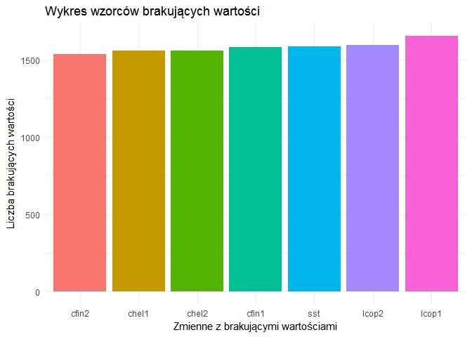

# Raport śledzi
Adam Chojan  
`r format(Sys.time(), '%d %B, %Y')`  


#Wprowadzenie
Tu będzie krótki opis

#Init

##Wykorzystane biblioteki

```r
library(knitr)
library(dplyr)
library(ggplot2)
```

```
## Warning: package 'ggplot2' was built under R version 3.3.2
```

```r
library(plotly)
```

```
## Warning: package 'plotly' was built under R version 3.3.2
```

```r
library(reshape2)
library(mice)
```

```
## Warning: package 'mice' was built under R version 3.3.2
```

##Wczytanie danych


```r
mydata = read.csv("sledzie.csv")
df <- data.frame(mydata)
df[df == '?'] <- NA
my_df <- tbl_df(df)
```

#Wstępne rozpoznanie
##Ogólne statystyki dla danych

```r
kable(summary(my_df), caption = "Tabela podsumująca zbiór danych")
```


Table: Tabela podsumująca zbiór danych

           X             length         cfin1           cfin2            chel1            chel2            lcop1            lcop2            fbar             recr              cumf             totaln                   sst             sal            xmonth            nao         
---  --------------  -------------  --------------  --------------  ---------------  ---------------  ---------------  ---------------  ---------------  ----------------  ----------------  ----------------  --------------------  --------------  ---------------  -----------------
     Min.   :    0   Min.   :19.0   0      :14287   0.70118: 4374   11.5    : 4787   5.67765 : 4365   23      : 4787   9.17171 : 4370   Min.   :0.0680   Min.   : 140515   Min.   :0.06833   Min.   : 144137   13.6315997001: 4359   Min.   :35.40   Min.   : 1.000   Min.   :-4.89000 
     1st Qu.:13145   1st Qu.:24.0   0.02778: 2225   0      : 3806   2.46875 : 2241   21.67333: 3710   2.54787 : 2215   24.85867: 3709   1st Qu.:0.2270   1st Qu.: 360061   1st Qu.:0.14809   1st Qu.: 306068   14.0693330238: 3700   1st Qu.:35.51   1st Qu.: 5.000   1st Qu.:-1.89000 
     Median :26291   Median :25.5   1.02508: 2067   0.296  : 3706   12.15192: 2109   39.56809: 2101   12.49588: 2105   41.65566: 2102   Median :0.3320   Median : 421391   Median :0.23191   Median : 539558   14.4415996823: 2080   Median :35.51   Median : 8.000   Median : 0.20000 
     Mean   :26291   Mean   :25.3   1.21333: 1985   0.11736: 2106   6.42127 : 2062   26.81218: 2002   10.92857: 2059   45.70773: 1998   Mean   :0.3304   Mean   : 520367   Mean   :0.22981   Mean   : 514973   13.5598663683: 2010   Mean   :35.51   Mean   : 7.258   Mean   :-0.09236 
     3rd Qu.:39436   3rd Qu.:26.5   0.33333: 1914   4.55825: 2007   19.15475: 2001   15.03   : 1941   21.23147: 1979   17.68   : 1959   3rd Qu.:0.4560   3rd Qu.: 724151   3rd Qu.:0.29803   3rd Qu.: 730351   13.694933032 : 1950   3rd Qu.:35.52   3rd Qu.: 9.000   3rd Qu.: 1.63000 
     Max.   :52581   Max.   :32.5   (Other):28523   (Other):35047   (Other) :37827   (Other) :36907   (Other) :37784   (Other) :36853   Max.   :0.8490   Max.   :1565890   Max.   :0.39801   Max.   :1015595   (Other)      :36899   Max.   :35.61   Max.   :12.000   Max.   : 5.08000 
     NA              NA             NA's   : 1581   NA's   : 1536   NA's    : 1555   NA's    : 1556   NA's    : 1653   NA's    : 1591   NA               NA                NA                NA                NA's         : 1584   NA              NA               NA               

```r
kable(head(my_df), caption = "Tabela zawierająca początkowe wiersze")
```


Table: Tabela zawierająca początkowe wiersze

  X   length  cfin1     cfin2     chel1     chel2      lcop1     lcop2        fbar     recr        cumf     totaln  sst                   sal   xmonth   nao
---  -------  --------  --------  --------  ---------  --------  ---------  ------  -------  ----------  ---------  --------------  ---------  -------  ----
  0     23.0  0.02778   0.27785   2.46875   NA         2.54787   26.35881    0.356   482831   0.3059879   267380.8  14.3069330186    35.51234        7   2.8
  1     22.5  0.02778   0.27785   2.46875   21.43548   2.54787   26.35881    0.356   482831   0.3059879   267380.8  14.3069330186    35.51234        7   2.8
  2     25.0  0.02778   0.27785   2.46875   21.43548   2.54787   26.35881    0.356   482831   0.3059879   267380.8  14.3069330186    35.51234        7   2.8
  3     25.5  0.02778   0.27785   2.46875   21.43548   2.54787   26.35881    0.356   482831   0.3059879   267380.8  14.3069330186    35.51234        7   2.8
  4     24.0  0.02778   0.27785   2.46875   21.43548   2.54787   26.35881    0.356   482831   0.3059879   267380.8  14.3069330186    35.51234        7   2.8
  5     22.0  0.02778   0.27785   2.46875   21.43548   2.54787   NA          0.356   482831   0.3059879   267380.8  14.3069330186    35.51234        7   2.8

```r
uniq <- my_df %>% summarise_each(funs(n_distinct(., na.rm = TRUE)))
kable(uniq, caption = "Tabela unikalnych wartości")
```


Table: Tabela unikalnych wartości

     X   length   cfin1   cfin2   chel1   chel2   lcop1   lcop2   fbar   recr   cumf   totaln   sst   sal   xmonth   nao
------  -------  ------  ------  ------  ------  ------  ------  -----  -----  -----  -------  ----  ----  -------  ----
 52582       59      39      48      48      51      48      51     51     52     52       53    51    51       12    45

##Wartości brakujące
Z ogólnych statystyk dla danych dotyczących śledzi można odczytać 6 kolumn, które zawierają wartości brakujące. Ten rozdział raportu będzie poświęcony analizie tych wartości na podstawie, której zostanie podjęta decyzja w jaki sposób zostanie rozwiązany problem - zostawić brakujące wartości, usunąć wiersze z brakującymi wartościami lub wypełnić luki w danych.

###Analiza wartości brakujących
Pierwszym krokiem jest sprawdzenie jaka jest liczba unikalnych wartości


Table: Tabela unikalnych wartości

 cfin1   cfin2   chel1   chel2   lcop1   lcop2
------  ------  ------  ------  ------  ------
    39      48      48      51      48      51

<!-- --><!-- -->


##Zmiana długości śledzi w czasie
<!--html_preserve--><div id="htmlwidget-4e04c494efc20841dc1f" style="width:672px;height:480px;" class="plotly html-widget"></div>
<script type="application/json" data-for="htmlwidget-4e04c494efc20841dc1f">{"x":{"data":[{"x":[1,666.582278481013,1332.16455696203,1997.74683544304,2663.32911392405,3328.91139240506,3994.49367088608,4660.07594936709,5325.6582278481,5991.24050632911,6656.82278481013,7322.40506329114,7987.98734177215,8653.56962025316,9319.15189873418,9984.73417721519,10650.3164556962,11315.8987341772,11981.4810126582,12647.0632911392,13312.6455696203,13978.2278481013,14643.8101265823,15309.3924050633,15974.9746835443,16640.5569620253,17306.1392405063,17971.7215189873,18637.3037974684,19302.8860759494,19968.4683544304,20634.0506329114,21299.6329113924,21965.2151898734,22630.7974683544,23296.3797468354,23961.9620253165,24627.5443037975,25293.1265822785,25958.7088607595,26624.2911392405,27289.8734177215,27955.4556962025,28621.0379746835,29286.6202531646,29952.2025316456,30617.7848101266,31283.3670886076,31948.9493670886,32614.5316455696,33280.1139240506,33945.6962025316,34611.2784810127,35276.8607594937,35942.4430379747,36608.0253164557,37273.6075949367,37939.1898734177,38604.7721518987,39270.3544303797,39935.9367088608,40601.5189873418,41267.1012658228,41932.6835443038,42598.2658227848,43263.8481012658,43929.4303797468,44595.0126582278,45260.5949367089,45926.1772151899,46591.7594936709,47257.3417721519,47922.9240506329,48588.5063291139,49254.0886075949,49919.6708860759,50585.253164557,51250.835443038,51916.417721519,52582],"y":[26.2753681334387,26.2507855250607,26.2262029166827,26.2016203083047,26.1770376999267,26.1524550915486,26.1278724831706,26.1032898747926,26.0787072664146,26.0541246580366,26.0295420496586,26.0049594412806,25.9803768329026,25.9557942245245,25.9312116161465,25.9066290077685,25.8820463993905,25.8574637910125,25.8328811826345,25.8082985742565,25.7837159658785,25.7591333575004,25.7345507491224,25.7099681407444,25.6853855323664,25.6608029239884,25.6362203156104,25.6116377072324,25.5870550988544,25.5624724904763,25.5378898820983,25.5133072737203,25.4887246653423,25.4641420569643,25.4395594485863,25.4149768402083,25.3903942318303,25.3658116234523,25.3412290150742,25.3166464066962,25.2920637983182,25.2674811899402,25.2428985815622,25.2183159731842,25.1937333648062,25.1691507564282,25.1445681480501,25.1199855396721,25.0954029312941,25.0708203229161,25.0462377145381,25.0216551061601,24.9970724977821,24.9724898894041,24.947907281026,24.923324672648,24.89874206427,24.874159455892,24.849576847514,24.824994239136,24.800411630758,24.77582902238,24.751246414002,24.7266638056239,24.7020811972459,24.6774985888679,24.6529159804899,24.6283333721119,24.6037507637339,24.5791681553559,24.5545855469779,24.5300029385998,24.5054203302218,24.4808377218438,24.4562551134658,24.4316725050878,24.4070898967098,24.3825072883318,24.3579246799538,24.3333420715757],"text":["seq(1:length(length)): 1<br>length: 26.28","seq(1:length(length)): 666.58<br>length: 26.25","seq(1:length(length)): 1332.16<br>length: 26.23","seq(1:length(length)): 1997.75<br>length: 26.2","seq(1:length(length)): 2663.33<br>length: 26.18","seq(1:length(length)): 3328.91<br>length: 26.15","seq(1:length(length)): 3994.49<br>length: 26.13","seq(1:length(length)): 4660.08<br>length: 26.1","seq(1:length(length)): 5325.66<br>length: 26.08","seq(1:length(length)): 5991.24<br>length: 26.05","seq(1:length(length)): 6656.82<br>length: 26.03","seq(1:length(length)): 7322.41<br>length: 26","seq(1:length(length)): 7987.99<br>length: 25.98","seq(1:length(length)): 8653.57<br>length: 25.96","seq(1:length(length)): 9319.15<br>length: 25.93","seq(1:length(length)): 9984.73<br>length: 25.91","seq(1:length(length)): 10650.32<br>length: 25.88","seq(1:length(length)): 11315.9<br>length: 25.86","seq(1:length(length)): 11981.48<br>length: 25.83","seq(1:length(length)): 12647.06<br>length: 25.81","seq(1:length(length)): 13312.65<br>length: 25.78","seq(1:length(length)): 13978.23<br>length: 25.76","seq(1:length(length)): 14643.81<br>length: 25.73","seq(1:length(length)): 15309.39<br>length: 25.71","seq(1:length(length)): 15974.97<br>length: 25.69","seq(1:length(length)): 16640.56<br>length: 25.66","seq(1:length(length)): 17306.14<br>length: 25.64","seq(1:length(length)): 17971.72<br>length: 25.61","seq(1:length(length)): 18637.3<br>length: 25.59","seq(1:length(length)): 19302.89<br>length: 25.56","seq(1:length(length)): 19968.47<br>length: 25.54","seq(1:length(length)): 20634.05<br>length: 25.51","seq(1:length(length)): 21299.63<br>length: 25.49","seq(1:length(length)): 21965.22<br>length: 25.46","seq(1:length(length)): 22630.8<br>length: 25.44","seq(1:length(length)): 23296.38<br>length: 25.41","seq(1:length(length)): 23961.96<br>length: 25.39","seq(1:length(length)): 24627.54<br>length: 25.37","seq(1:length(length)): 25293.13<br>length: 25.34","seq(1:length(length)): 25958.71<br>length: 25.32","seq(1:length(length)): 26624.29<br>length: 25.29","seq(1:length(length)): 27289.87<br>length: 25.27","seq(1:length(length)): 27955.46<br>length: 25.24","seq(1:length(length)): 28621.04<br>length: 25.22","seq(1:length(length)): 29286.62<br>length: 25.19","seq(1:length(length)): 29952.2<br>length: 25.17","seq(1:length(length)): 30617.78<br>length: 25.14","seq(1:length(length)): 31283.37<br>length: 25.12","seq(1:length(length)): 31948.95<br>length: 25.1","seq(1:length(length)): 32614.53<br>length: 25.07","seq(1:length(length)): 33280.11<br>length: 25.05","seq(1:length(length)): 33945.7<br>length: 25.02","seq(1:length(length)): 34611.28<br>length: 25","seq(1:length(length)): 35276.86<br>length: 24.97","seq(1:length(length)): 35942.44<br>length: 24.95","seq(1:length(length)): 36608.03<br>length: 24.92","seq(1:length(length)): 37273.61<br>length: 24.9","seq(1:length(length)): 37939.19<br>length: 24.87","seq(1:length(length)): 38604.77<br>length: 24.85","seq(1:length(length)): 39270.35<br>length: 24.82","seq(1:length(length)): 39935.94<br>length: 24.8","seq(1:length(length)): 40601.52<br>length: 24.78","seq(1:length(length)): 41267.1<br>length: 24.75","seq(1:length(length)): 41932.68<br>length: 24.73","seq(1:length(length)): 42598.27<br>length: 24.7","seq(1:length(length)): 43263.85<br>length: 24.68","seq(1:length(length)): 43929.43<br>length: 24.65","seq(1:length(length)): 44595.01<br>length: 24.63","seq(1:length(length)): 45260.59<br>length: 24.6","seq(1:length(length)): 45926.18<br>length: 24.58","seq(1:length(length)): 46591.76<br>length: 24.55","seq(1:length(length)): 47257.34<br>length: 24.53","seq(1:length(length)): 47922.92<br>length: 24.51","seq(1:length(length)): 48588.51<br>length: 24.48","seq(1:length(length)): 49254.09<br>length: 24.46","seq(1:length(length)): 49919.67<br>length: 24.43","seq(1:length(length)): 50585.25<br>length: 24.41","seq(1:length(length)): 51250.84<br>length: 24.38","seq(1:length(length)): 51916.42<br>length: 24.36","seq(1:length(length)): 52582<br>length: 24.33"],"key":null,"type":"scatter","mode":"lines","name":"fitted values","line":{"width":3.77952755905512,"color":"rgba(51,102,255,1)","dash":"solid"},"hoveron":"points","showlegend":false,"xaxis":"x","yaxis":"y","hoverinfo":"text"},{"x":[1,666.582278481013,1332.16455696203,1997.74683544304,2663.32911392405,3328.91139240506,3994.49367088608,4660.07594936709,5325.6582278481,5991.24050632911,6656.82278481013,7322.40506329114,7987.98734177215,8653.56962025316,9319.15189873418,9984.73417721519,10650.3164556962,11315.8987341772,11981.4810126582,12647.0632911392,13312.6455696203,13978.2278481013,14643.8101265823,15309.3924050633,15974.9746835443,16640.5569620253,17306.1392405063,17971.7215189873,18637.3037974684,19302.8860759494,19968.4683544304,20634.0506329114,21299.6329113924,21965.2151898734,22630.7974683544,23296.3797468354,23961.9620253165,24627.5443037975,25293.1265822785,25958.7088607595,26624.2911392405,27289.8734177215,27955.4556962025,28621.0379746835,29286.6202531646,29952.2025316456,30617.7848101266,31283.3670886076,31948.9493670886,32614.5316455696,33280.1139240506,33945.6962025316,34611.2784810127,35276.8607594937,35942.4430379747,36608.0253164557,37273.6075949367,37939.1898734177,38604.7721518987,39270.3544303797,39935.9367088608,40601.5189873418,41267.1012658228,41932.6835443038,42598.2658227848,43263.8481012658,43929.4303797468,44595.0126582278,45260.5949367089,45926.1772151899,46591.7594936709,47257.3417721519,47922.9240506329,48588.5063291139,49254.0886075949,49919.6708860759,50585.253164557,51250.835443038,51916.417721519,52582,52582,52582,51916.417721519,51250.835443038,50585.253164557,49919.6708860759,49254.0886075949,48588.5063291139,47922.9240506329,47257.3417721519,46591.7594936709,45926.1772151899,45260.5949367089,44595.0126582278,43929.4303797468,43263.8481012658,42598.2658227848,41932.6835443038,41267.1012658228,40601.5189873418,39935.9367088608,39270.3544303797,38604.7721518987,37939.1898734177,37273.6075949367,36608.0253164557,35942.4430379747,35276.8607594937,34611.2784810127,33945.6962025316,33280.1139240506,32614.5316455696,31948.9493670886,31283.3670886076,30617.7848101266,29952.2025316456,29286.6202531646,28621.0379746835,27955.4556962025,27289.8734177215,26624.2911392405,25958.7088607595,25293.1265822785,24627.5443037975,23961.9620253165,23296.3797468354,22630.7974683544,21965.2151898734,21299.6329113924,20634.0506329114,19968.4683544304,19302.8860759494,18637.3037974684,17971.7215189873,17306.1392405063,16640.5569620253,15974.9746835443,15309.3924050633,14643.8101265823,13978.2278481013,13312.6455696203,12647.0632911392,11981.4810126582,11315.8987341772,10650.3164556962,9984.73417721519,9319.15189873418,8653.56962025316,7987.98734177215,7322.40506329114,6656.82278481013,5991.24050632911,5325.6582278481,4660.07594936709,3994.49367088608,3328.91139240506,2663.32911392405,1997.74683544304,1332.16455696203,666.582278481013,1,1],"y":[26.2487876611835,26.2247081124973,26.2006251798989,26.1765386611448,26.1524483391824,26.1283539809588,26.1042553361413,26.080152135745,26.0560440906672,26.0319308901283,26.0078122000211,25.9836876611751,25.9595568875439,25.9354194643319,25.9112749460793,25.8871228547362,25.8629626777629,25.8387938663075,25.8146158335245,25.7904279531139,25.7662295581793,25.742019940521,25.7177983505034,25.6935639976531,25.6693160521657,25.6450536475107,25.620775884332,25.5964818358373,25.5721705548485,25.5478410826469,25.5234924596841,25.4991237381398,25.4747339961931,25.4503223537398,25.425887989137,25.4014301564066,25.3769482021983,25.3524415817173,25.3279098727815,25.303352787207,25.278770178829,25.2541620476475,25.2295285398273,25.2048699435522,25.1801866810044,25.1554792969789,25.1307484448256,25.1059948705229,25.0812193957136,25.0564229005019,25.0316063067086,25.0067705621542,24.981916626387,24.9570454581257,24.9321580045483,24.9072551924473,24.8823379211787,24.857407057273,24.8324634305346,24.8075078314368,24.7825410096154,24.75756367327,24.732576489297,24.7075800839964,24.6825750442136,24.6575619188007,24.6325412202973,24.6075134267532,24.5824789836284,24.5574383057184,24.5323917790696,24.5073397628525,24.4822825911742,24.4572205748145,24.432154002876,24.4070831443435,24.3820082495499,24.356929551548,24.3318472673904,24.3067615993205,24.3067615993205,24.359922543831,24.3840020925172,24.4080850251156,24.4321715438697,24.4562618658321,24.4803562240556,24.5044548688731,24.5285580692694,24.5526661143472,24.5767793148861,24.6008980049933,24.6250225438394,24.6491533174705,24.6732907406825,24.6974352589351,24.7215873502782,24.7457475272515,24.7699163387069,24.79409437149,24.8182822519005,24.8424806468351,24.8666902644934,24.8909118545111,24.9151462073614,24.9393941528488,24.9636565575038,24.9879343206824,25.0122283691771,25.036539650166,25.0608691223676,25.0852177453303,25.1095864668746,25.1339762088214,25.1583878512747,25.1828222158775,25.2072800486079,25.2317620028162,25.2562686232971,25.2808003322329,25.3053574178074,25.3299400261854,25.354548157367,25.3791816651872,25.4038402614622,25.42852352401,25.4532309080356,25.4779617601888,25.5027153344916,25.5274908093008,25.5522873045126,25.5771038983058,25.6019396428602,25.6267935786274,25.6516647468888,25.6765522004661,25.7014550125672,25.7263722838358,25.7513031477415,25.7762467744799,25.8012023735776,25.826169195399,25.8511465317445,25.8761337157175,25.9011301210181,25.9261351608008,25.9511482862137,25.9761689847172,26.0011967782612,26.0262312213861,26.051271899296,26.0763184259449,26.101370442162,26.1264276138402,26.1514896301999,26.1765562021385,26.2016270606709,26.2267019554645,26.2517806534665,26.2768629376241,26.3019486056939,26.2487876611835],"text":["seq(1:length(length)): 1<br>length: 26.28","seq(1:length(length)): 666.58<br>length: 26.25","seq(1:length(length)): 1332.16<br>length: 26.23","seq(1:length(length)): 1997.75<br>length: 26.2","seq(1:length(length)): 2663.33<br>length: 26.18","seq(1:length(length)): 3328.91<br>length: 26.15","seq(1:length(length)): 3994.49<br>length: 26.13","seq(1:length(length)): 4660.08<br>length: 26.1","seq(1:length(length)): 5325.66<br>length: 26.08","seq(1:length(length)): 5991.24<br>length: 26.05","seq(1:length(length)): 6656.82<br>length: 26.03","seq(1:length(length)): 7322.41<br>length: 26","seq(1:length(length)): 7987.99<br>length: 25.98","seq(1:length(length)): 8653.57<br>length: 25.96","seq(1:length(length)): 9319.15<br>length: 25.93","seq(1:length(length)): 9984.73<br>length: 25.91","seq(1:length(length)): 10650.32<br>length: 25.88","seq(1:length(length)): 11315.9<br>length: 25.86","seq(1:length(length)): 11981.48<br>length: 25.83","seq(1:length(length)): 12647.06<br>length: 25.81","seq(1:length(length)): 13312.65<br>length: 25.78","seq(1:length(length)): 13978.23<br>length: 25.76","seq(1:length(length)): 14643.81<br>length: 25.73","seq(1:length(length)): 15309.39<br>length: 25.71","seq(1:length(length)): 15974.97<br>length: 25.69","seq(1:length(length)): 16640.56<br>length: 25.66","seq(1:length(length)): 17306.14<br>length: 25.64","seq(1:length(length)): 17971.72<br>length: 25.61","seq(1:length(length)): 18637.3<br>length: 25.59","seq(1:length(length)): 19302.89<br>length: 25.56","seq(1:length(length)): 19968.47<br>length: 25.54","seq(1:length(length)): 20634.05<br>length: 25.51","seq(1:length(length)): 21299.63<br>length: 25.49","seq(1:length(length)): 21965.22<br>length: 25.46","seq(1:length(length)): 22630.8<br>length: 25.44","seq(1:length(length)): 23296.38<br>length: 25.41","seq(1:length(length)): 23961.96<br>length: 25.39","seq(1:length(length)): 24627.54<br>length: 25.37","seq(1:length(length)): 25293.13<br>length: 25.34","seq(1:length(length)): 25958.71<br>length: 25.32","seq(1:length(length)): 26624.29<br>length: 25.29","seq(1:length(length)): 27289.87<br>length: 25.27","seq(1:length(length)): 27955.46<br>length: 25.24","seq(1:length(length)): 28621.04<br>length: 25.22","seq(1:length(length)): 29286.62<br>length: 25.19","seq(1:length(length)): 29952.2<br>length: 25.17","seq(1:length(length)): 30617.78<br>length: 25.14","seq(1:length(length)): 31283.37<br>length: 25.12","seq(1:length(length)): 31948.95<br>length: 25.1","seq(1:length(length)): 32614.53<br>length: 25.07","seq(1:length(length)): 33280.11<br>length: 25.05","seq(1:length(length)): 33945.7<br>length: 25.02","seq(1:length(length)): 34611.28<br>length: 25","seq(1:length(length)): 35276.86<br>length: 24.97","seq(1:length(length)): 35942.44<br>length: 24.95","seq(1:length(length)): 36608.03<br>length: 24.92","seq(1:length(length)): 37273.61<br>length: 24.9","seq(1:length(length)): 37939.19<br>length: 24.87","seq(1:length(length)): 38604.77<br>length: 24.85","seq(1:length(length)): 39270.35<br>length: 24.82","seq(1:length(length)): 39935.94<br>length: 24.8","seq(1:length(length)): 40601.52<br>length: 24.78","seq(1:length(length)): 41267.1<br>length: 24.75","seq(1:length(length)): 41932.68<br>length: 24.73","seq(1:length(length)): 42598.27<br>length: 24.7","seq(1:length(length)): 43263.85<br>length: 24.68","seq(1:length(length)): 43929.43<br>length: 24.65","seq(1:length(length)): 44595.01<br>length: 24.63","seq(1:length(length)): 45260.59<br>length: 24.6","seq(1:length(length)): 45926.18<br>length: 24.58","seq(1:length(length)): 46591.76<br>length: 24.55","seq(1:length(length)): 47257.34<br>length: 24.53","seq(1:length(length)): 47922.92<br>length: 24.51","seq(1:length(length)): 48588.51<br>length: 24.48","seq(1:length(length)): 49254.09<br>length: 24.46","seq(1:length(length)): 49919.67<br>length: 24.43","seq(1:length(length)): 50585.25<br>length: 24.41","seq(1:length(length)): 51250.84<br>length: 24.38","seq(1:length(length)): 51916.42<br>length: 24.36","seq(1:length(length)): 52582<br>length: 24.33","seq(1:length(length)): 52582<br>length: 24.33","seq(1:length(length)): 52582<br>length: 24.33","seq(1:length(length)): 51916.42<br>length: 24.36","seq(1:length(length)): 51250.84<br>length: 24.38","seq(1:length(length)): 50585.25<br>length: 24.41","seq(1:length(length)): 49919.67<br>length: 24.43","seq(1:length(length)): 49254.09<br>length: 24.46","seq(1:length(length)): 48588.51<br>length: 24.48","seq(1:length(length)): 47922.92<br>length: 24.51","seq(1:length(length)): 47257.34<br>length: 24.53","seq(1:length(length)): 46591.76<br>length: 24.55","seq(1:length(length)): 45926.18<br>length: 24.58","seq(1:length(length)): 45260.59<br>length: 24.6","seq(1:length(length)): 44595.01<br>length: 24.63","seq(1:length(length)): 43929.43<br>length: 24.65","seq(1:length(length)): 43263.85<br>length: 24.68","seq(1:length(length)): 42598.27<br>length: 24.7","seq(1:length(length)): 41932.68<br>length: 24.73","seq(1:length(length)): 41267.1<br>length: 24.75","seq(1:length(length)): 40601.52<br>length: 24.78","seq(1:length(length)): 39935.94<br>length: 24.8","seq(1:length(length)): 39270.35<br>length: 24.82","seq(1:length(length)): 38604.77<br>length: 24.85","seq(1:length(length)): 37939.19<br>length: 24.87","seq(1:length(length)): 37273.61<br>length: 24.9","seq(1:length(length)): 36608.03<br>length: 24.92","seq(1:length(length)): 35942.44<br>length: 24.95","seq(1:length(length)): 35276.86<br>length: 24.97","seq(1:length(length)): 34611.28<br>length: 25","seq(1:length(length)): 33945.7<br>length: 25.02","seq(1:length(length)): 33280.11<br>length: 25.05","seq(1:length(length)): 32614.53<br>length: 25.07","seq(1:length(length)): 31948.95<br>length: 25.1","seq(1:length(length)): 31283.37<br>length: 25.12","seq(1:length(length)): 30617.78<br>length: 25.14","seq(1:length(length)): 29952.2<br>length: 25.17","seq(1:length(length)): 29286.62<br>length: 25.19","seq(1:length(length)): 28621.04<br>length: 25.22","seq(1:length(length)): 27955.46<br>length: 25.24","seq(1:length(length)): 27289.87<br>length: 25.27","seq(1:length(length)): 26624.29<br>length: 25.29","seq(1:length(length)): 25958.71<br>length: 25.32","seq(1:length(length)): 25293.13<br>length: 25.34","seq(1:length(length)): 24627.54<br>length: 25.37","seq(1:length(length)): 23961.96<br>length: 25.39","seq(1:length(length)): 23296.38<br>length: 25.41","seq(1:length(length)): 22630.8<br>length: 25.44","seq(1:length(length)): 21965.22<br>length: 25.46","seq(1:length(length)): 21299.63<br>length: 25.49","seq(1:length(length)): 20634.05<br>length: 25.51","seq(1:length(length)): 19968.47<br>length: 25.54","seq(1:length(length)): 19302.89<br>length: 25.56","seq(1:length(length)): 18637.3<br>length: 25.59","seq(1:length(length)): 17971.72<br>length: 25.61","seq(1:length(length)): 17306.14<br>length: 25.64","seq(1:length(length)): 16640.56<br>length: 25.66","seq(1:length(length)): 15974.97<br>length: 25.69","seq(1:length(length)): 15309.39<br>length: 25.71","seq(1:length(length)): 14643.81<br>length: 25.73","seq(1:length(length)): 13978.23<br>length: 25.76","seq(1:length(length)): 13312.65<br>length: 25.78","seq(1:length(length)): 12647.06<br>length: 25.81","seq(1:length(length)): 11981.48<br>length: 25.83","seq(1:length(length)): 11315.9<br>length: 25.86","seq(1:length(length)): 10650.32<br>length: 25.88","seq(1:length(length)): 9984.73<br>length: 25.91","seq(1:length(length)): 9319.15<br>length: 25.93","seq(1:length(length)): 8653.57<br>length: 25.96","seq(1:length(length)): 7987.99<br>length: 25.98","seq(1:length(length)): 7322.41<br>length: 26","seq(1:length(length)): 6656.82<br>length: 26.03","seq(1:length(length)): 5991.24<br>length: 26.05","seq(1:length(length)): 5325.66<br>length: 26.08","seq(1:length(length)): 4660.08<br>length: 26.1","seq(1:length(length)): 3994.49<br>length: 26.13","seq(1:length(length)): 3328.91<br>length: 26.15","seq(1:length(length)): 2663.33<br>length: 26.18","seq(1:length(length)): 1997.75<br>length: 26.2","seq(1:length(length)): 1332.16<br>length: 26.23","seq(1:length(length)): 666.58<br>length: 26.25","seq(1:length(length)): 1<br>length: 26.28","seq(1:length(length)): 1<br>length: 26.28"],"key":null,"type":"scatter","mode":"lines","line":{"width":3.77952755905512,"color":"transparent","dash":"solid"},"fill":"toself","fillcolor":"rgba(153,153,153,0.4)","hoveron":"points","hoverinfo":"x+y","showlegend":false,"xaxis":"x","yaxis":"y","name":""},{"x":[1,666.582278481013,1332.16455696203,1997.74683544304,2663.32911392405,3328.91139240506,3994.49367088608,4660.07594936709,5325.6582278481,5991.24050632911,6656.82278481013,7322.40506329114,7987.98734177215,8653.56962025316,9319.15189873418,9984.73417721519,10650.3164556962,11315.8987341772,11981.4810126582,12647.0632911392,13312.6455696203,13978.2278481013,14643.8101265823,15309.3924050633,15974.9746835443,16640.5569620253,17306.1392405063,17971.7215189873,18637.3037974684,19302.8860759494,19968.4683544304,20634.0506329114,21299.6329113924,21965.2151898734,22630.7974683544,23296.3797468354,23961.9620253165,24627.5443037975,25293.1265822785,25958.7088607595,26624.2911392405,27289.8734177215,27955.4556962025,28621.0379746835,29286.6202531646,29952.2025316456,30617.7848101266,31283.3670886076,31948.9493670886,32614.5316455696,33280.1139240506,33945.6962025316,34611.2784810127,35276.8607594937,35942.4430379747,36608.0253164557,37273.6075949367,37939.1898734177,38604.7721518987,39270.3544303797,39935.9367088608,40601.5189873418,41267.1012658228,41932.6835443038,42598.2658227848,43263.8481012658,43929.4303797468,44595.0126582278,45260.5949367089,45926.1772151899,46591.7594936709,47257.3417721519,47922.9240506329,48588.5063291139,49254.0886075949,49919.6708860759,50585.253164557,51250.835443038,51916.417721519,52582],"y":[26.2753681334375,26.2507855250595,26.2262029166815,26.2016203083035,26.1770376999255,26.1524550915475,26.1278724831695,26.1032898747915,26.0787072664135,26.0541246580355,26.0295420496575,26.0049594412795,25.9803768329015,25.9557942245235,25.9312116161455,25.9066290077675,25.8820463993895,25.8574637910114,25.8328811826334,25.8082985742554,25.7837159658774,25.7591333574994,25.7345507491214,25.7099681407434,25.6853855323654,25.6608029239874,25.6362203156094,25.6116377072314,25.5870550988534,25.5624724904754,25.5378898820974,25.5133072737194,25.4887246653414,25.4641420569634,25.4395594485854,25.4149768402074,25.3903942318294,25.3658116234514,25.3412290150734,25.3166464066954,25.2920637983174,25.2674811899394,25.2428985815614,25.2183159731834,25.1937333648054,25.1691507564274,25.1445681480494,25.1199855396714,25.0954029312934,25.0708203229154,25.0462377145374,25.0216551061594,24.9970724977814,24.9724898894034,24.9479072810254,24.9233246726474,24.8987420642694,24.8741594558914,24.8495768475134,24.8249942391353,24.8004116307573,24.7758290223793,24.7512464140013,24.7266638056233,24.7020811972453,24.6774985888673,24.6529159804893,24.6283333721113,24.6037507637333,24.5791681553553,24.5545855469773,24.5300029385993,24.5054203302213,24.4808377218433,24.4562551134653,24.4316725050873,24.4070898967093,24.3825072883313,24.3579246799533,24.3333420715753],"text":["seq(1:length(length)): 1<br>length: 26.28","seq(1:length(length)): 666.58<br>length: 26.25","seq(1:length(length)): 1332.16<br>length: 26.23","seq(1:length(length)): 1997.75<br>length: 26.2","seq(1:length(length)): 2663.33<br>length: 26.18","seq(1:length(length)): 3328.91<br>length: 26.15","seq(1:length(length)): 3994.49<br>length: 26.13","seq(1:length(length)): 4660.08<br>length: 26.1","seq(1:length(length)): 5325.66<br>length: 26.08","seq(1:length(length)): 5991.24<br>length: 26.05","seq(1:length(length)): 6656.82<br>length: 26.03","seq(1:length(length)): 7322.41<br>length: 26","seq(1:length(length)): 7987.99<br>length: 25.98","seq(1:length(length)): 8653.57<br>length: 25.96","seq(1:length(length)): 9319.15<br>length: 25.93","seq(1:length(length)): 9984.73<br>length: 25.91","seq(1:length(length)): 10650.32<br>length: 25.88","seq(1:length(length)): 11315.9<br>length: 25.86","seq(1:length(length)): 11981.48<br>length: 25.83","seq(1:length(length)): 12647.06<br>length: 25.81","seq(1:length(length)): 13312.65<br>length: 25.78","seq(1:length(length)): 13978.23<br>length: 25.76","seq(1:length(length)): 14643.81<br>length: 25.73","seq(1:length(length)): 15309.39<br>length: 25.71","seq(1:length(length)): 15974.97<br>length: 25.69","seq(1:length(length)): 16640.56<br>length: 25.66","seq(1:length(length)): 17306.14<br>length: 25.64","seq(1:length(length)): 17971.72<br>length: 25.61","seq(1:length(length)): 18637.3<br>length: 25.59","seq(1:length(length)): 19302.89<br>length: 25.56","seq(1:length(length)): 19968.47<br>length: 25.54","seq(1:length(length)): 20634.05<br>length: 25.51","seq(1:length(length)): 21299.63<br>length: 25.49","seq(1:length(length)): 21965.22<br>length: 25.46","seq(1:length(length)): 22630.8<br>length: 25.44","seq(1:length(length)): 23296.38<br>length: 25.41","seq(1:length(length)): 23961.96<br>length: 25.39","seq(1:length(length)): 24627.54<br>length: 25.37","seq(1:length(length)): 25293.13<br>length: 25.34","seq(1:length(length)): 25958.71<br>length: 25.32","seq(1:length(length)): 26624.29<br>length: 25.29","seq(1:length(length)): 27289.87<br>length: 25.27","seq(1:length(length)): 27955.46<br>length: 25.24","seq(1:length(length)): 28621.04<br>length: 25.22","seq(1:length(length)): 29286.62<br>length: 25.19","seq(1:length(length)): 29952.2<br>length: 25.17","seq(1:length(length)): 30617.78<br>length: 25.14","seq(1:length(length)): 31283.37<br>length: 25.12","seq(1:length(length)): 31948.95<br>length: 25.1","seq(1:length(length)): 32614.53<br>length: 25.07","seq(1:length(length)): 33280.11<br>length: 25.05","seq(1:length(length)): 33945.7<br>length: 25.02","seq(1:length(length)): 34611.28<br>length: 25","seq(1:length(length)): 35276.86<br>length: 24.97","seq(1:length(length)): 35942.44<br>length: 24.95","seq(1:length(length)): 36608.03<br>length: 24.92","seq(1:length(length)): 37273.61<br>length: 24.9","seq(1:length(length)): 37939.19<br>length: 24.87","seq(1:length(length)): 38604.77<br>length: 24.85","seq(1:length(length)): 39270.35<br>length: 24.82","seq(1:length(length)): 39935.94<br>length: 24.8","seq(1:length(length)): 40601.52<br>length: 24.78","seq(1:length(length)): 41267.1<br>length: 24.75","seq(1:length(length)): 41932.68<br>length: 24.73","seq(1:length(length)): 42598.27<br>length: 24.7","seq(1:length(length)): 43263.85<br>length: 24.68","seq(1:length(length)): 43929.43<br>length: 24.65","seq(1:length(length)): 44595.01<br>length: 24.63","seq(1:length(length)): 45260.59<br>length: 24.6","seq(1:length(length)): 45926.18<br>length: 24.58","seq(1:length(length)): 46591.76<br>length: 24.55","seq(1:length(length)): 47257.34<br>length: 24.53","seq(1:length(length)): 47922.92<br>length: 24.51","seq(1:length(length)): 48588.51<br>length: 24.48","seq(1:length(length)): 49254.09<br>length: 24.46","seq(1:length(length)): 49919.67<br>length: 24.43","seq(1:length(length)): 50585.25<br>length: 24.41","seq(1:length(length)): 51250.84<br>length: 24.38","seq(1:length(length)): 51916.42<br>length: 24.36","seq(1:length(length)): 52582<br>length: 24.33"],"key":null,"type":"scatter","mode":"lines","name":"fitted values","line":{"width":3.77952755905512,"color":"rgba(51,102,255,1)","dash":"solid"},"hoveron":"points","showlegend":false,"xaxis":"x","yaxis":"y","hoverinfo":"text"},{"x":[1,666.582278481013,1332.16455696203,1997.74683544304,2663.32911392405,3328.91139240506,3994.49367088608,4660.07594936709,5325.6582278481,5991.24050632911,6656.82278481013,7322.40506329114,7987.98734177215,8653.56962025316,9319.15189873418,9984.73417721519,10650.3164556962,11315.8987341772,11981.4810126582,12647.0632911392,13312.6455696203,13978.2278481013,14643.8101265823,15309.3924050633,15974.9746835443,16640.5569620253,17306.1392405063,17971.7215189873,18637.3037974684,19302.8860759494,19968.4683544304,20634.0506329114,21299.6329113924,21965.2151898734,22630.7974683544,23296.3797468354,23961.9620253165,24627.5443037975,25293.1265822785,25958.7088607595,26624.2911392405,27289.8734177215,27955.4556962025,28621.0379746835,29286.6202531646,29952.2025316456,30617.7848101266,31283.3670886076,31948.9493670886,32614.5316455696,33280.1139240506,33945.6962025316,34611.2784810127,35276.8607594937,35942.4430379747,36608.0253164557,37273.6075949367,37939.1898734177,38604.7721518987,39270.3544303797,39935.9367088608,40601.5189873418,41267.1012658228,41932.6835443038,42598.2658227848,43263.8481012658,43929.4303797468,44595.0126582278,45260.5949367089,45926.1772151899,46591.7594936709,47257.3417721519,47922.9240506329,48588.5063291139,49254.0886075949,49919.6708860759,50585.253164557,51250.835443038,51916.417721519,52582,52582,52582,51916.417721519,51250.835443038,50585.253164557,49919.6708860759,49254.0886075949,48588.5063291139,47922.9240506329,47257.3417721519,46591.7594936709,45926.1772151899,45260.5949367089,44595.0126582278,43929.4303797468,43263.8481012658,42598.2658227848,41932.6835443038,41267.1012658228,40601.5189873418,39935.9367088608,39270.3544303797,38604.7721518987,37939.1898734177,37273.6075949367,36608.0253164557,35942.4430379747,35276.8607594937,34611.2784810127,33945.6962025316,33280.1139240506,32614.5316455696,31948.9493670886,31283.3670886076,30617.7848101266,29952.2025316456,29286.6202531646,28621.0379746835,27955.4556962025,27289.8734177215,26624.2911392405,25958.7088607595,25293.1265822785,24627.5443037975,23961.9620253165,23296.3797468354,22630.7974683544,21965.2151898734,21299.6329113924,20634.0506329114,19968.4683544304,19302.8860759494,18637.3037974684,17971.7215189873,17306.1392405063,16640.5569620253,15974.9746835443,15309.3924050633,14643.8101265823,13978.2278481013,13312.6455696203,12647.0632911392,11981.4810126582,11315.8987341772,10650.3164556962,9984.73417721519,9319.15189873418,8653.56962025316,7987.98734177215,7322.40506329114,6656.82278481013,5991.24050632911,5325.6582278481,4660.07594936709,3994.49367088608,3328.91139240506,2663.32911392405,1997.74683544304,1332.16455696203,666.582278481013,1,1],"y":[26.2487882730509,26.2247087127845,26.2006257686838,26.17653923851,26.1524489052154,26.1283545357526,26.1042558797946,26.0801526683626,26.0560446123606,26.0319314010162,26.0078127002298,25.9836881508392,25.9595573668071,25.9354199333472,25.91127540501,25.8871233037566,25.8629631170592,25.8387942960784,25.8146162539823,25.7904283644853,25.7662299607063,25.742020334462,25.7177987361339,25.6935643752669,25.6693164220758,25.6450540100498,25.6207762398538,25.5964821847167,25.572170897482,25.5478414194533,25.5234927911044,25.4991240646365,25.4747343182501,25.4503226718613,25.425888303846,25.4014304682433,25.376948511718,25.3524418894879,25.3279101793804,25.3033530932184,25.2787704848404,25.2541623542464,25.2295288475978,25.204870253072,25.1801869928413,25.155479611688,25.1307487629472,25.10599519258,25.0812197222105,25.0564232319223,25.0316066435153,25.0067709047879,24.9819169752666,24.9570458136477,24.9321583670878,24.9072555623577,24.8823382987928,24.8574074429038,24.8324638244759,24.8075082339642,24.7825414209872,24.7575640937282,24.7325769190683,24.7075805232931,24.6825754932345,24.6575623777319,24.632541689313,24.607513906017,24.5824794732931,24.5574388059277,24.532392289958,24.5073402845465,24.4822831237924,24.4572211184684,24.4321545576705,24.4070837103773,24.3820088269159,24.3569301403337,24.3318478676784,24.3067622111887,24.3067622111887,24.3599219319619,24.3840014922283,24.408084436329,24.4321709665027,24.4562612997973,24.4803556692602,24.5044543252182,24.5285575366502,24.5526655926522,24.5767788039966,24.600897504783,24.6250220541735,24.6491528382057,24.6732902716656,24.6974348000028,24.7215869012561,24.7457470879536,24.7699159089344,24.7940939510305,24.8182818405275,24.8424802443065,24.8666898705508,24.8909114688789,24.9151458297459,24.939393782937,24.963656194963,24.987933965159,25.0122280202961,25.0365393075308,25.0608687855595,25.0852174139084,25.1095861403763,25.1339758867627,25.1583875331515,25.1828219011668,25.2072797367695,25.2317616932948,25.2562683155249,25.2808000256324,25.3053571117944,25.3299397201724,25.3545478507664,25.379181357415,25.4038399519408,25.4285232121715,25.4532305933248,25.4779614420656,25.5027150124327,25.5274904828023,25.5522869730905,25.5771035614975,25.6019393002249,25.6267932297462,25.651664391365,25.676551837925,25.7014546426551,25.72637190622,25.751302762109,25.7762463805369,25.8012019710486,25.8261687840256,25.8511461112846,25.8761332859445,25.9011296817197,25.9261347117783,25.9511478272809,25.9761685156998,26.0011962989958,26.0262307317197,26.0512713990851,26.0763179150548,26.1013699204663,26.1264270812204,26.1514890865444,26.1765556473423,26.2016264946355,26.2267013780969,26.2517800646791,26.2768623373344,26.3019479938241,26.2487882730509],"text":["seq(1:length(length)): 1<br>length: 26.28","seq(1:length(length)): 666.58<br>length: 26.25","seq(1:length(length)): 1332.16<br>length: 26.23","seq(1:length(length)): 1997.75<br>length: 26.2","seq(1:length(length)): 2663.33<br>length: 26.18","seq(1:length(length)): 3328.91<br>length: 26.15","seq(1:length(length)): 3994.49<br>length: 26.13","seq(1:length(length)): 4660.08<br>length: 26.1","seq(1:length(length)): 5325.66<br>length: 26.08","seq(1:length(length)): 5991.24<br>length: 26.05","seq(1:length(length)): 6656.82<br>length: 26.03","seq(1:length(length)): 7322.41<br>length: 26","seq(1:length(length)): 7987.99<br>length: 25.98","seq(1:length(length)): 8653.57<br>length: 25.96","seq(1:length(length)): 9319.15<br>length: 25.93","seq(1:length(length)): 9984.73<br>length: 25.91","seq(1:length(length)): 10650.32<br>length: 25.88","seq(1:length(length)): 11315.9<br>length: 25.86","seq(1:length(length)): 11981.48<br>length: 25.83","seq(1:length(length)): 12647.06<br>length: 25.81","seq(1:length(length)): 13312.65<br>length: 25.78","seq(1:length(length)): 13978.23<br>length: 25.76","seq(1:length(length)): 14643.81<br>length: 25.73","seq(1:length(length)): 15309.39<br>length: 25.71","seq(1:length(length)): 15974.97<br>length: 25.69","seq(1:length(length)): 16640.56<br>length: 25.66","seq(1:length(length)): 17306.14<br>length: 25.64","seq(1:length(length)): 17971.72<br>length: 25.61","seq(1:length(length)): 18637.3<br>length: 25.59","seq(1:length(length)): 19302.89<br>length: 25.56","seq(1:length(length)): 19968.47<br>length: 25.54","seq(1:length(length)): 20634.05<br>length: 25.51","seq(1:length(length)): 21299.63<br>length: 25.49","seq(1:length(length)): 21965.22<br>length: 25.46","seq(1:length(length)): 22630.8<br>length: 25.44","seq(1:length(length)): 23296.38<br>length: 25.41","seq(1:length(length)): 23961.96<br>length: 25.39","seq(1:length(length)): 24627.54<br>length: 25.37","seq(1:length(length)): 25293.13<br>length: 25.34","seq(1:length(length)): 25958.71<br>length: 25.32","seq(1:length(length)): 26624.29<br>length: 25.29","seq(1:length(length)): 27289.87<br>length: 25.27","seq(1:length(length)): 27955.46<br>length: 25.24","seq(1:length(length)): 28621.04<br>length: 25.22","seq(1:length(length)): 29286.62<br>length: 25.19","seq(1:length(length)): 29952.2<br>length: 25.17","seq(1:length(length)): 30617.78<br>length: 25.14","seq(1:length(length)): 31283.37<br>length: 25.12","seq(1:length(length)): 31948.95<br>length: 25.1","seq(1:length(length)): 32614.53<br>length: 25.07","seq(1:length(length)): 33280.11<br>length: 25.05","seq(1:length(length)): 33945.7<br>length: 25.02","seq(1:length(length)): 34611.28<br>length: 25","seq(1:length(length)): 35276.86<br>length: 24.97","seq(1:length(length)): 35942.44<br>length: 24.95","seq(1:length(length)): 36608.03<br>length: 24.92","seq(1:length(length)): 37273.61<br>length: 24.9","seq(1:length(length)): 37939.19<br>length: 24.87","seq(1:length(length)): 38604.77<br>length: 24.85","seq(1:length(length)): 39270.35<br>length: 24.82","seq(1:length(length)): 39935.94<br>length: 24.8","seq(1:length(length)): 40601.52<br>length: 24.78","seq(1:length(length)): 41267.1<br>length: 24.75","seq(1:length(length)): 41932.68<br>length: 24.73","seq(1:length(length)): 42598.27<br>length: 24.7","seq(1:length(length)): 43263.85<br>length: 24.68","seq(1:length(length)): 43929.43<br>length: 24.65","seq(1:length(length)): 44595.01<br>length: 24.63","seq(1:length(length)): 45260.59<br>length: 24.6","seq(1:length(length)): 45926.18<br>length: 24.58","seq(1:length(length)): 46591.76<br>length: 24.55","seq(1:length(length)): 47257.34<br>length: 24.53","seq(1:length(length)): 47922.92<br>length: 24.51","seq(1:length(length)): 48588.51<br>length: 24.48","seq(1:length(length)): 49254.09<br>length: 24.46","seq(1:length(length)): 49919.67<br>length: 24.43","seq(1:length(length)): 50585.25<br>length: 24.41","seq(1:length(length)): 51250.84<br>length: 24.38","seq(1:length(length)): 51916.42<br>length: 24.36","seq(1:length(length)): 52582<br>length: 24.33","seq(1:length(length)): 52582<br>length: 24.33","seq(1:length(length)): 52582<br>length: 24.33","seq(1:length(length)): 51916.42<br>length: 24.36","seq(1:length(length)): 51250.84<br>length: 24.38","seq(1:length(length)): 50585.25<br>length: 24.41","seq(1:length(length)): 49919.67<br>length: 24.43","seq(1:length(length)): 49254.09<br>length: 24.46","seq(1:length(length)): 48588.51<br>length: 24.48","seq(1:length(length)): 47922.92<br>length: 24.51","seq(1:length(length)): 47257.34<br>length: 24.53","seq(1:length(length)): 46591.76<br>length: 24.55","seq(1:length(length)): 45926.18<br>length: 24.58","seq(1:length(length)): 45260.59<br>length: 24.6","seq(1:length(length)): 44595.01<br>length: 24.63","seq(1:length(length)): 43929.43<br>length: 24.65","seq(1:length(length)): 43263.85<br>length: 24.68","seq(1:length(length)): 42598.27<br>length: 24.7","seq(1:length(length)): 41932.68<br>length: 24.73","seq(1:length(length)): 41267.1<br>length: 24.75","seq(1:length(length)): 40601.52<br>length: 24.78","seq(1:length(length)): 39935.94<br>length: 24.8","seq(1:length(length)): 39270.35<br>length: 24.82","seq(1:length(length)): 38604.77<br>length: 24.85","seq(1:length(length)): 37939.19<br>length: 24.87","seq(1:length(length)): 37273.61<br>length: 24.9","seq(1:length(length)): 36608.03<br>length: 24.92","seq(1:length(length)): 35942.44<br>length: 24.95","seq(1:length(length)): 35276.86<br>length: 24.97","seq(1:length(length)): 34611.28<br>length: 25","seq(1:length(length)): 33945.7<br>length: 25.02","seq(1:length(length)): 33280.11<br>length: 25.05","seq(1:length(length)): 32614.53<br>length: 25.07","seq(1:length(length)): 31948.95<br>length: 25.1","seq(1:length(length)): 31283.37<br>length: 25.12","seq(1:length(length)): 30617.78<br>length: 25.14","seq(1:length(length)): 29952.2<br>length: 25.17","seq(1:length(length)): 29286.62<br>length: 25.19","seq(1:length(length)): 28621.04<br>length: 25.22","seq(1:length(length)): 27955.46<br>length: 25.24","seq(1:length(length)): 27289.87<br>length: 25.27","seq(1:length(length)): 26624.29<br>length: 25.29","seq(1:length(length)): 25958.71<br>length: 25.32","seq(1:length(length)): 25293.13<br>length: 25.34","seq(1:length(length)): 24627.54<br>length: 25.37","seq(1:length(length)): 23961.96<br>length: 25.39","seq(1:length(length)): 23296.38<br>length: 25.41","seq(1:length(length)): 22630.8<br>length: 25.44","seq(1:length(length)): 21965.22<br>length: 25.46","seq(1:length(length)): 21299.63<br>length: 25.49","seq(1:length(length)): 20634.05<br>length: 25.51","seq(1:length(length)): 19968.47<br>length: 25.54","seq(1:length(length)): 19302.89<br>length: 25.56","seq(1:length(length)): 18637.3<br>length: 25.59","seq(1:length(length)): 17971.72<br>length: 25.61","seq(1:length(length)): 17306.14<br>length: 25.64","seq(1:length(length)): 16640.56<br>length: 25.66","seq(1:length(length)): 15974.97<br>length: 25.69","seq(1:length(length)): 15309.39<br>length: 25.71","seq(1:length(length)): 14643.81<br>length: 25.73","seq(1:length(length)): 13978.23<br>length: 25.76","seq(1:length(length)): 13312.65<br>length: 25.78","seq(1:length(length)): 12647.06<br>length: 25.81","seq(1:length(length)): 11981.48<br>length: 25.83","seq(1:length(length)): 11315.9<br>length: 25.86","seq(1:length(length)): 10650.32<br>length: 25.88","seq(1:length(length)): 9984.73<br>length: 25.91","seq(1:length(length)): 9319.15<br>length: 25.93","seq(1:length(length)): 8653.57<br>length: 25.96","seq(1:length(length)): 7987.99<br>length: 25.98","seq(1:length(length)): 7322.41<br>length: 26","seq(1:length(length)): 6656.82<br>length: 26.03","seq(1:length(length)): 5991.24<br>length: 26.05","seq(1:length(length)): 5325.66<br>length: 26.08","seq(1:length(length)): 4660.08<br>length: 26.1","seq(1:length(length)): 3994.49<br>length: 26.13","seq(1:length(length)): 3328.91<br>length: 26.15","seq(1:length(length)): 2663.33<br>length: 26.18","seq(1:length(length)): 1997.75<br>length: 26.2","seq(1:length(length)): 1332.16<br>length: 26.23","seq(1:length(length)): 666.58<br>length: 26.25","seq(1:length(length)): 1<br>length: 26.28","seq(1:length(length)): 1<br>length: 26.28"],"key":null,"type":"scatter","mode":"lines","line":{"width":3.77952755905512,"color":"transparent","dash":"solid"},"fill":"toself","fillcolor":"rgba(153,153,153,0.4)","hoveron":"points","hoverinfo":"x+y","showlegend":false,"xaxis":"x","yaxis":"y","name":""}],"layout":{"margin":{"t":26.2283105022831,"r":7.30593607305936,"b":40.1826484018265,"l":48.9497716894977},"font":{"color":"rgba(0,0,0,1)","family":"","size":14.6118721461187},"xaxis":{"domain":[0,1],"type":"linear","autorange":false,"tickmode":"array","range":[-2628.05,55211.05],"ticktext":["0","10000","20000","30000","40000","50000"],"tickvals":[0,10000,20000,30000,40000,50000],"ticks":"","tickcolor":null,"ticklen":3.65296803652968,"tickwidth":0,"showticklabels":true,"tickfont":{"color":"rgba(77,77,77,1)","family":"","size":11.689497716895},"tickangle":-0,"showline":false,"linecolor":null,"linewidth":0,"showgrid":true,"gridcolor":"rgba(235,235,235,1)","gridwidth":0.66417600664176,"zeroline":false,"anchor":"y","title":"Czas","titlefont":{"color":"rgba(0,0,0,1)","family":"","size":14.6118721461187},"hoverformat":".2f"},"yaxis":{"domain":[0,1],"type":"linear","autorange":false,"tickmode":"array","range":[24.2070022490019,26.4017079560126],"ticktext":["24.5","25.0","25.5","26.0"],"tickvals":[24.5,25,25.5,26],"ticks":"","tickcolor":null,"ticklen":3.65296803652968,"tickwidth":0,"showticklabels":true,"tickfont":{"color":"rgba(77,77,77,1)","family":"","size":11.689497716895},"tickangle":-0,"showline":false,"linecolor":null,"linewidth":0,"showgrid":true,"gridcolor":"rgba(235,235,235,1)","gridwidth":0.66417600664176,"zeroline":false,"anchor":"x","title":"Długość śledzia","titlefont":{"color":"rgba(0,0,0,1)","family":"","size":14.6118721461187},"hoverformat":".2f"},"shapes":[{"type":"rect","fillcolor":null,"line":{"color":null,"width":0,"linetype":[]},"yref":"paper","xref":"paper","x0":0,"x1":1,"y0":0,"y1":1}],"showlegend":false,"legend":{"bgcolor":null,"bordercolor":null,"borderwidth":0,"font":{"color":"rgba(0,0,0,1)","family":"","size":11.689497716895}},"hovermode":"closest"},"source":"A","config":{"modeBarButtonsToAdd":[{"name":"Collaborate","icon":{"width":1000,"ascent":500,"descent":-50,"path":"M487 375c7-10 9-23 5-36l-79-259c-3-12-11-23-22-31-11-8-22-12-35-12l-263 0c-15 0-29 5-43 15-13 10-23 23-28 37-5 13-5 25-1 37 0 0 0 3 1 7 1 5 1 8 1 11 0 2 0 4-1 6 0 3-1 5-1 6 1 2 2 4 3 6 1 2 2 4 4 6 2 3 4 5 5 7 5 7 9 16 13 26 4 10 7 19 9 26 0 2 0 5 0 9-1 4-1 6 0 8 0 2 2 5 4 8 3 3 5 5 5 7 4 6 8 15 12 26 4 11 7 19 7 26 1 1 0 4 0 9-1 4-1 7 0 8 1 2 3 5 6 8 4 4 6 6 6 7 4 5 8 13 13 24 4 11 7 20 7 28 1 1 0 4 0 7-1 3-1 6-1 7 0 2 1 4 3 6 1 1 3 4 5 6 2 3 3 5 5 6 1 2 3 5 4 9 2 3 3 7 5 10 1 3 2 6 4 10 2 4 4 7 6 9 2 3 4 5 7 7 3 2 7 3 11 3 3 0 8 0 13-1l0-1c7 2 12 2 14 2l218 0c14 0 25-5 32-16 8-10 10-23 6-37l-79-259c-7-22-13-37-20-43-7-7-19-10-37-10l-248 0c-5 0-9-2-11-5-2-3-2-7 0-12 4-13 18-20 41-20l264 0c5 0 10 2 16 5 5 3 8 6 10 11l85 282c2 5 2 10 2 17 7-3 13-7 17-13z m-304 0c-1-3-1-5 0-7 1-1 3-2 6-2l174 0c2 0 4 1 7 2 2 2 4 4 5 7l6 18c0 3 0 5-1 7-1 1-3 2-6 2l-173 0c-3 0-5-1-8-2-2-2-4-4-4-7z m-24-73c-1-3-1-5 0-7 2-2 3-2 6-2l174 0c2 0 5 0 7 2 3 2 4 4 5 7l6 18c1 2 0 5-1 6-1 2-3 3-5 3l-174 0c-3 0-5-1-7-3-3-1-4-4-5-6z"},"click":"function(gd) { \n        // is this being viewed in RStudio?\n        if (location.search == '?viewer_pane=1') {\n          alert('To learn about plotly for collaboration, visit:\\n https://cpsievert.github.io/plotly_book/plot-ly-for-collaboration.html');\n        } else {\n          window.open('https://cpsievert.github.io/plotly_book/plot-ly-for-collaboration.html', '_blank');\n        }\n      }"}],"modeBarButtonsToRemove":["sendDataToCloud"]},"base_url":"https://plot.ly"},"evals":["config.modeBarButtonsToAdd.0.click"],"jsHooks":[]}</script><!--/html_preserve-->
