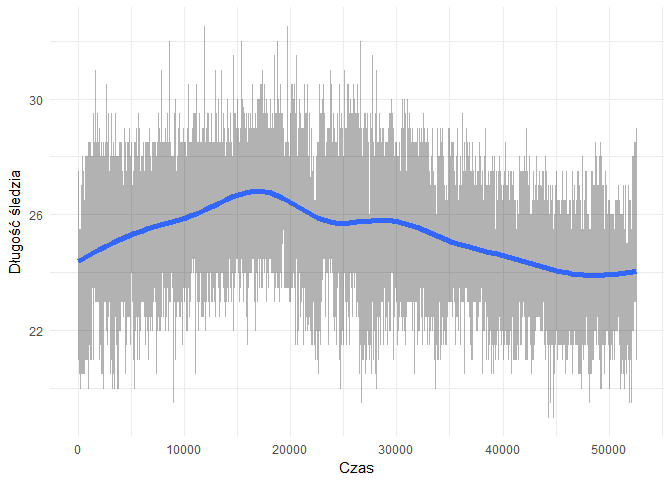
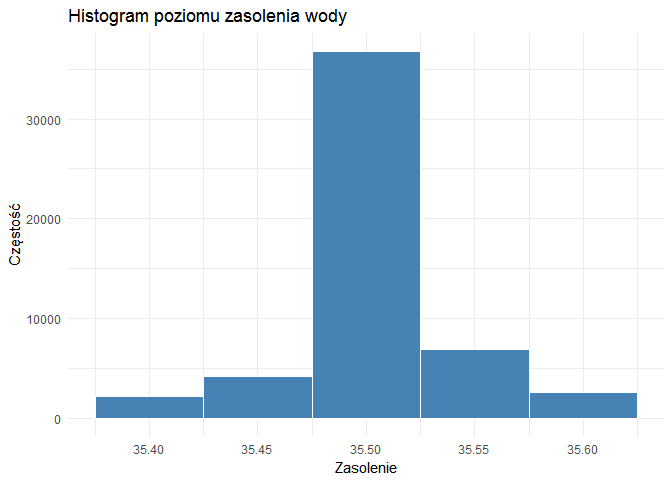
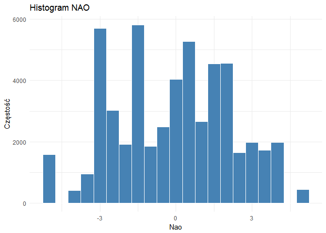
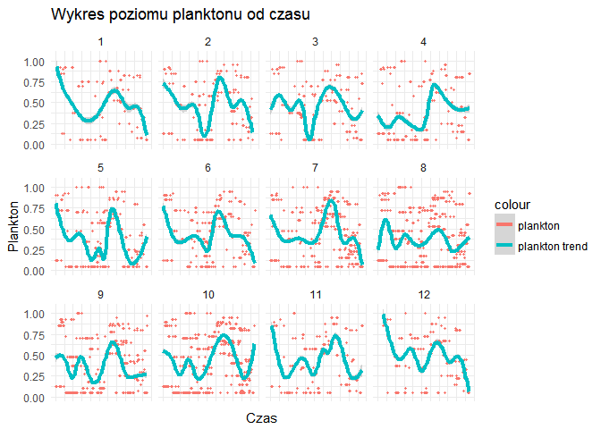
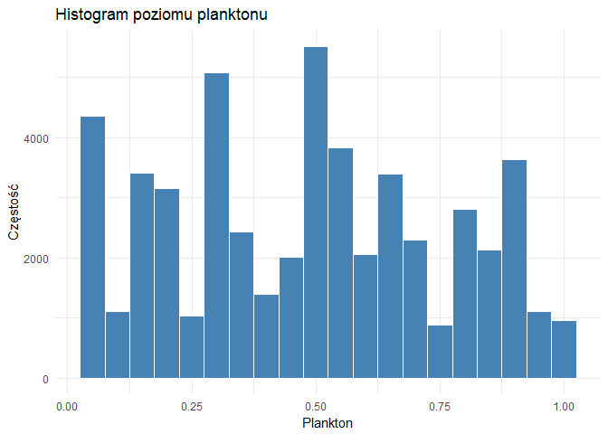
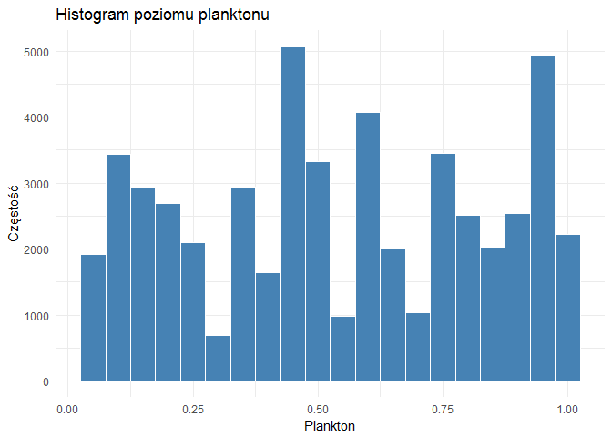
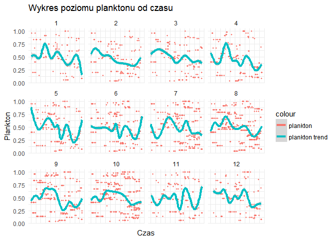
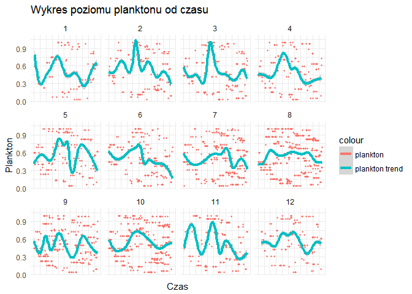

# Raport śledzi
Adam Chojan  
`r format(Sys.time(), '%d %B, %Y')`  


#Wprowadzenie
Tu będzie krótki opis

#Biblioteki

```r
#Generacja raportu
library(knitr)

#Operacje na danych
library(dplyr)
library(tidyr)
library(reshape2)

#Wartości brakujące
library(mice)

#Wykresy
library(ggplot2)
library(hexbin)
library(plotly)
library(tidyr)

#Regresja
library(caret)
```

```
## Warning: package 'caret' was built under R version 3.3.2
```


##Wczytanie danych
Dane zostały wczytane z pliku csv znajdującego się lokalnie na dysku do typu data frame. Przy wczytaniu ustawiono tyo dla wszystkich kolumn na numerci poza kolumnami X oraz xmonth - dla nich ustawiono typ integer. Dokonano również zmiany znaków symbolizujących brakujące dane w zestawie - ? na symbol NA w celu ułatwienia późniejszych operacji podczas analizy wartości brakujących. Ostatecznie dokonano konwersji na typ df_tbl pakietu dplyr.

Dane zostały pobrane ze strony: (http://www.cs.put.poznan.pl/dbrzezinski/teaching/zed/sledzie.csv)

```r
mydata = read.csv("sledzie.csv",  colClasses = c("integer","numeric","numeric","numeric","numeric","numeric","numeric","numeric","numeric","numeric","numeric","numeric","numeric","numeric","integer","numeric"),na.strings = c("NA","?"))
df <- data.frame(mydata)
my_df <- tbl_df(df)
```

#Wstępne rozpoznanie
##Ogólne statystyki dla danych
Dane na, których oparto analizy dotyczą połowu śledzi oceanicznych wyławianych w Europie na przestrzeni 60 lat. Dane zostały zebrane podczas połowów komercyjnych. Do badań brano losowo od 50 do 100 sztuk trzyletnich śledzi.

Table: Tabela podsumująca zbiór danych

           X             length         cfin1             cfin2             chel1            chel2            lcop1              lcop2             fbar             recr              cumf             totaln             sst             sal            xmonth            nao         
---  --------------  -------------  ----------------  ----------------  ---------------  ---------------  -----------------  ---------------  ---------------  ----------------  ----------------  ----------------  --------------  --------------  ---------------  -----------------
     Min.   :    0   Min.   :19.0   Min.   : 0.0000   Min.   : 0.0000   Min.   : 0.000   Min.   : 5.238   Min.   :  0.3074   Min.   : 7.849   Min.   :0.0680   Min.   : 140515   Min.   :0.06833   Min.   : 144137   Min.   :12.77   Min.   :35.40   Min.   : 1.000   Min.   :-4.89000 
     1st Qu.:13145   1st Qu.:24.0   1st Qu.: 0.0000   1st Qu.: 0.2778   1st Qu.: 2.469   1st Qu.:13.427   1st Qu.:  2.5479   1st Qu.:17.808   1st Qu.:0.2270   1st Qu.: 360061   1st Qu.:0.14809   1st Qu.: 306068   1st Qu.:13.60   1st Qu.:35.51   1st Qu.: 5.000   1st Qu.:-1.89000 
     Median :26291   Median :25.5   Median : 0.1111   Median : 0.7012   Median : 5.750   Median :21.673   Median :  7.0000   Median :24.859   Median :0.3320   Median : 421391   Median :0.23191   Median : 539558   Median :13.86   Median :35.51   Median : 8.000   Median : 0.20000 
     Mean   :26291   Mean   :25.3   Mean   : 0.4458   Mean   : 2.0248   Mean   :10.006   Mean   :21.221   Mean   : 12.8108   Mean   :28.419   Mean   :0.3304   Mean   : 520367   Mean   :0.22981   Mean   : 514973   Mean   :13.87   Mean   :35.51   Mean   : 7.258   Mean   :-0.09236 
     3rd Qu.:39436   3rd Qu.:26.5   3rd Qu.: 0.3333   3rd Qu.: 1.7936   3rd Qu.:11.500   3rd Qu.:27.193   3rd Qu.: 21.2315   3rd Qu.:37.232   3rd Qu.:0.4560   3rd Qu.: 724151   3rd Qu.:0.29803   3rd Qu.: 730351   3rd Qu.:14.16   3rd Qu.:35.52   3rd Qu.: 9.000   3rd Qu.: 1.63000 
     Max.   :52581   Max.   :32.5   Max.   :37.6667   Max.   :19.3958   Max.   :75.000   Max.   :57.706   Max.   :115.5833   Max.   :68.736   Max.   :0.8490   Max.   :1565890   Max.   :0.39801   Max.   :1015595   Max.   :14.73   Max.   :35.61   Max.   :12.000   Max.   : 5.08000 
     NA              NA             NA's   :1581      NA's   :1536      NA's   :1555     NA's   :1556     NA's   :1653       NA's   :1591     NA               NA                NA                NA                NA's   :1584    NA              NA               NA               


Table: Tabela zawierająca początkowe wiersze

  X   length     cfin1     cfin2     chel1      chel2     lcop1      lcop2    fbar     recr        cumf     totaln        sst        sal   xmonth   nao
---  -------  --------  --------  --------  ---------  --------  ---------  ------  -------  ----------  ---------  ---------  ---------  -------  ----
  0     23.0   0.02778   0.27785   2.46875         NA   2.54787   26.35881   0.356   482831   0.3059879   267380.8   14.30693   35.51234        7   2.8
  1     22.5   0.02778   0.27785   2.46875   21.43548   2.54787   26.35881   0.356   482831   0.3059879   267380.8   14.30693   35.51234        7   2.8
  2     25.0   0.02778   0.27785   2.46875   21.43548   2.54787   26.35881   0.356   482831   0.3059879   267380.8   14.30693   35.51234        7   2.8
  3     25.5   0.02778   0.27785   2.46875   21.43548   2.54787   26.35881   0.356   482831   0.3059879   267380.8   14.30693   35.51234        7   2.8
  4     24.0   0.02778   0.27785   2.46875   21.43548   2.54787   26.35881   0.356   482831   0.3059879   267380.8   14.30693   35.51234        7   2.8
  5     22.0   0.02778   0.27785   2.46875   21.43548   2.54787         NA   0.356   482831   0.3059879   267380.8   14.30693   35.51234        7   2.8


Table: Tabela unikalnych wartości

     X   length   cfin1   cfin2   chel1   chel2   lcop1   lcop2   fbar   recr   cumf   totaln   sst   sal   xmonth   nao
------  -------  ------  ------  ------  ------  ------  ------  -----  -----  -----  -------  ----  ----  -------  ----
 52582       59      39      48      48      51      48      51     51     52     52       53    51    51       12    45

##Wartości brakujące
Z ogólnych statystyk dla danych dotyczących śledzi można odczytać 7 kolumn, które zawierają wartości brakujące. Ten rozdział raportu będzie poświęcony analizie tych wartości na podstawie, której zostanie podjęta decyzja w jaki sposób zostanie rozwiązany problem - zostawić brakujące wartości, usunąć wiersze z brakującymi wartościami lub wypełnić luki w danych.

###Analiza wartości brakujących
Pierwszym krokiem jest sprawdzenie jaka jest liczba unikalnych wartości dla poszczególnych atrybutów. W poniższej tabeli możemy zaobserwoać niewielką liczbę wartości różnych wartości dla zmiennych posiadających wartości brakujące. Zestaw danych posiada ponad 52 tysiące wiersze, dlatego zmienność danych jest w tych kolumnach nie wielka.


Table: Tabela unikalnych wartości

 cfin1   cfin2   chel1   chel2   lcop1   lcop2   sst
------  ------  ------  ------  ------  ------  ----
    39      48      48      51      48      51    51

Następnie dokonano próby poszukania wzorcóW na podstawie ktorych można, by zdefiniwać zależności między brakami wartości, a atrybutami. Uzyskany jednak poniższy wykres ukazuję dużę liczbę kombinacji brakujących wartości (53). Są to pojedyncze, podWójne i potrójne braki w wierszu.  
<!-- -->


Wykonano również wykres przedstawiający liczbę brakujących wartości dla każdego atrybutu. Są one jednak bardzo zbliżonę i w tym wypadku nie można wskazać atrybutu wyróżniającego się.
<!-- -->

Ostatnim podejściem było obejrzenie danych źródłowych. Kolejne wiersze są zgrupowane  do pojedynczego połowu w pojedyncze połowy, w których jedyną różnicą są długości śledzi. Braki te występują bardzo często w środku takich bloków.

###Wypełnienie brakujących wartości
Na podstawie analizy trudno uzyskać jednoznaczny wzorzec brakujących wartości. Dane brakująće dotyczą poziomu planktonu oraz temperatury przy powierzchni wody. Nie są to atrybuuty o dużej zmienności. Próba wstawienia średniej, mediany lub innej wartości statystycznej może spowowdować duże zniekształcenie danych. Występowanie blokóW takich samych danych w zestawie jak i nie wielka liczba brakujących danych w stosunku do całości zbioru skłoniła do pobierania najbliższej wartości nie brakującej w kierunku do góry i wstawienie jej w puste miejsce. Dodatkowo w pierwszym wierszu występuje również pusta wartość, dlatego powtórzono operacje wstawiania w kierunku dolnym. Poniżej znajduję się kod wypelniający brakujące wartości.


```r
new_my_df<-my_df %>% fill(cfin1:lcop2,sst,.direction = "up") %>% fill(cfin1:lcop2,sst,.direction = "down")
```

Przyjęta metoda nie zaburzyła w widoczny sposób podstawowych statystyk widocznych w poniższej tabli w stosunku do tabeli znajdującej się w sekcji 3.1.


           X             length         cfin1           cfin2            chel1            chel2            lcop1            lcop2            fbar             recr              cumf             totaln                   sst             sal            xmonth            nao         
---  --------------  -------------  --------------  --------------  ---------------  ---------------  ---------------  ---------------  ---------------  ----------------  ----------------  ----------------  --------------------  --------------  ---------------  -----------------
     Min.   :    0   Min.   :19.0   0      :14688   0.70118: 4503   11.5    : 4932   5.67765 : 4498   23      : 4932   9.17171 : 4498   Min.   :0.0680   Min.   : 140515   Min.   :0.06833   Min.   : 144137   13.6315997001: 4495   Min.   :35.40   Min.   : 1.000   Min.   :-4.89000 
     1st Qu.:13145   1st Qu.:24.0   0.02778: 2289   0      : 3912   2.46875 : 2288   21.67333: 3805   2.54787 : 2289   24.85867: 3806   1st Qu.:0.2270   1st Qu.: 360061   1st Qu.:0.14809   1st Qu.: 306068   14.0693330238: 3802   1st Qu.:35.51   1st Qu.: 5.000   1st Qu.:-1.89000 
     Median :26291   Median :25.5   1.02508: 2123   0.296  : 3800   12.15192: 2176   39.56809: 2162   12.49588: 2175   41.65566: 2166   Median :0.3320   Median : 421391   Median :0.23191   Median : 539558   14.4415996823: 2167   Median :35.51   Median : 8.000   Median : 0.20000 
     Mean   :26291   Mean   :25.3   1.21333: 2063   0.11736: 2159   6.42127 : 2123   26.81218: 2063   10.92857: 2124   45.70773: 2063   Mean   :0.3304   Mean   : 520367   Mean   :0.22981   Mean   : 514973   13.5598663683: 2068   Mean   :35.51   Mean   : 7.258   Mean   :-0.09236 
     3rd Qu.:39436   3rd Qu.:26.5   0.33333: 1981   4.55825: 2062   19.15475: 2063   15.03   : 2008   21.23147: 2059   17.68   : 2011   3rd Qu.:0.4560   3rd Qu.: 724151   3rd Qu.:0.29803   3rd Qu.: 730351   13.694933032 : 2007   3rd Qu.:35.52   3rd Qu.: 9.000   3rd Qu.: 1.63000 
     Max.   :52581   Max.   :32.5   0.11111: 1958   0.85684: 1722   9.66667 : 1979   9.43208 : 1722   27.33333: 1983   10.72889: 1722   Max.   :0.8490   Max.   :1565890   Max.   :0.39801   Max.   :1015595   13.861999695 : 1721   Max.   :35.61   Max.   :12.000   Max.   : 5.08000 
     NA              NA             (Other):27480   (Other):34424   (Other) :37021   (Other) :36324   (Other) :37020   (Other) :36316   NA               NA                NA                NA                (Other)      :36322   NA              NA               NA               


#Analiza atrybutów
Zestaw danych zawiera 14 atrybutów. Dotyczą one parametrów morza - temperatura, zasolenie, oscylacja, dostępność planktonu, informacje dotyczące połowów oraz najważniejzy atrybut - długość śledzia.

TODO

* opisy do atrybutów

##Długość śledzia - length

Długość śledzi wyrażona został w centymetrach. Z pierwszego wykresu można odczytać wzrost długość do jednostek czasu ok 17-18 tysięcy, następnie rozpoczyna się spadek tej wartości. Wykres heksalny ukazuje większe skupienie śledzi o długości 26cm i wiecej do jednostki ok 20 tysięcy. Ostatni wykres jest histogramem, który przedstawia rozkład zbliżony do normalnego. Widać na nim przewagę wartości około 25cm.
<!-- --><!--html_preserve--><div id="htmlwidget-fe6835cb11d0bb3e9095" style="width:672px;height:480px;" class="plotly html-widget"></div>
<script type="application/json" data-for="htmlwidget-fe6835cb11d0bb3e9095">{"x":{"data":[{"x":[44598.2390906423,44598.2390906423,43817.499999,43036.7609073577,43036.7609073577,43817.499999,44598.2390906423,null,46350.9390906423,46350.9390906423,45570.199999,44789.4609073577,44789.4609073577,45570.199999,46350.9390906423,null,45474.5890906423,45474.5890906423,44693.849999,43913.1109073577,43913.1109073577,44693.849999,45474.5890906423,null,48979.9890906423,48979.9890906423,48199.249999,47418.5109073577,47418.5109073577,48199.249999,48979.9890906423,null,9544.23909064228,9544.23909064228,8763.499999,7982.76090735772,7982.76090735772,8763.499999,9544.23909064228,null,27071.2390906423,27071.2390906423,26290.499999,25509.7609073577,25509.7609073577,26290.499999,27071.2390906423,null,53361.7390906423,53361.7390906423,52580.999999,51800.2609073577,51800.2609073577,52580.999999,53361.7390906423,null,26194.8890906423,26194.8890906423,25414.149999,24633.4109073577,24633.4109073577,25414.149999,26194.8890906423,null,34958.3890906423,34958.3890906423,34177.649999,33396.9109073577,33396.9109073577,34177.649999,34958.3890906423,null,48979.9890906423,48979.9890906423,48199.249999,47418.5109073577,47418.5109073577,48199.249999,48979.9890906423,null,7791.53909064229,7791.53909064229,7010.799999,6230.06090735771,6230.06090735771,7010.799999,7791.53909064229,null,11296.9390906423,11296.9390906423,10516.199999,9735.46090735772,9735.46090735772,10516.199999,11296.9390906423,null,25318.5390906423,25318.5390906423,24537.799999,23757.0609073577,23757.0609073577,24537.799999,25318.5390906423,null,32329.3390906423,32329.3390906423,31548.599999,30767.8609073577,30767.8609073577,31548.599999,32329.3390906423,null,34082.0390906423,34082.0390906423,33301.299999,32520.5609073577,32520.5609073577,33301.299999,34082.0390906423,null,37587.4390906423,37587.4390906423,36806.699999,36025.9609073577,36025.9609073577,36806.699999,37587.4390906423,null,41092.8390906423,41092.8390906423,40312.099999,39531.3609073577,39531.3609073577,40312.099999,41092.8390906423,null,42845.5390906423,42845.5390906423,42064.799999,41284.0609073577,41284.0609073577,42064.799999,42845.5390906423,null,8667.88909064229,8667.88909064229,7887.149999,7106.41090735771,7106.41090735771,7887.149999,8667.88909064229,null,53361.7390906423,53361.7390906423,52580.999999,51800.2609073577,51800.2609073577,52580.999999,53361.7390906423,null,17431.3890906423,17431.3890906423,16650.649999,15869.9109073577,15869.9109073577,16650.649999,17431.3890906423,null,13049.6390906423,13049.6390906423,12268.899999,11488.1609073577,11488.1609073577,12268.899999,13049.6390906423,null,14802.3390906423,14802.3390906423,14021.599999,13240.8609073577,13240.8609073577,14021.599999,14802.3390906423,null,16555.0390906423,16555.0390906423,15774.299999,14993.5609073577,14993.5609073577,15774.299999,16555.0390906423,null,18307.7390906423,18307.7390906423,17526.999999,16746.2609073577,16746.2609073577,17526.999999,18307.7390906423,null,18307.7390906423,18307.7390906423,17526.999999,16746.2609073577,16746.2609073577,17526.999999,18307.7390906423,null,20060.4390906423,20060.4390906423,19279.699999,18498.9609073577,18498.9609073577,19279.699999,20060.4390906423,null,45474.5890906423,45474.5890906423,44693.849999,43913.1109073577,43913.1109073577,44693.849999,45474.5890906423,null,50732.6890906423,50732.6890906423,49951.949999,49171.2109073577,49171.2109073577,49951.949999,50732.6890906423,null,2533.43909064229,2533.43909064229,1752.699999,971.960907357715,971.960907357715,1752.699999,2533.43909064229,null,4286.13909064229,4286.13909064229,3505.399999,2724.66090735772,2724.66090735772,3505.399999,4286.13909064229,null,41092.8390906423,41092.8390906423,40312.099999,39531.3609073577,39531.3609073577,40312.099999,41092.8390906423,null,42845.5390906423,42845.5390906423,42064.799999,41284.0609073577,41284.0609073577,42064.799999,42845.5390906423,null,49856.3390906423,49856.3390906423,49075.599999,48294.8609073577,48294.8609073577,49075.599999,49856.3390906423,null,48979.9890906423,48979.9890906423,48199.249999,47418.5109073577,47418.5109073577,48199.249999,48979.9890906423,null,50732.6890906423,50732.6890906423,49951.949999,49171.2109073577,49171.2109073577,49951.949999,50732.6890906423,null,37587.4390906423,37587.4390906423,36806.699999,36025.9609073577,36025.9609073577,36806.699999,37587.4390906423,null,39340.1390906423,39340.1390906423,38559.399999,37778.6609073577,37778.6609073577,38559.399999,39340.1390906423,null,42845.5390906423,42845.5390906423,42064.799999,41284.0609073577,41284.0609073577,42064.799999,42845.5390906423,null,53361.7390906423,53361.7390906423,52580.999999,51800.2609073577,51800.2609073577,52580.999999,53361.7390906423,null,5162.48909064228,5162.48909064228,4381.749999,3601.01090735771,3601.01090735771,4381.749999,5162.48909064228,null,6915.18909064229,6915.18909064229,6134.449999,5353.71090735771,5353.71090735771,6134.449999,6915.18909064229,null,33205.6890906423,33205.6890906423,32424.949999,31644.2109073577,31644.2109073577,32424.949999,33205.6890906423,null,36711.0890906423,36711.0890906423,35930.349999,35149.6109073577,35149.6109073577,35930.349999,36711.0890906423,null,9544.23909064228,9544.23909064228,8763.499999,7982.76090735772,7982.76090735772,8763.499999,9544.23909064228,null,14802.3390906423,14802.3390906423,14021.599999,13240.8609073577,13240.8609073577,14021.599999,14802.3390906423,null,21813.1390906423,21813.1390906423,21032.399999,20251.6609073577,20251.6609073577,21032.399999,21813.1390906423,null,27071.2390906423,27071.2390906423,26290.499999,25509.7609073577,25509.7609073577,26290.499999,27071.2390906423,null,30576.6390906423,30576.6390906423,29795.899999,29015.1609073577,29015.1609073577,29795.899999,30576.6390906423,null,13925.9890906423,13925.9890906423,13145.249999,12364.5109073577,12364.5109073577,13145.249999,13925.9890906423,null,15678.6890906423,15678.6890906423,14897.949999,14117.2109073577,14117.2109073577,14897.949999,15678.6890906423,null,26194.8890906423,26194.8890906423,25414.149999,24633.4109073577,24633.4109073577,25414.149999,26194.8890906423,null,4286.13909064229,4286.13909064229,3505.399999,2724.66090735772,2724.66090735772,3505.399999,4286.13909064229,null,13049.6390906423,13049.6390906423,12268.899999,11488.1609073577,11488.1609073577,12268.899999,13049.6390906423,null,14802.3390906423,14802.3390906423,14021.599999,13240.8609073577,13240.8609073577,14021.599999,14802.3390906423,null,16555.0390906423,16555.0390906423,15774.299999,14993.5609073577,14993.5609073577,15774.299999,16555.0390906423,null,1657.08909064229,1657.08909064229,876.349999,95.610907357715,95.610907357715,876.349999,1657.08909064229,null,17431.3890906423,17431.3890906423,16650.649999,15869.9109073577,15869.9109073577,16650.649999,17431.3890906423,null,24442.1890906423,24442.1890906423,23661.449999,22880.7109073577,22880.7109073577,23661.449999,24442.1890906423,null,26194.8890906423,26194.8890906423,25414.149999,24633.4109073577,24633.4109073577,25414.149999,26194.8890906423,null,29700.2890906423,29700.2890906423,28919.549999,28138.8109073577,28138.8109073577,28919.549999,29700.2890906423,null,14802.3390906423,14802.3390906423,14021.599999,13240.8609073577,13240.8609073577,14021.599999,14802.3390906423,null,21813.1390906423,21813.1390906423,21032.399999,20251.6609073577,20251.6609073577,21032.399999,21813.1390906423,null,28823.9390906423,28823.9390906423,28043.199999,27262.4609073577,27262.4609073577,28043.199999,28823.9390906423,null,9544.23909064228,9544.23909064228,8763.499999,7982.76090735772,7982.76090735772,8763.499999,9544.23909064228,null,16555.0390906423,16555.0390906423,15774.299999,14993.5609073577,14993.5609073577,15774.299999,16555.0390906423,null,20060.4390906423,20060.4390906423,19279.699999,18498.9609073577,18498.9609073577,19279.699999,20060.4390906423,null,27071.2390906423,27071.2390906423,26290.499999,25509.7609073577,25509.7609073577,26290.499999,27071.2390906423,null,12173.2890906423,12173.2890906423,11392.549999,10611.8109073577,10611.8109073577,11392.549999,12173.2890906423,null,20936.7890906423,20936.7890906423,20156.049999,19375.3109073577,19375.3109073577,20156.049999,20936.7890906423],"y":[19.0152590216594,18.7847389783406,18.6694789566812,18.7847389783406,19.0152590216594,19.1305190433188,19.0152590216594,null,19.0152590216594,18.7847389783406,18.6694789566812,18.7847389783406,19.0152590216594,19.1305190433188,19.0152590216594,null,19.4049704533624,19.1744504100436,19.0591903883842,19.1744504100436,19.4049704533624,19.5202304750218,19.4049704533624,null,19.4049704533624,19.1744504100436,19.0591903883842,19.1744504100436,19.4049704533624,19.5202304750218,19.4049704533624,null,19.7946818850654,19.5641618417466,19.4489018200872,19.5641618417466,19.7946818850654,19.9099419067248,19.7946818850654,null,19.7946818850654,19.5641618417466,19.4489018200872,19.5641618417466,19.7946818850654,19.9099419067248,19.7946818850654,null,19.7946818850654,19.5641618417466,19.4489018200872,19.5641618417466,19.7946818850654,19.9099419067248,19.7946818850654,null,20.1843933167684,19.9538732734496,19.8386132517902,19.9538732734496,20.1843933167684,20.2996533384278,20.1843933167684,null,20.1843933167684,19.9538732734496,19.8386132517902,19.9538732734496,20.1843933167684,20.2996533384278,20.1843933167684,null,20.1843933167684,19.9538732734496,19.8386132517902,19.9538732734496,20.1843933167684,20.2996533384278,20.1843933167684,null,20.5741047484714,20.3435847051526,20.2283246834932,20.3435847051526,20.5741047484714,20.6893647701308,20.5741047484714,null,20.5741047484714,20.3435847051526,20.2283246834932,20.3435847051526,20.5741047484714,20.6893647701308,20.5741047484714,null,20.5741047484714,20.3435847051526,20.2283246834932,20.3435847051526,20.5741047484714,20.6893647701308,20.5741047484714,null,20.5741047484714,20.3435847051526,20.2283246834932,20.3435847051526,20.5741047484714,20.6893647701308,20.5741047484714,null,20.5741047484714,20.3435847051526,20.2283246834932,20.3435847051526,20.5741047484714,20.6893647701308,20.5741047484714,null,20.5741047484714,20.3435847051526,20.2283246834932,20.3435847051526,20.5741047484714,20.6893647701308,20.5741047484714,null,20.5741047484714,20.3435847051526,20.2283246834932,20.3435847051526,20.5741047484714,20.6893647701308,20.5741047484714,null,20.5741047484714,20.3435847051526,20.2283246834932,20.3435847051526,20.5741047484714,20.6893647701308,20.5741047484714,null,20.9638161801744,20.7332961368556,20.6180361151962,20.7332961368556,20.9638161801744,21.0790762018338,20.9638161801744,null,21.3535276118774,21.1230075685586,21.0077475468992,21.1230075685586,21.3535276118774,21.4687876335368,21.3535276118774,null,21.7432390435804,21.5127190002616,21.3974589786022,21.5127190002616,21.7432390435804,21.8584990652398,21.7432390435804,null,22.1329504752834,21.9024304319646,21.7871704103052,21.9024304319646,22.1329504752834,22.2482104969428,22.1329504752834,null,22.1329504752834,21.9024304319646,21.7871704103052,21.9024304319646,22.1329504752834,22.2482104969428,22.1329504752834,null,22.1329504752834,21.9024304319646,21.7871704103052,21.9024304319646,22.1329504752834,22.2482104969428,22.1329504752834,null,22.1329504752834,21.9024304319646,21.7871704103052,21.9024304319646,22.1329504752834,22.2482104969428,22.1329504752834,null,22.9123733386894,22.6818532953706,22.5665932737112,22.6818532953706,22.9123733386894,23.0276333603488,22.9123733386894,null,22.9123733386894,22.6818532953706,22.5665932737112,22.6818532953706,22.9123733386894,23.0276333603488,22.9123733386894,null,27.9786219508283,27.7481019075095,27.6328418858501,27.7481019075095,27.9786219508283,28.0938819724878,27.9786219508283,null,27.9786219508283,27.7481019075095,27.6328418858501,27.7481019075095,27.9786219508283,28.0938819724878,27.9786219508283,null,28.3683333825313,28.1378133392125,28.0225533175531,28.1378133392125,28.3683333825313,28.4835934041907,28.3683333825313,null,28.3683333825313,28.1378133392125,28.0225533175531,28.1378133392125,28.3683333825313,28.4835934041907,28.3683333825313,null,28.3683333825313,28.1378133392125,28.0225533175531,28.1378133392125,28.3683333825313,28.4835934041907,28.3683333825313,null,28.3683333825313,28.1378133392125,28.0225533175531,28.1378133392125,28.3683333825313,28.4835934041907,28.3683333825313,null,28.3683333825313,28.1378133392125,28.0225533175531,28.1378133392125,28.3683333825313,28.4835934041907,28.3683333825313,null,28.7580448142343,28.5275247709155,28.4122647492561,28.5275247709155,28.7580448142343,28.8733048358937,28.7580448142343,null,28.7580448142343,28.5275247709155,28.4122647492561,28.5275247709155,28.7580448142343,28.8733048358937,28.7580448142343,null,29.1477562459373,28.9172362026185,28.8019761809591,28.9172362026185,29.1477562459373,29.2630162675967,29.1477562459373,null,29.1477562459373,28.9172362026185,28.8019761809591,28.9172362026185,29.1477562459373,29.2630162675967,29.1477562459373,null,29.1477562459373,28.9172362026185,28.8019761809591,28.9172362026185,29.1477562459373,29.2630162675967,29.1477562459373,null,29.1477562459373,28.9172362026185,28.8019761809591,28.9172362026185,29.1477562459373,29.2630162675967,29.1477562459373,null,29.5374676776403,29.3069476343215,29.1916876126621,29.3069476343215,29.5374676776403,29.6527276992997,29.5374676776403,null,29.5374676776403,29.3069476343215,29.1916876126621,29.3069476343215,29.5374676776403,29.6527276992997,29.5374676776403,null,29.5374676776403,29.3069476343215,29.1916876126621,29.3069476343215,29.5374676776403,29.6527276992997,29.5374676776403,null,29.5374676776403,29.3069476343215,29.1916876126621,29.3069476343215,29.5374676776403,29.6527276992997,29.5374676776403,null,29.9271791093433,29.6966590660245,29.5813990443651,29.6966590660245,29.9271791093433,30.0424391310027,29.9271791093433,null,29.9271791093433,29.6966590660245,29.5813990443651,29.6966590660245,29.9271791093433,30.0424391310027,29.9271791093433,null,29.9271791093433,29.6966590660245,29.5813990443651,29.6966590660245,29.9271791093433,30.0424391310027,29.9271791093433,null,29.9271791093433,29.6966590660245,29.5813990443651,29.6966590660245,29.9271791093433,30.0424391310027,29.9271791093433,null,29.9271791093433,29.6966590660245,29.5813990443651,29.6966590660245,29.9271791093433,30.0424391310027,29.9271791093433,null,30.3168905410463,30.0863704977275,29.9711104760681,30.0863704977275,30.3168905410463,30.4321505627057,30.3168905410463,null,30.3168905410463,30.0863704977275,29.9711104760681,30.0863704977275,30.3168905410463,30.4321505627057,30.3168905410463,null,30.3168905410463,30.0863704977275,29.9711104760681,30.0863704977275,30.3168905410463,30.4321505627057,30.3168905410463,null,30.7066019727493,30.4760819294305,30.3608219077711,30.4760819294305,30.7066019727493,30.8218619944087,30.7066019727493,null,30.7066019727493,30.4760819294305,30.3608219077711,30.4760819294305,30.7066019727493,30.8218619944087,30.7066019727493,null,30.7066019727493,30.4760819294305,30.3608219077711,30.4760819294305,30.7066019727493,30.8218619944087,30.7066019727493,null,30.7066019727493,30.4760819294305,30.3608219077711,30.4760819294305,30.7066019727493,30.8218619944087,30.7066019727493,null,31.0963134044523,30.8657933611335,30.7505333394741,30.8657933611335,31.0963134044523,31.2115734261117,31.0963134044523,null,31.0963134044523,30.8657933611335,30.7505333394741,30.8657933611335,31.0963134044523,31.2115734261117,31.0963134044523,null,31.0963134044523,30.8657933611335,30.7505333394741,30.8657933611335,31.0963134044523,31.2115734261117,31.0963134044523,null,31.0963134044523,30.8657933611335,30.7505333394741,30.8657933611335,31.0963134044523,31.2115734261117,31.0963134044523,null,31.0963134044523,30.8657933611335,30.7505333394741,30.8657933611335,31.0963134044523,31.2115734261117,31.0963134044523,null,31.4860248361553,31.2555047928365,31.1402447711771,31.2555047928365,31.4860248361553,31.6012848578147,31.4860248361553,null,31.4860248361553,31.2555047928365,31.1402447711771,31.2555047928365,31.4860248361553,31.6012848578147,31.4860248361553,null,31.4860248361553,31.2555047928365,31.1402447711771,31.2555047928365,31.4860248361553,31.6012848578147,31.4860248361553,null,32.2654476995613,32.0349276562425,31.9196676345831,32.0349276562425,32.2654476995613,32.3807077212207,32.2654476995613,null,32.2654476995613,32.0349276562425,31.9196676345831,32.0349276562425,32.2654476995613,32.3807077212207,32.2654476995613,null,32.2654476995613,32.0349276562425,31.9196676345831,32.0349276562425,32.2654476995613,32.3807077212207,32.2654476995613,null,32.2654476995613,32.0349276562425,31.9196676345831,32.0349276562425,32.2654476995613,32.3807077212207,32.2654476995613,null,32.6551591312643,32.4246390879455,32.3093790662861,32.4246390879455,32.6551591312643,32.7704191529237,32.6551591312643,null,32.6551591312643,32.4246390879455,32.3093790662861,32.4246390879455,32.6551591312643,32.7704191529237,32.6551591312643],"text":"count: 1","key":null,"type":"scatter","mode":"lines","line":{"width":3.36717625753829,"color":"transparent","dash":"solid"},"fill":"toself","fillcolor":"rgba(19,43,67,1)","hoveron":"fills","showlegend":false,"xaxis":"x","yaxis":"y","hoverinfo":"text","name":""},{"x":[52485.3890906423,52485.3890906423,51704.649999,50923.9109073577,50923.9109073577,51704.649999,52485.3890906423,null,1657.08909064229,1657.08909064229,876.349999,95.610907357715,95.610907357715,876.349999,1657.08909064229,null,6915.18909064229,6915.18909064229,6134.449999,5353.71090735771,5353.71090735771,6134.449999,6915.18909064229,null,27947.5890906423,27947.5890906423,27166.849999,26386.1109073577,26386.1109073577,27166.849999,27947.5890906423,null,9544.23909064228,9544.23909064228,8763.499999,7982.76090735772,7982.76090735772,8763.499999,9544.23909064228,null,23565.8390906423,23565.8390906423,22785.099999,22004.3609073577,22004.3609073577,22785.099999,23565.8390906423,null,53361.7390906423,53361.7390906423,52580.999999,51800.2609073577,51800.2609073577,52580.999999,53361.7390906423,null,29700.2890906423,29700.2890906423,28919.549999,28138.8109073577,28138.8109073577,28919.549999,29700.2890906423,null,25318.5390906423,25318.5390906423,24537.799999,23757.0609073577,23757.0609073577,24537.799999,25318.5390906423,null,39340.1390906423,39340.1390906423,38559.399999,37778.6609073577,37778.6609073577,38559.399999,39340.1390906423,null,46350.9390906423,46350.9390906423,45570.199999,44789.4609073577,44789.4609073577,45570.199999,46350.9390906423,null,48103.6390906423,48103.6390906423,47322.899999,46542.1609073577,46542.1609073577,47322.899999,48103.6390906423,null,36711.0890906423,36711.0890906423,35930.349999,35149.6109073577,35149.6109073577,35930.349999,36711.0890906423,null,17431.3890906423,17431.3890906423,16650.649999,15869.9109073577,15869.9109073577,16650.649999,17431.3890906423,null,19184.0890906423,19184.0890906423,18403.349999,17622.6109073577,17622.6109073577,18403.349999,19184.0890906423,null,20936.7890906423,20936.7890906423,20156.049999,19375.3109073577,19375.3109073577,20156.049999,20936.7890906423,null,41969.1890906423,41969.1890906423,41188.449999,40407.7109073577,40407.7109073577,41188.449999,41969.1890906423,null,43721.8890906423,43721.8890906423,42941.149999,42160.4109073577,42160.4109073577,42941.149999,43721.8890906423,null,48979.9890906423,48979.9890906423,48199.249999,47418.5109073577,47418.5109073577,48199.249999,48979.9890906423,null,6038.83909064228,6038.83909064228,5258.099999,4477.36090735772,4477.36090735772,5258.099999,6038.83909064228,null,35834.7390906423,35834.7390906423,35053.999999,34273.2609073577,34273.2609073577,35053.999999,35834.7390906423,null,37587.4390906423,37587.4390906423,36806.699999,36025.9609073577,36025.9609073577,36806.699999,37587.4390906423,null,53361.7390906423,53361.7390906423,52580.999999,51800.2609073577,51800.2609073577,52580.999999,53361.7390906423,null,38463.7890906423,38463.7890906423,37683.049999,36902.3109073577,36902.3109073577,37683.049999,38463.7890906423,null,2533.43909064229,2533.43909064229,1752.699999,971.960907357715,971.960907357715,1752.699999,2533.43909064229,null,4286.13909064229,4286.13909064229,3505.399999,2724.66090735772,2724.66090735772,3505.399999,4286.13909064229,null,7791.53909064229,7791.53909064229,7010.799999,6230.06090735771,6230.06090735771,7010.799999,7791.53909064229,null,9544.23909064228,9544.23909064228,8763.499999,7982.76090735772,7982.76090735772,8763.499999,9544.23909064228,null,1657.08909064229,1657.08909064229,876.349999,95.610907357715,95.610907357715,876.349999,1657.08909064229,null,8667.88909064229,8667.88909064229,7887.149999,7106.41090735771,7106.41090735771,7887.149999,8667.88909064229,null,10420.5890906423,10420.5890906423,9639.849999,8859.11090735772,8859.11090735772,9639.849999,10420.5890906423,null,20060.4390906423,20060.4390906423,19279.699999,18498.9609073577,18498.9609073577,19279.699999,20060.4390906423,null,23565.8390906423,23565.8390906423,22785.099999,22004.3609073577,22004.3609073577,22785.099999,23565.8390906423,null,19184.0890906423,19184.0890906423,18403.349999,17622.6109073577,17622.6109073577,18403.349999,19184.0890906423,null,24442.1890906423,24442.1890906423,23661.449999,22880.7109073577,22880.7109073577,23661.449999,24442.1890906423,null,23565.8390906423,23565.8390906423,22785.099999,22004.3609073577,22004.3609073577,22785.099999,23565.8390906423,null,13925.9890906423,13925.9890906423,13145.249999,12364.5109073577,12364.5109073577,13145.249999,13925.9890906423,null,19184.0890906423,19184.0890906423,18403.349999,17622.6109073577,17622.6109073577,18403.349999,19184.0890906423,null,20060.4390906423,20060.4390906423,19279.699999,18498.9609073577,18498.9609073577,19279.699999,20060.4390906423],"y":[19.4049704533624,19.1744504100436,19.0591903883842,19.1744504100436,19.4049704533624,19.5202304750218,19.4049704533624,null,20.1843933167684,19.9538732734496,19.8386132517902,19.9538732734496,20.1843933167684,20.2996533384278,20.1843933167684,null,20.1843933167684,19.9538732734496,19.8386132517902,19.9538732734496,20.1843933167684,20.2996533384278,20.1843933167684,null,20.1843933167684,19.9538732734496,19.8386132517902,19.9538732734496,20.1843933167684,20.2996533384278,20.1843933167684,null,20.5741047484714,20.3435847051526,20.2283246834932,20.3435847051526,20.5741047484714,20.6893647701308,20.5741047484714,null,20.5741047484714,20.3435847051526,20.2283246834932,20.3435847051526,20.5741047484714,20.6893647701308,20.5741047484714,null,20.5741047484714,20.3435847051526,20.2283246834932,20.3435847051526,20.5741047484714,20.6893647701308,20.5741047484714,null,20.9638161801744,20.7332961368556,20.6180361151962,20.7332961368556,20.9638161801744,21.0790762018338,20.9638161801744,null,21.3535276118774,21.1230075685586,21.0077475468992,21.1230075685586,21.3535276118774,21.4687876335368,21.3535276118774,null,21.3535276118774,21.1230075685586,21.0077475468992,21.1230075685586,21.3535276118774,21.4687876335368,21.3535276118774,null,21.3535276118774,21.1230075685586,21.0077475468992,21.1230075685586,21.3535276118774,21.4687876335368,21.3535276118774,null,21.3535276118774,21.1230075685586,21.0077475468992,21.1230075685586,21.3535276118774,21.4687876335368,21.3535276118774,null,21.7432390435804,21.5127190002616,21.3974589786022,21.5127190002616,21.7432390435804,21.8584990652398,21.7432390435804,null,23.3020847703924,23.0715647270736,22.9563047054142,23.0715647270736,23.3020847703924,23.4173447920518,23.3020847703924,null,23.3020847703924,23.0715647270736,22.9563047054142,23.0715647270736,23.3020847703924,23.4173447920518,23.3020847703924,null,23.3020847703924,23.0715647270736,22.9563047054142,23.0715647270736,23.3020847703924,23.4173447920518,23.3020847703924,null,27.9786219508283,27.7481019075095,27.6328418858501,27.7481019075095,27.9786219508283,28.0938819724878,27.9786219508283,null,27.9786219508283,27.7481019075095,27.6328418858501,27.7481019075095,27.9786219508283,28.0938819724878,27.9786219508283,null,27.9786219508283,27.7481019075095,27.6328418858501,27.7481019075095,27.9786219508283,28.0938819724878,27.9786219508283,null,28.3683333825313,28.1378133392125,28.0225533175531,28.1378133392125,28.3683333825313,28.4835934041907,28.3683333825313,null,28.3683333825313,28.1378133392125,28.0225533175531,28.1378133392125,28.3683333825313,28.4835934041907,28.3683333825313,null,28.3683333825313,28.1378133392125,28.0225533175531,28.1378133392125,28.3683333825313,28.4835934041907,28.3683333825313,null,28.3683333825313,28.1378133392125,28.0225533175531,28.1378133392125,28.3683333825313,28.4835934041907,28.3683333825313,null,28.7580448142343,28.5275247709155,28.4122647492561,28.5275247709155,28.7580448142343,28.8733048358937,28.7580448142343,null,29.1477562459373,28.9172362026185,28.8019761809591,28.9172362026185,29.1477562459373,29.2630162675967,29.1477562459373,null,29.1477562459373,28.9172362026185,28.8019761809591,28.9172362026185,29.1477562459373,29.2630162675967,29.1477562459373,null,29.1477562459373,28.9172362026185,28.8019761809591,28.9172362026185,29.1477562459373,29.2630162675967,29.1477562459373,null,29.1477562459373,28.9172362026185,28.8019761809591,28.9172362026185,29.1477562459373,29.2630162675967,29.1477562459373,null,29.5374676776403,29.3069476343215,29.1916876126621,29.3069476343215,29.5374676776403,29.6527276992997,29.5374676776403,null,29.5374676776403,29.3069476343215,29.1916876126621,29.3069476343215,29.5374676776403,29.6527276992997,29.5374676776403,null,29.5374676776403,29.3069476343215,29.1916876126621,29.3069476343215,29.5374676776403,29.6527276992997,29.5374676776403,null,29.9271791093433,29.6966590660245,29.5813990443651,29.6966590660245,29.9271791093433,30.0424391310027,29.9271791093433,null,29.9271791093433,29.6966590660245,29.5813990443651,29.6966590660245,29.9271791093433,30.0424391310027,29.9271791093433,null,30.3168905410463,30.0863704977275,29.9711104760681,30.0863704977275,30.3168905410463,30.4321505627057,30.3168905410463,null,30.3168905410463,30.0863704977275,29.9711104760681,30.0863704977275,30.3168905410463,30.4321505627057,30.3168905410463,null,30.7066019727493,30.4760819294305,30.3608219077711,30.4760819294305,30.7066019727493,30.8218619944087,30.7066019727493,null,31.0963134044523,30.8657933611335,30.7505333394741,30.8657933611335,31.0963134044523,31.2115734261117,31.0963134044523,null,31.0963134044523,30.8657933611335,30.7505333394741,30.8657933611335,31.0963134044523,31.2115734261117,31.0963134044523,null,31.4860248361553,31.2555047928365,31.1402447711771,31.2555047928365,31.4860248361553,31.6012848578147,31.4860248361553],"text":"count: 2","key":null,"type":"scatter","mode":"lines","line":{"width":3.36717625753829,"color":"transparent","dash":"solid"},"fill":"toself","fillcolor":"rgba(19,43,67,1)","hoveron":"fills","showlegend":false,"xaxis":"x","yaxis":"y","hoverinfo":"text","name":""},{"x":[5162.48909064228,5162.48909064228,4381.749999,3601.01090735771,3601.01090735771,4381.749999,5162.48909064228,null,45474.5890906423,45474.5890906423,44693.849999,43913.1109073577,43913.1109073577,44693.849999,45474.5890906423,null,50732.6890906423,50732.6890906423,49951.949999,49171.2109073577,49171.2109073577,49951.949999,50732.6890906423,null,27071.2390906423,27071.2390906423,26290.499999,25509.7609073577,25509.7609073577,26290.499999,27071.2390906423,null,28823.9390906423,28823.9390906423,28043.199999,27262.4609073577,27262.4609073577,28043.199999,28823.9390906423,null,46350.9390906423,46350.9390906423,45570.199999,44789.4609073577,44789.4609073577,45570.199999,46350.9390906423,null,51609.0390906423,51609.0390906423,50828.299999,50047.5609073577,50047.5609073577,50828.299999,51609.0390906423,null,4286.13909064229,4286.13909064229,3505.399999,2724.66090735772,2724.66090735772,3505.399999,4286.13909064229,null,20936.7890906423,20936.7890906423,20156.049999,19375.3109073577,19375.3109073577,20156.049999,20936.7890906423,null,29700.2890906423,29700.2890906423,28919.549999,28138.8109073577,28138.8109073577,28919.549999,29700.2890906423,null,38463.7890906423,38463.7890906423,37683.049999,36902.3109073577,36902.3109073577,37683.049999,38463.7890906423,null,11296.9390906423,11296.9390906423,10516.199999,9735.46090735772,9735.46090735772,10516.199999,11296.9390906423,null,12173.2890906423,12173.2890906423,11392.549999,10611.8109073577,10611.8109073577,11392.549999,12173.2890906423,null,17431.3890906423,17431.3890906423,16650.649999,15869.9109073577,15869.9109073577,16650.649999,17431.3890906423,null,20936.7890906423,20936.7890906423,20156.049999,19375.3109073577,19375.3109073577,20156.049999,20936.7890906423,null,11296.9390906423,11296.9390906423,10516.199999,9735.46090735772,9735.46090735772,10516.199999,11296.9390906423,null,15678.6890906423,15678.6890906423,14897.949999,14117.2109073577,14117.2109073577,14897.949999,15678.6890906423,null,46350.9390906423,46350.9390906423,45570.199999,44789.4609073577,44789.4609073577,45570.199999,46350.9390906423,null,49856.3390906423,49856.3390906423,49075.599999,48294.8609073577,48294.8609073577,49075.599999,49856.3390906423,null,32329.3390906423,32329.3390906423,31548.599999,30767.8609073577,30767.8609073577,31548.599999,32329.3390906423,null,52485.3890906423,52485.3890906423,51704.649999,50923.9109073577,50923.9109073577,51704.649999,52485.3890906423,null,6038.83909064228,6038.83909064228,5258.099999,4477.36090735772,4477.36090735772,5258.099999,6038.83909064228,null,3409.78909064229,3409.78909064229,2629.049999,1848.31090735772,1848.31090735772,2629.049999,3409.78909064229,null,31452.9890906423,31452.9890906423,30672.249999,29891.5109073577,29891.5109073577,30672.249999,31452.9890906423,null,16555.0390906423,16555.0390906423,15774.299999,14993.5609073577,14993.5609073577,15774.299999,16555.0390906423,null,18307.7390906423,18307.7390906423,17526.999999,16746.2609073577,16746.2609073577,17526.999999,18307.7390906423,null,20936.7890906423,20936.7890906423,20156.049999,19375.3109073577,19375.3109073577,20156.049999,20936.7890906423,null,31452.9890906423,31452.9890906423,30672.249999,29891.5109073577,29891.5109073577,30672.249999,31452.9890906423,null,11296.9390906423,11296.9390906423,10516.199999,9735.46090735772,9735.46090735772,10516.199999,11296.9390906423,null,18307.7390906423,18307.7390906423,17526.999999,16746.2609073577,16746.2609073577,17526.999999,18307.7390906423,null,25318.5390906423,25318.5390906423,24537.799999,23757.0609073577,23757.0609073577,24537.799999,25318.5390906423,null,27071.2390906423,27071.2390906423,26290.499999,25509.7609073577,25509.7609073577,26290.499999,27071.2390906423],"y":[20.1843933167684,19.9538732734496,19.8386132517902,19.9538732734496,20.1843933167684,20.2996533384278,20.1843933167684,null,20.1843933167684,19.9538732734496,19.8386132517902,19.9538732734496,20.1843933167684,20.2996533384278,20.1843933167684,null,20.1843933167684,19.9538732734496,19.8386132517902,19.9538732734496,20.1843933167684,20.2996533384278,20.1843933167684,null,20.5741047484714,20.3435847051526,20.2283246834932,20.3435847051526,20.5741047484714,20.6893647701308,20.5741047484714,null,20.5741047484714,20.3435847051526,20.2283246834932,20.3435847051526,20.5741047484714,20.6893647701308,20.5741047484714,null,20.5741047484714,20.3435847051526,20.2283246834932,20.3435847051526,20.5741047484714,20.6893647701308,20.5741047484714,null,20.5741047484714,20.3435847051526,20.2283246834932,20.3435847051526,20.5741047484714,20.6893647701308,20.5741047484714,null,21.3535276118774,21.1230075685586,21.0077475468992,21.1230075685586,21.3535276118774,21.4687876335368,21.3535276118774,null,21.7432390435804,21.5127190002616,21.3974589786022,21.5127190002616,21.7432390435804,21.8584990652398,21.7432390435804,null,21.7432390435804,21.5127190002616,21.3974589786022,21.5127190002616,21.7432390435804,21.8584990652398,21.7432390435804,null,21.7432390435804,21.5127190002616,21.3974589786022,21.5127190002616,21.7432390435804,21.8584990652398,21.7432390435804,null,22.1329504752834,21.9024304319646,21.7871704103052,21.9024304319646,22.1329504752834,22.2482104969428,22.1329504752834,null,22.5226619069864,22.2921418636676,22.1768818420082,22.2921418636676,22.5226619069864,22.6379219286458,22.5226619069864,null,22.5226619069864,22.2921418636676,22.1768818420082,22.2921418636676,22.5226619069864,22.6379219286458,22.5226619069864,null,22.5226619069864,22.2921418636676,22.1768818420082,22.2921418636676,22.5226619069864,22.6379219286458,22.5226619069864,null,22.9123733386894,22.6818532953706,22.5665932737112,22.6818532953706,22.9123733386894,23.0276333603488,22.9123733386894,null,23.3020847703924,23.0715647270736,22.9563047054142,23.0715647270736,23.3020847703924,23.4173447920518,23.3020847703924,null,27.5889105191253,27.3583904758065,27.2431304541471,27.3583904758065,27.5889105191253,27.7041705407848,27.5889105191253,null,27.5889105191253,27.3583904758065,27.2431304541471,27.3583904758065,27.5889105191253,27.7041705407848,27.5889105191253,null,28.3683333825313,28.1378133392125,28.0225533175531,28.1378133392125,28.3683333825313,28.4835934041907,28.3683333825313,null,28.7580448142343,28.5275247709155,28.4122647492561,28.5275247709155,28.7580448142343,28.8733048358937,28.7580448142343,null,29.1477562459373,28.9172362026185,28.8019761809591,28.9172362026185,29.1477562459373,29.2630162675967,29.1477562459373,null,29.5374676776403,29.3069476343215,29.1916876126621,29.3069476343215,29.5374676776403,29.6527276992997,29.5374676776403,null,29.5374676776403,29.3069476343215,29.1916876126621,29.3069476343215,29.5374676776403,29.6527276992997,29.5374676776403,null,29.9271791093433,29.6966590660245,29.5813990443651,29.6966590660245,29.9271791093433,30.0424391310027,29.9271791093433,null,29.9271791093433,29.6966590660245,29.5813990443651,29.6966590660245,29.9271791093433,30.0424391310027,29.9271791093433,null,30.3168905410463,30.0863704977275,29.9711104760681,30.0863704977275,30.3168905410463,30.4321505627057,30.3168905410463,null,30.3168905410463,30.0863704977275,29.9711104760681,30.0863704977275,30.3168905410463,30.4321505627057,30.3168905410463,null,30.7066019727493,30.4760819294305,30.3608219077711,30.4760819294305,30.7066019727493,30.8218619944087,30.7066019727493,null,30.7066019727493,30.4760819294305,30.3608219077711,30.4760819294305,30.7066019727493,30.8218619944087,30.7066019727493,null,30.7066019727493,30.4760819294305,30.3608219077711,30.4760819294305,30.7066019727493,30.8218619944087,30.7066019727493,null,30.7066019727493,30.4760819294305,30.3608219077711,30.4760819294305,30.7066019727493,30.8218619944087,30.7066019727493],"text":"count: 3","key":null,"type":"scatter","mode":"lines","line":{"width":3.36717625753829,"color":"transparent","dash":"solid"},"fill":"toself","fillcolor":"rgba(19,44,68,1)","hoveron":"fills","showlegend":false,"xaxis":"x","yaxis":"y","hoverinfo":"text","name":""},{"x":[3409.78909064229,3409.78909064229,2629.049999,1848.31090735772,1848.31090735772,2629.049999,3409.78909064229,null,39340.1390906423,39340.1390906423,38559.399999,37778.6609073577,37778.6609073577,38559.399999,39340.1390906423,null,38463.7890906423,38463.7890906423,37683.049999,36902.3109073577,36902.3109073577,37683.049999,38463.7890906423,null,40216.4890906423,40216.4890906423,39435.749999,38655.0109073577,38655.0109073577,39435.749999,40216.4890906423,null,50732.6890906423,50732.6890906423,49951.949999,49171.2109073577,49171.2109073577,49951.949999,50732.6890906423,null,49856.3390906423,49856.3390906423,49075.599999,48294.8609073577,48294.8609073577,49075.599999,49856.3390906423,null,31452.9890906423,31452.9890906423,30672.249999,29891.5109073577,29891.5109073577,30672.249999,31452.9890906423,null,30576.6390906423,30576.6390906423,29795.899999,29015.1609073577,29015.1609073577,29795.899999,30576.6390906423,null,13925.9890906423,13925.9890906423,13145.249999,12364.5109073577,12364.5109073577,13145.249999,13925.9890906423,null,16555.0390906423,16555.0390906423,15774.299999,14993.5609073577,14993.5609073577,15774.299999,16555.0390906423,null,13925.9890906423,13925.9890906423,13145.249999,12364.5109073577,12364.5109073577,13145.249999,13925.9890906423,null,53361.7390906423,53361.7390906423,52580.999999,51800.2609073577,51800.2609073577,52580.999999,53361.7390906423,null,38463.7890906423,38463.7890906423,37683.049999,36902.3109073577,36902.3109073577,37683.049999,38463.7890906423,null,40216.4890906423,40216.4890906423,39435.749999,38655.0109073577,38655.0109073577,39435.749999,40216.4890906423,null,7791.53909064229,7791.53909064229,7010.799999,6230.06090735771,6230.06090735771,7010.799999,7791.53909064229,null,9544.23909064228,9544.23909064228,8763.499999,7982.76090735772,7982.76090735772,8763.499999,9544.23909064228,null,36711.0890906423,36711.0890906423,35930.349999,35149.6109073577,35149.6109073577,35930.349999,36711.0890906423,null,13925.9890906423,13925.9890906423,13145.249999,12364.5109073577,12364.5109073577,13145.249999,13925.9890906423,null,17431.3890906423,17431.3890906423,16650.649999,15869.9109073577,15869.9109073577,16650.649999,17431.3890906423,null,20060.4390906423,20060.4390906423,19279.699999,18498.9609073577,18498.9609073577,19279.699999,20060.4390906423,null,21813.1390906423,21813.1390906423,21032.399999,20251.6609073577,20251.6609073577,21032.399999,21813.1390906423,null,8667.88909064229,8667.88909064229,7887.149999,7106.41090735771,7106.41090735771,7887.149999,8667.88909064229],"y":[20.1843933167684,19.9538732734496,19.8386132517902,19.9538732734496,20.1843933167684,20.2996533384278,20.1843933167684,null,20.5741047484714,20.3435847051526,20.2283246834932,20.3435847051526,20.5741047484714,20.6893647701308,20.5741047484714,null,20.9638161801744,20.7332961368556,20.6180361151962,20.7332961368556,20.9638161801744,21.0790762018338,20.9638161801744,null,20.9638161801744,20.7332961368556,20.6180361151962,20.7332961368556,20.9638161801744,21.0790762018338,20.9638161801744,null,20.9638161801744,20.7332961368556,20.6180361151962,20.7332961368556,20.9638161801744,21.0790762018338,20.9638161801744,null,21.3535276118774,21.1230075685586,21.0077475468992,21.1230075685586,21.3535276118774,21.4687876335368,21.3535276118774,null,21.7432390435804,21.5127190002616,21.3974589786022,21.5127190002616,21.7432390435804,21.8584990652398,21.7432390435804,null,22.1329504752834,21.9024304319646,21.7871704103052,21.9024304319646,22.1329504752834,22.2482104969428,22.1329504752834,null,22.5226619069864,22.2921418636676,22.1768818420082,22.2921418636676,22.5226619069864,22.6379219286458,22.5226619069864,null,22.9123733386894,22.6818532953706,22.5665932737112,22.6818532953706,22.9123733386894,23.0276333603488,22.9123733386894,null,23.3020847703924,23.0715647270736,22.9563047054142,23.0715647270736,23.3020847703924,23.4173447920518,23.3020847703924,null,27.5889105191253,27.3583904758065,27.2431304541471,27.3583904758065,27.5889105191253,27.7041705407848,27.5889105191253,null,27.9786219508283,27.7481019075095,27.6328418858501,27.7481019075095,27.9786219508283,28.0938819724878,27.9786219508283,null,27.9786219508283,27.7481019075095,27.6328418858501,27.7481019075095,27.9786219508283,28.0938819724878,27.9786219508283,null,28.3683333825313,28.1378133392125,28.0225533175531,28.1378133392125,28.3683333825313,28.4835934041907,28.3683333825313,null,28.3683333825313,28.1378133392125,28.0225533175531,28.1378133392125,28.3683333825313,28.4835934041907,28.3683333825313,null,28.7580448142343,28.5275247709155,28.4122647492561,28.5275247709155,28.7580448142343,28.8733048358937,28.7580448142343,null,29.5374676776403,29.3069476343215,29.1916876126621,29.3069476343215,29.5374676776403,29.6527276992997,29.5374676776403,null,30.3168905410463,30.0863704977275,29.9711104760681,30.0863704977275,30.3168905410463,30.4321505627057,30.3168905410463,null,30.7066019727493,30.4760819294305,30.3608219077711,30.4760819294305,30.7066019727493,30.8218619944087,30.7066019727493,null,30.7066019727493,30.4760819294305,30.3608219077711,30.4760819294305,30.7066019727493,30.8218619944087,30.7066019727493,null,31.0963134044523,30.8657933611335,30.7505333394741,30.8657933611335,31.0963134044523,31.2115734261117,31.0963134044523],"text":"count: 4","key":null,"type":"scatter","mode":"lines","line":{"width":3.36717625753829,"color":"transparent","dash":"solid"},"fill":"toself","fillcolor":"rgba(20,44,68,1)","hoveron":"fills","showlegend":false,"xaxis":"x","yaxis":"y","hoverinfo":"text","name":""},{"x":[52485.3890906423,52485.3890906423,51704.649999,50923.9109073577,50923.9109073577,51704.649999,52485.3890906423,null,2533.43909064229,2533.43909064229,1752.699999,971.960907357715,971.960907357715,1752.699999,2533.43909064229,null,10420.5890906423,10420.5890906423,9639.849999,8859.11090735772,8859.11090735772,9639.849999,10420.5890906423,null,22689.4890906423,22689.4890906423,21908.749999,21128.0109073577,21128.0109073577,21908.749999,22689.4890906423,null,34958.3890906423,34958.3890906423,34177.649999,33396.9109073577,33396.9109073577,34177.649999,34958.3890906423,null,780.739090642285,780.739090642285,-1e-006,-780.739092642285,-780.739092642285,-1e-006,780.739090642285,null,42845.5390906423,42845.5390906423,42064.799999,41284.0609073577,41284.0609073577,42064.799999,42845.5390906423,null,30576.6390906423,30576.6390906423,29795.899999,29015.1609073577,29015.1609073577,29795.899999,30576.6390906423,null,24442.1890906423,24442.1890906423,23661.449999,22880.7109073577,22880.7109073577,23661.449999,24442.1890906423,null,18307.7390906423,18307.7390906423,17526.999999,16746.2609073577,16746.2609073577,17526.999999,18307.7390906423,null,13925.9890906423,13925.9890906423,13145.249999,12364.5109073577,12364.5109073577,13145.249999,13925.9890906423,null,19184.0890906423,19184.0890906423,18403.349999,17622.6109073577,17622.6109073577,18403.349999,19184.0890906423,null,44598.2390906423,44598.2390906423,43817.499999,43036.7609073577,43036.7609073577,43817.499999,44598.2390906423,null,25318.5390906423,25318.5390906423,24537.799999,23757.0609073577,23757.0609073577,24537.799999,25318.5390906423,null,35834.7390906423,35834.7390906423,35053.999999,34273.2609073577,34273.2609073577,35053.999999,35834.7390906423],"y":[20.1843933167684,19.9538732734496,19.8386132517902,19.9538732734496,20.1843933167684,20.2996533384278,20.1843933167684,null,20.5741047484714,20.3435847051526,20.2283246834932,20.3435847051526,20.5741047484714,20.6893647701308,20.5741047484714,null,20.9638161801744,20.7332961368556,20.6180361151962,20.7332961368556,20.9638161801744,21.0790762018338,20.9638161801744,null,20.9638161801744,20.7332961368556,20.6180361151962,20.7332961368556,20.9638161801744,21.0790762018338,20.9638161801744,null,20.9638161801744,20.7332961368556,20.6180361151962,20.7332961368556,20.9638161801744,21.0790762018338,20.9638161801744,null,21.3535276118774,21.1230075685586,21.0077475468992,21.1230075685586,21.3535276118774,21.4687876335368,21.3535276118774,null,21.3535276118774,21.1230075685586,21.0077475468992,21.1230075685586,21.3535276118774,21.4687876335368,21.3535276118774,null,22.9123733386894,22.6818532953706,22.5665932737112,22.6818532953706,22.9123733386894,23.0276333603488,22.9123733386894,null,23.3020847703924,23.0715647270736,22.9563047054142,23.0715647270736,23.3020847703924,23.4173447920518,23.3020847703924,null,23.6917962020954,23.4612761587766,23.3460161371172,23.4612761587766,23.6917962020954,23.8070562237548,23.6917962020954,null,24.8609304972044,24.6304104538856,24.5151504322262,24.6304104538856,24.8609304972044,24.9761905188638,24.8609304972044,null,24.8609304972044,24.6304104538856,24.5151504322262,24.6304104538856,24.8609304972044,24.9761905188638,24.8609304972044,null,27.5889105191253,27.3583904758065,27.2431304541471,27.3583904758065,27.5889105191253,27.7041705407848,27.5889105191253,null,28.3683333825313,28.1378133392125,28.0225533175531,28.1378133392125,28.3683333825313,28.4835934041907,28.3683333825313,null,29.1477562459373,28.9172362026185,28.8019761809591,28.9172362026185,29.1477562459373,29.2630162675967,29.1477562459373],"text":"count: 5","key":null,"type":"scatter","mode":"lines","line":{"width":3.36717625753829,"color":"transparent","dash":"solid"},"fill":"toself","fillcolor":"rgba(20,44,69,1)","hoveron":"fills","showlegend":false,"xaxis":"x","yaxis":"y","hoverinfo":"text","name":""},{"x":[6038.83909064228,6038.83909064228,5258.099999,4477.36090735772,4477.36090735772,5258.099999,6038.83909064228,null,47227.2890906423,47227.2890906423,46446.549999,45665.8109073577,45665.8109073577,46446.549999,47227.2890906423,null,10420.5890906423,10420.5890906423,9639.849999,8859.11090735772,8859.11090735772,9639.849999,10420.5890906423,null,24442.1890906423,24442.1890906423,23661.449999,22880.7109073577,22880.7109073577,23661.449999,24442.1890906423,null,33205.6890906423,33205.6890906423,32424.949999,31644.2109073577,31644.2109073577,32424.949999,33205.6890906423,null,51609.0390906423,51609.0390906423,50828.299999,50047.5609073577,50047.5609073577,50828.299999,51609.0390906423,null,48103.6390906423,48103.6390906423,47322.899999,46542.1609073577,46542.1609073577,47322.899999,48103.6390906423,null,21813.1390906423,21813.1390906423,21032.399999,20251.6609073577,20251.6609073577,21032.399999,21813.1390906423,null,13049.6390906423,13049.6390906423,12268.899999,11488.1609073577,11488.1609073577,12268.899999,13049.6390906423,null,34082.0390906423,34082.0390906423,33301.299999,32520.5609073577,32520.5609073577,33301.299999,34082.0390906423,null,12173.2890906423,12173.2890906423,11392.549999,10611.8109073577,10611.8109073577,11392.549999,12173.2890906423,null,20936.7890906423,20936.7890906423,20156.049999,19375.3109073577,19375.3109073577,20156.049999,20936.7890906423],"y":[20.5741047484714,20.3435847051526,20.2283246834932,20.3435847051526,20.5741047484714,20.6893647701308,20.5741047484714,null,20.9638161801744,20.7332961368556,20.6180361151962,20.7332961368556,20.9638161801744,21.0790762018338,20.9638161801744,null,21.7432390435804,21.5127190002616,21.3974589786022,21.5127190002616,21.7432390435804,21.8584990652398,21.7432390435804,null,21.7432390435804,21.5127190002616,21.3974589786022,21.5127190002616,21.7432390435804,21.8584990652398,21.7432390435804,null,21.7432390435804,21.5127190002616,21.3974589786022,21.5127190002616,21.7432390435804,21.8584990652398,21.7432390435804,null,26.8094876557194,26.5789676124005,26.4637075907411,26.5789676124005,26.8094876557194,26.9247476773788,26.8094876557194,null,27.5889105191253,27.3583904758065,27.2431304541471,27.3583904758065,27.5889105191253,27.7041705407848,27.5889105191253,null,28.3683333825313,28.1378133392125,28.0225533175531,28.1378133392125,28.3683333825313,28.4835934041907,28.3683333825313,null,29.1477562459373,28.9172362026185,28.8019761809591,28.9172362026185,29.1477562459373,29.2630162675967,29.1477562459373,null,29.1477562459373,28.9172362026185,28.8019761809591,28.9172362026185,29.1477562459373,29.2630162675967,29.1477562459373,null,29.5374676776403,29.3069476343215,29.1916876126621,29.3069476343215,29.5374676776403,29.6527276992997,29.5374676776403,null,29.5374676776403,29.3069476343215,29.1916876126621,29.3069476343215,29.5374676776403,29.6527276992997,29.5374676776403],"text":"count: 6","key":null,"type":"scatter","mode":"lines","line":{"width":3.36717625753829,"color":"transparent","dash":"solid"},"fill":"toself","fillcolor":"rgba(20,45,69,1)","hoveron":"fills","showlegend":false,"xaxis":"x","yaxis":"y","hoverinfo":"text","name":""},{"x":[48103.6390906423,48103.6390906423,47322.899999,46542.1609073577,46542.1609073577,47322.899999,48103.6390906423,null,6915.18909064229,6915.18909064229,6134.449999,5353.71090735771,5353.71090735771,6134.449999,6915.18909064229,null,27947.5890906423,27947.5890906423,27166.849999,26386.1109073577,26386.1109073577,27166.849999,27947.5890906423,null,43721.8890906423,43721.8890906423,42941.149999,42160.4109073577,42160.4109073577,42941.149999,43721.8890906423,null,6038.83909064228,6038.83909064228,5258.099999,4477.36090735772,4477.36090735772,5258.099999,6038.83909064228,null,22689.4890906423,22689.4890906423,21908.749999,21128.0109073577,21128.0109073577,21908.749999,22689.4890906423,null,9544.23909064228,9544.23909064228,8763.499999,7982.76090735772,7982.76090735772,8763.499999,9544.23909064228,null,24442.1890906423,24442.1890906423,23661.449999,22880.7109073577,22880.7109073577,23661.449999,24442.1890906423,null,26194.8890906423,26194.8890906423,25414.149999,24633.4109073577,24633.4109073577,25414.149999,26194.8890906423,null,13049.6390906423,13049.6390906423,12268.899999,11488.1609073577,11488.1609073577,12268.899999,13049.6390906423,null,14802.3390906423,14802.3390906423,14021.599999,13240.8609073577,13240.8609073577,14021.599999,14802.3390906423],"y":[20.5741047484714,20.3435847051526,20.2283246834932,20.3435847051526,20.5741047484714,20.6893647701308,20.5741047484714,null,20.9638161801744,20.7332961368556,20.6180361151962,20.7332961368556,20.9638161801744,21.0790762018338,20.9638161801744,null,20.9638161801744,20.7332961368556,20.6180361151962,20.7332961368556,20.9638161801744,21.0790762018338,20.9638161801744,null,20.9638161801744,20.7332961368556,20.6180361151962,20.7332961368556,20.9638161801744,21.0790762018338,20.9638161801744,null,21.3535276118774,21.1230075685586,21.0077475468992,21.1230075685586,21.3535276118774,21.4687876335368,21.3535276118774,null,21.7432390435804,21.5127190002616,21.3974589786022,21.5127190002616,21.7432390435804,21.8584990652398,21.7432390435804,null,22.1329504752834,21.9024304319646,21.7871704103052,21.9024304319646,22.1329504752834,22.2482104969428,22.1329504752834,null,22.5226619069864,22.2921418636676,22.1768818420082,22.2921418636676,22.5226619069864,22.6379219286458,22.5226619069864,null,24.8609304972044,24.6304104538856,24.5151504322262,24.6304104538856,24.8609304972044,24.9761905188638,24.8609304972044,null,28.3683333825313,28.1378133392125,28.0225533175531,28.1378133392125,28.3683333825313,28.4835934041907,28.3683333825313,null,28.3683333825313,28.1378133392125,28.0225533175531,28.1378133392125,28.3683333825313,28.4835934041907,28.3683333825313],"text":"count: 7","key":null,"type":"scatter","mode":"lines","line":{"width":3.36717625753829,"color":"transparent","dash":"solid"},"fill":"toself","fillcolor":"rgba(20,45,70,1)","hoveron":"fills","showlegend":false,"xaxis":"x","yaxis":"y","hoverinfo":"text","name":""},{"x":[41969.1890906423,41969.1890906423,41188.449999,40407.7109073577,40407.7109073577,41188.449999,41969.1890906423,null,21813.1390906423,21813.1390906423,21032.399999,20251.6609073577,20251.6609073577,21032.399999,21813.1390906423,null,21813.1390906423,21813.1390906423,21032.399999,20251.6609073577,20251.6609073577,21032.399999,21813.1390906423,null,53361.7390906423,53361.7390906423,52580.999999,51800.2609073577,51800.2609073577,52580.999999,53361.7390906423,null,780.739090642285,780.739090642285,-1e-006,-780.739092642285,-780.739092642285,-1e-006,780.739090642285,null,1657.08909064229,1657.08909064229,876.349999,95.610907357715,95.610907357715,876.349999,1657.08909064229,null,14802.3390906423,14802.3390906423,14021.599999,13240.8609073577,13240.8609073577,14021.599999,14802.3390906423,null,24442.1890906423,24442.1890906423,23661.449999,22880.7109073577,22880.7109073577,23661.449999,24442.1890906423],"y":[20.9638161801744,20.7332961368556,20.6180361151962,20.7332961368556,20.9638161801744,21.0790762018338,20.9638161801744,null,22.1329504752834,21.9024304319646,21.7871704103052,21.9024304319646,22.1329504752834,22.2482104969428,22.1329504752834,null,22.9123733386894,22.6818532953706,22.5665932737112,22.6818532953706,22.9123733386894,23.0276333603488,22.9123733386894,null,22.9123733386894,22.6818532953706,22.5665932737112,22.6818532953706,22.9123733386894,23.0276333603488,22.9123733386894,null,26.8094876557194,26.5789676124005,26.4637075907411,26.5789676124005,26.8094876557194,26.9247476773788,26.8094876557194,null,28.7580448142343,28.5275247709155,28.4122647492561,28.5275247709155,28.7580448142343,28.8733048358937,28.7580448142343,null,29.1477562459373,28.9172362026185,28.8019761809591,28.9172362026185,29.1477562459373,29.2630162675967,29.1477562459373,null,29.5374676776403,29.3069476343215,29.1916876126621,29.3069476343215,29.5374676776403,29.6527276992997,29.5374676776403],"text":"count: 8","key":null,"type":"scatter","mode":"lines","line":{"width":3.36717625753829,"color":"transparent","dash":"solid"},"fill":"toself","fillcolor":"rgba(20,45,70,1)","hoveron":"fills","showlegend":false,"xaxis":"x","yaxis":"y","hoverinfo":"text","name":""},{"x":[5162.48909064228,5162.48909064228,4381.749999,3601.01090735771,3601.01090735771,4381.749999,5162.48909064228,null,37587.4390906423,37587.4390906423,36806.699999,36025.9609073577,36025.9609073577,36806.699999,37587.4390906423,null,14802.3390906423,14802.3390906423,14021.599999,13240.8609073577,13240.8609073577,14021.599999,14802.3390906423,null,12173.2890906423,12173.2890906423,11392.549999,10611.8109073577,10611.8109073577,11392.549999,12173.2890906423,null,42845.5390906423,42845.5390906423,42064.799999,41284.0609073577,41284.0609073577,42064.799999,42845.5390906423,null,52485.3890906423,52485.3890906423,51704.649999,50923.9109073577,50923.9109073577,51704.649999,52485.3890906423,null,11296.9390906423,11296.9390906423,10516.199999,9735.46090735772,9735.46090735772,10516.199999,11296.9390906423,null,30576.6390906423,30576.6390906423,29795.899999,29015.1609073577,29015.1609073577,29795.899999,30576.6390906423,null,34082.0390906423,34082.0390906423,33301.299999,32520.5609073577,32520.5609073577,33301.299999,34082.0390906423,null,5162.48909064228,5162.48909064228,4381.749999,3601.01090735771,3601.01090735771,4381.749999,5162.48909064228,null,10420.5890906423,10420.5890906423,9639.849999,8859.11090735772,8859.11090735772,9639.849999,10420.5890906423],"y":[20.9638161801744,20.7332961368556,20.6180361151962,20.7332961368556,20.9638161801744,21.0790762018338,20.9638161801744,null,22.1329504752834,21.9024304319646,21.7871704103052,21.9024304319646,22.1329504752834,22.2482104969428,22.1329504752834,null,22.9123733386894,22.6818532953706,22.5665932737112,22.6818532953706,22.9123733386894,23.0276333603488,22.9123733386894,null,23.3020847703924,23.0715647270736,22.9563047054142,23.0715647270736,23.3020847703924,23.4173447920518,23.3020847703924,null,27.5889105191253,27.3583904758065,27.2431304541471,27.3583904758065,27.5889105191253,27.7041705407848,27.5889105191253,null,27.9786219508283,27.7481019075095,27.6328418858501,27.7481019075095,27.9786219508283,28.0938819724878,27.9786219508283,null,28.3683333825313,28.1378133392125,28.0225533175531,28.1378133392125,28.3683333825313,28.4835934041907,28.3683333825313,null,28.3683333825313,28.1378133392125,28.0225533175531,28.1378133392125,28.3683333825313,28.4835934041907,28.3683333825313,null,28.3683333825313,28.1378133392125,28.0225533175531,28.1378133392125,28.3683333825313,28.4835934041907,28.3683333825313,null,28.7580448142343,28.5275247709155,28.4122647492561,28.5275247709155,28.7580448142343,28.8733048358937,28.7580448142343,null,28.7580448142343,28.5275247709155,28.4122647492561,28.5275247709155,28.7580448142343,28.8733048358937,28.7580448142343],"text":"count: 9","key":null,"type":"scatter","mode":"lines","line":{"width":3.36717625753829,"color":"transparent","dash":"solid"},"fill":"toself","fillcolor":"rgba(20,46,71,1)","hoveron":"fills","showlegend":false,"xaxis":"x","yaxis":"y","hoverinfo":"text","name":""},{"x":[49856.3390906423,49856.3390906423,49075.599999,48294.8609073577,48294.8609073577,49075.599999,49856.3390906423,null,45474.5890906423,45474.5890906423,44693.849999,43913.1109073577,43913.1109073577,44693.849999,45474.5890906423,null,6915.18909064229,6915.18909064229,6134.449999,5353.71090735771,5353.71090735771,6134.449999,6915.18909064229,null,16555.0390906423,16555.0390906423,15774.299999,14993.5609073577,14993.5609073577,15774.299999,16555.0390906423,null,50732.6890906423,50732.6890906423,49951.949999,49171.2109073577,49171.2109073577,49951.949999,50732.6890906423,null,52485.3890906423,52485.3890906423,51704.649999,50923.9109073577,50923.9109073577,51704.649999,52485.3890906423,null,50732.6890906423,50732.6890906423,49951.949999,49171.2109073577,49171.2109073577,49951.949999,50732.6890906423,null,41092.8390906423,41092.8390906423,40312.099999,39531.3609073577,39531.3609073577,40312.099999,41092.8390906423,null,3409.78909064229,3409.78909064229,2629.049999,1848.31090735772,1848.31090735772,2629.049999,3409.78909064229,null,6915.18909064229,6915.18909064229,6134.449999,5353.71090735771,5353.71090735771,6134.449999,6915.18909064229,null,29700.2890906423,29700.2890906423,28919.549999,28138.8109073577,28138.8109073577,28919.549999,29700.2890906423],"y":[20.5741047484714,20.3435847051526,20.2283246834932,20.3435847051526,20.5741047484714,20.6893647701308,20.5741047484714,null,20.9638161801744,20.7332961368556,20.6180361151962,20.7332961368556,20.9638161801744,21.0790762018338,20.9638161801744,null,21.7432390435804,21.5127190002616,21.3974589786022,21.5127190002616,21.7432390435804,21.8584990652398,21.7432390435804,null,23.6917962020954,23.4612761587766,23.3460161371172,23.4612761587766,23.6917962020954,23.8070562237548,23.6917962020954,null,26.4197762240164,26.1892561806975,26.0739961590381,26.1892561806975,26.4197762240164,26.5350362456758,26.4197762240164,null,26.4197762240164,26.1892561806975,26.0739961590381,26.1892561806975,26.4197762240164,26.5350362456758,26.4197762240164,null,27.1991990874224,26.9686790441035,26.8534190224441,26.9686790441035,27.1991990874224,27.3144591090818,27.1991990874224,null,27.5889105191253,27.3583904758065,27.2431304541471,27.3583904758065,27.5889105191253,27.7041705407848,27.5889105191253,null,28.7580448142343,28.5275247709155,28.4122647492561,28.5275247709155,28.7580448142343,28.8733048358937,28.7580448142343,null,28.7580448142343,28.5275247709155,28.4122647492561,28.5275247709155,28.7580448142343,28.8733048358937,28.7580448142343,null,29.5374676776403,29.3069476343215,29.1916876126621,29.3069476343215,29.5374676776403,29.6527276992997,29.5374676776403],"text":"count: 10","key":null,"type":"scatter","mode":"lines","line":{"width":3.36717625753829,"color":"transparent","dash":"solid"},"fill":"toself","fillcolor":"rgba(21,46,71,1)","hoveron":"fills","showlegend":false,"xaxis":"x","yaxis":"y","hoverinfo":"text","name":""},{"x":[4286.13909064229,4286.13909064229,3505.399999,2724.66090735772,2724.66090735772,3505.399999,4286.13909064229,null,8667.88909064229,8667.88909064229,7887.149999,7106.41090735771,7106.41090735771,7887.149999,8667.88909064229,null,36711.0890906423,36711.0890906423,35930.349999,35149.6109073577,35149.6109073577,35930.349999,36711.0890906423,null,9544.23909064228,9544.23909064228,8763.499999,7982.76090735772,7982.76090735772,8763.499999,9544.23909064228,null,13049.6390906423,13049.6390906423,12268.899999,11488.1609073577,11488.1609073577,12268.899999,13049.6390906423,null,17431.3890906423,17431.3890906423,16650.649999,15869.9109073577,15869.9109073577,16650.649999,17431.3890906423,null,23565.8390906423,23565.8390906423,22785.099999,22004.3609073577,22004.3609073577,22785.099999,23565.8390906423,null,30576.6390906423,30576.6390906423,29795.899999,29015.1609073577,29015.1609073577,29795.899999,30576.6390906423,null,32329.3390906423,32329.3390906423,31548.599999,30767.8609073577,30767.8609073577,31548.599999,32329.3390906423],"y":[20.5741047484714,20.3435847051526,20.2283246834932,20.3435847051526,20.5741047484714,20.6893647701308,20.5741047484714,null,22.5226619069864,22.2921418636676,22.1768818420082,22.2921418636676,22.5226619069864,22.6379219286458,22.5226619069864,null,22.5226619069864,22.2921418636676,22.1768818420082,22.2921418636676,22.5226619069864,22.6379219286458,22.5226619069864,null,22.9123733386894,22.6818532953706,22.5665932737112,22.6818532953706,22.9123733386894,23.0276333603488,22.9123733386894,null,22.9123733386894,22.6818532953706,22.5665932737112,22.6818532953706,22.9123733386894,23.0276333603488,22.9123733386894,null,24.8609304972044,24.6304104538856,24.5151504322262,24.6304104538856,24.8609304972044,24.9761905188638,24.8609304972044,null,28.3683333825313,28.1378133392125,28.0225533175531,28.1378133392125,28.3683333825313,28.4835934041907,28.3683333825313,null,29.1477562459373,28.9172362026185,28.8019761809591,28.9172362026185,29.1477562459373,29.2630162675967,29.1477562459373,null,29.1477562459373,28.9172362026185,28.8019761809591,28.9172362026185,29.1477562459373,29.2630162675967,29.1477562459373],"text":"count: 11","key":null,"type":"scatter","mode":"lines","line":{"width":3.36717625753829,"color":"transparent","dash":"solid"},"fill":"toself","fillcolor":"rgba(21,47,72,1)","hoveron":"fills","showlegend":false,"xaxis":"x","yaxis":"y","hoverinfo":"text","name":""},{"x":[48979.9890906423,48979.9890906423,48199.249999,47418.5109073577,47418.5109073577,48199.249999,48979.9890906423,null,26194.8890906423,26194.8890906423,25414.149999,24633.4109073577,24633.4109073577,25414.149999,26194.8890906423,null,7791.53909064229,7791.53909064229,7010.799999,6230.06090735771,6230.06090735771,7010.799999,7791.53909064229,null,31452.9890906423,31452.9890906423,30672.249999,29891.5109073577,29891.5109073577,30672.249999,31452.9890906423,null,32329.3390906423,32329.3390906423,31548.599999,30767.8609073577,30767.8609073577,31548.599999,32329.3390906423,null,15678.6890906423,15678.6890906423,14897.949999,14117.2109073577,14117.2109073577,14897.949999,15678.6890906423,null,47227.2890906423,47227.2890906423,46446.549999,45665.8109073577,45665.8109073577,46446.549999,47227.2890906423,null,780.739090642285,780.739090642285,-1e-006,-780.739092642285,-780.739092642285,-1e-006,780.739090642285,null,5162.48909064228,5162.48909064228,4381.749999,3601.01090735771,3601.01090735771,4381.749999,5162.48909064228,null,36711.0890906423,36711.0890906423,35930.349999,35149.6109073577,35149.6109073577,35930.349999,36711.0890906423,null,27071.2390906423,27071.2390906423,26290.499999,25509.7609073577,25509.7609073577,26290.499999,27071.2390906423,null,11296.9390906423,11296.9390906423,10516.199999,9735.46090735772,9735.46090735772,10516.199999,11296.9390906423,null,15678.6890906423,15678.6890906423,14897.949999,14117.2109073577,14117.2109073577,14897.949999,15678.6890906423,null,22689.4890906423,22689.4890906423,21908.749999,21128.0109073577,21128.0109073577,21908.749999,22689.4890906423,null,27947.5890906423,27947.5890906423,27166.849999,26386.1109073577,26386.1109073577,27166.849999,27947.5890906423],"y":[20.9638161801744,20.7332961368556,20.6180361151962,20.7332961368556,20.9638161801744,21.0790762018338,20.9638161801744,null,21.7432390435804,21.5127190002616,21.3974589786022,21.5127190002616,21.7432390435804,21.8584990652398,21.7432390435804,null,22.1329504752834,21.9024304319646,21.7871704103052,21.9024304319646,22.1329504752834,22.2482104969428,22.1329504752834,null,22.5226619069864,22.2921418636676,22.1768818420082,22.2921418636676,22.5226619069864,22.6379219286458,22.5226619069864,null,22.9123733386894,22.6818532953706,22.5665932737112,22.6818532953706,22.9123733386894,23.0276333603488,22.9123733386894,null,24.8609304972044,24.6304104538856,24.5151504322262,24.6304104538856,24.8609304972044,24.9761905188638,24.8609304972044,null,27.1991990874224,26.9686790441035,26.8534190224441,26.9686790441035,27.1991990874224,27.3144591090818,27.1991990874224,null,27.5889105191253,27.3583904758065,27.2431304541471,27.3583904758065,27.5889105191253,27.7041705407848,27.5889105191253,null,27.9786219508283,27.7481019075095,27.6328418858501,27.7481019075095,27.9786219508283,28.0938819724878,27.9786219508283,null,27.9786219508283,27.7481019075095,27.6328418858501,27.7481019075095,27.9786219508283,28.0938819724878,27.9786219508283,null,28.3683333825313,28.1378133392125,28.0225533175531,28.1378133392125,28.3683333825313,28.4835934041907,28.3683333825313,null,29.1477562459373,28.9172362026185,28.8019761809591,28.9172362026185,29.1477562459373,29.2630162675967,29.1477562459373,null,29.5374676776403,29.3069476343215,29.1916876126621,29.3069476343215,29.5374676776403,29.6527276992997,29.5374676776403,null,29.5374676776403,29.3069476343215,29.1916876126621,29.3069476343215,29.5374676776403,29.6527276992997,29.5374676776403,null,29.5374676776403,29.3069476343215,29.1916876126621,29.3069476343215,29.5374676776403,29.6527276992997,29.5374676776403],"text":"count: 12","key":null,"type":"scatter","mode":"lines","line":{"width":3.36717625753829,"color":"transparent","dash":"solid"},"fill":"toself","fillcolor":"rgba(21,47,72,1)","hoveron":"fills","showlegend":false,"xaxis":"x","yaxis":"y","hoverinfo":"text","name":""},{"x":[24442.1890906423,24442.1890906423,23661.449999,22880.7109073577,22880.7109073577,23661.449999,24442.1890906423,null,45474.5890906423,45474.5890906423,44693.849999,43913.1109073577,43913.1109073577,44693.849999,45474.5890906423,null,34958.3890906423,34958.3890906423,34177.649999,33396.9109073577,33396.9109073577,34177.649999,34958.3890906423,null,26194.8890906423,26194.8890906423,25414.149999,24633.4109073577,24633.4109073577,25414.149999,26194.8890906423],"y":[24.8609304972044,24.6304104538856,24.5151504322262,24.6304104538856,24.8609304972044,24.9761905188638,24.8609304972044,null,27.1991990874224,26.9686790441035,26.8534190224441,26.9686790441035,27.1991990874224,27.3144591090818,27.1991990874224,null,28.7580448142343,28.5275247709155,28.4122647492561,28.5275247709155,28.7580448142343,28.8733048358937,28.7580448142343,null,29.5374676776403,29.3069476343215,29.1916876126621,29.3069476343215,29.5374676776403,29.6527276992997,29.5374676776403],"text":"count: 13","key":null,"type":"scatter","mode":"lines","line":{"width":3.36717625753829,"color":"transparent","dash":"solid"},"fill":"toself","fillcolor":"rgba(21,47,73,1)","hoveron":"fills","showlegend":false,"xaxis":"x","yaxis":"y","hoverinfo":"text","name":""},{"x":[32329.3390906423,32329.3390906423,31548.599999,30767.8609073577,30767.8609073577,31548.599999,32329.3390906423,null,10420.5890906423,10420.5890906423,9639.849999,8859.11090735772,8859.11090735772,9639.849999,10420.5890906423,null,2533.43909064229,2533.43909064229,1752.699999,971.960907357715,971.960907357715,1752.699999,2533.43909064229,null,29700.2890906423,29700.2890906423,28919.549999,28138.8109073577,28138.8109073577,28919.549999,29700.2890906423,null,43721.8890906423,43721.8890906423,42941.149999,42160.4109073577,42160.4109073577,42941.149999,43721.8890906423],"y":[22.1329504752834,21.9024304319646,21.7871704103052,21.9024304319646,22.1329504752834,22.2482104969428,22.1329504752834,null,22.5226619069864,22.2921418636676,22.1768818420082,22.2921418636676,22.5226619069864,22.6379219286458,22.5226619069864,null,22.9123733386894,22.6818532953706,22.5665932737112,22.6818532953706,22.9123733386894,23.0276333603488,22.9123733386894,null,24.8609304972044,24.6304104538856,24.5151504322262,24.6304104538856,24.8609304972044,24.9761905188638,24.8609304972044,null,27.1991990874224,26.9686790441035,26.8534190224441,26.9686790441035,27.1991990874224,27.3144591090818,27.1991990874224],"text":"count: 14","key":null,"type":"scatter","mode":"lines","line":{"width":3.36717625753829,"color":"transparent","dash":"solid"},"fill":"toself","fillcolor":"rgba(21,48,73,1)","hoveron":"fills","showlegend":false,"xaxis":"x","yaxis":"y","hoverinfo":"text","name":""},{"x":[25318.5390906423,25318.5390906423,24537.799999,23757.0609073577,23757.0609073577,24537.799999,25318.5390906423,null,27071.2390906423,27071.2390906423,26290.499999,25509.7609073577,25509.7609073577,26290.499999,27071.2390906423,null,34958.3890906423,34958.3890906423,34177.649999,33396.9109073577,33396.9109073577,34177.649999,34958.3890906423],"y":[22.1329504752834,21.9024304319646,21.7871704103052,21.9024304319646,22.1329504752834,22.2482104969428,22.1329504752834,null,22.9123733386894,22.6818532953706,22.5665932737112,22.6818532953706,22.9123733386894,23.0276333603488,22.9123733386894,null,24.8609304972044,24.6304104538856,24.5151504322262,24.6304104538856,24.8609304972044,24.9761905188638,24.8609304972044],"text":"count: 15","key":null,"type":"scatter","mode":"lines","line":{"width":3.36717625753829,"color":"transparent","dash":"solid"},"fill":"toself","fillcolor":"rgba(22,48,74,1)","hoveron":"fills","showlegend":false,"xaxis":"x","yaxis":"y","hoverinfo":"text","name":""},{"x":[40216.4890906423,40216.4890906423,39435.749999,38655.0109073577,38655.0109073577,39435.749999,40216.4890906423,null,26194.8890906423,26194.8890906423,25414.149999,24633.4109073577,24633.4109073577,25414.149999,26194.8890906423,null,45474.5890906423,45474.5890906423,44693.849999,43913.1109073577,43913.1109073577,44693.849999,45474.5890906423,null,47227.2890906423,47227.2890906423,46446.549999,45665.8109073577,45665.8109073577,46446.549999,47227.2890906423,null,28823.9390906423,28823.9390906423,28043.199999,27262.4609073577,27262.4609073577,28043.199999,28823.9390906423],"y":[21.7432390435804,21.5127190002616,21.3974589786022,21.5127190002616,21.7432390435804,21.8584990652398,21.7432390435804,null,22.5226619069864,22.2921418636676,22.1768818420082,22.2921418636676,22.5226619069864,22.6379219286458,22.5226619069864,null,26.4197762240164,26.1892561806975,26.0739961590381,26.1892561806975,26.4197762240164,26.5350362456758,26.4197762240164,null,26.4197762240164,26.1892561806975,26.0739961590381,26.1892561806975,26.4197762240164,26.5350362456758,26.4197762240164,null,29.1477562459373,28.9172362026185,28.8019761809591,28.9172362026185,29.1477562459373,29.2630162675967,29.1477562459373],"text":"count: 16","key":null,"type":"scatter","mode":"lines","line":{"width":3.36717625753829,"color":"transparent","dash":"solid"},"fill":"toself","fillcolor":"rgba(22,48,74,1)","hoveron":"fills","showlegend":false,"xaxis":"x","yaxis":"y","hoverinfo":"text","name":""},{"x":[23565.8390906423,23565.8390906423,22785.099999,22004.3609073577,22004.3609073577,22785.099999,23565.8390906423,null,35834.7390906423,35834.7390906423,35053.999999,34273.2609073577,34273.2609073577,35053.999999,35834.7390906423,null,10420.5890906423,10420.5890906423,9639.849999,8859.11090735772,8859.11090735772,9639.849999,10420.5890906423,null,26194.8890906423,26194.8890906423,25414.149999,24633.4109073577,24633.4109073577,25414.149999,26194.8890906423],"y":[22.9123733386894,22.6818532953706,22.5665932737112,22.6818532953706,22.9123733386894,23.0276333603488,22.9123733386894,null,22.9123733386894,22.6818532953706,22.5665932737112,22.6818532953706,22.9123733386894,23.0276333603488,22.9123733386894,null,23.3020847703924,23.0715647270736,22.9563047054142,23.0715647270736,23.3020847703924,23.4173447920518,23.3020847703924,null,23.3020847703924,23.0715647270736,22.9563047054142,23.0715647270736,23.3020847703924,23.4173447920518,23.3020847703924],"text":"count: 17","key":null,"type":"scatter","mode":"lines","line":{"width":3.36717625753829,"color":"transparent","dash":"solid"},"fill":"toself","fillcolor":"rgba(22,49,75,1)","hoveron":"fills","showlegend":false,"xaxis":"x","yaxis":"y","hoverinfo":"text","name":""},{"x":[5162.48909064228,5162.48909064228,4381.749999,3601.01090735771,3601.01090735771,4381.749999,5162.48909064228,null,34958.3890906423,34958.3890906423,34177.649999,33396.9109073577,33396.9109073577,34177.649999,34958.3890906423,null,51609.0390906423,51609.0390906423,50828.299999,50047.5609073577,50047.5609073577,50828.299999,51609.0390906423,null,46350.9390906423,46350.9390906423,45570.199999,44789.4609073577,44789.4609073577,45570.199999,46350.9390906423,null,48103.6390906423,48103.6390906423,47322.899999,46542.1609073577,46542.1609073577,47322.899999,48103.6390906423],"y":[21.7432390435804,21.5127190002616,21.3974589786022,21.5127190002616,21.7432390435804,21.8584990652398,21.7432390435804,null,21.7432390435804,21.5127190002616,21.3974589786022,21.5127190002616,21.7432390435804,21.8584990652398,21.7432390435804,null,26.0300647923134,25.7995447489945,25.6842847273351,25.7995447489945,26.0300647923134,26.1453248139728,26.0300647923134,null,26.8094876557194,26.5789676124005,26.4637075907411,26.5789676124005,26.8094876557194,26.9247476773788,26.8094876557194,null,26.8094876557194,26.5789676124005,26.4637075907411,26.5789676124005,26.8094876557194,26.9247476773788,26.8094876557194],"text":"count: 18","key":null,"type":"scatter","mode":"lines","line":{"width":3.36717625753829,"color":"transparent","dash":"solid"},"fill":"toself","fillcolor":"rgba(22,49,75,1)","hoveron":"fills","showlegend":false,"xaxis":"x","yaxis":"y","hoverinfo":"text","name":""},{"x":[780.739090642285,780.739090642285,-1e-006,-780.739092642285,-780.739092642285,-1e-006,780.739090642285,null,3409.78909064229,3409.78909064229,2629.049999,1848.31090735772,1848.31090735772,2629.049999,3409.78909064229,null,41969.1890906423,41969.1890906423,41188.449999,40407.7109073577,40407.7109073577,41188.449999,41969.1890906423,null,6038.83909064228,6038.83909064228,5258.099999,4477.36090735772,4477.36090735772,5258.099999,6038.83909064228,null,27071.2390906423,27071.2390906423,26290.499999,25509.7609073577,25509.7609073577,26290.499999,27071.2390906423,null,37587.4390906423,37587.4390906423,36806.699999,36025.9609073577,36025.9609073577,36806.699999,37587.4390906423,null,10420.5890906423,10420.5890906423,9639.849999,8859.11090735772,8859.11090735772,9639.849999,10420.5890906423,null,20936.7890906423,20936.7890906423,20156.049999,19375.3109073577,19375.3109073577,20156.049999,20936.7890906423,null,39340.1390906423,39340.1390906423,38559.399999,37778.6609073577,37778.6609073577,38559.399999,39340.1390906423,null,16555.0390906423,16555.0390906423,15774.299999,14993.5609073577,14993.5609073577,15774.299999,16555.0390906423,null,25318.5390906423,25318.5390906423,24537.799999,23757.0609073577,23757.0609073577,24537.799999,25318.5390906423],"y":[20.5741047484714,20.3435847051526,20.2283246834932,20.3435847051526,20.5741047484714,20.6893647701308,20.5741047484714,null,20.9638161801744,20.7332961368556,20.6180361151962,20.7332961368556,20.9638161801744,21.0790762018338,20.9638161801744,null,21.7432390435804,21.5127190002616,21.3974589786022,21.5127190002616,21.7432390435804,21.8584990652398,21.7432390435804,null,22.1329504752834,21.9024304319646,21.7871704103052,21.9024304319646,22.1329504752834,22.2482104969428,22.1329504752834,null,22.1329504752834,21.9024304319646,21.7871704103052,21.9024304319646,22.1329504752834,22.2482104969428,22.1329504752834,null,22.9123733386894,22.6818532953706,22.5665932737112,22.6818532953706,22.9123733386894,23.0276333603488,22.9123733386894,null,24.8609304972044,24.6304104538856,24.5151504322262,24.6304104538856,24.8609304972044,24.9761905188638,24.8609304972044,null,24.8609304972044,24.6304104538856,24.5151504322262,24.6304104538856,24.8609304972044,24.9761905188638,24.8609304972044,null,27.5889105191253,27.3583904758065,27.2431304541471,27.3583904758065,27.5889105191253,27.7041705407848,27.5889105191253,null,28.3683333825313,28.1378133392125,28.0225533175531,28.1378133392125,28.3683333825313,28.4835934041907,28.3683333825313,null,29.1477562459373,28.9172362026185,28.8019761809591,28.9172362026185,29.1477562459373,29.2630162675967,29.1477562459373],"text":"count: 19","key":null,"type":"scatter","mode":"lines","line":{"width":3.36717625753829,"color":"transparent","dash":"solid"},"fill":"toself","fillcolor":"rgba(22,49,76,1)","hoveron":"fills","showlegend":false,"xaxis":"x","yaxis":"y","hoverinfo":"text","name":""},{"x":[27947.5890906423,27947.5890906423,27166.849999,26386.1109073577,26386.1109073577,27166.849999,27947.5890906423,null,29700.2890906423,29700.2890906423,28919.549999,28138.8109073577,28138.8109073577,28919.549999,29700.2890906423,null,31452.9890906423,31452.9890906423,30672.249999,29891.5109073577,29891.5109073577,30672.249999,31452.9890906423],"y":[21.7432390435804,21.5127190002616,21.3974589786022,21.5127190002616,21.7432390435804,21.8584990652398,21.7432390435804,null,22.5226619069864,22.2921418636676,22.1768818420082,22.2921418636676,22.5226619069864,22.6379219286458,22.5226619069864,null,28.7580448142343,28.5275247709155,28.4122647492561,28.5275247709155,28.7580448142343,28.8733048358937,28.7580448142343],"text":"count: 20","key":null,"type":"scatter","mode":"lines","line":{"width":3.36717625753829,"color":"transparent","dash":"solid"},"fill":"toself","fillcolor":"rgba(22,50,76,1)","hoveron":"fills","showlegend":false,"xaxis":"x","yaxis":"y","hoverinfo":"text","name":""},{"x":[3409.78909064229,3409.78909064229,2629.049999,1848.31090735772,1848.31090735772,2629.049999,3409.78909064229,null,23565.8390906423,23565.8390906423,22785.099999,22004.3609073577,22004.3609073577,22785.099999,23565.8390906423,null,35834.7390906423,35834.7390906423,35053.999999,34273.2609073577,34273.2609073577,35053.999999,35834.7390906423,null,4286.13909064229,4286.13909064229,3505.399999,2724.66090735772,2724.66090735772,3505.399999,4286.13909064229,null,8667.88909064229,8667.88909064229,7887.149999,7106.41090735771,7106.41090735771,7887.149999,8667.88909064229,null,48979.9890906423,48979.9890906423,48199.249999,47418.5109073577,47418.5109073577,48199.249999,48979.9890906423,null,41969.1890906423,41969.1890906423,41188.449999,40407.7109073577,40407.7109073577,41188.449999,41969.1890906423,null,6915.18909064229,6915.18909064229,6134.449999,5353.71090735771,5353.71090735771,6134.449999,6915.18909064229,null,17431.3890906423,17431.3890906423,16650.649999,15869.9109073577,15869.9109073577,16650.649999,17431.3890906423],"y":[21.7432390435804,21.5127190002616,21.3974589786022,21.5127190002616,21.7432390435804,21.8584990652398,21.7432390435804,null,22.1329504752834,21.9024304319646,21.7871704103052,21.9024304319646,22.1329504752834,22.2482104969428,22.1329504752834,null,22.1329504752834,21.9024304319646,21.7871704103052,21.9024304319646,22.1329504752834,22.2482104969428,22.1329504752834,null,22.9123733386894,22.6818532953706,22.5665932737112,22.6818532953706,22.9123733386894,23.0276333603488,22.9123733386894,null,23.3020847703924,23.0715647270736,22.9563047054142,23.0715647270736,23.3020847703924,23.4173447920518,23.3020847703924,null,26.4197762240164,26.1892561806975,26.0739961590381,26.1892561806975,26.4197762240164,26.5350362456758,26.4197762240164,null,27.1991990874224,26.9686790441035,26.8534190224441,26.9686790441035,27.1991990874224,27.3144591090818,27.1991990874224,null,27.9786219508283,27.7481019075095,27.6328418858501,27.7481019075095,27.9786219508283,28.0938819724878,27.9786219508283,null,29.5374676776403,29.3069476343215,29.1916876126621,29.3069476343215,29.5374676776403,29.6527276992997,29.5374676776403],"text":"count: 21","key":null,"type":"scatter","mode":"lines","line":{"width":3.36717625753829,"color":"transparent","dash":"solid"},"fill":"toself","fillcolor":"rgba(23,50,77,1)","hoveron":"fills","showlegend":false,"xaxis":"x","yaxis":"y","hoverinfo":"text","name":""},{"x":[52485.3890906423,52485.3890906423,51704.649999,50923.9109073577,50923.9109073577,51704.649999,52485.3890906423,null,12173.2890906423,12173.2890906423,11392.549999,10611.8109073577,10611.8109073577,11392.549999,12173.2890906423,null,49856.3390906423,49856.3390906423,49075.599999,48294.8609073577,48294.8609073577,49075.599999,49856.3390906423,null,3409.78909064229,3409.78909064229,2629.049999,1848.31090735772,1848.31090735772,2629.049999,3409.78909064229,null,28823.9390906423,28823.9390906423,28043.199999,27262.4609073577,27262.4609073577,28043.199999,28823.9390906423,null,33205.6890906423,33205.6890906423,32424.949999,31644.2109073577,31644.2109073577,32424.949999,33205.6890906423],"y":[20.9638161801744,20.7332961368556,20.6180361151962,20.7332961368556,20.9638161801744,21.0790762018338,20.9638161801744,null,24.8609304972044,24.6304104538856,24.5151504322262,24.6304104538856,24.8609304972044,24.9761905188638,24.8609304972044,null,26.8094876557194,26.5789676124005,26.4637075907411,26.5789676124005,26.8094876557194,26.9247476773788,26.8094876557194,null,27.9786219508283,27.7481019075095,27.6328418858501,27.7481019075095,27.9786219508283,28.0938819724878,27.9786219508283,null,28.3683333825313,28.1378133392125,28.0225533175531,28.1378133392125,28.3683333825313,28.4835934041907,28.3683333825313,null,28.7580448142343,28.5275247709155,28.4122647492561,28.5275247709155,28.7580448142343,28.8733048358937,28.7580448142343],"text":"count: 22","key":null,"type":"scatter","mode":"lines","line":{"width":3.36717625753829,"color":"transparent","dash":"solid"},"fill":"toself","fillcolor":"rgba(23,50,77,1)","hoveron":"fills","showlegend":false,"xaxis":"x","yaxis":"y","hoverinfo":"text","name":""},{"x":[20060.4390906423,20060.4390906423,19279.699999,18498.9609073577,18498.9609073577,19279.699999,20060.4390906423,null,48979.9890906423,48979.9890906423,48199.249999,47418.5109073577,47418.5109073577,48199.249999,48979.9890906423,null,34958.3890906423,34958.3890906423,34177.649999,33396.9109073577,33396.9109073577,34177.649999,34958.3890906423],"y":[23.6917962020954,23.4612761587766,23.3460161371172,23.4612761587766,23.6917962020954,23.8070562237548,23.6917962020954,null,27.1991990874224,26.9686790441035,26.8534190224441,26.9686790441035,27.1991990874224,27.3144591090818,27.1991990874224,null,27.9786219508283,27.7481019075095,27.6328418858501,27.7481019075095,27.9786219508283,28.0938819724878,27.9786219508283],"text":"count: 23","key":null,"type":"scatter","mode":"lines","line":{"width":3.36717625753829,"color":"transparent","dash":"solid"},"fill":"toself","fillcolor":"rgba(23,51,77,1)","hoveron":"fills","showlegend":false,"xaxis":"x","yaxis":"y","hoverinfo":"text","name":""},{"x":[7791.53909064229,7791.53909064229,7010.799999,6230.06090735771,6230.06090735771,7010.799999,7791.53909064229,null,31452.9890906423,31452.9890906423,30672.249999,29891.5109073577,29891.5109073577,30672.249999,31452.9890906423,null,14802.3390906423,14802.3390906423,14021.599999,13240.8609073577,13240.8609073577,14021.599999,14802.3390906423,null,17431.3890906423,17431.3890906423,16650.649999,15869.9109073577,15869.9109073577,16650.649999,17431.3890906423,null,45474.5890906423,45474.5890906423,44693.849999,43913.1109073577,43913.1109073577,44693.849999,45474.5890906423,null,47227.2890906423,47227.2890906423,46446.549999,45665.8109073577,45665.8109073577,46446.549999,47227.2890906423,null,19184.0890906423,19184.0890906423,18403.349999,17622.6109073577,17622.6109073577,18403.349999,19184.0890906423],"y":[22.9123733386894,22.6818532953706,22.5665932737112,22.6818532953706,22.9123733386894,23.0276333603488,22.9123733386894,null,23.3020847703924,23.0715647270736,22.9563047054142,23.0715647270736,23.3020847703924,23.4173447920518,23.3020847703924,null,23.6917962020954,23.4612761587766,23.3460161371172,23.4612761587766,23.6917962020954,23.8070562237548,23.6917962020954,null,24.0815076337984,23.8509875904796,23.7357275688202,23.8509875904796,24.0815076337984,24.1967676554578,24.0815076337984,null,24.8609304972044,24.6304104538856,24.5151504322262,24.6304104538856,24.8609304972044,24.9761905188638,24.8609304972044,null,24.8609304972044,24.6304104538856,24.5151504322262,24.6304104538856,24.8609304972044,24.9761905188638,24.8609304972044,null,29.5374676776403,29.3069476343215,29.1916876126621,29.3069476343215,29.5374676776403,29.6527276992997,29.5374676776403],"text":"count: 24","key":null,"type":"scatter","mode":"lines","line":{"width":3.36717625753829,"color":"transparent","dash":"solid"},"fill":"toself","fillcolor":"rgba(23,51,78,1)","hoveron":"fills","showlegend":false,"xaxis":"x","yaxis":"y","hoverinfo":"text","name":""},{"x":[13049.6390906423,13049.6390906423,12268.899999,11488.1609073577,11488.1609073577,12268.899999,13049.6390906423,null,1657.08909064229,1657.08909064229,876.349999,95.610907357715,95.610907357715,876.349999,1657.08909064229],"y":[23.6917962020954,23.4612761587766,23.3460161371172,23.4612761587766,23.6917962020954,23.8070562237548,23.6917962020954,null,27.9786219508283,27.7481019075095,27.6328418858501,27.7481019075095,27.9786219508283,28.0938819724878,27.9786219508283],"text":"count: 25","key":null,"type":"scatter","mode":"lines","line":{"width":3.36717625753829,"color":"transparent","dash":"solid"},"fill":"toself","fillcolor":"rgba(23,51,78,1)","hoveron":"fills","showlegend":false,"xaxis":"x","yaxis":"y","hoverinfo":"text","name":""},{"x":[5162.48909064228,5162.48909064228,4381.749999,3601.01090735771,3601.01090735771,4381.749999,5162.48909064228,null,6915.18909064229,6915.18909064229,6134.449999,5353.71090735771,5353.71090735771,6134.449999,6915.18909064229,null,19184.0890906423,19184.0890906423,18403.349999,17622.6109073577,17622.6109073577,18403.349999,19184.0890906423,null,3409.78909064229,3409.78909064229,2629.049999,1848.31090735772,1848.31090735772,2629.049999,3409.78909064229],"y":[22.5226619069864,22.2921418636676,22.1768818420082,22.2921418636676,22.5226619069864,22.6379219286458,22.5226619069864,null,23.3020847703924,23.0715647270736,22.9563047054142,23.0715647270736,23.3020847703924,23.4173447920518,23.3020847703924,null,24.0815076337984,23.8509875904796,23.7357275688202,23.8509875904796,24.0815076337984,24.1967676554578,24.0815076337984,null,24.8609304972044,24.6304104538856,24.5151504322262,24.6304104538856,24.8609304972044,24.9761905188638,24.8609304972044],"text":"count: 26","key":null,"type":"scatter","mode":"lines","line":{"width":3.36717625753829,"color":"transparent","dash":"solid"},"fill":"toself","fillcolor":"rgba(24,52,79,1)","hoveron":"fills","showlegend":false,"xaxis":"x","yaxis":"y","hoverinfo":"text","name":""},{"x":[2533.43909064229,2533.43909064229,1752.699999,971.960907357715,971.960907357715,1752.699999,2533.43909064229,null,28823.9390906423,28823.9390906423,28043.199999,27262.4609073577,27262.4609073577,28043.199999,28823.9390906423,null,27947.5890906423,27947.5890906423,27166.849999,26386.1109073577,26386.1109073577,27166.849999,27947.5890906423,null,48979.9890906423,48979.9890906423,48199.249999,47418.5109073577,47418.5109073577,48199.249999,48979.9890906423,null,43721.8890906423,43721.8890906423,42941.149999,42160.4109073577,42160.4109073577,42941.149999,43721.8890906423,null,37587.4390906423,37587.4390906423,36806.699999,36025.9609073577,36025.9609073577,36806.699999,37587.4390906423],"y":[22.1329504752834,21.9024304319646,21.7871704103052,21.9024304319646,22.1329504752834,22.2482104969428,22.1329504752834,null,22.9123733386894,22.6818532953706,22.5665932737112,22.6818532953706,22.9123733386894,23.0276333603488,22.9123733386894,null,24.8609304972044,24.6304104538856,24.5151504322262,24.6304104538856,24.8609304972044,24.9761905188638,24.8609304972044,null,24.8609304972044,24.6304104538856,24.5151504322262,24.6304104538856,24.8609304972044,24.9761905188638,24.8609304972044,null,26.4197762240164,26.1892561806975,26.0739961590381,26.1892561806975,26.4197762240164,26.5350362456758,26.4197762240164,null,27.5889105191253,27.3583904758065,27.2431304541471,27.3583904758065,27.5889105191253,27.7041705407848,27.5889105191253],"text":"count: 27","key":null,"type":"scatter","mode":"lines","line":{"width":3.36717625753829,"color":"transparent","dash":"solid"},"fill":"toself","fillcolor":"rgba(24,52,79,1)","hoveron":"fills","showlegend":false,"xaxis":"x","yaxis":"y","hoverinfo":"text","name":""},{"x":[34082.0390906423,34082.0390906423,33301.299999,32520.5609073577,32520.5609073577,33301.299999,34082.0390906423,null,33205.6890906423,33205.6890906423,32424.949999,31644.2109073577,31644.2109073577,32424.949999,33205.6890906423,null,11296.9390906423,11296.9390906423,10516.199999,9735.46090735772,9735.46090735772,10516.199999,11296.9390906423],"y":[22.1329504752834,21.9024304319646,21.7871704103052,21.9024304319646,22.1329504752834,22.2482104969428,22.1329504752834,null,22.5226619069864,22.2921418636676,22.1768818420082,22.2921418636676,22.5226619069864,22.6379219286458,22.5226619069864,null,23.6917962020954,23.4612761587766,23.3460161371172,23.4612761587766,23.6917962020954,23.8070562237548,23.6917962020954],"text":"count: 28","key":null,"type":"scatter","mode":"lines","line":{"width":3.36717625753829,"color":"transparent","dash":"solid"},"fill":"toself","fillcolor":"rgba(24,53,80,1)","hoveron":"fills","showlegend":false,"xaxis":"x","yaxis":"y","hoverinfo":"text","name":""},{"x":[38463.7890906423,38463.7890906423,37683.049999,36902.3109073577,36902.3109073577,37683.049999,38463.7890906423,null,8667.88909064229,8667.88909064229,7887.149999,7106.41090735771,7106.41090735771,7887.149999,8667.88909064229,null,50732.6890906423,50732.6890906423,49951.949999,49171.2109073577,49171.2109073577,49951.949999,50732.6890906423,null,8667.88909064229,8667.88909064229,7887.149999,7106.41090735771,7106.41090735771,7887.149999,8667.88909064229,null,20936.7890906423,20936.7890906423,20156.049999,19375.3109073577,19375.3109073577,20156.049999,20936.7890906423],"y":[22.5226619069864,22.2921418636676,22.1768818420082,22.2921418636676,22.5226619069864,22.6379219286458,22.5226619069864,null,24.8609304972044,24.6304104538856,24.5151504322262,24.6304104538856,24.8609304972044,24.9761905188638,24.8609304972044,null,24.8609304972044,24.6304104538856,24.5151504322262,24.6304104538856,24.8609304972044,24.9761905188638,24.8609304972044,null,28.7580448142343,28.5275247709155,28.4122647492561,28.5275247709155,28.7580448142343,28.8733048358937,28.7580448142343,null,28.7580448142343,28.5275247709155,28.4122647492561,28.5275247709155,28.7580448142343,28.8733048358937,28.7580448142343],"text":"count: 29","key":null,"type":"scatter","mode":"lines","line":{"width":3.36717625753829,"color":"transparent","dash":"solid"},"fill":"toself","fillcolor":"rgba(24,53,80,1)","hoveron":"fills","showlegend":false,"xaxis":"x","yaxis":"y","hoverinfo":"text","name":""},{"x":[43721.8890906423,43721.8890906423,42941.149999,42160.4109073577,42160.4109073577,42941.149999,43721.8890906423,null,6915.18909064229,6915.18909064229,6134.449999,5353.71090735771,5353.71090735771,6134.449999,6915.18909064229,null,53361.7390906423,53361.7390906423,52580.999999,51800.2609073577,51800.2609073577,52580.999999,53361.7390906423,null,18307.7390906423,18307.7390906423,17526.999999,16746.2609073577,16746.2609073577,17526.999999,18307.7390906423],"y":[21.7432390435804,21.5127190002616,21.3974589786022,21.5127190002616,21.7432390435804,21.8584990652398,21.7432390435804,null,22.5226619069864,22.2921418636676,22.1768818420082,22.2921418636676,22.5226619069864,22.6379219286458,22.5226619069864,null,26.8094876557194,26.5789676124005,26.4637075907411,26.5789676124005,26.8094876557194,26.9247476773788,26.8094876557194,null,28.3683333825313,28.1378133392125,28.0225533175531,28.1378133392125,28.3683333825313,28.4835934041907,28.3683333825313],"text":"count: 30","key":null,"type":"scatter","mode":"lines","line":{"width":3.36717625753829,"color":"transparent","dash":"solid"},"fill":"toself","fillcolor":"rgba(24,53,81,1)","hoveron":"fills","showlegend":false,"xaxis":"x","yaxis":"y","hoverinfo":"text","name":""},{"x":[25318.5390906423,25318.5390906423,24537.799999,23757.0609073577,23757.0609073577,24537.799999,25318.5390906423,null,22689.4890906423,22689.4890906423,21908.749999,21128.0109073577,21128.0109073577,21908.749999,22689.4890906423,null,52485.3890906423,52485.3890906423,51704.649999,50923.9109073577,50923.9109073577,51704.649999,52485.3890906423,null,23565.8390906423,23565.8390906423,22785.099999,22004.3609073577,22004.3609073577,22785.099999,23565.8390906423],"y":[22.9123733386894,22.6818532953706,22.5665932737112,22.6818532953706,22.9123733386894,23.0276333603488,22.9123733386894,null,26.4197762240164,26.1892561806975,26.0739961590381,26.1892561806975,26.4197762240164,26.5350362456758,26.4197762240164,null,27.1991990874224,26.9686790441035,26.8534190224441,26.9686790441035,27.1991990874224,27.3144591090818,27.1991990874224,null,29.1477562459373,28.9172362026185,28.8019761809591,28.9172362026185,29.1477562459373,29.2630162675967,29.1477562459373],"text":"count: 31","key":null,"type":"scatter","mode":"lines","line":{"width":3.36717625753829,"color":"transparent","dash":"solid"},"fill":"toself","fillcolor":"rgba(24,54,81,1)","hoveron":"fills","showlegend":false,"xaxis":"x","yaxis":"y","hoverinfo":"text","name":""},{"x":[29700.2890906423,29700.2890906423,28919.549999,28138.8109073577,28138.8109073577,28919.549999,29700.2890906423,null,36711.0890906423,36711.0890906423,35930.349999,35149.6109073577,35149.6109073577,35930.349999,36711.0890906423,null,38463.7890906423,38463.7890906423,37683.049999,36902.3109073577,36902.3109073577,37683.049999,38463.7890906423,null,18307.7390906423,18307.7390906423,17526.999999,16746.2609073577,16746.2609073577,17526.999999,18307.7390906423,null,27947.5890906423,27947.5890906423,27166.849999,26386.1109073577,26386.1109073577,27166.849999,27947.5890906423,null,20060.4390906423,20060.4390906423,19279.699999,18498.9609073577,18498.9609073577,19279.699999,20060.4390906423],"y":[23.3020847703924,23.0715647270736,22.9563047054142,23.0715647270736,23.3020847703924,23.4173447920518,23.3020847703924,null,23.3020847703924,23.0715647270736,22.9563047054142,23.0715647270736,23.3020847703924,23.4173447920518,23.3020847703924,null,23.3020847703924,23.0715647270736,22.9563047054142,23.0715647270736,23.3020847703924,23.4173447920518,23.3020847703924,null,24.4712190655014,24.2406990221826,24.1254390005232,24.2406990221826,24.4712190655014,24.5864790871608,24.4712190655014,null,28.7580448142343,28.5275247709155,28.4122647492561,28.5275247709155,28.7580448142343,28.8733048358937,28.7580448142343,null,29.1477562459373,28.9172362026185,28.8019761809591,28.9172362026185,29.1477562459373,29.2630162675967,29.1477562459373],"text":"count: 32","key":null,"type":"scatter","mode":"lines","line":{"width":3.36717625753829,"color":"transparent","dash":"solid"},"fill":"toself","fillcolor":"rgba(25,54,82,1)","hoveron":"fills","showlegend":false,"xaxis":"x","yaxis":"y","hoverinfo":"text","name":""},{"x":[50732.6890906423,50732.6890906423,49951.949999,49171.2109073577,49171.2109073577,49951.949999,50732.6890906423,null,33205.6890906423,33205.6890906423,32424.949999,31644.2109073577,31644.2109073577,32424.949999,33205.6890906423,null,41969.1890906423,41969.1890906423,41188.449999,40407.7109073577,40407.7109073577,41188.449999,41969.1890906423,null,52485.3890906423,52485.3890906423,51704.649999,50923.9109073577,50923.9109073577,51704.649999,52485.3890906423,null,33205.6890906423,33205.6890906423,32424.949999,31644.2109073577,31644.2109073577,32424.949999,33205.6890906423],"y":[21.7432390435804,21.5127190002616,21.3974589786022,21.5127190002616,21.7432390435804,21.8584990652398,21.7432390435804,null,24.8609304972044,24.6304104538856,24.5151504322262,24.6304104538856,24.8609304972044,24.9761905188638,24.8609304972044,null,24.8609304972044,24.6304104538856,24.5151504322262,24.6304104538856,24.8609304972044,24.9761905188638,24.8609304972044,null,24.8609304972044,24.6304104538856,24.5151504322262,24.6304104538856,24.8609304972044,24.9761905188638,24.8609304972044,null,27.9786219508283,27.7481019075095,27.6328418858501,27.7481019075095,27.9786219508283,28.0938819724878,27.9786219508283],"text":"count: 33","key":null,"type":"scatter","mode":"lines","line":{"width":3.36717625753829,"color":"transparent","dash":"solid"},"fill":"toself","fillcolor":"rgba(25,54,82,1)","hoveron":"fills","showlegend":false,"xaxis":"x","yaxis":"y","hoverinfo":"text","name":""},{"x":[33205.6890906423,33205.6890906423,32424.949999,31644.2109073577,31644.2109073577,32424.949999,33205.6890906423,null,15678.6890906423,15678.6890906423,14897.949999,14117.2109073577,14117.2109073577,14897.949999,15678.6890906423,null,31452.9890906423,31452.9890906423,30672.249999,29891.5109073577,29891.5109073577,30672.249999,31452.9890906423],"y":[23.3020847703924,23.0715647270736,22.9563047054142,23.0715647270736,23.3020847703924,23.4173447920518,23.3020847703924,null,24.0815076337984,23.8509875904796,23.7357275688202,23.8509875904796,24.0815076337984,24.1967676554578,24.0815076337984,null,24.8609304972044,24.6304104538856,24.5151504322262,24.6304104538856,24.8609304972044,24.9761905188638,24.8609304972044],"text":"count: 34","key":null,"type":"scatter","mode":"lines","line":{"width":3.36717625753829,"color":"transparent","dash":"solid"},"fill":"toself","fillcolor":"rgba(25,55,83,1)","hoveron":"fills","showlegend":false,"xaxis":"x","yaxis":"y","hoverinfo":"text","name":""},{"x":[47227.2890906423,47227.2890906423,46446.549999,45665.8109073577,45665.8109073577,46446.549999,47227.2890906423,null,41969.1890906423,41969.1890906423,41188.449999,40407.7109073577,40407.7109073577,41188.449999,41969.1890906423,null,40216.4890906423,40216.4890906423,39435.749999,38655.0109073577,38655.0109073577,39435.749999,40216.4890906423],"y":[21.7432390435804,21.5127190002616,21.3974589786022,21.5127190002616,21.7432390435804,21.8584990652398,21.7432390435804,null,26.4197762240164,26.1892561806975,26.0739961590381,26.1892561806975,26.4197762240164,26.5350362456758,26.4197762240164,null,27.1991990874224,26.9686790441035,26.8534190224441,26.9686790441035,27.1991990874224,27.3144591090818,27.1991990874224],"text":"count: 35","key":null,"type":"scatter","mode":"lines","line":{"width":3.36717625753829,"color":"transparent","dash":"solid"},"fill":"toself","fillcolor":"rgba(25,55,83,1)","hoveron":"fills","showlegend":false,"xaxis":"x","yaxis":"y","hoverinfo":"text","name":""},{"x":[48979.9890906423,48979.9890906423,48199.249999,47418.5109073577,47418.5109073577,48199.249999,48979.9890906423,null,28823.9390906423,28823.9390906423,28043.199999,27262.4609073577,27262.4609073577,28043.199999,28823.9390906423,null,42845.5390906423,42845.5390906423,42064.799999,41284.0609073577,41284.0609073577,42064.799999,42845.5390906423,null,5162.48909064228,5162.48909064228,4381.749999,3601.01090735771,3601.01090735771,4381.749999,5162.48909064228,null,35834.7390906423,35834.7390906423,35053.999999,34273.2609073577,34273.2609073577,35053.999999,35834.7390906423,null,29700.2890906423,29700.2890906423,28919.549999,28138.8109073577,28138.8109073577,28919.549999,29700.2890906423],"y":[21.7432390435804,21.5127190002616,21.3974589786022,21.5127190002616,21.7432390435804,21.8584990652398,21.7432390435804,null,22.1329504752834,21.9024304319646,21.7871704103052,21.9024304319646,22.1329504752834,22.2482104969428,22.1329504752834,null,22.9123733386894,22.6818532953706,22.5665932737112,22.6818532953706,22.9123733386894,23.0276333603488,22.9123733386894,null,23.3020847703924,23.0715647270736,22.9563047054142,23.0715647270736,23.3020847703924,23.4173447920518,23.3020847703924,null,27.5889105191253,27.3583904758065,27.2431304541471,27.3583904758065,27.5889105191253,27.7041705407848,27.5889105191253,null,28.7580448142343,28.5275247709155,28.4122647492561,28.5275247709155,28.7580448142343,28.8733048358937,28.7580448142343],"text":"count: 37","key":null,"type":"scatter","mode":"lines","line":{"width":3.36717625753829,"color":"transparent","dash":"solid"},"fill":"toself","fillcolor":"rgba(26,56,84,1)","hoveron":"fills","showlegend":false,"xaxis":"x","yaxis":"y","hoverinfo":"text","name":""},{"x":[5162.48909064228,5162.48909064228,4381.749999,3601.01090735771,3601.01090735771,4381.749999,5162.48909064228],"y":[24.8609304972044,24.6304104538856,24.5151504322262,24.6304104538856,24.8609304972044,24.9761905188638,24.8609304972044],"text":"count: 38","key":null,"type":"scatter","mode":"lines","line":{"width":3.36717625753829,"color":"transparent","dash":"solid"},"fill":"toself","fillcolor":"rgba(26,56,85,1)","hoveron":"fills","showlegend":false,"xaxis":"x","yaxis":"y","hoverinfo":"text","name":""},{"x":[4286.13909064229,4286.13909064229,3505.399999,2724.66090735772,2724.66090735772,3505.399999,4286.13909064229,null,3409.78909064229,3409.78909064229,2629.049999,1848.31090735772,1848.31090735772,2629.049999,3409.78909064229,null,6915.18909064229,6915.18909064229,6134.449999,5353.71090735771,5353.71090735771,6134.449999,6915.18909064229,null,4286.13909064229,4286.13909064229,3505.399999,2724.66090735772,2724.66090735772,3505.399999,4286.13909064229],"y":[22.1329504752834,21.9024304319646,21.7871704103052,21.9024304319646,22.1329504752834,22.2482104969428,22.1329504752834,null,23.3020847703924,23.0715647270736,22.9563047054142,23.0715647270736,23.3020847703924,23.4173447920518,23.3020847703924,null,24.8609304972044,24.6304104538856,24.5151504322262,24.6304104538856,24.8609304972044,24.9761905188638,24.8609304972044,null,27.5889105191253,27.3583904758065,27.2431304541471,27.3583904758065,27.5889105191253,27.7041705407848,27.5889105191253],"text":"count: 39","key":null,"type":"scatter","mode":"lines","line":{"width":3.36717625753829,"color":"transparent","dash":"solid"},"fill":"toself","fillcolor":"rgba(26,57,85,1)","hoveron":"fills","showlegend":false,"xaxis":"x","yaxis":"y","hoverinfo":"text","name":""},{"x":[52485.3890906423,52485.3890906423,51704.649999,50923.9109073577,50923.9109073577,51704.649999,52485.3890906423],"y":[21.7432390435804,21.5127190002616,21.3974589786022,21.5127190002616,21.7432390435804,21.8584990652398,21.7432390435804],"text":"count: 40","key":null,"type":"scatter","mode":"lines","line":{"width":3.36717625753829,"color":"transparent","dash":"solid"},"fill":"toself","fillcolor":"rgba(26,57,86,1)","hoveron":"fills","showlegend":false,"xaxis":"x","yaxis":"y","hoverinfo":"text","name":""},{"x":[53361.7390906423,53361.7390906423,52580.999999,51800.2609073577,51800.2609073577,52580.999999,53361.7390906423,null,21813.1390906423,21813.1390906423,21032.399999,20251.6609073577,20251.6609073577,21032.399999,21813.1390906423],"y":[22.1329504752834,21.9024304319646,21.7871704103052,21.9024304319646,22.1329504752834,22.2482104969428,22.1329504752834,null,29.1477562459373,28.9172362026185,28.8019761809591,28.9172362026185,29.1477562459373,29.2630162675967,29.1477562459373],"text":"count: 41","key":null,"type":"scatter","mode":"lines","line":{"width":3.36717625753829,"color":"transparent","dash":"solid"},"fill":"toself","fillcolor":"rgba(26,57,86,1)","hoveron":"fills","showlegend":false,"xaxis":"x","yaxis":"y","hoverinfo":"text","name":""},{"x":[20936.7890906423,20936.7890906423,20156.049999,19375.3109073577,19375.3109073577,20156.049999,20936.7890906423,null,40216.4890906423,40216.4890906423,39435.749999,38655.0109073577,38655.0109073577,39435.749999,40216.4890906423,null,20060.4390906423,20060.4390906423,19279.699999,18498.9609073577,18498.9609073577,19279.699999,20060.4390906423],"y":[24.0815076337984,23.8509875904796,23.7357275688202,23.8509875904796,24.0815076337984,24.1967676554578,24.0815076337984,null,24.8609304972044,24.6304104538856,24.5151504322262,24.6304104538856,24.8609304972044,24.9761905188638,24.8609304972044,null,28.3683333825313,28.1378133392125,28.0225533175531,28.1378133392125,28.3683333825313,28.4835934041907,28.3683333825313],"text":"count: 42","key":null,"type":"scatter","mode":"lines","line":{"width":3.36717625753829,"color":"transparent","dash":"solid"},"fill":"toself","fillcolor":"rgba(26,58,87,1)","hoveron":"fills","showlegend":false,"xaxis":"x","yaxis":"y","hoverinfo":"text","name":""},{"x":[39340.1390906423,39340.1390906423,38559.399999,37778.6609073577,37778.6609073577,38559.399999,39340.1390906423,null,44598.2390906423,44598.2390906423,43817.499999,43036.7609073577,43036.7609073577,43817.499999,44598.2390906423],"y":[22.1329504752834,21.9024304319646,21.7871704103052,21.9024304319646,22.1329504752834,22.2482104969428,22.1329504752834,null,26.8094876557194,26.5789676124005,26.4637075907411,26.5789676124005,26.8094876557194,26.9247476773788,26.8094876557194],"text":"count: 43","key":null,"type":"scatter","mode":"lines","line":{"width":3.36717625753829,"color":"transparent","dash":"solid"},"fill":"toself","fillcolor":"rgba(27,58,87,1)","hoveron":"fills","showlegend":false,"xaxis":"x","yaxis":"y","hoverinfo":"text","name":""},{"x":[1657.08909064229,1657.08909064229,876.349999,95.610907357715,95.610907357715,876.349999,1657.08909064229,null,36711.0890906423,36711.0890906423,35930.349999,35149.6109073577,35149.6109073577,35930.349999,36711.0890906423,null,41092.8390906423,41092.8390906423,40312.099999,39531.3609073577,39531.3609073577,40312.099999,41092.8390906423,null,42845.5390906423,42845.5390906423,42064.799999,41284.0609073577,41284.0609073577,42064.799999,42845.5390906423,null,34082.0390906423,34082.0390906423,33301.299999,32520.5609073577,32520.5609073577,33301.299999,34082.0390906423],"y":[24.8609304972044,24.6304104538856,24.5151504322262,24.6304104538856,24.8609304972044,24.9761905188638,24.8609304972044,null,24.8609304972044,24.6304104538856,24.5151504322262,24.6304104538856,24.8609304972044,24.9761905188638,24.8609304972044,null,26.8094876557194,26.5789676124005,26.4637075907411,26.5789676124005,26.8094876557194,26.9247476773788,26.8094876557194,null,26.8094876557194,26.5789676124005,26.4637075907411,26.5789676124005,26.8094876557194,26.9247476773788,26.8094876557194,null,27.5889105191253,27.3583904758065,27.2431304541471,27.3583904758065,27.5889105191253,27.7041705407848,27.5889105191253],"text":"count: 44","key":null,"type":"scatter","mode":"lines","line":{"width":3.36717625753829,"color":"transparent","dash":"solid"},"fill":"toself","fillcolor":"rgba(27,58,88,1)","hoveron":"fills","showlegend":false,"xaxis":"x","yaxis":"y","hoverinfo":"text","name":""},{"x":[43721.8890906423,43721.8890906423,42941.149999,42160.4109073577,42160.4109073577,42941.149999,43721.8890906423],"y":[24.8609304972044,24.6304104538856,24.5151504322262,24.6304104538856,24.8609304972044,24.9761905188638,24.8609304972044],"text":"count: 45","key":null,"type":"scatter","mode":"lines","line":{"width":3.36717625753829,"color":"transparent","dash":"solid"},"fill":"toself","fillcolor":"rgba(27,59,88,1)","hoveron":"fills","showlegend":false,"xaxis":"x","yaxis":"y","hoverinfo":"text","name":""},{"x":[16555.0390906423,16555.0390906423,15774.299999,14993.5609073577,14993.5609073577,15774.299999,16555.0390906423],"y":[24.4712190655014,24.2406990221826,24.1254390005232,24.2406990221826,24.4712190655014,24.5864790871608,24.4712190655014],"text":"count: 46","key":null,"type":"scatter","mode":"lines","line":{"width":3.36717625753829,"color":"transparent","dash":"solid"},"fill":"toself","fillcolor":"rgba(27,59,89,1)","hoveron":"fills","showlegend":false,"xaxis":"x","yaxis":"y","hoverinfo":"text","name":""},{"x":[780.739090642285,780.739090642285,-1e-006,-780.739092642285,-780.739092642285,-1e-006,780.739090642285],"y":[26.0300647923134,25.7995447489945,25.6842847273351,25.7995447489945,26.0300647923134,26.1453248139728,26.0300647923134],"text":"count: 47","key":null,"type":"scatter","mode":"lines","line":{"width":3.36717625753829,"color":"transparent","dash":"solid"},"fill":"toself","fillcolor":"rgba(27,59,89,1)","hoveron":"fills","showlegend":false,"xaxis":"x","yaxis":"y","hoverinfo":"text","name":""},{"x":[22689.4890906423,22689.4890906423,21908.749999,21128.0109073577,21128.0109073577,21908.749999,22689.4890906423,null,39340.1390906423,39340.1390906423,38559.399999,37778.6609073577,37778.6609073577,38559.399999,39340.1390906423,null,22689.4890906423,22689.4890906423,21908.749999,21128.0109073577,21128.0109073577,21908.749999,22689.4890906423,null,16555.0390906423,16555.0390906423,15774.299999,14993.5609073577,14993.5609073577,15774.299999,16555.0390906423],"y":[22.5226619069864,22.2921418636676,22.1768818420082,22.2921418636676,22.5226619069864,22.6379219286458,22.5226619069864,null,22.9123733386894,22.6818532953706,22.5665932737112,22.6818532953706,22.9123733386894,23.0276333603488,22.9123733386894,null,28.7580448142343,28.5275247709155,28.4122647492561,28.5275247709155,28.7580448142343,28.8733048358937,28.7580448142343,null,29.1477562459373,28.9172362026185,28.8019761809591,28.9172362026185,29.1477562459373,29.2630162675967,29.1477562459373],"text":"count: 48","key":null,"type":"scatter","mode":"lines","line":{"width":3.36717625753829,"color":"transparent","dash":"solid"},"fill":"toself","fillcolor":"rgba(28,60,90,1)","hoveron":"fills","showlegend":false,"xaxis":"x","yaxis":"y","hoverinfo":"text","name":""},{"x":[1657.08909064229,1657.08909064229,876.349999,95.610907357715,95.610907357715,876.349999,1657.08909064229,null,34082.0390906423,34082.0390906423,33301.299999,32520.5609073577,32520.5609073577,33301.299999,34082.0390906423,null,6038.83909064228,6038.83909064228,5258.099999,4477.36090735772,4477.36090735772,5258.099999,6038.83909064228],"y":[23.3020847703924,23.0715647270736,22.9563047054142,23.0715647270736,23.3020847703924,23.4173447920518,23.3020847703924,null,26.8094876557194,26.5789676124005,26.4637075907411,26.5789676124005,26.8094876557194,26.9247476773788,26.8094876557194,null,27.5889105191253,27.3583904758065,27.2431304541471,27.3583904758065,27.5889105191253,27.7041705407848,27.5889105191253],"text":"count: 49","key":null,"type":"scatter","mode":"lines","line":{"width":3.36717625753829,"color":"transparent","dash":"solid"},"fill":"toself","fillcolor":"rgba(28,60,90,1)","hoveron":"fills","showlegend":false,"xaxis":"x","yaxis":"y","hoverinfo":"text","name":""},{"x":[1657.08909064229,1657.08909064229,876.349999,95.610907357715,95.610907357715,876.349999,1657.08909064229,null,30576.6390906423,30576.6390906423,29795.899999,29015.1609073577,29015.1609073577,29795.899999,30576.6390906423,null,22689.4890906423,22689.4890906423,21908.749999,21128.0109073577,21128.0109073577,21908.749999,22689.4890906423,null,38463.7890906423,38463.7890906423,37683.049999,36902.3109073577,36902.3109073577,37683.049999,38463.7890906423,null,10420.5890906423,10420.5890906423,9639.849999,8859.11090735772,8859.11090735772,9639.849999,10420.5890906423,null,13925.9890906423,13925.9890906423,13145.249999,12364.5109073577,12364.5109073577,13145.249999,13925.9890906423],"y":[20.9638161801744,20.7332961368556,20.6180361151962,20.7332961368556,20.9638161801744,21.0790762018338,20.9638161801744,null,23.6917962020954,23.4612761587766,23.3460161371172,23.4612761587766,23.6917962020954,23.8070562237548,23.6917962020954,null,24.8609304972044,24.6304104538856,24.5151504322262,24.6304104538856,24.8609304972044,24.9761905188638,24.8609304972044,null,24.8609304972044,24.6304104538856,24.5151504322262,24.6304104538856,24.8609304972044,24.9761905188638,24.8609304972044,null,27.9786219508283,27.7481019075095,27.6328418858501,27.7481019075095,27.9786219508283,28.0938819724878,27.9786219508283,null,28.7580448142343,28.5275247709155,28.4122647492561,28.5275247709155,28.7580448142343,28.8733048358937,28.7580448142343],"text":"count: 50","key":null,"type":"scatter","mode":"lines","line":{"width":3.36717625753829,"color":"transparent","dash":"solid"},"fill":"toself","fillcolor":"rgba(28,61,91,1)","hoveron":"fills","showlegend":false,"xaxis":"x","yaxis":"y","hoverinfo":"text","name":""},{"x":[45474.5890906423,45474.5890906423,44693.849999,43913.1109073577,43913.1109073577,44693.849999,45474.5890906423,null,6038.83909064228,6038.83909064228,5258.099999,4477.36090735772,4477.36090735772,5258.099999,6038.83909064228,null,27071.2390906423,27071.2390906423,26290.499999,25509.7609073577,25509.7609073577,26290.499999,27071.2390906423],"y":[21.7432390435804,21.5127190002616,21.3974589786022,21.5127190002616,21.7432390435804,21.8584990652398,21.7432390435804,null,22.9123733386894,22.6818532953706,22.5665932737112,22.6818532953706,22.9123733386894,23.0276333603488,22.9123733386894,null,29.1477562459373,28.9172362026185,28.8019761809591,28.9172362026185,29.1477562459373,29.2630162675967,29.1477562459373],"text":"count: 51","key":null,"type":"scatter","mode":"lines","line":{"width":3.36717625753829,"color":"transparent","dash":"solid"},"fill":"toself","fillcolor":"rgba(28,61,91,1)","hoveron":"fills","showlegend":false,"xaxis":"x","yaxis":"y","hoverinfo":"text","name":""},{"x":[3409.78909064229,3409.78909064229,2629.049999,1848.31090735772,1848.31090735772,2629.049999,3409.78909064229,null,780.739090642285,780.739090642285,-1e-006,-780.739092642285,-780.739092642285,-1e-006,780.739090642285,null,20060.4390906423,20060.4390906423,19279.699999,18498.9609073577,18498.9609073577,19279.699999,20060.4390906423],"y":[22.5226619069864,22.2921418636676,22.1768818420082,22.2921418636676,22.5226619069864,22.6379219286458,22.5226619069864,null,22.9123733386894,22.6818532953706,22.5665932737112,22.6818532953706,22.9123733386894,23.0276333603488,22.9123733386894,null,24.4712190655014,24.2406990221826,24.1254390005232,24.2406990221826,24.4712190655014,24.5864790871608,24.4712190655014],"text":"count: 52","key":null,"type":"scatter","mode":"lines","line":{"width":3.36717625753829,"color":"transparent","dash":"solid"},"fill":"toself","fillcolor":"rgba(28,61,92,1)","hoveron":"fills","showlegend":false,"xaxis":"x","yaxis":"y","hoverinfo":"text","name":""},{"x":[9544.23909064228,9544.23909064228,8763.499999,7982.76090735772,7982.76090735772,8763.499999,9544.23909064228],"y":[23.6917962020954,23.4612761587766,23.3460161371172,23.4612761587766,23.6917962020954,23.8070562237548,23.6917962020954],"text":"count: 53","key":null,"type":"scatter","mode":"lines","line":{"width":3.36717625753829,"color":"transparent","dash":"solid"},"fill":"toself","fillcolor":"rgba(28,62,92,1)","hoveron":"fills","showlegend":false,"xaxis":"x","yaxis":"y","hoverinfo":"text","name":""},{"x":[12173.2890906423,12173.2890906423,11392.549999,10611.8109073577,10611.8109073577,11392.549999,12173.2890906423],"y":[28.7580448142343,28.5275247709155,28.4122647492561,28.5275247709155,28.7580448142343,28.8733048358937,28.7580448142343],"text":"count: 54","key":null,"type":"scatter","mode":"lines","line":{"width":3.36717625753829,"color":"transparent","dash":"solid"},"fill":"toself","fillcolor":"rgba(29,62,93,1)","hoveron":"fills","showlegend":false,"xaxis":"x","yaxis":"y","hoverinfo":"text","name":""},{"x":[12173.2890906423,12173.2890906423,11392.549999,10611.8109073577,10611.8109073577,11392.549999,12173.2890906423,null,15678.6890906423,15678.6890906423,14897.949999,14117.2109073577,14117.2109073577,14897.949999,15678.6890906423],"y":[24.0815076337984,23.8509875904796,23.7357275688202,23.8509875904796,24.0815076337984,24.1967676554578,24.0815076337984,null,28.7580448142343,28.5275247709155,28.4122647492561,28.5275247709155,28.7580448142343,28.8733048358937,28.7580448142343],"text":"count: 55","key":null,"type":"scatter","mode":"lines","line":{"width":3.36717625753829,"color":"transparent","dash":"solid"},"fill":"toself","fillcolor":"rgba(29,62,93,1)","hoveron":"fills","showlegend":false,"xaxis":"x","yaxis":"y","hoverinfo":"text","name":""},{"x":[44598.2390906423,44598.2390906423,43817.499999,43036.7609073577,43036.7609073577,43817.499999,44598.2390906423,null,38463.7890906423,38463.7890906423,37683.049999,36902.3109073577,36902.3109073577,37683.049999,38463.7890906423,null,31452.9890906423,31452.9890906423,30672.249999,29891.5109073577,29891.5109073577,30672.249999,31452.9890906423],"y":[22.1329504752834,21.9024304319646,21.7871704103052,21.9024304319646,22.1329504752834,22.2482104969428,22.1329504752834,null,27.1991990874224,26.9686790441035,26.8534190224441,26.9686790441035,27.1991990874224,27.3144591090818,27.1991990874224,null,27.9786219508283,27.7481019075095,27.6328418858501,27.7481019075095,27.9786219508283,28.0938819724878,27.9786219508283],"text":"count: 56","key":null,"type":"scatter","mode":"lines","line":{"width":3.36717625753829,"color":"transparent","dash":"solid"},"fill":"toself","fillcolor":"rgba(29,63,94,1)","hoveron":"fills","showlegend":false,"xaxis":"x","yaxis":"y","hoverinfo":"text","name":""},{"x":[8667.88909064229,8667.88909064229,7887.149999,7106.41090735771,7106.41090735771,7887.149999,8667.88909064229],"y":[27.9786219508283,27.7481019075095,27.6328418858501,27.7481019075095,27.9786219508283,28.0938819724878,27.9786219508283],"text":"count: 57","key":null,"type":"scatter","mode":"lines","line":{"width":3.36717625753829,"color":"transparent","dash":"solid"},"fill":"toself","fillcolor":"rgba(29,63,94,1)","hoveron":"fills","showlegend":false,"xaxis":"x","yaxis":"y","hoverinfo":"text","name":""},{"x":[41092.8390906423,41092.8390906423,40312.099999,39531.3609073577,39531.3609073577,40312.099999,41092.8390906423],"y":[22.1329504752834,21.9024304319646,21.7871704103052,21.9024304319646,22.1329504752834,22.2482104969428,22.1329504752834],"text":"count: 58","key":null,"type":"scatter","mode":"lines","line":{"width":3.36717625753829,"color":"transparent","dash":"solid"},"fill":"toself","fillcolor":"rgba(29,64,95,1)","hoveron":"fills","showlegend":false,"xaxis":"x","yaxis":"y","hoverinfo":"text","name":""},{"x":[4286.13909064229,4286.13909064229,3505.399999,2724.66090735772,2724.66090735772,3505.399999,4286.13909064229],"y":[26.8094876557194,26.5789676124005,26.4637075907411,26.5789676124005,26.8094876557194,26.9247476773788,26.8094876557194],"text":"count: 59","key":null,"type":"scatter","mode":"lines","line":{"width":3.36717625753829,"color":"transparent","dash":"solid"},"fill":"toself","fillcolor":"rgba(30,64,95,1)","hoveron":"fills","showlegend":false,"xaxis":"x","yaxis":"y","hoverinfo":"text","name":""},{"x":[27947.5890906423,27947.5890906423,27166.849999,26386.1109073577,26386.1109073577,27166.849999,27947.5890906423,null,40216.4890906423,40216.4890906423,39435.749999,38655.0109073577,38655.0109073577,39435.749999,40216.4890906423,null,22689.4890906423,22689.4890906423,21908.749999,21128.0109073577,21128.0109073577,21908.749999,22689.4890906423],"y":[26.4197762240164,26.1892561806975,26.0739961590381,26.1892561806975,26.4197762240164,26.5350362456758,26.4197762240164,null,26.4197762240164,26.1892561806975,26.0739961590381,26.1892561806975,26.4197762240164,26.5350362456758,26.4197762240164,null,27.9786219508283,27.7481019075095,27.6328418858501,27.7481019075095,27.9786219508283,28.0938819724878,27.9786219508283],"text":"count: 60","key":null,"type":"scatter","mode":"lines","line":{"width":3.36717625753829,"color":"transparent","dash":"solid"},"fill":"toself","fillcolor":"rgba(30,64,96,1)","hoveron":"fills","showlegend":false,"xaxis":"x","yaxis":"y","hoverinfo":"text","name":""},{"x":[14802.3390906423,14802.3390906423,14021.599999,13240.8609073577,13240.8609073577,14021.599999,14802.3390906423],"y":[24.4712190655014,24.2406990221826,24.1254390005232,24.2406990221826,24.4712190655014,24.5864790871608,24.4712190655014],"text":"count: 61","key":null,"type":"scatter","mode":"lines","line":{"width":3.36717625753829,"color":"transparent","dash":"solid"},"fill":"toself","fillcolor":"rgba(30,65,96,1)","hoveron":"fills","showlegend":false,"xaxis":"x","yaxis":"y","hoverinfo":"text","name":""},{"x":[44598.2390906423,44598.2390906423,43817.499999,43036.7609073577,43036.7609073577,43817.499999,44598.2390906423,null,24442.1890906423,24442.1890906423,23661.449999,22880.7109073577,22880.7109073577,23661.449999,24442.1890906423,null,780.739090642285,780.739090642285,-1e-006,-780.739092642285,-780.739092642285,-1e-006,780.739090642285,null,18307.7390906423,18307.7390906423,17526.999999,16746.2609073577,16746.2609073577,17526.999999,18307.7390906423],"y":[22.9123733386894,22.6818532953706,22.5665932737112,22.6818532953706,22.9123733386894,23.0276333603488,22.9123733386894,null,24.0815076337984,23.8509875904796,23.7357275688202,23.8509875904796,24.0815076337984,24.1967676554578,24.0815076337984,null,24.4712190655014,24.2406990221826,24.1254390005232,24.2406990221826,24.4712190655014,24.5864790871608,24.4712190655014,null,25.2506419289074,25.0201218855886,24.9048618639291,25.0201218855886,25.2506419289074,25.3659019505668,25.2506419289074],"text":"count: 62","key":null,"type":"scatter","mode":"lines","line":{"width":3.36717625753829,"color":"transparent","dash":"solid"},"fill":"toself","fillcolor":"rgba(30,65,97,1)","hoveron":"fills","showlegend":false,"xaxis":"x","yaxis":"y","hoverinfo":"text","name":""},{"x":[41092.8390906423,41092.8390906423,40312.099999,39531.3609073577,39531.3609073577,40312.099999,41092.8390906423,null,53361.7390906423,53361.7390906423,52580.999999,51800.2609073577,51800.2609073577,52580.999999,53361.7390906423],"y":[22.9123733386894,22.6818532953706,22.5665932737112,22.6818532953706,22.9123733386894,23.0276333603488,22.9123733386894,null,26.0300647923134,25.7995447489945,25.6842847273351,25.7995447489945,26.0300647923134,26.1453248139728,26.0300647923134],"text":"count: 63","key":null,"type":"scatter","mode":"lines","line":{"width":3.36717625753829,"color":"transparent","dash":"solid"},"fill":"toself","fillcolor":"rgba(30,65,97,1)","hoveron":"fills","showlegend":false,"xaxis":"x","yaxis":"y","hoverinfo":"text","name":""},{"x":[34082.0390906423,34082.0390906423,33301.299999,32520.5609073577,32520.5609073577,33301.299999,34082.0390906423,null,39340.1390906423,39340.1390906423,38559.399999,37778.6609073577,37778.6609073577,38559.399999,39340.1390906423,null,18307.7390906423,18307.7390906423,17526.999999,16746.2609073577,16746.2609073577,17526.999999,18307.7390906423],"y":[22.9123733386894,22.6818532953706,22.5665932737112,22.6818532953706,22.9123733386894,23.0276333603488,22.9123733386894,null,26.8094876557194,26.5789676124005,26.4637075907411,26.5789676124005,26.8094876557194,26.9247476773788,26.8094876557194,null,29.1477562459373,28.9172362026185,28.8019761809591,28.9172362026185,29.1477562459373,29.2630162675967,29.1477562459373],"text":"count: 64","key":null,"type":"scatter","mode":"lines","line":{"width":3.36717625753829,"color":"transparent","dash":"solid"},"fill":"toself","fillcolor":"rgba(31,66,98,1)","hoveron":"fills","showlegend":false,"xaxis":"x","yaxis":"y","hoverinfo":"text","name":""},{"x":[2533.43909064229,2533.43909064229,1752.699999,971.960907357715,971.960907357715,1752.699999,2533.43909064229,null,25318.5390906423,25318.5390906423,24537.799999,23757.0609073577,23757.0609073577,24537.799999,25318.5390906423],"y":[23.6917962020954,23.4612761587766,23.3460161371172,23.4612761587766,23.6917962020954,23.8070562237548,23.6917962020954,null,23.6917962020954,23.4612761587766,23.3460161371172,23.4612761587766,23.6917962020954,23.8070562237548,23.6917962020954],"text":"count: 65","key":null,"type":"scatter","mode":"lines","line":{"width":3.36717625753829,"color":"transparent","dash":"solid"},"fill":"toself","fillcolor":"rgba(31,66,98,1)","hoveron":"fills","showlegend":false,"xaxis":"x","yaxis":"y","hoverinfo":"text","name":""},{"x":[49856.3390906423,49856.3390906423,49075.599999,48294.8609073577,48294.8609073577,49075.599999,49856.3390906423],"y":[22.1329504752834,21.9024304319646,21.7871704103052,21.9024304319646,22.1329504752834,22.2482104969428,22.1329504752834],"text":"count: 66","key":null,"type":"scatter","mode":"lines","line":{"width":3.36717625753829,"color":"transparent","dash":"solid"},"fill":"toself","fillcolor":"rgba(31,67,99,1)","hoveron":"fills","showlegend":false,"xaxis":"x","yaxis":"y","hoverinfo":"text","name":""},{"x":[13925.9890906423,13925.9890906423,13145.249999,12364.5109073577,12364.5109073577,13145.249999,13925.9890906423],"y":[24.0815076337984,23.8509875904796,23.7357275688202,23.8509875904796,24.0815076337984,24.1967676554578,24.0815076337984],"text":"count: 67","key":null,"type":"scatter","mode":"lines","line":{"width":3.36717625753829,"color":"transparent","dash":"solid"},"fill":"toself","fillcolor":"rgba(31,67,99,1)","hoveron":"fills","showlegend":false,"xaxis":"x","yaxis":"y","hoverinfo":"text","name":""},{"x":[21813.1390906423,21813.1390906423,21032.399999,20251.6609073577,20251.6609073577,21032.399999,21813.1390906423],"y":[23.6917962020954,23.4612761587766,23.3460161371172,23.4612761587766,23.6917962020954,23.8070562237548,23.6917962020954],"text":"count: 68","key":null,"type":"scatter","mode":"lines","line":{"width":3.36717625753829,"color":"transparent","dash":"solid"},"fill":"toself","fillcolor":"rgba(31,67,100,1)","hoveron":"fills","showlegend":false,"xaxis":"x","yaxis":"y","hoverinfo":"text","name":""},{"x":[780.739090642285,780.739090642285,-1e-006,-780.739092642285,-780.739092642285,-1e-006,780.739090642285],"y":[25.2506419289074,25.0201218855886,24.9048618639291,25.0201218855886,25.2506419289074,25.3659019505668,25.2506419289074],"text":"count: 69","key":null,"type":"scatter","mode":"lines","line":{"width":3.36717625753829,"color":"transparent","dash":"solid"},"fill":"toself","fillcolor":"rgba(31,68,100,1)","hoveron":"fills","showlegend":false,"xaxis":"x","yaxis":"y","hoverinfo":"text","name":""},{"x":[780.739090642285,780.739090642285,-1e-006,-780.739092642285,-780.739092642285,-1e-006,780.739090642285,null,32329.3390906423,32329.3390906423,31548.599999,30767.8609073577,30767.8609073577,31548.599999,32329.3390906423],"y":[22.1329504752834,21.9024304319646,21.7871704103052,21.9024304319646,22.1329504752834,22.2482104969428,22.1329504752834,null,23.6917962020954,23.4612761587766,23.3460161371172,23.4612761587766,23.6917962020954,23.8070562237548,23.6917962020954],"text":"count: 71","key":null,"type":"scatter","mode":"lines","line":{"width":3.36717625753829,"color":"transparent","dash":"solid"},"fill":"toself","fillcolor":"rgba(32,68,101,1)","hoveron":"fills","showlegend":false,"xaxis":"x","yaxis":"y","hoverinfo":"text","name":""},{"x":[1657.08909064229,1657.08909064229,876.349999,95.610907357715,95.610907357715,876.349999,1657.08909064229,null,27071.2390906423,27071.2390906423,26290.499999,25509.7609073577,25509.7609073577,26290.499999,27071.2390906423],"y":[21.7432390435804,21.5127190002616,21.3974589786022,21.5127190002616,21.7432390435804,21.8584990652398,21.7432390435804,null,23.6917962020954,23.4612761587766,23.3460161371172,23.4612761587766,23.6917962020954,23.8070562237548,23.6917962020954],"text":"count: 72","key":null,"type":"scatter","mode":"lines","line":{"width":3.36717625753829,"color":"transparent","dash":"solid"},"fill":"toself","fillcolor":"rgba(32,69,102,1)","hoveron":"fills","showlegend":false,"xaxis":"x","yaxis":"y","hoverinfo":"text","name":""},{"x":[46350.9390906423,46350.9390906423,45570.199999,44789.4609073577,44789.4609073577,45570.199999,46350.9390906423],"y":[26.0300647923134,25.7995447489945,25.6842847273351,25.7995447489945,26.0300647923134,26.1453248139728,26.0300647923134],"text":"count: 76","key":null,"type":"scatter","mode":"lines","line":{"width":3.36717625753829,"color":"transparent","dash":"solid"},"fill":"toself","fillcolor":"rgba(33,70,104,1)","hoveron":"fills","showlegend":false,"xaxis":"x","yaxis":"y","hoverinfo":"text","name":""},{"x":[16555.0390906423,16555.0390906423,15774.299999,14993.5609073577,14993.5609073577,15774.299999,16555.0390906423,null,23565.8390906423,23565.8390906423,22785.099999,22004.3609073577,22004.3609073577,22785.099999,23565.8390906423,null,24442.1890906423,24442.1890906423,23661.449999,22880.7109073577,22880.7109073577,23661.449999,24442.1890906423],"y":[25.2506419289074,25.0201218855886,24.9048618639291,25.0201218855886,25.2506419289074,25.3659019505668,25.2506419289074,null,26.8094876557194,26.5789676124005,26.4637075907411,26.5789676124005,26.8094876557194,26.9247476773788,26.8094876557194,null,28.7580448142343,28.5275247709155,28.4122647492561,28.5275247709155,28.7580448142343,28.8733048358937,28.7580448142343],"text":"count: 77","key":null,"type":"scatter","mode":"lines","line":{"width":3.36717625753829,"color":"transparent","dash":"solid"},"fill":"toself","fillcolor":"rgba(33,71,104,1)","hoveron":"fills","showlegend":false,"xaxis":"x","yaxis":"y","hoverinfo":"text","name":""},{"x":[43721.8890906423,43721.8890906423,42941.149999,42160.4109073577,42160.4109073577,42941.149999,43721.8890906423,null,38463.7890906423,38463.7890906423,37683.049999,36902.3109073577,36902.3109073577,37683.049999,38463.7890906423,null,36711.0890906423,36711.0890906423,35930.349999,35149.6109073577,35149.6109073577,35930.349999,36711.0890906423],"y":[22.5226619069864,22.2921418636676,22.1768818420082,22.2921418636676,22.5226619069864,22.6379219286458,22.5226619069864,null,26.4197762240164,26.1892561806975,26.0739961590381,26.1892561806975,26.4197762240164,26.5350362456758,26.4197762240164,null,27.1991990874224,26.9686790441035,26.8534190224441,26.9686790441035,27.1991990874224,27.3144591090818,27.1991990874224],"text":"count: 78","key":null,"type":"scatter","mode":"lines","line":{"width":3.36717625753829,"color":"transparent","dash":"solid"},"fill":"toself","fillcolor":"rgba(33,71,105,1)","hoveron":"fills","showlegend":false,"xaxis":"x","yaxis":"y","hoverinfo":"text","name":""},{"x":[34958.3890906423,34958.3890906423,34177.649999,33396.9109073577,33396.9109073577,34177.649999,34958.3890906423,null,35834.7390906423,35834.7390906423,35053.999999,34273.2609073577,34273.2609073577,35053.999999,35834.7390906423,null,2533.43909064229,2533.43909064229,1752.699999,971.960907357715,971.960907357715,1752.699999,2533.43909064229],"y":[23.3020847703924,23.0715647270736,22.9563047054142,23.0715647270736,23.3020847703924,23.4173447920518,23.3020847703924,null,26.8094876557194,26.5789676124005,26.4637075907411,26.5789676124005,26.8094876557194,26.9247476773788,26.8094876557194,null,27.5889105191253,27.3583904758065,27.2431304541471,27.3583904758065,27.5889105191253,27.7041705407848,27.5889105191253],"text":"count: 79","key":null,"type":"scatter","mode":"lines","line":{"width":3.36717625753829,"color":"transparent","dash":"solid"},"fill":"toself","fillcolor":"rgba(33,71,105,1)","hoveron":"fills","showlegend":false,"xaxis":"x","yaxis":"y","hoverinfo":"text","name":""},{"x":[27947.5890906423,27947.5890906423,27166.849999,26386.1109073577,26386.1109073577,27166.849999,27947.5890906423,null,20060.4390906423,20060.4390906423,19279.699999,18498.9609073577,18498.9609073577,19279.699999,20060.4390906423],"y":[22.5226619069864,22.2921418636676,22.1768818420082,22.2921418636676,22.5226619069864,22.6379219286458,22.5226619069864,null,25.2506419289074,25.0201218855886,24.9048618639291,25.0201218855886,25.2506419289074,25.3659019505668,25.2506419289074],"text":"count: 80","key":null,"type":"scatter","mode":"lines","line":{"width":3.36717625753829,"color":"transparent","dash":"solid"},"fill":"toself","fillcolor":"rgba(34,72,106,1)","hoveron":"fills","showlegend":false,"xaxis":"x","yaxis":"y","hoverinfo":"text","name":""},{"x":[37587.4390906423,37587.4390906423,36806.699999,36025.9609073577,36025.9609073577,36806.699999,37587.4390906423,null,36711.0890906423,36711.0890906423,35930.349999,35149.6109073577,35149.6109073577,35930.349999,36711.0890906423,null,34958.3890906423,34958.3890906423,34177.649999,33396.9109073577,33396.9109073577,34177.649999,34958.3890906423],"y":[23.6917962020954,23.4612761587766,23.3460161371172,23.4612761587766,23.6917962020954,23.8070562237548,23.6917962020954,null,26.4197762240164,26.1892561806975,26.0739961590381,26.1892561806975,26.4197762240164,26.5350362456758,26.4197762240164,null,27.1991990874224,26.9686790441035,26.8534190224441,26.9686790441035,27.1991990874224,27.3144591090818,27.1991990874224],"text":"count: 81","key":null,"type":"scatter","mode":"lines","line":{"width":3.36717625753829,"color":"transparent","dash":"solid"},"fill":"toself","fillcolor":"rgba(34,72,106,1)","hoveron":"fills","showlegend":false,"xaxis":"x","yaxis":"y","hoverinfo":"text","name":""},{"x":[780.739090642285,780.739090642285,-1e-006,-780.739092642285,-780.739092642285,-1e-006,780.739090642285,null,26194.8890906423,26194.8890906423,25414.149999,24633.4109073577,24633.4109073577,25414.149999,26194.8890906423,null,22689.4890906423,22689.4890906423,21908.749999,21128.0109073577,21128.0109073577,21908.749999,22689.4890906423],"y":[23.6917962020954,23.4612761587766,23.3460161371172,23.4612761587766,23.6917962020954,23.8070562237548,23.6917962020954,null,24.0815076337984,23.8509875904796,23.7357275688202,23.8509875904796,24.0815076337984,24.1967676554578,24.0815076337984,null,27.1991990874224,26.9686790441035,26.8534190224441,26.9686790441035,27.1991990874224,27.3144591090818,27.1991990874224],"text":"count: 82","key":null,"type":"scatter","mode":"lines","line":{"width":3.36717625753829,"color":"transparent","dash":"solid"},"fill":"toself","fillcolor":"rgba(34,73,107,1)","hoveron":"fills","showlegend":false,"xaxis":"x","yaxis":"y","hoverinfo":"text","name":""},{"x":[34958.3890906423,34958.3890906423,34177.649999,33396.9109073577,33396.9109073577,34177.649999,34958.3890906423,null,49856.3390906423,49856.3390906423,49075.599999,48294.8609073577,48294.8609073577,49075.599999,49856.3390906423,null,34958.3890906423,34958.3890906423,34177.649999,33396.9109073577,33396.9109073577,34177.649999,34958.3890906423,null,1657.08909064229,1657.08909064229,876.349999,95.610907357715,95.610907357715,876.349999,1657.08909064229],"y":[22.5226619069864,22.2921418636676,22.1768818420082,22.2921418636676,22.5226619069864,22.6379219286458,22.5226619069864,null,22.9123733386894,22.6818532953706,22.5665932737112,22.6818532953706,22.9123733386894,23.0276333603488,22.9123733386894,null,26.4197762240164,26.1892561806975,26.0739961590381,26.1892561806975,26.4197762240164,26.5350362456758,26.4197762240164,null,27.1991990874224,26.9686790441035,26.8534190224441,26.9686790441035,27.1991990874224,27.3144591090818,27.1991990874224],"text":"count: 84","key":null,"type":"scatter","mode":"lines","line":{"width":3.36717625753829,"color":"transparent","dash":"solid"},"fill":"toself","fillcolor":"rgba(34,73,108,1)","hoveron":"fills","showlegend":false,"xaxis":"x","yaxis":"y","hoverinfo":"text","name":""},{"x":[46350.9390906423,46350.9390906423,45570.199999,44789.4609073577,44789.4609073577,45570.199999,46350.9390906423,null,20936.7890906423,20936.7890906423,20156.049999,19375.3109073577,19375.3109073577,20156.049999,20936.7890906423],"y":[22.1329504752834,21.9024304319646,21.7871704103052,21.9024304319646,22.1329504752834,22.2482104969428,22.1329504752834,null,27.9786219508283,27.7481019075095,27.6328418858501,27.7481019075095,27.9786219508283,28.0938819724878,27.9786219508283],"text":"count: 85","key":null,"type":"scatter","mode":"lines","line":{"width":3.36717625753829,"color":"transparent","dash":"solid"},"fill":"toself","fillcolor":"rgba(35,74,108,1)","hoveron":"fills","showlegend":false,"xaxis":"x","yaxis":"y","hoverinfo":"text","name":""},{"x":[42845.5390906423,42845.5390906423,42064.799999,41284.0609073577,41284.0609073577,42064.799999,42845.5390906423,null,26194.8890906423,26194.8890906423,25414.149999,24633.4109073577,24633.4109073577,25414.149999,26194.8890906423],"y":[22.1329504752834,21.9024304319646,21.7871704103052,21.9024304319646,22.1329504752834,22.2482104969428,22.1329504752834,null,28.7580448142343,28.5275247709155,28.4122647492561,28.5275247709155,28.7580448142343,28.8733048358937,28.7580448142343],"text":"count: 86","key":null,"type":"scatter","mode":"lines","line":{"width":3.36717625753829,"color":"transparent","dash":"solid"},"fill":"toself","fillcolor":"rgba(35,74,109,1)","hoveron":"fills","showlegend":false,"xaxis":"x","yaxis":"y","hoverinfo":"text","name":""},{"x":[40216.4890906423,40216.4890906423,39435.749999,38655.0109073577,38655.0109073577,39435.749999,40216.4890906423,null,29700.2890906423,29700.2890906423,28919.549999,28138.8109073577,28138.8109073577,28919.549999,29700.2890906423,null,53361.7390906423,53361.7390906423,52580.999999,51800.2609073577,51800.2609073577,52580.999999,53361.7390906423,null,50732.6890906423,50732.6890906423,49951.949999,49171.2109073577,49171.2109073577,49951.949999,50732.6890906423,null,1657.08909064229,1657.08909064229,876.349999,95.610907357715,95.610907357715,876.349999,1657.08909064229],"y":[23.3020847703924,23.0715647270736,22.9563047054142,23.0715647270736,23.3020847703924,23.4173447920518,23.3020847703924,null,24.0815076337984,23.8509875904796,23.7357275688202,23.8509875904796,24.0815076337984,24.1967676554578,24.0815076337984,null,25.2506419289074,25.0201218855886,24.9048618639291,25.0201218855886,25.2506419289074,25.3659019505668,25.2506419289074,null,25.6403533606104,25.4098333172916,25.2945732956321,25.4098333172916,25.6403533606104,25.7556133822698,25.6403533606104,null,26.4197762240164,26.1892561806975,26.0739961590381,26.1892561806975,26.4197762240164,26.5350362456758,26.4197762240164],"text":"count: 87","key":null,"type":"scatter","mode":"lines","line":{"width":3.36717625753829,"color":"transparent","dash":"solid"},"fill":"toself","fillcolor":"rgba(35,74,109,1)","hoveron":"fills","showlegend":false,"xaxis":"x","yaxis":"y","hoverinfo":"text","name":""},{"x":[25318.5390906423,25318.5390906423,24537.799999,23757.0609073577,23757.0609073577,24537.799999,25318.5390906423],"y":[26.8094876557194,26.5789676124005,26.4637075907411,26.5789676124005,26.8094876557194,26.9247476773788,26.8094876557194],"text":"count: 88","key":null,"type":"scatter","mode":"lines","line":{"width":3.36717625753829,"color":"transparent","dash":"solid"},"fill":"toself","fillcolor":"rgba(35,75,110,1)","hoveron":"fills","showlegend":false,"xaxis":"x","yaxis":"y","hoverinfo":"text","name":""},{"x":[22689.4890906423,22689.4890906423,21908.749999,21128.0109073577,21128.0109073577,21908.749999,22689.4890906423,null,52485.3890906423,52485.3890906423,51704.649999,50923.9109073577,50923.9109073577,51704.649999,52485.3890906423],"y":[23.3020847703924,23.0715647270736,22.9563047054142,23.0715647270736,23.3020847703924,23.4173447920518,23.3020847703924,null,25.6403533606104,25.4098333172916,25.2945732956321,25.4098333172916,25.6403533606104,25.7556133822698,25.6403533606104],"text":"count: 89","key":null,"type":"scatter","mode":"lines","line":{"width":3.36717625753829,"color":"transparent","dash":"solid"},"fill":"toself","fillcolor":"rgba(35,75,110,1)","hoveron":"fills","showlegend":false,"xaxis":"x","yaxis":"y","hoverinfo":"text","name":""},{"x":[1657.08909064229,1657.08909064229,876.349999,95.610907357715,95.610907357715,876.349999,1657.08909064229,null,7791.53909064229,7791.53909064229,7010.799999,6230.06090735771,6230.06090735771,7010.799999,7791.53909064229,null,7791.53909064229,7791.53909064229,7010.799999,6230.06090735771,6230.06090735771,7010.799999,7791.53909064229,null,13925.9890906423,13925.9890906423,13145.249999,12364.5109073577,12364.5109073577,13145.249999,13925.9890906423],"y":[22.5226619069864,22.2921418636676,22.1768818420082,22.2921418636676,22.5226619069864,22.6379219286458,22.5226619069864,null,26.8094876557194,26.5789676124005,26.4637075907411,26.5789676124005,26.8094876557194,26.9247476773788,26.8094876557194,null,27.5889105191253,27.3583904758065,27.2431304541471,27.3583904758065,27.5889105191253,27.7041705407848,27.5889105191253,null,27.9786219508283,27.7481019075095,27.6328418858501,27.7481019075095,27.9786219508283,28.0938819724878,27.9786219508283],"text":"count: 90","key":null,"type":"scatter","mode":"lines","line":{"width":3.36717625753829,"color":"transparent","dash":"solid"},"fill":"toself","fillcolor":"rgba(35,76,111,1)","hoveron":"fills","showlegend":false,"xaxis":"x","yaxis":"y","hoverinfo":"text","name":""},{"x":[5162.48909064228,5162.48909064228,4381.749999,3601.01090735771,3601.01090735771,4381.749999,5162.48909064228,null,28823.9390906423,28823.9390906423,28043.199999,27262.4609073577,27262.4609073577,28043.199999,28823.9390906423],"y":[26.4197762240164,26.1892561806975,26.0739961590381,26.1892561806975,26.4197762240164,26.5350362456758,26.4197762240164,null,26.8094876557194,26.5789676124005,26.4637075907411,26.5789676124005,26.8094876557194,26.9247476773788,26.8094876557194],"text":"count: 91","key":null,"type":"scatter","mode":"lines","line":{"width":3.36717625753829,"color":"transparent","dash":"solid"},"fill":"toself","fillcolor":"rgba(36,76,111,1)","hoveron":"fills","showlegend":false,"xaxis":"x","yaxis":"y","hoverinfo":"text","name":""},{"x":[29700.2890906423,29700.2890906423,28919.549999,28138.8109073577,28138.8109073577,28919.549999,29700.2890906423],"y":[27.9786219508283,27.7481019075095,27.6328418858501,27.7481019075095,27.9786219508283,28.0938819724878,27.9786219508283],"text":"count: 92","key":null,"type":"scatter","mode":"lines","line":{"width":3.36717625753829,"color":"transparent","dash":"solid"},"fill":"toself","fillcolor":"rgba(36,76,112,1)","hoveron":"fills","showlegend":false,"xaxis":"x","yaxis":"y","hoverinfo":"text","name":""},{"x":[27947.5890906423,27947.5890906423,27166.849999,26386.1109073577,26386.1109073577,27166.849999,27947.5890906423,null,6038.83909064228,6038.83909064228,5258.099999,4477.36090735772,4477.36090735772,5258.099999,6038.83909064228,null,32329.3390906423,32329.3390906423,31548.599999,30767.8609073577,30767.8609073577,31548.599999,32329.3390906423,null,27947.5890906423,27947.5890906423,27166.849999,26386.1109073577,26386.1109073577,27166.849999,27947.5890906423],"y":[23.3020847703924,23.0715647270736,22.9563047054142,23.0715647270736,23.3020847703924,23.4173447920518,23.3020847703924,null,23.6917962020954,23.4612761587766,23.3460161371172,23.4612761587766,23.6917962020954,23.8070562237548,23.6917962020954,null,27.5889105191253,27.3583904758065,27.2431304541471,27.3583904758065,27.5889105191253,27.7041705407848,27.5889105191253,null,27.9786219508283,27.7481019075095,27.6328418858501,27.7481019075095,27.9786219508283,28.0938819724878,27.9786219508283],"text":"count: 93","key":null,"type":"scatter","mode":"lines","line":{"width":3.36717625753829,"color":"transparent","dash":"solid"},"fill":"toself","fillcolor":"rgba(36,77,112,1)","hoveron":"fills","showlegend":false,"xaxis":"x","yaxis":"y","hoverinfo":"text","name":""},{"x":[19184.0890906423,19184.0890906423,18403.349999,17622.6109073577,17622.6109073577,18403.349999,19184.0890906423],"y":[25.6403533606104,25.4098333172916,25.2945732956321,25.4098333172916,25.6403533606104,25.7556133822698,25.6403533606104],"text":"count: 94","key":null,"type":"scatter","mode":"lines","line":{"width":3.36717625753829,"color":"transparent","dash":"solid"},"fill":"toself","fillcolor":"rgba(36,77,113,1)","hoveron":"fills","showlegend":false,"xaxis":"x","yaxis":"y","hoverinfo":"text","name":""},{"x":[23565.8390906423,23565.8390906423,22785.099999,22004.3609073577,22004.3609073577,22785.099999,23565.8390906423,null,6038.83909064228,6038.83909064228,5258.099999,4477.36090735772,4477.36090735772,5258.099999,6038.83909064228],"y":[23.6917962020954,23.4612761587766,23.3460161371172,23.4612761587766,23.6917962020954,23.8070562237548,23.6917962020954,null,26.8094876557194,26.5789676124005,26.4637075907411,26.5789676124005,26.8094876557194,26.9247476773788,26.8094876557194],"text":"count: 95","key":null,"type":"scatter","mode":"lines","line":{"width":3.36717625753829,"color":"transparent","dash":"solid"},"fill":"toself","fillcolor":"rgba(36,78,113,1)","hoveron":"fills","showlegend":false,"xaxis":"x","yaxis":"y","hoverinfo":"text","name":""},{"x":[51609.0390906423,51609.0390906423,50828.299999,50047.5609073577,50047.5609073577,50828.299999,51609.0390906423],"y":[22.1329504752834,21.9024304319646,21.7871704103052,21.9024304319646,22.1329504752834,22.2482104969428,22.1329504752834],"text":"count: 96","key":null,"type":"scatter","mode":"lines","line":{"width":3.36717625753829,"color":"transparent","dash":"solid"},"fill":"toself","fillcolor":"rgba(37,78,114,1)","hoveron":"fills","showlegend":false,"xaxis":"x","yaxis":"y","hoverinfo":"text","name":""},{"x":[35834.7390906423,35834.7390906423,35053.999999,34273.2609073577,34273.2609073577,35053.999999,35834.7390906423],"y":[23.6917962020954,23.4612761587766,23.3460161371172,23.4612761587766,23.6917962020954,23.8070562237548,23.6917962020954],"text":"count: 98","key":null,"type":"scatter","mode":"lines","line":{"width":3.36717625753829,"color":"transparent","dash":"solid"},"fill":"toself","fillcolor":"rgba(37,79,115,1)","hoveron":"fills","showlegend":false,"xaxis":"x","yaxis":"y","hoverinfo":"text","name":""},{"x":[7791.53909064229,7791.53909064229,7010.799999,6230.06090735771,6230.06090735771,7010.799999,7791.53909064229,null,6915.18909064229,6915.18909064229,6134.449999,5353.71090735771,5353.71090735771,6134.449999,6915.18909064229,null,37587.4390906423,37587.4390906423,36806.699999,36025.9609073577,36025.9609073577,36806.699999,37587.4390906423],"y":[23.6917962020954,23.4612761587766,23.3460161371172,23.4612761587766,23.6917962020954,23.8070562237548,23.6917962020954,null,26.4197762240164,26.1892561806975,26.0739961590381,26.1892561806975,26.4197762240164,26.5350362456758,26.4197762240164,null,26.8094876557194,26.5789676124005,26.4637075907411,26.5789676124005,26.8094876557194,26.9247476773788,26.8094876557194],"text":"count: 99","key":null,"type":"scatter","mode":"lines","line":{"width":3.36717625753829,"color":"transparent","dash":"solid"},"fill":"toself","fillcolor":"rgba(37,79,116,1)","hoveron":"fills","showlegend":false,"xaxis":"x","yaxis":"y","hoverinfo":"text","name":""},{"x":[43721.8890906423,43721.8890906423,42941.149999,42160.4109073577,42160.4109073577,42941.149999,43721.8890906423],"y":[23.3020847703924,23.0715647270736,22.9563047054142,23.0715647270736,23.3020847703924,23.4173447920518,23.3020847703924],"text":"count: 100","key":null,"type":"scatter","mode":"lines","line":{"width":3.36717625753829,"color":"transparent","dash":"solid"},"fill":"toself","fillcolor":"rgba(37,79,116,1)","hoveron":"fills","showlegend":false,"xaxis":"x","yaxis":"y","hoverinfo":"text","name":""},{"x":[3409.78909064229,3409.78909064229,2629.049999,1848.31090735772,1848.31090735772,2629.049999,3409.78909064229,null,26194.8890906423,26194.8890906423,25414.149999,24633.4109073577,24633.4109073577,25414.149999,26194.8890906423],"y":[26.4197762240164,26.1892561806975,26.0739961590381,26.1892561806975,26.4197762240164,26.5350362456758,26.4197762240164,null,26.4197762240164,26.1892561806975,26.0739961590381,26.1892561806975,26.4197762240164,26.5350362456758,26.4197762240164],"text":"count: 101","key":null,"type":"scatter","mode":"lines","line":{"width":3.36717625753829,"color":"transparent","dash":"solid"},"fill":"toself","fillcolor":"rgba(38,80,117,1)","hoveron":"fills","showlegend":false,"xaxis":"x","yaxis":"y","hoverinfo":"text","name":""},{"x":[31452.9890906423,31452.9890906423,30672.249999,29891.5109073577,29891.5109073577,30672.249999,31452.9890906423,null,31452.9890906423,31452.9890906423,30672.249999,29891.5109073577,29891.5109073577,30672.249999,31452.9890906423],"y":[24.0815076337984,23.8509875904796,23.7357275688202,23.8509875904796,24.0815076337984,24.1967676554578,24.0815076337984,null,26.4197762240164,26.1892561806975,26.0739961590381,26.1892561806975,26.4197762240164,26.5350362456758,26.4197762240164],"text":"count: 103","key":null,"type":"scatter","mode":"lines","line":{"width":3.36717625753829,"color":"transparent","dash":"solid"},"fill":"toself","fillcolor":"rgba(38,81,118,1)","hoveron":"fills","showlegend":false,"xaxis":"x","yaxis":"y","hoverinfo":"text","name":""},{"x":[48103.6390906423,48103.6390906423,47322.899999,46542.1609073577,46542.1609073577,47322.899999,48103.6390906423],"y":[26.0300647923134,25.7995447489945,25.6842847273351,25.7995447489945,26.0300647923134,26.1453248139728,26.0300647923134],"text":"count: 104","key":null,"type":"scatter","mode":"lines","line":{"width":3.36717625753829,"color":"transparent","dash":"solid"},"fill":"toself","fillcolor":"rgba(38,81,118,1)","hoveron":"fills","showlegend":false,"xaxis":"x","yaxis":"y","hoverinfo":"text","name":""},{"x":[10420.5890906423,10420.5890906423,9639.849999,8859.11090735772,8859.11090735772,9639.849999,10420.5890906423,null,33205.6890906423,33205.6890906423,32424.949999,31644.2109073577,31644.2109073577,32424.949999,33205.6890906423,null,30576.6390906423,30576.6390906423,29795.899999,29015.1609073577,29015.1609073577,29795.899999,30576.6390906423,null,10420.5890906423,10420.5890906423,9639.849999,8859.11090735772,8859.11090735772,9639.849999,10420.5890906423,null,2533.43909064229,2533.43909064229,1752.699999,971.960907357715,971.960907357715,1752.699999,2533.43909064229,null,27071.2390906423,27071.2390906423,26290.499999,25509.7609073577,25509.7609073577,26290.499999,27071.2390906423],"y":[24.0815076337984,23.8509875904796,23.7357275688202,23.8509875904796,24.0815076337984,24.1967676554578,24.0815076337984,null,24.0815076337984,23.8509875904796,23.7357275688202,23.8509875904796,24.0815076337984,24.1967676554578,24.0815076337984,null,24.4712190655014,24.2406990221826,24.1254390005232,24.2406990221826,24.4712190655014,24.5864790871608,24.4712190655014,null,26.4197762240164,26.1892561806975,26.0739961590381,26.1892561806975,26.4197762240164,26.5350362456758,26.4197762240164,null,26.8094876557194,26.5789676124005,26.4637075907411,26.5789676124005,26.8094876557194,26.9247476773788,26.8094876557194,null,26.8094876557194,26.5789676124005,26.4637075907411,26.5789676124005,26.8094876557194,26.9247476773788,26.8094876557194],"text":"count: 105","key":null,"type":"scatter","mode":"lines","line":{"width":3.36717625753829,"color":"transparent","dash":"solid"},"fill":"toself","fillcolor":"rgba(38,81,119,1)","hoveron":"fills","showlegend":false,"xaxis":"x","yaxis":"y","hoverinfo":"text","name":""},{"x":[53361.7390906423,53361.7390906423,52580.999999,51800.2609073577,51800.2609073577,52580.999999,53361.7390906423],"y":[24.4712190655014,24.2406990221826,24.1254390005232,24.2406990221826,24.4712190655014,24.5864790871608,24.4712190655014],"text":"count: 107","key":null,"type":"scatter","mode":"lines","line":{"width":3.36717625753829,"color":"transparent","dash":"solid"},"fill":"toself","fillcolor":"rgba(39,82,120,1)","hoveron":"fills","showlegend":false,"xaxis":"x","yaxis":"y","hoverinfo":"text","name":""},{"x":[40216.4890906423,40216.4890906423,39435.749999,38655.0109073577,38655.0109073577,39435.749999,40216.4890906423,null,46350.9390906423,46350.9390906423,45570.199999,44789.4609073577,44789.4609073577,45570.199999,46350.9390906423],"y":[22.5226619069864,22.2921418636676,22.1768818420082,22.2921418636676,22.5226619069864,22.6379219286458,22.5226619069864,null,22.9123733386894,22.6818532953706,22.5665932737112,22.6818532953706,22.9123733386894,23.0276333603488,22.9123733386894],"text":"count: 108","key":null,"type":"scatter","mode":"lines","line":{"width":3.36717625753829,"color":"transparent","dash":"solid"},"fill":"toself","fillcolor":"rgba(39,83,120,1)","hoveron":"fills","showlegend":false,"xaxis":"x","yaxis":"y","hoverinfo":"text","name":""},{"x":[42845.5390906423,42845.5390906423,42064.799999,41284.0609073577,41284.0609073577,42064.799999,42845.5390906423,null,12173.2890906423,12173.2890906423,11392.549999,10611.8109073577,10611.8109073577,11392.549999,12173.2890906423],"y":[26.0300647923134,25.7995447489945,25.6842847273351,25.7995447489945,26.0300647923134,26.1453248139728,26.0300647923134,null,27.9786219508283,27.7481019075095,27.6328418858501,27.7481019075095,27.9786219508283,28.0938819724878,27.9786219508283],"text":"count: 109","key":null,"type":"scatter","mode":"lines","line":{"width":3.36717625753829,"color":"transparent","dash":"solid"},"fill":"toself","fillcolor":"rgba(39,83,121,1)","hoveron":"fills","showlegend":false,"xaxis":"x","yaxis":"y","hoverinfo":"text","name":""},{"x":[11296.9390906423,11296.9390906423,10516.199999,9735.46090735772,9735.46090735772,10516.199999,11296.9390906423],"y":[24.4712190655014,24.2406990221826,24.1254390005232,24.2406990221826,24.4712190655014,24.5864790871608,24.4712190655014],"text":"count: 110","key":null,"type":"scatter","mode":"lines","line":{"width":3.36717625753829,"color":"transparent","dash":"solid"},"fill":"toself","fillcolor":"rgba(39,83,121,1)","hoveron":"fills","showlegend":false,"xaxis":"x","yaxis":"y","hoverinfo":"text","name":""},{"x":[8667.88909064229,8667.88909064229,7887.149999,7106.41090735771,7106.41090735771,7887.149999,8667.88909064229,null,27071.2390906423,27071.2390906423,26290.499999,25509.7609073577,25509.7609073577,26290.499999,27071.2390906423],"y":[24.0815076337984,23.8509875904796,23.7357275688202,23.8509875904796,24.0815076337984,24.1967676554578,24.0815076337984,null,24.4712190655014,24.2406990221826,24.1254390005232,24.2406990221826,24.4712190655014,24.5864790871608,24.4712190655014],"text":"count: 111","key":null,"type":"scatter","mode":"lines","line":{"width":3.36717625753829,"color":"transparent","dash":"solid"},"fill":"toself","fillcolor":"rgba(40,84,122,1)","hoveron":"fills","showlegend":false,"xaxis":"x","yaxis":"y","hoverinfo":"text","name":""},{"x":[48103.6390906423,48103.6390906423,47322.899999,46542.1609073577,46542.1609073577,47322.899999,48103.6390906423,null,13049.6390906423,13049.6390906423,12268.899999,11488.1609073577,11488.1609073577,12268.899999,13049.6390906423],"y":[22.1329504752834,21.9024304319646,21.7871704103052,21.9024304319646,22.1329504752834,22.2482104969428,22.1329504752834,null,24.4712190655014,24.2406990221826,24.1254390005232,24.2406990221826,24.4712190655014,24.5864790871608,24.4712190655014],"text":"count: 112","key":null,"type":"scatter","mode":"lines","line":{"width":3.36717625753829,"color":"transparent","dash":"solid"},"fill":"toself","fillcolor":"rgba(40,84,122,1)","hoveron":"fills","showlegend":false,"xaxis":"x","yaxis":"y","hoverinfo":"text","name":""},{"x":[3409.78909064229,3409.78909064229,2629.049999,1848.31090735772,1848.31090735772,2629.049999,3409.78909064229],"y":[27.1991990874224,26.9686790441035,26.8534190224441,26.9686790441035,27.1991990874224,27.3144591090818,27.1991990874224],"text":"count: 113","key":null,"type":"scatter","mode":"lines","line":{"width":3.36717625753829,"color":"transparent","dash":"solid"},"fill":"toself","fillcolor":"rgba(40,84,123,1)","hoveron":"fills","showlegend":false,"xaxis":"x","yaxis":"y","hoverinfo":"text","name":""},{"x":[45474.5890906423,45474.5890906423,44693.849999,43913.1109073577,43913.1109073577,44693.849999,45474.5890906423,null,4286.13909064229,4286.13909064229,3505.399999,2724.66090735772,2724.66090735772,3505.399999,4286.13909064229],"y":[23.3020847703924,23.0715647270736,22.9563047054142,23.0715647270736,23.3020847703924,23.4173447920518,23.3020847703924,null,23.6917962020954,23.4612761587766,23.3460161371172,23.4612761587766,23.6917962020954,23.8070562237548,23.6917962020954],"text":"count: 115","key":null,"type":"scatter","mode":"lines","line":{"width":3.36717625753829,"color":"transparent","dash":"solid"},"fill":"toself","fillcolor":"rgba(40,85,124,1)","hoveron":"fills","showlegend":false,"xaxis":"x","yaxis":"y","hoverinfo":"text","name":""},{"x":[41969.1890906423,41969.1890906423,41188.449999,40407.7109073577,40407.7109073577,41188.449999,41969.1890906423,null,53361.7390906423,53361.7390906423,52580.999999,51800.2609073577,51800.2609073577,52580.999999,53361.7390906423],"y":[22.5226619069864,22.2921418636676,22.1768818420082,22.2921418636676,22.5226619069864,22.6379219286458,22.5226619069864,null,23.6917962020954,23.4612761587766,23.3460161371172,23.4612761587766,23.6917962020954,23.8070562237548,23.6917962020954],"text":"count: 116","key":null,"type":"scatter","mode":"lines","line":{"width":3.36717625753829,"color":"transparent","dash":"solid"},"fill":"toself","fillcolor":"rgba(41,86,124,1)","hoveron":"fills","showlegend":false,"xaxis":"x","yaxis":"y","hoverinfo":"text","name":""},{"x":[51609.0390906423,51609.0390906423,50828.299999,50047.5609073577,50047.5609073577,50828.299999,51609.0390906423,null,48979.9890906423,48979.9890906423,48199.249999,47418.5109073577,47418.5109073577,48199.249999,48979.9890906423],"y":[22.9123733386894,22.6818532953706,22.5665932737112,22.6818532953706,22.9123733386894,23.0276333603488,22.9123733386894,null,23.3020847703924,23.0715647270736,22.9563047054142,23.0715647270736,23.3020847703924,23.4173447920518,23.3020847703924],"text":"count: 118","key":null,"type":"scatter","mode":"lines","line":{"width":3.36717625753829,"color":"transparent","dash":"solid"},"fill":"toself","fillcolor":"rgba(41,86,125,1)","hoveron":"fills","showlegend":false,"xaxis":"x","yaxis":"y","hoverinfo":"text","name":""},{"x":[48103.6390906423,48103.6390906423,47322.899999,46542.1609073577,46542.1609073577,47322.899999,48103.6390906423],"y":[22.9123733386894,22.6818532953706,22.5665932737112,22.6818532953706,22.9123733386894,23.0276333603488,22.9123733386894],"text":"count: 119","key":null,"type":"scatter","mode":"lines","line":{"width":3.36717625753829,"color":"transparent","dash":"solid"},"fill":"toself","fillcolor":"rgba(41,87,126,1)","hoveron":"fills","showlegend":false,"xaxis":"x","yaxis":"y","hoverinfo":"text","name":""},{"x":[8667.88909064229,8667.88909064229,7887.149999,7106.41090735771,7106.41090735771,7887.149999,8667.88909064229,null,32329.3390906423,32329.3390906423,31548.599999,30767.8609073577,30767.8609073577,31548.599999,32329.3390906423],"y":[26.4197762240164,26.1892561806975,26.0739961590381,26.1892561806975,26.4197762240164,26.5350362456758,26.4197762240164,null,26.8094876557194,26.5789676124005,26.4637075907411,26.5789676124005,26.8094876557194,26.9247476773788,26.8094876557194],"text":"count: 120","key":null,"type":"scatter","mode":"lines","line":{"width":3.36717625753829,"color":"transparent","dash":"solid"},"fill":"toself","fillcolor":"rgba(41,87,127,1)","hoveron":"fills","showlegend":false,"xaxis":"x","yaxis":"y","hoverinfo":"text","name":""},{"x":[21813.1390906423,21813.1390906423,21032.399999,20251.6609073577,20251.6609073577,21032.399999,21813.1390906423,null,6915.18909064229,6915.18909064229,6134.449999,5353.71090735771,5353.71090735771,6134.449999,6915.18909064229],"y":[24.4712190655014,24.2406990221826,24.1254390005232,24.2406990221826,24.4712190655014,24.5864790871608,24.4712190655014,null,27.1991990874224,26.9686790441035,26.8534190224441,26.9686790441035,27.1991990874224,27.3144591090818,27.1991990874224],"text":"count: 121","key":null,"type":"scatter","mode":"lines","line":{"width":3.36717625753829,"color":"transparent","dash":"solid"},"fill":"toself","fillcolor":"rgba(42,88,127,1)","hoveron":"fills","showlegend":false,"xaxis":"x","yaxis":"y","hoverinfo":"text","name":""},{"x":[9544.23909064228,9544.23909064228,8763.499999,7982.76090735772,7982.76090735772,8763.499999,9544.23909064228,null,49856.3390906423,49856.3390906423,49075.599999,48294.8609073577,48294.8609073577,49075.599999,49856.3390906423,null,5162.48909064228,5162.48909064228,4381.749999,3601.01090735771,3601.01090735771,4381.749999,5162.48909064228],"y":[24.4712190655014,24.2406990221826,24.1254390005232,24.2406990221826,24.4712190655014,24.5864790871608,24.4712190655014,null,26.0300647923134,25.7995447489945,25.6842847273351,25.7995447489945,26.0300647923134,26.1453248139728,26.0300647923134,null,27.1991990874224,26.9686790441035,26.8534190224441,26.9686790441035,27.1991990874224,27.3144591090818,27.1991990874224],"text":"count: 122","key":null,"type":"scatter","mode":"lines","line":{"width":3.36717625753829,"color":"transparent","dash":"solid"},"fill":"toself","fillcolor":"rgba(42,88,128,1)","hoveron":"fills","showlegend":false,"xaxis":"x","yaxis":"y","hoverinfo":"text","name":""},{"x":[27947.5890906423,27947.5890906423,27166.849999,26386.1109073577,26386.1109073577,27166.849999,27947.5890906423,null,18307.7390906423,18307.7390906423,17526.999999,16746.2609073577,16746.2609073577,17526.999999,18307.7390906423],"y":[25.6403533606104,25.4098333172916,25.2945732956321,25.4098333172916,25.6403533606104,25.7556133822698,25.6403533606104,null,26.8094876557194,26.5789676124005,26.4637075907411,26.5789676124005,26.8094876557194,26.9247476773788,26.8094876557194],"text":"count: 123","key":null,"type":"scatter","mode":"lines","line":{"width":3.36717625753829,"color":"transparent","dash":"solid"},"fill":"toself","fillcolor":"rgba(42,88,128,1)","hoveron":"fills","showlegend":false,"xaxis":"x","yaxis":"y","hoverinfo":"text","name":""},{"x":[52485.3890906423,52485.3890906423,51704.649999,50923.9109073577,50923.9109073577,51704.649999,52485.3890906423],"y":[22.5226619069864,22.2921418636676,22.1768818420082,22.2921418636676,22.5226619069864,22.6379219286458,22.5226619069864],"text":"count: 125","key":null,"type":"scatter","mode":"lines","line":{"width":3.36717625753829,"color":"transparent","dash":"solid"},"fill":"toself","fillcolor":"rgba(42,89,129,1)","hoveron":"fills","showlegend":false,"xaxis":"x","yaxis":"y","hoverinfo":"text","name":""},{"x":[41969.1890906423,41969.1890906423,41188.449999,40407.7109073577,40407.7109073577,41188.449999,41969.1890906423,null,13049.6390906423,13049.6390906423,12268.899999,11488.1609073577,11488.1609073577,12268.899999,13049.6390906423],"y":[23.3020847703924,23.0715647270736,22.9563047054142,23.0715647270736,23.3020847703924,23.4173447920518,23.3020847703924,null,26.8094876557194,26.5789676124005,26.4637075907411,26.5789676124005,26.8094876557194,26.9247476773788,26.8094876557194],"text":"count: 127","key":null,"type":"scatter","mode":"lines","line":{"width":3.36717625753829,"color":"transparent","dash":"solid"},"fill":"toself","fillcolor":"rgba(43,90,130,1)","hoveron":"fills","showlegend":false,"xaxis":"x","yaxis":"y","hoverinfo":"text","name":""},{"x":[27071.2390906423,27071.2390906423,26290.499999,25509.7609073577,25509.7609073577,26290.499999,27071.2390906423,null,33205.6890906423,33205.6890906423,32424.949999,31644.2109073577,31644.2109073577,32424.949999,33205.6890906423,null,17431.3890906423,17431.3890906423,16650.649999,15869.9109073577,15869.9109073577,16650.649999,17431.3890906423,null,19184.0890906423,19184.0890906423,18403.349999,17622.6109073577,17622.6109073577,18403.349999,19184.0890906423],"y":[25.2506419289074,25.0201218855886,24.9048618639291,25.0201218855886,25.2506419289074,25.3659019505668,25.2506419289074,null,26.4197762240164,26.1892561806975,26.0739961590381,26.1892561806975,26.4197762240164,26.5350362456758,26.4197762240164,null,28.7580448142343,28.5275247709155,28.4122647492561,28.5275247709155,28.7580448142343,28.8733048358937,28.7580448142343,null,28.7580448142343,28.5275247709155,28.4122647492561,28.5275247709155,28.7580448142343,28.8733048358937,28.7580448142343],"text":"count: 129","key":null,"type":"scatter","mode":"lines","line":{"width":3.36717625753829,"color":"transparent","dash":"solid"},"fill":"toself","fillcolor":"rgba(43,91,131,1)","hoveron":"fills","showlegend":false,"xaxis":"x","yaxis":"y","hoverinfo":"text","name":""},{"x":[48979.9890906423,48979.9890906423,48199.249999,47418.5109073577,47418.5109073577,48199.249999,48979.9890906423,null,17431.3890906423,17431.3890906423,16650.649999,15869.9109073577,15869.9109073577,16650.649999,17431.3890906423],"y":[22.5226619069864,22.2921418636676,22.1768818420082,22.2921418636676,22.5226619069864,22.6379219286458,22.5226619069864,null,26.4197762240164,26.1892561806975,26.0739961590381,26.1892561806975,26.4197762240164,26.5350362456758,26.4197762240164],"text":"count: 131","key":null,"type":"scatter","mode":"lines","line":{"width":3.36717625753829,"color":"transparent","dash":"solid"},"fill":"toself","fillcolor":"rgba(43,92,132,1)","hoveron":"fills","showlegend":false,"xaxis":"x","yaxis":"y","hoverinfo":"text","name":""},{"x":[45474.5890906423,45474.5890906423,44693.849999,43913.1109073577,43913.1109073577,44693.849999,45474.5890906423,null,47227.2890906423,47227.2890906423,46446.549999,45665.8109073577,45665.8109073577,46446.549999,47227.2890906423,null,47227.2890906423,47227.2890906423,46446.549999,45665.8109073577,45665.8109073577,46446.549999,47227.2890906423,null,16555.0390906423,16555.0390906423,15774.299999,14993.5609073577,14993.5609073577,15774.299999,16555.0390906423],"y":[22.5226619069864,22.2921418636676,22.1768818420082,22.2921418636676,22.5226619069864,22.6379219286458,22.5226619069864,null,23.3020847703924,23.0715647270736,22.9563047054142,23.0715647270736,23.3020847703924,23.4173447920518,23.3020847703924,null,25.6403533606104,25.4098333172916,25.2945732956321,25.4098333172916,25.6403533606104,25.7556133822698,25.6403533606104,null,26.8094876557194,26.5789676124005,26.4637075907411,26.5789676124005,26.8094876557194,26.9247476773788,26.8094876557194],"text":"count: 133","key":null,"type":"scatter","mode":"lines","line":{"width":3.36717625753829,"color":"transparent","dash":"solid"},"fill":"toself","fillcolor":"rgba(44,92,133,1)","hoveron":"fills","showlegend":false,"xaxis":"x","yaxis":"y","hoverinfo":"text","name":""},{"x":[47227.2890906423,47227.2890906423,46446.549999,45665.8109073577,45665.8109073577,46446.549999,47227.2890906423,null,14802.3390906423,14802.3390906423,14021.599999,13240.8609073577,13240.8609073577,14021.599999,14802.3390906423,null,29700.2890906423,29700.2890906423,28919.549999,28138.8109073577,28138.8109073577,28919.549999,29700.2890906423,null,21813.1390906423,21813.1390906423,21032.399999,20251.6609073577,20251.6609073577,21032.399999,21813.1390906423],"y":[22.5226619069864,22.2921418636676,22.1768818420082,22.2921418636676,22.5226619069864,22.6379219286458,22.5226619069864,null,25.2506419289074,25.0201218855886,24.9048618639291,25.0201218855886,25.2506419289074,25.3659019505668,25.2506419289074,null,26.4197762240164,26.1892561806975,26.0739961590381,26.1892561806975,26.4197762240164,26.5350362456758,26.4197762240164,null,27.5889105191253,27.3583904758065,27.2431304541471,27.3583904758065,27.5889105191253,27.7041705407848,27.5889105191253],"text":"count: 134","key":null,"type":"scatter","mode":"lines","line":{"width":3.36717625753829,"color":"transparent","dash":"solid"},"fill":"toself","fillcolor":"rgba(44,93,134,1)","hoveron":"fills","showlegend":false,"xaxis":"x","yaxis":"y","hoverinfo":"text","name":""},{"x":[21813.1390906423,21813.1390906423,21032.399999,20251.6609073577,20251.6609073577,21032.399999,21813.1390906423],"y":[26.8094876557194,26.5789676124005,26.4637075907411,26.5789676124005,26.8094876557194,26.9247476773788,26.8094876557194],"text":"count: 135","key":null,"type":"scatter","mode":"lines","line":{"width":3.36717625753829,"color":"transparent","dash":"solid"},"fill":"toself","fillcolor":"rgba(44,93,134,1)","hoveron":"fills","showlegend":false,"xaxis":"x","yaxis":"y","hoverinfo":"text","name":""},{"x":[52485.3890906423,52485.3890906423,51704.649999,50923.9109073577,50923.9109073577,51704.649999,52485.3890906423,null,30576.6390906423,30576.6390906423,29795.899999,29015.1609073577,29015.1609073577,29795.899999,30576.6390906423],"y":[23.3020847703924,23.0715647270736,22.9563047054142,23.0715647270736,23.3020847703924,23.4173447920518,23.3020847703924,null,26.8094876557194,26.5789676124005,26.4637075907411,26.5789676124005,26.8094876557194,26.9247476773788,26.8094876557194],"text":"count: 136","key":null,"type":"scatter","mode":"lines","line":{"width":3.36717625753829,"color":"transparent","dash":"solid"},"fill":"toself","fillcolor":"rgba(44,94,135,1)","hoveron":"fills","showlegend":false,"xaxis":"x","yaxis":"y","hoverinfo":"text","name":""},{"x":[34082.0390906423,34082.0390906423,33301.299999,32520.5609073577,32520.5609073577,33301.299999,34082.0390906423,null,9544.23909064228,9544.23909064228,8763.499999,7982.76090735772,7982.76090735772,8763.499999,9544.23909064228],"y":[23.6917962020954,23.4612761587766,23.3460161371172,23.4612761587766,23.6917962020954,23.8070562237548,23.6917962020954,null,27.5889105191253,27.3583904758065,27.2431304541471,27.3583904758065,27.5889105191253,27.7041705407848,27.5889105191253],"text":"count: 137","key":null,"type":"scatter","mode":"lines","line":{"width":3.36717625753829,"color":"transparent","dash":"solid"},"fill":"toself","fillcolor":"rgba(45,94,136,1)","hoveron":"fills","showlegend":false,"xaxis":"x","yaxis":"y","hoverinfo":"text","name":""},{"x":[45474.5890906423,45474.5890906423,44693.849999,43913.1109073577,43913.1109073577,44693.849999,45474.5890906423,null,44598.2390906423,44598.2390906423,43817.499999,43036.7609073577,43036.7609073577,43817.499999,44598.2390906423,null,19184.0890906423,19184.0890906423,18403.349999,17622.6109073577,17622.6109073577,18403.349999,19184.0890906423,null,30576.6390906423,30576.6390906423,29795.899999,29015.1609073577,29015.1609073577,29795.899999,30576.6390906423],"y":[25.6403533606104,25.4098333172916,25.2945732956321,25.4098333172916,25.6403533606104,25.7556133822698,25.6403533606104,null,26.0300647923134,25.7995447489945,25.6842847273351,25.7995447489945,26.0300647923134,26.1453248139728,26.0300647923134,null,26.4197762240164,26.1892561806975,26.0739961590381,26.1892561806975,26.4197762240164,26.5350362456758,26.4197762240164,null,27.5889105191253,27.3583904758065,27.2431304541471,27.3583904758065,27.5889105191253,27.7041705407848,27.5889105191253],"text":"count: 138","key":null,"type":"scatter","mode":"lines","line":{"width":3.36717625753829,"color":"transparent","dash":"solid"},"fill":"toself","fillcolor":"rgba(45,94,136,1)","hoveron":"fills","showlegend":false,"xaxis":"x","yaxis":"y","hoverinfo":"text","name":""},{"x":[28823.9390906423,28823.9390906423,28043.199999,27262.4609073577,27262.4609073577,28043.199999,28823.9390906423,null,28823.9390906423,28823.9390906423,28043.199999,27262.4609073577,27262.4609073577,28043.199999,28823.9390906423,null,27947.5890906423,27947.5890906423,27166.849999,26386.1109073577,26386.1109073577,27166.849999,27947.5890906423],"y":[24.4712190655014,24.2406990221826,24.1254390005232,24.2406990221826,24.4712190655014,24.5864790871608,24.4712190655014,null,25.2506419289074,25.0201218855886,24.9048618639291,25.0201218855886,25.2506419289074,25.3659019505668,25.2506419289074,null,27.1991990874224,26.9686790441035,26.8534190224441,26.9686790441035,27.1991990874224,27.3144591090818,27.1991990874224],"text":"count: 139","key":null,"type":"scatter","mode":"lines","line":{"width":3.36717625753829,"color":"transparent","dash":"solid"},"fill":"toself","fillcolor":"rgba(45,95,137,1)","hoveron":"fills","showlegend":false,"xaxis":"x","yaxis":"y","hoverinfo":"text","name":""},{"x":[20060.4390906423,20060.4390906423,19279.699999,18498.9609073577,18498.9609073577,19279.699999,20060.4390906423],"y":[26.8094876557194,26.5789676124005,26.4637075907411,26.5789676124005,26.8094876557194,26.9247476773788,26.8094876557194],"text":"count: 140","key":null,"type":"scatter","mode":"lines","line":{"width":3.36717625753829,"color":"transparent","dash":"solid"},"fill":"toself","fillcolor":"rgba(45,95,137,1)","hoveron":"fills","showlegend":false,"xaxis":"x","yaxis":"y","hoverinfo":"text","name":""},{"x":[28823.9390906423,28823.9390906423,28043.199999,27262.4609073577,27262.4609073577,28043.199999,28823.9390906423,null,25318.5390906423,25318.5390906423,24537.799999,23757.0609073577,23757.0609073577,24537.799999,25318.5390906423,null,33205.6890906423,33205.6890906423,32424.949999,31644.2109073577,31644.2109073577,32424.949999,33205.6890906423],"y":[23.6917962020954,23.4612761587766,23.3460161371172,23.4612761587766,23.6917962020954,23.8070562237548,23.6917962020954,null,24.4712190655014,24.2406990221826,24.1254390005232,24.2406990221826,24.4712190655014,24.5864790871608,24.4712190655014,null,27.1991990874224,26.9686790441035,26.8534190224441,26.9686790441035,27.1991990874224,27.3144591090818,27.1991990874224],"text":"count: 141","key":null,"type":"scatter","mode":"lines","line":{"width":3.36717625753829,"color":"transparent","dash":"solid"},"fill":"toself","fillcolor":"rgba(45,95,138,1)","hoveron":"fills","showlegend":false,"xaxis":"x","yaxis":"y","hoverinfo":"text","name":""},{"x":[27947.5890906423,27947.5890906423,27166.849999,26386.1109073577,26386.1109073577,27166.849999,27947.5890906423,null,28823.9390906423,28823.9390906423,28043.199999,27262.4609073577,27262.4609073577,28043.199999,28823.9390906423],"y":[24.0815076337984,23.8509875904796,23.7357275688202,23.8509875904796,24.0815076337984,24.1967676554578,24.0815076337984,null,27.5889105191253,27.3583904758065,27.2431304541471,27.3583904758065,27.5889105191253,27.7041705407848,27.5889105191253],"text":"count: 142","key":null,"type":"scatter","mode":"lines","line":{"width":3.36717625753829,"color":"transparent","dash":"solid"},"fill":"toself","fillcolor":"rgba(46,96,138,1)","hoveron":"fills","showlegend":false,"xaxis":"x","yaxis":"y","hoverinfo":"text","name":""},{"x":[41092.8390906423,41092.8390906423,40312.099999,39531.3609073577,39531.3609073577,40312.099999,41092.8390906423],"y":[26.0300647923134,25.7995447489945,25.6842847273351,25.7995447489945,26.0300647923134,26.1453248139728,26.0300647923134],"text":"count: 143","key":null,"type":"scatter","mode":"lines","line":{"width":3.36717625753829,"color":"transparent","dash":"solid"},"fill":"toself","fillcolor":"rgba(46,96,139,1)","hoveron":"fills","showlegend":false,"xaxis":"x","yaxis":"y","hoverinfo":"text","name":""},{"x":[20936.7890906423,20936.7890906423,20156.049999,19375.3109073577,19375.3109073577,20156.049999,20936.7890906423,null,24442.1890906423,24442.1890906423,23661.449999,22880.7109073577,22880.7109073577,23661.449999,24442.1890906423],"y":[26.4197762240164,26.1892561806975,26.0739961590381,26.1892561806975,26.4197762240164,26.5350362456758,26.4197762240164,null,26.4197762240164,26.1892561806975,26.0739961590381,26.1892561806975,26.4197762240164,26.5350362456758,26.4197762240164],"text":"count: 144","key":null,"type":"scatter","mode":"lines","line":{"width":3.36717625753829,"color":"transparent","dash":"solid"},"fill":"toself","fillcolor":"rgba(46,97,139,1)","hoveron":"fills","showlegend":false,"xaxis":"x","yaxis":"y","hoverinfo":"text","name":""},{"x":[11296.9390906423,11296.9390906423,10516.199999,9735.46090735772,9735.46090735772,10516.199999,11296.9390906423],"y":[26.8094876557194,26.5789676124005,26.4637075907411,26.5789676124005,26.8094876557194,26.9247476773788,26.8094876557194],"text":"count: 145","key":null,"type":"scatter","mode":"lines","line":{"width":3.36717625753829,"color":"transparent","dash":"solid"},"fill":"toself","fillcolor":"rgba(46,97,140,1)","hoveron":"fills","showlegend":false,"xaxis":"x","yaxis":"y","hoverinfo":"text","name":""},{"x":[17431.3890906423,17431.3890906423,16650.649999,15869.9109073577,15869.9109073577,16650.649999,17431.3890906423],"y":[25.6403533606104,25.4098333172916,25.2945732956321,25.4098333172916,25.6403533606104,25.7556133822698,25.6403533606104],"text":"count: 146","key":null,"type":"scatter","mode":"lines","line":{"width":3.36717625753829,"color":"transparent","dash":"solid"},"fill":"toself","fillcolor":"rgba(46,97,140,1)","hoveron":"fills","showlegend":false,"xaxis":"x","yaxis":"y","hoverinfo":"text","name":""},{"x":[23565.8390906423,23565.8390906423,22785.099999,22004.3609073577,22004.3609073577,22785.099999,23565.8390906423,null,25318.5390906423,25318.5390906423,24537.799999,23757.0609073577,23757.0609073577,24537.799999,25318.5390906423],"y":[27.5889105191253,27.3583904758065,27.2431304541471,27.3583904758065,27.5889105191253,27.7041705407848,27.5889105191253,null,27.5889105191253,27.3583904758065,27.2431304541471,27.3583904758065,27.5889105191253,27.7041705407848,27.5889105191253],"text":"count: 147","key":null,"type":"scatter","mode":"lines","line":{"width":3.36717625753829,"color":"transparent","dash":"solid"},"fill":"toself","fillcolor":"rgba(47,98,141,1)","hoveron":"fills","showlegend":false,"xaxis":"x","yaxis":"y","hoverinfo":"text","name":""},{"x":[1657.08909064229,1657.08909064229,876.349999,95.610907357715,95.610907357715,876.349999,1657.08909064229,null,48979.9890906423,48979.9890906423,48199.249999,47418.5109073577,47418.5109073577,48199.249999,48979.9890906423,null,13925.9890906423,13925.9890906423,13145.249999,12364.5109073577,12364.5109073577,13145.249999,13925.9890906423],"y":[24.0815076337984,23.8509875904796,23.7357275688202,23.8509875904796,24.0815076337984,24.1967676554578,24.0815076337984,null,25.6403533606104,25.4098333172916,25.2945732956321,25.4098333172916,25.6403533606104,25.7556133822698,25.6403533606104,null,26.4197762240164,26.1892561806975,26.0739961590381,26.1892561806975,26.4197762240164,26.5350362456758,26.4197762240164],"text":"count: 149","key":null,"type":"scatter","mode":"lines","line":{"width":3.36717625753829,"color":"transparent","dash":"solid"},"fill":"toself","fillcolor":"rgba(47,99,142,1)","hoveron":"fills","showlegend":false,"xaxis":"x","yaxis":"y","hoverinfo":"text","name":""},{"x":[39340.1390906423,39340.1390906423,38559.399999,37778.6609073577,37778.6609073577,38559.399999,39340.1390906423,null,6915.18909064229,6915.18909064229,6134.449999,5353.71090735771,5353.71090735771,6134.449999,6915.18909064229],"y":[23.6917962020954,23.4612761587766,23.3460161371172,23.4612761587766,23.6917962020954,23.8070562237548,23.6917962020954,null,24.0815076337984,23.8509875904796,23.7357275688202,23.8509875904796,24.0815076337984,24.1967676554578,24.0815076337984],"text":"count: 151","key":null,"type":"scatter","mode":"lines","line":{"width":3.36717625753829,"color":"transparent","dash":"solid"},"fill":"toself","fillcolor":"rgba(47,99,143,1)","hoveron":"fills","showlegend":false,"xaxis":"x","yaxis":"y","hoverinfo":"text","name":""},{"x":[5162.48909064228,5162.48909064228,4381.749999,3601.01090735771,3601.01090735771,4381.749999,5162.48909064228,null,32329.3390906423,32329.3390906423,31548.599999,30767.8609073577,30767.8609073577,31548.599999,32329.3390906423,null,24442.1890906423,24442.1890906423,23661.449999,22880.7109073577,22880.7109073577,23661.449999,24442.1890906423],"y":[24.0815076337984,23.8509875904796,23.7357275688202,23.8509875904796,24.0815076337984,24.1967676554578,24.0815076337984,null,24.4712190655014,24.2406990221826,24.1254390005232,24.2406990221826,24.4712190655014,24.5864790871608,24.4712190655014,null,27.9786219508283,27.7481019075095,27.6328418858501,27.7481019075095,27.9786219508283,28.0938819724878,27.9786219508283],"text":"count: 152","key":null,"type":"scatter","mode":"lines","line":{"width":3.36717625753829,"color":"transparent","dash":"solid"},"fill":"toself","fillcolor":"rgba(48,100,144,1)","hoveron":"fills","showlegend":false,"xaxis":"x","yaxis":"y","hoverinfo":"text","name":""},{"x":[25318.5390906423,25318.5390906423,24537.799999,23757.0609073577,23757.0609073577,24537.799999,25318.5390906423,null,15678.6890906423,15678.6890906423,14897.949999,14117.2109073577,14117.2109073577,14897.949999,15678.6890906423],"y":[25.2506419289074,25.0201218855886,24.9048618639291,25.0201218855886,25.2506419289074,25.3659019505668,25.2506419289074,null,26.4197762240164,26.1892561806975,26.0739961590381,26.1892561806975,26.4197762240164,26.5350362456758,26.4197762240164],"text":"count: 153","key":null,"type":"scatter","mode":"lines","line":{"width":3.36717625753829,"color":"transparent","dash":"solid"},"fill":"toself","fillcolor":"rgba(48,100,144,1)","hoveron":"fills","showlegend":false,"xaxis":"x","yaxis":"y","hoverinfo":"text","name":""},{"x":[50732.6890906423,50732.6890906423,49951.949999,49171.2109073577,49171.2109073577,49951.949999,50732.6890906423,null,12173.2890906423,12173.2890906423,11392.549999,10611.8109073577,10611.8109073577,11392.549999,12173.2890906423,null,15678.6890906423,15678.6890906423,14897.949999,14117.2109073577,14117.2109073577,14897.949999,15678.6890906423],"y":[23.3020847703924,23.0715647270736,22.9563047054142,23.0715647270736,23.3020847703924,23.4173447920518,23.3020847703924,null,26.4197762240164,26.1892561806975,26.0739961590381,26.1892561806975,26.4197762240164,26.5350362456758,26.4197762240164,null,27.9786219508283,27.7481019075095,27.6328418858501,27.7481019075095,27.9786219508283,28.0938819724878,27.9786219508283],"text":"count: 155","key":null,"type":"scatter","mode":"lines","line":{"width":3.36717625753829,"color":"transparent","dash":"solid"},"fill":"toself","fillcolor":"rgba(48,101,145,1)","hoveron":"fills","showlegend":false,"xaxis":"x","yaxis":"y","hoverinfo":"text","name":""},{"x":[23565.8390906423,23565.8390906423,22785.099999,22004.3609073577,22004.3609073577,22785.099999,23565.8390906423,null,26194.8890906423,26194.8890906423,25414.149999,24633.4109073577,24633.4109073577,25414.149999,26194.8890906423],"y":[25.2506419289074,25.0201218855886,24.9048618639291,25.0201218855886,25.2506419289074,25.3659019505668,25.2506419289074,null,25.6403533606104,25.4098333172916,25.2945732956321,25.4098333172916,25.6403533606104,25.7556133822698,25.6403533606104],"text":"count: 156","key":null,"type":"scatter","mode":"lines","line":{"width":3.36717625753829,"color":"transparent","dash":"solid"},"fill":"toself","fillcolor":"rgba(48,101,146,1)","hoveron":"fills","showlegend":false,"xaxis":"x","yaxis":"y","hoverinfo":"text","name":""},{"x":[23565.8390906423,23565.8390906423,22785.099999,22004.3609073577,22004.3609073577,22785.099999,23565.8390906423],"y":[26.0300647923134,25.7995447489945,25.6842847273351,25.7995447489945,26.0300647923134,26.1453248139728,26.0300647923134],"text":"count: 158","key":null,"type":"scatter","mode":"lines","line":{"width":3.36717625753829,"color":"transparent","dash":"solid"},"fill":"toself","fillcolor":"rgba(49,102,147,1)","hoveron":"fills","showlegend":false,"xaxis":"x","yaxis":"y","hoverinfo":"text","name":""},{"x":[13049.6390906423,13049.6390906423,12268.899999,11488.1609073577,11488.1609073577,12268.899999,13049.6390906423],"y":[25.2506419289074,25.0201218855886,24.9048618639291,25.0201218855886,25.2506419289074,25.3659019505668,25.2506419289074],"text":"count: 159","key":null,"type":"scatter","mode":"lines","line":{"width":3.36717625753829,"color":"transparent","dash":"solid"},"fill":"toself","fillcolor":"rgba(49,103,147,1)","hoveron":"fills","showlegend":false,"xaxis":"x","yaxis":"y","hoverinfo":"text","name":""},{"x":[3409.78909064229,3409.78909064229,2629.049999,1848.31090735772,1848.31090735772,2629.049999,3409.78909064229,null,9544.23909064228,9544.23909064228,8763.499999,7982.76090735772,7982.76090735772,8763.499999,9544.23909064228],"y":[24.0815076337984,23.8509875904796,23.7357275688202,23.8509875904796,24.0815076337984,24.1967676554578,24.0815076337984,null,26.8094876557194,26.5789676124005,26.4637075907411,26.5789676124005,26.8094876557194,26.9247476773788,26.8094876557194],"text":"count: 160","key":null,"type":"scatter","mode":"lines","line":{"width":3.36717625753829,"color":"transparent","dash":"solid"},"fill":"toself","fillcolor":"rgba(49,103,148,1)","hoveron":"fills","showlegend":false,"xaxis":"x","yaxis":"y","hoverinfo":"text","name":""},{"x":[14802.3390906423,14802.3390906423,14021.599999,13240.8609073577,13240.8609073577,14021.599999,14802.3390906423],"y":[26.8094876557194,26.5789676124005,26.4637075907411,26.5789676124005,26.8094876557194,26.9247476773788,26.8094876557194],"text":"count: 161","key":null,"type":"scatter","mode":"lines","line":{"width":3.36717625753829,"color":"transparent","dash":"solid"},"fill":"toself","fillcolor":"rgba(49,104,148,1)","hoveron":"fills","showlegend":false,"xaxis":"x","yaxis":"y","hoverinfo":"text","name":""},{"x":[7791.53909064229,7791.53909064229,7010.799999,6230.06090735771,6230.06090735771,7010.799999,7791.53909064229],"y":[24.4712190655014,24.2406990221826,24.1254390005232,24.2406990221826,24.4712190655014,24.5864790871608,24.4712190655014],"text":"count: 164","key":null,"type":"scatter","mode":"lines","line":{"width":3.36717625753829,"color":"transparent","dash":"solid"},"fill":"toself","fillcolor":"rgba(50,105,150,1)","hoveron":"fills","showlegend":false,"xaxis":"x","yaxis":"y","hoverinfo":"text","name":""},{"x":[26194.8890906423,26194.8890906423,25414.149999,24633.4109073577,24633.4109073577,25414.149999,26194.8890906423],"y":[27.9786219508283,27.7481019075095,27.6328418858501,27.7481019075095,27.9786219508283,28.0938819724878,27.9786219508283],"text":"count: 166","key":null,"type":"scatter","mode":"lines","line":{"width":3.36717625753829,"color":"transparent","dash":"solid"},"fill":"toself","fillcolor":"rgba(50,106,151,1)","hoveron":"fills","showlegend":false,"xaxis":"x","yaxis":"y","hoverinfo":"text","name":""},{"x":[44598.2390906423,44598.2390906423,43817.499999,43036.7609073577,43036.7609073577,43817.499999,44598.2390906423,null,9544.23909064228,9544.23909064228,8763.499999,7982.76090735772,7982.76090735772,8763.499999,9544.23909064228],"y":[23.6917962020954,23.4612761587766,23.3460161371172,23.4612761587766,23.6917962020954,23.8070562237548,23.6917962020954,null,25.2506419289074,25.0201218855886,24.9048618639291,25.0201218855886,25.2506419289074,25.3659019505668,25.2506419289074],"text":"count: 167","key":null,"type":"scatter","mode":"lines","line":{"width":3.36717625753829,"color":"transparent","dash":"solid"},"fill":"toself","fillcolor":"rgba(51,106,152,1)","hoveron":"fills","showlegend":false,"xaxis":"x","yaxis":"y","hoverinfo":"text","name":""},{"x":[2533.43909064229,2533.43909064229,1752.699999,971.960907357715,971.960907357715,1752.699999,2533.43909064229,null,27071.2390906423,27071.2390906423,26290.499999,25509.7609073577,25509.7609073577,26290.499999,27071.2390906423],"y":[24.4712190655014,24.2406990221826,24.1254390005232,24.2406990221826,24.4712190655014,24.5864790871608,24.4712190655014,null,26.0300647923134,25.7995447489945,25.6842847273351,25.7995447489945,26.0300647923134,26.1453248139728,26.0300647923134],"text":"count: 168","key":null,"type":"scatter","mode":"lines","line":{"width":3.36717625753829,"color":"transparent","dash":"solid"},"fill":"toself","fillcolor":"rgba(51,106,152,1)","hoveron":"fills","showlegend":false,"xaxis":"x","yaxis":"y","hoverinfo":"text","name":""},{"x":[51609.0390906423,51609.0390906423,50828.299999,50047.5609073577,50047.5609073577,50828.299999,51609.0390906423],"y":[25.2506419289074,25.0201218855886,24.9048618639291,25.0201218855886,25.2506419289074,25.3659019505668,25.2506419289074],"text":"count: 169","key":null,"type":"scatter","mode":"lines","line":{"width":3.36717625753829,"color":"transparent","dash":"solid"},"fill":"toself","fillcolor":"rgba(51,107,153,1)","hoveron":"fills","showlegend":false,"xaxis":"x","yaxis":"y","hoverinfo":"text","name":""},{"x":[13049.6390906423,13049.6390906423,12268.899999,11488.1609073577,11488.1609073577,12268.899999,13049.6390906423],"y":[27.5889105191253,27.3583904758065,27.2431304541471,27.3583904758065,27.5889105191253,27.7041705407848,27.5889105191253],"text":"count: 170","key":null,"type":"scatter","mode":"lines","line":{"width":3.36717625753829,"color":"transparent","dash":"solid"},"fill":"toself","fillcolor":"rgba(51,107,153,1)","hoveron":"fills","showlegend":false,"xaxis":"x","yaxis":"y","hoverinfo":"text","name":""},{"x":[11296.9390906423,11296.9390906423,10516.199999,9735.46090735772,9735.46090735772,10516.199999,11296.9390906423,null,21813.1390906423,21813.1390906423,21032.399999,20251.6609073577,20251.6609073577,21032.399999,21813.1390906423],"y":[25.2506419289074,25.0201218855886,24.9048618639291,25.0201218855886,25.2506419289074,25.3659019505668,25.2506419289074,null,25.2506419289074,25.0201218855886,24.9048618639291,25.0201218855886,25.2506419289074,25.3659019505668,25.2506419289074],"text":"count: 171","key":null,"type":"scatter","mode":"lines","line":{"width":3.36717625753829,"color":"transparent","dash":"solid"},"fill":"toself","fillcolor":"rgba(51,108,154,1)","hoveron":"fills","showlegend":false,"xaxis":"x","yaxis":"y","hoverinfo":"text","name":""},{"x":[38463.7890906423,38463.7890906423,37683.049999,36902.3109073577,36902.3109073577,37683.049999,38463.7890906423,null,30576.6390906423,30576.6390906423,29795.899999,29015.1609073577,29015.1609073577,29795.899999,30576.6390906423],"y":[24.0815076337984,23.8509875904796,23.7357275688202,23.8509875904796,24.0815076337984,24.1967676554578,24.0815076337984,null,25.2506419289074,25.0201218855886,24.9048618639291,25.0201218855886,25.2506419289074,25.3659019505668,25.2506419289074],"text":"count: 172","key":null,"type":"scatter","mode":"lines","line":{"width":3.36717625753829,"color":"transparent","dash":"solid"},"fill":"toself","fillcolor":"rgba(52,108,154,1)","hoveron":"fills","showlegend":false,"xaxis":"x","yaxis":"y","hoverinfo":"text","name":""},{"x":[34958.3890906423,34958.3890906423,34177.649999,33396.9109073577,33396.9109073577,34177.649999,34958.3890906423,null,23565.8390906423,23565.8390906423,22785.099999,22004.3609073577,22004.3609073577,22785.099999,23565.8390906423],"y":[24.0815076337984,23.8509875904796,23.7357275688202,23.8509875904796,24.0815076337984,24.1967676554578,24.0815076337984,null,24.4712190655014,24.2406990221826,24.1254390005232,24.2406990221826,24.4712190655014,24.5864790871608,24.4712190655014],"text":"count: 173","key":null,"type":"scatter","mode":"lines","line":{"width":3.36717625753829,"color":"transparent","dash":"solid"},"fill":"toself","fillcolor":"rgba(52,108,155,1)","hoveron":"fills","showlegend":false,"xaxis":"x","yaxis":"y","hoverinfo":"text","name":""},{"x":[50732.6890906423,50732.6890906423,49951.949999,49171.2109073577,49171.2109073577,49951.949999,50732.6890906423,null,28823.9390906423,28823.9390906423,28043.199999,27262.4609073577,27262.4609073577,28043.199999,28823.9390906423],"y":[22.5226619069864,22.2921418636676,22.1768818420082,22.2921418636676,22.5226619069864,22.6379219286458,22.5226619069864,null,26.0300647923134,25.7995447489945,25.6842847273351,25.7995447489945,26.0300647923134,26.1453248139728,26.0300647923134],"text":"count: 174","key":null,"type":"scatter","mode":"lines","line":{"width":3.36717625753829,"color":"transparent","dash":"solid"},"fill":"toself","fillcolor":"rgba(52,109,155,1)","hoveron":"fills","showlegend":false,"xaxis":"x","yaxis":"y","hoverinfo":"text","name":""},{"x":[4286.13909064229,4286.13909064229,3505.399999,2724.66090735772,2724.66090735772,3505.399999,4286.13909064229,null,31452.9890906423,31452.9890906423,30672.249999,29891.5109073577,29891.5109073577,30672.249999,31452.9890906423],"y":[24.4712190655014,24.2406990221826,24.1254390005232,24.2406990221826,24.4712190655014,24.5864790871608,24.4712190655014,null,27.1991990874224,26.9686790441035,26.8534190224441,26.9686790441035,27.1991990874224,27.3144591090818,27.1991990874224],"text":"count: 175","key":null,"type":"scatter","mode":"lines","line":{"width":3.36717625753829,"color":"transparent","dash":"solid"},"fill":"toself","fillcolor":"rgba(52,109,156,1)","hoveron":"fills","showlegend":false,"xaxis":"x","yaxis":"y","hoverinfo":"text","name":""},{"x":[42845.5390906423,42845.5390906423,42064.799999,41284.0609073577,41284.0609073577,42064.799999,42845.5390906423,null,27071.2390906423,27071.2390906423,26290.499999,25509.7609073577,25509.7609073577,26290.499999,27071.2390906423],"y":[23.6917962020954,23.4612761587766,23.3460161371172,23.4612761587766,23.6917962020954,23.8070562237548,23.6917962020954,null,27.5889105191253,27.3583904758065,27.2431304541471,27.3583904758065,27.5889105191253,27.7041705407848,27.5889105191253],"text":"count: 177","key":null,"type":"scatter","mode":"lines","line":{"width":3.36717625753829,"color":"transparent","dash":"solid"},"fill":"toself","fillcolor":"rgba(53,110,157,1)","hoveron":"fills","showlegend":false,"xaxis":"x","yaxis":"y","hoverinfo":"text","name":""},{"x":[1657.08909064229,1657.08909064229,876.349999,95.610907357715,95.610907357715,876.349999,1657.08909064229,null,10420.5890906423,10420.5890906423,9639.849999,8859.11090735772,8859.11090735772,9639.849999,10420.5890906423],"y":[25.6403533606104,25.4098333172916,25.2945732956321,25.4098333172916,25.6403533606104,25.7556133822698,25.6403533606104,null,27.1991990874224,26.9686790441035,26.8534190224441,26.9686790441035,27.1991990874224,27.3144591090818,27.1991990874224],"text":"count: 178","key":null,"type":"scatter","mode":"lines","line":{"width":3.36717625753829,"color":"transparent","dash":"solid"},"fill":"toself","fillcolor":"rgba(53,110,158,1)","hoveron":"fills","showlegend":false,"xaxis":"x","yaxis":"y","hoverinfo":"text","name":""},{"x":[34082.0390906423,34082.0390906423,33301.299999,32520.5609073577,32520.5609073577,33301.299999,34082.0390906423],"y":[24.4712190655014,24.2406990221826,24.1254390005232,24.2406990221826,24.4712190655014,24.5864790871608,24.4712190655014],"text":"count: 181","key":null,"type":"scatter","mode":"lines","line":{"width":3.36717625753829,"color":"transparent","dash":"solid"},"fill":"toself","fillcolor":"rgba(54,112,159,1)","hoveron":"fills","showlegend":false,"xaxis":"x","yaxis":"y","hoverinfo":"text","name":""},{"x":[41092.8390906423,41092.8390906423,40312.099999,39531.3609073577,39531.3609073577,40312.099999,41092.8390906423],"y":[23.6917962020954,23.4612761587766,23.3460161371172,23.4612761587766,23.6917962020954,23.8070562237548,23.6917962020954],"text":"count: 182","key":null,"type":"scatter","mode":"lines","line":{"width":3.36717625753829,"color":"transparent","dash":"solid"},"fill":"toself","fillcolor":"rgba(54,112,160,1)","hoveron":"fills","showlegend":false,"xaxis":"x","yaxis":"y","hoverinfo":"text","name":""},{"x":[36711.0890906423,36711.0890906423,35930.349999,35149.6109073577,35149.6109073577,35930.349999,36711.0890906423],"y":[24.0815076337984,23.8509875904796,23.7357275688202,23.8509875904796,24.0815076337984,24.1967676554578,24.0815076337984],"text":"count: 183","key":null,"type":"scatter","mode":"lines","line":{"width":3.36717625753829,"color":"transparent","dash":"solid"},"fill":"toself","fillcolor":"rgba(54,112,160,1)","hoveron":"fills","showlegend":false,"xaxis":"x","yaxis":"y","hoverinfo":"text","name":""},{"x":[15678.6890906423,15678.6890906423,14897.949999,14117.2109073577,14117.2109073577,14897.949999,15678.6890906423],"y":[25.6403533606104,25.4098333172916,25.2945732956321,25.4098333172916,25.6403533606104,25.7556133822698,25.6403533606104],"text":"count: 186","key":null,"type":"scatter","mode":"lines","line":{"width":3.36717625753829,"color":"transparent","dash":"solid"},"fill":"toself","fillcolor":"rgba(55,114,162,1)","hoveron":"fills","showlegend":false,"xaxis":"x","yaxis":"y","hoverinfo":"text","name":""},{"x":[41969.1890906423,41969.1890906423,41188.449999,40407.7109073577,40407.7109073577,41188.449999,41969.1890906423,null,11296.9390906423,11296.9390906423,10516.199999,9735.46090735772,9735.46090735772,10516.199999,11296.9390906423,null,17431.3890906423,17431.3890906423,16650.649999,15869.9109073577,15869.9109073577,16650.649999,17431.3890906423],"y":[25.6403533606104,25.4098333172916,25.2945732956321,25.4098333172916,25.6403533606104,25.7556133822698,25.6403533606104,null,27.5889105191253,27.3583904758065,27.2431304541471,27.3583904758065,27.5889105191253,27.7041705407848,27.5889105191253,null,27.9786219508283,27.7481019075095,27.6328418858501,27.7481019075095,27.9786219508283,28.0938819724878,27.9786219508283],"text":"count: 187","key":null,"type":"scatter","mode":"lines","line":{"width":3.36717625753829,"color":"transparent","dash":"solid"},"fill":"toself","fillcolor":"rgba(55,114,163,1)","hoveron":"fills","showlegend":false,"xaxis":"x","yaxis":"y","hoverinfo":"text","name":""},{"x":[18307.7390906423,18307.7390906423,17526.999999,16746.2609073577,16746.2609073577,17526.999999,18307.7390906423],"y":[26.0300647923134,25.7995447489945,25.6842847273351,25.7995447489945,26.0300647923134,26.1453248139728,26.0300647923134],"text":"count: 191","key":null,"type":"scatter","mode":"lines","line":{"width":3.36717625753829,"color":"transparent","dash":"solid"},"fill":"toself","fillcolor":"rgba(56,116,165,1)","hoveron":"fills","showlegend":false,"xaxis":"x","yaxis":"y","hoverinfo":"text","name":""},{"x":[6038.83909064228,6038.83909064228,5258.099999,4477.36090735772,4477.36090735772,5258.099999,6038.83909064228,null,8667.88909064229,8667.88909064229,7887.149999,7106.41090735771,7106.41090735771,7887.149999,8667.88909064229],"y":[24.4712190655014,24.2406990221826,24.1254390005232,24.2406990221826,24.4712190655014,24.5864790871608,24.4712190655014,null,27.1991990874224,26.9686790441035,26.8534190224441,26.9686790441035,27.1991990874224,27.3144591090818,27.1991990874224],"text":"count: 192","key":null,"type":"scatter","mode":"lines","line":{"width":3.36717625753829,"color":"transparent","dash":"solid"},"fill":"toself","fillcolor":"rgba(56,116,165,1)","hoveron":"fills","showlegend":false,"xaxis":"x","yaxis":"y","hoverinfo":"text","name":""},{"x":[39340.1390906423,39340.1390906423,38559.399999,37778.6609073577,37778.6609073577,38559.399999,39340.1390906423],"y":[26.0300647923134,25.7995447489945,25.6842847273351,25.7995447489945,26.0300647923134,26.1453248139728,26.0300647923134],"text":"count: 194","key":null,"type":"scatter","mode":"lines","line":{"width":3.36717625753829,"color":"transparent","dash":"solid"},"fill":"toself","fillcolor":"rgba(56,117,166,1)","hoveron":"fills","showlegend":false,"xaxis":"x","yaxis":"y","hoverinfo":"text","name":""},{"x":[48103.6390906423,48103.6390906423,47322.899999,46542.1609073577,46542.1609073577,47322.899999,48103.6390906423,null,22689.4890906423,22689.4890906423,21908.749999,21128.0109073577,21128.0109073577,21908.749999,22689.4890906423],"y":[24.4712190655014,24.2406990221826,24.1254390005232,24.2406990221826,24.4712190655014,24.5864790871608,24.4712190655014,null,25.6403533606104,25.4098333172916,25.2945732956321,25.4098333172916,25.6403533606104,25.7556133822698,25.6403533606104],"text":"count: 196","key":null,"type":"scatter","mode":"lines","line":{"width":3.36717625753829,"color":"transparent","dash":"solid"},"fill":"toself","fillcolor":"rgba(57,118,168,1)","hoveron":"fills","showlegend":false,"xaxis":"x","yaxis":"y","hoverinfo":"text","name":""},{"x":[16555.0390906423,16555.0390906423,15774.299999,14993.5609073577,14993.5609073577,15774.299999,16555.0390906423],"y":[26.0300647923134,25.7995447489945,25.6842847273351,25.7995447489945,26.0300647923134,26.1453248139728,26.0300647923134],"text":"count: 199","key":null,"type":"scatter","mode":"lines","line":{"width":3.36717625753829,"color":"transparent","dash":"solid"},"fill":"toself","fillcolor":"rgba(57,119,169,1)","hoveron":"fills","showlegend":false,"xaxis":"x","yaxis":"y","hoverinfo":"text","name":""},{"x":[40216.4890906423,40216.4890906423,39435.749999,38655.0109073577,38655.0109073577,39435.749999,40216.4890906423,null,46350.9390906423,46350.9390906423,45570.199999,44789.4609073577,44789.4609073577,45570.199999,46350.9390906423],"y":[24.0815076337984,23.8509875904796,23.7357275688202,23.8509875904796,24.0815076337984,24.1967676554578,24.0815076337984,null,25.2506419289074,25.0201218855886,24.9048618639291,25.0201218855886,25.2506419289074,25.3659019505668,25.2506419289074],"text":"count: 200","key":null,"type":"scatter","mode":"lines","line":{"width":3.36717625753829,"color":"transparent","dash":"solid"},"fill":"toself","fillcolor":"rgba(57,119,170,1)","hoveron":"fills","showlegend":false,"xaxis":"x","yaxis":"y","hoverinfo":"text","name":""},{"x":[49856.3390906423,49856.3390906423,49075.599999,48294.8609073577,48294.8609073577,49075.599999,49856.3390906423],"y":[24.4712190655014,24.2406990221826,24.1254390005232,24.2406990221826,24.4712190655014,24.5864790871608,24.4712190655014],"text":"count: 201","key":null,"type":"scatter","mode":"lines","line":{"width":3.36717625753829,"color":"transparent","dash":"solid"},"fill":"toself","fillcolor":"rgba(58,120,170,1)","hoveron":"fills","showlegend":false,"xaxis":"x","yaxis":"y","hoverinfo":"text","name":""},{"x":[22689.4890906423,22689.4890906423,21908.749999,21128.0109073577,21128.0109073577,21908.749999,22689.4890906423],"y":[24.0815076337984,23.8509875904796,23.7357275688202,23.8509875904796,24.0815076337984,24.1967676554578,24.0815076337984],"text":"count: 202","key":null,"type":"scatter","mode":"lines","line":{"width":3.36717625753829,"color":"transparent","dash":"solid"},"fill":"toself","fillcolor":"rgba(58,120,171,1)","hoveron":"fills","showlegend":false,"xaxis":"x","yaxis":"y","hoverinfo":"text","name":""},{"x":[49856.3390906423,49856.3390906423,49075.599999,48294.8609073577,48294.8609073577,49075.599999,49856.3390906423,null,29700.2890906423,29700.2890906423,28919.549999,28138.8109073577,28138.8109073577,28919.549999,29700.2890906423],"y":[25.2506419289074,25.0201218855886,24.9048618639291,25.0201218855886,25.2506419289074,25.3659019505668,25.2506419289074,null,25.6403533606104,25.4098333172916,25.2945732956321,25.4098333172916,25.6403533606104,25.7556133822698,25.6403533606104],"text":"count: 205","key":null,"type":"scatter","mode":"lines","line":{"width":3.36717625753829,"color":"transparent","dash":"solid"},"fill":"toself","fillcolor":"rgba(58,122,173,1)","hoveron":"fills","showlegend":false,"xaxis":"x","yaxis":"y","hoverinfo":"text","name":""},{"x":[7791.53909064229,7791.53909064229,7010.799999,6230.06090735771,6230.06090735771,7010.799999,7791.53909064229,null,32329.3390906423,32329.3390906423,31548.599999,30767.8609073577,30767.8609073577,31548.599999,32329.3390906423],"y":[25.2506419289074,25.0201218855886,24.9048618639291,25.0201218855886,25.2506419289074,25.3659019505668,25.2506419289074,null,25.2506419289074,25.0201218855886,24.9048618639291,25.0201218855886,25.2506419289074,25.3659019505668,25.2506419289074],"text":"count: 206","key":null,"type":"scatter","mode":"lines","line":{"width":3.36717625753829,"color":"transparent","dash":"solid"},"fill":"toself","fillcolor":"rgba(59,122,173,1)","hoveron":"fills","showlegend":false,"xaxis":"x","yaxis":"y","hoverinfo":"text","name":""},{"x":[21813.1390906423,21813.1390906423,21032.399999,20251.6609073577,20251.6609073577,21032.399999,21813.1390906423],"y":[26.0300647923134,25.7995447489945,25.6842847273351,25.7995447489945,26.0300647923134,26.1453248139728,26.0300647923134],"text":"count: 207","key":null,"type":"scatter","mode":"lines","line":{"width":3.36717625753829,"color":"transparent","dash":"solid"},"fill":"toself","fillcolor":"rgba(59,122,174,1)","hoveron":"fills","showlegend":false,"xaxis":"x","yaxis":"y","hoverinfo":"text","name":""},{"x":[34958.3890906423,34958.3890906423,34177.649999,33396.9109073577,33396.9109073577,34177.649999,34958.3890906423],"y":[25.6403533606104,25.4098333172916,25.2945732956321,25.4098333172916,25.6403533606104,25.7556133822698,25.6403533606104],"text":"count: 210","key":null,"type":"scatter","mode":"lines","line":{"width":3.36717625753829,"color":"transparent","dash":"solid"},"fill":"toself","fillcolor":"rgba(59,124,175,1)","hoveron":"fills","showlegend":false,"xaxis":"x","yaxis":"y","hoverinfo":"text","name":""},{"x":[48103.6390906423,48103.6390906423,47322.899999,46542.1609073577,46542.1609073577,47322.899999,48103.6390906423,null,6038.83909064228,6038.83909064228,5258.099999,4477.36090735772,4477.36090735772,5258.099999,6038.83909064228],"y":[25.2506419289074,25.0201218855886,24.9048618639291,25.0201218855886,25.2506419289074,25.3659019505668,25.2506419289074,null,26.0300647923134,25.7995447489945,25.6842847273351,25.7995447489945,26.0300647923134,26.1453248139728,26.0300647923134],"text":"count: 211","key":null,"type":"scatter","mode":"lines","line":{"width":3.36717625753829,"color":"transparent","dash":"solid"},"fill":"toself","fillcolor":"rgba(60,124,176,1)","hoveron":"fills","showlegend":false,"xaxis":"x","yaxis":"y","hoverinfo":"text","name":""},{"x":[41969.1890906423,41969.1890906423,41188.449999,40407.7109073577,40407.7109073577,41188.449999,41969.1890906423],"y":[24.0815076337984,23.8509875904796,23.7357275688202,23.8509875904796,24.0815076337984,24.1967676554578,24.0815076337984],"text":"count: 213","key":null,"type":"scatter","mode":"lines","line":{"width":3.36717625753829,"color":"transparent","dash":"solid"},"fill":"toself","fillcolor":"rgba(60,125,177,1)","hoveron":"fills","showlegend":false,"xaxis":"x","yaxis":"y","hoverinfo":"text","name":""},{"x":[40216.4890906423,40216.4890906423,39435.749999,38655.0109073577,38655.0109073577,39435.749999,40216.4890906423],"y":[25.6403533606104,25.4098333172916,25.2945732956321,25.4098333172916,25.6403533606104,25.7556133822698,25.6403533606104],"text":"count: 215","key":null,"type":"scatter","mode":"lines","line":{"width":3.36717625753829,"color":"transparent","dash":"solid"},"fill":"toself","fillcolor":"rgba(61,126,178,1)","hoveron":"fills","showlegend":false,"xaxis":"x","yaxis":"y","hoverinfo":"text","name":""},{"x":[51609.0390906423,51609.0390906423,50828.299999,50047.5609073577,50047.5609073577,50828.299999,51609.0390906423,null,34082.0390906423,34082.0390906423,33301.299999,32520.5609073577,32520.5609073577,33301.299999,34082.0390906423,null,14802.3390906423,14802.3390906423,14021.599999,13240.8609073577,13240.8609073577,14021.599999,14802.3390906423],"y":[24.4712190655014,24.2406990221826,24.1254390005232,24.2406990221826,24.4712190655014,24.5864790871608,24.4712190655014,null,26.0300647923134,25.7995447489945,25.6842847273351,25.7995447489945,26.0300647923134,26.1453248139728,26.0300647923134,null,27.5889105191253,27.3583904758065,27.2431304541471,27.3583904758065,27.5889105191253,27.7041705407848,27.5889105191253],"text":"count: 216","key":null,"type":"scatter","mode":"lines","line":{"width":3.36717625753829,"color":"transparent","dash":"solid"},"fill":"toself","fillcolor":"rgba(61,126,179,1)","hoveron":"fills","showlegend":false,"xaxis":"x","yaxis":"y","hoverinfo":"text","name":""},{"x":[26194.8890906423,26194.8890906423,25414.149999,24633.4109073577,24633.4109073577,25414.149999,26194.8890906423],"y":[27.1991990874224,26.9686790441035,26.8534190224441,26.9686790441035,27.1991990874224,27.3144591090818,27.1991990874224],"text":"count: 217","key":null,"type":"scatter","mode":"lines","line":{"width":3.36717625753829,"color":"transparent","dash":"solid"},"fill":"toself","fillcolor":"rgba(61,127,179,1)","hoveron":"fills","showlegend":false,"xaxis":"x","yaxis":"y","hoverinfo":"text","name":""},{"x":[48103.6390906423,48103.6390906423,47322.899999,46542.1609073577,46542.1609073577,47322.899999,48103.6390906423],"y":[23.6917962020954,23.4612761587766,23.3460161371172,23.4612761587766,23.6917962020954,23.8070562237548,23.6917962020954],"text":"count: 220","key":null,"type":"scatter","mode":"lines","line":{"width":3.36717625753829,"color":"transparent","dash":"solid"},"fill":"toself","fillcolor":"rgba(62,128,181,1)","hoveron":"fills","showlegend":false,"xaxis":"x","yaxis":"y","hoverinfo":"text","name":""},{"x":[12173.2890906423,12173.2890906423,11392.549999,10611.8109073577,10611.8109073577,11392.549999,12173.2890906423,null,24442.1890906423,24442.1890906423,23661.449999,22880.7109073577,22880.7109073577,23661.449999,24442.1890906423],"y":[25.6403533606104,25.4098333172916,25.2945732956321,25.4098333172916,25.6403533606104,25.7556133822698,25.6403533606104,null,25.6403533606104,25.4098333172916,25.2945732956321,25.4098333172916,25.6403533606104,25.7556133822698,25.6403533606104],"text":"count: 221","key":null,"type":"scatter","mode":"lines","line":{"width":3.36717625753829,"color":"transparent","dash":"solid"},"fill":"toself","fillcolor":"rgba(62,128,182,1)","hoveron":"fills","showlegend":false,"xaxis":"x","yaxis":"y","hoverinfo":"text","name":""},{"x":[34082.0390906423,34082.0390906423,33301.299999,32520.5609073577,32520.5609073577,33301.299999,34082.0390906423,null,24442.1890906423,24442.1890906423,23661.449999,22880.7109073577,22880.7109073577,23661.449999,24442.1890906423,null,19184.0890906423,19184.0890906423,18403.349999,17622.6109073577,17622.6109073577,18403.349999,19184.0890906423],"y":[25.2506419289074,25.0201218855886,24.9048618639291,25.0201218855886,25.2506419289074,25.3659019505668,25.2506419289074,null,27.1991990874224,26.9686790441035,26.8534190224441,26.9686790441035,27.1991990874224,27.3144591090818,27.1991990874224,null,27.9786219508283,27.7481019075095,27.6328418858501,27.7481019075095,27.9786219508283,28.0938819724878,27.9786219508283],"text":"count: 222","key":null,"type":"scatter","mode":"lines","line":{"width":3.36717625753829,"color":"transparent","dash":"solid"},"fill":"toself","fillcolor":"rgba(62,129,182,1)","hoveron":"fills","showlegend":false,"xaxis":"x","yaxis":"y","hoverinfo":"text","name":""},{"x":[4286.13909064229,4286.13909064229,3505.399999,2724.66090735772,2724.66090735772,3505.399999,4286.13909064229,null,29700.2890906423,29700.2890906423,28919.549999,28138.8109073577,28138.8109073577,28919.549999,29700.2890906423],"y":[25.2506419289074,25.0201218855886,24.9048618639291,25.0201218855886,25.2506419289074,25.3659019505668,25.2506419289074,null,27.1991990874224,26.9686790441035,26.8534190224441,26.9686790441035,27.1991990874224,27.3144591090818,27.1991990874224],"text":"count: 223","key":null,"type":"scatter","mode":"lines","line":{"width":3.36717625753829,"color":"transparent","dash":"solid"},"fill":"toself","fillcolor":"rgba(62,129,183,1)","hoveron":"fills","showlegend":false,"xaxis":"x","yaxis":"y","hoverinfo":"text","name":""},{"x":[2533.43909064229,2533.43909064229,1752.699999,971.960907357715,971.960907357715,1752.699999,2533.43909064229],"y":[25.2506419289074,25.0201218855886,24.9048618639291,25.0201218855886,25.2506419289074,25.3659019505668,25.2506419289074],"text":"count: 224","key":null,"type":"scatter","mode":"lines","line":{"width":3.36717625753829,"color":"transparent","dash":"solid"},"fill":"toself","fillcolor":"rgba(62,129,183,1)","hoveron":"fills","showlegend":false,"xaxis":"x","yaxis":"y","hoverinfo":"text","name":""},{"x":[46350.9390906423,46350.9390906423,45570.199999,44789.4609073577,44789.4609073577,45570.199999,46350.9390906423,null,43721.8890906423,43721.8890906423,42941.149999,42160.4109073577,42160.4109073577,42941.149999,43721.8890906423],"y":[24.4712190655014,24.2406990221826,24.1254390005232,24.2406990221826,24.4712190655014,24.5864790871608,24.4712190655014,null,25.6403533606104,25.4098333172916,25.2945732956321,25.4098333172916,25.6403533606104,25.7556133822698,25.6403533606104],"text":"count: 225","key":null,"type":"scatter","mode":"lines","line":{"width":3.36717625753829,"color":"transparent","dash":"solid"},"fill":"toself","fillcolor":"rgba(63,130,184,1)","hoveron":"fills","showlegend":false,"xaxis":"x","yaxis":"y","hoverinfo":"text","name":""},{"x":[25318.5390906423,25318.5390906423,24537.799999,23757.0609073577,23757.0609073577,24537.799999,25318.5390906423],"y":[26.0300647923134,25.7995447489945,25.6842847273351,25.7995447489945,26.0300647923134,26.1453248139728,26.0300647923134],"text":"count: 226","key":null,"type":"scatter","mode":"lines","line":{"width":3.36717625753829,"color":"transparent","dash":"solid"},"fill":"toself","fillcolor":"rgba(63,130,184,1)","hoveron":"fills","showlegend":false,"xaxis":"x","yaxis":"y","hoverinfo":"text","name":""},{"x":[39340.1390906423,39340.1390906423,38559.399999,37778.6609073577,37778.6609073577,38559.399999,39340.1390906423],"y":[24.4712190655014,24.2406990221826,24.1254390005232,24.2406990221826,24.4712190655014,24.5864790871608,24.4712190655014],"text":"count: 229","key":null,"type":"scatter","mode":"lines","line":{"width":3.36717625753829,"color":"transparent","dash":"solid"},"fill":"toself","fillcolor":"rgba(63,132,186,1)","hoveron":"fills","showlegend":false,"xaxis":"x","yaxis":"y","hoverinfo":"text","name":""},{"x":[42845.5390906423,42845.5390906423,42064.799999,41284.0609073577,41284.0609073577,42064.799999,42845.5390906423],"y":[25.2506419289074,25.0201218855886,24.9048618639291,25.0201218855886,25.2506419289074,25.3659019505668,25.2506419289074],"text":"count: 230","key":null,"type":"scatter","mode":"lines","line":{"width":3.36717625753829,"color":"transparent","dash":"solid"},"fill":"toself","fillcolor":"rgba(64,132,187,1)","hoveron":"fills","showlegend":false,"xaxis":"x","yaxis":"y","hoverinfo":"text","name":""},{"x":[13925.9890906423,13925.9890906423,13145.249999,12364.5109073577,12364.5109073577,13145.249999,13925.9890906423],"y":[25.6403533606104,25.4098333172916,25.2945732956321,25.4098333172916,25.6403533606104,25.7556133822698,25.6403533606104],"text":"count: 231","key":null,"type":"scatter","mode":"lines","line":{"width":3.36717625753829,"color":"transparent","dash":"solid"},"fill":"toself","fillcolor":"rgba(64,132,187,1)","hoveron":"fills","showlegend":false,"xaxis":"x","yaxis":"y","hoverinfo":"text","name":""},{"x":[35834.7390906423,35834.7390906423,35053.999999,34273.2609073577,34273.2609073577,35053.999999,35834.7390906423],"y":[26.0300647923134,25.7995447489945,25.6842847273351,25.7995447489945,26.0300647923134,26.1453248139728,26.0300647923134],"text":"count: 233","key":null,"type":"scatter","mode":"lines","line":{"width":3.36717625753829,"color":"transparent","dash":"solid"},"fill":"toself","fillcolor":"rgba(64,133,188,1)","hoveron":"fills","showlegend":false,"xaxis":"x","yaxis":"y","hoverinfo":"text","name":""},{"x":[20060.4390906423,20060.4390906423,19279.699999,18498.9609073577,18498.9609073577,19279.699999,20060.4390906423],"y":[26.0300647923134,25.7995447489945,25.6842847273351,25.7995447489945,26.0300647923134,26.1453248139728,26.0300647923134],"text":"count: 236","key":null,"type":"scatter","mode":"lines","line":{"width":3.36717625753829,"color":"transparent","dash":"solid"},"fill":"toself","fillcolor":"rgba(65,134,190,1)","hoveron":"fills","showlegend":false,"xaxis":"x","yaxis":"y","hoverinfo":"text","name":""},{"x":[49856.3390906423,49856.3390906423,49075.599999,48294.8609073577,48294.8609073577,49075.599999,49856.3390906423,null,39340.1390906423,39340.1390906423,38559.399999,37778.6609073577,37778.6609073577,38559.399999,39340.1390906423],"y":[23.6917962020954,23.4612761587766,23.3460161371172,23.4612761587766,23.6917962020954,23.8070562237548,23.6917962020954,null,25.2506419289074,25.0201218855886,24.9048618639291,25.0201218855886,25.2506419289074,25.3659019505668,25.2506419289074],"text":"count: 237","key":null,"type":"scatter","mode":"lines","line":{"width":3.36717625753829,"color":"transparent","dash":"solid"},"fill":"toself","fillcolor":"rgba(65,135,191,1)","hoveron":"fills","showlegend":false,"xaxis":"x","yaxis":"y","hoverinfo":"text","name":""},{"x":[35834.7390906423,35834.7390906423,35053.999999,34273.2609073577,34273.2609073577,35053.999999,35834.7390906423],"y":[24.4712190655014,24.2406990221826,24.1254390005232,24.2406990221826,24.4712190655014,24.5864790871608,24.4712190655014],"text":"count: 240","key":null,"type":"scatter","mode":"lines","line":{"width":3.36717625753829,"color":"transparent","dash":"solid"},"fill":"toself","fillcolor":"rgba(66,136,192,1)","hoveron":"fills","showlegend":false,"xaxis":"x","yaxis":"y","hoverinfo":"text","name":""},{"x":[42845.5390906423,42845.5390906423,42064.799999,41284.0609073577,41284.0609073577,42064.799999,42845.5390906423],"y":[24.4712190655014,24.2406990221826,24.1254390005232,24.2406990221826,24.4712190655014,24.5864790871608,24.4712190655014],"text":"count: 241","key":null,"type":"scatter","mode":"lines","line":{"width":3.36717625753829,"color":"transparent","dash":"solid"},"fill":"toself","fillcolor":"rgba(66,137,193,1)","hoveron":"fills","showlegend":false,"xaxis":"x","yaxis":"y","hoverinfo":"text","name":""},{"x":[44598.2390906423,44598.2390906423,43817.499999,43036.7609073577,43036.7609073577,43817.499999,44598.2390906423,null,37587.4390906423,37587.4390906423,36806.699999,36025.9609073577,36025.9609073577,36806.699999,37587.4390906423],"y":[24.4712190655014,24.2406990221826,24.1254390005232,24.2406990221826,24.4712190655014,24.5864790871608,24.4712190655014,null,26.0300647923134,25.7995447489945,25.6842847273351,25.7995447489945,26.0300647923134,26.1453248139728,26.0300647923134],"text":"count: 242","key":null,"type":"scatter","mode":"lines","line":{"width":3.36717625753829,"color":"transparent","dash":"solid"},"fill":"toself","fillcolor":"rgba(66,137,193,1)","hoveron":"fills","showlegend":false,"xaxis":"x","yaxis":"y","hoverinfo":"text","name":""},{"x":[4286.13909064229,4286.13909064229,3505.399999,2724.66090735772,2724.66090735772,3505.399999,4286.13909064229],"y":[26.0300647923134,25.7995447489945,25.6842847273351,25.7995447489945,26.0300647923134,26.1453248139728,26.0300647923134],"text":"count: 243","key":null,"type":"scatter","mode":"lines","line":{"width":3.36717625753829,"color":"transparent","dash":"solid"},"fill":"toself","fillcolor":"rgba(66,137,194,1)","hoveron":"fills","showlegend":false,"xaxis":"x","yaxis":"y","hoverinfo":"text","name":""},{"x":[8667.88909064229,8667.88909064229,7887.149999,7106.41090735771,7106.41090735771,7887.149999,8667.88909064229],"y":[25.6403533606104,25.4098333172916,25.2945732956321,25.4098333172916,25.6403533606104,25.7556133822698,25.6403533606104],"text":"count: 244","key":null,"type":"scatter","mode":"lines","line":{"width":3.36717625753829,"color":"transparent","dash":"solid"},"fill":"toself","fillcolor":"rgba(67,138,195,1)","hoveron":"fills","showlegend":false,"xaxis":"x","yaxis":"y","hoverinfo":"text","name":""},{"x":[14802.3390906423,14802.3390906423,14021.599999,13240.8609073577,13240.8609073577,14021.599999,14802.3390906423,null,20936.7890906423,20936.7890906423,20156.049999,19375.3109073577,19375.3109073577,20156.049999,20936.7890906423,null,20060.4390906423,20060.4390906423,19279.699999,18498.9609073577,18498.9609073577,19279.699999,20060.4390906423],"y":[26.0300647923134,25.7995447489945,25.6842847273351,25.7995447489945,26.0300647923134,26.1453248139728,26.0300647923134,null,27.1991990874224,26.9686790441035,26.8534190224441,26.9686790441035,27.1991990874224,27.3144591090818,27.1991990874224,null,27.5889105191253,27.3583904758065,27.2431304541471,27.3583904758065,27.5889105191253,27.7041705407848,27.5889105191253],"text":"count: 245","key":null,"type":"scatter","mode":"lines","line":{"width":3.36717625753829,"color":"transparent","dash":"solid"},"fill":"toself","fillcolor":"rgba(67,138,195,1)","hoveron":"fills","showlegend":false,"xaxis":"x","yaxis":"y","hoverinfo":"text","name":""},{"x":[48979.9890906423,48979.9890906423,48199.249999,47418.5109073577,47418.5109073577,48199.249999,48979.9890906423],"y":[24.0815076337984,23.8509875904796,23.7357275688202,23.8509875904796,24.0815076337984,24.1967676554578,24.0815076337984],"text":"count: 248","key":null,"type":"scatter","mode":"lines","line":{"width":3.36717625753829,"color":"transparent","dash":"solid"},"fill":"toself","fillcolor":"rgba(67,140,197,1)","hoveron":"fills","showlegend":false,"xaxis":"x","yaxis":"y","hoverinfo":"text","name":""},{"x":[41092.8390906423,41092.8390906423,40312.099999,39531.3609073577,39531.3609073577,40312.099999,41092.8390906423,null,12173.2890906423,12173.2890906423,11392.549999,10611.8109073577,10611.8109073577,11392.549999,12173.2890906423],"y":[24.4712190655014,24.2406990221826,24.1254390005232,24.2406990221826,24.4712190655014,24.5864790871608,24.4712190655014,null,27.1991990874224,26.9686790441035,26.8534190224441,26.9686790441035,27.1991990874224,27.3144591090818,27.1991990874224],"text":"count: 249","key":null,"type":"scatter","mode":"lines","line":{"width":3.36717625753829,"color":"transparent","dash":"solid"},"fill":"toself","fillcolor":"rgba(68,140,197,1)","hoveron":"fills","showlegend":false,"xaxis":"x","yaxis":"y","hoverinfo":"text","name":""},{"x":[32329.3390906423,32329.3390906423,31548.599999,30767.8609073577,30767.8609073577,31548.599999,32329.3390906423],"y":[26.0300647923134,25.7995447489945,25.6842847273351,25.7995447489945,26.0300647923134,26.1453248139728,26.0300647923134],"text":"count: 250","key":null,"type":"scatter","mode":"lines","line":{"width":3.36717625753829,"color":"transparent","dash":"solid"},"fill":"toself","fillcolor":"rgba(68,140,198,1)","hoveron":"fills","showlegend":false,"xaxis":"x","yaxis":"y","hoverinfo":"text","name":""},{"x":[3409.78909064229,3409.78909064229,2629.049999,1848.31090735772,1848.31090735772,2629.049999,3409.78909064229],"y":[25.6403533606104,25.4098333172916,25.2945732956321,25.4098333172916,25.6403533606104,25.7556133822698,25.6403533606104],"text":"count: 251","key":null,"type":"scatter","mode":"lines","line":{"width":3.36717625753829,"color":"transparent","dash":"solid"},"fill":"toself","fillcolor":"rgba(68,141,199,1)","hoveron":"fills","showlegend":false,"xaxis":"x","yaxis":"y","hoverinfo":"text","name":""},{"x":[13925.9890906423,13925.9890906423,13145.249999,12364.5109073577,12364.5109073577,13145.249999,13925.9890906423],"y":[27.1991990874224,26.9686790441035,26.8534190224441,26.9686790441035,27.1991990874224,27.3144591090818,27.1991990874224],"text":"count: 252","key":null,"type":"scatter","mode":"lines","line":{"width":3.36717625753829,"color":"transparent","dash":"solid"},"fill":"toself","fillcolor":"rgba(68,141,199,1)","hoveron":"fills","showlegend":false,"xaxis":"x","yaxis":"y","hoverinfo":"text","name":""},{"x":[11296.9390906423,11296.9390906423,10516.199999,9735.46090735772,9735.46090735772,10516.199999,11296.9390906423],"y":[26.0300647923134,25.7995447489945,25.6842847273351,25.7995447489945,26.0300647923134,26.1453248139728,26.0300647923134],"text":"count: 253","key":null,"type":"scatter","mode":"lines","line":{"width":3.36717625753829,"color":"transparent","dash":"solid"},"fill":"toself","fillcolor":"rgba(69,142,200,1)","hoveron":"fills","showlegend":false,"xaxis":"x","yaxis":"y","hoverinfo":"text","name":""},{"x":[37587.4390906423,37587.4390906423,36806.699999,36025.9609073577,36025.9609073577,36806.699999,37587.4390906423],"y":[24.4712190655014,24.2406990221826,24.1254390005232,24.2406990221826,24.4712190655014,24.5864790871608,24.4712190655014],"text":"count: 254","key":null,"type":"scatter","mode":"lines","line":{"width":3.36717625753829,"color":"transparent","dash":"solid"},"fill":"toself","fillcolor":"rgba(69,142,200,1)","hoveron":"fills","showlegend":false,"xaxis":"x","yaxis":"y","hoverinfo":"text","name":""},{"x":[16555.0390906423,16555.0390906423,15774.299999,14993.5609073577,14993.5609073577,15774.299999,16555.0390906423],"y":[27.5889105191253,27.3583904758065,27.2431304541471,27.3583904758065,27.5889105191253,27.7041705407848,27.5889105191253],"text":"count: 255","key":null,"type":"scatter","mode":"lines","line":{"width":3.36717625753829,"color":"transparent","dash":"solid"},"fill":"toself","fillcolor":"rgba(69,143,201,1)","hoveron":"fills","showlegend":false,"xaxis":"x","yaxis":"y","hoverinfo":"text","name":""},{"x":[10420.5890906423,10420.5890906423,9639.849999,8859.11090735772,8859.11090735772,9639.849999,10420.5890906423,null,7791.53909064229,7791.53909064229,7010.799999,6230.06090735771,6230.06090735771,7010.799999,7791.53909064229],"y":[25.6403533606104,25.4098333172916,25.2945732956321,25.4098333172916,25.6403533606104,25.7556133822698,25.6403533606104,null,26.0300647923134,25.7995447489945,25.6842847273351,25.7995447489945,26.0300647923134,26.1453248139728,26.0300647923134],"text":"count: 256","key":null,"type":"scatter","mode":"lines","line":{"width":3.36717625753829,"color":"transparent","dash":"solid"},"fill":"toself","fillcolor":"rgba(69,143,201,1)","hoveron":"fills","showlegend":false,"xaxis":"x","yaxis":"y","hoverinfo":"text","name":""},{"x":[33205.6890906423,33205.6890906423,32424.949999,31644.2109073577,31644.2109073577,32424.949999,33205.6890906423],"y":[25.6403533606104,25.4098333172916,25.2945732956321,25.4098333172916,25.6403533606104,25.7556133822698,25.6403533606104],"text":"count: 257","key":null,"type":"scatter","mode":"lines","line":{"width":3.36717625753829,"color":"transparent","dash":"solid"},"fill":"toself","fillcolor":"rgba(69,143,202,1)","hoveron":"fills","showlegend":false,"xaxis":"x","yaxis":"y","hoverinfo":"text","name":""},{"x":[41092.8390906423,41092.8390906423,40312.099999,39531.3609073577,39531.3609073577,40312.099999,41092.8390906423],"y":[25.2506419289074,25.0201218855886,24.9048618639291,25.0201218855886,25.2506419289074,25.3659019505668,25.2506419289074],"text":"count: 259","key":null,"type":"scatter","mode":"lines","line":{"width":3.36717625753829,"color":"transparent","dash":"solid"},"fill":"toself","fillcolor":"rgba(70,144,203,1)","hoveron":"fills","showlegend":false,"xaxis":"x","yaxis":"y","hoverinfo":"text","name":""},{"x":[20936.7890906423,20936.7890906423,20156.049999,19375.3109073577,19375.3109073577,20156.049999,20936.7890906423,null,31452.9890906423,31452.9890906423,30672.249999,29891.5109073577,29891.5109073577,30672.249999,31452.9890906423,null,2533.43909064229,2533.43909064229,1752.699999,971.960907357715,971.960907357715,1752.699999,2533.43909064229],"y":[25.6403533606104,25.4098333172916,25.2945732956321,25.4098333172916,25.6403533606104,25.7556133822698,25.6403533606104,null,25.6403533606104,25.4098333172916,25.2945732956321,25.4098333172916,25.6403533606104,25.7556133822698,25.6403533606104,null,26.0300647923134,25.7995447489945,25.6842847273351,25.7995447489945,26.0300647923134,26.1453248139728,26.0300647923134],"text":"count: 261","key":null,"type":"scatter","mode":"lines","line":{"width":3.36717625753829,"color":"transparent","dash":"solid"},"fill":"toself","fillcolor":"rgba(70,145,204,1)","hoveron":"fills","showlegend":false,"xaxis":"x","yaxis":"y","hoverinfo":"text","name":""},{"x":[45474.5890906423,45474.5890906423,44693.849999,43913.1109073577,43913.1109073577,44693.849999,45474.5890906423],"y":[24.0815076337984,23.8509875904796,23.7357275688202,23.8509875904796,24.0815076337984,24.1967676554578,24.0815076337984],"text":"count: 262","key":null,"type":"scatter","mode":"lines","line":{"width":3.36717625753829,"color":"transparent","dash":"solid"},"fill":"toself","fillcolor":"rgba(70,146,205,1)","hoveron":"fills","showlegend":false,"xaxis":"x","yaxis":"y","hoverinfo":"text","name":""},{"x":[43721.8890906423,43721.8890906423,42941.149999,42160.4109073577,42160.4109073577,42941.149999,43721.8890906423],"y":[24.0815076337984,23.8509875904796,23.7357275688202,23.8509875904796,24.0815076337984,24.1967676554578,24.0815076337984],"text":"count: 263","key":null,"type":"scatter","mode":"lines","line":{"width":3.36717625753829,"color":"transparent","dash":"solid"},"fill":"toself","fillcolor":"rgba(71,146,205,1)","hoveron":"fills","showlegend":false,"xaxis":"x","yaxis":"y","hoverinfo":"text","name":""},{"x":[6038.83909064228,6038.83909064228,5258.099999,4477.36090735772,4477.36090735772,5258.099999,6038.83909064228],"y":[25.2506419289074,25.0201218855886,24.9048618639291,25.0201218855886,25.2506419289074,25.3659019505668,25.2506419289074],"text":"count: 264","key":null,"type":"scatter","mode":"lines","line":{"width":3.36717625753829,"color":"transparent","dash":"solid"},"fill":"toself","fillcolor":"rgba(71,146,206,1)","hoveron":"fills","showlegend":false,"xaxis":"x","yaxis":"y","hoverinfo":"text","name":""},{"x":[46350.9390906423,46350.9390906423,45570.199999,44789.4609073577,44789.4609073577,45570.199999,46350.9390906423,null,44598.2390906423,44598.2390906423,43817.499999,43036.7609073577,43036.7609073577,43817.499999,44598.2390906423],"y":[23.6917962020954,23.4612761587766,23.3460161371172,23.4612761587766,23.6917962020954,23.8070562237548,23.6917962020954,null,25.2506419289074,25.0201218855886,24.9048618639291,25.0201218855886,25.2506419289074,25.3659019505668,25.2506419289074],"text":"count: 267","key":null,"type":"scatter","mode":"lines","line":{"width":3.36717625753829,"color":"transparent","dash":"solid"},"fill":"toself","fillcolor":"rgba(71,148,208,1)","hoveron":"fills","showlegend":false,"xaxis":"x","yaxis":"y","hoverinfo":"text","name":""},{"x":[5162.48909064228,5162.48909064228,4381.749999,3601.01090735771,3601.01090735771,4381.749999,5162.48909064228],"y":[25.6403533606104,25.4098333172916,25.2945732956321,25.4098333172916,25.6403533606104,25.7556133822698,25.6403533606104],"text":"count: 268","key":null,"type":"scatter","mode":"lines","line":{"width":3.36717625753829,"color":"transparent","dash":"solid"},"fill":"toself","fillcolor":"rgba(72,148,208,1)","hoveron":"fills","showlegend":false,"xaxis":"x","yaxis":"y","hoverinfo":"text","name":""},{"x":[6915.18909064229,6915.18909064229,6134.449999,5353.71090735771,5353.71090735771,6134.449999,6915.18909064229],"y":[25.6403533606104,25.4098333172916,25.2945732956321,25.4098333172916,25.6403533606104,25.7556133822698,25.6403533606104],"text":"count: 270","key":null,"type":"scatter","mode":"lines","line":{"width":3.36717625753829,"color":"transparent","dash":"solid"},"fill":"toself","fillcolor":"rgba(72,149,209,1)","hoveron":"fills","showlegend":false,"xaxis":"x","yaxis":"y","hoverinfo":"text","name":""},{"x":[13049.6390906423,13049.6390906423,12268.899999,11488.1609073577,11488.1609073577,12268.899999,13049.6390906423],"y":[26.0300647923134,25.7995447489945,25.6842847273351,25.7995447489945,26.0300647923134,26.1453248139728,26.0300647923134],"text":"count: 271","key":null,"type":"scatter","mode":"lines","line":{"width":3.36717625753829,"color":"transparent","dash":"solid"},"fill":"toself","fillcolor":"rgba(72,149,210,1)","hoveron":"fills","showlegend":false,"xaxis":"x","yaxis":"y","hoverinfo":"text","name":""},{"x":[17431.3890906423,17431.3890906423,16650.649999,15869.9109073577,15869.9109073577,16650.649999,17431.3890906423],"y":[27.1991990874224,26.9686790441035,26.8534190224441,26.9686790441035,27.1991990874224,27.3144591090818,27.1991990874224],"text":"count: 272","key":null,"type":"scatter","mode":"lines","line":{"width":3.36717625753829,"color":"transparent","dash":"solid"},"fill":"toself","fillcolor":"rgba(73,150,211,1)","hoveron":"fills","showlegend":false,"xaxis":"x","yaxis":"y","hoverinfo":"text","name":""},{"x":[9544.23909064228,9544.23909064228,8763.499999,7982.76090735772,7982.76090735772,8763.499999,9544.23909064228],"y":[26.0300647923134,25.7995447489945,25.6842847273351,25.7995447489945,26.0300647923134,26.1453248139728,26.0300647923134],"text":"count: 273","key":null,"type":"scatter","mode":"lines","line":{"width":3.36717625753829,"color":"transparent","dash":"solid"},"fill":"toself","fillcolor":"rgba(73,150,211,1)","hoveron":"fills","showlegend":false,"xaxis":"x","yaxis":"y","hoverinfo":"text","name":""},{"x":[47227.2890906423,47227.2890906423,46446.549999,45665.8109073577,45665.8109073577,46446.549999,47227.2890906423,null,30576.6390906423,30576.6390906423,29795.899999,29015.1609073577,29015.1609073577,29795.899999,30576.6390906423],"y":[24.0815076337984,23.8509875904796,23.7357275688202,23.8509875904796,24.0815076337984,24.1967676554578,24.0815076337984,null,26.0300647923134,25.7995447489945,25.6842847273351,25.7995447489945,26.0300647923134,26.1453248139728,26.0300647923134],"text":"count: 275","key":null,"type":"scatter","mode":"lines","line":{"width":3.36717625753829,"color":"transparent","dash":"solid"},"fill":"toself","fillcolor":"rgba(73,151,212,1)","hoveron":"fills","showlegend":false,"xaxis":"x","yaxis":"y","hoverinfo":"text","name":""},{"x":[38463.7890906423,38463.7890906423,37683.049999,36902.3109073577,36902.3109073577,37683.049999,38463.7890906423],"y":[25.6403533606104,25.4098333172916,25.2945732956321,25.4098333172916,25.6403533606104,25.7556133822698,25.6403533606104],"text":"count: 276","key":null,"type":"scatter","mode":"lines","line":{"width":3.36717625753829,"color":"transparent","dash":"solid"},"fill":"toself","fillcolor":"rgba(73,152,213,1)","hoveron":"fills","showlegend":false,"xaxis":"x","yaxis":"y","hoverinfo":"text","name":""},{"x":[36711.0890906423,36711.0890906423,35930.349999,35149.6109073577,35149.6109073577,35930.349999,36711.0890906423],"y":[25.6403533606104,25.4098333172916,25.2945732956321,25.4098333172916,25.6403533606104,25.7556133822698,25.6403533606104],"text":"count: 284","key":null,"type":"scatter","mode":"lines","line":{"width":3.36717625753829,"color":"transparent","dash":"solid"},"fill":"toself","fillcolor":"rgba(75,155,218,1)","hoveron":"fills","showlegend":false,"xaxis":"x","yaxis":"y","hoverinfo":"text","name":""},{"x":[35834.7390906423,35834.7390906423,35053.999999,34273.2609073577,34273.2609073577,35053.999999,35834.7390906423],"y":[25.2506419289074,25.0201218855886,24.9048618639291,25.0201218855886,25.2506419289074,25.3659019505668,25.2506419289074],"text":"count: 293","key":null,"type":"scatter","mode":"lines","line":{"width":3.36717625753829,"color":"transparent","dash":"solid"},"fill":"toself","fillcolor":"rgba(77,159,223,1)","hoveron":"fills","showlegend":false,"xaxis":"x","yaxis":"y","hoverinfo":"text","name":""},{"x":[19184.0890906423,19184.0890906423,18403.349999,17622.6109073577,17622.6109073577,18403.349999,19184.0890906423],"y":[27.1991990874224,26.9686790441035,26.8534190224441,26.9686790441035,27.1991990874224,27.3144591090818,27.1991990874224],"text":"count: 299","key":null,"type":"scatter","mode":"lines","line":{"width":3.36717625753829,"color":"transparent","dash":"solid"},"fill":"toself","fillcolor":"rgba(78,162,226,1)","hoveron":"fills","showlegend":false,"xaxis":"x","yaxis":"y","hoverinfo":"text","name":""},{"x":[52485.3890906423,52485.3890906423,51704.649999,50923.9109073577,50923.9109073577,51704.649999,52485.3890906423],"y":[24.0815076337984,23.8509875904796,23.7357275688202,23.8509875904796,24.0815076337984,24.1967676554578,24.0815076337984],"text":"count: 302","key":null,"type":"scatter","mode":"lines","line":{"width":3.36717625753829,"color":"transparent","dash":"solid"},"fill":"toself","fillcolor":"rgba(79,163,228,1)","hoveron":"fills","showlegend":false,"xaxis":"x","yaxis":"y","hoverinfo":"text","name":""},{"x":[37587.4390906423,37587.4390906423,36806.699999,36025.9609073577,36025.9609073577,36806.699999,37587.4390906423],"y":[25.2506419289074,25.0201218855886,24.9048618639291,25.0201218855886,25.2506419289074,25.3659019505668,25.2506419289074],"text":"count: 303","key":null,"type":"scatter","mode":"lines","line":{"width":3.36717625753829,"color":"transparent","dash":"solid"},"fill":"toself","fillcolor":"rgba(79,163,229,1)","hoveron":"fills","showlegend":false,"xaxis":"x","yaxis":"y","hoverinfo":"text","name":""},{"x":[50732.6890906423,50732.6890906423,49951.949999,49171.2109073577,49171.2109073577,49951.949999,50732.6890906423],"y":[24.0815076337984,23.8509875904796,23.7357275688202,23.8509875904796,24.0815076337984,24.1967676554578,24.0815076337984],"text":"count: 308","key":null,"type":"scatter","mode":"lines","line":{"width":3.36717625753829,"color":"transparent","dash":"solid"},"fill":"toself","fillcolor":"rgba(80,166,232,1)","hoveron":"fills","showlegend":false,"xaxis":"x","yaxis":"y","hoverinfo":"text","name":""},{"x":[18307.7390906423,18307.7390906423,17526.999999,16746.2609073577,16746.2609073577,17526.999999,18307.7390906423],"y":[27.5889105191253,27.3583904758065,27.2431304541471,27.3583904758065,27.5889105191253,27.7041705407848,27.5889105191253],"text":"count: 310","key":null,"type":"scatter","mode":"lines","line":{"width":3.36717625753829,"color":"transparent","dash":"solid"},"fill":"toself","fillcolor":"rgba(81,166,233,1)","hoveron":"fills","showlegend":false,"xaxis":"x","yaxis":"y","hoverinfo":"text","name":""},{"x":[15678.6890906423,15678.6890906423,14897.949999,14117.2109073577,14117.2109073577,14897.949999,15678.6890906423],"y":[27.1991990874224,26.9686790441035,26.8534190224441,26.9686790441035,27.1991990874224,27.3144591090818,27.1991990874224],"text":"count: 316","key":null,"type":"scatter","mode":"lines","line":{"width":3.36717625753829,"color":"transparent","dash":"solid"},"fill":"toself","fillcolor":"rgba(82,169,236,1)","hoveron":"fills","showlegend":false,"xaxis":"x","yaxis":"y","hoverinfo":"text","name":""},{"x":[51609.0390906423,51609.0390906423,50828.299999,50047.5609073577,50047.5609073577,50828.299999,51609.0390906423],"y":[23.6917962020954,23.4612761587766,23.3460161371172,23.4612761587766,23.6917962020954,23.8070562237548,23.6917962020954],"text":"count: 334","key":null,"type":"scatter","mode":"lines","line":{"width":3.36717625753829,"color":"transparent","dash":"solid"},"fill":"toself","fillcolor":"rgba(86,177,247,1)","hoveron":"fills","showlegend":false,"xaxis":"x","yaxis":"y","hoverinfo":"text","name":""},{"x":[-2629.050001,55210.049999],"y":[18.2180039945198,33.2218941150852],"name":"99_351d5fd8e6ba8c0378c97bd4f2023d35","type":"scatter","mode":"markers","opacity":0,"hoverinfo":"none","showlegend":false,"marker":{"color":[0,1],"colorscale":[[0,"#16324C"],[0.0666666666666667,"#1A3956"],[0.133333333333333,"#1E4060"],[0.2,"#22486A"],[0.266666666666667,"#254F74"],[0.333333333333333,"#29577F"],[0.4,"#2D5F89"],[0.466666666666667,"#316794"],[0.533333333333333,"#356F9F"],[0.6,"#3977AA"],[0.666666666666667,"#3E80B5"],[0.733333333333333,"#4288C0"],[0.8,"#4691CC"],[0.866666666666667,"#4A99D7"],[0.933333333333333,"#4FA2E3"],[1,"#53ABEF"]],"colorbar":{"bgcolor":null,"bordercolor":null,"borderwidth":0,"thickness":23.04,"title":"count","titlefont":{"color":"rgba(0,0,0,1)","family":"","size":14.6118721461187},"tickmode":"array","ticktext":["100","200","300"],"tickvals":[0.266666666666667,0.6,0.933333333333333],"tickfont":{"color":"rgba(0,0,0,1)","family":"","size":11.689497716895},"ticklen":2,"len":0.5}},"xaxis":"x","yaxis":"y"}],"layout":{"margin":{"t":26.2283105022831,"r":7.30593607305936,"b":40.1826484018265,"l":37.2602739726027},"font":{"color":"rgba(0,0,0,1)","family":"","size":14.6118721461187},"xaxis":{"domain":[0,1],"type":"linear","autorange":false,"tickmode":"array","range":[-2629.050001,55210.049999],"ticktext":["0","10000","20000","30000","40000","50000"],"tickvals":[0,10000,20000,30000,40000,50000],"ticks":"","tickcolor":null,"ticklen":3.65296803652968,"tickwidth":0,"showticklabels":true,"tickfont":{"color":"rgba(77,77,77,1)","family":"","size":11.689497716895},"tickangle":-0,"showline":false,"linecolor":null,"linewidth":0,"showgrid":true,"gridcolor":"rgba(235,235,235,1)","gridwidth":0.66417600664176,"zeroline":false,"anchor":"y","title":"Czas","titlefont":{"color":"rgba(0,0,0,1)","family":"","size":14.6118721461187},"hoverformat":".2f"},"yaxis":{"domain":[0,1],"type":"linear","autorange":false,"tickmode":"array","range":[18.2180039945198,33.2218941150852],"ticktext":["22","26","30"],"tickvals":[22,26,30],"ticks":"","tickcolor":null,"ticklen":3.65296803652968,"tickwidth":0,"showticklabels":true,"tickfont":{"color":"rgba(77,77,77,1)","family":"","size":11.689497716895},"tickangle":-0,"showline":false,"linecolor":null,"linewidth":0,"showgrid":true,"gridcolor":"rgba(235,235,235,1)","gridwidth":0.66417600664176,"zeroline":false,"anchor":"x","title":"Długość śledzia","titlefont":{"color":"rgba(0,0,0,1)","family":"","size":14.6118721461187},"hoverformat":".2f"},"shapes":[{"type":"rect","fillcolor":null,"line":{"color":null,"width":0,"linetype":[]},"yref":"paper","xref":"paper","x0":0,"x1":1,"y0":0,"y1":1}],"showlegend":false,"legend":{"bgcolor":null,"bordercolor":null,"borderwidth":0,"font":{"color":"rgba(0,0,0,1)","family":"","size":11.689497716895}},"hovermode":"closest"},"source":"A","config":{"modeBarButtonsToAdd":[{"name":"Collaborate","icon":{"width":1000,"ascent":500,"descent":-50,"path":"M487 375c7-10 9-23 5-36l-79-259c-3-12-11-23-22-31-11-8-22-12-35-12l-263 0c-15 0-29 5-43 15-13 10-23 23-28 37-5 13-5 25-1 37 0 0 0 3 1 7 1 5 1 8 1 11 0 2 0 4-1 6 0 3-1 5-1 6 1 2 2 4 3 6 1 2 2 4 4 6 2 3 4 5 5 7 5 7 9 16 13 26 4 10 7 19 9 26 0 2 0 5 0 9-1 4-1 6 0 8 0 2 2 5 4 8 3 3 5 5 5 7 4 6 8 15 12 26 4 11 7 19 7 26 1 1 0 4 0 9-1 4-1 7 0 8 1 2 3 5 6 8 4 4 6 6 6 7 4 5 8 13 13 24 4 11 7 20 7 28 1 1 0 4 0 7-1 3-1 6-1 7 0 2 1 4 3 6 1 1 3 4 5 6 2 3 3 5 5 6 1 2 3 5 4 9 2 3 3 7 5 10 1 3 2 6 4 10 2 4 4 7 6 9 2 3 4 5 7 7 3 2 7 3 11 3 3 0 8 0 13-1l0-1c7 2 12 2 14 2l218 0c14 0 25-5 32-16 8-10 10-23 6-37l-79-259c-7-22-13-37-20-43-7-7-19-10-37-10l-248 0c-5 0-9-2-11-5-2-3-2-7 0-12 4-13 18-20 41-20l264 0c5 0 10 2 16 5 5 3 8 6 10 11l85 282c2 5 2 10 2 17 7-3 13-7 17-13z m-304 0c-1-3-1-5 0-7 1-1 3-2 6-2l174 0c2 0 4 1 7 2 2 2 4 4 5 7l6 18c0 3 0 5-1 7-1 1-3 2-6 2l-173 0c-3 0-5-1-8-2-2-2-4-4-4-7z m-24-73c-1-3-1-5 0-7 2-2 3-2 6-2l174 0c2 0 5 0 7 2 3 2 4 4 5 7l6 18c1 2 0 5-1 6-1 2-3 3-5 3l-174 0c-3 0-5-1-7-3-3-1-4-4-5-6z"},"click":"function(gd) { \n        // is this being viewed in RStudio?\n        if (location.search == '?viewer_pane=1') {\n          alert('To learn about plotly for collaboration, visit:\\n https://cpsievert.github.io/plotly_book/plot-ly-for-collaboration.html');\n        } else {\n          window.open('https://cpsievert.github.io/plotly_book/plot-ly-for-collaboration.html', '_blank');\n        }\n      }"}],"modeBarButtonsToRemove":["sendDataToCloud"]},"base_url":"https://plot.ly"},"evals":["config.modeBarButtonsToAdd.0.click"],"jsHooks":[]}</script><!--/html_preserve-->


<!-- -->

##Parametry morza

###Temperatura przy powierzchni wody - sst
Atrybut zawiera temperaturę przy powierzchni wody mierzoną w stopniach Celsjusza.Pierwszy wykres przedstawia zmienność temperatury w czasie z podzieleniem na miesiąće w roku. Można tu odczytać wzrost temperatur wraz z czasem, niezależnie od miesiąca. Histogram przedstawia częste wartości w oklicach 13,5-13,75 oraz większą liczbę temperatur wyższych z dostępnego zakresu.
<!-- -->
<!-- -->

###Poziom zasolenia wody - sal
Atrybut ten przestawia poziom zasolenia wody morskiej wyrażony w Knudsen ppt. Przedział wartości jest bardzo wąski - [35,40;35,60]. Warto tu dodać, że poziom zasolenia wód morskich i oceanicznych to 31 (np. Arktyka) do 39 (np. Morze Śródziemne). Wykresy czasoe pokazują raczej stały poziom zasolenia z małymi wyjątakami. Należy jednak pamiętać żę zmieny pziiomy zasolenia to najwyżej 0,1 jednostki. Histogram pokazuje ogromną przewagę wartości 35,5 na innymi.


<!-- -->

<!-- -->

###Oscylacja północnoatlantycka - nao
Atrybut dotyczy globalnej cyrkulacji powietrza i wody oceanicznej; ujawnia się poprzez fluktuacje takich parametrów, jak ciśnienie, temperatura, prędkość wiatru, ilość opadów. 
Wykres czasu przedstawia początkową wartość bliską zeru lub dodatnią w zależności od miesiąca, następnie dochodzi do spadku nie zależnie o miesiąca w roku, po czym można zauważyć wzrost do warości bliskich zeru lub dodatnich. Histogram ukazuje duże zróżnicowanie atrybuty niezależnie od wartości.

<!-- -->
<!-- -->

##Połowy

###Natężenie połowów - fbar
Atrybut nateżenia połowów przedstawiony jako ułamek pozostawionego narybku. Na wykresie czasu można zobserwować dużą zmienność wartości, które jednak są występują najczęściej poniżej wartości 0,6 co potwiedza histogram.
<!-- -->
<!-- -->

###Łączna liczba ryb złowionych w ramach połowu - totaln
Z wykresu możemy zauważyć dużą zmienność z tendencją malejącą. Z rozrzutu punktów można wywnioskować różne powodzenie przy połowach -  w podobnym czasie połowy były duże jak i małe. Histogram pokazuje dużą czestość wysokich wartości połowów.

<!-- -->
<!-- -->

###Łączne roczne natężenie połowów w regionie - cumf
Atrybut łącznego rocznego natężnia połowów w regionieprzedstawiony jako ułamek pozostawionego narybku. Wykres przebiegu czasowego pokazuje wzrost z 0,1 do ok 0,3 w przeciągu kolejnych lat. 
<!-- -->
<!-- -->

###Roczny narybek - recr
Atrybut rocznego narybka przedstawia liczbę śledzi. Główne skupienie wartości występuje w przedziale 200-900 tysięcy, chociaż zdarzają si wyjątkowe pomiary do wartości nawet 1,6mln. 
<!-- -->
<!-- -->


##Dostepność planktonu
Poniżej zebrano wykresy przedstawiające dostępność planktonu 3 typów po dwa gatunki każdy. Są to organizmy stanowiące pożywienie śledzi oceanicznych. Wykresy te podzielono na poszczególne miesiące w celu ułatwienia analizy czy zagęszczenie planktonu zmieniało się w sposób zauważalny na przestrzeni 60 lat. Stworzono również histogramy w celu sprawdzenia rozłożenia wartości.

Przed wykonaniem wykresów dokonano normalizacjo danych w przedziale [0:1] w celu ujednoliceniu wartości i ułatwieniu porównania danych.

```r
df_norm_plank <- new_my_df %>% select(X,length,xmonth,cfin1:lcop2)  %>% transmute(X = X,length = normalit(length),xmonth=xmonth,cfin1 = normalit(cfin1),cfin2 = normalit(cfin2),chel1 = normalit(chel1),chel2 = normalit(chel2),lcop1 = normalit(lcop1),lcop2 = normalit(lcop2))
```

###Calanus finmarchicus gat. 1 - cfin1
Atrybut zawiera bardzo dużą liczbę wartości zbliżoną zeru w stosunku do reszty wartości. Powduję to dużą liczbę spadkóW w linii trendu. 
<!-- -->
<!-- -->

###Calanus finmarchicus gat. 2 - cfin2
Wartości atrybutow są bardzo zróżnicowane. Widać jednak na każdym wykresie miesieczni jedno miejsce wysokiego wzorstu w okolicy 2/3 czasu. Na histogramie widać 4 wybijające się wartości.
<!-- -->
<!-- -->

###Calanus helgolandicus gat. 1 - chel1
Atrybut charakteryzuje się bardzo dużym rozrzutem wartości. Na histogramie widać jedną dużą częstość dla wartości 0,25 i jedną większą dla 0,8.
<!-- -->
<!-- -->

###Calanus helgolandicus gat. 2 - chel2
Atrybut ten również charakteryzuje się dużym zróżnicowaniem wartości z wyróżnieniem dwóch wartości o dużej częstości.
<!-- -->
<!-- -->

###Widłonogi gat. 1 - lcop1
Tak jak poprzednie atrybuty dotyczące planktonu i ten charakteryzuję się dużym rozrzutem wartośći. Histogram pokazuje rozkład podobny do równomiernego z wyjątkiem dwóch wartości o dużej częstości.
<!-- -->
<!-- -->

###Widłonogi gat. 2 - lcop2
Ten atrybut charakteryzuję się dużym rozrzutem wartośći. Histogram pokazuje rozkład podobny do równomiernego z wyjątkiem dwóch wartości o dużej częstości.
<!-- -->
<!-- -->


#Korelacja między zmiennymi
Dokonano obbliczenia korelacji metodą Pearssona. Z przetwarzania wyłączono atrybut X, który jest jedynie zmienną porządkową. Na podstawie tabeli zamieszczonej poniżej można zauważyć:

* najwyższe wartości dodatniej korelacji można zauważyć dla atrybutów dotyczących planktonu tj. pomiędzy lcop1 oraz chel1, lcop2 oraz chel2,
* wysoką wartość widać dla natężenia połowów oraz rocznego natężenia połowów,
* niższe wartości, ale nadal mówiące o powiązaniu są to: oscylacja oraz temperatura przy powierzchni - można było tego oczekiwać, jeśli składową współczynnika NAO jest temperatura,
* ciekawy wynik korelacji można zaobserwować pomiędzy ddwoma planktonami (lcop1,chel1) oraz NAO. Jest to ujemna korelacja o wartości ok -0,5. Oznacza to odwrotną zależnośc między tymi atrybutami,
* nawyższa bezwzględna warotść korelacji dla długości śledzi należy do korelacji z temperaturą przy powierzchni wody; jest to niewątpliwie ważne powiązanie na które będzie trzeba w dalszej analizie uwzględnić.


<!-- -->

#Regresor przewidujący rozmiar śledzia
bedzie regresor TODO


```
## Warning: package 'randomForest' was built under R version 3.3.2
```

```
## Random Forest 
## 
## 36810 samples
##    15 predictor
## 
## No pre-processing
## Resampling: Cross-Validated (2 fold, repeated 5 times) 
## Summary of sample sizes: 18405, 18405, 18405, 18405, 18405, 18405, ... 
## Resampling results across tuning parameters:
## 
##   mtry  RMSE      Rsquared 
##    2    1.142482  0.5240424
##    8    1.107041  0.5544122
##   15    1.196658  0.5030760
## 
## RMSE was used to select the optimal model using  the smallest value.
## The final value used for the model was mtry = 8.
```

```
##        1        2        3        4        5        6        7        8 
## 23.67502 23.07414 23.07414 23.31958 23.31958 23.31958 23.60708 23.60708 
##        9       10       11       12       13       14       15       16 
## 23.60708 23.62036 23.07264 23.03577 23.03577 22.84537 22.70037 23.03577 
##       17       18       19       20       21       22       23       24 
## 23.03577 22.53395 22.53395 22.53395 22.53395 22.53395 22.67839 22.67839 
##       25       26       27       28       29       30       31       32 
## 22.67839 22.67839 23.35577 22.69309 22.69309 22.69309 23.70680 23.70680 
##       33       34       35       36       37       38       39       40 
## 22.69309 22.93654 22.67839 22.67839 23.15440 23.15440 23.11392 22.77732 
##       41       42       43       44       45       46       47       48 
## 22.20083 22.20083 22.20083 22.20083 22.46223 22.86223 22.86223 23.23534 
##       49       50       51       52       53       54       55       56 
## 22.78031 22.78031 23.65232 23.22898 23.12898 23.12898 23.00256 22.23514 
##       57       58       59       60       61       62       63       64 
## 22.48019 22.48019 22.81950 22.81950 22.81950 22.81950 22.81950 22.81950 
##       65       66       67       68       69       70       71       72 
## 22.48495 22.48495 22.48495 22.48495 22.94474 22.74474 22.74474 22.20356 
##       73       74       75       76       77       78       79       80 
## 22.20356 21.88634 21.93634 22.89009 22.69565 22.69565 22.69565 22.69565 
##       81       82       83       84       85       86       87       88 
## 22.94383 22.72250 22.72250 22.72250 22.72250 22.72250 22.72250 23.06592 
##       89       90       91       92       93       94       95       96 
## 23.06592 23.06592 22.62506 22.62506 22.32261 22.32261 22.32261 22.32261 
##       97       98       99      100      101      102      103      104 
## 22.45889 23.09083 25.06276 22.61478 22.61478 22.61478 22.61478 22.61478 
##      105      106      107      108      109      110      111      112 
## 22.61478 22.40290 22.40290 25.06276 25.18776 25.04918 24.92418 26.06918 
##      113      114      115      116      117      118      119      120 
## 26.06918 26.06918 24.12429 24.58250 24.58250 24.78250 24.22815 24.22815 
##      121      122      123      124      125      126      127      128 
## 24.31960 24.31960 24.31960 23.30624 23.30624 23.30624 22.76756 22.76756 
##      129      130      131      132      133      134      135      136 
## 22.76756 22.76756 22.76756 22.76756 22.76756 22.76756 22.76756 22.76756 
##      137      138      139      140      141      142      143      144 
## 22.29254 26.20043 26.13238 26.13238 26.48318 26.48318 26.33895 26.11228 
##      145      146      147      148      149      150      151      152 
## 25.90395 25.90395 25.90395 24.31354 24.77604 22.49996 22.49996 22.82759 
##      153      154      155      156      157      158      159      160 
## 22.82759 22.82759 22.82759 22.82759 22.82759 22.56331 24.27562 24.27562 
##      161      162      163      164      165      166      167      168 
## 24.27562 24.57701 24.57701 24.57701 24.57701 24.57701 26.07395 26.01395 
##      169      170      171      172      173      174      175      176 
## 25.31341 25.31341 25.35091 25.11341 25.11341 22.37378 22.37378 22.50950 
##      177      178      179      180      181      182      183      184 
## 22.50950 22.50950 22.50950 22.50950 22.50950 22.50950 22.61813 22.61813 
##      185      186      187      188      189      190      191      192 
## 23.24389 23.04392 23.02549 23.12965 22.59882 24.42492 24.36421 24.54435 
##      193      194      195      196      197      198      199      200 
## 22.95334 23.12834 23.12834 22.33262 22.33262 22.58793 22.58793 22.58793 
##      201      202      203      204      205      206      207      208 
## 22.66793 22.66793 22.66793 25.07591 25.07591 25.07591 25.08349 25.08349 
##      209      210      211      212      213      214      215      216 
## 24.08624 24.08624 24.09532 22.56813 22.55137 22.55137 22.55137 22.55137 
##      217      218      219      220      221      222      223      224 
## 22.55137 22.65684 22.65684 24.15755 24.15755 24.15755 24.41330 24.41330 
##      225      226      227      228      229      230      231      232 
## 24.41330 24.41330 24.41330 24.41330 24.41330 24.41330 24.41330 24.46067 
##      233      234      235      236      237      238      239      240 
## 24.46067 22.83437 22.83437 24.20756 24.20756 23.98673 23.91173 24.01173 
##      241      242      243      244      245      246      247      248 
## 25.20885 24.04218 23.85656 26.11988 26.11988 26.11988 26.11988 26.36874 
##      249      250      251      252      253      254      255      256 
## 26.27291 24.23156 26.53488 26.53488 26.35022 25.08979 22.66305 22.66305 
##      257      258      259      260      261      262      263      264 
## 22.66305 24.97716 24.97716 25.02979 25.21814 25.58814 25.08979 25.08979 
##      265      266      267      268      269      270      271      272 
## 25.08979 24.99479 25.03923 25.52503 25.80419 22.26461 22.26461 22.26461 
##      273      274      275      276      277      278      279      280 
## 26.40622 26.40622 26.40622 26.50372 25.99621 25.99621 22.41478 22.41478 
##      281      282      283      284      285      286      287      288 
## 22.41478 22.41478 24.82988 24.82988 24.82988 24.82988 24.89488 24.81716 
##      289      290      291      292      293      294      295      296 
## 24.81716 25.27085 25.27085 25.27085 24.96502 25.27693 25.57448 25.47031 
##      297      298      299      300      301      302      303      304 
## 25.39286 25.39286 26.27117 26.27117 26.10234 26.10234 26.27652 26.27652 
##      305      306      307      308      309      310      311      312 
## 22.26461 22.26461 22.12136 24.91524 24.70136 24.70136 24.80859 24.30192 
##      313      314      315      316      317      318      319      320 
## 24.89177 24.58195 24.58195 26.21296 26.27751 26.27751 26.27751 26.53663 
##      321      322      323      324      325      326      327      328 
## 26.53663 22.85911 22.85911 22.85911 26.47830 26.47830 26.45330 26.45330 
##      329      330      331      332      333      334      335      336 
## 27.00883 27.00883 27.00883 26.19969 24.79814 24.79814 24.73698 25.24142 
##      337      338      339      340      341      342      343      344 
## 24.92725 24.92725 24.92725 24.92725 24.71597 24.71597 26.06375 26.00375 
##      345      346      347      348      349      350      351      352 
## 25.84708 25.78733 25.96773 26.26773 26.35433 26.35433 26.24718 26.24718 
##      353      354      355      356      357      358      359      360 
## 25.99599 25.91138 25.59736 25.59736 25.59736 25.59736 26.65503 26.08607 
##      361      362      363      364      365      366      367      368 
## 26.08607 22.78161 22.62804 22.62804 25.87802 25.87802 25.87802 26.16552 
##      369      370      371      372      373      374      375      376 
## 25.60588 25.60588 25.94088 26.11940 26.18468 26.18468 24.39432 24.54432 
##      377      378      379      380      381      382      383      384 
## 24.52765 24.56098 22.57627 22.57627 22.57627 22.57627 22.57627 22.57627 
##      385      386      387      388      389      390      391      392 
## 22.57627 22.57627 22.57627 22.36585 22.36585 26.18468 26.18468 26.18468 
##      393      394      395      396      397      398      399      400 
## 26.18468 26.28468 25.93256 25.69922 25.69922 25.69922 25.96925 25.80963 
##      401      402      403      404      405      406      407      408 
## 25.69592 25.69592 25.82573 25.82573 25.57573 25.71740 25.71740 25.71740 
##      409      410      411      412      413      414      415      416 
## 25.71740 25.93900 26.10150 26.10150 25.75150 25.40150 25.40150 25.40150 
##      417      418      419      420      421      422      423      424 
## 26.02118 26.02118 26.02118 26.02118 26.02118 26.02118 26.02118 26.02118 
##      425      426      427      428      429      430      431      432 
## 26.02118 26.02118 26.02118 26.02118 25.94951 25.99346 25.48600 25.48600 
##      433      434      435      436      437      438      439      440 
## 25.53183 25.98826 25.98826 25.98826 25.98826 25.98826 25.91150 25.91150 
##      441      442      443      444      445      446      447      448 
## 25.91150 25.91150 22.36585 22.36585 22.36585 26.05709 26.05709 26.05709 
##      449      450      451      452      453      454      455      456 
## 26.05709 26.05709 26.16709 26.45497 25.94211 25.94211 25.94211 24.25271 
##      457      458      459      460      461      462      463      464 
## 24.25271 24.25271 24.25271 24.25271 24.25271 24.25271 24.25271 24.25271 
##      465      466      467      468      469      470      471      472 
## 24.25271 24.25271 24.25271 25.94951 25.94951 25.91150 25.91150 25.91150 
##      473      474      475      476      477      478      479      480 
## 26.00492 25.78196 25.78196 25.78196 25.78196 25.78196 25.78196 25.81767 
##      481      482      483      484      485      486      487      488 
## 25.81767 25.81767 25.81767 25.81767 25.59031 26.65979 26.54229 26.54229 
##      489      490      491      492      493      494      495      496 
## 26.39622 26.39622 26.39622 26.39622 26.39622 26.30122 26.30122 26.10387 
##      497      498      499      500      501      502      503      504 
## 26.00387 26.00387 25.94433 25.62404 25.62404 25.64237 25.70404 25.40257 
##      505      506      507      508      509      510      511      512 
## 25.49841 25.49841 25.49841 25.04482 25.71205 26.22471 26.95791 26.12588 
##      513      514      515      516      517      518      519      520 
## 26.12588 26.12588 26.00088 26.00088 26.25724 25.40511 25.40511 24.25271 
##      521      522      523      524      525      526      527      528 
## 24.25271 24.25271 26.31241 26.31241 26.57158 26.57158 26.36051 25.83874 
##      529      530      531      532      533      534      535      536 
## 25.83874 25.83874 25.83874 25.83874 26.12085 26.14585 26.78335 26.42153 
##      537      538      539      540      541      542      543      544 
## 25.59577 25.59577 25.93494 25.78508 26.22111 26.00444 25.80166 25.80166 
##      545      546      547      548      549      550      551      552 
## 25.80166 26.24833 26.24833 26.06619 25.92388 26.02602 25.83852 24.86018 
##      553      554      555      556      557      558      559      560 
## 25.08232 25.46761 24.84257 24.84257 24.84257 24.84257 24.84257 24.84257 
##      561      562      563      564      565      566      567      568 
## 24.84257 24.84257 24.84257 24.89875 24.89875 24.89875 26.28027 26.31327 
##      569      570      571      572      573      574      575      576 
## 27.17927 26.32099 26.22099 24.75246 24.75246 24.75246 24.75456 24.75456 
##      577      578      579      580      581      582      583      584 
## 24.75456 24.75456 24.75456 24.75456 24.75456 24.50861 24.50861 25.19783 
##      585      586      587      588      589      590      591      592 
## 24.86607 24.86607 24.90408 25.47458 25.86208 24.72381 24.60982 26.51608 
##      593      594      595      596      597      598      599      600 
## 26.66652 26.66652 26.52862 26.52862 26.52862 26.52862 26.67345 26.60494 
##      601      602      603      604      605      606      607      608 
## 26.01424 24.90408 24.90408 24.90408 24.90408 24.90408 24.90408 24.90408 
##      609      610      611      612      613      614      615      616 
## 24.90408 24.90408 24.82434 24.82434 24.82434 24.64101 24.88476 25.66576 
##      617      618      619      620      621      622      623      624 
## 25.66576 25.66576 25.55422 25.55422 25.49588 25.49588 25.49588 25.49588 
##      625      626      627      628      629      630      631      632 
## 25.49588 25.49588 25.57348 25.57348 25.54931 25.23573 25.23573 25.32430 
##      633      634      635      636      637      638      639      640 
## 25.18333 24.87333 24.90333 24.68333 25.08828 25.50189 25.58645 25.74895 
##      641      642      643      644      645      646      647      648 
## 25.65957 22.39637 22.44637 22.44637 22.44637 22.44637 22.44637 22.58387 
##      649      650      651      652      653      654      655      656 
## 24.13578 24.13578 24.88476 24.88476 24.88476 24.88476 24.30597 24.51758 
##      657      658      659      660      661      662      663      664 
## 25.35307 24.74682 26.27106 26.02106 26.12439 24.47096 25.80681 25.71217 
##      665      666      667      668      669      670      671      672 
## 25.50217 25.50217 25.50217 25.72228 25.42228 25.53728 25.76062 25.76062 
##      673      674      675      676      677      678      679      680 
## 25.76062 25.76062 22.54398 22.54398 25.50193 25.50193 25.65907 25.72157 
##      681      682      683      684      685      686      687      688 
## 25.80491 25.68991 25.96779 25.93168 25.74537 25.57037 25.57037 25.49815 
##      689      690      691      692      693      694      695      696 
## 24.13578 22.50901 22.50901 22.50901 22.50901 22.50901 22.50901 26.31371 
##      697      698      699      700      701      702      703      704 
## 26.18514 26.18514 26.18514 26.37681 25.98129 26.40168 25.93940 26.11828 
##      705      706      707      708      709      710      711      712 
## 25.62302 25.77302 25.77302 26.03531 26.03531 22.66615 22.66615 22.46615 
##      713      714      715      716      717      718      719      720 
## 23.41896 23.30562 25.55796 25.52046 25.52046 25.62463 25.62463 25.84491 
##      721      722      723      724      725      726      727      728 
## 25.92142 25.77392 25.97392 23.39195 23.39195 23.31757 25.51522 25.67974 
##      729      730      731      732      733      734      735      736 
## 25.67974 25.67974 25.67974 25.67974 25.83792 25.83792 25.83792 26.09542 
##      737      738      739      740      741      742      743      744 
## 26.12875 26.12875 23.62985 25.56425 25.56425 25.79490 25.90830 25.90830 
##      745      746      747      748      749      750      751      752 
## 25.29996 24.79281 26.49849 22.21150 22.32729 21.95225 21.95225 21.71125 
##      753      754      755      756      757      758      759      760 
## 21.65768 21.65768 25.70568 25.70568 23.39195 23.30757 23.76652 25.21961 
##      761      762      763      764      765      766      767      768 
## 24.13336 25.96291 25.96291 25.82958 25.82958 25.82958 25.82958 26.18166 
##      769      770      771      772      773      774      775      776 
## 26.14000 25.96500 25.91859 25.69248 25.86915 25.86915 25.61244 25.22313 
##      777      778      779      780      781      782      783      784 
## 25.61709 25.40619 25.40619 25.29238 25.29238 24.61576 25.02201 25.02201 
##      785      786      787      788      789      790      791      792 
## 25.25576 25.63731 25.59981 25.38255 25.38255 25.38255 25.25352 25.47591 
##      793      794      795      796      797      798      799      800 
## 25.47591 25.47591 25.31639 25.79879 25.52084 25.52084 25.33334 25.33334 
##      801      802      803      804      805      806      807      808 
## 25.33334 25.26334 26.20186 26.20186 26.33520 26.08253 26.15003 26.19851 
##      809      810      811      812      813      814      815      816 
## 26.19851 26.10268 26.16101 26.16101 26.16101 26.04851 26.04851 25.91935 
##      817      818      819      820      821      822      823      824 
## 25.81486 25.81486 26.56562 26.56562 25.43792 25.55062 25.55062 25.55062 
##      825      826      827      828      829      830      831      832 
## 25.55062 25.55062 25.55062 25.55062 25.55062 25.78991 25.78991 25.73991 
##      833      834      835      836      837      838      839      840 
## 25.66348 25.43348 25.43348 25.51348 25.51348 25.30726 25.07601 25.99113 
##      841      842      843      844      845      846      847      848 
## 26.73774 26.73774 26.73774 26.73774 26.73774 26.21774 26.32399 26.32399 
##      849      850      851      852      853      854      855      856 
## 23.43809 23.09382 23.09382 22.97299 25.81736 26.16705 26.29260 26.29260 
##      857      858      859      860      861      862      863      864 
## 26.29260 25.64451 24.60574 25.00907 25.05907 24.35548 24.64632 24.64632 
##      865      866      867      868      869      870      871      872 
## 25.81736 25.81736 25.81736 25.76558 25.56432 25.31639 25.31639 25.31639 
##      873      874      875      876      877      878      879      880 
## 25.15109 25.56228 27.35333 25.58828 25.30914 24.87878 25.10378 25.10378 
##      881      882      883      884      885      886      887      888 
## 25.10378 25.22494 24.95994 25.13910 25.13910 25.13910 25.44389 25.44389 
##      889      890      891      892      893      894      895      896 
## 25.44389 25.52339 25.52339 25.41077 25.41077 25.41077 25.41077 25.41077 
##      897      898      899      900      901      902      903      904 
## 25.41077 25.41077 25.41077 25.41077 25.41077 25.41077 25.41077 25.41077 
##      905      906      907      908      909      910      911      912 
## 26.12083 26.07083 25.61563 25.15894 24.61322 24.61322 24.61322 24.61322 
##      913      914      915      916      917      918      919      920 
## 24.61322 24.61322 24.61322 24.61322 24.61322 24.61322 25.42473 25.42473 
##      921      922      923      924      925      926      927      928 
## 25.42473 25.42473 25.32047 25.32047 25.48395 25.34372 25.34372 25.34372 
##      929      930      931      932      933      934      935      936 
## 25.49642 25.48519 25.64686 25.64686 25.27950 25.35950 25.57061 25.37061 
##      937      938      939      940      941      942      943      944 
## 25.24561 25.75042 25.75042 24.80998 24.61322 24.61322 24.61322 24.61322 
##      945      946      947      948      949      950      951      952 
## 24.44398 24.66045 24.66045 24.66045 24.66045 24.66045 24.47093 24.47093 
##      953      954      955      956      957      958      959      960 
## 24.57648 24.57648 24.65710 24.95079 24.95079 25.69819 25.22278 25.19528 
##      961      962      963      964      965      966      967      968 
## 25.88433 22.20191 22.20191 22.20191 22.13941 22.03941 22.03941 22.03941 
##      969      970      971      972      973      974      975      976 
## 26.05893 26.21194 22.51343 22.51343 22.51343 22.51343 22.51343 24.95079 
##      977      978      979      980      981      982      983      984 
## 22.03941 26.33960 26.33960 26.33960 25.29072 25.29072 24.98537 24.98537 
##      985      986      987      988      989      990      991      992 
## 24.98537 24.98537 24.98537 24.98537 24.98537 25.47822 25.47822 25.22822 
##      993      994      995      996      997      998      999     1000 
## 25.20322 25.46433 25.68100 25.18586 25.26919 22.20911 22.20911 22.22412 
##     1001     1002     1003     1004     1005     1006     1007     1008 
## 22.46219 22.81654 22.73321 22.94710 22.94710 22.47010 22.47010 22.47010 
##     1009     1010     1011     1012     1013     1014     1015     1016 
## 22.47010 22.47010 22.55260 22.20177 22.38772 22.86272 22.86272 22.86272 
##     1017     1018     1019     1020     1021     1022     1023     1024 
## 25.32604 25.28604 25.38604 25.38604 25.07780 25.80121 25.80121 26.36288 
##     1025     1026     1027     1028     1029     1030     1031     1032 
## 26.16288 26.38079 26.27623 25.89906 25.25461 24.96461 24.77952 24.77952 
##     1033     1034     1035     1036     1037     1038     1039     1040 
## 24.67744 24.99187 24.99187 24.51965 24.51965 25.61623 25.61623 25.79748 
##     1041     1042     1043     1044     1045     1046     1047     1048 
## 25.59748 25.64748 25.64748 25.76748 25.76748 25.56748 23.83190 23.88193 
##     1049     1050     1051     1052     1053     1054     1055     1056 
## 25.40549 25.50549 25.50549 25.50549 25.45549 24.74792 26.19386 26.19386 
##     1057     1058     1059     1060     1061     1062     1063     1064 
## 25.45136 25.23129 25.37744 25.50601 23.14567 23.14567 25.43869 25.48869 
##     1065     1066     1067     1068     1069     1070     1071     1072 
## 25.53869 25.32842 25.48403 25.31403 25.84156 25.57938 24.80574 24.80574 
##     1073     1074     1075     1076     1077     1078     1079     1080 
## 24.90574 24.88574 24.48382 24.48382 24.59930 24.31596 22.74434 22.74434 
##     1081     1082     1083     1084     1085     1086     1087     1088 
## 22.60767 22.38002 22.54540 22.54540 22.54540 22.54540 22.54540 22.54540 
##     1089     1090     1091     1092     1093     1094     1095     1096 
## 22.54540 25.31403 26.23327 26.23327 26.23327 26.08327 26.08327 26.08327 
##     1097     1098     1099     1100     1101     1102     1103     1104 
## 26.08327 24.57279 24.57279 24.76508 24.76508 24.36014 24.36014 25.29466 
##     1105     1106     1107     1108     1109     1110     1111     1112 
## 25.21966 25.40404 25.56118 24.43881 24.43881 25.29699 25.10858 25.02858 
##     1113     1114     1115     1116     1117     1118     1119     1120 
## 25.03358 24.98858 24.98858 24.98858 25.10858 25.10858 25.10858 25.10858 
##     1121     1122     1123     1124     1125     1126     1127     1128 
## 25.66369 25.66369 24.00994 24.00994 24.30539 24.30539 24.30539 24.30539 
##     1129     1130     1131     1132     1133     1134     1135     1136 
## 24.30539 24.37325 25.92268 25.92268 24.37325 24.51230 24.51230 24.58373 
##     1137     1138     1139     1140     1141     1142     1143     1144 
## 24.66389 24.49889 24.49889 24.49889 23.40193 23.60193 24.49889 24.49889 
##     1145     1146     1147     1148     1149     1150     1151     1152 
## 25.65155 25.65155 25.63671 25.25921 25.43800 25.43800 25.43800 25.43800 
##     1153     1154     1155     1156     1157     1158     1159     1160 
## 25.43800 25.43800 25.43800 24.95079 24.87145 24.87145 24.87145 26.07674 
##     1161     1162     1163     1164     1165     1166     1167     1168 
## 26.00674 25.86985 25.48126 25.48126 25.69019 25.52353 25.52353 25.58741 
##     1169     1170     1171     1172     1173     1174     1175     1176 
## 25.64693 25.64693 25.78244 25.78244 25.75365 25.75365 25.68937 25.63937 
##     1177     1178     1179     1180     1181     1182     1183     1184 
## 25.74437 25.74437 25.74437 25.74437 25.64437 25.59937 25.67437 25.62199 
##     1185     1186     1187     1188     1189     1190     1191     1192 
## 22.51574 22.51574 21.55312 21.88541 21.88541 21.89791 26.11631 26.11631 
##     1193     1194     1195     1196     1197     1198     1199     1200 
## 26.24465 25.19452 25.19452 25.19452 25.19452 25.19452 25.19452 25.55992 
##     1201     1202     1203     1204     1205     1206     1207     1208 
## 25.90141 26.35503 26.35503 26.35503 26.45836 25.63317 25.63317 25.63317 
##     1209     1210     1211     1212     1213     1214     1215     1216 
## 25.63317 25.63317 25.63317 25.63317 24.39645 25.31315 25.07982 25.18174 
##     1217     1218     1219     1220     1221     1222     1223     1224 
## 24.79618 24.22006 25.55992 25.55992 25.55992 25.69789 25.69789 24.22006 
##     1225     1226     1227     1228     1229     1230     1231     1232 
## 24.42422 24.17763 24.17763 24.94898 25.53038 25.73752 25.50588 25.54449 
##     1233     1234     1235     1236     1237     1238     1239     1240 
## 25.64620 25.92535 25.96805 25.69789 25.69789 25.81100 26.08785 25.93915 
##     1241     1242     1243     1244     1245     1246     1247     1248 
## 25.93915 25.93915 25.93915 25.93915 25.93915 25.93915 25.93915 25.93915 
##     1249     1250     1251     1252     1253     1254     1255     1256 
## 25.93915 25.93915 25.93915 25.93915 25.98464 25.98464 25.92796 25.92796 
##     1257     1258     1259     1260     1261     1262     1263     1264 
## 25.92796 25.92796 25.89418 25.89418 25.89418 25.89418 26.16512 26.16512 
##     1265     1266     1267     1268     1269     1270     1271     1272 
## 25.95377 25.10851 25.10851 25.05351 25.92305 25.92305 25.92796 25.89096 
##     1273     1274     1275     1276     1277     1278     1279     1280 
## 25.89096 25.89096 25.89096 25.89096 26.01832 26.01832 26.01832 25.61832 
##     1281     1282     1283     1284     1285     1286     1287     1288 
## 25.61832 25.86832 25.71832 25.90829 26.17748 26.07748 26.42748 25.78344 
##     1289     1290     1291     1292     1293     1294     1295     1296 
## 26.03415 26.03415 26.03415 26.03415 24.70232 25.11436 25.11436 24.83178 
##     1297     1298     1299     1300     1301     1302     1303     1304 
## 24.83178 24.83178 24.83178 24.83178 25.06178 24.83511 24.83511 24.83511 
##     1305     1306     1307     1308     1309     1310     1311     1312 
## 24.83511 24.83511 24.83511 24.60098 25.59109 25.15265 24.91236 25.12167 
##     1313     1314     1315     1316     1317     1318     1319     1320 
## 25.12167 24.34776 24.24397 24.11897 24.40230 24.40230 24.40230 24.14730 
##     1321     1322     1323     1324     1325     1326     1327     1328 
## 23.82230 23.82230 23.82230 23.82230 25.93832 25.93832 25.47973 25.72306 
##     1329     1330     1331     1332     1333     1334     1335     1336 
## 25.68973 25.03775 24.91441 25.06441 24.96441 24.96441 24.96441 25.43865 
##     1337     1338     1339     1340     1341     1342     1343     1344 
## 25.43865 25.43865 25.50701 25.30326 24.51153 26.14417 26.11083 25.78972 
##     1345     1346     1347     1348     1349     1350     1351     1352 
## 25.09401 25.59145 26.04978 25.61728 25.76589 25.76589 24.72403 24.72403 
##     1353     1354     1355     1356     1357     1358     1359     1360 
## 24.87403 24.62403 25.98787 26.55953 25.72287 24.20958 24.40958 25.05875 
##     1361     1362     1363     1364     1365     1366     1367     1368 
## 25.05875 25.18875 25.62721 24.98484 24.79734 24.79734 24.94734 24.94734 
##     1369     1370     1371     1372     1373     1374     1375     1376 
## 25.13484 25.13484 24.78246 24.78246 25.67799 25.88819 25.88819 25.88819 
##     1377     1378     1379     1380     1381     1382     1383     1384 
## 26.40827 26.40827 26.40827 25.08072 24.93072 25.20438 25.64356 25.64356 
##     1385     1386     1387     1388     1389     1390     1391     1392 
## 25.30756 25.72829 25.51376 25.51376 25.51376 25.51376 25.65126 25.71904 
##     1393     1394     1395     1396     1397     1398     1399     1400 
## 25.31904 25.26904 26.28788 26.28788 22.39324 22.58069 22.58069 23.10066 
##     1401     1402     1403     1404     1405     1406     1407     1408 
## 25.68853 25.53139 25.53139 26.45827 26.45827 24.86578 24.86578 24.67287 
##     1409     1410     1411     1412     1413     1414     1415     1416 
## 24.67287 24.67287 24.67287 24.95787 24.95787 24.39072 25.80583 25.94750 
##     1417     1418     1419     1420     1421     1422     1423     1424 
## 25.94750 25.51970 25.57970 25.86470 25.86470 25.86470 24.52985 25.53139 
##     1425     1426     1427     1428     1429     1430     1431     1432 
## 25.53139 25.53139 25.53139 25.53139 25.22971 25.00507 24.85046 24.46046 
##     1433     1434     1435     1436     1437     1438     1439     1440 
## 24.71910 24.69381 24.69381 24.91881 25.53139 25.53139 25.25343 25.48721 
##     1441     1442     1443     1444     1445     1446     1447     1448 
## 25.48721 25.83364 25.83364 25.83364 25.06310 25.55643 25.55643 24.89503 
##     1449     1450     1451     1452     1453     1454     1455     1456 
## 24.89503 24.70524 24.70524 24.70524 24.70524 24.62445 24.62445 24.62445 
##     1457     1458     1459     1460     1461     1462     1463     1464 
## 24.62445 24.78695 24.92695 24.86567 25.09868 25.14868 25.14868 24.89868 
##     1465     1466     1467     1468     1469     1470     1471     1472 
## 26.23604 26.23604 25.30354 25.30354 24.45072 25.46638 25.56638 26.14950 
##     1473     1474     1475     1476     1477     1478     1479     1480 
## 26.14950 26.14950 26.14950 25.22452 24.37877 24.37877 24.37877 24.37877 
##     1481     1482     1483     1484     1485     1486     1487     1488 
## 24.56076 25.33774 25.33774 25.60774 25.34610 24.88419 24.93419 25.74533 
##     1489     1490     1491     1492     1493     1494     1495     1496 
## 25.28343 24.51336 24.77447 25.21256 25.13153 25.86450 25.56450 25.72829 
##     1497     1498     1499     1500     1501     1502     1503     1504 
## 25.86301 25.86301 25.26652 25.26652 25.26652 25.29568 25.29568 25.29568 
##     1505     1506     1507     1508     1509     1510     1511     1512 
## 25.29568 25.29568 26.06283 26.06283 26.06283 26.06283 25.13153 25.13153 
##     1513     1514     1515     1516     1517     1518     1519     1520 
## 25.47290 25.47290 25.59790 25.59790 24.83155 25.81571 25.68571 25.47424 
##     1521     1522     1523     1524     1525     1526     1527     1528 
## 25.47424 25.06852 25.23174 25.64098 25.44868 23.40322 23.30773 23.30773 
##     1529     1530     1531     1532     1533     1534     1535     1536 
## 23.30773 23.30773 23.30773 23.37273 26.06283 25.16704 24.91704 25.42313 
##     1537     1538     1539     1540     1541     1542     1543     1544 
## 25.60584 25.60584 25.67370 25.67370 25.67370 25.67370 25.44868 25.44868 
##     1545     1546     1547     1548     1549     1550     1551     1552 
## 24.59937 25.11543 24.96960 24.96960 25.95520 25.95520 25.95520 25.95520 
##     1553     1554     1555     1556     1557     1558     1559     1560 
## 25.86543 25.86543 25.72748 25.72748 25.72748 25.72748 25.72748 25.72748 
##     1561     1562     1563     1564     1565     1566     1567     1568 
## 25.55483 25.67626 25.91318 25.91318 25.91318 25.91318 25.91318 25.55318 
##     1569     1570     1571     1572     1573     1574     1575     1576 
## 25.73890 25.73890 25.73890 25.73890 25.81747 25.63747 25.63747 26.01719 
##     1577     1578     1579     1580     1581     1582     1583     1584 
## 25.72755 25.58275 25.58275 25.44882 25.44882 25.44882 25.25496 25.21041 
##     1585     1586     1587     1588     1589     1590     1591     1592 
## 25.21041 25.21041 25.21041 25.21041 25.10416 25.10416 25.53687 25.53687 
##     1593     1594     1595     1596     1597     1598     1599     1600 
## 25.95742 25.95742 25.95742 25.88242 24.85101 25.10026 25.15026 25.43109 
##     1601     1602     1603     1604     1605     1606     1607     1608 
## 25.43109 25.50252 24.66187 24.66187 24.66187 25.28210 25.09210 25.14460 
##     1609     1610     1611     1612     1613     1614     1615     1616 
## 25.14460 25.50252 25.38852 25.26852 25.26852 25.26852 25.32522 25.21340 
##     1617     1618     1619     1620     1621     1622     1623     1624 
## 26.00124 26.00124 25.77374 25.92374 25.92374 25.78589 25.78589 25.55070 
##     1625     1626     1627     1628     1629     1630     1631     1632 
## 25.55070 25.68820 25.83820 25.83820 25.18333 22.58063 22.58063 22.58063 
##     1633     1634     1635     1636     1637     1638     1639     1640 
## 22.58063 22.63459 22.63459 22.63459 22.63459 22.63459 22.63459 21.90361 
##     1641     1642     1643     1644     1645     1646     1647     1648 
## 21.77504 21.69171 21.69171 21.69171 22.14067 22.14067 25.02032 25.02032 
##     1649     1650     1651     1652     1653     1654     1655     1656 
## 25.20115 24.95829 24.98036 24.98036 24.98036 24.89523 24.90795 24.93639 
##     1657     1658     1659     1660     1661     1662     1663     1664 
## 24.93639 24.93639 24.84923 24.84923 24.84923 24.84923 24.84923 24.84923 
##     1665     1666     1667     1668     1669     1670     1671     1672 
## 24.84923 24.84923 24.84923 24.71539 24.50993 25.40509 26.66194 25.82944 
##     1673     1674     1675     1676     1677     1678     1679     1680 
## 25.54527 25.54527 25.54641 25.54641 25.48321 25.48321 25.48321 25.31463 
##     1681     1682     1683     1684     1685     1686     1687     1688 
## 25.24931 25.24931 25.46597 25.98472 25.48321 25.48321 24.65941 24.65941 
##     1689     1690     1691     1692     1693     1694     1695     1696 
## 24.77960 25.07238 25.14797 25.24172 25.24172 25.24172 25.24172 24.99331 
##     1697     1698     1699     1700     1701     1702     1703     1704 
## 24.99331 24.99331 24.99331 24.72094 25.66204 25.66204 26.00197 25.68197 
##     1705     1706     1707     1708     1709     1710     1711     1712 
## 25.68197 25.10808 23.84914 23.72944 24.16694 24.26694 25.43125 25.43125 
##     1713     1714     1715     1716     1717     1718     1719     1720 
## 25.06441 24.37186 24.86801 25.39033 25.89033 25.89033 25.89033 25.89033 
##     1721     1722     1723     1724     1725     1726     1727     1728 
## 25.89033 25.62098 25.44473 26.16069 25.44473 25.44473 25.63973 25.63973 
##     1729     1730     1731     1732     1733     1734     1735     1736 
## 25.63973 25.25080 25.14143 25.14143 26.00421 25.84171 25.78179 25.89013 
##     1737     1738     1739     1740     1741     1742     1743     1744 
## 26.59356 25.59091 25.81091 25.81091 23.00058 23.00058 23.00058 23.00058 
##     1745     1746     1747     1748     1749     1750     1751     1752 
## 23.00058 22.89641 22.89641 22.89641 22.79641 22.79641 23.19641 22.96641 
##     1753     1754     1755     1756     1757     1758     1759     1760 
## 25.61480 26.20814 25.26953 25.30837 25.30837 24.70037 24.95394 26.38704 
##     1761     1762     1763     1764     1765     1766     1767     1768 
## 25.35454 23.82204 23.82204 24.77156 24.77156 24.77156 24.77156 24.77156 
##     1769     1770     1771     1772     1773     1774     1775     1776 
## 24.77156 24.77156 27.21402 27.21402 25.13552 25.60723 25.60723 25.60723 
##     1777     1778     1779     1780     1781     1782     1783     1784 
## 25.39770 25.39770 25.39770 23.37511 23.37511 23.37511 23.37511 23.37511 
##     1785     1786     1787     1788     1789     1790     1791     1792 
## 25.53051 26.09056 25.26556 25.26556 25.26556 25.16556 25.14382 25.27716 
##     1793     1794     1795     1796     1797     1798     1799     1800 
## 25.27716 25.27716 25.27716 25.37957 25.74002 25.60252 25.60252 25.40282 
##     1801     1802     1803     1804     1805     1806     1807     1808 
## 25.40282 25.68139 25.68139 25.68139 25.68139 25.68139 25.71917 25.71917 
##     1809     1810     1811     1812     1813     1814     1815     1816 
## 25.71917 25.81749 25.81749 25.71888 25.71888 25.71888 26.02818 25.65545 
##     1817     1818     1819     1820     1821     1822     1823     1824 
## 25.65545 25.65545 25.35216 25.40015 25.59348 26.01491 26.01491 25.69756 
##     1825     1826     1827     1828     1829     1830     1831     1832 
## 25.40282 25.49449 25.29449 25.48214 25.57103 24.98463 25.29670 25.58354 
##     1833     1834     1835     1836     1837     1838     1839     1840 
## 25.35299 25.35299 25.35299 25.35299 25.35299 25.35299 25.35299 25.35299 
##     1841     1842     1843     1844     1845     1846     1847     1848 
## 25.21013 25.21013 25.21013 25.21013 25.21013 25.21013 25.21013 25.21013 
##     1849     1850     1851     1852     1853     1854     1855     1856 
## 25.21013 25.21013 25.21013 25.21013 25.21013 25.18741 25.17037 25.32870 
##     1857     1858     1859     1860     1861     1862     1863     1864 
## 25.32870 25.20370 25.20370 25.20370 25.28301 25.28301 25.28301 25.28301 
##     1865     1866     1867     1868     1869     1870     1871     1872 
## 25.58056 25.55223 25.41848 25.63410 25.63410 25.45673 25.45673 25.45673 
##     1873     1874     1875     1876     1877     1878     1879     1880 
## 25.28932 25.28932 25.28932 25.33705 25.48883 25.48883 25.62447 25.62447 
##     1881     1882     1883     1884     1885     1886     1887     1888 
## 25.95351 25.95351 25.86601 25.73178 25.73178 25.73178 25.73178 25.73178 
##     1889     1890     1891     1892     1893     1894     1895     1896 
## 25.73178 24.93792 24.93792 25.10704 25.33886 25.33886 25.33886 25.44580 
##     1897     1898     1899     1900     1901     1902     1903     1904 
## 25.44580 25.44580 25.24580 25.39580 25.34580 25.34580 25.28380 25.28380 
##     1905     1906     1907     1908     1909     1910     1911     1912 
## 25.18969 25.18969 25.18969 25.21969 25.18419 25.18419 25.18419 25.18419 
##     1913     1914     1915     1916     1917     1918     1919     1920 
## 25.18419 25.34335 25.34335 25.17669 26.13709 26.13709 26.13709 26.08637 
##     1921     1922     1923     1924     1925     1926     1927     1928 
## 26.08637 26.08637 26.27285 26.43903 26.43903 26.37474 26.24974 26.19928 
##     1929     1930     1931     1932     1933     1934     1935     1936 
## 26.07053 25.59416 23.26813 25.43816 25.23816 25.23816 25.38816 25.43816 
##     1937     1938     1939     1940     1941     1942     1943     1944 
## 25.48933 25.48933 25.48933 25.18933 25.37848 24.98667 25.23985 25.23985 
##     1945     1946     1947     1948     1949     1950     1951     1952 
## 24.91151 25.52906 25.52906 25.52906 25.52906 25.52906 25.33065 25.33065 
##     1953     1954     1955     1956     1957     1958     1959     1960 
## 25.33065 25.33065 25.33065 25.33065 25.51625 25.59042 24.65462 24.65462 
##     1961     1962     1963     1964     1965     1966     1967     1968 
## 25.75319 23.59874 25.36017 25.36017 25.36017 25.36017 25.36017 24.79014 
##     1969     1970     1971     1972     1973     1974     1975     1976 
## 24.79014 24.79014 24.64014 24.64014 26.83872 26.87622 26.87622 26.87622 
##     1977     1978     1979     1980     1981     1982     1983     1984 
## 26.87622 25.04532 25.04532 25.04532 24.68823 24.69545 24.69545 24.69545 
##     1985     1986     1987     1988     1989     1990     1991     1992 
## 24.69545 24.69545 24.69545 24.79633 24.36258 24.36258 25.08712 24.70879 
##     1993     1994     1995     1996     1997     1998     1999     2000 
## 24.34525 25.56584 25.56584 25.56584 25.70772 25.70772 25.70772 25.70772 
##     2001     2002     2003     2004     2005     2006     2007     2008 
## 26.13889 26.13889 26.82281 26.82281 25.70772 25.70772 25.70772 25.70772 
##     2009     2010     2011     2012     2013     2014     2015     2016 
## 25.63516 26.80244 25.63516 25.63516 25.63516 25.74831 25.74831 25.86498 
##     2017     2018     2019     2020     2021     2022     2023     2024 
## 26.82281 26.62281 26.62281 24.77235 24.77235 24.77235 24.77235 24.77235 
##     2025     2026     2027     2028     2029     2030     2031     2032 
## 24.65314 25.19795 25.19795 25.19795 25.48545 25.48545 26.83645 26.83645 
##     2033     2034     2035     2036     2037     2038     2039     2040 
## 26.82384 26.64643 26.64643 23.35384 23.09242 23.09242 23.19242 23.19242 
##     2041     2042     2043     2044     2045     2046     2047     2048 
## 23.02992 22.38556 22.21445 21.98806 21.64834 25.41648 25.41648 25.41648 
##     2049     2050     2051     2052     2053     2054     2055     2056 
## 25.77534 25.77534 25.77534 25.77534 25.77534 25.77534 25.77534 25.77534 
##     2057     2058     2059     2060     2061     2062     2063     2064 
## 25.77534 25.77534 25.77534 25.42546 25.68117 25.68117 25.68117 25.68117 
##     2065     2066     2067     2068     2069     2070     2071     2072 
## 25.68117 25.68117 25.68117 25.65665 25.65665 25.65665 25.52903 25.52903 
##     2073     2074     2075     2076     2077     2078     2079     2080 
## 25.42295 25.42295 25.42295 25.42295 25.82310 25.82310 25.82310 25.82310 
##     2081     2082     2083     2084     2085     2086     2087     2088 
## 25.86977 26.10310 25.38603 25.38603 25.38603 25.38603 26.42098 26.42098 
##     2089     2090     2091     2092     2093     2094     2095     2096 
## 26.02569 26.05069 26.05069 26.05069 25.05434 25.05434 24.72267 24.43101 
##     2097     2098     2099     2100     2101     2102     2103     2104 
## 24.43101 24.43101 25.33603 25.33603 25.16043 25.51043 25.33543 25.33543 
##     2105     2106     2107     2108     2109     2110     2111     2112 
## 25.66543 24.07672 23.94339 26.16757 26.16757 25.63831 25.45914 25.32700 
##     2113     2114     2115     2116     2117     2118     2119     2120 
## 25.10325 25.10325 25.54906 25.54906 25.54906 25.34906 25.34906 25.49906 
##     2121     2122     2123     2124     2125     2126     2127     2128 
## 25.49906 25.61037 25.61037 23.19237 24.23697 24.23697 24.23697 24.31197 
##     2129     2130     2131     2132     2133     2134     2135     2136 
## 24.68984 24.68984 24.68984 24.37817 24.08650 24.08650 24.30838 25.24658 
##     2137     2138     2139     2140     2141     2142     2143     2144 
## 25.24658 24.99658 24.58596 24.71304 25.12596 25.12596 24.93517 24.93517 
##     2145     2146     2147     2148     2149     2150     2151     2152 
## 24.62517 24.72252 24.62252 24.62252 24.67252 24.44633 24.28592 24.28592 
##     2153     2154     2155     2156     2157     2158     2159     2160 
## 25.22056 24.70556 24.56556 25.63110 25.51682 25.60087 25.77238 25.52559 
##     2161     2162     2163     2164     2165     2166     2167     2168 
## 25.52559 25.52559 25.52559 25.52559 25.52559 25.52559 25.52559 25.08292 
##     2169     2170     2171     2172     2173     2174     2175     2176 
## 24.71253 24.52961 24.52961 24.28072 24.10072 24.10072 25.26732 25.26732 
##     2177     2178     2179     2180     2181     2182     2183     2184 
## 24.76434 25.32573 25.15907 25.15907 23.72575 23.72575 23.92575 23.29644 
##     2185     2186     2187     2188     2189     2190     2191     2192 
## 25.41095 25.62095 26.27693 25.42526 25.52526 25.72193 26.12943 26.12943 
##     2193     2194     2195     2196     2197     2198     2199     2200 
## 26.12943 26.12943 25.93399 25.28899 25.28899 25.67899 25.77899 25.77899 
##     2201     2202     2203     2204     2205     2206     2207     2208 
## 25.77899 25.77899 25.77899 25.77899 25.49906 24.80541 24.80541 24.80541 
##     2209     2210     2211     2212     2213     2214     2215     2216 
## 24.88041 24.83250 24.83250 25.50250 25.65250 25.11556 25.11556 25.11556 
##     2217     2218     2219     2220     2221     2222     2223     2224 
## 25.19556 25.12890 25.55968 25.55968 25.67711 25.67711 25.80472 25.80472 
##     2225     2226     2227     2228     2229     2230     2231     2232 
## 25.80472 25.80472 25.80472 25.80472 25.80472 25.80472 25.80472 25.80472 
##     2233     2234     2235     2236     2237     2238     2239     2240 
## 25.80472 25.80472 25.80472 25.80472 25.80472 25.80472 25.80472 25.80472 
##     2241     2242     2243     2244     2245     2246     2247     2248 
## 25.80472 25.80472 25.80472 25.80472 25.98961 25.98961 25.76211 25.76211 
##     2249     2250     2251     2252     2253     2254     2255     2256 
## 25.66346 25.65846 25.65846 25.41994 25.41994 25.41994 25.41994 25.41994 
##     2257     2258     2259     2260     2261     2262     2263     2264 
## 25.57410 25.57410 25.57410 24.94700 24.94700 25.47980 25.47980 25.70499 
##     2265     2266     2267     2268     2269     2270     2271     2272 
## 25.70499 25.70499 25.70499 25.70499 25.70499 25.47980 25.54717 25.54717 
##     2273     2274     2275     2276     2277     2278     2279     2280 
## 25.67717 25.20051 25.20051 25.62884 25.99815 25.85832 25.85832 25.79165 
##     2281     2282     2283     2284     2285     2286     2287     2288 
## 25.76165 25.76165 25.40915 25.03126 24.96126 24.96126 24.96126 24.96126 
##     2289     2290     2291     2292     2293     2294     2295     2296 
## 25.23126 24.94664 25.12567 25.12567 24.60693 24.60693 24.88103 24.93103 
##     2297     2298     2299     2300     2301     2302     2303     2304 
## 24.93312 24.93312 24.93312 24.93312 24.81562 24.81562 24.81562 24.81562 
##     2305     2306     2307     2308     2309     2310     2311     2312 
## 24.99210 25.83236 26.28402 26.28402 26.40641 22.28203 22.28203 21.88203 
##     2313     2314     2315     2316     2317     2318     2319     2320 
## 22.39810 25.39772 25.06534 25.06534 25.06534 25.06534 25.06534 26.31698 
##     2321     2322     2323     2324     2325     2326     2327     2328 
## 25.70499 25.24617 25.24617 25.24617 25.24617 25.16284 25.16284 25.16284 
##     2329     2330     2331     2332     2333     2334     2335     2336 
## 26.54413 25.47155 25.47155 25.47155 25.47155 25.38405 25.38405 25.38405 
##     2337     2338     2339     2340     2341     2342     2343     2344 
## 25.73405 25.31494 25.31494 25.31494 25.31494 25.31494 25.37020 25.37020 
##     2345     2346     2347     2348     2349     2350     2351     2352 
## 25.37020 25.37020 25.45286 26.25904 26.25904 26.25904 26.84192 25.53518 
##     2353     2354     2355     2356     2357     2358     2359     2360 
## 25.53518 25.53518 25.53518 25.08827 25.08827 24.80827 25.06577 25.06577 
##     2361     2362     2363     2364     2365     2366     2367     2368 
## 24.95827 24.95827 24.95827 25.61651 25.61651 25.24472 26.10820 26.02284 
##     2369     2370     2371     2372     2373     2374     2375     2376 
## 26.20617 25.14472 25.15305 25.15305 25.15305 25.15305 25.15305 25.19943 
##     2377     2378     2379     2380     2381     2382     2383     2384 
## 25.19943 25.19943 25.64313 25.39576 26.46740 26.46740 26.66740 25.40983 
##     2385     2386     2387     2388     2389     2390     2391     2392 
## 26.60906 26.09110 26.00460 26.00460 26.00460 26.00460 26.15902 25.81472 
##     2393     2394     2395     2396     2397     2398     2399     2400 
## 26.26408 26.26408 26.00242 26.17117 25.83783 26.06561 25.27548 23.59725 
##     2401     2402     2403     2404     2405     2406     2407     2408 
## 26.06109 23.57239 25.33308 25.33308 25.50269 25.56102 25.56102 25.56102 
##     2409     2410     2411     2412     2413     2414     2415     2416 
## 25.27769 25.27769 25.27769 25.27769 25.27769 25.34019 25.34019 25.34019 
##     2417     2418     2419     2420     2421     2422     2423     2424 
## 25.24019 25.39965 26.22830 26.22830 25.94109 25.94109 26.09681 26.20764 
##     2425     2426     2427     2428     2429     2430     2431     2432 
## 24.61301 24.61301 27.05638 27.05638 26.97135 25.34779 26.58603 26.58603 
##     2433     2434     2435     2436     2437     2438     2439     2440 
## 26.58603 26.58603 25.08715 25.39992 25.39992 25.64216 25.56716 25.56716 
##     2441     2442     2443     2444     2445     2446     2447     2448 
## 25.56716 24.88423 24.88423 25.63945 25.63945 25.34529 25.70330 24.55021 
##     2449     2450     2451     2452     2453     2454     2455     2456 
## 25.74529 26.85195 26.85195 25.85426 25.68092 25.58235 25.58235 25.37829 
##     2457     2458     2459     2460     2461     2462     2463     2464 
## 25.37829 25.27829 25.11023 25.11023 25.11023 25.11023 25.75595 25.75595 
##     2465     2466     2467     2468     2469     2470     2471     2472 
## 25.11614 25.11614 25.58235 25.58235 25.92854 25.64798 25.64798 25.64798 
##     2473     2474     2475     2476     2477     2478     2479     2480 
## 25.64798 25.64798 26.21437 26.21437 26.58372 26.58372 26.27344 26.39207 
##     2481     2482     2483     2484     2485     2486     2487     2488 
## 26.61082 26.37749 26.43582 26.43582 26.91306 26.20187 26.55895 26.98523 
##     2489     2490     2491     2492     2493     2494     2495     2496 
## 26.80761 26.71682 27.05978 27.21811 26.92278 25.59503 26.07381 24.84301 
##     2497     2498     2499     2500     2501     2502     2503     2504 
## 24.84301 24.64801 24.64801 26.24960 26.11957 26.11957 26.11957 26.11957 
##     2505     2506     2507     2508     2509     2510     2511     2512 
## 26.11957 26.11957 26.11957 26.11957 25.84550 25.84550 26.11957 26.44361 
##     2513     2514     2515     2516     2517     2518     2519     2520 
## 26.36861 25.53462 25.53462 25.53462 25.23462 25.23462 25.81550 26.83835 
##     2521     2522     2523     2524     2525     2526     2527     2528 
## 26.83835 26.78835 26.78835 26.78835 26.67238 26.67238 25.18491 25.29104 
##     2529     2530     2531     2532     2533     2534     2535     2536 
## 25.55042 25.78724 25.78724 25.78724 25.78724 26.67238 26.29830 26.60190 
##     2537     2538     2539     2540     2541     2542     2543     2544 
## 26.60190 26.00294 26.09294 26.09294 26.45935 26.45935 25.78724 25.78724 
##     2545     2546     2547     2548     2549     2550     2551     2552 
## 24.89092 25.01302 25.01302 25.01302 25.01302 25.01302 25.01302 25.46302 
##     2553     2554     2555     2556     2557     2558     2559     2560 
## 25.46302 26.45935 26.52390 26.52390 26.52390 26.63328 26.63328 26.63328 
##     2561     2562     2563     2564     2565     2566     2567     2568 
## 26.63328 26.63328 26.63328 26.75399 26.75399 26.75399 25.20981 25.20981 
##     2569     2570     2571     2572     2573     2574     2575     2576 
## 25.20981 24.91394 24.91394 24.91394 24.91394 24.91394 25.20386 25.20386 
##     2577     2578     2579     2580     2581     2582     2583     2584 
## 25.20386 26.75399 26.75399 26.53436 26.42630 26.42630 26.71255 26.36255 
##     2585     2586     2587     2588     2589     2590     2591     2592 
## 26.47692 26.47692 26.47692 26.73004 26.41097 26.51276 26.51276 26.20812 
##     2593     2594     2595     2596     2597     2598     2599     2600 
## 26.20812 26.20812 26.20812 26.20812 26.20812 26.51276 26.51276 26.51276 
##     2601     2602     2603     2604     2605     2606     2607     2608 
## 26.51276 25.78724 25.78724 25.78724 25.60772 25.61092 25.46926 25.46926 
##     2609     2610     2611     2612     2613     2614     2615     2616 
## 25.46926 25.46926 26.26692 26.26692 26.44800 26.31861 26.17695 26.49756 
##     2617     2618     2619     2620     2621     2622     2623     2624 
## 26.49756 26.49756 26.46006 25.46926 25.46926 25.40002 25.40002 25.87730 
##     2625     2626     2627     2628     2629     2630     2631     2632 
## 24.77730 24.77730 24.92730 26.21608 26.21608 25.77569 26.36631 26.36631 
##     2633     2634     2635     2636     2637     2638     2639     2640 
## 26.36631 26.36631 26.36631 26.36631 26.36631 26.21570 26.21570 26.34104 
##     2641     2642     2643     2644     2645     2646     2647     2648 
## 26.34104 26.34104 26.34104 26.34104 26.34104 26.37514 26.37514 26.37514 
##     2649     2650     2651     2652     2653     2654     2655     2656 
## 26.37514 26.37514 26.37514 26.37959 26.37959 26.37959 26.26319 26.26319 
##     2657     2658     2659     2660     2661     2662     2663     2664 
## 26.26319 25.94569 25.94569 25.40194 25.40194 25.78694 25.78694 26.52766 
##     2665     2666     2667     2668     2669     2670     2671     2672 
## 26.52766 26.94514 26.94514 25.44008 25.44008 25.48008 25.58008 25.42341 
##     2673     2674     2675     2676     2677     2678     2679     2680 
## 25.46753 25.46753 25.38003 26.68193 26.54193 26.54193 26.84974 26.84974 
##     2681     2682     2683     2684     2685     2686     2687     2688 
## 26.84974 26.79557 26.79557 26.73516 26.62554 26.65054 26.65054 26.65054 
##     2689     2690     2691     2692     2693     2694     2695     2696 
## 26.62554 26.35473 26.35473 26.35473 26.12569 26.12569 26.29370 26.30443 
##     2697     2698     2699     2700     2701     2702     2703     2704 
## 26.30443 26.30443 26.35473 26.35473 26.35473 26.35473 26.35473 26.23104 
##     2705     2706     2707     2708     2709     2710     2711     2712 
## 26.51438 26.48335 26.40001 26.48554 26.48554 26.60906 26.08739 26.04215 
##     2713     2714     2715     2716     2717     2718     2719     2720 
## 26.04215 26.04215 26.04215 25.91815 25.91815 25.91815 25.91815 25.94823 
##     2721     2722     2723     2724     2725     2726     2727     2728 
## 26.45798 26.59548 26.38993 26.27183 25.95617 25.95617 25.95617 25.95617 
##     2729     2730     2731     2732     2733     2734     2735     2736 
## 25.95617 25.95617 25.95617 25.92870 25.92870 25.92870 25.92870 25.92870 
##     2737     2738     2739     2740     2741     2742     2743     2744 
## 25.92870 25.92870 25.32052 25.92870 25.92870 25.92870 25.92870 26.00696 
##     2745     2746     2747     2748     2749     2750     2751     2752 
## 26.00696 26.15573 26.15573 26.15573 25.90628 25.90628 25.90628 25.79859 
##     2753     2754     2755     2756     2757     2758     2759     2760 
## 26.24816 25.62963 25.39350 25.57294 25.91303 26.20235 26.80284 26.75977 
##     2761     2762     2763     2764     2765     2766     2767     2768 
## 26.28501 26.28501 22.39810 22.39810 22.21575 22.05603 22.05603 22.05603 
##     2769     2770     2771     2772     2773     2774     2775     2776 
## 22.05603 21.93913 21.93913 21.93913 21.79278 21.74278 25.62031 25.62031 
##     2777     2778     2779     2780     2781     2782     2783     2784 
## 25.54531 25.34531 25.15781 25.15781 25.35920 25.35920 25.35920 25.35920 
##     2785     2786     2787     2788     2789     2790     2791     2792 
## 25.54031 25.54031 25.54031 25.47118 25.35118 25.35118 25.17618 25.22618 
##     2793     2794     2795     2796     2797     2798     2799     2800 
## 25.22618 25.22618 25.05726 26.18809 25.37803 26.53307 26.53307 26.53307 
##     2801     2802     2803     2804     2805     2806     2807     2808 
## 26.01640 26.58608 26.58608 26.26942 26.01942 26.29098 26.29098 26.29098 
##     2809     2810     2811     2812     2813     2814     2815     2816 
## 26.22848 26.28642 26.28642 25.53915 25.49274 25.49274 25.49274 25.49274 
##     2817     2818     2819     2820     2821     2822     2823     2824 
## 25.49274 25.57608 25.57608 26.91525 26.91525 26.91525 27.01525 26.06160 
##     2825     2826     2827     2828     2829     2830     2831     2832 
## 25.19106 25.96071 25.96071 25.88575 25.31284 25.79303 26.01803 25.29969 
##     2833     2834     2835     2836     2837     2838     2839     2840 
## 25.29969 25.66166 25.66166 25.93395 25.93395 25.93395 25.57598 25.57598 
##     2841     2842     2843     2844     2845     2846     2847     2848 
## 25.57598 25.57598 25.67098 25.67098 25.70431 25.56026 25.70532 25.81782 
##     2849     2850     2851     2852     2853     2854     2855     2856 
## 25.42907 25.57608 25.46850 25.59350 25.37207 25.37207 25.37207 25.52541 
##     2857     2858     2859     2860     2861     2862     2863     2864 
## 25.30859 25.26359 25.36484 25.23401 25.23401 25.26727 25.26727 25.32727 
##     2865     2866     2867     2868     2869     2870     2871     2872 
## 25.32727 25.08441 25.50613 26.13684 26.13684 25.53569 25.42736 25.42736 
##     2873     2874     2875     2876     2877     2878     2879     2880 
## 25.29998 25.29998 24.97775 24.97775 24.92981 24.92981 24.92981 25.01314 
##     2881     2882     2883     2884     2885     2886     2887     2888 
## 25.01314 25.46683 25.46683 25.38462 25.23707 25.40625 25.40625 25.40625 
##     2889     2890     2891     2892     2893     2894     2895     2896 
## 25.40625 25.40625 25.40625 25.40625 25.50613 25.50613 25.50613 25.50613 
##     2897     2898     2899     2900     2901     2902     2903     2904 
## 25.36225 25.48225 25.69517 24.98343 24.98343 24.98343 25.42366 25.49032 
##     2905     2906     2907     2908     2909     2910     2911     2912 
## 25.49032 25.44389 25.29611 25.29611 25.15236 25.34403 25.14264 25.14264 
##     2913     2914     2915     2916     2917     2918     2919     2920 
## 25.21454 25.21454 25.21454 25.21454 25.21454 25.21454 25.33121 25.33121 
##     2921     2922     2923     2924     2925     2926     2927     2928 
## 25.33121 25.28814 25.90366 25.51904 25.57959 25.57959 25.14209 25.14209 
##     2929     2930     2931     2932     2933     2934     2935     2936 
## 25.35161 25.41661 25.41661 25.41661 24.99625 24.99625 24.99625 24.99625 
##     2937     2938     2939     2940     2941     2942     2943     2944 
## 24.99625 24.99625 24.99625 24.99625 24.99625 24.99625 26.47456 25.84623 
##     2945     2946     2947     2948     2949     2950     2951     2952 
## 25.84623 25.99230 25.99230 25.99230 25.99230 25.21456 25.37116 25.37116 
##     2953     2954     2955     2956     2957     2958     2959     2960 
## 25.57116 25.63472 25.55000 25.55000 25.55000 25.42897 25.53397 25.53397 
##     2961     2962     2963     2964     2965     2966     2967     2968 
## 25.53397 25.19647 25.11004 24.84100 25.35618 25.35618 25.35618 25.35618 
##     2969     2970     2971     2972     2973     2974     2975     2976 
## 25.35618 25.35618 25.35618 25.14067 25.14067 25.29234 26.26962 26.51772 
##     2977     2978     2979     2980     2981     2982     2983     2984 
## 26.51772 26.51772 26.51772 26.51772 26.51772 26.51772 26.51772 26.51772 
##     2985     2986     2987     2988     2989     2990     2991     2992 
## 26.51772 26.51772 26.51772 26.51772 26.51772 26.51772 26.51772 26.51772 
##     2993     2994     2995     2996     2997     2998     2999     3000 
## 26.51772 26.51772 26.51772 26.51772 26.51772 26.51772 26.51772 26.51772 
##     3001     3002     3003     3004     3005     3006     3007     3008 
## 26.65413 25.04381 25.04381 25.13131 26.02949 26.49230 26.49230 25.95147 
##     3009     3010     3011     3012     3013     3014     3015     3016 
## 25.81575 25.71897 25.71897 25.71897 25.71897 25.71897 25.71897 26.37442 
##     3017     3018     3019     3020     3021     3022     3023     3024 
## 25.98598 26.02348 24.88232 24.88232 26.65032 26.17820 26.43636 25.45431 
##     3025     3026     3027     3028     3029     3030     3031     3032 
## 25.10431 25.16969 25.16969 25.16969 25.16969 24.97969 24.97969 24.95516 
##     3033     3034     3035     3036     3037     3038     3039     3040 
## 24.95516 26.93699 26.52438 26.27438 26.14136 26.26636 26.46219 26.00438 
##     3041     3042     3043     3044     3045     3046     3047     3048 
## 26.28038 26.46219 26.46219 25.90618 25.75201 26.26996 26.26996 26.26996 
##     3049     3050     3051     3052     3053     3054     3055     3056 
## 25.70476 26.07538 25.83311 25.43311 25.80850 25.80850 25.80850 26.68511 
##     3057     3058     3059     3060     3061     3062     3063     3064 
## 26.07674 26.16424 26.33611 25.31050 25.31050 25.36050 25.36050 25.25091 
##     3065     3066     3067     3068     3069     3070     3071     3072 
## 25.19815 25.96803 25.64761 25.64761 25.64761 25.50613 25.50613 25.50613 
##     3073     3074     3075     3076     3077     3078     3079     3080 
## 25.50613 25.50613 25.50613 25.50613 25.50613 25.54249 25.24548 25.24548 
##     3081     3082     3083     3084     3085     3086     3087     3088 
## 25.24548 25.53041 25.53041 25.53041 25.50613 25.50613 25.50613 25.50613 
##     3089     3090     3091     3092     3093     3094     3095     3096 
## 25.50613 25.50613 25.61778 25.61778 25.61778 26.32110 26.04610 26.21777 
##     3097     3098     3099     3100     3101     3102     3103     3104 
## 27.01484 26.36067 25.53041 25.24702 25.50974 25.76974 25.76974 25.76974 
##     3105     3106     3107     3108     3109     3110     3111     3112 
## 25.71974 25.30906 25.30906 25.65717 26.26777 26.17234 26.17234 25.65717 
##     3113     3114     3115     3116     3117     3118     3119     3120 
## 25.31327 25.44431 25.98812 26.25687 26.22830 26.17234 26.11901 26.11901 
##     3121     3122     3123     3124     3125     3126     3127     3128 
## 26.11901 26.00921 26.00921 25.65961 25.19257 26.52965 26.52965 25.93928 
##     3129     3130     3131     3132     3133     3134     3135     3136 
## 25.93928 25.94386 25.92803 25.92803 25.92803 26.00036 25.62380 25.72380 
##     3137     3138     3139     3140     3141     3142     3143     3144 
## 25.55663 25.08140 25.27307 25.27307 25.27307 25.27307 25.25171 24.81114 
##     3145     3146     3147     3148     3149     3150     3151     3152 
## 26.35465 26.35465 26.34215 25.63595 25.39930 25.79043 25.76306 25.76306 
##     3153     3154     3155     3156     3157     3158     3159     3160 
## 25.91306 25.77026 25.77026 25.77026 25.62486 25.62486 25.62486 25.62486 
##     3161     3162     3163     3164     3165     3166     3167     3168 
## 25.92006 25.74006 25.74006 25.74006 25.77026 26.90471 26.90471 26.90471 
##     3169     3170     3171     3172     3173     3174     3175     3176 
## 26.92229 25.25410 25.37278 25.53587 25.32626 25.66543 26.08255 26.08255 
##     3177     3178     3179     3180     3181     3182     3183     3184 
## 26.08255 26.08255 26.09741 26.19463 26.19463 26.19463 26.99207 25.53587 
##     3185     3186     3187     3188     3189     3190     3191     3192 
## 25.53587 25.32794 25.32794 25.32794 25.32794 25.32794 26.82398 26.29064 
##     3193     3194     3195     3196     3197     3198     3199     3200 
## 26.29064 26.29064 26.60049 26.99903 26.85612 26.85612 26.85612 26.85612 
##     3201     3202     3203     3204     3205     3206     3207     3208 
## 26.59775 26.59775 26.59775 26.46365 26.41080 25.77026 25.56150 25.56150 
##     3209     3210     3211     3212     3213     3214     3215     3216 
## 25.31150 25.62115 25.67115 25.99602 26.01768 25.89768 25.89768 25.70345 
##     3217     3218     3219     3220     3221     3222     3223     3224 
## 25.70345 25.50882 26.00873 26.00873 26.05040 26.05040 25.95608 25.95608 
##     3225     3226     3227     3228     3229     3230     3231     3232 
## 25.81442 25.81442 27.16411 26.53511 26.24177 26.24177 26.24177 25.45001 
##     3233     3234     3235     3236     3237     3238     3239     3240 
## 25.52501 26.19384 26.28384 26.98009 26.46240 25.88868 26.47327 26.47327 
##     3241     3242     3243     3244     3245     3246     3247     3248 
## 26.47327 26.77000 27.48968 25.79083 25.32794 25.32794 25.32794 26.82570 
##     3249     3250     3251     3252     3253     3254     3255     3256 
## 26.82570 26.82570 26.96243 26.96243 26.96243 26.92134 26.63729 26.28729 
##     3257     3258     3259     3260     3261     3262     3263     3264 
## 25.80812 25.80812 26.19979 26.19979 26.64490 26.07510 26.07510 25.51715 
##     3265     3266     3267     3268     3269     3270     3271     3272 
## 25.51715 26.93835 26.20835 26.92134 27.03801 26.98032 26.98032 27.32857 
##     3273     3274     3275     3276     3277     3278     3279     3280 
## 25.11764 27.32857 27.32857 27.21670 27.14787 27.14787 27.14787 27.14787 
##     3281     3282     3283     3284     3285     3286     3287     3288 
## 27.14787 27.14787 27.14787 27.14787 27.14787 25.51715 25.51715 25.51715 
##     3289     3290     3291     3292     3293     3294     3295     3296 
## 25.51715 27.37964 27.37964 27.26298 27.26298 27.69214 27.69214 27.16487 
##     3297     3298     3299     3300     3301     3302     3303     3304 
## 27.68621 27.37240 27.37240 27.54740 27.48073 27.48073 26.83545 26.83545 
##     3305     3306     3307     3308     3309     3310     3311     3312 
## 26.83545 26.40681 26.40681 26.40681 26.40681 26.52015 26.52015 26.52015 
##     3313     3314     3315     3316     3317     3318     3319     3320 
## 26.99525 26.99525 26.87464 26.84464 26.84464 26.84464 26.84464 26.94464 
##     3321     3322     3323     3324     3325     3326     3327     3328 
## 26.94464 26.94464 26.98107 27.00440 27.36213 27.36213 27.36213 27.44547 
##     3329     3330     3331     3332     3333     3334     3335     3336 
## 27.44547 27.44547 27.40172 27.27511 27.27511 27.27511 27.36439 27.36439 
##     3337     3338     3339     3340     3341     3342     3343     3344 
## 25.34348 26.15486 26.15486 26.54145 25.94722 25.94722 26.08063 26.08063 
##     3345     3346     3347     3348     3349     3350     3351     3352 
## 26.08063 26.08063 26.64464 26.64464 26.92684 26.92684 26.40825 26.19875 
##     3353     3354     3355     3356     3357     3358     3359     3360 
## 26.08203 26.14884 26.14884 26.17739 26.17739 26.17739 25.90700 26.01700 
##     3361     3362     3363     3364     3365     3366     3367     3368 
## 26.51700 27.03243 26.52929 26.52929 26.26787 26.08696 26.08696 26.08696 
##     3369     3370     3371     3372     3373     3374     3375     3376 
## 26.20751 26.20751 26.27358 26.31942 26.31942 26.18885 27.34534 27.26895 
##     3377     3378     3379     3380     3381     3382     3383     3384 
## 27.65478 27.58872 27.58872 27.58872 27.58872 26.29343 26.29343 26.29343 
##     3385     3386     3387     3388     3389     3390     3391     3392 
## 26.29343 26.42676 26.50454 26.50454 26.38465 26.22771 26.22771 26.50021 
##     3393     3394     3395     3396     3397     3398     3399     3400 
## 26.50021 26.50021 26.25037 26.25037 26.25037 26.25037 26.25037 26.25037 
##     3401     3402     3403     3404     3405     3406     3407     3408 
## 26.25037 26.25037 26.06173 26.45747 26.45747 26.21324 26.21324 26.21324 
##     3409     3410     3411     3412     3413     3414     3415     3416 
## 26.21324 26.21324 26.14674 26.14674 26.14674 26.14674 26.14674 26.45785 
##     3417     3418     3419     3420     3421     3422     3423     3424 
## 26.45785 26.45785 26.45785 26.18944 26.26476 26.19226 26.19226 25.93232 
##     3425     3426     3427     3428     3429     3430     3431     3432 
## 25.93232 25.93232 27.27997 25.59969 27.46411 27.54411 27.08470 27.01456 
##     3433     3434     3435     3436     3437     3438     3439     3440 
## 27.01456 27.06733 26.45692 27.28555 26.63971 26.52471 26.52471 26.52471 
##     3441     3442     3443     3444     3445     3446     3447     3448 
## 26.52471 26.31513 26.31513 25.55204 26.54361 26.54361 26.37225 26.37225 
##     3449     3450     3451     3452     3453     3454     3455     3456 
## 26.37225 26.53892 26.36452 26.10372 26.10372 26.06939 26.36939 26.17591 
##     3457     3458     3459     3460     3461     3462     3463     3464 
## 26.17591 26.17591 26.17591 26.17591 26.36683 26.36683 26.36683 26.18531 
##     3465     3466     3467     3468     3469     3470     3471     3472 
## 27.10414 25.50882 25.60082 25.60082 25.70082 25.57082 25.66332 25.66332 
##     3473     3474     3475     3476     3477     3478     3479     3480 
## 25.86963 26.06017 25.88971 25.44638 25.44638 25.44638 26.18948 24.72943 
##     3481     3482     3483     3484     3485     3486     3487     3488 
## 25.34610 24.73129 24.98129 25.03129 25.03129 25.03129 25.03129 26.38923 
##     3489     3490     3491     3492     3493     3494     3495     3496 
## 24.92532 24.92532 24.79407 25.52383 25.57383 25.84727 25.67941 26.19208 
##     3497     3498     3499     3500     3501     3502     3503     3504 
## 26.37267 26.37267 26.37267 26.37267 26.43737 27.21978 27.21978 27.21978 
##     3505     3506     3507     3508     3509     3510     3511     3512 
## 27.21978 27.21978 27.21978 27.21978 26.44767 26.73188 26.73188 26.68880 
##     3513     3514     3515     3516     3517     3518     3519     3520 
## 26.68880 27.08076 27.08076 26.86894 26.86894 26.81894 27.22380 27.27785 
##     3521     3522     3523     3524     3525     3526     3527     3528 
## 26.57489 26.27489 26.68880 26.68880 26.68880 27.55762 27.55762 26.93489 
##     3529     3530     3531     3532     3533     3534     3535     3536 
## 26.31610 26.31610 26.31610 26.31610 26.31610 26.31610 26.46382 26.14849 
##     3537     3538     3539     3540     3541     3542     3543     3544 
## 26.26349 26.26349 26.39288 26.39288 26.39288 26.42431 26.42431 26.42431 
##     3545     3546     3547     3548     3549     3550     3551     3552 
## 26.42431 26.41538 26.45538 26.45538 26.45538 26.45538 26.60538 27.06342 
##     3553     3554     3555     3556     3557     3558     3559     3560 
## 27.06342 26.85009 25.26424 25.26424 26.54551 26.66218 26.66218 26.66218 
##     3561     3562     3563     3564     3565     3566     3567     3568 
## 25.51022 25.51022 25.51022 25.51022 25.51022 25.51022 25.32966 25.32966 
##     3569     3570     3571     3572     3573     3574     3575     3576 
## 25.23591 25.23591 25.05287 24.86891 24.86891 25.76196 26.55057 26.55057 
##     3577     3578     3579     3580     3581     3582     3583     3584 
## 26.55057 25.59637 25.59637 25.59637 25.46116 26.69351 26.97104 26.97104 
##     3585     3586     3587     3588     3589     3590     3591     3592 
## 26.97104 26.97104 26.97104 26.97104 26.97104 26.84104 27.17748 25.46116 
##     3593     3594     3595     3596     3597     3598     3599     3600 
## 25.54315 25.54315 25.54315 25.54315 25.54315 25.54315 25.99669 25.99669 
##     3601     3602     3603     3604     3605     3606     3607     3608 
## 25.99669 25.59253 26.44104 26.44104 25.28661 25.55383 25.44133 25.44133 
##     3609     3610     3611     3612     3613     3614     3615     3616 
## 25.72048 26.27322 26.27322 26.27322 27.15818 27.15818 27.15818 27.15818 
##     3617     3618     3619     3620     3621     3622     3623     3624 
## 27.15818 25.51196 25.67136 25.37136 25.38227 25.38227 25.57084 25.49018 
##     3625     3626     3627     3628     3629     3630     3631     3632 
## 25.55758 25.55758 25.54315 25.54315 25.54315 25.54315 25.54315 25.38690 
##     3633     3634     3635     3636     3637     3638     3639     3640 
## 24.98487 25.05078 25.00078 25.00078 25.00078 25.00078 25.22419 25.63697 
##     3641     3642     3643     3644     3645     3646     3647     3648 
## 26.08697 25.31583 25.61083 25.61083 25.61083 27.15818 26.34294 26.49460 
##     3649     3650     3651     3652     3653     3654     3655     3656 
## 26.14610 26.14610 27.46464 24.97526 24.97526 24.97526 24.78859 24.86776 
##     3657     3658     3659     3660     3661     3662     3663     3664 
## 25.07306 25.07306 25.07306 25.07306 25.07306 25.07306 25.07306 24.66371 
##     3665     3666     3667     3668     3669     3670     3671     3672 
## 24.51371 25.16473 25.16473 24.99351 25.13718 25.02885 25.02885 25.02885 
##     3673     3674     3675     3676     3677     3678     3679     3680 
## 25.02885 25.02885 25.02885 25.02885 25.02885 24.51371 26.17733 26.01067 
##     3681     3682     3683     3684     3685     3686     3687     3688 
## 26.01067 26.01067 26.10067 26.21108 26.21108 26.21108 26.21108 26.21108 
##     3689     3690     3691     3692     3693     3694     3695     3696 
## 26.48622 24.95920 24.77294 24.77294 24.77294 25.66469 25.66469 26.73704 
##     3697     3698     3699     3700     3701     3702     3703     3704 
## 26.73704 27.01318 26.67889 26.67889 26.67889 26.67889 26.58516 26.58516 
##     3705     3706     3707     3708     3709     3710     3711     3712 
## 26.58516 26.30284 26.25481 25.89156 25.84846 25.84846 25.84846 26.20657 
##     3713     3714     3715     3716     3717     3718     3719     3720 
## 25.95915 25.95915 25.95915 26.08653 26.08653 26.72227 26.55977 25.87501 
##     3721     3722     3723     3724     3725     3726     3727     3728 
## 25.87501 26.17160 26.39366 26.33002 26.39118 26.98243 25.60041 25.50041 
##     3729     3730     3731     3732     3733     3734     3735     3736 
## 25.58041 25.58041 27.04725 27.04725 26.79725 27.08939 27.25439 27.25439 
##     3737     3738     3739     3740     3741     3742     3743     3744 
## 27.08228 26.60395 26.04071 26.32122 26.08463 26.19063 26.01563 26.01563 
##     3745     3746     3747     3748     3749     3750     3751     3752 
## 26.43609 26.43609 26.35752 26.35752 26.35752 26.35752 26.35752 26.35752 
##     3753     3754     3755     3756     3757     3758     3759     3760 
## 25.95672 25.95672 25.68372 25.78145 25.94728 26.54950 26.51967 26.70717 
##     3761     3762     3763     3764     3765     3766     3767     3768 
## 26.70717 26.70717 25.67641 26.62050 26.49502 26.49502 26.62418 25.58091 
##     3769     3770     3771     3772     3773     3774     3775     3776 
## 25.47702 26.68326 26.19826 26.58076 26.58076 25.65292 25.65292 25.71542 
##     3777     3778     3779     3780     3781     3782     3783     3784 
## 25.42542 25.44089 25.44089 23.44307 26.64015 26.39767 26.05600 25.72267 
##     3785     3786     3787     3788     3789     3790     3791     3792 
## 25.72676 25.72676 25.97920 25.64287 25.58091 25.58091 25.58091 25.38446 
##     3793     3794     3795     3796     3797     3798     3799     3800 
## 25.53901 25.61401 25.61401 25.51401 25.38983 24.75196 25.91903 26.11861 
##     3801     3802     3803     3804     3805     3806     3807     3808 
## 26.11861 25.64287 25.64287 25.64287 25.64287 25.64287 25.14752 27.40302 
##     3809     3810     3811     3812     3813     3814     3815     3816 
## 27.33636 25.50174 25.50174 25.50174 26.29837 26.17889 26.07889 26.07889 
##     3817     3818     3819     3820     3821     3822     3823     3824 
## 26.41434 26.41434 26.97687 26.77515 26.80571 26.80571 26.41434 26.41434 
##     3825     3826     3827     3828     3829     3830     3831     3832 
## 26.30866 26.30866 26.30866 26.28616 26.28616 26.28616 26.66516 26.66516 
##     3833     3834     3835     3836     3837     3838     3839     3840 
## 26.68818 26.34878 26.34878 26.34878 26.43211 26.43211 26.43211 26.43211 
##     3841     3842     3843     3844     3845     3846     3847     3848 
## 26.13391 26.13391 26.13391 26.02356 27.43215 26.58516 26.58516 26.31500 
##     3849     3850     3851     3852     3853     3854     3855     3856 
## 26.66752 26.56752 25.77919 25.75419 25.75419 26.45826 25.57573 25.34120 
##     3857     3858     3859     3860     3861     3862     3863     3864 
## 26.29145 24.88014 27.01310 26.65393 26.85461 26.38128 25.97785 25.97785 
##     3865     3866     3867     3868     3869     3870     3871     3872 
## 26.11952 25.24323 25.31596 24.87617 24.87617 24.87617 24.82200 24.82200 
##     3873     3874     3875     3876     3877     3878     3879     3880 
## 24.69927 24.77594 24.85836 26.06885 25.61426 25.61426 25.43093 25.43093 
##     3881     3882     3883     3884     3885     3886     3887     3888 
## 26.06514 25.95514 25.95514 26.28801 26.28801 26.40213 26.29043 26.58793 
##     3889     3890     3891     3892     3893     3894     3895     3896 
## 26.47622 26.62622 26.45122 26.45122 26.45122 26.41723 26.41723 26.30145 
##     3897     3898     3899     3900     3901     3902     3903     3904 
## 26.30145 26.56775 26.68442 26.68442 26.68442 26.68442 26.68442 26.68442 
##     3905     3906     3907     3908     3909     3910     3911     3912 
## 26.68442 26.33980 25.57014 25.23999 24.67822 25.63204 25.63204 25.63204 
##     3913     3914     3915     3916     3917     3918     3919     3920 
## 25.61490 24.61873 24.76873 24.76873 26.35145 26.40979 26.40979 26.40979 
##     3921     3922     3923     3924     3925     3926     3927     3928 
## 26.58201 26.58201 26.38766 26.38766 26.38766 26.74921 26.64921 26.64921 
##     3929     3930     3931     3932     3933     3934     3935     3936 
## 26.89221 26.89221 26.89221 26.89221 26.56721 26.56037 25.84099 26.26113 
##     3937     3938     3939     3940     3941     3942     3943     3944 
## 26.18255 26.18255 26.23504 26.10282 26.89747 27.22247 27.22247 26.17501 
##     3945     3946     3947     3948     3949     3950     3951     3952 
## 26.17501 26.29501 26.29501 26.34579 26.48770 26.38283 26.24211 26.24211 
##     3953     3954     3955     3956     3957     3958     3959     3960 
## 26.24211 26.24211 26.77283 27.10432 27.67182 26.98182 26.68795 26.68795 
##     3961     3962     3963     3964     3965     3966     3967     3968 
## 26.65045 26.70195 26.26331 26.15378 26.64788 26.64788 26.80443 26.63776 
##     3969     3970     3971     3972     3973     3974     3975     3976 
## 26.63776 26.33728 26.72997 26.72997 26.31488 26.22974 26.22974 26.19641 
##     3977     3978     3979     3980     3981     3982     3983     3984 
## 26.14641 26.14641 26.23400 27.22670 27.22670 27.22670 27.22670 27.22670 
##     3985     3986     3987     3988     3989     3990     3991     3992 
## 27.22670 27.16293 27.16293 27.16293 27.16293 27.02789 26.95983 26.95983 
##     3993     3994     3995     3996     3997     3998     3999     4000 
## 26.82412 26.84945 25.93737 26.90375 26.81375 26.81375 26.81375 26.80375 
##     4001     4002     4003     4004     4005     4006     4007     4008 
## 26.95865 26.95865 27.09199 27.00865 27.00865 26.96100 26.96100 26.96100 
##     4009     4010     4011     4012     4013     4014     4015     4016 
## 24.67276 25.98187 25.53187 26.44723 26.14757 26.47129 26.47129 26.51951 
##     4017     4018     4019     4020     4021     4022     4023     4024 
## 26.40585 26.40585 26.40585 26.40585 26.12939 26.12939 26.07939 25.84439 
##     4025     4026     4027     4028     4029     4030     4031     4032 
## 26.24907 26.24907 25.26293 25.31793 25.35126 25.23876 25.23876 25.23876 
##     4033     4034     4035     4036     4037     4038     4039     4040 
## 26.64780 26.84780 26.89780 26.77562 26.77562 26.72979 26.72979 27.13136 
##     4041     4042     4043     4044     4045     4046     4047     4048 
## 26.54037 26.24678 25.94905 26.19072 26.19072 25.75812 25.75812 26.04504 
##     4049     4050     4051     4052     4053     4054     4055     4056 
## 26.04504 26.04504 26.14798 26.51876 26.51876 24.65199 24.91449 24.91449 
##     4057     4058     4059     4060     4061     4062     4063     4064 
## 24.91449 25.43922 25.50172 25.39894 25.39894 26.26484 26.47205 26.47205 
##     4065     4066     4067     4068     4069     4070     4071     4072 
## 26.47205 26.59594 26.59594 26.76005 26.96005 26.96005 26.99255 26.70482 
##     4073     4074     4075     4076     4077     4078     4079     4080 
## 26.54790 26.54790 26.18757 26.18757 26.18757 26.27091 26.52091 25.99078 
##     4081     4082     4083     4084     4085     4086     4087     4088 
## 25.82233 25.82233 26.80553 26.80553 26.33434 26.33434 26.33434 26.33434 
##     4089     4090     4091     4092     4093     4094     4095     4096 
## 26.33434 26.33434 27.07184 26.98434 25.77268 26.49684 26.11562 25.64102 
##     4097     4098     4099     4100     4101     4102     4103     4104 
## 25.64102 26.18489 26.18489 26.18489 25.75500 25.75500 25.75500 26.44427 
##     4105     4106     4107     4108     4109     4110     4111     4112 
## 26.26337 26.26337 26.26337 26.26337 26.15190 26.15190 26.15190 25.81334 
##     4113     4114     4115     4116     4117     4118     4119     4120 
## 25.81334 25.81334 25.81334 26.33223 25.90223 25.98223 25.78223 26.29739 
##     4121     4122     4123     4124     4125     4126     4127     4128 
## 26.29739 26.29739 26.17655 26.07761 26.07761 26.48505 26.48505 26.90721 
##     4129     4130     4131     4132     4133     4134     4135     4136 
## 26.55434 26.63767 26.57517 26.43906 26.63906 26.76406 26.76406 26.54629 
##     4137     4138     4139     4140     4141     4142     4143     4144 
## 26.54629 26.54629 25.70345 26.20545 26.20545 26.37753 26.37753 26.94397 
##     4145     4146     4147     4148     4149     4150     4151     4152 
## 26.94397 26.94397 26.94397 26.94397 26.94397 26.94397 27.01731 27.01731 
##     4153     4154     4155     4156     4157     4158     4159     4160 
## 27.01731 27.09231 27.09231 26.94483 26.32566 26.32566 26.32566 26.24354 
##     4161     4162     4163     4164     4165     4166     4167     4168 
## 26.18798 26.18798 26.02798 26.09798 26.09798 26.09798 26.09798 26.57111 
##     4169     4170     4171     4172     4173     4174     4175     4176 
## 26.86637 26.70387 26.95387 26.13875 26.33830 26.46552 26.53350 26.53350 
##     4177     4178     4179     4180     4181     4182     4183     4184 
## 26.46552 26.46552 26.34052 26.34052 25.83345 25.68068 25.61818 25.61818 
##     4185     4186     4187     4188     4189     4190     4191     4192 
## 25.61818 25.61818 25.24353 25.59815 25.59815 25.59815 25.59815 25.59815 
##     4193     4194     4195     4196     4197     4198     4199     4200 
## 25.80047 25.55432 25.63376 25.63376 25.86381 25.86381 25.86381 25.86381 
##     4201     4202     4203     4204     4205     4206     4207     4208 
## 25.90744 25.90744 25.90744 25.80144 25.86894 25.86894 25.23031 25.23031 
##     4209     4210     4211     4212     4213     4214     4215     4216 
## 25.23031 25.93587 25.43299 25.43299 25.43299 25.30382 25.04827 24.90504 
##     4217     4218     4219     4220     4221     4222     4223     4224 
## 25.11099 25.11099 26.00511 26.00511 26.07392 26.32806 26.55306 26.93365 
##     4225     4226     4227     4228     4229     4230     4231     4232 
## 26.03275 26.03275 26.03275 26.31603 26.46603 26.46603 26.01817 26.01817 
##     4233     4234     4235     4236     4237     4238     4239     4240 
## 26.01817 26.23030 26.25280 26.57380 26.57380 26.71546 26.76070 26.76070 
##     4241     4242     4243     4244     4245     4246     4247     4248 
## 26.88570 26.71070 26.71070 26.71070 26.36874 26.44874 26.36124 26.63504 
##     4249     4250     4251     4252     4253     4254     4255     4256 
## 26.63504 26.63504 26.09204 26.09204 26.09204 26.41416 26.65440 26.53774 
##     4257     4258     4259     4260     4261     4262     4263     4264 
## 26.63774 26.63774 26.63774 26.75996 26.75246 26.60246 26.74746 26.79496 
##     4265     4266     4267     4268     4269     4270     4271     4272 
## 26.79496 26.44762 26.49762 26.35450 26.35450 26.55531 26.62587 26.62587 
##     4273     4274     4275     4276     4277     4278     4279     4280 
## 26.62587 26.62587 25.72936 25.07106 24.86317 24.42150 26.35450 26.35450 
##     4281     4282     4283     4284     4285     4286     4287     4288 
## 26.35450 26.35450 26.80868 26.80868 26.86446 26.86446 26.86446 26.99697 
##     4289     4290     4291     4292     4293     4294     4295     4296 
## 26.99697 26.99697 26.44117 26.44117 26.55228 26.55228 26.55228 26.54474 
##     4297     4298     4299     4300     4301     4302     4303     4304 
## 26.60546 26.66349 26.66349 26.66349 26.74892 26.74892 26.74892 26.86861 
##     4305     4306     4307     4308     4309     4310     4311     4312 
## 26.86861 26.86861 26.86861 26.86861 26.95043 26.95043 26.95043 26.66349 
##     4313     4314     4315     4316     4317     4318     4319     4320 
## 26.66349 26.66349 26.66349 26.66349 26.66349 26.66349 26.72962 26.87053 
##     4321     4322     4323     4324     4325     4326     4327     4328 
## 26.87053 26.69553 26.69553 26.69553 26.69553 26.62036 26.60382 26.60382 
##     4329     4330     4331     4332     4333     4334     4335     4336 
## 26.60382 26.60382 26.83245 26.73870 26.78445 26.78445 26.78445 26.78445 
##     4337     4338     4339     4340     4341     4342     4343     4344 
## 26.78445 26.78445 26.78445 26.78445 26.78445 26.78445 26.78445 26.78445 
##     4345     4346     4347     4348     4349     4350     4351     4352 
## 26.78445 26.95896 26.95896 26.95896 27.15271 26.65604 26.65604 26.65604 
##     4353     4354     4355     4356     4357     4358     4359     4360 
## 26.51097 25.27774 25.02774 24.80441 26.01310 26.56750 25.64160 25.50063 
##     4361     4362     4363     4364     4365     4366     4367     4368 
## 25.50063 25.26577 25.26577 25.26577 25.36434 25.36434 25.36434 25.25434 
##     4369     4370     4371     4372     4373     4374     4375     4376 
## 25.09323 25.99795 25.50212 25.50212 25.50212 26.40008 26.40008 26.40008 
##     4377     4378     4379     4380     4381     4382     4383     4384 
## 26.13341 26.13341 26.13341 26.31714 26.31714 26.45390 26.45390 26.27890 
##     4385     4386     4387     4388     4389     4390     4391     4392 
## 26.27890 26.84222 26.84222 26.87860 27.10860 27.10860 27.10860 27.10860 
##     4393     4394     4395     4396     4397     4398     4399     4400 
## 25.43486 25.43486 25.43486 25.52653 27.12015 27.12015 27.12015 27.12015 
##     4401     4402     4403     4404     4405     4406     4407     4408 
## 26.97104 26.97104 26.97104 26.83741 26.91741 26.91741 26.91741 24.98234 
##     4409     4410     4411     4412     4413     4414     4415     4416 
## 27.07042 26.63497 26.63497 26.68497 26.68497 26.68497 26.73497 26.69925 
##     4417     4418     4419     4420     4421     4422     4423     4424 
## 26.76592 26.90751 26.63455 25.74523 25.89523 25.89523 25.11523 25.38023 
##     4425     4426     4427     4428     4429     4430     4431     4432 
## 25.40095 25.44095 25.44095 25.49095 25.49095 24.48095 24.32262 26.62319 
##     4433     4434     4435     4436     4437     4438     4439     4440 
## 26.47319 26.47319 26.47319 26.39486 26.39486 26.39486 26.39486 26.39486 
##     4441     4442     4443     4444     4445     4446     4447     4448 
## 26.28289 26.28289 26.28289 27.70695 27.59445 27.59445 27.59445 27.59445 
##     4449     4450     4451     4452     4453     4454     4455     4456 
## 24.84229 26.51949 26.05424 26.33549 26.49174 26.49174 26.32486 26.32486 
##     4457     4458     4459     4460     4461     4462     4463     4464 
## 26.32486 26.49174 26.56393 26.93024 26.93024 27.10901 27.10901 27.25885 
##     4465     4466     4467     4468     4469     4470     4471     4472 
## 27.05885 27.03385 27.15885 26.77303 27.24118 26.42486 26.42486 26.42486 
##     4473     4474     4475     4476     4477     4478     4479     4480 
## 26.42486 27.08284 27.08284 26.78882 27.14115 27.33848 27.33848 27.33848 
##     4481     4482     4483     4484     4485     4486     4487     4488 
## 27.33848 27.33848 27.33848 27.33848 27.24777 27.24777 27.15979 27.15979 
##     4489     4490     4491     4492     4493     4494     4495     4496 
## 27.15979 27.15979 27.15979 27.22267 27.66053 27.34303 26.87555 26.77555 
##     4497     4498     4499     4500     4501     4502     4503     4504 
## 26.77555 26.77555 26.77555 26.77555 26.65333 26.65333 26.68837 26.68837 
##     4505     4506     4507     4508     4509     4510     4511     4512 
## 26.68837 26.68837 26.68837 26.68837 26.68837 26.55228 26.55228 26.55228 
##     4513     4514     4515     4516     4517     4518     4519     4520 
## 26.48561 26.48561 26.48561 26.33561 26.33561 26.33561 26.51061 26.51061 
##     4521     4522     4523     4524     4525     4526     4527     4528 
## 26.51061 26.46061 26.46061 26.48061 26.48061 27.68803 27.30375 27.30375 
##     4529     4530     4531     4532     4533     4534     4535     4536 
## 27.17458 26.94065 27.24777 26.50503 26.45653 26.63285 26.63285 26.63285 
##     4537     4538     4539     4540     4541     4542     4543     4544 
## 26.63285 26.50094 26.50094 26.50094 27.60940 27.60940 27.84155 27.84155 
##     4545     4546     4547     4548     4549     4550     4551     4552 
## 27.21831 27.15852 27.12082 27.12082 26.72666 27.16697 27.16697 27.16697 
##     4553     4554     4555     4556     4557     4558     4559     4560 
## 27.16697 27.16697 27.35411 27.21464 26.38390 26.13529 26.13529 26.13529 
##     4561     4562     4563     4564     4565     4566     4567     4568 
## 26.06862 26.98117 26.98117 26.98117 27.04914 27.04914 27.04914 27.04914 
##     4569     4570     4571     4572     4573     4574     4575     4576 
## 27.04914 27.04914 27.04914 26.87345 26.87345 26.87345 26.87345 27.43980 
##     4577     4578     4579     4580     4581     4582     4583     4584 
## 26.32204 26.32204 26.20537 26.23334 26.23334 26.23334 26.33334 26.37817 
##     4585     4586     4587     4588     4589     4590     4591     4592 
## 26.37817 26.46453 26.56453 26.56453 26.40025 26.40025 26.40025 26.40025 
##     4593     4594     4595     4596     4597     4598     4599     4600 
## 26.40025 26.59469 26.83274 27.06038 26.94288 27.29288 27.02288 27.22539 
##     4601     4602     4603     4604     4605     4606     4607     4608 
## 27.30539 27.30539 27.30539 27.30539 25.99259 26.33426 26.63746 26.04914 
##     4609     4610     4611     4612     4613     4614     4615     4616 
## 26.04914 26.75236 26.66902 26.21364 26.28697 26.28697 25.99364 26.50094 
##     4617     4618     4619     4620     4621     4622     4623     4624 
## 26.88104 26.88104 27.06613 27.06613 25.86894 25.86894 26.01796 25.83225 
##     4625     4626     4627     4628     4629     4630     4631     4632 
## 26.49181 26.55514 25.50475 26.05084 26.16334 26.11712 26.11712 26.11712 
##     4633     4634     4635     4636     4637     4638     4639     4640 
## 26.11712 26.31763 26.31763 26.31763 26.31763 26.56614 26.49614 26.77678 
##     4641     4642     4643     4644     4645     4646     4647     4648 
## 26.89456 26.89456 26.85456 26.82917 26.05924 26.05924 26.05924 26.48724 
##     4649     4650     4651     4652     4653     4654     4655     4656 
## 26.52554 26.31054 26.31054 26.31054 26.31054 26.31054 26.31054 26.31054 
##     4657     4658     4659     4660     4661     4662     4663     4664 
## 27.14115 27.14115 27.14115 26.94542 26.94542 26.94542 26.97569 26.97569 
##     4665     4666     4667     4668     4669     4670     4671     4672 
## 26.97569 26.97569 26.97569 26.97569 26.97569 26.11712 26.11712 26.22844 
##     4673     4674     4675     4676     4677     4678     4679     4680 
## 26.57851 26.57851 26.57851 26.57851 26.57851 26.57851 26.84954 28.25983 
##     4681     4682     4683     4684     4685     4686     4687     4688 
## 27.77029 27.71141 27.11722 27.26686 27.16686 27.04151 26.94151 26.94151 
##     4689     4690     4691     4692     4693     4694     4695     4696 
## 26.94151 26.94151 26.94151 26.94151 26.94151 26.94151 26.94151 26.45649 
##     4697     4698     4699     4700     4701     4702     4703     4704 
## 26.45649 26.94151 26.94151 26.98381 26.98381 26.98381 27.03594 27.03594 
##     4705     4706     4707     4708     4709     4710     4711     4712 
## 26.89688 26.97569 26.97569 26.97569 26.80680 26.80680 26.80680 27.07430 
##     4713     4714     4715     4716     4717     4718     4719     4720 
## 26.82430 26.82918 26.67558 26.67558 26.14849 25.74405 25.74405 25.58905 
##     4721     4722     4723     4724     4725     4726     4727     4728 
## 25.65572 25.78572 26.90363 27.05363 27.18363 27.18363 27.18363 27.09632 
##     4729     4730     4731     4732     4733     4734     4735     4736 
## 26.94882 28.90786 28.79786 27.10549 27.10549 27.14049 27.14049 26.63515 
##     4737     4738     4739     4740     4741     4742     4743     4744 
## 26.63515 28.08430 28.08430 26.49244 26.29611 26.29611 26.29611 26.29611 
##     4745     4746     4747     4748     4749     4750     4751     4752 
## 26.29611 25.76039 26.30623 26.30623 27.15156 27.28669 27.28669 27.20380 
##     4753     4754     4755     4756     4757     4758     4759     4760 
## 27.20380 27.20380 27.50143 27.50143 27.50143 27.50143 27.10893 27.23621 
##     4761     4762     4763     4764     4765     4766     4767     4768 
## 27.72680 26.97571 26.97571 26.97571 26.97571 27.67900 28.18129 28.18129 
##     4769     4770     4771     4772     4773     4774     4775     4776 
## 27.66069 27.82319 27.82319 27.94098 26.45064 26.45064 26.44022 26.32356 
##     4777     4778     4779     4780     4781     4782     4783     4784 
## 26.49856 26.49856 26.26174 26.26174 26.26174 26.21424 26.21424 26.21424 
##     4785     4786     4787     4788     4789     4790     4791     4792 
## 26.21424 26.21424 26.38694 26.38694 26.30027 26.22027 27.22426 26.54208 
##     4793     4794     4795     4796     4797     4798     4799     4800 
## 26.54208 26.54208 26.54208 26.54208 26.54208 26.57840 25.86588 25.86588 
##     4801     4802     4803     4804     4805     4806     4807     4808 
## 25.86588 25.86588 26.00588 26.00588 26.00588 26.11729 26.11729 27.14553 
##     4809     4810     4811     4812     4813     4814     4815     4816 
## 27.15079 26.39871 26.39871 26.39871 27.06613 27.06613 27.06849 27.06849 
##     4817     4818     4819     4820     4821     4822     4823     4824 
## 27.02238 27.02238 26.84394 27.13220 27.18776 25.14510 24.81881 24.81881 
##     4825     4826     4827     4828     4829     4830     4831     4832 
## 28.45844 27.61177 27.68557 25.98444 25.98444 25.95028 26.66686 27.17507 
##     4833     4834     4835     4836     4837     4838     4839     4840 
## 23.62472 23.62472 25.49571 24.15637 26.50094 26.50094 26.50094 26.61833 
##     4841     4842     4843     4844     4845     4846     4847     4848 
## 26.86490 26.50762 26.61833 26.61833 25.37231 25.42842 25.62842 25.62842 
##     4849     4850     4851     4852     4853     4854     4855     4856 
## 25.39176 25.39176 25.39176 25.19176 25.25444 25.25444 25.25444 25.25444 
##     4857     4858     4859     4860     4861     4862     4863     4864 
## 25.25444 25.25444 25.25444 25.15937 25.42922 25.01738 27.51865 27.51865 
##     4865     4866     4867     4868     4869     4870     4871     4872 
## 27.51865 26.61833 26.61833 26.61833 25.98444 26.25389 26.33722 26.33722 
##     4873     4874     4875     4876     4877     4878     4879     4880 
## 27.21109 27.21109 26.88737 26.67718 26.65218 26.97323 26.97323 27.49395 
##     4881     4882     4883     4884     4885     4886     4887     4888 
## 27.35355 27.24608 27.24608 27.24608 27.24608 26.30925 26.30925 26.30925 
##     4889     4890     4891     4892     4893     4894     4895     4896 
## 26.30925 26.30925 26.30925 26.30925 27.13168 27.13168 27.63168 27.63168 
##     4897     4898     4899     4900     4901     4902     4903     4904 
## 27.63168 27.63168 27.96278 28.08407 28.11740 25.84722 25.84722 25.84196 
##     4905     4906     4907     4908     4909     4910     4911     4912 
## 27.14319 27.14319 28.00795 28.04545 28.04545 27.89128 27.89128 27.78712 
##     4913     4914     4915     4916     4917     4918     4919     4920 
## 27.99712 27.34809 27.34809 27.50464 27.64797 27.55102 27.60752 27.60752 
##     4921     4922     4923     4924     4925     4926     4927     4928 
## 26.92002 27.40127 27.09422 27.19422 27.19422 28.05407 28.02594 28.02594 
##     4929     4930     4931     4932     4933     4934     4935     4936 
## 28.02594 27.59803 26.96045 26.96045 26.96045 27.24863 27.24422 27.15736 
##     4937     4938     4939     4940     4941     4942     4943     4944 
## 27.28831 27.28831 26.98206 26.98206 26.98206 26.38328 26.38328 26.38328 
##     4945     4946     4947     4948     4949     4950     4951     4952 
## 26.38328 26.38328 26.38328 26.38328 26.38328 26.17360 26.17360 26.17360 
##     4953     4954     4955     4956     4957     4958     4959     4960 
## 26.17360 27.60044 27.44172 27.44172 27.61743 27.61743 26.64927 26.64927 
##     4961     4962     4963     4964     4965     4966     4967     4968 
## 26.64927 26.81594 26.58261 26.99011 26.99011 26.99011 26.99011 26.99011 
##     4969     4970     4971     4972     4973     4974     4975     4976 
## 26.88032 26.88032 26.17360 26.17360 26.17360 26.17360 26.17360 26.17360 
##     4977     4978     4979     4980     4981     4982     4983     4984 
## 27.71743 27.65315 27.65315 27.65315 27.60815 27.25529 27.39684 27.48372 
##     4985     4986     4987     4988     4989     4990     4991     4992 
## 27.48372 28.51584 28.51584 27.67696 27.73018 27.73018 27.39185 26.17360 
##     4993     4994     4995     4996     4997     4998     4999     5000 
## 26.17360 26.17360 26.10527 26.10527 26.10527 27.47696 27.47696 27.38101 
##     5001     5002     5003     5004     5005     5006     5007     5008 
## 27.65767 27.37732 27.60044 27.42937 27.42937 27.80187 27.22482 26.95934 
##     5009     5010     5011     5012     5013     5014     5015     5016 
## 27.40434 27.12616 27.60966 27.60966 27.60966 27.60966 27.69148 27.69148 
##     5017     5018     5019     5020     5021     5022     5023     5024 
## 27.42148 26.88139 26.88139 27.40139 27.06494 27.16216 27.16216 27.16216 
##     5025     5026     5027     5028     5029     5030     5031     5032 
## 27.20456 27.42230 27.42230 27.42230 27.42230 27.42230 27.42230 27.33599 
##     5033     5034     5035     5036     5037     5038     5039     5040 
## 27.33599 27.33599 27.33599 27.33599 27.33599 27.01480 27.01480 27.01480 
##     5041     5042     5043     5044     5045     5046     5047     5048 
## 27.01480 27.10835 26.88335 26.23566 26.38566 26.38566 26.05732 26.34185 
##     5049     5050     5051     5052     5053     5054     5055     5056 
## 26.37399 26.37399 26.37399 26.37399 26.58240 26.46990 26.46990 26.28694 
##     5057     5058     5059     5060     5061     5062     5063     5064 
## 25.90126 26.67962 26.67962 26.87462 27.75667 27.75667 27.41230 27.41230 
##     5065     5066     5067     5068     5069     5070     5071     5072 
## 27.34230 27.34230 27.34230 27.34230 27.34230 27.64137 27.64137 26.92624 
##     5073     5074     5075     5076     5077     5078     5079     5080 
## 27.06880 27.01046 27.20456 27.20456 27.03241 27.20296 26.93493 26.93493 
##     5081     5082     5083     5084     5085     5086     5087     5088 
## 26.93493 26.93493 25.84828 25.84568 25.84568 25.84568 25.54990 25.73204 
##     5089     5090     5091     5092     5093     5094     5095     5096 
## 26.94545 26.94545 26.97658 27.06880 27.07417 26.51820 26.51820 26.51820 
##     5097     5098     5099     5100     5101     5102     5103     5104 
## 26.71483 26.82423 26.75305 27.56994 27.56994 27.56994 27.56994 27.35327 
##     5105     5106     5107     5108     5109     5110     5111     5112 
## 26.64828 26.64828 26.84828 27.79748 26.22012 25.84568 25.95193 25.95193 
##     5113     5114     5115     5116     5117     5118     5119     5120 
## 25.95193 26.14360 26.14360 26.14360 26.14360 26.44517 26.75305 26.75305 
##     5121     5122     5123     5124     5125     5126     5127     5128 
## 26.75305 26.75305 26.94423 26.69756 26.64994 26.64994 26.64994 26.64994 
##     5129     5130     5131     5132     5133     5134     5135     5136 
## 26.79444 26.79444 25.69923 25.69923 25.69923 25.69923 25.54629 25.63629 
##     5137     5138     5139     5140     5141     5142     5143     5144 
## 26.05806 26.05806 25.92235 25.95568 26.71044 26.71044 28.20406 28.20406 
##     5145     5146     5147     5148     5149     5150     5151     5152 
## 28.19406 28.19406 28.19406 28.24185 26.83614 26.96947 27.18495 26.70692 
##     5153     5154     5155     5156     5157     5158     5159     5160 
## 26.70692 26.70692 26.70692 26.70692 26.91554 26.81393 26.81393 26.81393 
##     5161     5162     5163     5164     5165     5166     5167     5168 
## 26.91393 26.91393 26.91393 26.91393 26.91393 26.91393 27.07793 26.77408 
##     5169     5170     5171     5172     5173     5174     5175     5176 
## 26.77408 26.77408 26.81959 26.81959 26.82426 26.82426 26.71504 26.71504 
##     5177     5178     5179     5180     5181     5182     5183     5184 
## 26.71504 26.67279 26.60613 27.01558 28.02680 28.02680 27.82349 28.13099 
##     5185     5186     5187     5188     5189     5190     5191     5192 
## 28.18156 28.18156 27.10326 27.13660 27.09910 26.80910 27.53160 26.43410 
##     5193     5194     5195     5196     5197     5198     5199     5200 
## 26.43410 26.93054 26.93054 26.91955 26.78802 26.78802 26.57969 26.67414 
##     5201     5202     5203     5204     5205     5206     5207     5208 
## 26.91808 25.99616 25.99616 26.66306 26.66306 26.66306 27.94402 27.58181 
##     5209     5210     5211     5212     5213     5214     5215     5216 
## 27.07764 27.35630 27.28339 27.28339 27.20703 27.20703 27.29380 27.02860 
##     5217     5218     5219     5220     5221     5222     5223     5224 
## 26.96514 26.96514 26.96514 26.96514 26.96514 26.96514 26.88882 26.99715 
##     5225     5226     5227     5228     5229     5230     5231     5232 
## 26.99715 26.68888 26.79066 26.79066 26.79066 26.79066 26.52489 26.52489 
##     5233     5234     5235     5236     5237     5238     5239     5240 
## 26.52489 26.52489 26.44156 26.44156 26.49573 26.49573 26.46019 26.46019 
##     5241     5242     5243     5244     5245     5246     5247     5248 
## 26.03101 26.03101 26.03101 25.98101 26.59447 26.59447 26.59447 26.45406 
##     5249     5250     5251     5252     5253     5254     5255     5256 
## 26.45406 26.45406 26.45406 26.98040 26.98040 26.95179 26.95179 26.95179 
##     5257     5258     5259     5260     5261     5262     5263     5264 
## 26.95179 26.95179 26.95179 26.95179 26.94183 26.87933 27.08054 29.22035 
##     5265     5266     5267     5268     5269     5270     5271     5272 
## 28.92868 27.22413 27.22413 27.27413 27.27413 27.17461 27.29769 25.52354 
##     5273     5274     5275     5276     5277     5278     5279     5280 
## 25.52354 25.52354 26.06854 26.06188 26.78739 26.78739 26.69573 27.33633 
##     5281     5282     5283     5284     5285     5286     5287     5288 
## 26.20309 27.16304 27.35129 27.40843 27.40843 27.40843 26.76677 26.76677 
##     5289     5290     5291     5292     5293     5294     5295     5296 
## 26.59447 26.59447 26.59447 26.59447 27.53642 27.53642 26.85459 27.00459 
##     5297     5298     5299     5300     5301     5302     5303     5304 
## 27.06459 26.99209 26.99209 26.99209 26.99209 26.99209 26.89348 26.79598 
##     5305     5306     5307     5308     5309     5310     5311     5312 
## 26.79598 27.72929 27.72929 27.72929 27.75915 27.67582 27.67582 27.52608 
##     5313     5314     5315     5316     5317     5318     5319     5320 
## 27.32295 27.32295 27.15612 27.15612 27.19612 27.04614 27.04614 27.04614 
##     5321     5322     5323     5324     5325     5326     5327     5328 
## 26.59823 26.60823 26.60823 26.60823 26.60823 26.55823 26.24155 26.24155 
##     5329     5330     5331     5332     5333     5334     5335     5336 
## 26.24155 26.76677 27.12843 27.12843 26.94598 26.68348 27.29772 27.29772 
##     5337     5338     5339     5340     5341     5342     5343     5344 
## 27.29772 27.29772 27.41200 27.24950 27.24950 28.14376 28.14376 27.86518 
##     5345     5346     5347     5348     5349     5350     5351     5352 
## 27.93518 27.93518 27.93518 27.93518 27.93518 27.90607 27.90607 27.90607 
##     5353     5354     5355     5356     5357     5358     5359     5360 
## 27.79607 27.69048 27.56511 27.54390 27.54390 27.54390 27.54390 26.76414 
##     5361     5362     5363     5364     5365     5366     5367     5368 
## 26.98081 26.73637 26.73637 26.73637 26.73637 27.09948 27.28774 27.28774 
##     5369     5370     5371     5372     5373     5374     5375     5376 
## 27.38005 27.28362 27.28362 26.92057 26.92057 27.41689 27.51689 27.04077 
##     5377     5378     5379     5380     5381     5382     5383     5384 
## 27.04077 27.04077 27.56216 27.63347 27.63347 27.63347 27.63347 27.63347 
##     5385     5386     5387     5388     5389     5390     5391     5392 
## 27.65800 27.65800 26.93902 27.05082 27.34513 27.06735 27.06735 27.06735 
##     5393     5394     5395     5396     5397     5398     5399     5400 
## 28.29978 28.43645 28.43645 28.21288 28.21288 28.29899 27.97784 27.78117 
##     5401     5402     5403     5404     5405     5406     5407     5408 
## 27.78117 27.45942 27.45942 27.45942 27.45942 26.62065 26.77899 26.77899 
##     5409     5410     5411     5412     5413     5414     5415     5416 
## 26.64565 26.64565 26.64565 26.88606 26.80959 26.80959 26.52403 26.52403 
##     5417     5418     5419     5420     5421     5422     5423     5424 
## 26.67715 25.34873 25.34873 25.34873 27.57119 27.57119 26.86947 27.50012 
##     5425     5426     5427     5428     5429     5430     5431     5432 
## 27.48706 27.48706 27.62228 27.62228 27.62228 27.55799 27.55799 27.63555 
##     5433     5434     5435     5436     5437     5438     5439     5440 
## 27.15055 27.14222 27.87246 28.05172 28.01838 28.01838 27.79338 28.00461 
##     5441     5442     5443     5444     5445     5446     5447     5448 
## 27.62967 27.73324 27.73324 27.38044 27.45339 27.79155 27.65655 27.15516 
##     5449     5450     5451     5452     5453     5454     5455     5456 
## 27.15516 27.22486 27.22486 27.54341 24.46650 24.46650 24.46650 24.46650 
##     5457     5458     5459     5460     5461     5462     5463     5464 
## 25.29069 24.97403 26.52780 26.41393 26.58893 26.70711 26.33742 27.64169 
##     5465     5466     5467     5468     5469     5470     5471     5472 
## 27.64169 27.64169 27.08497 27.08497 27.08497 27.08497 27.08497 27.08497 
##     5473     5474     5475     5476     5477     5478     5479     5480 
## 27.08497 27.87188 27.87188 26.70627 27.34591 27.26475 27.22905 27.07341 
##     5481     5482     5483     5484     5485     5486     5487     5488 
## 27.33175 27.33175 27.42693 27.42693 27.42693 27.35193 27.14399 27.21448 
##     5489     5490     5491     5492     5493     5494     5495     5496 
## 27.58255 27.58255 27.58255 27.58255 27.58255 27.14399 26.95038 26.95038 
##     5497     5498     5499     5500     5501     5502     5503     5504 
## 27.27254 27.27254 27.26305 27.26305 27.11951 27.11951 27.19263 27.19263 
##     5505     5506     5507     5508     5509     5510     5511     5512 
## 27.34660 27.24300 27.24300 27.26175 27.19925 27.26592 27.26592 27.19925 
##     5513     5514     5515     5516     5517     5518     5519     5520 
## 27.60246 27.60246 27.42121 27.42121 27.42121 27.42121 27.42121 27.42121 
##     5521     5522     5523     5524     5525     5526     5527     5528 
## 27.23904 27.23904 27.35300 27.25624 27.25624 27.17624 27.17624 27.17624 
##     5529     5530     5531     5532     5533     5534     5535     5536 
## 27.17624 27.34652 26.54405 26.54405 26.49666 26.44666 26.53666 26.53666 
##     5537     5538     5539     5540     5541     5542     5543     5544 
## 26.53666 26.49201 26.49201 26.49201 26.49201 26.49201 26.49201 26.20576 
##     5545     5546     5547     5548     5549     5550     5551     5552 
## 25.92357 25.92357 26.61714 26.55048 26.40367 26.40367 26.40367 26.56916 
##     5553     5554     5555     5556     5557     5558     5559     5560 
## 26.83166 26.83166 27.48615 27.48615 27.48615 27.48615 27.20755 27.20755 
##     5561     5562     5563     5564     5565     5566     5567     5568 
## 27.04105 27.04105 26.92355 26.92355 26.43358 26.43358 26.51275 27.07225 
##     5569     5570     5571     5572     5573     5574     5575     5576 
## 26.58893 26.93143 26.78912 26.78912 26.40996 26.40996 26.40996 26.92355 
##     5577     5578     5579     5580     5581     5582     5583     5584 
## 26.92355 26.92355 26.92355 27.05259 27.05259 26.99577 27.26475 26.59303 
##     5585     5586     5587     5588     5589     5590     5591     5592 
## 27.22219 26.84919 27.22106 27.22106 27.22106 27.22106 27.14606 27.14606 
##     5593     5594     5595     5596     5597     5598     5599     5600 
## 27.14606 27.14606 27.14606 27.14606 25.97950 25.92950 27.08129 27.08129 
##     5601     5602     5603     5604     5605     5606     5607     5608 
## 27.08129 27.08129 27.08129 26.33496 26.33496 26.33496 27.54922 27.54922 
##     5609     5610     5611     5612     5613     5614     5615     5616 
## 27.47113 27.47113 27.47113 27.47113 27.47113 27.60525 27.60525 27.60525 
##     5617     5618     5619     5620     5621     5622     5623     5624 
## 26.28980 26.45230 26.95792 26.95792 26.95792 26.95792 26.95792 26.95792 
##     5625     5626     5627     5628     5629     5630     5631     5632 
## 26.95792 27.04183 27.19183 27.19183 28.35008 27.95008 27.95008 27.95008 
##     5633     5634     5635     5636     5637     5638     5639     5640 
## 26.37530 27.01194 26.82122 26.70694 26.70694 26.70694 26.70694 26.70694 
##     5641     5642     5643     5644     5645     5646     5647     5648 
## 27.03289 27.23289 27.23289 27.09479 26.41576 26.41576 26.06951 26.28489 
##     5649     5650     5651     5652     5653     5654     5655     5656 
## 26.40989 26.40989 26.40989 27.95855 27.77522 27.46251 27.46251 27.46251 
##     5657     5658     5659     5660     5661     5662     5663     5664 
## 27.36293 27.36293 27.36293 27.36293 27.56293 27.56293 27.42126 26.41576 
##     5665     5666     5667     5668     5669     5670     5671     5672 
## 26.35806 26.35806 26.35806 26.22974 27.14674 27.14674 27.14674 27.14674 
##     5673     5674     5675     5676     5677     5678     5679     5680 
## 27.06020 27.06020 26.88520 27.12359 26.49617 26.28664 25.65841 25.65841 
##     5681     5682     5683     5684     5685     5686     5687     5688 
## 25.65841 25.56525 26.29061 26.29061 27.42123 27.16385 27.16385 27.16385 
##     5689     5690     5691     5692     5693     5694     5695     5696 
## 27.16385 27.43365 27.43365 27.43365 27.43365 27.33103 27.33103 27.33103 
##     5697     5698     5699     5700     5701     5702     5703     5704 
## 27.33103 27.33103 27.33103 27.33103 26.98563 26.98563 27.43365 27.43365 
##     5705     5706     5707     5708     5709     5710     5711     5712 
## 27.43365 27.54319 27.54319 27.49416 27.47259 27.77259 27.87359 27.87359 
##     5713     5714     5715     5716     5717     5718     5719     5720 
## 26.95250 26.90114 26.80114 26.80114 26.80114 26.80114 26.84114 26.55657 
##     5721     5722     5723     5724     5725     5726     5727     5728 
## 26.27929 26.16871 26.16871 26.16871 26.64868 27.45663 27.45663 27.31592 
##     5729     5730     5731     5732     5733     5734     5735     5736 
## 27.82805 26.28165 26.28165 27.20946 26.67951 27.75766 26.77095 26.52095 
##     5737     5738     5739     5740     5741     5742     5743     5744 
## 27.27196 27.27196 26.12796 27.45448 27.92188 27.14063 27.01586 24.85289 
##     5745     5746     5747     5748     5749     5750     5751     5752 
## 24.85289 24.85289 24.76955 24.53167 24.53167 24.66667 26.81460 26.81460 
##     5753     5754     5755     5756     5757     5758     5759     5760 
## 27.40496 27.26329 27.18623 27.27196 27.27196 27.27196 27.33771 27.29521 
##     5761     5762     5763     5764     5765     5766     5767     5768 
## 27.29521 27.29521 27.29521 27.29521 27.35021 27.35021 27.35021 27.50096 
##     5769     5770     5771     5772     5773     5774     5775     5776 
## 27.54758 27.54758 26.89169 26.64369 27.18036 27.18036 27.18036 26.91369 
##     5777     5778     5779     5780     5781     5782     5783     5784 
## 26.91369 26.37958 26.37958 26.37958 27.06186 27.69931 27.35009 27.52524 
##     5785     5786     5787     5788     5789     5790     5791     5792 
## 27.52524 27.43274 24.58391 24.58391 26.77304 27.21158 27.21158 27.21158 
##     5793     5794     5795     5796     5797     5798     5799     5800 
## 27.37408 27.65990 27.65990 27.65990 28.05640 27.14519 27.14519 27.14519 
##     5801     5802     5803     5804     5805     5806     5807     5808 
## 27.58822 27.58822 27.58822 27.65488 27.65488 27.34327 27.21175 26.85315 
##     5809     5810     5811     5812     5813     5814     5815     5816 
## 26.85315 26.85315 26.85315 26.85315 26.62893 26.62893 26.62893 26.62893 
##     5817     5818     5819     5820     5821     5822     5823     5824 
## 26.62893 26.62893 26.85315 26.65438 26.81152 26.82913 26.82913 26.82913 
##     5825     5826     5827     5828     5829     5830     5831     5832 
## 26.82913 26.82913 26.96905 26.90079 27.23272 27.23560 27.12402 27.27429 
##     5833     5834     5835     5836     5837     5838     5839     5840 
## 27.27429 27.34831 27.34831 27.34831 27.34831 27.49476 27.15476 27.30498 
##     5841     5842     5843     5844     5845     5846     5847     5848 
## 27.30498 27.36385 27.36385 27.36385 27.36385 27.36385 27.36385 27.36385 
##     5849     5850     5851     5852     5853     5854     5855     5856 
## 27.36385 27.50476 28.04255 28.04255 28.04255 28.04255 28.04255 28.04255 
##     5857     5858     5859     5860     5861     5862     5863     5864 
## 28.04255 28.06755 27.37442 27.37442 27.18867 27.41367 27.62081 27.62081 
##     5865     5866     5867     5868     5869     5870     5871     5872 
## 27.68331 27.12388 27.72127 26.80133 26.70133 26.77514 26.93764 26.45329 
##     5873     5874     5875     5876     5877     5878     5879     5880 
## 26.45329 26.78738 26.58164 27.14586 27.14586 26.92086 26.92086 26.74919 
##     5881     5882     5883     5884     5885     5886     5887     5888 
## 26.67419 26.84086 26.40291 25.98208 27.01936 26.98186 26.98186 27.13686 
##     5889     5890     5891     5892     5893     5894     5895     5896 
## 27.22436 26.59562 26.36971 26.00218 25.96052 25.96052 25.73373 25.57540 
##     5897     5898     5899     5900     5901     5902     5903     5904 
## 25.65040 25.65040 26.21190 25.86551 25.86551 25.86551 26.21399 26.10042 
##     5905     5906     5907     5908     5909     5910     5911     5912 
## 26.10042 26.64566 26.64566 26.78423 26.42346 26.22346 26.39846 26.39846 
##     5913     5914     5915     5916     5917     5918     5919     5920 
## 25.35152 25.70819 25.40819 26.59871 26.59871 26.59871 26.59871 26.19871 
##     5921     5922     5923     5924     5925     5926     5927     5928 
## 26.90802 26.90802 26.90802 26.23540 25.97630 26.25991 26.55141 26.55141 
##     5929     5930     5931     5932     5933     5934     5935     5936 
## 26.55141 26.47324 26.42722 26.42722 26.42722 26.42722 26.42722 26.42722 
##     5937     5938     5939     5940     5941     5942     5943     5944 
## 26.42722 26.42722 26.42722 26.42722 26.42722 26.40162 26.45578 26.45578 
##     5945     5946     5947     5948     5949     5950     5951     5952 
## 26.01534 26.07993 26.32437 26.32437 26.27437 26.27437 26.27437 26.22437 
##     5953     5954     5955     5956     5957     5958     5959     5960 
## 26.37037 26.37037 26.37037 26.37037 26.37037 26.37037 26.37037 26.12437 
##     5961     5962     5963     5964     5965     5966     5967     5968 
## 25.89521 26.09521 25.62033 25.62033 26.33190 26.33190 26.12357 26.36306 
##     5969     5970     5971     5972     5973     5974     5975     5976 
## 26.36306 26.36306 26.08412 25.96745 25.86745 25.55316 26.05483 26.42722 
##     5977     5978     5979     5980     5981     5982     5983     5984 
## 26.31410 26.57912 26.50662 26.50662 26.50662 26.50662 26.01062 25.96166 
##     5985     5986     5987     5988     5989     5990     5991     5992 
## 25.96166 25.96970 25.62033 25.62033 25.76456 25.62914 25.62914 25.62914 
##     5993     5994     5995     5996     5997     5998     5999     6000 
## 25.46673 25.60087 25.60087 25.60087 25.73375 26.81564 26.45592 25.86050 
##     6001     6002     6003     6004     6005     6006     6007     6008 
## 25.96050 26.42377 26.42377 26.50070 26.19017 26.76746 26.70746 26.62746 
##     6009     6010     6011     6012     6013     6014     6015     6016 
## 26.62746 25.89472 25.99733 25.99733 26.31511 26.31511 26.31511 26.34844 
##     6017     6018     6019     6020     6021     6022     6023     6024 
## 26.18594 24.78660 25.01160 25.60087 25.60087 25.53548 26.01978 26.24978 
##     6025     6026     6027     6028     6029     6030     6031     6032 
## 26.58112 26.58112 26.80362 25.42626 25.42626 25.42626 25.75327 25.97974 
##     6033     6034     6035     6036     6037     6038     6039     6040 
## 26.88475 26.14867 25.05471 25.59411 25.59411 25.59411 25.59411 25.59411 
##     6041     6042     6043     6044     6045     6046     6047     6048 
## 25.59411 25.59411 25.72479 25.72479 27.31660 25.64668 26.11812 26.11812 
##     6049     6050     6051     6052     6053     6054     6055     6056 
## 25.41588 25.41588 25.85542 25.72208 25.72208 25.44757 25.44757 25.44757 
##     6057     6058     6059     6060     6061     6062     6063     6064 
## 25.18037 25.18037 25.18037 26.39584 26.39584 26.39584 27.26525 26.95872 
##     6065     6066     6067     6068     6069     6070     6071     6072 
## 26.58714 26.03835 26.82919 26.82919 26.80252 26.40949 26.23260 26.23260 
##     6073     6074     6075     6076     6077     6078     6079     6080 
## 26.23260 26.02514 26.02514 26.61044 25.27759 26.37357 26.20857 26.20857 
##     6081     6082     6083     6084     6085     6086     6087     6088 
## 26.20857 26.20857 26.08029 26.37779 26.37779 26.30779 26.14084 26.14084 
##     6089     6090     6091     6092     6093     6094     6095     6096 
## 26.41247 26.41247 26.41247 26.41247 26.41247 26.41247 26.41247 26.41247 
##     6097     6098     6099     6100     6101     6102     6103     6104 
## 26.41247 26.41247 26.41247 27.42461 27.42461 27.42461 27.42461 27.42461 
##     6105     6106     6107     6108     6109     6110     6111     6112 
## 27.42461 27.42461 27.42461 26.24584 26.33099 26.33099 26.45099 26.45099 
##     6113     6114     6115     6116     6117     6118     6119     6120 
## 26.26637 26.19564 26.57064 25.52889 25.72889 25.41639 25.41639 25.52889 
##     6121     6122     6123     6124     6125     6126     6127     6128 
## 25.52889 25.52889 25.52889 25.52889 24.87676 24.47889 24.71135 27.58325 
##     6129     6130     6131     6132     6133     6134     6135     6136 
## 27.49753 27.49753 27.49753 27.64127 27.64127 27.08215 27.29520 26.45397 
##     6137     6138     6139     6140     6141     6142     6143     6144 
## 26.33041 26.33041 26.33041 26.26637 26.26637 26.26637 26.26637 26.26637 
##     6145     6146     6147     6148     6149     6150     6151     6152 
## 26.26637 27.31216 27.31216 27.31216 27.31216 27.47645 27.47645 27.47645 
##     6153     6154     6155     6156     6157     6158     6159     6160 
## 26.87184 27.12247 26.33041 26.33041 26.33041 26.33041 26.33041 26.43642 
##     6161     6162     6163     6164     6165     6166     6167     6168 
## 26.54142 26.72219 26.72219 26.64840 26.39007 26.39007 26.18251 26.18251 
##     6169     6170     6171     6172     6173     6174     6175     6176 
## 26.18251 27.24747 27.24747 26.79747 27.02747 27.02813 24.92016 24.92016 
##     6177     6178     6179     6180     6181     6182     6183     6184 
## 26.97238 27.02952 27.18914 27.18914 27.18914 27.18914 25.18747 26.22985 
##     6185     6186     6187     6188     6189     6190     6191     6192 
## 25.61355 25.95357 25.95357 25.95357 25.95357 25.95357 25.95357 25.95357 
##     6193     6194     6195     6196     6197     6198     6199     6200 
## 25.44884 25.62384 25.62384 25.55527 25.33860 25.22749 26.16869 26.11727 
##     6201     6202     6203     6204     6205     6206     6207     6208 
## 25.98185 25.98185 26.00310 26.00310 26.42000 26.09761 25.63177 26.26761 
##     6209     6210     6211     6212     6213     6214     6215     6216 
## 25.67653 25.67653 25.80653 25.80653 25.52968 25.62968 26.61288 27.19870 
##     6217     6218     6219     6220     6221     6222     6223     6224 
## 26.80495 26.50890 26.50890 26.24487 26.24487 26.24487 26.24487 26.24487 
##     6225     6226     6227     6228     6229     6230     6231     6232 
## 26.24487 26.24487 26.24487 26.31476 26.31476 26.31476 26.31476 26.31476 
##     6233     6234     6235     6236     6237     6238     6239     6240 
## 26.31476 26.31476 26.31476 26.31476 26.16448 26.36448 26.05265 26.15265 
##     6241     6242     6243     6244     6245     6246     6247     6248 
## 26.15265 26.34889 26.39175 26.43633 26.18029 26.18029 26.18029 26.18029 
##     6249     6250     6251     6252     6253     6254     6255     6256 
## 26.18029 26.18029 26.18029 26.18029 26.18029 26.18029 26.18029 26.18029 
##     6257     6258     6259     6260     6261     6262     6263     6264 
## 26.18029 26.18029 25.35363 25.35363 25.21197 25.21197 25.21197 25.21197 
##     6265     6266     6267     6268     6269     6270     6271     6272 
## 25.21197 25.21197 25.21197 25.21197 25.21197 25.21197 25.21197 25.21197 
##     6273     6274     6275     6276     6277     6278     6279     6280 
## 25.21197 25.21197 25.32493 25.40709 24.94049 24.94049 24.94049 24.94049 
##     6281     6282     6283     6284     6285     6286     6287     6288 
## 24.94049 24.65299 26.78423 26.68846 26.68846 26.77877 26.77877 26.97044 
##     6289     6290     6291     6292     6293     6294     6295     6296 
## 26.70794 26.70794 26.70794 26.70794 26.70794 26.70794 26.70794 26.70794 
##     6297     6298     6299     6300     6301     6302     6303     6304 
## 26.70794 26.70794 26.75654 27.17499 27.17499 27.17499 27.17499 26.92047 
##     6305     6306     6307     6308     6309     6310     6311     6312 
## 26.75047 26.75047 26.75047 25.03879 27.00690 26.56627 25.96270 25.81687 
##     6313     6314     6315     6316     6317     6318     6319     6320 
## 25.97841 25.97841 25.89507 25.89507 26.33150 26.87418 26.02012 25.88679 
##     6321     6322     6323     6324     6325     6326     6327     6328 
## 26.10679 26.34637 26.34637 26.19637 26.18029 26.18029 26.18029 26.18029 
##     6329     6330     6331     6332     6333     6334     6335     6336 
## 26.18029 26.70094 25.10985 24.88897 27.35131 27.30732 26.99502 26.99502 
##     6337     6338     6339     6340     6341     6342     6343     6344 
## 26.99502 26.90752 27.02418 26.80918 26.43568 25.61373 25.61373 25.61373 
##     6345     6346     6347     6348     6349     6350     6351     6352 
## 25.61373 25.61373 25.47873 25.47873 25.47873 25.47873 25.50373 25.50373 
##     6353     6354     6355     6356     6357     6358     6359     6360 
## 25.50373 27.20701 27.29110 27.72348 27.87676 27.68926 27.85592 28.10176 
##     6361     6362     6363     6364     6365     6366     6367     6368 
## 27.61876 27.56876 27.62876 27.73876 27.73876 27.73876 25.28594 25.52467 
##     6369     6370     6371     6372     6373     6374     6375     6376 
## 25.52467 25.43111 25.33566 25.33566 25.46423 25.69407 25.69407 25.69407 
##     6377     6378     6379     6380     6381     6382     6383     6384 
## 25.69407 25.61609 25.37452 25.57452 25.37189 25.37189 25.13522 24.97967 
##     6385     6386     6387     6388     6389     6390     6391     6392 
## 25.69407 25.69407 25.69407 25.69407 25.35566 25.81900 25.81900 25.89400 
##     6393     6394     6395     6396     6397     6398     6399     6400 
## 25.81066 25.81066 25.81066 25.81066 25.81066 25.95066 26.49437 26.50566 
##     6401     6402     6403     6404     6405     6406     6407     6408 
## 26.70566 26.56121 26.39371 26.31810 26.05735 26.26985 26.44916 26.44916 
##     6409     6410     6411     6412     6413     6414     6415     6416 
## 26.44916 26.33083 26.43916 26.33083 26.26391 25.85097 26.16347 26.45336 
##     6417     6418     6419     6420     6421     6422     6423     6424 
## 26.38536 25.05891 24.63706 27.06442 27.53305 27.02902 27.64169 27.64169 
##     6425     6426     6427     6428     6429     6430     6431     6432 
## 27.64169 27.64169 24.23589 24.23589 24.23589 24.23589 24.23589 24.23589 
##     6433     6434     6435     6436     6437     6438     6439     6440 
## 24.24694 24.24694 24.24694 27.04984 27.04984 27.51971 27.89029 27.89029 
##     6441     6442     6443     6444     6445     6446     6447     6448 
## 27.89029 26.19675 27.21754 27.50865 27.50865 27.50865 27.50865 24.79238 
##     6449     6450     6451     6452     6453     6454     6455     6456 
## 24.79238 27.73592 27.73592 27.96946 27.73696 27.73696 27.82460 27.82460 
##     6457     6458     6459     6460     6461     6462     6463     6464 
## 27.82460 27.82460 27.73592 27.85050 27.85050 27.96227 27.96227 27.96025 
##     6465     6466     6467     6468     6469     6470     6471     6472 
## 27.96025 27.87275 27.67967 27.72967 24.44002 24.44002 24.65118 24.80546 
##     6473     6474     6475     6476     6477     6478     6479     6480 
## 24.80546 24.80546 24.80546 24.66380 24.66380 27.82460 27.82460 24.59440 
##     6481     6482     6483     6484     6485     6486     6487     6488 
## 24.70690 24.70690 24.70690 24.70690 24.70690 24.70690 24.61940 24.61940 
##     6489     6490     6491     6492     6493     6494     6495     6496 
## 24.61940 24.64440 27.43108 27.25579 27.12079 27.02347 26.97347 27.82460 
##     6497     6498     6499     6500     6501     6502     6503     6504 
## 27.82460 27.82460 27.82460 27.82460 27.82460 27.82460 27.82460 27.82460 
##     6505     6506     6507     6508     6509     6510     6511     6512 
## 24.60367 24.60367 24.60367 24.60367 24.60367 24.60367 24.60367 24.60367 
##     6513     6514     6515     6516     6517     6518     6519     6520 
## 24.60367 24.43700 24.61381 24.38158 24.66825 24.23006 24.37327 24.37327 
##     6521     6522     6523     6524     6525     6526     6527     6528 
## 24.37327 24.37327 24.30452 24.30452 23.99452 24.18452 24.18452 24.59678 
##     6529     6530     6531     6532     6533     6534     6535     6536 
## 24.76483 24.76483 24.76483 24.76483 24.65817 24.65817 24.65817 24.70650 
##     6537     6538     6539     6540     6541     6542     6543     6544 
## 24.70650 24.47601 24.47601 24.47601 24.53128 27.82460 27.82460 27.82460 
##     6545     6546     6547     6548     6549     6550     6551     6552 
## 27.82460 27.82460 27.82460 27.71537 27.71537 27.22815 27.22815 27.74149 
##     6553     6554     6555     6556     6557     6558     6559     6560 
## 25.00529 25.00529 25.13862 25.09418 25.09418 25.09418 24.93035 24.93035 
##     6561     6562     6563     6564     6565     6566     6567     6568 
## 24.75642 24.56027 24.45153 24.45153 24.45153 24.37076 24.58358 24.56942 
##     6569     6570     6571     6572     6573     6574     6575     6576 
## 24.56942 24.56942 24.56942 24.62764 24.62764 24.64113 24.53128 24.53128 
##     6577     6578     6579     6580     6581     6582     6583     6584 
## 24.53128 24.53128 24.53128 24.53128 24.33461 24.49175 24.49175 24.49175 
##     6585     6586     6587     6588     6589     6590     6591     6592 
## 24.49175 24.52628 25.09418 25.09418 25.09418 25.09418 25.09418 27.27335 
##     6593     6594     6595     6596     6597     6598     6599     6600 
## 27.71537 27.31566 27.82483 27.82483 27.46566 27.46566 27.62316 27.97316 
##     6601     6602     6603     6604     6605     6606     6607     6608 
## 24.52641 24.45870 24.45870 24.45870 24.45870 24.45870 24.23773 24.23773 
##     6609     6610     6611     6612     6613     6614     6615     6616 
## 23.99773 23.99773 23.99773 23.99773 24.22273 24.22273 23.99773 24.42871 
##     6617     6618     6619     6620     6621     6622     6623     6624 
## 24.17195 24.08524 24.08524 24.08524 24.08524 24.08524 24.08524 24.08524 
##     6625     6626     6627     6628     6629     6630     6631     6632 
## 24.08524 24.08524 24.08524 24.40614 24.54947 24.49114 24.49114 24.13994 
##     6633     6634     6635     6636     6637     6638     6639     6640 
## 24.13994 24.13994 24.13994 24.13994 24.13994 24.13994 24.13994 24.18552 
##     6641     6642     6643     6644     6645     6646     6647     6648 
## 24.18552 24.18552 24.18552 24.18552 24.18552 24.18552 24.18552 24.18552 
##     6649     6650     6651     6652     6653     6654     6655     6656 
## 24.18552 24.18552 24.18552 28.09248 24.52399 24.52399 24.52399 24.52399 
##     6657     6658     6659     6660     6661     6662     6663     6664 
## 24.13994 24.13994 24.13994 24.13994 24.13994 24.13994 24.13994 24.13994 
##     6665     6666     6667     6668     6669     6670     6671     6672 
## 24.13994 24.00721 24.00721 23.89279 23.89279 23.89279 23.89279 24.59521 
##     6673     6674     6675     6676     6677     6678     6679     6680 
## 24.82170 24.91858 24.91858 24.91858 24.91858 24.91858 24.91858 24.65503 
##     6681     6682     6683     6684     6685     6686     6687     6688 
## 24.70503 24.70503 24.58773 24.41197 24.41197 24.76735 24.82092 24.82092 
##     6689     6690     6691     6692     6693     6694     6695     6696 
## 24.82092 24.82092 24.82092 24.82092 24.82092 24.82092 24.82092 24.82092 
##     6697     6698     6699     6700     6701     6702     6703     6704 
## 24.82092 24.82092 24.82092 24.82092 24.82092 24.75663 24.75663 24.75663 
##     6705     6706     6707     6708     6709     6710     6711     6712 
## 24.94739 24.94739 24.33336 24.33336 24.33336 24.33336 24.30836 24.39586 
##     6713     6714     6715     6716     6717     6718     6719     6720 
## 24.23030 24.23030 24.35797 24.35797 24.35797 24.35797 24.35797 24.35797 
##     6721     6722     6723     6724     6725     6726     6727     6728 
## 24.41779 24.41779 24.41779 24.41779 24.41779 24.41779 24.41779 24.41779 
##     6729     6730     6731     6732     6733     6734     6735     6736 
## 24.41779 24.41779 24.41779 24.40176 24.23030 24.03974 24.03974 24.03974 
##     6737     6738     6739     6740     6741     6742     6743     6744 
## 24.03974 24.03974 24.03974 24.19093 24.19093 24.19093 23.97435 24.15935 
##     6745     6746     6747     6748     6749     6750     6751     6752 
## 24.09221 23.90501 23.90501 23.90501 23.81751 23.81751 23.81751 24.20471 
##     6753     6754     6755     6756     6757     6758     6759     6760 
## 24.20471 24.20471 24.52059 24.64174 24.87621 23.87356 23.79800 23.79800 
##     6761     6762     6763     6764     6765     6766     6767     6768 
## 23.72300 24.37466 24.27188 24.27188 24.27188 24.45828 24.45828 24.53085 
##     6769     6770     6771     6772     6773     6774     6775     6776 
## 24.53085 24.53085 24.44210 24.44210 24.44210 24.19615 24.19615 24.19615 
##     6777     6778     6779     6780     6781     6782     6783     6784 
## 24.19615 24.19615 24.10461 24.10461 24.18461 24.18461 24.86734 24.18571 
##     6785     6786     6787     6788     6789     6790     6791     6792 
## 24.18571 26.23825 26.23825 25.64561 25.42561 26.79631 26.79631 24.47145 
##     6793     6794     6795     6796     6797     6798     6799     6800 
## 24.75710 24.84460 24.47727 24.47727 24.47727 24.47727 24.47727 24.47727 
##     6801     6802     6803     6804     6805     6806     6807     6808 
## 24.47727 24.47727 24.39727 24.39191 26.22189 26.22189 24.39191 24.39191 
##     6809     6810     6811     6812     6813     6814     6815     6816 
## 26.43488 26.43488 26.43488 26.43488 26.43488 26.22093 24.17792 23.99942 
##     6817     6818     6819     6820     6821     6822     6823     6824 
## 23.99942 23.85169 23.85169 23.85169 23.85169 23.63169 23.58597 23.58597 
##     6825     6826     6827     6828     6829     6830     6831     6832 
## 23.58597 23.65847 24.04335 24.04335 23.84906 23.76573 23.76573 23.76573 
##     6833     6834     6835     6836     6837     6838     6839     6840 
## 23.91240 23.68573 23.59573 26.04543 26.17222 26.07936 26.07936 26.17936 
##     6841     6842     6843     6844     6845     6846     6847     6848 
## 26.17936 24.36186 24.44595 24.44595 25.91507 25.91507 26.05809 25.95095 
##     6849     6850     6851     6852     6853     6854     6855     6856 
## 26.27440 26.27440 26.27440 26.16607 26.16607 26.16607 26.16607 26.21190 
##     6857     6858     6859     6860     6861     6862     6863     6864 
## 26.14136 26.14136 26.14136 24.45160 24.45160 24.45160 24.45160 24.58731 
##     6865     6866     6867     6868     6869     6870     6871     6872 
## 24.58731 24.56731 24.53731 24.53731 24.01071 26.39837 26.39837 26.19420 
##     6873     6874     6875     6876     6877     6878     6879     6880 
## 26.19420 26.19420 26.05034 26.36914 26.36914 26.36914 26.36914 26.36914 
##     6881     6882     6883     6884     6885     6886     6887     6888 
## 24.40969 27.49353 27.05138 27.04423 27.04423 27.04423 27.04423 26.91923 
##     6889     6890     6891     6892     6893     6894     6895     6896 
## 26.90929 26.90929 26.90929 26.90929 26.90929 27.03001 26.90349 26.90349 
##     6897     6898     6899     6900     6901     6902     6903     6904 
## 26.82636 26.65585 26.44585 26.44585 26.74807 26.74807 24.25793 24.09543 
##     6905     6906     6907     6908     6909     6910     6911     6912 
## 24.09543 24.09543 24.09543 23.72387 24.16839 24.16839 24.16839 24.16839 
##     6913     6914     6915     6916     6917     6918     6919     6920 
## 23.99372 27.58130 27.49380 26.66307 26.66307 26.66307 26.66307 26.66307 
##     6921     6922     6923     6924     6925     6926     6927     6928 
## 26.29704 26.70829 26.70829 26.81950 26.81950 26.50283 26.45803 26.45803 
##     6929     6930     6931     6932     6933     6934     6935     6936 
## 26.45803 26.45803 26.40178 26.45178 26.45178 26.45178 26.45178 26.27247 
##     6937     6938     6939     6940     6941     6942     6943     6944 
## 26.27247 26.04287 26.16579 26.16579 26.16579 26.16579 26.16579 24.36872 
##     6945     6946     6947     6948     6949     6950     6951     6952 
## 27.85636 27.85636 27.65386 27.35981 27.35981 27.35981 27.35981 27.40766 
##     6953     6954     6955     6956     6957     6958     6959     6960 
## 27.95619 28.05619 28.05619 27.72583 27.71333 27.85638 27.56917 27.81888 
##     6961     6962     6963     6964     6965     6966     6967     6968 
## 27.37067 27.14516 27.48932 27.47182 26.98599 27.90917 28.13417 28.09415 
##     6969     6970     6971     6972     6973     6974     6975     6976 
## 28.09415 28.51528 28.40278 28.21778 26.97766 27.30458 27.11291 27.55875 
##     6977     6978     6979     6980     6981     6982     6983     6984 
## 27.60875 27.49266 28.17832 27.62333 27.62530 27.62530 27.62333 27.70667 
##     6985     6986     6987     6988     6989     6990     6991     6992 
## 26.88839 26.09915 26.09915 25.92804 25.92804 25.81876 25.81876 25.81876 
##     6993     6994     6995     6996     6997     6998     6999     7000 
## 25.81876 25.81876 25.81876 25.51299 25.51299 25.63799 25.63799 25.63799 
##     7001     7002     7003     7004     7005     7006     7007     7008 
## 25.63799 25.63799 25.63799 28.20350 28.50859 28.07943 26.09267 26.09267 
##     7009     7010     7011     7012     7013     7014     7015     7016 
## 26.09267 28.22943 26.68085 25.83052 25.58550 25.55217 25.86988 25.86988 
##     7017     7018     7019     7020     7021     7022     7023     7024 
## 25.81988 25.79090 25.84090 25.84090 25.79090 26.41083 26.26416 25.96416 
##     7025     7026     7027     7028     7029     7030     7031     7032 
## 26.75825 26.73194 26.73194 26.12321 26.23962 26.23962 25.82354 25.72354 
##     7033     7034     7035     7036     7037     7038     7039     7040 
## 25.92354 25.76949 25.87949 26.11062 26.11062 26.11062 26.44762 26.52565 
##     7041     7042     7043     7044     7045     7046     7047     7048 
## 26.68565 26.63139 26.06147 25.91147 25.91147 25.91147 25.91147 26.03647 
##     7049     7050     7051     7052     7053     7054     7055     7056 
## 26.13258 26.13258 26.13258 26.43139 26.49677 26.42802 25.71228 25.61228 
##     7057     7058     7059     7060     7061     7062     7063     7064 
## 26.05978 26.27228 26.27228 26.50812 26.34562 26.27960 26.40460 26.40460 
##     7065     7066     7067     7068     7069     7070     7071     7072 
## 26.40460 26.26085 26.90578 26.79863 26.79863 26.79863 26.79863 26.79863 
##     7073     7074     7075     7076     7077     7078     7079     7080 
## 26.79863 26.59030 26.59030 26.59030 27.11242 26.96242 27.30742 26.76433 
##     7081     7082     7083     7084     7085     7086     7087     7088 
## 26.76433 26.76433 26.94308 26.79243 26.79243 26.79243 26.79243 26.92562 
##     7089     7090     7091     7092     7093     7094     7095     7096 
## 26.83304 26.83304 26.83304 26.83304 26.83304 26.83304 26.83304 26.83304 
##     7097     7098     7099     7100     7101     7102     7103     7104 
## 26.83304 26.83304 24.31165 24.31165 24.31165 24.34582 24.57703 24.57703 
##     7105     7106     7107     7108     7109     7110     7111     7112 
## 24.57703 24.43314 24.43314 27.26994 27.26994 27.22994 27.49661 27.45306 
##     7113     7114     7115     7116     7117     7118     7119     7120 
## 27.08853 27.08853 27.13853 26.97415 27.60865 27.60865 27.49615 26.94584 
##     7121     7122     7123     7124     7125     7126     7127     7128 
## 26.94584 26.94584 26.94584 27.05584 27.05584 27.05584 27.21584 26.23945 
##     7129     7130     7131     7132     7133     7134     7135     7136 
## 26.23945 25.99083 25.86583 27.50198 27.50198 27.52707 27.52707 25.08119 
##     7137     7138     7139     7140     7141     7142     7143     7144 
## 25.15811 27.45139 26.27055 25.95612 25.95612 25.95612 25.95612 25.95612 
##     7145     7146     7147     7148     7149     7150     7151     7152 
## 27.62710 27.62710 27.62710 27.62710 27.62710 27.35921 27.76421 27.76421 
##     7153     7154     7155     7156     7157     7158     7159     7160 
## 27.76421 27.58088 27.45306 27.45306 27.45306 27.45306 27.45306 27.53114 
##     7161     7162     7163     7164     7165     7166     7167     7168 
## 27.53114 26.89767 26.89767 26.95957 26.75601 26.75601 26.68726 26.62750 
##     7169     7170     7171     7172     7173     7174     7175     7176 
## 27.55171 27.55171 27.44262 27.37207 27.56649 27.56649 27.56649 27.64982 
##     7177     7178     7179     7180     7181     7182     7183     7184 
## 26.44397 26.92350 26.77975 26.77975 26.41095 26.29856 26.29856 26.23682 
##     7185     7186     7187     7188     7189     7190     7191     7192 
## 26.64522 26.66189 26.55980 26.55980 26.67980 26.67980 26.98980 27.25540 
##     7193     7194     7195     7196     7197     7198     7199     7200 
## 27.42992 28.24903 28.24903 28.01987 28.01987 26.68708 26.05464 26.27247 
##     7201     7202     7203     7204     7205     7206     7207     7208 
## 26.27247 26.27247 26.31372 26.31372 26.47788 26.47788 26.30681 26.30681 
##     7209     7210     7211     7212     7213     7214     7215     7216 
## 26.49053 26.21374 26.52041 26.52041 26.27874 26.35374 27.32566 27.32566 
##     7217     7218     7219     7220     7221     7222     7223     7224 
## 26.34164 26.34164 27.19842 27.19842 27.36092 27.36092 27.44787 26.84372 
##     7225     7226     7227     7228     7229     7230     7231     7232 
## 26.84372 26.84372 26.95466 26.95466 26.95466 26.05156 25.57008 25.77008 
##     7233     7234     7235     7236     7237     7238     7239     7240 
## 25.70937 25.70937 25.70937 27.43114 27.43114 27.48114 27.48114 27.48114 
##     7241     7242     7243     7244     7245     7246     7247     7248 
## 27.64485 27.51152 27.51152 28.11607 27.54940 27.45190 26.99857 26.99857 
##     7249     7250     7251     7252     7253     7254     7255     7256 
## 24.61610 24.61610 24.61610 24.61610 24.61610 24.61610 24.61610 24.55228 
##     7257     7258     7259     7260     7261     7262     7263     7264 
## 26.98766 26.98766 26.98766 27.11266 27.18766 27.18766 27.98612 28.17362 
##     7265     7266     7267     7268     7269     7270     7271     7272 
## 26.03215 26.03215 26.03215 26.03215 26.13965 26.13965 27.38000 25.78774 
##     7273     7274     7275     7276     7277     7278     7279     7280 
## 25.78774 25.78774 25.06314 25.11652 26.15356 26.15356 26.15356 27.23862 
##     7281     7282     7283     7284     7285     7286     7287     7288 
## 26.52455 26.52455 24.75166 24.75166 24.75166 24.75166 24.75166 27.73276 
##     7289     7290     7291     7292     7293     7294     7295     7296 
## 27.73276 24.75166 24.75166 24.75166 24.75166 24.75166 24.75166 24.60335 
##     7297     7298     7299     7300     7301     7302     7303     7304 
## 24.68335 25.66056 26.12133 25.07633 26.66822 26.38651 26.33458 26.33458 
##     7305     7306     7307     7308     7309     7310     7311     7312 
## 26.12625 26.17625 26.17625 26.83840 26.83840 26.83840 24.55001 24.70001 
##     7313     7314     7315     7316     7317     7318     7319     7320 
## 24.70001 24.70001 24.70001 24.70001 24.56668 24.73001 26.78489 24.04482 
##     7321     7322     7323     7324     7325     7326     7327     7328 
## 23.52065 26.19220 25.65054 25.72831 25.72831 25.72831 25.76708 25.72617 
##     7329     7330     7331     7332     7333     7334     7335     7336 
## 25.72617 24.73001 24.73001 24.73001 24.73001 24.73001 24.73001 25.61931 
##     7337     7338     7339     7340     7341     7342     7343     7344 
## 25.31520 25.19020 25.40747 25.40747 25.48838 25.48838 25.48838 25.52402 
##     7345     7346     7347     7348     7349     7350     7351     7352 
## 25.52402 25.52402 25.52402 25.52402 25.52402 25.52402 25.77256 25.77256 
##     7353     7354     7355     7356     7357     7358     7359     7360 
## 25.77256 25.77256 25.77256 25.77256 25.77256 25.77256 25.77256 25.77256 
##     7361     7362     7363     7364     7365     7366     7367     7368 
## 25.77256 25.77256 27.30394 27.30394 27.38727 26.46550 26.50994 26.50994 
##     7369     7370     7371     7372     7373     7374     7375     7376 
## 26.27777 26.03194 26.21591 26.23591 26.23591 26.23591 26.65202 26.65202 
##     7377     7378     7379     7380     7381     7382     7383     7384 
## 26.65202 26.65202 25.77256 25.77256 25.62770 25.62770 25.54865 25.54865 
##     7385     7386     7387     7388     7389     7390     7391     7392 
## 25.54865 25.54865 26.54185 25.01765 25.56413 25.56413 25.56413 25.43747 
##     7393     7394     7395     7396     7397     7398     7399     7400 
## 25.59521 25.48069 25.54111 25.66502 25.66502 25.01765 26.19220 26.19220 
##     7401     7402     7403     7404     7405     7406     7407     7408 
## 26.19220 26.52401 26.88651 25.66502 25.66502 25.66502 25.66502 25.66502 
##     7409     7410     7411     7412     7413     7414     7415     7416 
## 25.52923 25.52923 25.52923 25.59173 25.59173 25.55642 25.55642 26.54185 
##     7417     7418     7419     7420     7421     7422     7423     7424 
## 26.05377 26.05377 26.05377 27.39506 27.47422 27.15966 27.26680 27.26680 
##     7425     7426     7427     7428     7429     7430     7431     7432 
## 27.26680 27.26680 26.59870 26.59870 23.91327 23.43810 23.05420 23.80983 
##     7433     7434     7435     7436     7437     7438     7439     7440 
## 23.80983 23.79317 24.21444 25.60877 25.46877 24.82704 24.21876 24.21876 
##     7441     7442     7443     7444     7445     7446     7447     7448 
## 24.21876 24.21071 24.21071 24.21071 24.21071 24.01737 24.30705 24.30705 
##     7449     7450     7451     7452     7453     7454     7455     7456 
## 24.21444 24.02952 24.02952 27.02401 27.26235 27.26235 24.47904 24.47904 
##     7457     7458     7459     7460     7461     7462     7463     7464 
## 24.47904 24.20146 24.20146 24.20146 25.95602 25.95602 25.95602 25.84102 
##     7465     7466     7467     7468     7469     7470     7471     7472 
## 25.49293 25.49293 24.02952 23.79127 23.84960 23.89627 23.89627 23.89627 
##     7473     7474     7475     7476     7477     7478     7479     7480 
## 23.89627 23.89627 24.05146 23.83271 23.72200 23.72200 24.75390 25.64780 
##     7481     7482     7483     7484     7485     7486     7487     7488 
## 26.27558 26.12558 24.52385 24.52385 23.89627 23.89627 23.89627 23.89627 
##     7489     7490     7491     7492     7493     7494     7495     7496 
## 23.89627 23.89627 23.89627 23.89627 26.01380 25.28796 24.73722 24.99631 
##     7497     7498     7499     7500     7501     7502     7503     7504 
## 26.85528 26.85528 26.78028 26.78028 26.78028 26.83320 24.32302 24.13135 
##     7505     7506     7507     7508     7509     7510     7511     7512 
## 23.96885 24.09885 24.25480 24.25480 24.03897 24.13897 24.13897 23.95468 
##     7513     7514     7515     7516     7517     7518     7519     7520 
## 24.34016 26.72274 25.03201 25.33868 24.71396 24.71396 24.71396 25.11090 
##     7521     7522     7523     7524     7525     7526     7527     7528 
## 25.11090 25.11090 25.11090 25.66233 23.79997 25.53419 25.66960 26.81987 
##     7529     7530     7531     7532     7533     7534     7535     7536 
## 26.53793 26.55442 26.00442 26.31721 26.31721 25.60007 25.60007 25.60007 
##     7537     7538     7539     7540     7541     7542     7543     7544 
## 25.60007 25.60007 25.60007 25.60007 25.60007 25.67555 25.67555 25.67555 
##     7545     7546     7547     7548     7549     7550     7551     7552 
## 25.67555 26.14785 26.26344 26.19344 25.43740 26.82051 28.42051 27.53376 
##     7553     7554     7555     7556     7557     7558     7559     7560 
## 27.53376 25.39561 25.39561 26.32105 26.89667 27.04089 27.03065 27.08065 
##     7561     7562     7563     7564     7565     7566     7567     7568 
## 26.96656 26.96656 27.07906 27.47873 27.17248 25.89309 26.57966 26.47966 
##     7569     7570     7571     7572     7573     7574     7575     7576 
## 26.81079 26.81079 26.64333 26.76709 26.76863 26.21863 26.21863 26.32907 
##     7577     7578     7579     7580     7581     7582     7583     7584 
## 26.25907 26.43018 26.43018 24.22006 25.82729 25.78729 24.49254 24.49254 
##     7585     7586     7587     7588     7589     7590     7591     7592 
## 23.99914 23.84641 23.84641 23.84641 24.12319 23.96040 23.96040 26.01364 
##     7593     7594     7595     7596     7597     7598     7599     7600 
## 26.41364 26.41364 26.11186 25.92186 27.89002 27.89002 27.41206 26.67998 
##     7601     7602     7603     7604     7605     7606     7607     7608 
## 26.43083 26.10892 25.76917 25.72667 28.11502 26.53376 26.16432 26.16432 
##     7609     7610     7611     7612     7613     7614     7615     7616 
## 26.07543 26.23654 27.60823 27.74359 27.87031 27.54948 27.48383 27.48383 
##     7617     7618     7619     7620     7621     7622     7623     7624 
## 27.48383 27.53383 27.53383 27.53383 27.53383 27.53383 27.41717 27.41717 
##     7625     7626     7627     7628     7629     7630     7631     7632 
## 27.41717 27.41717 27.41717 27.41717 26.58083 26.73976 26.75794 26.92185 
##     7633     7634     7635     7636     7637     7638     7639     7640 
## 26.83083 26.83083 26.83083 26.83083 26.83083 26.83083 26.83083 27.70466 
##     7641     7642     7643     7644     7645     7646     7647     7648 
## 27.47133 27.47133 26.73309 26.92183 27.04683 26.61024 26.47274 26.47274 
##     7649     7650     7651     7652     7653     7654     7655     7656 
## 26.47274 26.90850 26.90850 26.55438 26.55438 26.32579 26.32579 26.32579 
##     7657     7658     7659     7660     7661     7662     7663     7664 
## 26.78688 26.78688 25.69882 25.62040 25.14721 25.47721 25.58138 26.98613 
##     7665     7666     7667     7668     7669     7670     7671     7672 
## 26.98613 26.88613 26.88613 25.46902 25.25652 25.58138 25.58138 26.89416 
##     7673     7674     7675     7676     7677     7678     7679     7680 
## 27.27416 27.27416 24.45097 24.22765 24.78310 27.57912 27.34326 27.34326 
##     7681     7682     7683     7684     7685     7686     7687     7688 
## 26.76826 27.43076 27.43076 27.43076 26.45099 26.35099 26.83852 26.83852 
##     7689     7690     7691     7692     7693     7694     7695     7696 
## 26.13094 26.74583 26.74583 26.74583 26.74583 26.54526 27.03272 27.10772 
##     7697     7698     7699     7700     7701     7702     7703     7704 
## 27.90529 27.90529 28.07746 27.86318 27.86318 28.10068 28.06496 28.06496 
##     7705     7706     7707     7708     7709     7710     7711     7712 
## 27.73543 27.73543 27.73543 27.65864 26.77786 27.91989 27.85433 27.85433 
##     7713     7714     7715     7716     7717     7718     7719     7720 
## 27.77516 27.77516 27.77516 27.77516 27.77516 25.25258 24.90258 24.90258 
##     7721     7722     7723     7724     7725     7726     7727     7728 
## 27.03194 27.03178 27.03178 26.54678 26.54678 26.78856 26.92482 26.66918 
##     7729     7730     7731     7732     7733     7734     7735     7736 
## 26.66918 25.38902 26.27056 27.76416 27.43519 27.43519 27.43519 27.43519 
##     7737     7738     7739     7740     7741     7742     7743     7744 
## 27.43519 26.92977 26.80933 26.80933 27.82489 26.81794 26.37734 26.13806 
##     7745     7746     7747     7748     7749     7750     7751     7752 
## 26.13806 26.37806 26.37806 26.67389 26.22657 26.07657 25.98203 25.98203 
##     7753     7754     7755     7756     7757     7758     7759     7760 
## 26.79581 25.74491 25.74491 25.68657 25.60800 25.51683 25.51683 25.51683 
##     7761     7762     7763     7764     7765     7766     7767     7768 
## 25.51683 25.51683 27.45722 26.91231 26.91231 25.00258 26.30551 26.30551 
##     7769     7770     7771     7772     7773     7774     7775     7776 
## 26.30551 26.10551 27.20921 27.12498 27.12498 27.12498 26.99164 26.99164 
##     7777     7778     7779     7780     7781     7782     7783     7784 
## 26.99164 25.51683 25.39540 26.14779 26.43673 25.82423 25.98673 27.64021 
##     7785     7786     7787     7788     7789     7790     7791     7792 
## 27.25751 27.25751 27.25751 26.92498 26.87498 26.87498 23.80056 26.40766 
##     7793     7794     7795     7796     7797     7798     7799     7800 
## 26.94575 27.14020 27.58137 27.64804 27.78540 27.66398 27.94877 27.94877 
##     7801     7802     7803     7804     7805     7806     7807     7808 
## 27.94877 27.94877 27.94877 27.94877 27.84766 27.42401 27.45982 27.50248 
##     7809     7810     7811     7812     7813     7814     7815     7816 
## 27.42825 27.42825 27.42825 26.92498 27.40355 27.40355 27.40355 27.40355 
##     7817     7818     7819     7820     7821     7822     7823     7824 
## 27.55355 27.59105 27.59105 27.59105 27.59105 27.59105 27.26511 27.40165 
##     7825     7826     7827     7828     7829     7830     7831     7832 
## 27.39522 27.39522 27.51397 27.39968 27.49002 27.49002 27.49002 27.49002 
##     7833     7834     7835     7836     7837     7838     7839     7840 
## 27.49002 27.49002 27.30759 27.30759 27.30759 27.30759 28.11624 27.19870 
##     7841     7842     7843     7844     7845     7846     7847     7848 
## 26.58089 26.37256 26.37256 26.48506 26.90850 26.80769 26.80769 26.80769 
##     7849     7850     7851     7852     7853     7854     7855     7856 
## 27.03255 27.03255 27.03255 26.82849 26.24367 25.64435 28.25386 28.24658 
##     7857     7858     7859     7860     7861     7862     7863     7864 
## 26.18912 26.18912 26.18912 25.55633 25.55633 25.67103 25.67103 25.55740 
##     7865     7866     7867     7868     7869     7870     7871     7872 
## 25.33019 25.51769 26.08738 26.49360 25.27033 25.27033 25.27033 25.27033 
##     7873     7874     7875     7876     7877     7878     7879     7880 
## 26.75814 26.74189 27.09921 27.09921 27.30759 27.30759 27.34573 27.34573 
##     7881     7882     7883     7884     7885     7886     7887     7888 
## 27.50863 27.50863 27.50591 27.18738 27.18738 27.27845 27.27845 27.27845 
##     7889     7890     7891     7892     7893     7894     7895     7896 
## 27.27845 27.27845 27.27845 27.27845 27.27845 25.47966 25.60966 25.60966 
##     7897     7898     7899     7900     7901     7902     7903     7904 
## 25.39545 25.93430 26.06304 26.36304 26.45471 26.30471 26.45971 26.28804 
##     7905     7906     7907     7908     7909     7910     7911     7912 
## 27.20867 27.29617 27.54867 23.80056 27.60296 27.10928 26.30760 26.04689 
##     7913     7914     7915     7916     7917     7918     7919     7920 
## 26.95118 26.95118 25.79567 25.58305 25.58305 25.58305 25.58305 25.58305 
##     7921     7922     7923     7924     7925     7926     7927     7928 
## 25.49734 25.49734 25.49734 25.49734 27.17888 27.11434 27.11434 27.07690 
##     7929     7930     7931     7932     7933     7934     7935     7936 
## 27.07690 26.88420 24.87548 27.03573 27.17004 27.17004 27.38742 26.21765 
##     7937     7938     7939     7940     7941     7942     7943     7944 
## 26.31140 26.31140 26.31140 26.74334 27.25907 27.16292 27.16292 25.28726 
##     7945     7946     7947     7948     7949     7950     7951     7952 
## 25.28726 23.32830 23.32830 25.28726 23.52459 23.52459 25.28726 23.74234 
##     7953     7954     7955     7956     7957     7958     7959     7960 
## 23.81996 23.81996 23.75663 24.51629 24.61629 27.68580 25.57273 25.07273 
##     7961     7962     7963     7964     7965     7966     7967     7968 
## 25.07273 24.55019 24.66137 23.37918 23.20670 24.84100 25.07487 25.07487 
##     7969     7970     7971     7972     7973     7974     7975     7976 
## 25.07487 25.07487 25.07487 25.64448 25.64448 25.64448 25.58910 25.58910 
##     7977     7978     7979     7980     7981     7982     7983     7984 
## 25.67788 25.67788 25.67788 25.67788 25.67788 25.03969 24.74859 22.93765 
##     7985     7986     7987     7988     7989     7990     7991     7992 
## 22.97515 25.95471 25.95471 25.95471 24.86000 24.86000 26.23580 26.23580 
##     7993     7994     7995     7996     7997     7998     7999     8000 
## 24.84338 24.76005 24.74029 24.74029 24.65363 24.44196 24.58613 25.26279 
##     8001     8002     8003     8004     8005     8006     8007     8008 
## 22.96557 24.92213 21.88969 27.10863 26.38658 26.38658 26.16158 24.69891 
##     8009     8010     8011     8012     8013     8014     8015     8016 
## 24.02508 23.72841 23.72841 23.55841 24.72727 24.72727 24.35060 24.35060 
##     8017     8018     8019     8020     8021     8022     8023     8024 
## 24.35060 24.55894 25.32924 25.32924 25.32924 25.32924 25.12924 25.35174 
##     8025     8026     8027     8028     8029     8030     8031     8032 
## 25.35174 25.35174 25.67788 25.67788 25.67788 25.67788 25.67788 25.67788 
##     8033     8034     8035     8036     8037     8038     8039     8040 
## 25.67788 25.67788 25.67788 25.67788 25.67788 25.67788 25.67788 25.67788 
##     8041     8042     8043     8044     8045     8046     8047     8048 
## 25.67788 25.67788 24.69085 24.69085 24.69085 24.72835 24.72835 24.72835 
##     8049     8050     8051     8052     8053     8054     8055     8056 
## 24.46585 25.13419 25.13419 22.95724 22.95724 25.74112 25.74112 25.70612 
##     8057     8058     8059     8060     8061     8062     8063     8064 
## 25.70612 25.70612 25.70612 25.82112 25.82112 25.05808 25.27080 25.27080 
##     8065     8066     8067     8068     8069     8070     8071     8072 
## 25.53352 27.31863 27.31863 27.31863 26.28081 26.28081 24.01621 24.01621 
##     8073     8074     8075     8076     8077     8078     8079     8080 
## 24.01621 24.01621 23.79384 23.79384 23.79384 26.43202 23.79384 23.69657 
##     8081     8082     8083     8084     8085     8086     8087     8088 
## 23.69657 23.46242 23.48513 23.48513 23.48513 23.48513 23.48513 23.48513 
##     8089     8090     8091     8092     8093     8094     8095     8096 
## 23.48513 23.48513 23.48513 23.48513 23.48513 23.41358 27.32724 27.32724 
##     8097     8098     8099     8100     8101     8102     8103     8104 
## 27.32724 27.47423 27.53519 27.53519 27.53519 27.53519 27.53519 27.53519 
##     8105     8106     8107     8108     8109     8110     8111     8112 
## 27.53519 27.53519 24.30379 24.30379 24.17981 24.17981 24.17981 24.17981 
##     8113     8114     8115     8116     8117     8118     8119     8120 
## 24.17981 24.07147 23.98324 24.04038 23.96330 23.83949 23.83949 23.83949 
##     8121     8122     8123     8124     8125     8126     8127     8128 
## 24.02610 23.99048 27.48762 26.84914 26.84914 26.84914 26.84914 26.88862 
##     8129     8130     8131     8132     8133     8134     8135     8136 
## 23.67359 23.67359 27.33283 27.53212 27.52473 27.61473 27.47098 26.76749 
##     8137     8138     8139     8140     8141     8142     8143     8144 
## 26.89179 26.78624 26.78624 26.78624 26.78624 26.97790 27.33751 26.91270 
##     8145     8146     8147     8148     8149     8150     8151     8152 
## 26.91270 24.02610 24.02610 24.02610 24.02610 23.89388 23.82683 23.82683 
##     8153     8154     8155     8156     8157     8158     8159     8160 
## 23.82683 23.78378 23.78378 23.78378 23.78378 23.78378 23.78378 23.78378 
##     8161     8162     8163     8164     8165     8166     8167     8168 
## 23.78378 23.90765 24.09611 24.02808 26.36071 26.36071 25.62515 26.91270 
##     8169     8170     8171     8172     8173     8174     8175     8176 
## 26.91270 26.91270 26.91270 26.93452 27.58377 27.58377 27.58377 27.58377 
##     8177     8178     8179     8180     8181     8182     8183     8184 
## 27.66949 27.66949 27.66949 27.66949 25.35449 23.33817 23.46317 23.46317 
##     8185     8186     8187     8188     8189     8190     8191     8192 
## 23.46317 27.33751 24.00857 24.00857 23.69657 27.53519 27.53519 27.66644 
##     8193     8194     8195     8196     8197     8198     8199     8200 
## 27.66644 27.66644 27.66644 27.66644 27.66644 27.85442 28.20817 27.98317 
##     8201     8202     8203     8204     8205     8206     8207     8208 
## 27.98317 27.79027 27.79027 23.30361 23.30361 23.30361 23.30361 23.30361 
##     8209     8210     8211     8212     8213     8214     8215     8216 
## 23.30361 23.30361 23.30361 23.30361 23.30361 23.30361 23.68817 23.68817 
##     8217     8218     8219     8220     8221     8222     8223     8224 
## 23.68817 23.68817 23.20394 23.29111 27.37924 23.19726 27.61956 27.31510 
##     8225     8226     8227     8228     8229     8230     8231     8232 
## 23.21935 23.21935 23.07258 23.07258 23.07258 23.07258 23.07258 23.07258 
##     8233     8234     8235     8236     8237     8238     8239     8240 
## 23.07258 23.07258 23.07258 23.44082 23.23249 23.23249 22.74480 22.74480 
##     8241     8242     8243     8244     8245     8246     8247     8248 
## 22.74480 22.74480 22.74480 22.74480 22.74480 22.74480 23.55607 23.28356 
##     8249     8250     8251     8252     8253     8254     8255     8256 
## 23.28356 23.28356 23.28356 23.28356 23.55607 23.55607 23.55607 23.28356 
##     8257     8258     8259     8260     8261     8262     8263     8264 
## 23.22419 23.22419 23.55607 23.55607 23.55607 23.55607 23.68965 23.22419 
##     8265     8266     8267     8268     8269     8270     8271     8272 
## 23.22419 23.22419 28.49361 28.49361 28.49361 27.18704 27.18704 27.18704 
##     8273     8274     8275     8276     8277     8278     8279     8280 
## 27.12752 27.12752 27.12752 27.12752 27.12752 27.12752 27.12752 26.63711 
##     8281     8282     8283     8284     8285     8286     8287     8288 
## 26.44593 26.45325 26.45325 26.63711 26.80458 26.66480 26.66480 27.34731 
##     8289     8290     8291     8292     8293     8294     8295     8296 
## 27.37648 26.63610 26.64610 26.64610 26.80397 26.80397 26.72110 24.90021 
##     8297     8298     8299     8300     8301     8302     8303     8304 
## 24.90021 24.90021 24.90021 24.90021 24.90021 23.59342 23.22419 23.14135 
##     8305     8306     8307     8308     8309     8310     8311     8312 
## 22.89928 22.89928 22.89928 27.81556 27.84556 22.57150 22.57150 22.63400 
##     8313     8314     8315     8316     8317     8318     8319     8320 
## 22.63400 23.21357 23.21357 23.21357 27.19646 24.03694 24.03694 24.03694 
##     8321     8322     8323     8324     8325     8326     8327     8328 
## 24.37686 26.09059 26.26135 26.56385 26.56385 26.81028 26.38944 26.55308 
##     8329     8330     8331     8332     8333     8334     8335     8336 
## 26.86308 26.71308 27.12752 27.12752 27.07015 27.07015 27.07015 27.07015 
##     8337     8338     8339     8340     8341     8342     8343     8344 
## 27.07015 27.07015 27.07015 27.44966 26.85489 26.73795 25.93918 25.93918 
##     8345     8346     8347     8348     8349     8350     8351     8352 
## 24.25905 26.04357 26.85771 26.85771 26.85771 26.85771 26.85771 26.85771 
##     8353     8354     8355     8356     8357     8358     8359     8360 
## 26.85771 26.85771 23.91681 23.80317 23.65545 23.81259 23.63134 23.63134 
##     8361     8362     8363     8364     8365     8366     8367     8368 
## 23.58134 23.46259 23.38759 23.48759 23.76693 23.76693 23.94193 24.17110 
##     8369     8370     8371     8372     8373     8374     8375     8376 
## 24.25137 24.25137 25.37857 26.14628 26.85771 26.77199 26.77199 26.77199 
##     8377     8378     8379     8380     8381     8382     8383     8384 
## 26.66758 26.56187 26.20444 26.40361 26.40361 26.40361 26.40361 26.40361 
##     8385     8386     8387     8388     8389     8390     8391     8392 
## 26.40361 24.13830 24.02466 24.07466 24.07466 24.07466 24.07466 24.07466 
##     8393     8394     8395     8396     8397     8398     8399     8400 
## 26.66885 26.66885 26.66885 26.47414 26.46833 26.45166 26.12666 26.33916 
##     8401     8402     8403     8404     8405     8406     8407     8408 
## 24.07466 24.07466 24.07466 24.07466 24.07466 24.07466 24.02482 27.47810 
##     8409     8410     8411     8412     8413     8414     8415     8416 
## 27.47810 27.82701 26.87113 27.21729 27.21729 27.10479 22.97849 23.21357 
##     8417     8418     8419     8420     8421     8422     8423     8424 
## 23.21357 23.21357 23.00968 23.00968 23.81304 25.03742 25.03742 28.35694 
##     8425     8426     8427     8428     8429     8430     8431     8432 
## 28.35694 28.35694 28.35694 28.18729 25.83413 25.83413 25.83413 25.83413 
##     8433     8434     8435     8436     8437     8438     8439     8440 
## 25.83413 25.83413 25.83413 25.83413 25.55166 23.24656 23.24656 23.24656 
##     8441     8442     8443     8444     8445     8446     8447     8448 
## 24.41837 23.24656 23.24656 23.24656 23.24656 23.24656 25.55166 25.55166 
##     8449     8450     8451     8452     8453     8454     8455     8456 
## 25.55166 25.45345 25.45345 25.45345 25.45345 25.52670 25.52670 25.52670 
##     8457     8458     8459     8460     8461     8462     8463     8464 
## 25.52670 25.52670 25.52670 25.69439 25.69439 25.69439 25.47958 25.47958 
##     8465     8466     8467     8468     8469     8470     8471     8472 
## 25.47958 25.47958 25.47958 25.39781 25.39781 23.61306 23.96861 23.96861 
##     8473     8474     8475     8476     8477     8478     8479     8480 
## 24.12563 24.12563 25.39781 25.39781 25.28353 25.47353 25.38632 27.49929 
##     8481     8482     8483     8484     8485     8486     8487     8488 
## 26.87012 26.57012 24.98879 24.15768 24.15768 24.15768 23.28689 24.24935 
##     8489     8490     8491     8492     8493     8494     8495     8496 
## 24.20781 24.97949 24.97949 24.97949 24.97116 24.97116 24.97116 24.97116 
##     8497     8498     8499     8500     8501     8502     8503     8504 
## 24.87116 24.87116 24.87116 24.87116 24.79616 25.39784 25.33117 25.33117 
##     8505     8506     8507     8508     8509     8510     8511     8512 
## 25.28117 24.80663 25.21079 24.92014 24.80169 24.55027 24.73229 24.66813 
##     8513     8514     8515     8516     8517     8518     8519     8520 
## 24.47670 24.47670 24.47670 26.88189 26.97439 26.97439 27.12855 26.92166 
##     8521     8522     8523     8524     8525     8526     8527     8528 
## 26.92166 26.88900 26.88900 26.88900 26.88900 26.88900 26.88900 26.88900 
##     8529     8530     8531     8532     8533     8534     8535     8536 
## 26.85904 26.85904 26.85904 26.85904 26.85904 26.85904 26.85904 26.94671 
##     8537     8538     8539     8540     8541     8542     8543     8544 
## 26.94671 26.97871 26.97871 26.97871 26.97871 27.12161 27.12161 27.12161 
##     8545     8546     8547     8548     8549     8550     8551     8552 
## 27.12161 27.12161 27.12161 23.96558 23.96558 23.96558 23.96558 23.96558 
##     8553     8554     8555     8556     8557     8558     8559     8560 
## 23.96558 23.96558 24.09096 24.27579 25.47353 25.47353 25.55853 25.55853 
##     8561     8562     8563     8564     8565     8566     8567     8568 
## 25.39227 24.63115 24.63115 24.63115 24.63115 24.63115 24.63115 24.63115 
##     8569     8570     8571     8572     8573     8574     8575     8576 
## 24.55824 24.46490 24.34368 24.34368 24.34368 24.33241 24.33241 24.39453 
##     8577     8578     8579     8580     8581     8582     8583     8584 
## 24.39453 24.24453 24.37407 24.37407 26.97871 26.97871 26.97871 26.87295 
##     8585     8586     8587     8588     8589     8590     8591     8592 
## 26.94795 26.94795 26.84795 26.84795 26.93961 26.79041 26.79041 26.79041 
##     8593     8594     8595     8596     8597     8598     8599     8600 
## 26.79041 26.79041 26.79041 26.79041 26.79041 26.79041 26.79041 26.79041 
##     8601     8602     8603     8604     8605     8606     8607     8608 
## 26.89321 26.90726 26.43643 24.01893 24.01893 24.68933 26.99321 26.99321 
##     8609     8610     8611     8612     8613     8614     8615     8616 
## 26.84170 26.84170 24.30769 23.31359 23.90784 23.77784 25.89232 25.89232 
##     8617     8618     8619     8620     8621     8622     8623     8624 
## 26.24232 26.24232 26.24232 26.24232 26.24232 25.90590 25.67215 25.67215 
##     8625     8626     8627     8628     8629     8630     8631     8632 
## 25.67215 25.58849 25.58849 25.78700 25.78700 25.70117 25.70831 25.80831 
##     8633     8634     8635     8636     8637     8638     8639     8640 
## 26.52488 26.52488 26.52488 26.52488 26.22959 26.31709 26.26539 26.26539 
##     8641     8642     8643     8644     8645     8646     8647     8648 
## 26.23539 26.48235 26.61985 26.36985 25.87735 25.87735 24.13439 24.13439 
##     8649     8650     8651     8652     8653     8654     8655     8656 
## 24.13439 24.13439 23.36259 23.91426 23.96009 24.03343 24.13343 24.13343 
##     8657     8658     8659     8660     8661     8662     8663     8664 
## 26.29499 26.29499 26.46999 26.46999 26.35128 26.24039 25.73000 25.73000 
##     8665     8666     8667     8668     8669     8670     8671     8672 
## 26.31015 26.31015 26.31015 26.06732 26.36611 26.36611 26.37545 26.37545 
##     8673     8674     8675     8676     8677     8678     8679     8680 
## 26.33795 26.31015 26.31015 26.27515 26.49499 27.20670 27.20670 26.48822 
##     8681     8682     8683     8684     8685     8686     8687     8688 
## 26.50084 26.50084 26.09727 26.28394 26.28394 25.67148 23.16441 23.16441 
##     8689     8690     8691     8692     8693     8694     8695     8696 
## 25.18314 25.18314 25.03314 25.17481 25.17481 25.17481 25.39880 25.39880 
##     8697     8698     8699     8700     8701     8702     8703     8704 
## 26.35845 25.42370 26.62661 27.03365 27.03365 26.82532 26.82532 26.71157 
##     8705     8706     8707     8708     8709     8710     8711     8712 
## 26.41990 26.46903 26.38510 26.79377 25.02204 24.73929 24.62857 24.36149 
##     8713     8714     8715     8716     8717     8718     8719     8720 
## 27.01949 26.44645 26.44645 26.92275 26.92275 26.92275 26.92275 26.92275 
##     8721     8722     8723     8724     8725     8726     8727     8728 
## 26.92275 26.92275 26.92275 26.92275 26.92275 26.92275 26.99775 26.94851 
##     8729     8730     8731     8732     8733     8734     8735     8736 
## 26.94851 26.94851 26.78851 26.78851 26.78851 26.45508 26.45508 27.03981 
##     8737     8738     8739     8740     8741     8742     8743     8744 
## 27.03981 27.27981 24.25080 26.43352 25.94344 25.94344 26.77335 26.50449 
##     8745     8746     8747     8748     8749     8750     8751     8752 
## 26.82949 26.82949 26.53231 26.96145 26.58228 26.58228 26.50728 26.57678 
##     8753     8754     8755     8756     8757     8758     8759     8760 
## 26.57678 26.57678 26.62345 26.48178 26.48178 26.48178 26.71145 25.80181 
##     8761     8762     8763     8764     8765     8766     8767     8768 
## 25.80181 25.80181 25.80181 25.80181 23.85732 24.58675 25.69012 25.69012 
##     8769     8770     8771     8772     8773     8774     8775     8776 
## 26.10500 26.10500 25.99500 25.99500 26.17744 26.17744 26.17744 26.54659 
##     8777     8778     8779     8780     8781     8782     8783     8784 
## 26.40659 26.40659 26.62659 25.89012 25.80262 25.80262 25.80262 25.80262 
##     8785     8786     8787     8788     8789     8790     8791     8792 
## 25.33679 25.33679 25.33679 25.33679 25.63679 25.63012 25.46345 25.94344 
##     8793     8794     8795     8796     8797     8798     8799     8800 
## 25.68629 25.68629 25.80963 25.80963 25.99497 25.99497 25.97830 26.23942 
##     8801     8802     8803     8804     8805     8806     8807     8808 
## 26.04604 26.16632 26.16632 26.16632 26.16632 26.16632 26.16632 26.31632 
##     8809     8810     8811     8812     8813     8814     8815     8816 
## 26.11632 26.02187 26.39195 26.14195 26.30981 26.27647 24.54865 24.54865 
##     8817     8818     8819     8820     8821     8822     8823     8824 
## 23.72482 26.27647 26.18859 26.18859 26.18859 26.18859 26.18859 26.08274 
##     8825     8826     8827     8828     8829     8830     8831     8832 
## 27.11931 26.09152 26.09152 26.09152 26.09152 26.02015 25.92363 25.82363 
##     8833     8834     8835     8836     8837     8838     8839     8840 
## 23.91450 23.91450 23.91450 23.91450 23.91450 23.98117 23.98117 25.98928 
##     8841     8842     8843     8844     8845     8846     8847     8848 
## 25.98928 25.54583 25.77231 25.92785 25.92785 25.36509 26.24290 26.24290 
##     8849     8850     8851     8852     8853     8854     8855     8856 
## 26.96836 27.13210 27.21543 27.21543 27.18210 27.18210 27.18210 27.18210 
##     8857     8858     8859     8860     8861     8862     8863     8864 
## 27.18210 27.18210 27.18210 26.60290 26.32818 26.45818 26.45818 26.45818 
##     8865     8866     8867     8868     8869     8870     8871     8872 
## 26.45818 26.45818 26.45818 26.45818 26.45818 26.45818 27.13043 27.13043 
##     8873     8874     8875     8876     8877     8878     8879     8880 
## 27.13043 27.13043 27.13043 26.87486 26.87486 26.87486 26.77708 26.77708 
##     8881     8882     8883     8884     8885     8886     8887     8888 
## 26.81374 26.97256 27.38406 27.38406 27.38406 27.47611 27.47611 27.47611 
##     8889     8890     8891     8892     8893     8894     8895     8896 
## 27.47611 27.29662 26.95755 27.05755 26.29568 26.46112 26.46112 26.46112 
##     8897     8898     8899     8900     8901     8902     8903     8904 
## 26.46112 26.46112 26.46112 26.46112 26.46112 26.46112 27.08787 27.08787 
##     8905     8906     8907     8908     8909     8910     8911     8912 
## 27.08787 27.08787 26.52414 26.52414 26.52414 26.66081 26.66081 26.66081 
##     8913     8914     8915     8916     8917     8918     8919     8920 
## 26.66081 26.21621 26.21621 26.49499 26.49499 26.41047 26.41047 25.86584 
##     8921     8922     8923     8924     8925     8926     8927     8928 
## 25.86584 25.81584 25.81584 25.87722 25.79597 25.79597 25.79597 26.02266 
##     8929     8930     8931     8932     8933     8934     8935     8936 
## 26.02266 26.02266 26.13882 26.52724 26.89211 26.80252 26.80252 26.67065 
##     8937     8938     8939     8940     8941     8942     8943     8944 
## 26.67065 26.16956 26.16956 26.24456 26.31956 26.29456 26.01956 26.68344 
##     8945     8946     8947     8948     8949     8950     8951     8952 
## 26.68344 26.89844 25.67143 25.64009 25.64009 25.64009 26.31656 26.31656 
##     8953     8954     8955     8956     8957     8958     8959     8960 
## 26.18656 26.14097 26.22403 26.14097 26.14097 26.40847 26.18526 26.18526 
##     8961     8962     8963     8964     8965     8966     8967     8968 
## 26.27276 26.27276 26.27276 26.27276 26.27276 26.27276 26.27276 26.05431 
##     8969     8970     8971     8972     8973     8974     8975     8976 
## 26.05431 26.13431 26.21431 26.21431 26.21431 26.53634 26.53634 26.53634 
##     8977     8978     8979     8980     8981     8982     8983     8984 
## 26.53634 26.53634 26.53634 26.43190 26.30273 26.40523 26.40523 26.40523 
##     8985     8986     8987     8988     8989     8990     8991     8992 
## 26.40523 26.40523 26.27873 26.29449 26.29449 25.64009 26.35798 26.35798 
##     8993     8994     8995     8996     8997     8998     8999     9000 
## 26.04522 26.39268 26.39268 24.89771 24.89771 24.89771 24.90188 24.48126 
##     9001     9002     9003     9004     9005     9006     9007     9008 
## 26.24289 26.24289 26.24289 26.50111 26.19824 26.19824 26.19824 26.19824 
##     9009     9010     9011     9012     9013     9014     9015     9016 
## 25.90241 25.90241 25.90241 26.40083 26.05008 26.01632 26.01632 25.39106 
##     9017     9018     9019     9020     9021     9022     9023     9024 
## 25.35356 25.35356 25.35356 25.35356 26.47022 25.79013 25.79013 25.79013 
##     9025     9026     9027     9028     9029     9030     9031     9032 
## 25.79013 25.79013 26.01059 26.01059 26.01059 26.01059 25.90289 25.90289 
##     9033     9034     9035     9036     9037     9038     9039     9040 
## 25.90289 26.47022 25.98575 26.04825 25.80242 25.80242 26.12122 26.12122 
##     9041     9042     9043     9044     9045     9046     9047     9048 
## 26.12122 26.12122 26.12122 26.04136 26.62790 26.52790 25.22016 26.22055 
##     9049     9050     9051     9052     9053     9054     9055     9056 
## 26.22055 26.14555 26.14555 26.14555 26.28239 26.16876 24.35310 26.58123 
##     9057     9058     9059     9060     9061     9062     9063     9064 
## 26.74790 23.77855 23.79470 23.56692 23.97827 25.98660 25.98660 25.98660 
##     9065     9066     9067     9068     9069     9070     9071     9072 
## 25.71402 25.71402 25.71402 25.71402 25.71402 25.71402 25.71402 25.69953 
##     9073     9074     9075     9076     9077     9078     9079     9080 
## 25.58286 26.14165 26.14165 26.10276 26.10276 26.10276 26.10276 26.10276 
##     9081     9082     9083     9084     9085     9086     9087     9088 
## 26.03276 26.03276 26.03276 26.00555 25.85408 25.85408 25.89019 25.96904 
##     9089     9090     9091     9092     9093     9094     9095     9096 
## 25.94612 24.63933 24.63933 24.63933 25.70422 23.61682 23.79182 25.68712 
##     9097     9098     9099     9100     9101     9102     9103     9104 
## 25.82611 26.12034 26.12034 26.07034 26.07034 26.00368 25.95368 26.71530 
##     9105     9106     9107     9108     9109     9110     9111     9112 
## 26.49256 26.49256 26.20960 25.27137 25.27137 25.19637 25.19637 25.84821 
##     9113     9114     9115     9116     9117     9118     9119     9120 
## 25.84821 25.84821 25.84821 25.84821 25.43259 25.43259 25.43259 25.37545 
##     9121     9122     9123     9124     9125     9126     9127     9128 
## 25.37545 25.45149 25.52649 25.52649 25.43363 25.29303 25.29303 25.29303 
##     9129     9130     9131     9132     9133     9134     9135     9136 
## 26.20151 25.57383 25.93477 25.29303 25.29303 25.42357 26.30463 26.26713 
##     9137     9138     9139     9140     9141     9142     9143     9144 
## 26.26713 25.99566 25.99566 26.12923 26.12923 26.12923 26.12923 26.12923 
##     9145     9146     9147     9148     9149     9150     9151     9152 
## 26.12923 25.22544 25.22544 25.22544 25.22544 25.22544 25.22544 25.22544 
##     9153     9154     9155     9156     9157     9158     9159     9160 
## 25.22544 25.22544 25.35125 25.33792 25.33792 25.44601 25.44601 25.44601 
##     9161     9162     9163     9164     9165     9166     9167     9168 
## 25.47169 25.47169 26.36313 26.36313 26.54646 26.54646 26.54646 25.68942 
##     9169     9170     9171     9172     9173     9174     9175     9176 
## 26.14783 26.14783 26.37350 24.91937 25.03937 25.34887 25.34887 25.34887 
##     9177     9178     9179     9180     9181     9182     9183     9184 
## 25.34887 24.93986 24.93986 24.85653 26.50727 25.76620 25.76620 26.01143 
##     9185     9186     9187     9188     9189     9190     9191     9192 
## 26.01143 26.01143 26.01143 25.78631 25.78631 25.40328 25.50328 25.21894 
##     9193     9194     9195     9196     9197     9198     9199     9200 
## 24.86965 24.62251 25.75153 25.75153 25.75153 25.88978 25.89989 26.31975 
##     9201     9202     9203     9204     9205     9206     9207     9208 
## 26.43750 26.43750 26.43750 26.43750 26.43750 26.43750 26.33922 26.24712 
##     9209     9210     9211     9212     9213     9214     9215     9216 
## 26.13757 25.07240 26.21257 26.34757 26.60509 26.60509 26.60509 25.99120 
##     9217     9218     9219     9220     9221     9222     9223     9224 
## 25.73628 25.53353 25.85295 26.40773 26.40773 26.40773 26.40773 26.40773 
##     9225     9226     9227     9228     9229     9230     9231     9232 
## 26.40773 26.40773 24.55653 25.08431 24.67717 24.53717 24.96981 24.99481 
##     9233     9234     9235     9236     9237     9238     9239     9240 
## 24.90315 24.77815 24.97815 25.23741 25.35112 25.60655 25.60655 25.73018 
##     9241     9242     9243     9244     9245     9246     9247     9248 
## 25.63018 25.48733 25.89804 24.80086 25.89804 26.31174 26.31174 26.31174 
##     9249     9250     9251     9252     9253     9254     9255     9256 
## 26.21091 25.75257 25.45136 25.45136 24.99886 24.99886 25.15243 25.15243 
##     9257     9258     9259     9260     9261     9262     9263     9264 
## 25.32743 25.32743 25.55718 26.10868 26.27058 26.27058 26.27058 26.14558 
##     9265     9266     9267     9268     9269     9270     9271     9272 
## 26.04558 24.81071 26.04173 26.21673 26.00786 25.97995 25.66161 25.75810 
##     9273     9274     9275     9276     9277     9278     9279     9280 
## 25.34990 25.34990 25.63740 25.14134 25.14134 25.08345 25.08345 25.32878 
##     9281     9282     9283     9284     9285     9286     9287     9288 
## 25.33731 25.35423 25.90801 26.06426 26.06426 25.89593 25.89593 25.89593 
##     9289     9290     9291     9292     9293     9294     9295     9296 
## 25.73968 25.73968 25.18872 25.79282 26.38518 25.06872 25.06872 24.99372 
##     9297     9298     9299     9300     9301     9302     9303     9304 
## 24.59124 24.25727 25.55487 25.55487 25.55487 25.55487 25.65487 25.43820 
##     9305     9306     9307     9308     9309     9310     9311     9312 
## 25.43820 25.53820 25.46945 25.28910 25.21437 25.21437 25.24437 25.24437 
##     9313     9314     9315     9316     9317     9318     9319     9320 
## 25.13478 24.97645 25.02485 24.64316 24.64316 24.69316 24.82545 24.82545 
##     9321     9322     9323     9324     9325     9326     9327     9328 
## 24.82545 24.82545 25.04180 25.00609 24.93349 24.93349 24.81860 24.66735 
##     9329     9330     9331     9332     9333     9334     9335     9336 
## 24.66735 24.62848 24.62848 24.62848 24.62848 24.68514 24.68514 24.71848 
##     9337     9338     9339     9340     9341     9342     9343     9344 
## 25.75432 25.75432 25.75432 25.76014 24.68832 25.00007 24.94160 24.94160 
##     9345     9346     9347     9348     9349     9350     9351     9352 
## 24.94160 25.42630 25.65983 25.74600 25.74600 26.16237 26.04570 26.25364 
##     9353     9354     9355     9356     9357     9358     9359     9360 
## 25.88306 26.12662 24.47507 24.47507 24.47507 25.76677 25.97510 25.97510 
##     9361     9362     9363     9364     9365     9366     9367     9368 
## 26.33517 26.97770 26.97770 26.97770 26.13179 26.24679 26.15374 25.70460 
##     9369     9370     9371     9372     9373     9374     9375     9376 
## 25.70460 25.70460 24.62848 24.62848 24.62848 24.62848 24.85907 24.74240 
##     9377     9378     9379     9380     9381     9382     9383     9384 
## 26.75161 27.05717 26.97859 26.87408 26.87408 24.25727 24.53723 24.45167 
##     9385     9386     9387     9388     9389     9390     9391     9392 
## 24.45167 26.43732 26.43732 26.43732 26.43732 26.43732 26.52368 26.97770 
##     9393     9394     9395     9396     9397     9398     9399     9400 
## 26.97770 26.97770 26.14666 26.14666 26.18416 26.18416 26.18416 26.52368 
##     9401     9402     9403     9404     9405     9406     9407     9408 
## 26.52368 26.36052 26.36052 26.36052 26.53043 26.53043 27.08460 26.80154 
##     9409     9410     9411     9412     9413     9414     9415     9416 
## 24.94722 24.94722 24.94722 24.94722 24.80617 24.87235 24.43710 26.17830 
##     9417     9418     9419     9420     9421     9422     9423     9424 
## 24.57745 24.57745 26.95478 26.95478 26.77978 26.77978 26.77978 26.77978 
##     9425     9426     9427     9428     9429     9430     9431     9432 
## 26.84479 24.92847 24.92847 25.02847 25.02847 25.02847 25.07932 25.02218 
##     9433     9434     9435     9436     9437     9438     9439     9440 
## 24.95366 24.95366 24.84025 24.36210 26.74479 26.40159 26.48825 26.22358 
##     9441     9442     9443     9444     9445     9446     9447     9448 
## 25.75216 25.75216 25.63966 25.63966 25.63966 25.68966 25.61466 25.32716 
##     9449     9450     9451     9452     9453     9454     9455     9456 
## 26.44325 26.44325 26.68075 26.68075 25.17494 25.09994 25.09994 25.09994 
##     9457     9458     9459     9460     9461     9462     9463     9464 
## 24.97494 25.00376 25.00376 25.00376 26.25115 26.25115 26.25115 26.16630 
##     9465     9466     9467     9468     9469     9470     9471     9472 
## 26.39185 26.39185 25.67658 25.67658 25.37671 25.82671 25.82671 26.41458 
##     9473     9474     9475     9476     9477     9478     9479     9480 
## 26.47291 26.47291 26.87988 26.87988 26.87988 26.10057 26.29237 26.29237 
##     9481     9482     9483     9484     9485     9486     9487     9488 
## 26.29237 26.29237 25.57444 25.49392 24.95400 25.06400 24.86400 24.92437 
##     9489     9490     9491     9492     9493     9494     9495     9496 
## 24.97437 24.97437 24.97437 24.97437 24.97437 22.94732 25.00376 25.00376 
##     9497     9498     9499     9500     9501     9502     9503     9504 
## 26.46231 25.62812 25.41297 25.11870 25.28203 25.44632 25.44632 26.87988 
##     9505     9506     9507     9508     9509     9510     9511     9512 
## 25.14007 25.17821 25.17821 25.26155 24.83905 24.83905 26.68832 25.84033 
##     9513     9514     9515     9516     9517     9518     9519     9520 
## 26.35555 25.86947 25.86947 25.56447 26.61811 26.56700 26.56700 26.56700 
##     9521     9522     9523     9524     9525     9526     9527     9528 
## 26.63366 26.63366 26.63366 22.94732 23.04924 23.04924 23.15684 23.15684 
##     9529     9530     9531     9532     9533     9534     9535     9536 
## 25.60749 25.60749 25.76732 25.76732 25.76732 25.76732 25.76732 25.30110 
##     9537     9538     9539     9540     9541     9542     9543     9544 
## 25.30110 25.30110 25.38027 25.38027 25.38027 25.05091 26.80082 26.70082 
##     9545     9546     9547     9548     9549     9550     9551     9552 
## 26.01618 26.04728 26.13244 26.13244 26.19491 26.30116 26.03942 25.98041 
##     9553     9554     9555     9556     9557     9558     9559     9560 
## 25.98041 25.98041 25.98041 25.98041 26.21895 24.97437 24.97437 25.50296 
##     9561     9562     9563     9564     9565     9566     9567     9568 
## 25.23546 25.85352 26.19528 26.02028 26.02028 25.77899 25.91232 25.39374 
##     9569     9570     9571     9572     9573     9574     9575     9576 
## 24.96643 24.49976 26.60489 26.63823 26.47387 26.47387 26.41137 26.41137 
##     9577     9578     9579     9580     9581     9582     9583     9584 
## 26.41137 26.41137 26.12975 25.85082 25.85082 25.85082 25.85082 25.85082 
##     9585     9586     9587     9588     9589     9590     9591     9592 
## 25.77304 25.77304 25.78971 25.78971 25.82304 25.82304 25.72304 25.83895 
##     9593     9594     9595     9596     9597     9598     9599     9600 
## 25.83895 26.03062 25.57705 26.24225 26.63225 26.63225 26.49475 26.64058 
##     9601     9602     9603     9604     9605     9606     9607     9608 
## 26.64058 26.52975 26.52975 23.74885 23.74885 23.67071 23.67071 26.19062 
##     9609     9610     9611     9612     9613     9614     9615     9616 
## 25.89812 25.89812 25.89975 28.20823 27.25946 27.08803 27.41581 23.57320 
##     9617     9618     9619     9620     9621     9622     9623     9624 
## 23.68320 23.49132 23.49132 23.49132 23.49132 23.58466 23.58466 23.58466 
##     9625     9626     9627     9628     9629     9630     9631     9632 
## 23.58466 23.58466 24.37687 24.37687 24.54146 24.54146 23.88310 25.86320 
##     9633     9634     9635     9636     9637     9638     9639     9640 
## 25.86320 26.12987 25.70521 23.57320 23.57320 26.58744 26.58744 26.58744 
##     9641     9642     9643     9644     9645     9646     9647     9648 
## 26.47911 25.70521 25.70521 25.70521 25.70521 25.13927 25.13927 25.13927 
##     9649     9650     9651     9652     9653     9654     9655     9656 
## 25.13927 25.13927 25.13927 25.70521 25.70521 25.70521 25.70521 25.70521 
##     9657     9658     9659     9660     9661     9662     9663     9664 
## 25.70521 25.79584 25.79584 25.79584 25.79584 25.79584 26.03455 26.03455 
##     9665     9666     9667     9668     9669     9670     9671     9672 
## 26.12529 26.27005 26.11052 26.11052 26.11052 25.87124 25.87124 26.17124 
##     9673     9674     9675     9676     9677     9678     9679     9680 
## 26.43894 26.40394 26.21416 25.20455 25.20455 25.20455 25.57333 25.71916 
##     9681     9682     9683     9684     9685     9686     9687     9688 
## 25.66916 25.66916 25.77219 25.70255 25.91750 25.91750 25.70641 25.70641 
##     9689     9690     9691     9692     9693     9694     9695     9696 
## 25.70641 25.70641 25.70641 25.70641 25.70641 24.97437 25.78731 25.78731 
##     9697     9698     9699     9700     9701     9702     9703     9704 
## 25.74707 25.74707 25.74707 25.60707 25.67297 25.53059 25.78059 25.78059 
##     9705     9706     9707     9708     9709     9710     9711     9712 
## 24.97437 25.03763 25.12687 25.12687 25.12687 25.21021 25.34354 26.38027 
##     9713     9714     9715     9716     9717     9718     9719     9720 
## 26.38027 26.27820 26.27820 26.27820 26.27820 26.01756 25.82662 25.96948 
##     9721     9722     9723     9724     9725     9726     9727     9728 
## 25.96948 25.96948 25.96948 26.45930 25.91894 26.15710 26.31558 26.31558 
##     9729     9730     9731     9732     9733     9734     9735     9736 
## 26.31558 26.31558 26.10308 26.81627 26.66072 26.26072 26.46072 26.46072 
##     9737     9738     9739     9740     9741     9742     9743     9744 
## 26.26072 26.34963 26.26213 26.15657 26.15657 26.30465 26.12454 26.12454 
##     9745     9746     9747     9748     9749     9750     9751     9752 
## 26.17857 26.06080 26.06080 26.06080 26.06080 26.06080 25.86080 25.86080 
##     9753     9754     9755     9756     9757     9758     9759     9760 
## 25.86080 25.86080 25.86080 25.94413 25.94413 26.00663 25.86956 25.86956 
##     9761     9762     9763     9764     9765     9766     9767     9768 
## 25.86956 24.96924 25.82260 25.82260 26.37888 26.47583 26.47583 24.94606 
##     9769     9770     9771     9772     9773     9774     9775     9776 
## 24.94606 24.98376 26.21403 26.21403 26.21403 26.56539 26.56539 25.47364 
##     9777     9778     9779     9780     9781     9782     9783     9784 
## 25.47364 26.18249 26.18249 26.19719 28.96000 28.96000 28.96000 28.96000 
##     9785     9786     9787     9788     9789     9790     9791     9792 
## 26.38583 26.17435 26.22628 26.25199 26.25199 26.30199 26.07866 26.07866 
##     9793     9794     9795     9796     9797     9798     9799     9800 
## 26.11840 26.23840 26.22173 25.82173 25.82173 25.89918 25.89918 26.22082 
##     9801     9802     9803     9804     9805     9806     9807     9808 
## 26.27128 26.27128 26.17961 25.66306 25.58687 28.96000 28.96000 28.37595 
##     9809     9810     9811     9812     9813     9814     9815     9816 
## 26.35916 26.23900 26.95321 26.95321 26.95321 26.95321 25.79399 26.09899 
##     9817     9818     9819     9820     9821     9822     9823     9824 
## 25.99561 23.32740 25.70916 25.70916 23.39759 23.45736 23.45736 23.45736 
##     9825     9826     9827     9828     9829     9830     9831     9832 
## 23.45736 26.69140 25.73268 25.73268 25.27435 25.56893 26.04504 26.22073 
##     9833     9834     9835     9836     9837     9838     9839     9840 
## 25.76156 25.76156 25.76156 26.24838 24.94606 24.94606 24.92258 24.92258 
##     9841     9842     9843     9844     9845     9846     9847     9848 
## 25.12258 24.94606 24.94606 25.77800 24.99050 24.99050 24.94606 24.94606 
##     9849     9850     9851     9852     9853     9854     9855     9856 
## 24.94606 24.94606 25.80559 25.73892 25.73892 25.73892 25.73892 25.81184 
##     9857     9858     9859     9860     9861     9862     9863     9864 
## 25.84517 25.38053 26.08311 26.02894 26.33090 26.33090 24.97891 24.97891 
##     9865     9866     9867     9868     9869     9870     9871     9872 
## 24.97891 24.97891 25.17891 24.82122 24.81949 25.03873 25.03873 25.03873 
##     9873     9874     9875     9876     9877     9878     9879     9880 
## 24.82122 24.99122 24.99122 24.99122 24.99122 25.35406 25.03873 25.68813 
##     9881     9882     9883     9884     9885     9886     9887     9888 
## 25.68813 24.84858 24.66356 25.05599 25.52206 25.52206 24.03746 26.48330 
##     9889     9890     9891     9892     9893     9894     9895     9896 
## 26.39580 26.39580 26.39580 26.20413 26.20413 26.37080 26.37080 25.67256 
##     9897     9898     9899     9900     9901     9902     9903     9904 
## 25.21144 25.46969 24.95171 25.23197 25.12867 25.12867 25.05458 23.93079 
##     9905     9906     9907     9908     9909     9910     9911     9912 
## 23.93079 23.93079 23.93079 23.70290 23.70290 25.54256 25.54256 24.91333 
##     9913     9914     9915     9916     9917     9918     9919     9920 
## 24.91333 25.05599 25.08640 25.17224 24.67224 23.47387 23.47387 23.47387 
##     9921     9922     9923     9924     9925     9926     9927     9928 
## 23.47387 23.47387 23.65387 23.65387 23.66458 26.39326 26.39326 26.43451 
##     9929     9930     9931     9932     9933     9934     9935     9936 
## 26.43451 26.43451 26.22297 24.71083 24.71083 24.71083 25.06124 24.91124 
##     9937     9938     9939     9940     9941     9942     9943     9944 
## 25.07159 25.00492 24.92159 24.92159 25.20174 25.03174 25.03174 25.52206 
##     9945     9946     9947     9948     9949     9950     9951     9952 
## 24.82214 24.82214 25.15289 25.15289 24.53827 25.16108 25.16108 25.06108 
##     9953     9954     9955     9956     9957     9958     9959     9960 
## 24.99442 24.99442 25.04442 25.19999 25.19999 25.25832 25.25832 25.61212 
##     9961     9962     9963     9964     9965     9966     9967     9968 
## 25.61212 25.59568 25.59568 25.37174 25.37174 25.47174 25.43257 24.24562 
##     9969     9970     9971     9972     9973     9974     9975     9976 
## 24.24562 24.04471 24.51189 24.90586 24.90586 24.90586 24.90586 22.81772 
##     9977     9978     9979     9980     9981     9982     9983     9984 
## 22.64044 22.64044 25.00073 25.00073 25.00073 25.00073 25.00073 25.00073 
##     9985     9986     9987     9988     9989     9990     9991     9992 
## 25.06760 25.06760 25.06760 25.06760 24.96454 24.96653 24.86653 24.75724 
##     9993     9994     9995     9996     9997     9998     9999    10000 
## 24.82724 24.44708 24.44708 24.61851 24.56851 24.86907 25.06760 25.06760 
##    10001    10002    10003    10004    10005    10006    10007    10008 
## 25.49707 25.32040 25.06907 25.07589 25.07589 25.07589 25.07589 22.52794 
##    10009    10010    10011    10012    10013    10014    10015    10016 
## 25.07589 25.07589 25.13578 25.45835 25.45835 25.08021 24.79118 24.79118 
##    10017    10018    10019    10020    10021    10022    10023    10024 
## 24.79118 24.66379 24.72946 24.72946 25.08155 24.86213 25.08789 25.04533 
##    10025    10026    10027    10028    10029    10030    10031    10032 
## 24.72194 24.63632 24.93729 24.93729 24.93729 24.88275 24.88275 24.88275 
##    10033    10034    10035    10036    10037    10038    10039    10040 
## 24.88275 24.95268 26.60559 26.55559 26.55559 27.22893 27.38071 26.71905 
##    10041    10042    10043    10044    10045    10046    10047    10048 
## 26.74709 26.58782 26.06935 25.02431 25.90291 25.34368 25.60677 24.77981 
##    10049    10050    10051    10052    10053    10054    10055    10056 
## 24.77981 24.77981 25.10134 25.10134 25.59718 26.04134 24.74316 24.34129 
##    10057    10058    10059    10060    10061    10062    10063    10064 
## 24.08133 25.65248 25.18165 25.18165 25.18165 25.18165 24.72812 24.72812 
##    10065    10066    10067    10068    10069    10070    10071    10072 
## 24.72812 24.82910 24.82910 24.82910 24.82910 24.92217 24.94255 25.03630 
##    10073    10074    10075    10076    10077    10078    10079    10080 
## 26.52156 26.52156 23.52044 23.52044 23.52044 23.52044 24.92217 24.92217 
##    10081    10082    10083    10084    10085    10086    10087    10088 
## 24.82910 24.82910 24.82910 24.82910 24.77962 25.08039 25.08039 25.21373 
##    10089    10090    10091    10092    10093    10094    10095    10096 
## 23.50288 23.50288 23.50288 23.50288 23.50288 23.50288 23.50288 23.50288 
##    10097    10098    10099    10100    10101    10102    10103    10104 
## 22.85221 25.22796 25.03137 23.50288 23.50288 23.50288 23.50288 23.50288 
##    10105    10106    10107    10108    10109    10110    10111    10112 
## 23.50288 23.50288 23.50288 23.50288 23.50288 23.50288 23.50288 23.50288 
##    10113    10114    10115    10116    10117    10118    10119    10120 
## 23.50288 23.50288 23.50288 23.50288 23.50288 23.50288 23.50288 23.50288 
##    10121    10122    10123    10124    10125    10126    10127    10128 
## 23.50288 23.63413 23.63413 23.41223 24.17878 24.82612 24.82612 24.82612 
##    10129    10130    10131    10132    10133    10134    10135    10136 
## 24.82612 23.62223 23.62223 22.67882 22.67882 23.34421 23.34421 24.08992 
##    10137    10138    10139    10140    10141    10142    10143    10144 
## 24.08992 24.00103 24.00103 23.51053 23.51053 23.49583 23.49583 23.49583 
##    10145    10146    10147    10148    10149    10150    10151    10152 
## 23.49583 23.49583 23.49583 23.29583 23.52328 23.52328 23.52328 23.52328 
##    10153    10154    10155    10156    10157    10158    10159    10160 
## 24.80946 24.80946 23.52328 23.52328 23.52328 23.52328 23.52328 23.52328 
##    10161    10162    10163    10164    10165    10166    10167    10168 
## 23.52328 23.52328 23.52328 23.52328 23.52328 23.52328 23.52328 23.52328 
##    10169    10170    10171    10172    10173    10174    10175    10176 
## 23.52328 23.52328 23.52328 25.71061 25.93632 25.78632 25.84632 25.84632 
##    10177    10178    10179    10180    10181    10182    10183    10184 
## 26.64259 26.46204 26.46204 23.52328 23.43210 23.25162 23.38912 23.38912 
##    10185    10186    10187    10188    10189    10190    10191    10192 
## 23.38912 23.53621 23.36121 24.41883 24.50550 24.50550 24.50550 24.39300 
##    10193    10194    10195    10196    10197    10198    10199    10200 
## 24.39300 26.04601 26.04601 25.92101 25.92101 25.92101 25.87101 25.81435 
##    10201    10202    10203    10204    10205    10206    10207    10208 
## 25.73935 26.05071 23.38912 23.38912 23.38912 23.38912 23.36121 23.36121 
##    10209    10210    10211    10212    10213    10214    10215    10216 
## 23.36121 23.36121 23.36121 23.41313 23.41313 23.30202 23.30202 23.30202 
##    10217    10218    10219    10220    10221    10222    10223    10224 
## 26.06494 26.18567 26.21567 26.21567 26.21567 25.46217 25.06025 25.06025 
##    10225    10226    10227    10228    10229    10230    10231    10232 
## 25.06025 25.75815 25.75815 26.42627 26.35127 26.35127 26.35127 25.43069 
##    10233    10234    10235    10236    10237    10238    10239    10240 
## 26.11575 26.11575 26.11575 26.02616 26.02616 26.10798 26.09131 25.30236 
##    10241    10242    10243    10244    10245    10246    10247    10248 
## 25.30236 25.30236 26.79194 26.66233 26.58519 26.24464 24.31447 26.78391 
##    10249    10250    10251    10252    10253    10254    10255    10256 
## 26.67391 26.67391 26.67391 26.67808 26.51512 26.40012 26.86262 26.88762 
##    10257    10258    10259    10260    10261    10262    10263    10264 
## 27.07821 25.72475 25.86118 26.16333 25.99333 25.99333 24.91710 24.91710 
##    10265    10266    10267    10268    10269    10270    10271    10272 
## 24.91710 24.91710 24.91710 25.10304 24.90137 24.90137 25.17635 25.17635 
##    10273    10274    10275    10276    10277    10278    10279    10280 
## 26.17846 26.17846 26.17846 26.25513 26.25513 25.12504 25.50504 26.10845 
##    10281    10282    10283    10284    10285    10286    10287    10288 
## 26.24845 26.40763 26.40763 25.90462 25.90462 26.07754 25.96087 25.96087 
##    10289    10290    10291    10292    10293    10294    10295    10296 
## 25.96087 25.96087 26.31304 26.31304 26.31304 26.46969 26.46969 26.28101 
##    10297    10298    10299    10300    10301    10302    10303    10304 
## 26.28101 26.28101 26.07387 26.18387 26.18387 26.18387 26.31998 26.31998 
##    10305    10306    10307    10308    10309    10310    10311    10312 
## 26.52270 26.72270 25.74466 25.74466 25.81931 25.81931 25.81931 26.08385 
##    10313    10314    10315    10316    10317    10318    10319    10320 
## 26.08385 26.08385 26.37274 26.37274 26.37274 26.15167 26.15167 26.15167 
##    10321    10322    10323    10324    10325    10326    10327    10328 
## 26.15167 26.15167 26.15167 23.31009 23.31009 23.57152 23.91843 24.03758 
##    10329    10330    10331    10332    10333    10334    10335    10336 
## 24.20722 24.11056 24.22722 24.22722 24.15722 24.15722 25.80011 25.80011 
##    10337    10338    10339    10340    10341    10342    10343    10344 
## 24.39390 24.39390 25.02408 23.16266 23.20090 23.20090 23.20090 23.20090 
##    10345    10346    10347    10348    10349    10350    10351    10352 
## 23.26413 23.11248 23.35610 24.43685 23.31148 23.31148 23.31148 23.31148 
##    10353    10354    10355    10356    10357    10358    10359    10360 
## 25.53293 25.27320 25.12070 25.37625 24.91963 23.21557 23.21557 23.21557 
##    10361    10362    10363    10364    10365    10366    10367    10368 
## 23.21557 23.90437 23.90437 23.90437 23.94326 25.09570 25.29654 24.39390 
##    10369    10370    10371    10372    10373    10374    10375    10376 
## 24.75554 24.94908 24.84075 24.84075 25.84853 25.97770 25.97770 26.15603 
##    10377    10378    10379    10380    10381    10382    10383    10384 
## 26.05714 25.51391 25.36985 25.36985 25.36985 25.33084 24.84554 24.84554 
##    10385    10386    10387    10388    10389    10390    10391    10392 
## 24.02911 24.15411 25.49999 24.81027 25.13944 23.25643 23.10310 23.27001 
##    10393    10394    10395    10396    10397    10398    10399    10400 
## 23.00093 23.54371 23.10370 23.10370 23.13370 23.13370 23.20415 22.96906 
##    10401    10402    10403    10404    10405    10406    10407    10408 
## 22.96906 22.96906 22.96906 23.11740 23.11740 23.11740 25.26232 25.26232 
##    10409    10410    10411    10412    10413    10414    10415    10416 
## 25.17090 25.17090 25.17090 25.24176 25.24176 25.24176 25.24176 25.24176 
##    10417    10418    10419    10420    10421    10422    10423    10424 
## 25.24176 25.24176 25.48237 25.48237 25.41709 25.51200 25.51200 25.51200 
##    10425    10426    10427    10428    10429    10430    10431    10432 
## 25.47200 25.64927 25.19329 24.93932 25.10182 25.01849 24.44624 24.44624 
##    10433    10434    10435    10436    10437    10438    10439    10440 
## 23.95957 24.35957 23.59871 23.59871 23.23787 23.16287 23.16287 23.16287 
##    10441    10442    10443    10444    10445    10446    10447    10448 
## 25.93168 25.54574 25.42206 25.42206 25.42206 25.52900 25.63234 25.63234 
##    10449    10450    10451    10452    10453    10454    10455    10456 
## 25.63234 25.63234 24.73696 24.73696 25.14054 25.14054 25.14054 25.14054 
##    10457    10458    10459    10460    10461    10462    10463    10464 
## 25.05182 25.05182 25.05182 25.05182 25.05182 24.93842 25.03426 25.10916 
##    10465    10466    10467    10468    10469    10470    10471    10472 
## 25.09366 25.09366 24.85462 25.19174 25.19174 25.22574 25.22574 25.22574 
##    10473    10474    10475    10476    10477    10478    10479    10480 
## 25.22574 25.95513 25.95513 26.16019 26.16019 26.44916 26.44916 24.68064 
##    10481    10482    10483    10484    10485    10486    10487    10488 
## 25.70499 25.70499 24.80941 24.66941 24.66941 24.66941 24.66941 24.66941 
##    10489    10490    10491    10492    10493    10494    10495    10496 
## 24.66941 24.76941 24.76941 25.97513 25.62217 25.04780 25.04780 25.54063 
##    10497    10498    10499    10500    10501    10502    10503    10504 
## 25.66114 25.39008 25.39008 25.18001 25.33520 25.82611 25.70944 25.70944 
##    10505    10506    10507    10508    10509    10510    10511    10512 
## 25.70944 26.03520 26.03520 26.03520 24.85558 24.67558 25.17718 25.17718 
##    10513    10514    10515    10516    10517    10518    10519    10520 
## 25.31238 25.31238 25.18405 25.18405 25.18405 24.86873 24.86873 24.86873 
##    10521    10522    10523    10524    10525    10526    10527    10528 
## 24.86873 25.27067 25.27067 25.27067 25.14494 25.14494 25.27827 25.03926 
##    10529    10530    10531    10532    10533    10534    10535    10536 
## 25.17676 24.55906 25.09075 25.56128 25.37628 24.17897 25.28677 25.37628 
##    10537    10538    10539    10540    10541    10542    10543    10544 
## 25.37628 25.35823 25.38493 25.38493 25.38493 25.45993 25.45993 25.66397 
##    10545    10546    10547    10548    10549    10550    10551    10552 
## 25.66397 25.56754 24.68184 25.09221 25.09221 25.49586 24.96126 24.96126 
##    10553    10554    10555    10556    10557    10558    10559    10560 
## 25.13626 25.13626 24.87711 24.94378 25.01045 25.12920 25.60420 25.86783 
##    10561    10562    10563    10564    10565    10566    10567    10568 
## 24.91058 24.55906 24.55906 24.55906 24.55906 25.68349 25.68349 25.68349 
##    10569    10570    10571    10572    10573    10574    10575    10576 
## 25.44780 25.44780 25.67163 25.67163 25.42486 25.08132 25.08132 25.08132 
##    10577    10578    10579    10580    10581    10582    10583    10584 
## 24.99160 24.99160 25.35853 24.20965 25.37473 25.37473 25.37473 25.37473 
##    10585    10586    10587    10588    10589    10590    10591    10592 
## 26.40082 26.40082 26.40082 26.06484 25.88499 26.07762 26.07762 26.07762 
##    10593    10594    10595    10596    10597    10598    10599    10600 
## 26.07762 24.80184 24.80184 24.80184 24.97675 25.26101 25.35853 25.35853 
##    10601    10602    10603    10604    10605    10606    10607    10608 
## 26.12020 25.14169 25.28722 25.28722 25.44226 25.32407 26.02717 25.46013 
##    10609    10610    10611    10612    10613    10614    10615    10616 
## 25.53513 24.63906 24.63906 24.70302 24.97675 26.30364 26.30364 24.97675 
##    10617    10618    10619    10620    10621    10622    10623    10624 
## 25.65170 25.95104 25.95104 26.17604 26.38604 26.27354 25.23709 25.23709 
##    10625    10626    10627    10628    10629    10630    10631    10632 
## 25.23709 25.23709 25.23709 25.23709 25.23709 24.90618 25.08118 25.10415 
##    10633    10634    10635    10636    10637    10638    10639    10640 
## 24.67935 24.67935 24.94380 25.05380 25.64972 25.64972 25.64972 25.64972 
##    10641    10642    10643    10644    10645    10646    10647    10648 
## 26.32354 25.67406 25.38594 25.23594 24.70498 24.97720 24.97720 25.08845 
##    10649    10650    10651    10652    10653    10654    10655    10656 
## 24.85429 25.21523 25.81686 25.40894 25.35598 24.59953 25.05792 25.25733 
##    10657    10658    10659    10660    10661    10662    10663    10664 
## 25.25733 25.48108 25.48108 25.08486 24.82537 24.52735 24.39587 24.52437 
##    10665    10666    10667    10668    10669    10670    10671    10672 
## 25.26838 25.36405 25.14739 25.14739 23.28855 23.28855 23.28855 23.28855 
##    10673    10674    10675    10676    10677    10678    10679    10680 
## 24.77792 24.77792 24.77792 24.77792 24.81792 24.81792 24.98203 25.01703 
##    10681    10682    10683    10684    10685    10686    10687    10688 
## 24.96703 24.78509 24.78509 24.78509 24.54495 24.47743 24.47743 25.26838 
##    10689    10690    10691    10692    10693    10694    10695    10696 
## 25.19266 25.19266 25.19266 25.75191 25.75191 25.75191 25.75191 25.75191 
##    10697    10698    10699    10700    10701    10702    10703    10704 
## 26.08136 26.08136 25.88282 25.62312 25.19926 25.09809 25.35396 25.35396 
##    10705    10706    10707    10708    10709    10710    10711    10712 
## 25.51021 25.28021 25.28021 25.28021 25.28021 25.08664 24.05644 24.40644 
##    10713    10714    10715    10716    10717    10718    10719    10720 
## 24.46477 24.20088 24.20088 24.20088 24.20088 24.20088 24.20088 24.47637 
##    10721    10722    10723    10724    10725    10726    10727    10728 
## 25.47580 25.47580 25.47580 26.49490 25.22426 25.84064 25.31742 25.28076 
##    10729    10730    10731    10732    10733    10734    10735    10736 
## 25.13187 24.92295 25.31826 24.57941 24.57941 24.57941 24.57941 24.82334 
##    10737    10738    10739    10740    10741    10742    10743    10744 
## 24.62334 24.76526 25.02766 25.20266 25.20266 25.20266 25.16933 25.16933 
##    10745    10746    10747    10748    10749    10750    10751    10752 
## 25.17158 24.84526 24.84526 24.65967 24.65967 24.81030 24.81145 24.98278 
##    10753    10754    10755    10756    10757    10758    10759    10760 
## 24.98278 25.02476 24.75809 25.20695 25.47695 26.03767 26.03767 25.31203 
##    10761    10762    10763    10764    10765    10766    10767    10768 
## 25.31203 26.07521 24.93468 24.98801 24.98801 24.98801 25.08778 24.88278 
##    10769    10770    10771    10772    10773    10774    10775    10776 
## 24.95535 24.95535 24.95535 24.95535 25.12337 25.16337 25.15720 24.97386 
##    10777    10778    10779    10780    10781    10782    10783    10784 
## 24.91461 24.91461 24.91461 24.91461 24.86367 25.12439 25.12439 24.98859 
##    10785    10786    10787    10788    10789    10790    10791    10792 
## 25.34852 25.34852 25.27352 25.62818 25.62818 25.62818 25.02135 25.02135 
##    10793    10794    10795    10796    10797    10798    10799    10800 
## 25.02135 25.02135 25.02135 25.44190 24.04364 24.04364 23.90078 24.48598 
##    10801    10802    10803    10804    10805    10806    10807    10808 
## 24.98630 24.98630 24.87630 25.21376 24.22133 24.10657 24.10657 24.08371 
##    10809    10810    10811    10812    10813    10814    10815    10816 
## 24.08371 24.15644 24.76279 24.76279 24.57372 24.57372 24.57372 24.66122 
##    10817    10818    10819    10820    10821    10822    10823    10824 
## 24.89039 25.28276 25.28276 25.28276 25.14202 25.14202 25.14202 25.14202 
##    10825    10826    10827    10828    10829    10830    10831    10832 
## 25.14202 25.14202 25.14202 25.14202 25.14202 25.14202 25.14202 25.14202 
##    10833    10834    10835    10836    10837    10838    10839    10840 
## 25.14202 25.14202 25.14202 25.26292 24.94119 25.05119 25.02119 25.02119 
##    10841    10842    10843    10844    10845    10846    10847    10848 
## 25.12119 25.40292 25.05627 25.05627 25.05627 25.05627 25.05627 25.05627 
##    10849    10850    10851    10852    10853    10854    10855    10856 
## 24.92341 24.92341 25.13731 25.13731 24.71931 24.51931 25.08830 25.08830 
##    10857    10858    10859    10860    10861    10862    10863    10864 
## 24.89562 24.89562 24.89562 24.89562 24.89562 24.77955 24.59130 24.59130 
##    10865    10866    10867    10868    10869    10870    10871    10872 
## 25.71593 25.71593 25.77793 25.77793 25.73235 25.73235 25.33621 25.33621 
##    10873    10874    10875    10876    10877    10878    10879    10880 
## 25.33621 24.85042 24.85042 25.77793 25.77793 25.77793 25.77793 25.77793 
##    10881    10882    10883    10884    10885    10886    10887    10888 
## 25.77793 24.49365 24.49365 24.49365 25.77793 25.65293 25.65293 24.86958 
##    10889    10890    10891    10892    10893    10894    10895    10896 
## 25.75293 25.89611 25.91278 25.91278 25.91278 26.07232 26.17982 25.97982 
##    10897    10898    10899    10900    10901    10902    10903    10904 
## 24.85042 25.02461 25.02461 24.93961 25.39344 25.64344 25.22594 25.22594 
##    10905    10906    10907    10908    10909    10910    10911    10912 
## 25.22594 25.22594 25.22594 25.32821 25.32821 25.32821 25.32821 25.83278 
##    10913    10914    10915    10916    10917    10918    10919    10920 
## 25.83278 25.83278 24.27647 24.27647 24.27647 25.54568 25.54568 24.84480 
##    10921    10922    10923    10924    10925    10926    10927    10928 
## 24.84480 24.84480 25.27869 25.27869 25.87528 25.87528 25.74409 25.96981 
##    10929    10930    10931    10932    10933    10934    10935    10936 
## 25.88231 25.57042 25.57042 25.68093 25.68093 25.01317 24.91317 25.32720 
##    10937    10938    10939    10940    10941    10942    10943    10944 
## 25.32720 25.32720 25.32720 25.39982 25.59982 25.35398 25.92060 25.38133 
##    10945    10946    10947    10948    10949    10950    10951    10952 
## 25.29226 25.29226 25.29226 25.20140 25.23367 25.39918 24.91317 24.97460 
##    10953    10954    10955    10956    10957    10958    10959    10960 
## 25.78594 27.06777 26.91777 24.68342 25.56884 25.56884 25.65217 25.42633 
##    10961    10962    10963    10964    10965    10966    10967    10968 
## 25.42633 24.75484 24.75484 24.75484 24.75484 24.75484 24.75484 24.61833 
##    10969    10970    10971    10972    10973    10974    10975    10976 
## 25.42633 25.42633 25.42633 25.42633 25.31522 25.31522 24.95179 24.95179 
##    10977    10978    10979    10980    10981    10982    10983    10984 
## 26.56027 26.76444 26.82694 25.31522 25.26760 25.26760 25.26760 25.26760 
##    10985    10986    10987    10988    10989    10990    10991    10992 
## 25.64397 25.43323 26.09092 25.68464 25.68464 25.68464 26.03964 26.10964 
##    10993    10994    10995    10996    10997    10998    10999    11000 
## 25.74964 25.74964 25.74964 25.88426 25.88426 25.98426 25.85533 25.48890 
##    11001    11002    11003    11004    11005    11006    11007    11008 
## 25.45367 25.41617 25.41617 25.32784 25.32784 25.32784 25.24784 25.24784 
##    11009    11010    11011    11012    11013    11014    11015    11016 
## 25.24784 25.24784 25.24784 25.30617 25.30617 25.48617 25.56558 25.56558 
##    11017    11018    11019    11020    11021    11022    11023    11024 
## 25.64892 25.56124 25.56124 25.56124 25.56124 25.56124 25.45201 25.04397 
##    11025    11026    11027    11028    11029    11030    11031    11032 
## 25.04397 25.04397 25.04397 25.04397 25.04397 25.04397 25.04397 25.04397 
##    11033    11034    11035    11036    11037    11038    11039    11040 
## 25.04397 26.20118 25.08701 25.20130 25.20130 25.20130 25.20130 24.73214 
##    11041    11042    11043    11044    11045    11046    11047    11048 
## 25.04397 25.04397 25.04397 25.04397 25.04397 25.04397 25.10621 25.10621 
##    11049    11050    11051    11052    11053    11054    11055    11056 
## 25.10621 25.10621 25.10621 25.10621 25.10621 25.10621 25.10621 25.10621 
##    11057    11058    11059    11060    11061    11062    11063    11064 
## 25.02204 26.31368 26.31368 25.02204 25.10908 25.10908 25.10908 25.10908 
##    11065    11066    11067    11068    11069    11070    11071    11072 
## 25.10908 25.10908 25.10908 25.10908 25.10908 25.10908 25.10908 25.10908 
##    11073    11074    11075    11076    11077    11078    11079    11080 
## 25.10908 25.10908 25.10908 25.10908 25.20130 25.20130 25.10908 25.10908 
##    11081    11082    11083    11084    11085    11086    11087    11088 
## 25.10908 25.10908 25.15070 25.15070 25.15070 25.15070 25.15070 25.15070 
##    11089    11090    11091    11092    11093    11094    11095    11096 
## 25.28115 25.28115 25.27591 25.27591 25.27591 25.27591 25.27591 25.48196 
##    11097    11098    11099    11100    11101    11102    11103    11104 
## 25.48196 25.48196 25.56767 25.56767 25.40444 25.58777 25.58777 25.58777 
##    11105    11106    11107    11108    11109    11110    11111    11112 
## 25.58777 25.07012 24.94012 25.69512 25.33063 25.36588 25.36588 25.57921 
##    11113    11114    11115    11116    11117    11118    11119    11120 
## 26.04945 25.91195 26.02862 26.39558 26.39558 26.39558 26.39558 25.28521 
##    11121    11122    11123    11124    11125    11126    11127    11128 
## 25.28521 25.28521 25.28521 25.42743 25.12743 25.56347 25.56347 25.56347 
##    11129    11130    11131    11132    11133    11134    11135    11136 
## 25.56347 23.39188 23.39188 23.39188 23.39188 23.39188 23.15022 23.17423 
##    11137    11138    11139    11140    11141    11142    11143    11144 
## 23.17423 25.27403 25.27403 25.45766 24.91153 24.91153 24.91153 24.91153 
##    11145    11146    11147    11148    11149    11150    11151    11152 
## 24.91153 25.17849 25.17849 25.43420 25.28846 25.16346 24.54704 24.69870 
##    11153    11154    11155    11156    11157    11158    11159    11160 
## 24.69870 23.17423 22.98005 24.40664 26.03263 25.73648 25.59898 25.07664 
##    11161    11162    11163    11164    11165    11166    11167    11168 
## 25.14664 25.14664 25.14664 25.14664 25.08482 25.19197 25.53077 25.53077 
##    11169    11170    11171    11172    11173    11174    11175    11176 
## 25.67244 25.67244 25.67244 25.67244 25.19744 25.08553 25.38727 25.24109 
##    11177    11178    11179    11180    11181    11182    11183    11184 
## 25.24109 25.24109 25.34417 24.72381 24.76592 24.91153 25.80819 25.20694 
##    11185    11186    11187    11188    11189    11190    11191    11192 
## 25.20694 25.20694 25.20694 24.81640 22.98005 22.98005 24.93605 24.88605 
##    11193    11194    11195    11196    11197    11198    11199    11200 
## 25.51191 25.43853 25.43853 24.81537 24.53204 24.76870 24.76870 25.16777 
##    11201    11202    11203    11204    11205    11206    11207    11208 
## 25.54500 25.54500 25.54500 25.31167 24.90667 25.78667 25.49408 25.49408 
##    11209    11210    11211    11212    11213    11214    11215    11216 
## 25.33519 25.38019 25.38019 25.08191 25.08191 24.83191 24.83191 25.07600 
##    11217    11218    11219    11220    11221    11222    11223    11224 
## 24.81640 24.81640 25.68256 25.82256 25.32673 25.35221 25.35221 25.35221 
##    11225    11226    11227    11228    11229    11230    11231    11232 
## 25.35221 25.35221 24.81640 24.64860 24.64860 24.64860 24.67360 24.47663 
##    11233    11234    11235    11236    11237    11238    11239    11240 
## 24.47663 25.24271 25.40937 25.32386 25.25136 25.46978 25.46978 25.46978 
##    11241    11242    11243    11244    11245    11246    11247    11248 
## 25.46978 25.46978 25.46978 25.27978 25.53956 25.53956 25.53956 25.53956 
##    11249    11250    11251    11252    11253    11254    11255    11256 
## 25.53956 25.53956 25.53956 25.53956 25.53956 25.53956 25.62289 24.74396 
##    11257    11258    11259    11260    11261    11262    11263    11264 
## 24.74396 24.74396 24.74396 24.39110 25.89240 25.89240 25.89240 25.89240 
##    11265    11266    11267    11268    11269    11270    11271    11272 
## 25.89240 25.78990 25.63990 25.63990 25.58732 24.83424 24.83424 24.83424 
##    11273    11274    11275    11276    11277    11278    11279    11280 
## 25.73167 25.17610 25.26658 25.53158 25.19582 25.25938 24.93246 24.73459 
##    11281    11282    11283    11284    11285    11286    11287    11288 
## 24.73459 24.73459 24.73459 24.64543 24.77400 24.52648 24.52648 25.15731 
##    11289    11290    11291    11292    11293    11294    11295    11296 
## 25.79981 25.77831 25.65331 24.45106 24.45718 24.26656 24.53127 24.53127 
##    11297    11298    11299    11300    11301    11302    11303    11304 
## 24.53127 24.53127 24.53127 24.60571 24.56098 24.54551 24.44846 25.15842 
##    11305    11306    11307    11308    11309    11310    11311    11312 
## 25.15842 25.15842 25.23342 25.23342 25.17092 25.17092 24.70842 25.33039 
##    11313    11314    11315    11316    11317    11318    11319    11320 
## 25.33039 25.33039 25.50122 25.07313 25.00230 24.85732 24.85732 26.34892 
##    11321    11322    11323    11324    11325    11326    11327    11328 
## 26.34892 26.34892 26.34892 26.34892 25.85270 26.06604 26.06604 22.93623 
##    11329    11330    11331    11332    11333    11334    11335    11336 
## 22.93623 22.93623 22.93623 22.93623 24.89862 24.49787 25.00276 25.00276 
##    11337    11338    11339    11340    11341    11342    11343    11344 
## 25.00276 25.00276 25.16943 24.76115 24.87090 24.87090 26.06339 25.39965 
##    11345    11346    11347    11348    11349    11350    11351    11352 
## 24.64334 25.72564 24.71950 25.53839 25.68839 24.64334 24.64334 24.64334 
##    11353    11354    11355    11356    11357    11358    11359    11360 
## 24.64334 24.31136 24.41469 24.41469 24.50719 24.50719 24.50719 24.50719 
##    11361    11362    11363    11364    11365    11366    11367    11368 
## 24.50719 24.71950 24.71950 24.71950 24.71950 24.83715 26.85518 25.34958 
##    11369    11370    11371    11372    11373    11374    11375    11376 
## 25.27958 25.27958 24.95234 24.95234 24.50351 24.35391 24.35391 24.35391 
##    11377    11378    11379    11380    11381    11382    11383    11384 
## 26.24493 24.31258 24.34008 24.34008 26.06167 24.98578 24.98578 24.83578 
##    11385    11386    11387    11388    11389    11390    11391    11392 
## 24.81078 24.54207 24.54207 24.54207 24.39374 25.30825 25.77609 25.77609 
##    11393    11394    11395    11396    11397    11398    11399    11400 
## 25.77609 25.89275 25.36931 25.56048 25.65381 25.65381 25.65381 25.80876 
##    11401    11402    11403    11404    11405    11406    11407    11408 
## 25.62334 24.99341 24.99341 24.99341 24.53541 24.53541 25.02492 25.19005 
##    11409    11410    11411    11412    11413    11414    11415    11416 
## 25.19005 25.19005 24.39374 25.19881 25.19881 25.19881 25.34728 24.39008 
##    11417    11418    11419    11420    11421    11422    11423    11424 
## 24.39008 24.45258 24.23591 24.23591 24.87951 25.04158 25.19881 25.19881 
##    11425    11426    11427    11428    11429    11430    11431    11432 
## 25.16728 25.28062 25.40284 25.40284 25.40284 25.40284 24.55714 25.18138 
##    11433    11434    11435    11436    11437    11438    11439    11440 
## 25.18138 25.18138 25.18138 25.18138 25.18138 25.32333 25.40987 25.30723 
##    11441    11442    11443    11444    11445    11446    11447    11448 
## 25.59427 25.50934 25.65934 25.51291 25.51291 25.29184 25.29184 25.20184 
##    11449    11450    11451    11452    11453    11454    11455    11456 
## 25.30184 25.30184 25.30184 25.30184 25.51762 25.51762 25.56762 25.56762 
##    11457    11458    11459    11460    11461    11462    11463    11464 
## 25.56762 25.47762 25.47762 25.47762 25.61633 25.61633 25.70633 25.56466 
##    11465    11466    11467    11468    11469    11470    11471    11472 
## 25.42081 25.37589 25.58690 25.58690 25.58690 25.58690 25.58690 25.58690 
##    11473    11474    11475    11476    11477    11478    11479    11480 
## 25.58690 25.58690 25.79081 25.63065 26.24493 26.24493 24.81157 25.11810 
##    11481    11482    11483    11484    11485    11486    11487    11488 
## 24.90062 25.62449 25.62449 25.65949 25.65949 23.78406 22.71183 22.71183 
##    11489    11490    11491    11492    11493    11494    11495    11496 
## 22.71183 25.92357 25.92357 25.87024 24.46494 24.46851 25.87024 25.83024 
##    11497    11498    11499    11500    11501    11502    11503    11504 
## 25.78024 25.68470 25.68470 25.68470 25.68470 25.68470 25.68470 22.69305 
##    11505    11506    11507    11508    11509    11510    11511    11512 
## 22.59662 25.09548 24.84548 24.84548 24.26294 24.04123 24.04123 23.81981 
##    11513    11514    11515    11516    11517    11518    11519    11520 
## 22.96310 25.67914 25.30426 25.13711 25.07654 25.07654 25.68087 22.88810 
##    11521    11522    11523    11524    11525    11526    11527    11528 
## 23.08567 23.08567 23.08567 23.08567 23.08567 25.19119 25.19119 25.19119 
##    11529    11530    11531    11532    11533    11534    11535    11536 
## 25.26119 25.26119 25.38486 25.12869 23.20234 23.20234 23.20234 23.20234 
##    11537    11538    11539    11540    11541    11542    11543    11544 
## 25.21511 23.59004 25.31511 25.31511 25.31511 25.46451 26.03996 26.03996 
##    11545    11546    11547    11548    11549    11550    11551    11552 
## 26.01544 25.15924 24.01841 24.01841 25.15924 25.15924 25.64912 25.33662 
##    11553    11554    11555    11556    11557    11558    11559    11560 
## 25.33662 25.33662 25.48662 23.88591 23.97563 23.97563 23.97563 23.97563 
##    11561    11562    11563    11564    11565    11566    11567    11568 
## 23.97563 23.97563 23.71008 26.17464 26.17464 26.17464 26.17464 26.17464 
##    11569    11570    11571    11572    11573    11574    11575    11576 
## 26.17464 26.17464 26.17464 25.73441 24.92881 24.76214 24.83714 25.07275 
##    11577    11578    11579    11580    11581    11582    11583    11584 
## 25.22900 24.54317 24.81817 24.80381 24.69381 24.48548 24.48548 24.50881 
##    11585    11586    11587    11588    11589    11590    11591    11592 
## 25.70081 24.97909 24.83766 25.40175 25.37175 25.42794 24.93381 24.61685 
##    11593    11594    11595    11596    11597    11598    11599    11600 
## 24.53352 24.53352 24.37352 24.88177 24.88177 24.54094 24.38094 24.99659 
##    11601    11602    11603    11604    11605    11606    11607    11608 
## 24.47909 24.47909 24.44159 24.75622 24.75622 24.75622 24.58214 24.78683 
##    11609    11610    11611    11612    11613    11614    11615    11616 
## 25.72878 25.52878 25.62878 25.77878 24.27917 24.27917 24.27917 24.27917 
##    11617    11618    11619    11620    11621    11622    11623    11624 
## 24.27917 24.38364 24.94335 24.94335 24.94335 24.95585 24.95585 24.95585 
##    11625    11626    11627    11628    11629    11630    11631    11632 
## 24.95585 24.88950 24.88950 24.88950 24.88950 24.88950 24.93297 24.93297 
##    11633    11634    11635    11636    11637    11638    11639    11640 
## 24.93297 24.78682 24.78682 24.78682 24.96167 24.78683 24.78683 24.77556 
##    11641    11642    11643    11644    11645    11646    11647    11648 
## 24.77556 25.30517 25.30517 25.30517 25.44476 25.44476 25.13794 25.00461 
##    11649    11650    11651    11652    11653    11654    11655    11656 
## 25.05961 25.05961 22.94070 22.94070 22.94070 22.94070 22.94070 22.94070 
##    11657    11658    11659    11660    11661    11662    11663    11664 
## 24.40570 24.40570 24.40570 24.40570 25.62537 24.28648 22.96794 22.88044 
##    11665    11666    11667    11668    11669    11670    11671    11672 
## 23.22597 23.38356 23.38356 23.13981 23.34314 23.34314 23.34314 25.74341 
##    11673    11674    11675    11676    11677    11678    11679    11680 
## 25.74341 25.74341 25.16988 25.30738 25.19488 25.06948 25.17494 25.38208 
##    11681    11682    11683    11684    11685    11686    11687    11688 
## 25.38208 25.06084 25.06084 25.06084 23.50098 23.24243 23.08863 23.18381 
##    11689    11690    11691    11692    11693    11694    11695    11696 
## 23.18381 23.23381 25.43730 25.19096 25.19096 25.19096 25.11665 23.40909 
##    11697    11698    11699    11700    11701    11702    11703    11704 
## 23.05076 23.04659 23.47863 23.67243 25.34581 25.34581 24.38476 24.38476 
##    11705    11706    11707    11708    11709    11710    11711    11712 
## 23.57348 23.69857 24.92896 24.67896 24.74896 24.92396 25.05396 24.40129 
##    11713    11714    11715    11716    11717    11718    11719    11720 
## 24.75229 24.75229 24.75229 24.75229 24.75229 25.11261 25.11261 25.11261 
##    11721    11722    11723    11724    11725    11726    11727    11728 
## 25.18261 25.18261 25.66795 25.65128 25.50003 24.41573 24.25573 25.90172 
##    11729    11730    11731    11732    11733    11734    11735    11736 
## 25.98172 25.98172 25.90172 25.90172 25.90172 26.06839 26.06839 26.06839 
##    11737    11738    11739    11740    11741    11742    11743    11744 
## 23.38271 23.53188 23.40688 23.52746 22.76863 22.76863 24.19730 24.11397 
##    11745    11746    11747    11748    11749    11750    11751    11752 
## 24.22897 24.71277 24.54777 26.23436 26.23436 26.11150 26.11150 26.11150 
##    11753    11754    11755    11756    11757    11758    11759    11760 
## 25.77737 25.78518 25.78518 25.72734 25.58627 25.58627 25.58627 25.29142 
##    11761    11762    11763    11764    11765    11766    11767    11768 
## 25.29142 26.11363 25.40172 25.23010 25.28010 25.78710 23.03094 25.23376 
##    11769    11770    11771    11772    11773    11774    11775    11776 
## 25.23376 25.11977 25.11977 24.77834 24.77834 24.92865 24.92865 25.23698 
##    11777    11778    11779    11780    11781    11782    11783    11784 
## 25.33621 25.33621 25.33621 25.76245 25.74301 25.74301 25.65095 25.65095 
##    11785    11786    11787    11788    11789    11790    11791    11792 
## 25.61762 26.26587 26.17420 25.68235 25.67485 25.64985 25.64985 25.47663 
##    11793    11794    11795    11796    11797    11798    11799    11800 
## 25.02596 25.02596 25.96230 24.45815 23.87481 22.96895 23.54743 23.54743 
##    11801    11802    11803    11804    11805    11806    11807    11808 
## 23.54743 25.07929 25.28901 25.18901 25.01980 25.13230 25.13230 25.13230 
##    11809    11810    11811    11812    11813    11814    11815    11816 
## 25.34480 25.45671 25.19004 25.19004 25.19004 23.68484 26.15402 26.15402 
##    11817    11818    11819    11820    11821    11822    11823    11824 
## 25.35142 25.46809 25.14901 25.14901 24.86146 24.33313 24.71313 24.62563 
##    11825    11826    11827    11828    11829    11830    11831    11832 
## 24.02313 24.02313 23.68484 23.68484 23.83609 23.83609 25.68074 25.86824 
##    11833    11834    11835    11836    11837    11838    11839    11840 
## 23.83609 23.83609 23.83609 25.67157 25.73823 25.82823 25.18300 23.73969 
##    11841    11842    11843    11844    11845    11846    11847    11848 
## 23.26469 23.56469 23.17336 23.17336 23.17336 23.17336 23.17336 23.17336 
##    11849    11850    11851    11852    11853    11854    11855    11856 
## 23.17336 23.17336 23.17336 23.17336 23.17336 23.24409 23.24409 23.24409 
##    11857    11858    11859    11860    11861    11862    11863    11864 
## 23.24409 23.24409 23.24409 23.24409 23.24409 23.24409 23.24409 23.24409 
##    11865    11866    11867    11868    11869    11870    11871    11872 
## 23.24409 23.24409 23.24409 23.24409 23.24409 23.24409 23.24409 23.24409 
##    11873    11874    11875    11876    11877    11878    11879    11880 
## 23.24409 23.24409 24.15292 24.94792 24.94792 24.94792 24.94792 25.24745 
##    11881    11882    11883    11884    11885    11886    11887    11888 
## 25.24745 23.49954 23.29248 23.29248 23.36248 23.36248 23.36248 25.14901 
##    11889    11890    11891    11892    11893    11894    11895    11896 
## 25.14901 25.10556 25.29289 25.29289 26.11244 25.29339 25.89660 25.89660 
##    11897    11898    11899    11900    11901    11902    11903    11904 
## 25.69660 24.72708 24.72708 24.98884 24.98884 25.48497 25.48497 25.48497 
##    11905    11906    11907    11908    11909    11910    11911    11912 
## 25.43497 25.45474 24.68025 24.49275 24.62573 24.87333 24.87333 24.95303 
##    11913    11914    11915    11916    11917    11918    11919    11920 
## 25.25886 25.25886 25.25886 25.25886 24.72552 24.72552 24.99271 24.79271 
##    11921    11922    11923    11924    11925    11926    11927    11928 
## 24.94271 24.94271 24.74347 24.74347 24.74347 24.74347 24.67919 24.67919 
##    11929    11930    11931    11932    11933    11934    11935    11936 
## 24.83696 24.83696 24.83363 24.83363 24.35486 24.10486 24.10486 24.21486 
##    11937    11938    11939    11940    11941    11942    11943    11944 
## 23.98986 23.93986 25.38814 25.41493 25.30090 25.30090 25.36864 25.36864 
##    11945    11946    11947    11948    11949    11950    11951    11952 
## 25.04998 25.87958 25.87958 25.53467 24.84637 24.84637 24.69012 25.02294 
##    11953    11954    11955    11956    11957    11958    11959    11960 
## 25.02294 25.02294 24.26781 24.26781 24.26781 25.86978 25.21467 25.21467 
##    11961    11962    11963    11964    11965    11966    11967    11968 
## 25.21467 26.32695 24.69197 24.69197 25.21606 25.21606 24.69073 24.59323 
##    11969    11970    11971    11972    11973    11974    11975    11976 
## 24.59323 24.59323 25.23124 25.23124 25.52707 25.52707 25.35553 25.35553 
##    11977    11978    11979    11980    11981    11982    11983    11984 
## 24.93434 24.74467 24.74467 24.74467 24.74467 24.62317 24.62317 24.62317 
##    11985    11986    11987    11988    11989    11990    11991    11992 
## 24.44675 26.01842 26.01842 24.85374 24.57678 24.57678 24.53490 25.22500 
##    11993    11994    11995    11996    11997    11998    11999    12000 
## 25.00151 24.19336 24.19336 24.19336 24.19336 24.82564 24.82564 24.82564 
##    12001    12002    12003    12004    12005    12006    12007    12008 
## 25.11564 24.73622 24.73622 24.73622 24.82468 24.82468 24.14336 24.14336 
##    12009    12010    12011    12012    12013    12014    12015    12016 
## 24.42917 24.28917 23.04099 24.70437 24.61271 24.88771 24.66021 24.61854 
##    12017    12018    12019    12020    12021    12022    12023    12024 
## 24.61854 24.61854 24.61854 24.61854 24.73820 24.73820 24.28917 24.28917 
##    12025    12026    12027    12028    12029    12030    12031    12032 
## 24.28917 24.28917 24.28917 24.28917 23.09554 23.09554 23.09554 23.19099 
##    12033    12034    12035    12036    12037    12038    12039    12040 
## 23.19099 23.19099 23.19099 23.19099 23.19099 23.19099 23.19099 25.21118 
##    12041    12042    12043    12044    12045    12046    12047    12048 
## 25.20078 25.20078 25.11078 23.15497 23.15497 24.14908 24.48131 24.54256 
##    12049    12050    12051    12052    12053    12054    12055    12056 
## 24.99256 23.15497 23.24954 23.24954 23.24954 23.24954 23.24954 23.48736 
##    12057    12058    12059    12060    12061    12062    12063    12064 
## 23.48736 23.48736 23.30436 23.21489 23.21489 25.72285 25.72285 25.72285 
##    12065    12066    12067    12068    12069    12070    12071    12072 
## 24.22050 25.16228 25.01228 24.71016 24.51016 24.90609 23.21489 23.21489 
##    12073    12074    12075    12076    12077    12078    12079    12080 
## 23.21489 23.21489 23.17374 23.17374 23.17374 23.17374 24.40748 23.17374 
##    12081    12082    12083    12084    12085    12086    12087    12088 
## 23.17374 23.17374 23.17374 23.17374 23.17374 23.17374 23.17374 23.17374 
##    12089    12090    12091    12092    12093    12094    12095    12096 
## 23.17374 25.32051 25.32051 25.10615 25.01727 24.88393 24.93727 24.93727 
##    12097    12098    12099    12100    12101    12102    12103    12104 
## 24.93727 24.93727 22.98094 24.93727 24.93727 24.93727 24.93727 23.11131 
##    12105    12106    12107    12108    12109    12110    12111    12112 
## 23.11131 23.11131 23.11131 23.14167 23.14167 23.14167 23.14167 24.42805 
##    12113    12114    12115    12116    12117    12118    12119    12120 
## 24.42805 24.32663 24.80551 24.88381 25.23048 25.23048 24.97601 24.83344 
##    12121    12122    12123    12124    12125    12126    12127    12128 
## 23.14167 23.14167 24.99367 25.19907 25.14949 25.59878 25.59878 25.59878 
##    12129    12130    12131    12132    12133    12134    12135    12136 
## 26.28905 26.28905 25.74571 25.74571 25.21227 25.21227 24.87980 24.80114 
##    12137    12138    12139    12140    12141    12142    12143    12144 
## 24.75114 24.75114 24.75114 24.91781 25.04780 24.73905 24.61263 24.61263 
##    12145    12146    12147    12148    12149    12150    12151    12152 
## 24.46263 24.44513 24.39513 24.39513 24.39513 24.39513 24.52013 24.78680 
##    12153    12154    12155    12156    12157    12158    12159    12160 
## 24.72430 24.72430 26.09355 26.09355 26.09355 26.09355 25.71855 23.02769 
##    12161    12162    12163    12164    12165    12166    12167    12168 
## 23.02769 23.02769 23.02769 23.02769 23.09308 23.09308 23.09308 23.09308 
##    12169    12170    12171    12172    12173    12174    12175    12176 
## 23.09308 23.09308 24.52829 24.28729 24.21506 24.31090 25.61288 25.61288 
##    12177    12178    12179    12180    12181    12182    12183    12184 
## 24.80548 25.29830 25.29830 25.16191 25.16191 25.07458 25.07458 25.07458 
##    12185    12186    12187    12188    12189    12190    12191    12192 
## 25.07458 25.07458 25.04402 25.17319 25.47747 25.02719 25.15601 25.20887 
##    12193    12194    12195    12196    12197    12198    12199    12200 
## 25.20887 25.20887 25.35591 24.99043 25.16573 25.05049 24.69842 24.36226 
##    12201    12202    12203    12204    12205    12206    12207    12208 
## 24.47476 24.47476 25.09007 24.72283 24.77283 22.61379 22.61379 22.75129 
##    12209    12210    12211    12212    12213    12214    12215    12216 
## 24.96031 24.96031 24.96031 24.79923 24.79923 24.79923 24.79923 24.79923 
##    12217    12218    12219    12220    12221    12222    12223    12224 
## 24.84209 25.25748 24.31985 24.31985 24.31985 24.31985 24.31985 24.39485 
##    12225    12226    12227    12228    12229    12230    12231    12232 
## 24.63344 24.63344 24.63344 24.63344 23.65123 23.65123 25.06422 25.00985 
##    12233    12234    12235    12236    12237    12238    12239    12240 
## 25.00985 24.91720 24.91720 24.91720 24.91720 26.05325 25.79575 23.65872 
##    12241    12242    12243    12244    12245    12246    12247    12248 
## 24.47476 23.77082 24.43332 24.43332 24.43332 24.54582 24.54582 24.33093 
##    12249    12250    12251    12252    12253    12254    12255    12256 
## 24.45093 24.10093 23.93477 24.93569 24.96175 24.96175 24.96175 24.86175 
##    12257    12258    12259    12260    12261    12262    12263    12264 
## 25.36341 25.36341 25.14627 25.09627 25.09627 24.56539 24.51539 24.35539 
##    12265    12266    12267    12268    12269    12270    12271    12272 
## 23.76534 23.94451 23.94451 24.44411 24.39033 24.39033 24.39033 24.39033 
##    12273    12274    12275    12276    12277    12278    12279    12280 
## 25.52782 25.83721 25.83721 25.83721 22.83603 22.89228 23.08496 23.08496 
##    12281    12282    12283    12284    12285    12286    12287    12288 
## 23.19496 24.06036 26.17760 23.43863 24.46080 24.24734 24.24734 24.48576 
##    12289    12290    12291    12292    12293    12294    12295    12296 
## 24.48576 24.48576 23.54098 23.54098 26.33450 26.01177 25.76177 24.84893 
##    12297    12298    12299    12300    12301    12302    12303    12304 
## 23.54098 23.54098 24.95802 24.95802 24.95802 24.95802 24.95802 24.95802 
##    12305    12306    12307    12308    12309    12310    12311    12312 
## 24.95802 24.83228 24.83228 24.83228 24.83228 24.83228 24.83228 25.12945 
##    12313    12314    12315    12316    12317    12318    12319    12320 
## 25.12945 25.02945 24.57161 24.57161 24.57161 24.41909 23.54098 23.48677 
##    12321    12322    12323    12324    12325    12326    12327    12328 
## 23.77345 23.65559 23.77702 23.77702 25.01307 24.87557 25.07906 24.84903 
##    12329    12330    12331    12332    12333    12334    12335    12336 
## 24.90568 25.05251 25.32719 25.53749 25.55076 25.55076 25.55076 25.44124 
##    12337    12338    12339    12340    12341    12342    12343    12344 
## 25.23130 25.19797 25.43434 25.43434 23.77702 23.87702 23.66869 23.66869 
##    12345    12346    12347    12348    12349    12350    12351    12352 
## 23.66869 23.66869 23.44821 23.34821 23.34821 23.34821 23.41071 23.41071 
##    12353    12354    12355    12356    12357    12358    12359    12360 
## 23.41071 23.60469 23.60469 23.60469 23.24539 25.34495 25.34495 25.66828 
##    12361    12362    12363    12364    12365    12366    12367    12368 
## 25.84692 25.69692 24.57712 24.56212 22.91554 22.91554 22.91554 22.96863 
##    12369    12370    12371    12372    12373    12374    12375    12376 
## 22.96863 22.96863 22.96863 22.96863 22.96863 22.96863 22.96863 23.01689 
##    12377    12378    12379    12380    12381    12382    12383    12384 
## 23.01689 23.01689 23.01689 23.01689 23.33348 23.33348 23.33348 23.33348 
##    12385    12386    12387    12388    12389    12390    12391    12392 
## 23.33348 23.33348 23.33348 23.33348 23.33348 23.33348 23.74826 23.74826 
##    12393    12394    12395    12396    12397    12398    12399    12400 
## 23.74826 23.74826 23.74826 23.74826 23.74826 23.74826 23.74826 23.57881 
##    12401    12402    12403    12404    12405    12406    12407    12408 
## 23.57881 23.57881 23.57881 23.01689 22.89689 22.89689 23.42674 23.49971 
##    12409    12410    12411    12412    12413    12414    12415    12416 
## 23.49971 23.32218 23.32218 23.32218 23.32218 23.32218 23.32218 23.21504 
##    12417    12418    12419    12420    12421    12422    12423    12424 
## 23.21504 23.21504 23.21504 23.21504 23.76128 23.52795 23.22147 23.12163 
##    12425    12426    12427    12428    12429    12430    12431    12432 
## 23.12163 24.06769 23.78783 23.69533 23.69533 23.69533 23.69533 23.12163 
##    12433    12434    12435    12436    12437    12438    12439    12440 
## 23.12163 23.19163 23.12163 23.12163 23.12163 23.12163 23.16663 23.16663 
##    12441    12442    12443    12444    12445    12446    12447    12448 
## 23.32163 23.18916 23.18916 23.18916 23.18916 23.18916 23.18916 23.18916 
##    12449    12450    12451    12452    12453    12454    12455    12456 
## 23.18916 23.18916 23.18916 23.18916 23.23068 23.23068 23.23068 23.23068 
##    12457    12458    12459    12460    12461    12462    12463    12464 
## 23.23068 23.23068 23.23068 23.23068 23.23068 23.23068 23.23068 23.23068 
##    12465    12466    12467    12468    12469    12470    12471    12472 
## 23.23068 23.23068 23.25931 23.28141 23.28141 23.28141 23.38075 23.82999 
##    12473    12474    12475    12476    12477    12478    12479    12480 
## 23.82999 23.66181 23.66181 23.72431 23.82847 23.82847 23.53919 23.53919 
##    12481    12482    12483    12484    12485    12486    12487    12488 
## 23.53919 23.27822 23.34488 23.02822 23.02822 23.12822 23.12822 23.23068 
##    12489    12490    12491    12492    12493    12494    12495    12496 
## 23.23068 23.23068 23.23068 23.23068 23.23068 23.43034 23.43034 23.64008 
##    12497    12498    12499    12500    12501    12502    12503    12504 
## 23.54008 23.74241 23.74241 23.74241 23.74241 23.74241 23.74241 23.74241 
##    12505    12506    12507    12508    12509    12510    12511    12512 
## 25.71961 25.39640 25.57224 25.57224 25.57224 25.35474 25.81724 25.67883 
##    12513    12514    12515    12516    12517    12518    12519    12520 
## 25.66226 25.40839 25.40839 25.40839 25.25244 25.45244 24.30167 25.06634 
##    12521    12522    12523    12524    12525    12526    12527    12528 
## 24.60756 24.39089 24.44187 24.66187 25.20209 25.35553 25.35553 25.35553 
##    12529    12530    12531    12532    12533    12534    12535    12536 
## 25.35553 23.35810 25.01738 25.01738 25.01738 25.01738 25.01738 24.86738 
##    12537    12538    12539    12540    12541    12542    12543    12544 
## 23.48131 23.48131 23.48131 23.48131 23.48131 23.65131 23.65131 23.47862 
##    12545    12546    12547    12548    12549    12550    12551    12552 
## 23.47862 23.47862 25.14219 25.14219 24.97356 24.97356 23.35810 23.35810 
##    12553    12554    12555    12556    12557    12558    12559    12560 
## 25.06647 25.06647 25.06647 25.06647 25.06647 25.06647 25.06647 23.03336 
##    12561    12562    12563    12564    12565    12566    12567    12568 
## 23.03336 23.03336 23.44661 25.98750 25.94781 25.06773 24.65789 24.68630 
##    12569    12570    12571    12572    12573    12574    12575    12576 
## 24.78246 24.86246 24.86246 24.86246 24.77246 24.77246 24.77246 24.77246 
##    12577    12578    12579    12580    12581    12582    12583    12584 
## 25.06647 25.06647 25.06647 25.06647 25.22389 25.22389 25.04889 24.88314 
##    12585    12586    12587    12588    12589    12590    12591    12592 
## 25.15181 25.15181 25.15181 25.06502 25.06502 24.72443 24.37520 24.31478 
##    12593    12594    12595    12596    12597    12598    12599    12600 
## 24.35228 24.21228 24.21228 24.68375 24.70875 24.70875 24.28389 24.41416 
##    12601    12602    12603    12604    12605    12606    12607    12608 
## 24.41416 24.41416 25.11182 24.78173 24.78173 24.78173 24.78173 24.78173 
##    12609    12610    12611    12612    12613    12614    12615    12616 
## 24.78173 24.78173 25.06182 25.06182 24.36246 24.90785 24.90785 24.90785 
##    12617    12618    12619    12620    12621    12622    12623    12624 
## 25.04698 25.04698 25.04698 25.04698 24.68031 24.75539 24.51289 24.51289 
##    12625    12626    12627    12628    12629    12630    12631    12632 
## 24.51289 25.09656 24.82715 24.96021 24.96021 24.96021 24.96021 24.96021 
##    12633    12634    12635    12636    12637    12638    12639    12640 
## 24.96021 24.96021 24.92322 24.90150 25.07025 25.07025 24.81413 24.81413 
##    12641    12642    12643    12644    12645    12646    12647    12648 
## 24.81413 24.81413 24.94222 24.94222 25.04282 24.93615 24.93615 25.23388 
##    12649    12650    12651    12652    12653    12654    12655    12656 
## 25.23388 25.15053 25.15053 25.15053 25.15053 25.15053 24.72225 24.72225 
##    12657    12658    12659    12660    12661    12662    12663    12664 
## 24.72225 24.72225 25.15181 25.15181 25.15181 25.24796 25.26238 25.26238 
##    12665    12666    12667    12668    12669    12670    12671    12672 
## 25.94696 26.02196 26.10914 26.34664 26.34664 25.77164 25.07950 26.08014 
##    12673    12674    12675    12676    12677    12678    12679    12680 
## 24.95073 24.73073 24.73073 23.34170 23.34170 23.33286 23.33286 24.87351 
##    12681    12682    12683    12684    12685    12686    12687    12688 
## 24.36244 24.35291 22.77936 22.77936 22.64936 22.54936 22.73421 23.05421 
##    12689    12690    12691    12692    12693    12694    12695    12696 
## 23.05421 23.05421 22.90143 22.90143 22.90143 22.90143 22.90143 22.90143 
##    12697    12698    12699    12700    12701    12702    12703    12704 
## 22.90143 22.90143 22.90143 22.90143 22.90143 23.87017 23.25833 23.25833 
##    12705    12706    12707    12708    12709    12710    12711    12712 
## 23.25833 23.31698 23.31698 23.31698 23.31698 23.31698 23.31698 23.31698 
##    12713    12714    12715    12716    12717    12718    12719    12720 
## 24.98420 24.98420 25.09670 25.09670 25.09670 25.09670 24.57804 25.07089 
##    12721    12722    12723    12724    12725    12726    12727    12728 
## 24.51803 24.65803 25.34493 25.34493 25.26493 24.16766 24.01774 24.00524 
##    12729    12730    12731    12732    12733    12734    12735    12736 
## 23.78381 23.87381 23.87381 24.00714 24.00714 23.35234 23.35234 23.32636 
##    12737    12738    12739    12740    12741    12742    12743    12744 
## 23.32636 23.23475 23.23475 23.23475 23.23475 23.23475 23.23475 23.45144 
##    12745    12746    12747    12748    12749    12750    12751    12752 
## 23.45144 24.90053 25.23100 24.62292 23.20865 23.20865 23.43198 23.19198 
##    12753    12754    12755    12756    12757    12758    12759    12760 
## 23.19198 23.93204 24.11454 24.53372 24.63372 24.71550 24.51213 24.51213 
##    12761    12762    12763    12764    12765    12766    12767    12768 
## 24.51213 24.51213 24.65805 25.09953 25.09953 24.67710 24.67710 24.51213 
##    12769    12770    12771    12772    12773    12774    12775    12776 
## 24.51213 24.73703 24.78796 24.78796 24.64951 24.64951 25.00953 25.00953 
##    12777    12778    12779    12780    12781    12782    12783    12784 
## 25.00953 24.55567 24.34067 24.78796 24.78796 24.78796 24.78796 24.78796 
##    12785    12786    12787    12788    12789    12790    12791    12792 
## 24.78796 24.78796 24.81921 24.81921 24.81921 24.89481 24.89481 24.89481 
##    12793    12794    12795    12796    12797    12798    12799    12800 
## 24.81564 24.81921 24.66142 24.35420 24.81921 24.55719 24.45719 24.45719 
##    12801    12802    12803    12804    12805    12806    12807    12808 
## 24.53085 24.34623 24.34623 24.34623 24.58623 24.49312 24.39669 24.39669 
##    12809    12810    12811    12812    12813    12814    12815    12816 
## 24.13062 24.83588 24.70255 24.70255 24.52407 24.52407 24.36407 24.47207 
##    12817    12818    12819    12820    12821    12822    12823    12824 
## 24.47207 24.28724 24.28724 24.28724 24.70255 24.70255 24.49963 24.49963 
##    12825    12826    12827    12828    12829    12830    12831    12832 
## 24.49963 24.49963 24.49963 24.49963 24.01076 24.52881 24.80126 24.20573 
##    12833    12834    12835    12836    12837    12838    12839    12840 
## 23.92615 23.95948 23.95948 23.86650 23.23475 23.23475 23.23475 23.18781 
##    12841    12842    12843    12844    12845    12846    12847    12848 
## 22.97950 22.90284 22.90284 22.90284 22.86163 22.86163 22.86163 22.86163 
##    12849    12850    12851    12852    12853    12854    12855    12856 
## 22.86163 22.86163 22.86163 22.86163 23.13306 23.13306 23.13306 23.13306 
##    12857    12858    12859    12860    12861    12862    12863    12864 
## 22.99227 22.99227 22.96927 22.99227 22.99227 22.99227 22.99227 22.99227 
##    12865    12866    12867    12868    12869    12870    12871    12872 
## 22.99227 23.07295 23.07295 23.07295 23.07295 23.10295 23.10295 23.10295 
##    12873    12874    12875    12876    12877    12878    12879    12880 
## 23.10295 23.10295 23.34848 23.34848 23.34848 23.34848 23.34848 23.34848 
##    12881    12882    12883    12884    12885    12886    12887    12888 
## 24.65187 24.64323 24.64323 24.64323 25.26075 23.10295 23.10295 23.10295 
##    12889    12890    12891    12892    12893    12894    12895    12896 
## 22.75902 22.87569 23.24902 23.24902 23.24902 23.24902 23.24902 23.13629 
##    12897    12898    12899    12900    12901    12902    12903    12904 
## 23.13629 25.04075 25.04075 25.04075 25.04075 25.04075 25.04075 25.20710 
##    12905    12906    12907    12908    12909    12910    12911    12912 
## 25.07496 25.07496 25.02950 25.04075 25.34075 25.34075 25.34075 25.07537 
##    12913    12914    12915    12916    12917    12918    12919    12920 
## 25.07537 25.02158 25.02950 25.15468 23.47499 23.47499 23.40686 23.40686 
##    12921    12922    12923    12924    12925    12926    12927    12928 
## 23.40686 23.34686 23.34686 23.34686 23.34686 23.34686 23.48868 23.13629 
##    12929    12930    12931    12932    12933    12934    12935    12936 
## 23.13629 23.13629 22.92379 22.92379 22.92379 22.92379 22.92379 24.72416 
##    12937    12938    12939    12940    12941    12942    12943    12944 
## 24.72416 24.72416 24.82972 24.82972 25.27391 24.80110 24.80110 24.80110 
##    12945    12946    12947    12948    12949    12950    12951    12952 
## 24.80110 24.80110 25.05293 25.05293 25.05293 25.01908 23.29550 23.29550 
##    12953    12954    12955    12956    12957    12958    12959    12960 
## 23.29550 23.29550 23.29550 23.29550 24.96000 24.88924 24.75652 24.85652 
##    12961    12962    12963    12964    12965    12966    12967    12968 
## 25.61764 25.61764 25.18812 24.93360 24.93360 24.93360 24.85110 24.53777 
##    12969    12970    12971    12972    12973    12974    12975    12976 
## 24.53777 24.53777 24.53777 24.53777 25.53051 25.53051 25.53051 25.53051 
##    12977    12978    12979    12980    12981    12982    12983    12984 
## 24.97908 25.03891 25.03891 24.11919 25.03891 25.03891 25.03891 24.68413 
##    12985    12986    12987    12988    12989    12990    12991    12992 
## 24.10779 24.10779 24.10779 24.10779 24.34394 24.34394 24.34394 24.45727 
##    12993    12994    12995    12996    12997    12998    12999    13000 
## 24.84223 24.75203 24.57703 24.35203 24.35203 24.35203 24.66703 24.72703 
##    13001    13002    13003    13004    13005    13006    13007    13008 
## 24.28369 24.66896 24.52729 24.52729 24.52729 24.52729 24.78562 24.78562 
##    13009    13010    13011    13012    13013    13014    13015    13016 
## 24.78562 24.78562 24.86925 25.46118 25.46118 25.58618 25.03891 25.10558 
##    13017    13018    13019    13020    13021    13022    13023    13024 
## 25.10558 25.10558 25.07134 25.02134 23.90779 25.58876 25.58876 24.77330 
##    13025    13026    13027    13028    13029    13030    13031    13032 
## 24.79552 24.72135 24.56118 24.48118 24.48118 24.48118 24.15886 24.15886 
##    13033    13034    13035    13036    13037    13038    13039    13040 
## 24.39984 24.86567 24.22639 23.89550 24.39768 24.30518 24.69108 23.72018 
##    13041    13042    13043    13044    13045    13046    13047    13048 
## 23.72018 23.72018 24.74436 24.79436 24.55865 25.15136 25.15136 25.28166 
##    13049    13050    13051    13052    13053    13054    13055    13056 
## 25.51698 24.81573 24.81573 25.00394 25.09394 25.09394 25.09394 25.09394 
##    13057    13058    13059    13060    13061    13062    13063    13064 
## 24.99394 25.04394 25.78585 24.74376 24.83377 25.86276 25.86276 25.86276 
##    13065    13066    13067    13068    13069    13070    13071    13072 
## 26.00026 24.99087 25.23234 25.23234 23.94443 23.88943 25.41519 25.08196 
##    13073    13074    13075    13076    13077    13078    13079    13080 
## 25.02382 24.48806 24.57556 24.89589 24.89589 25.09530 25.09530 25.09530 
##    13081    13082    13083    13084    13085    13086    13087    13088 
## 24.99947 24.56740 24.56740 24.80049 24.70049 25.04299 24.84299 24.64299 
##    13089    13090    13091    13092    13093    13094    13095    13096 
## 24.74148 24.84148 25.13897 24.85397 25.02833 25.02833 24.92888 25.66156 
##    13097    13098    13099    13100    13101    13102    13103    13104 
## 25.66156 25.60156 25.60156 24.96258 24.96258 24.96258 24.66597 24.51161 
##    13105    13106    13107    13108    13109    13110    13111    13112 
## 24.51161 24.51161 24.51161 24.38574 24.38574 24.29744 24.08110 24.30610 
##    13113    13114    13115    13116    13117    13118    13119    13120 
## 24.30610 24.30610 25.33523 25.33523 24.38390 24.38390 24.38390 24.38390 
##    13121    13122    13123    13124    13125    13126    13127    13128 
## 24.29744 24.29744 24.30890 24.26752 24.26752 24.29744 24.29744 24.29744 
##    13129    13130    13131    13132    13133    13134    13135    13136 
## 24.29744 24.29744 24.29744 24.29744 24.29744 24.29744 24.29744 24.89520 
##    13137    13138    13139    13140    13141    13142    13143    13144 
## 24.69520 24.66270 24.70645 24.70645 24.43369 24.43369 24.43369 24.36309 
##    13145    13146    13147    13148    13149    13150    13151    13152 
## 24.36309 24.36309 24.36309 24.36309 24.43369 24.43369 24.43369 24.43369 
##    13153    13154    13155    13156    13157    13158    13159    13160 
## 24.43369 24.43369 24.43369 24.63503 24.63503 24.50170 24.93753 25.08084 
##    13161    13162    13163    13164    13165    13166    13167    13168 
## 25.76250 24.47422 24.47422 24.47422 24.47422 23.78289 24.06622 24.24717 
##    13169    13170    13171    13172    13173    13174    13175    13176 
## 24.24717 24.24717 24.24717 23.88100 24.04225 24.11225 23.92892 25.31143 
##    13177    13178    13179    13180    13181    13182    13183    13184 
## 25.29337 25.29337 25.20883 25.22688 24.50861 24.50861 25.09110 25.22860 
##    13185    13186    13187    13188    13189    13190    13191    13192 
## 24.22691 24.37691 24.49596 24.66260 24.59593 24.52510 24.87881 25.18125 
##    13193    13194    13195    13196    13197    13198    13199    13200 
## 25.18125 25.18125 25.20556 25.20556 25.25556 25.35556 24.72881 24.72881 
##    13201    13202    13203    13204    13205    13206    13207    13208 
## 24.72881 24.72881 24.72881 24.77881 24.77881 24.77881 24.77881 24.87881 
##    13209    13210    13211    13212    13213    13214    13215    13216 
## 24.87881 24.50861 24.50861 24.75214 24.48686 24.41765 24.41765 24.35694 
##    13217    13218    13219    13220    13221    13222    13223    13224 
## 24.12694 24.30194 24.30194 24.30194 24.33785 24.88306 24.46785 24.59224 
##    13225    13226    13227    13228    13229    13230    13231    13232 
## 24.37768 24.92666 24.92666 24.72699 24.88556 25.11109 24.73741 24.70859 
##    13233    13234    13235    13236    13237    13238    13239    13240 
## 24.85859 24.99193 24.99193 24.99193 25.16193 25.16193 24.55910 24.94660 
##    13241    13242    13243    13244    13245    13246    13247    13248 
## 24.32116 24.80788 24.80788 25.16773 25.16773 24.58023 25.29409 24.68252 
##    13249    13250    13251    13252    13253    13254    13255    13256 
## 25.39221 24.96412 23.18429 23.85222 24.13555 24.13555 24.13555 24.04632 
##    13257    13258    13259    13260    13261    13262    13263    13264 
## 23.86298 23.86298 24.04498 24.04498 24.04498 24.04498 25.64221 25.01407 
##    13265    13266    13267    13268    13269    13270    13271    13272 
## 25.17883 25.17883 25.17883 25.18997 25.18997 25.01081 25.20144 24.82778 
##    13273    13274    13275    13276    13277    13278    13279    13280 
## 24.82778 24.82778 25.01902 25.01902 23.40405 23.40405 23.40405 23.60718 
##    13281    13282    13283    13284    13285    13286    13287    13288 
## 23.60718 23.38570 23.38570 24.70278 24.70278 24.87445 24.41612 24.37862 
##    13289    13290    13291    13292    13293    13294    13295    13296 
## 24.45544 24.30544 24.25544 24.87878 24.87878 24.87878 25.71627 25.39127 
##    13297    13298    13299    13300    13301    13302    13303    13304 
## 25.09367 25.09367 25.09367 24.92082 23.38570 23.38570 23.33208 23.15026 
##    13305    13306    13307    13308    13309    13310    13311    13312 
## 23.15026 23.15026 22.93482 22.87732 24.01076 23.37648 23.45505 23.45505 
##    13313    13314    13315    13316    13317    13318    13319    13320 
## 23.45505 23.45505 23.70505 23.58630 23.31130 23.31130 23.38478 23.41433 
##    13321    13322    13323    13324    13325    13326    13327    13328 
## 23.41433 23.41433 24.68708 24.68708 24.68708 25.17883 25.17883 24.83667 
##    13329    13330    13331    13332    13333    13334    13335    13336 
## 24.72447 24.77447 24.77447 23.46522 23.19005 23.05227 23.05227 23.05227 
##    13337    13338    13339    13340    13341    13342    13343    13344 
## 23.15682 22.98182 23.72602 23.39103 23.39103 23.56245 23.56245 23.30284 
##    13345    13346    13347    13348    13349    13350    13351    13352 
## 23.30284 23.30284 23.30284 22.83802 23.10075 23.10075 23.10075 23.10075 
##    13353    13354    13355    13356    13357    13358    13359    13360 
## 23.10075 23.10075 22.99468 22.99468 22.92802 23.16802 22.09083 22.34250 
##    13361    13362    13363    13364    13365    13366    13367    13368 
## 24.19500 24.19500 23.61699 23.61699 23.61699 23.79199 23.74199 23.74199 
##    13369    13370    13371    13372    13373    13374    13375    13376 
## 23.74199 23.84199 23.84199 23.84199 23.97199 24.95599 24.89884 24.89884 
##    13377    13378    13379    13380    13381    13382    13383    13384 
## 22.85992 23.27806 23.27806 23.27806 23.27806 23.27806 23.27806 24.10931 
##    13385    13386    13387    13388    13389    13390    13391    13392 
## 24.07931 23.70106 23.31273 22.45670 22.40670 22.40670 22.41861 22.48329 
##    13393    13394    13395    13396    13397    13398    13399    13400 
## 22.41218 22.29789 22.29789 22.72040 22.72040 25.73255 24.96974 25.19974 
##    13401    13402    13403    13404    13405    13406    13407    13408 
## 25.19974 25.25724 23.04083 23.66010 23.81844 23.81844 23.66844 23.66844 
##    13409    13410    13411    13412    13413    13414    13415    13416 
## 24.99053 22.93510 22.64844 24.44846 24.44846 24.83241 24.72907 24.72907 
##    13417    13418    13419    13420    13421    13422    13423    13424 
## 24.82472 24.48401 24.48401 24.48401 24.48401 24.81551 24.77265 25.06130 
##    13425    13426    13427    13428    13429    13430    13431    13432 
## 25.06130 24.70286 24.54938 24.54938 24.54938 25.33881 25.22214 25.28881 
##    13433    13434    13435    13436    13437    13438    13439    13440 
## 25.09881 23.40956 23.40956 23.33956 23.27290 23.27290 23.27290 23.15721 
##    13441    13442    13443    13444    13445    13446    13447    13448 
## 23.10721 22.93721 23.22290 24.23456 24.23456 23.34726 23.34726 23.34726 
##    13449    13450    13451    13452    13453    13454    13455    13456 
## 23.34726 23.34726 24.23456 24.23456 23.34726 23.34726 23.34726 23.34726 
##    13457    13458    13459    13460    13461    13462    13463    13464 
## 23.34726 23.34726 23.34726 23.34726 23.34726 23.45688 23.45688 23.45688 
##    13465    13466    13467    13468    13469    13470    13471    13472 
## 23.84483 23.39392 23.82726 23.82726 23.48031 23.48031 24.68252 23.79624 
##    13473    13474    13475    13476    13477    13478    13479    13480 
## 25.11169 23.13453 23.13453 24.55247 23.21787 23.21787 23.21787 23.21787 
##    13481    13482    13483    13484    13485    13486    13487    13488 
## 21.98426 21.98426 21.98426 21.98426 22.30255 22.30255 23.45903 23.45903 
##    13489    13490    13491    13492    13493    13494    13495    13496 
## 23.45903 23.45903 23.56236 24.21963 23.45336 23.45336 23.66663 23.37080 
##    13497    13498    13499    13500    13501    13502    13503    13504 
## 23.19386 23.19386 22.93413 22.93413 24.27585 24.95508 23.45924 23.45924 
##    13505    13506    13507    13508    13509    13510    13511    13512 
## 23.49257 23.35527 23.30889 23.30889 23.30889 23.07317 23.35317 23.35317 
##    13513    13514    13515    13516    13517    13518    13519    13520 
## 23.35317 23.55040 25.47665 25.47665 25.47665 25.47665 23.85792 23.64818 
##    13521    13522    13523    13524    13525    13526    13527    13528 
## 23.64818 23.64818 23.70770 23.55194 23.55194 23.55194 23.55194 24.09628 
##    13529    13530    13531    13532    13533    13534    13535    13536 
## 25.46118 24.84118 25.34853 25.34853 25.24020 25.45696 25.45696 24.99030 
##    13537    13538    13539    13540    13541    13542    13543    13544 
## 24.99030 24.64030 25.38405 25.43405 23.55194 23.55194 23.55194 23.55194 
##    13545    13546    13547    13548    13549    13550    13551    13552 
## 23.35908 23.18113 23.23113 23.23113 23.23113 23.23113 23.41067 23.53759 
##    13553    13554    13555    13556    13557    13558    13559    13560 
## 24.09918 24.19918 24.19918 24.13490 24.13490 24.37490 24.61964 23.77229 
##    13561    13562    13563    13564    13565    13566    13567    13568 
## 24.57705 23.69448 23.69448 24.85586 24.85586 25.22240 25.35990 24.91183 
##    13569    13570    13571    13572    13573    13574    13575    13576 
## 24.86183 24.66707 24.12738 24.39917 24.65178 24.71204 24.64046 24.64046 
##    13577    13578    13579    13580    13581    13582    13583    13584 
## 24.64046 25.13563 24.28918 25.05881 24.24763 24.24763 24.56596 24.56596 
##    13585    13586    13587    13588    13589    13590    13591    13592 
## 23.35711 23.35711 23.19377 23.26155 24.30183 24.56596 24.56596 24.56596 
##    13593    13594    13595    13596    13597    13598    13599    13600 
## 24.56596 24.56596 24.95759 24.70736 24.82841 24.96091 24.96091 24.96091 
##    13601    13602    13603    13604    13605    13606    13607    13608 
## 24.96091 24.96091 24.96091 24.28553 24.28553 23.94077 23.94077 23.94077 
##    13609    13610    13611    13612    13613    13614    13615    13616 
## 23.79986 24.87426 24.79759 24.84759 24.37755 24.84191 24.01311 23.51369 
##    13617    13618    13619    13620    13621    13622    13623    13624 
## 23.62760 23.71427 23.71427 23.71427 23.71427 23.54624 23.54624 23.54624 
##    13625    13626    13627    13628    13629    13630    13631    13632 
## 23.54624 23.24624 23.53601 23.53601 23.53601 23.53601 23.53601 23.53601 
##    13633    13634    13635    13636    13637    13638    13639    13640 
## 23.53601 23.53601 23.53601 23.53601 23.53601 23.53601 23.04381 23.50446 
##    13641    13642    13643    13644    13645    13646    13647    13648 
## 23.50446 23.65446 23.52446 23.52446 23.52446 23.52446 23.70780 23.70780 
##    13649    13650    13651    13652    13653    13654    13655    13656 
## 23.70780 24.89007 24.89007 24.89007 24.19948 24.19948 24.24948 24.24948 
##    13657    13658    13659    13660    13661    13662    13663    13664 
## 25.08285 25.03468 23.04381 23.20119 24.14604 23.60645 23.60645 23.60645 
##    13665    13666    13667    13668    13669    13670    13671    13672 
## 23.60645 24.89007 24.89007 24.68531 23.51550 23.51550 23.55383 24.15857 
##    13673    13674    13675    13676    13677    13678    13679    13680 
## 23.73068 23.83130 24.27263 24.00630 23.74665 23.74665 23.57038 24.73864 
##    13681    13682    13683    13684    13685    13686    13687    13688 
## 24.56531 24.61055 24.46055 24.46055 23.57038 23.57038 23.57038 24.67179 
##    13689    13690    13691    13692    13693    13694    13695    13696 
## 24.67179 23.51383 23.51383 23.51383 23.78094 23.49717 24.11427 24.11427 
##    13697    13698    13699    13700    13701    13702    13703    13704 
## 24.70292 24.62667 24.53125 24.53125 24.53125 24.74322 24.49545 24.55795 
##    13705    13706    13707    13708    13709    13710    13711    13712 
## 23.69659 23.57038 23.57038 23.50025 23.50025 23.50025 23.50025 23.50025 
##    13713    13714    13715    13716    13717    13718    13719    13720 
## 25.05923 24.86267 23.36141 24.15961 23.64880 23.64880 23.50025 23.50025 
##    13721    13722    13723    13724    13725    13726    13727    13728 
## 24.82011 24.82011 24.82011 24.82011 23.57038 23.57038 23.57038 23.57038 
##    13729    13730    13731    13732    13733    13734    13735    13736 
## 23.57038 23.57038 23.57038 23.57038 23.57038 23.57038 23.57038 23.57038 
##    13737    13738    13739    13740    13741    13742    13743    13744 
## 23.57038 24.57064 24.57064 24.57064 24.57064 24.57064 24.22891 23.57038 
##    13745    13746    13747    13748    13749    13750    13751    13752 
## 23.57038 23.57038 23.57038 23.57038 23.57038 24.54322 24.73906 23.31189 
##    13753    13754    13755    13756    13757    13758    13759    13760 
## 23.31189 24.75582 24.17765 24.17432 23.95534 24.95311 24.90311 24.19072 
##    13761    13762    13763    13764    13765    13766    13767    13768 
## 23.88700 24.79622 24.79340 24.36290 24.36290 24.27957 24.36707 23.50025 
##    13769    13770    13771    13772    13773    13774    13775    13776 
## 23.53303 23.53303 23.76440 23.76440 23.58814 23.14564 23.57239 23.53636 
##    13777    13778    13779    13780    13781    13782    13783    13784 
## 23.30005 23.30005 23.52484 23.65067 23.65067 23.28620 23.28620 23.28620 
##    13785    13786    13787    13788    13789    13790    13791    13792 
## 22.94347 22.94347 22.94347 23.57312 23.86479 23.86479 23.71979 23.66395 
##    13793    13794    13795    13796    13797    13798    13799    13800 
## 23.66395 23.57229 23.40979 23.40979 23.44318 23.50525 24.40026 24.40026 
##    13801    13802    13803    13804    13805    13806    13807    13808 
## 24.40026 24.25614 24.15621 24.40632 24.40632 24.31882 24.07236 23.61774 
##    13809    13810    13811    13812    13813    13814    13815    13816 
## 23.61774 23.61774 23.46778 23.46778 23.46778 23.46778 23.33861 23.53441 
##    13817    13818    13819    13820    13821    13822    13823    13824 
## 23.53441 23.65170 23.70525 23.76023 23.76023 23.99773 23.81773 23.43453 
##    13825    13826    13827    13828    13829    13830    13831    13832 
## 23.43453 25.42392 25.42392 25.42392 25.65142 25.79594 25.79594 25.84594 
##    13833    13834    13835    13836    13837    13838    13839    13840 
## 25.84594 25.80261 24.17917 24.06581 24.14108 24.06929 24.06929 24.06929 
##    13841    13842    13843    13844    13845    13846    13847    13848 
## 23.61842 23.61842 23.62456 23.62456 23.52206 23.52206 23.38372 23.38372 
##    13849    13850    13851    13852    13853    13854    13855    13856 
## 23.75488 23.75488 23.26161 23.73241 23.73241 23.73241 23.73241 23.73241 
##    13857    13858    13859    13860    13861    13862    13863    13864 
## 23.73241 23.52332 23.52332 23.81082 23.81082 23.81082 23.81082 23.81082 
##    13865    13866    13867    13868    13869    13870    13871    13872 
## 23.81082 23.81082 24.21628 23.92984 23.32568 23.61401 23.49522 23.49522 
##    13873    13874    13875    13876    13877    13878    13879    13880 
## 23.49522 23.49522 23.49522 23.49522 23.57234 23.51187 23.33414 23.57711 
##    13881    13882    13883    13884    13885    13886    13887    13888 
## 23.54522 23.64022 23.51139 23.51139 23.51139 23.51139 23.69175 23.69175 
##    13889    13890    13891    13892    13893    13894    13895    13896 
## 23.85166 23.91293 23.59190 23.59190 23.59190 23.59190 23.59190 23.59190 
##    13897    13898    13899    13900    13901    13902    13903    13904 
## 23.59190 23.16361 23.16361 23.16361 23.21361 23.41361 23.41361 23.30111 
##    13905    13906    13907    13908    13909    13910    13911    13912 
## 23.30111 23.81865 23.81865 24.06929 24.26544 24.26576 23.81025 24.07692 
##    13913    13914    13915    13916    13917    13918    13919    13920 
## 24.46247 23.08714 22.96214 22.96214 23.05214 24.48959 23.31381 23.31381 
##    13921    13922    13923    13924    13925    13926    13927    13928 
## 23.37381 23.29048 24.49459 24.41626 24.41626 24.41626 24.25464 23.59190 
##    13929    13930    13931    13932    13933    13934    13935    13936 
## 23.59190 23.59190 23.62778 23.62778 23.62778 23.78586 23.71261 24.87699 
##    13937    13938    13939    13940    13941    13942    13943    13944 
## 24.79699 23.71261 23.77178 23.77178 24.91087 25.68024 23.56012 23.74699 
##    13945    13946    13947    13948    13949    13950    13951    13952 
## 22.80319 23.51485 23.51485 23.26271 24.25673 24.25673 23.76971 23.76971 
##    13953    13954    13955    13956    13957    13958    13959    13960 
## 23.49565 23.30458 23.44274 25.79583 25.79583 24.95000 23.41816 23.41816 
##    13961    13962    13963    13964    13965    13966    13967    13968 
## 23.56483 23.56483 23.56483 23.56483 23.56483 23.74776 23.74776 23.74776 
##    13969    13970    13971    13972    13973    13974    13975    13976 
## 23.74776 23.74776 23.74776 23.74776 23.65942 23.66634 23.66634 23.44169 
##    13977    13978    13979    13980    13981    13982    13983    13984 
## 23.77178 23.61950 23.59253 22.91984 22.91984 22.95984 23.04181 23.60427 
##    13985    13986    13987    13988    13989    13990    13991    13992 
## 23.59253 23.59253 24.52286 24.37512 24.37512 24.05158 24.05158 24.05158 
##    13993    13994    13995    13996    13997    13998    13999    14000 
## 24.10158 24.06838 23.89060 24.10189 24.10189 26.14846 26.14846 26.14846 
##    14001    14002    14003    14004    14005    14006    14007    14008 
## 26.23179 23.50029 23.65029 23.81029 23.40065 23.46065 23.51065 23.14344 
##    14009    14010    14011    14012    14013    14014    14015    14016 
## 23.14344 23.00356 23.09106 23.09106 23.59687 23.38453 24.74936 24.69614 
##    14017    14018    14019    14020    14021    14022    14023    14024 
## 24.80896 24.53593 24.83530 23.21493 23.37493 23.37493 23.37493 24.64889 
##    14025    14026    14027    14028    14029    14030    14031    14032 
## 24.64889 24.64889 24.66126 23.43575 24.69614 23.61711 23.55461 23.55461 
##    14033    14034    14035    14036    14037    14038    14039    14040 
## 23.82961 23.82961 25.19719 25.19719 25.34719 25.50719 25.25719 25.40719 
##    14041    14042    14043    14044    14045    14046    14047    14048 
## 25.50719 25.49219 24.83530 24.83530 25.00021 23.95556 24.34786 23.48983 
##    14049    14050    14051    14052    14053    14054    14055    14056 
## 24.37220 24.56243 24.97984 24.92984 24.92984 24.46172 23.60149 24.92984 
##    14057    14058    14059    14060    14061    14062    14063    14064 
## 24.99734 25.05734 24.49507 24.19339 24.19339 24.19339 24.19339 23.53372 
##    14065    14066    14067    14068    14069    14070    14071    14072 
## 23.53372 23.53372 24.76123 23.18601 24.70447 23.30940 23.30940 23.30940 
##    14073    14074    14075    14076    14077    14078    14079    14080 
## 23.30940 24.74991 24.74991 23.86551 23.86551 23.36113 24.76123 24.52850 
##    14081    14082    14083    14084    14085    14086    14087    14088 
## 24.71491 25.40432 25.31682 25.31682 25.16635 25.16635 25.16635 25.09135 
##    14089    14090    14091    14092    14093    14094    14095    14096 
## 25.18770 25.18770 25.18770 25.11103 25.09048 24.37203 24.18611 24.18611 
##    14097    14098    14099    14100    14101    14102    14103    14104 
## 24.23611 23.69885 23.50162 23.62662 23.75277 23.75277 25.10496 25.22466 
##    14105    14106    14107    14108    14109    14110    14111    14112 
## 25.22466 23.98240 23.92129 23.87129 23.87129 23.87129 23.91129 24.07129 
##    14113    14114    14115    14116    14117    14118    14119    14120 
## 23.49685 23.49685 23.36113 23.66290 23.86290 24.54357 24.22690 24.63440 
##    14121    14122    14123    14124    14125    14126    14127    14128 
## 24.19666 24.77225 24.77225 24.54725 24.09666 25.05437 25.05437 25.15937 
##    14129    14130    14131    14132    14133    14134    14135    14136 
## 25.06508 23.36113 23.36113 23.45558 23.45558 23.45558 26.26779 24.97183 
##    14137    14138    14139    14140    14141    14142    14143    14144 
## 24.97183 24.97183 24.97183 26.28500 23.67177 23.67177 23.67177 23.67177 
##    14145    14146    14147    14148    14149    14150    14151    14152 
## 24.30916 24.30916 24.20916 24.30083 24.30083 24.30083 24.30083 24.39805 
##    14153    14154    14155    14156    14157    14158    14159    14160 
## 24.24014 23.96014 24.06847 24.23990 24.23990 24.23990 24.23990 24.23990 
##    14161    14162    14163    14164    14165    14166    14167    14168 
## 24.23990 24.09704 24.09704 24.09704 23.38636 23.38636 23.38636 24.04926 
##    14169    14170    14171    14172    14173    14174    14175    14176 
## 24.41379 24.41379 23.28969 23.34969 23.48775 26.21976 23.84531 23.88031 
##    14177    14178    14179    14180    14181    14182    14183    14184 
## 24.18588 23.48775 23.43017 22.76097 22.16335 22.30881 22.50881 23.36756 
##    14185    14186    14187    14188    14189    14190    14191    14192 
## 23.30642 23.30642 23.21369 23.28369 23.30036 23.30036 23.30036 23.26147 
##    14193    14194    14195    14196    14197    14198    14199    14200 
## 23.26147 23.26147 24.47513 24.64596 26.14029 25.43029 25.99696 23.20579 
##    14201    14202    14203    14204    14205    14206    14207    14208 
## 22.39704 22.39704 22.39704 22.39704 23.20579 23.20579 23.44976 23.44976 
##    14209    14210    14211    14212    14213    14214    14215    14216 
## 23.51642 22.39704 22.39704 22.39704 22.39704 22.34290 22.34290 22.34290 
##    14217    14218    14219    14220    14221    14222    14223    14224 
## 22.34290 22.15040 23.27486 23.27486 23.27486 22.64809 22.64809 22.96748 
##    14225    14226    14227    14228    14229    14230    14231    14232 
## 24.59909 24.59909 24.59909 24.59909 23.12792 23.12792 23.12792 23.12792 
##    14233    14234    14235    14236    14237    14238    14239    14240 
## 23.12792 23.12792 23.12320 23.24820 23.88265 23.93265 23.50298 23.30583 
##    14241    14242    14243    14244    14245    14246    14247    14248 
## 23.30583 23.30583 23.60702 23.54425 23.54425 23.19092 23.19092 23.19092 
##    14249    14250    14251    14252    14253    14254    14255    14256 
## 23.19092 23.62865 22.69993 23.62023 23.62023 23.62023 23.55912 23.55912 
##    14257    14258    14259    14260    14261    14262    14263    14264 
## 23.52865 23.52865 23.52865 23.52865 23.52865 23.12316 23.12316 23.08983 
##    14265    14266    14267    14268    14269    14270    14271    14272 
## 23.08983 22.69993 23.83353 22.95093 23.15365 23.25365 23.21615 23.21615 
##    14273    14274    14275    14276    14277    14278    14279    14280 
## 23.21615 22.63802 22.63802 23.03571 22.93571 24.14473 25.22831 25.22831 
##    14281    14282    14283    14284    14285    14286    14287    14288 
## 25.31165 25.31165 25.25331 25.09052 25.09052 25.13218 25.35596 25.18172 
##    14289    14290    14291    14292    14293    14294    14295    14296 
## 25.08337 25.08337 24.38837 25.48668 25.48668 25.54561 25.54561 25.37366 
##    14297    14298    14299    14300    14301    14302    14303    14304 
## 25.37366 25.37366 25.27033 24.34483 24.34483 24.34483 24.34483 24.25277 
##    14305    14306    14307    14308    14309    14310    14311    14312 
## 24.25277 24.08610 24.08610 24.08610 24.65679 24.65679 24.54846 24.54846 
##    14313    14314    14315    14316    14317    14318    14319    14320 
## 24.54846 24.54846 24.40227 24.46060 23.48099 23.68099 23.44349 23.27900 
##    14321    14322    14323    14324    14325    14326    14327    14328 
## 23.21442 22.73208 22.73208 22.73208 22.78875 22.72875 22.72875 22.72875 
##    14329    14330    14331    14332    14333    14334    14335    14336 
## 22.72875 22.56771 22.56771 22.74327 22.77274 22.57274 22.57274 24.78383 
##    14337    14338    14339    14340    14341    14342    14343    14344 
## 24.78383 24.78383 22.76422 24.53593 24.60131 22.80833 23.74154 25.23135 
##    14345    14346    14347    14348    14349    14350    14351    14352 
## 25.23135 23.33616 23.33616 23.27616 24.38435 24.56768 23.90158 23.94811 
##    14353    14354    14355    14356    14357    14358    14359    14360 
## 23.49594 23.49594 23.49594 23.78344 23.78344 24.30367 24.21461 23.43344 
##    14361    14362    14363    14364    14365    14366    14367    14368 
## 23.46980 23.69442 23.64108 23.54108 23.84980 23.84980 23.38909 24.01409 
##    14369    14370    14371    14372    14373    14374    14375    14376 
## 24.01409 25.10676 24.97135 24.97135 24.97135 24.97135 25.24380 23.89240 
##    14377    14378    14379    14380    14381    14382    14383    14384 
## 22.93660 22.93660 25.27763 25.22763 25.22763 25.22763 25.28763 25.37096 
##    14385    14386    14387    14388    14389    14390    14391    14392 
## 25.37096 25.37096 25.37096 25.43763 25.17109 24.96510 24.66801 23.81946 
##    14393    14394    14395    14396    14397    14398    14399    14400 
## 23.81946 23.81946 23.81946 23.98374 23.98374 23.88010 23.74593 23.74593 
##    14401    14402    14403    14404    14405    14406    14407    14408 
## 23.74593 23.27616 23.37616 24.25627 24.56119 24.42369 24.19869 24.44113 
##    14409    14410    14411    14412    14413    14414    14415    14416 
## 24.44113 23.02422 24.10940 24.46629 24.46629 24.46629 24.46629 24.46629 
##    14417    14418    14419    14420    14421    14422    14423    14424 
## 24.62184 24.62184 24.59916 23.62962 24.56768 24.45101 24.45101 24.45101 
##    14425    14426    14427    14428    14429    14430    14431    14432 
## 24.45101 24.89843 24.46343 23.55894 23.48760 24.47041 24.47041 24.47041 
##    14433    14434    14435    14436    14437    14438    14439    14440 
## 24.40613 24.40613 24.40613 24.58843 25.17748 24.87604 24.42756 25.37474 
##    14441    14442    14443    14444    14445    14446    14447    14448 
## 24.89796 24.89796 25.15462 24.40256 24.44037 23.72529 23.29581 23.87861 
##    14449    14450    14451    14452    14453    14454    14455    14456 
## 23.37052 23.37052 23.77579 23.77579 23.77579 23.87861 23.87861 23.75214 
##    14457    14458    14459    14460    14461    14462    14463    14464 
## 23.75214 23.75214 23.75214 23.85818 23.69676 23.69676 23.79426 23.91176 
##    14465    14466    14467    14468    14469    14470    14471    14472 
## 23.91176 23.91176 23.91176 23.61195 23.59718 23.59718 23.59718 23.54875 
##    14473    14474    14475    14476    14477    14478    14479    14480 
## 23.54875 23.54875 23.54875 23.32975 23.51308 23.51308 23.51308 23.61195 
##    14481    14482    14483    14484    14485    14486    14487    14488 
## 23.61195 23.61195 23.61195 23.07356 23.59718 23.59718 23.13691 23.09635 
##    14489    14490    14491    14492    14493    14494    14495    14496 
## 23.61195 23.61195 23.61195 23.61195 22.89486 22.89486 23.51308 24.06161 
##    14497    14498    14499    14500    14501    14502    14503    14504 
## 24.06161 23.72381 23.58381 23.58381 22.89486 22.91320 23.27318 23.27318 
##    14505    14506    14507    14508    14509    14510    14511    14512 
## 23.27318 22.87009 23.59718 23.53596 23.53596 23.23396 23.23396 23.66452 
##    14513    14514    14515    14516    14517    14518    14519    14520 
## 23.66452 23.73952 23.73952 22.91320 22.91320 22.91320 22.72841 23.34818 
##    14521    14522    14523    14524    14525    14526    14527    14528 
## 23.07090 22.61122 22.48622 22.46081 22.47747 22.47747 22.47747 22.34622 
##    14529    14530    14531    14532    14533    14534    14535    14536 
## 22.86527 23.18194 23.18194 23.18194 23.27062 23.74985 23.48970 23.53848 
##    14537    14538    14539    14540    14541    14542    14543    14544 
## 23.36272 23.66720 23.66720 23.66720 23.66720 23.66720 23.54027 23.31477 
##    14545    14546    14547    14548    14549    14550    14551    14552 
## 23.31477 23.31477 23.31477 25.21611 25.27861 25.11194 24.78555 24.36555 
##    14553    14554    14555    14556    14557    14558    14559    14560 
## 25.01962 25.29674 23.01238 23.11863 23.36786 23.44786 23.48760 23.48760 
##    14561    14562    14563    14564    14565    14566    14567    14568 
## 23.71260 23.48835 23.46771 22.92708 22.92708 23.16756 23.16756 23.58059 
##    14569    14570    14571    14572    14573    14574    14575    14576 
## 23.48752 25.53785 23.58450 23.40282 23.40282 23.40282 23.15782 23.09115 
##    14577    14578    14579    14580    14581    14582    14583    14584 
## 23.70282 23.27471 23.27471 23.27471 23.03505 22.81838 22.91283 22.96818 
##    14585    14586    14587    14588    14589    14590    14591    14592 
## 22.96818 22.96818 23.46371 23.32539 23.32539 23.32539 23.60264 23.60264 
##    14593    14594    14595    14596    14597    14598    14599    14600 
## 24.49734 25.28722 25.21222 25.21222 23.87418 23.87418 23.89236 23.89236 
##    14601    14602    14603    14604    14605    14606    14607    14608 
## 25.57251 25.68857 25.68857 25.83143 25.83143 25.83143 25.52131 25.52131 
##    14609    14610    14611    14612    14613    14614    14615    14616 
## 25.42977 25.42977 24.34944 25.05532 25.05532 25.05532 24.90027 24.04229 
##    14617    14618    14619    14620    14621    14622    14623    14624 
## 23.45107 23.45107 25.58508 25.62437 25.62437 25.62437 23.88614 23.88614 
##    14625    14626    14627    14628    14629    14630    14631    14632 
## 23.68614 23.35559 23.25559 23.25559 23.25559 24.21749 25.09037 25.09037 
##    14633    14634    14635    14636    14637    14638    14639    14640 
## 25.09037 25.09037 25.18037 25.23454 25.39000 25.39000 25.39000 24.65303 
##    14641    14642    14643    14644    14645    14646    14647    14648 
## 24.30553 24.46553 25.48300 25.48300 25.48300 25.48300 25.48300 25.48300 
##    14649    14650    14651    14652    14653    14654    14655    14656 
## 25.48300 25.14422 25.24551 25.24551 25.78474 24.76623 25.18859 23.41838 
##    14657    14658    14659    14660    14661    14662    14663    14664 
## 23.41838 23.66055 23.48118 23.39785 23.39785 23.39785 23.44055 23.74055 
##    14665    14666    14667    14668    14669    14670    14671    14672 
## 23.78603 23.78603 23.78603 23.54730 24.71632 24.71632 24.71632 25.36234 
##    14673    14674    14675    14676    14677    14678    14679    14680 
## 25.36234 25.21234 24.80467 24.48298 24.48298 24.59691 24.06799 24.06799 
##    14681    14682    14683    14684    14685    14686    14687    14688 
## 24.06799 24.06799 24.36591 24.36591 25.23886 24.87053 24.87053 24.87053 
##    14689    14690    14691    14692    14693    14694    14695    14696 
## 24.87053 24.90719 24.81005 24.81005 24.71991 24.38585 24.35451 24.32322 
##    14697    14698    14699    14700    14701    14702    14703    14704 
## 24.49691 25.31066 25.31066 24.66066 24.76399 24.95897 25.17933 25.09183 
##    14705    14706    14707    14708    14709    14710    14711    14712 
## 24.55891 24.25991 24.25991 24.25991 24.25991 24.01349 24.01349 24.23881 
##    14713    14714    14715    14716    14717    14718    14719    14720 
## 24.23881 24.48881 24.32015 24.40265 24.55122 24.61788 24.61788 24.61788 
##    14721    14722    14723    14724    14725    14726    14727    14728 
## 25.20173 25.36423 25.36483 24.34731 24.34731 24.34731 24.34731 23.75071 
##    14729    14730    14731    14732    14733    14734    14735    14736 
## 23.80071 23.80071 23.72571 23.72571 24.54956 23.81607 23.90274 23.90274 
##    14737    14738    14739    14740    14741    14742    14743    14744 
## 24.32082 24.46475 24.46475 25.63816 24.46475 24.46475 24.34732 25.63816 
##    14745    14746    14747    14748    14749    14750    14751    14752 
## 25.63816 25.63816 25.63816 25.63816 25.81369 25.81369 25.81369 25.81369 
##    14753    14754    14755    14756    14757    14758    14759    14760 
## 25.81369 26.15360 26.15360 26.02860 26.02860 25.15360 24.60110 24.28860 
##    14761    14762    14763    14764    14765    14766    14767    14768 
## 24.61221 25.22166 25.22166 25.14150 25.44150 25.30483 25.23983 24.74578 
##    14769    14770    14771    14772    14773    14774    14775    14776 
## 23.36725 23.36725 23.36725 23.36725 23.36725 24.27293 22.55049 22.13938 
##    14777    14778    14779    14780    14781    14782    14783    14784 
## 21.89105 21.68423 21.68423 23.25044 23.25044 23.25044 23.67711 23.67711 
##    14785    14786    14787    14788    14789    14790    14791    14792 
## 23.58773 23.44107 23.44107 23.27512 23.27512 22.68426 22.68426 22.68426 
##    14793    14794    14795    14796    14797    14798    14799    14800 
## 23.61512 23.63891 23.89996 23.89996 24.67359 24.92359 25.15574 25.15574 
##    14801    14802    14803    14804    14805    14806    14807    14808 
## 25.15574 25.15574 25.21574 24.25151 23.94505 23.94505 23.94505 24.27755 
##    14809    14810    14811    14812    14813    14814    14815    14816 
## 24.37755 24.74024 22.77548 22.45048 24.40700 24.35700 24.41950 24.41950 
##    14817    14818    14819    14820    14821    14822    14823    14824 
## 23.92138 23.20161 24.63405 24.38405 24.74075 26.27873 25.51873 23.96448 
##    14825    14826    14827    14828    14829    14830    14831    14832 
## 24.30191 24.33691 24.70801 24.70801 24.75159 24.41075 25.97488 23.16753 
##    14833    14834    14835    14836    14837    14838    14839    14840 
## 23.16753 23.16753 23.16753 23.16753 25.92410 23.58102 23.54769 23.54769 
##    14841    14842    14843    14844    14845    14846    14847    14848 
## 23.54769 23.54769 23.54769 23.54769 23.54769 24.07211 23.48881 23.48881 
##    14849    14850    14851    14852    14853    14854    14855    14856 
## 23.16547 23.16547 23.16547 23.16547 23.84317 22.73278 22.88278 22.88278 
##    14857    14858    14859    14860    14861    14862    14863    14864 
## 24.59611 24.59611 24.59611 23.13535 23.13535 23.45437 23.45437 23.45437 
##    14865    14866    14867    14868    14869    14870    14871    14872 
## 23.80200 24.23232 24.23232 24.15732 24.15732 24.23827 25.44765 25.44765 
##    14873    14874    14875    14876    14877    14878    14879    14880 
## 23.36781 23.36781 23.36781 23.36781 23.09774 23.09774 23.09774 23.09774 
##    14881    14882    14883    14884    14885    14886    14887    14888 
## 23.09774 23.09774 23.09774 23.09774 23.61798 23.61798 23.89889 24.16014 
##    14889    14890    14891    14892    14893    14894    14895    14896 
## 24.27681 24.52598 24.52598 23.29498 23.29498 23.29498 23.29498 23.29498 
##    14897    14898    14899    14900    14901    14902    14903    14904 
## 23.29498 23.12186 24.51302 24.06252 24.06252 23.97085 23.97085 23.97085 
##    14905    14906    14907    14908    14909    14910    14911    14912 
## 23.97085 22.95086 22.95086 22.95086 22.95086 22.95086 23.08165 23.63985 
##    14913    14914    14915    14916    14917    14918    14919    14920 
## 23.63985 23.63985 23.54985 23.43235 23.17748 23.17797 22.86988 23.02797 
##    14921    14922    14923    14924    14925    14926    14927    14928 
## 23.02797 22.95086 22.62660 23.36234 23.36234 25.98154 23.07343 23.07343 
##    14929    14930    14931    14932    14933    14934    14935    14936 
## 23.07343 24.26663 24.26663 24.26663 24.33996 24.33996 24.31496 24.28935 
##    14937    14938    14939    14940    14941    14942    14943    14944 
## 24.22935 24.22935 24.69543 24.72846 24.38846 24.38846 25.98154 25.27302 
##    14945    14946    14947    14948    14949    14950    14951    14952 
## 25.72481 25.65981 25.75981 25.12350 25.54748 24.61464 23.82721 24.33512 
##    14953    14954    14955    14956    14957    14958    14959    14960 
## 24.35012 24.45012 23.09844 23.96154 23.73372 23.73372 23.73372 23.73372 
##    14961    14962    14963    14964    14965    14966    14967    14968 
## 24.15258 24.15258 24.15258 23.95258 24.36895 24.52645 24.52645 24.52645 
##    14969    14970    14971    14972    14973    14974    14975    14976 
## 24.38790 24.14683 24.14683 23.30530 23.30530 23.19222 23.19222 23.19222 
##    14977    14978    14979    14980    14981    14982    14983    14984 
## 23.71310 24.28310 25.11696 25.11696 25.23571 25.19071 24.71821 24.71821 
##    14985    14986    14987    14988    14989    14990    14991    14992 
## 24.40800 24.15946 23.76780 23.66952 24.27745 24.19668 24.41668 24.41668 
##    14993    14994    14995    14996    14997    14998    14999    15000 
## 24.41668 23.84073 23.84073 23.90073 23.95073 23.82400 25.39420 25.39420 
##    15001    15002    15003    15004    15005    15006    15007    15008 
## 25.57753 25.85253 25.85253 24.15018 24.15018 23.85089 23.76893 23.96393 
##    15009    15010    15011    15012    15013    15014    15015    15016 
## 23.83615 23.83615 24.05288 23.29083 23.29083 23.29083 22.88319 22.88319 
##    15017    15018    15019    15020    15021    15022    15023    15024 
## 22.88319 22.88319 23.08660 23.75061 23.86698 23.63341 24.10933 24.10933 
##    15025    15026    15027    15028    15029    15030    15031    15032 
## 23.98933 24.18933 24.18933 24.18933 24.18933 22.81015 22.90427 22.90427 
##    15033    15034    15035    15036    15037    15038    15039    15040 
## 22.98316 22.82464 22.41634 22.41634 22.41634 22.41634 23.32410 23.32410 
##    15041    15042    15043    15044    15045    15046    15047    15048 
## 23.32410 23.62884 23.35744 23.35744 23.18130 23.18130 23.18130 23.43130 
##    15049    15050    15051    15052    15053    15054    15055    15056 
## 23.57590 23.69623 23.69623 23.83921 23.83921 23.83921 23.83921 23.98091 
##    15057    15058    15059    15060    15061    15062    15063    15064 
## 23.98091 23.98091 23.07743 23.00773 23.00773 23.00773 24.15269 24.15269 
##    15065    15066    15067    15068    15069    15070    15071    15072 
## 22.98998 22.66120 22.66120 23.20236 23.20236 24.06534 24.06534 23.94284 
##    15073    15074    15075    15076    15077    15078    15079    15080 
## 23.86914 23.86914 23.86914 23.20236 23.20236 23.20236 23.79092 23.79092 
##    15081    15082    15083    15084    15085    15086    15087    15088 
## 23.79092 23.79092 23.98242 23.93242 23.23273 23.23273 23.09642 23.09642 
##    15089    15090    15091    15092    15093    15094    15095    15096 
## 23.78242 23.78242 23.74916 23.60007 23.25865 22.91593 22.91593 22.91593 
##    15097    15098    15099    15100    15101    15102    15103    15104 
## 23.11392 22.71419 23.22397 23.03647 22.78765 23.88628 23.31688 23.56466 
##    15105    15106    15107    15108    15109    15110    15111    15112 
## 23.70973 23.70973 23.90139 23.90139 23.82845 23.82845 23.78126 23.87631 
##    15113    15114    15115    15116    15117    15118    15119    15120 
## 23.79121 22.62563 22.62563 22.36793 22.27531 23.79121 23.79121 23.68902 
##    15121    15122    15123    15124    15125    15126    15127    15128 
## 23.86787 23.71437 24.26188 23.81749 23.83184 23.77684 23.77684 23.29423 
##    15129    15130    15131    15132    15133    15134    15135    15136 
## 23.29051 23.29051 23.68163 23.71163 23.55829 23.55829 23.16635 23.16635 
##    15137    15138    15139    15140    15141    15142    15143    15144 
## 23.23635 23.32066 23.32066 23.22066 23.32066 23.32066 23.32066 23.46283 
##    15145    15146    15147    15148    15149    15150    15151    15152 
## 23.83129 23.90242 23.90242 24.53071 23.09678 23.62680 23.96771 24.09009 
##    15153    15154    15155    15156    15157    15158    15159    15160 
## 24.02581 24.02581 23.94492 23.94492 23.94492 24.26281 23.70326 23.70326 
##    15161    15162    15163    15164    15165    15166    15167    15168 
## 23.70326 23.70326 23.70326 23.43080 23.43080 23.43080 24.48990 24.60656 
##    15169    15170    15171    15172    15173    15174    15175    15176 
## 24.60656 24.48990 24.48990 22.37841 22.52165 22.84998 22.84998 23.76978 
##    15177    15178    15179    15180    15181    15182    15183    15184 
## 23.68228 23.68228 24.09478 23.77478 23.63589 23.39475 23.39475 23.39475 
##    15185    15186    15187    15188    15189    15190    15191    15192 
## 23.39475 23.38351 23.45672 23.58143 23.58143 23.21894 23.92228 23.92228 
##    15193    15194    15195    15196    15197    15198    15199    15200 
## 23.64478 23.40978 23.56759 24.17717 24.47799 24.52799 24.85517 24.22799 
##    15201    15202    15203    15204    15205    15206    15207    15208 
## 24.85517 24.79517 24.79517 24.79517 24.27745 23.78050 23.68189 23.68189 
##    15209    15210    15211    15212    15213    15214    15215    15216 
## 23.68189 23.84550 24.25262 24.25262 23.69704 24.09423 24.09423 23.72314 
##    15217    15218    15219    15220    15221    15222    15223    15224 
## 24.38029 24.37399 24.54066 24.39066 24.39066 23.94931 23.94931 23.94931 
##    15225    15226    15227    15228    15229    15230    15231    15232 
## 24.04788 24.04788 24.04788 24.04788 24.04788 23.99719 23.99719 24.06862 
##    15233    15234    15235    15236    15237    15238    15239    15240 
## 24.11931 24.11931 23.95746 23.90376 23.99557 23.99557 23.99557 23.99557 
##    15241    15242    15243    15244    15245    15246    15247    15248 
## 24.06807 24.06807 24.06807 24.06807 23.89778 23.85421 24.03504 24.03504 
##    15249    15250    15251    15252    15253    15254    15255    15256 
## 24.03504 23.49614 23.49614 23.55063 23.55063 23.22273 23.22273 23.49614 
##    15257    15258    15259    15260    15261    15262    15263    15264 
## 23.77129 23.80709 23.17273 23.26741 23.26741 22.94911 23.06277 24.01266 
##    15265    15266    15267    15268    15269    15270    15271    15272 
## 23.91028 24.05632 24.05632 23.76106 23.50011 23.50011 23.32199 23.18865 
##    15273    15274    15275    15276    15277    15278    15279    15280 
## 23.18865 24.56800 24.56800 23.93156 23.93156 24.39633 24.39633 24.39633 
##    15281    15282    15283    15284    15285    15286    15287    15288 
## 23.68478 24.07561 24.07561 24.28596 24.46596 24.46596 23.38737 24.15305 
##    15289    15290    15291    15292    15293    15294    15295    15296 
## 24.20527 23.95473 23.95473 23.95473 23.97831 24.34217 24.34217 24.23543 
##    15297    15298    15299    15300    15301    15302    15303    15304 
## 24.23543 24.23543 24.19793 24.19793 24.19793 24.08936 23.57487 23.52903 
##    15305    15306    15307    15308    15309    15310    15311    15312 
## 23.36237 22.74570 22.74570 23.46903 23.81334 23.81334 23.81334 23.81334 
##    15313    15314    15315    15316    15317    15318    15319    15320 
## 24.00000 24.13383 24.23383 24.23383 23.98383 24.13383 24.19216 23.79438 
##    15321    15322    15323    15324    15325    15326    15327    15328 
## 24.31217 24.31217 24.15717 24.52342 24.35675 24.35675 23.88956 23.88956 
##    15329    15330    15331    15332    15333    15334    15335    15336 
## 23.88956 23.79438 23.79438 24.35675 24.33175 24.30675 24.30675 24.30675 
##    15337    15338    15339    15340    15341    15342    15343    15344 
## 23.96870 23.96870 23.96870 23.96870 24.36813 23.80890 23.29862 23.42362 
##    15345    15346    15347    15348    15349    15350    15351    15352 
## 23.65533 23.65533 23.65533 23.65533 23.20094 22.87761 23.41142 23.47055 
##    15353    15354    15355    15356    15357    15358    15359    15360 
## 23.00889 23.10889 23.35142 23.35142 23.15687 23.15687 23.15687 23.15687 
##    15361    15362    15363    15364    15365    15366    15367    15368 
## 23.15687 23.10889 23.10889 23.10889 23.15687 23.33869 23.33869 23.04506 
##    15369    15370    15371    15372    15373    15374    15375    15376 
## 22.83275 22.67275 23.04431 23.68169 23.79836 23.79836 24.23881 24.23881 
##    15377    15378    15379    15380    15381    15382    15383    15384 
## 24.23881 23.62924 23.62924 23.39590 23.39590 23.52856 23.62873 23.62873 
##    15385    15386    15387    15388    15389    15390    15391    15392 
## 23.62873 23.62873 23.62873 23.62873 23.73378 23.73378 23.81753 23.97153 
##    15393    15394    15395    15396    15397    15398    15399    15400 
## 23.88099 23.88099 23.48099 23.64704 23.64704 23.84839 23.84839 23.64696 
##    15401    15402    15403    15404    15405    15406    15407    15408 
## 23.84417 23.84417 23.84417 23.69400 23.82400 23.53383 23.53383 23.53383 
##    15409    15410    15411    15412    15413    15414    15415    15416 
## 23.53383 24.33131 23.45080 23.45080 23.45080 23.45080 23.45080 23.45080 
##    15417    15418    15419    15420    15421    15422    15423    15424 
## 23.33618 23.33618 23.18618 23.89138 23.89138 23.65959 23.65397 23.58859 
##    15425    15426    15427    15428    15429    15430    15431    15432 
## 23.44787 23.39921 23.39034 23.39034 23.19434 23.19434 23.19434 23.50655 
##    15433    15434    15435    15436    15437    15438    15439    15440 
## 23.53860 23.53860 23.24434 24.25151 23.15684 23.35331 23.53178 23.57002 
##    15441    15442    15443    15444    15445    15446    15447    15448 
## 23.42002 23.57002 23.57002 23.57002 23.57002 23.39782 23.39782 23.39782 
##    15449    15450    15451    15452    15453    15454    15455    15456 
## 23.39760 23.50146 23.62931 23.62931 23.41601 23.41601 23.41601 23.31000 
##    15457    15458    15459    15460    15461    15462    15463    15464 
## 23.31000 23.31000 23.31000 23.31000 23.11651 23.11651 23.11651 23.68029 
##    15465    15466    15467    15468    15469    15470    15471    15472 
## 23.68029 23.68029 23.68029 23.68029 23.68029 23.38762 23.64792 24.13974 
##    15473    15474    15475    15476    15477    15478    15479    15480 
## 23.61440 23.61440 23.61440 23.71440 23.60011 23.82279 23.62708 23.62708 
##    15481    15482    15483    15484    15485    15486    15487    15488 
## 23.56041 23.56041 23.83353 23.60011 23.60011 23.70011 23.70011 23.25853 
##    15489    15490    15491    15492    15493    15494    15495    15496 
## 23.25853 23.83801 23.68801 23.73801 23.73801 23.78801 23.51023 23.26367 
##    15497    15498    15499    15500    15501    15502    15503    15504 
## 23.26367 23.26367 23.34700 23.34700 23.34700 23.30678 23.52678 23.52678 
##    15505    15506    15507    15508    15509    15510    15511    15512 
## 23.61428 23.49761 23.49761 23.81134 23.81134 23.81134 23.81134 23.47288 
##    15513    15514    15515    15516    15517    15518    15519    15520 
## 22.87829 23.25732 22.94601 23.22994 23.16566 23.16566 23.16566 23.16566 
##    15521    15522    15523    15524    15525    15526    15527    15528 
## 23.16566 23.76721 23.76721 23.76721 23.76721 23.33721 23.17888 23.38138 
##    15529    15530    15531    15532    15533    15534    15535    15536 
## 23.09283 23.09283 23.30533 23.30533 22.77937 23.19767 23.14767 23.14767 
##    15537    15538    15539    15540    15541    15542    15543    15544 
## 23.29267 23.35600 23.62513 23.48513 23.37693 24.32407 24.32407 23.98393 
##    15545    15546    15547    15548    15549    15550    15551    15552 
## 24.08393 24.08393 24.08393 23.95631 24.60364 24.67031 25.08395 25.08395 
##    15553    15554    15555    15556    15557    15558    15559    15560 
## 25.08395 25.13328 23.46120 23.46120 23.68848 23.68848 23.68848 22.46220 
##    15561    15562    15563    15564    15565    15566    15567    15568 
## 23.68848 23.68848 23.68848 23.58473 23.70223 23.54723 23.37800 24.01233 
##    15569    15570    15571    15572    15573    15574    15575    15576 
## 23.71233 23.71233 23.71233 23.71233 23.68733 21.80538 22.05205 22.66872 
##    15577    15578    15579    15580    15581    15582    15583    15584 
## 25.18250 23.33373 23.07012 22.90200 22.90200 25.18364 24.82408 24.95551 
##    15585    15586    15587    15588    15589    15590    15591    15592 
## 22.90200 22.90200 22.62491 24.63638 24.68638 24.68638 24.68638 24.74472 
##    15593    15594    15595    15596    15597    15598    15599    15600 
## 24.74472 24.74472 24.04096 24.27096 22.46102 23.02004 23.02004 24.27096 
##    15601    15602    15603    15604    15605    15606    15607    15608 
## 23.92096 23.92096 23.84663 23.33911 23.33911 23.33911 23.33911 23.33911 
##    15609    15610    15611    15612    15613    15614    15615    15616 
## 23.02004 23.54798 23.54798 23.24714 23.08562 23.08562 23.61431 22.82943 
##    15617    15618    15619    15620    15621    15622    15623    15624 
## 22.82943 22.79609 23.59194 23.59194 23.59194 23.59194 23.41117 23.50500 
##    15625    15626    15627    15628    15629    15630    15631    15632 
## 23.27773 22.80083 23.18006 23.18006 23.61117 22.46102 22.17988 22.29863 
##    15633    15634    15635    15636    15637    15638    15639    15640 
## 22.29863 22.29863 22.41730 21.97671 21.97671 23.30567 23.64541 23.64541 
##    15641    15642    15643    15644    15645    15646    15647    15648 
## 23.64541 22.88049 22.88049 24.15187 24.15187 23.10549 23.99345 23.10549 
##    15649    15650    15651    15652    15653    15654    15655    15656 
## 23.18133 23.19799 24.14079 23.78931 23.78931 23.78931 23.78931 23.78931 
##    15657    15658    15659    15660    15661    15662    15663    15664 
## 23.78931 25.31856 25.59665 25.80441 24.57664 24.65521 25.05301 24.58503 
##    15665    15666    15667    15668    15669    15670    15671    15672 
## 24.58503 24.58503 24.58503 24.58503 24.54217 24.54217 23.95388 23.95388 
##    15673    15674    15675    15676    15677    15678    15679    15680 
## 23.95388 22.29863 24.90367 25.12867 25.26200 25.18430 25.16984 24.73751 
##    15681    15682    15683    15684    15685    15686    15687    15688 
## 24.81251 23.95084 25.71632 25.71632 25.49965 25.34394 25.34394 25.43838 
##    15689    15690    15691    15692    15693    15694    15695    15696 
## 25.75561 25.64311 25.72704 26.02923 25.52328 25.81328 25.81328 25.81328 
##    15697    15698    15699    15700    15701    15702    15703    15704 
## 25.81328 25.37776 26.01455 26.01455 26.01455 25.81872 25.71158 25.63356 
##    15705    15706    15707    15708    15709    15710    15711    15712 
## 25.63356 25.54870 25.01830 24.49457 24.49457 24.44957 24.44957 24.44957 
##    15713    15714    15715    15716    15717    15718    15719    15720 
## 24.58290 24.58290 24.72596 24.72596 25.10096 25.10096 25.10096 25.10096 
##    15721    15722    15723    15724    15725    15726    15727    15728 
## 25.10096 24.62873 25.10942 25.71758 25.85646 24.95717 25.92896 26.24112 
##    15729    15730    15731    15732    15733    15734    15735    15736 
## 26.24112 26.10807 24.30272 24.63451 24.63451 24.63451 24.77022 24.77022 
##    15737    15738    15739    15740    15741    15742    15743    15744 
## 24.77022 24.77022 24.69939 24.69939 24.69939 24.69939 24.95686 24.95686 
##    15745    15746    15747    15748    15749    15750    15751    15752 
## 24.95686 24.95686 24.95686 24.95686 24.95686 25.96762 26.16779 25.72139 
##    15753    15754    15755    15756    15757    15758    15759    15760 
## 25.44376 25.44376 25.36769 23.90897 25.70989 25.36655 25.36655 25.28084 
##    15761    15762    15763    15764    15765    15766    15767    15768 
## 23.07182 23.18404 23.78640 22.62103 22.71388 23.23549 23.76862 23.76862 
##    15769    15770    15771    15772 
## 23.52640 23.44640 24.93436 23.83397
```

#Ważność atrybutów w oparciu o regresor
bedzie waznosc TODO

#Wnioski
bedzie podsumowanie TODO
